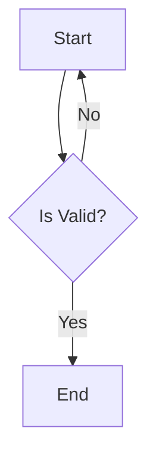
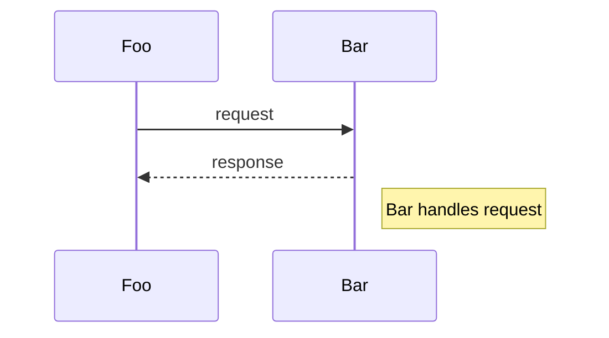
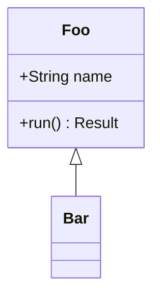
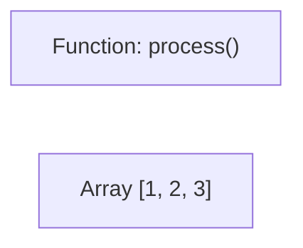
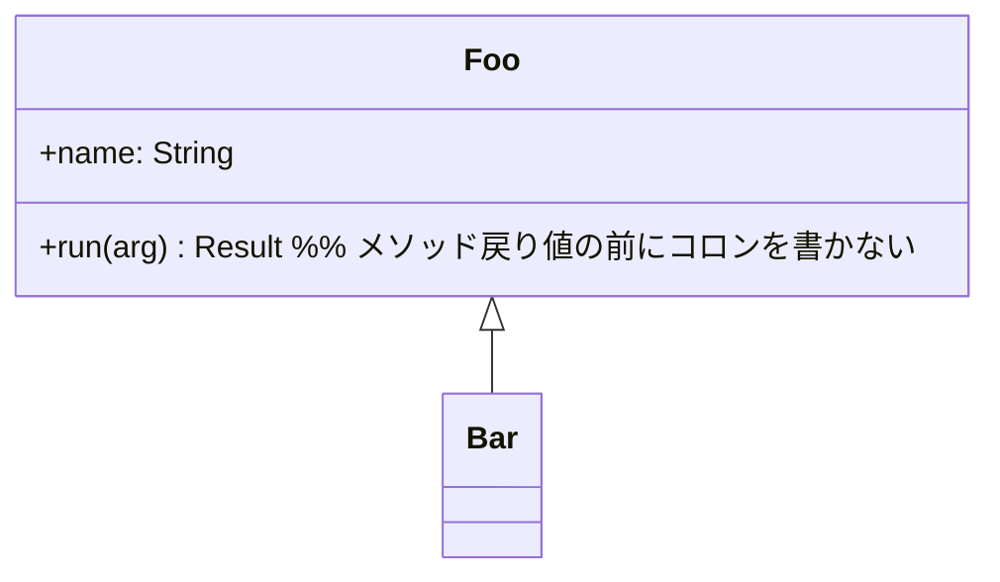
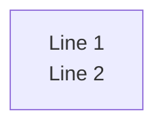
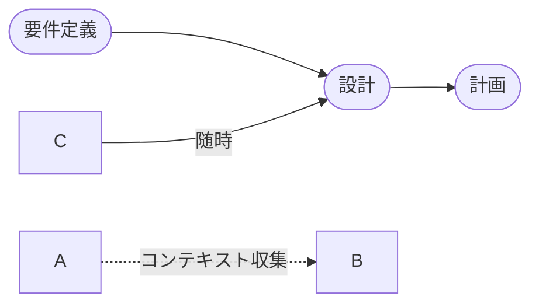

# Mermaid Diagram Skill

mermaid 図を書くとき、AI が見落としがちな暗黙ルールと、主要レンダラー固有の制約を最小セットで集めたチェックリスト。

## 公式仕様が最優先 [MANDATORY]

**NEVER skip.** このスキルは「公式 docs の代替」ではなく「公式 docs に書かれていない暗黙ルールの集約」。構文の詳細・最新版は必ず公式を参照すること。

### 一次情報

| 用途                       | URL                                                                                                         |
| -------------------------- | ----------------------------------------------------------------------------------------------------------- |
| flowchart                  | https://mermaid.js.org/syntax/flowchart.html                                                                |
| sequenceDiagram            | https://mermaid.js.org/syntax/sequenceDiagram.html                                                          |
| classDiagram               | https://mermaid.js.org/syntax/classDiagram.html                                                             |
| stateDiagram-v2            | https://mermaid.js.org/syntax/stateDiagram.html                                                             |
| erDiagram                  | https://mermaid.js.org/syntax/entityRelationshipDiagram.html                                                |
| gantt                      | https://mermaid.js.org/syntax/gantt.html                                                                    |
| mindmap                    | https://mermaid.js.org/syntax/mindmap.html                                                                  |
| GitHub の mermaid サポート | https://docs.github.com/en/get-started/writing-on-github/working-with-advanced-formatting/creating-diagrams |
| Live editor (要検証時)     | https://mermaid.live/                                                                                       |

### 想定バージョン

mermaid **v10 以降**。v11.3.0+ では `A@{ shape: rect }` 形式の汎用 shape 構文が追加されており、本スキルの記述と並行して利用可能。GitHub のレンダラーが採用している mermaid バージョンは GitHub 側で随時更新される (公式 docs に「バージョンを確認する」セクションあり)。

---

## クイックスタート

### Flowchart



### sequenceDiagram



### classDiagram



---

## Critical Rules

各 Rule は公式 docs の該当アンカーへのリンクを伴う。根拠を疑ったら一次情報を読むこと。

### Rule 1: ラベル内特殊文字のエスケープ

公式: https://mermaid.js.org/syntax/flowchart.html#entity-codes-to-escape-characters

mermaid syntax を壊しうる文字 (shape delimiter `[]` `()` `{}`、`#`、`;`、`&`) をラベル内に含めるときは:

**Option A: ダブルクォートで囲む (推奨)**



**Option B: HTML 数値文字参照を使う**

```mermaid
flowchart LR
    A[Function&#58; process&#40;&#41;]
```



公式の主要な entity:

| 文字 | entity   |
| ---- | -------- |
| `#`  | `&#35;`  |
| `;`  | `&#59;`  |
| `:`  | `&#58;`  |
| `(`  | `&#40;`  |
| `)`  | `&#41;`  |
| `[`  | `&#91;`  |
| `]`  | `&#93;`  |
| `{`  | `&#123;` |
| `}`  | `&#125;` |
| `"`  | `&quot;` |
| `&`  | `&amp;`  |

> **NEVER** ダブルクォート内にダブルクォートを直書きしない (`A["Say "Hi""]` は壊れる)。`&#34;` または `&quot;` を使う。

### Rule 2: 予約語 `end` (lowercase)

公式: https://mermaid.js.org/syntax/flowchart.html#word-end

```mermaid
flowchart LR
    Start --> End    %% OK
    Start --> END    %% OK
    Start --> end    %% NG (subgraph 終端と衝突)
```

**MUST** ノード ID として lowercase `end` を避ける。`End` / `END` / `EndNode` を使う。

### Rule 3: edge 開始の `o` / `x`

公式: https://mermaid.js.org/syntax/flowchart.html#unexpected-circle-or-cross-arrows

`---` `--` 直後に `o` / `x` がある ID は、circle/cross edge と解釈される:

```mermaid
flowchart LR
    A--- oBar    %% スペース必須。なしだと A o-- Bar の意味になる
    A---xBar     %% 同様、cross edge と誤解釈される
```

**対策**: スペースを挟むか、`Bar` ではなく `Item` のような別頭文字 ID にする。

### Rule 4: subgraph の構文 (ID は任意)

公式: https://mermaid.js.org/syntax/flowchart.html#subgraphs

```mermaid
flowchart TD
    subgraph "Group Title"    %% OK: ID 省略 (タイトルが ID 兼用)
        A[Foo]
        B[Bar]
    end
```

```mermaid
flowchart TD
    subgraph GRP["Group Title"]    %% OK: ID とタイトルを分離
        A[Foo]
    end

    OtherNode --> GRP    %% subgraph に edge を引きたい場合は ID が必須
```

**MUST**: **subgraph を別ノードから edge で参照する場合のみ、明示的な ID が必要**。それ以外は ID 省略でよい。

> ⚠️ 「subgraph には必ず ID を付けろ」は **誤った言説**。公式仕様では ID 省略形も valid。

### Rule 5: `Note` / `note` が使える diagram

| diagram         | 構文                                                    | 公式 docs アンカー                                       |
| --------------- | ------------------------------------------------------- | -------------------------------------------------------- |
| sequenceDiagram | `Note right of A: text`                                 | https://mermaid.js.org/syntax/sequenceDiagram.html#notes |
| stateDiagram-v2 | `note right of S1: text` / `note left of` / `note over` | https://mermaid.js.org/syntax/stateDiagram.html#comments |
| flowchart       | **未サポート** — 通常ノードで代用                       | -                                                        |
| classDiagram    | **未サポート** — `<<note>>` stereotype 等で代用         | -                                                        |

### Rule 6: classDiagram の前方参照と method 構文

公式: https://mermaid.js.org/syntax/classDiagram.html



### Rule 7: 改行は `<br/>`



`<br>` (閉じなし) も多くのレンダラーで通るが、HTML 互換性のため `<br/>` を推奨。

---

## GitHub Rendering Caveats [MANDATORY]

GitHub README / Issue / PR で mermaid を表示すると、内部で SVG 化のため `btoa()` が呼ばれる。`btoa()` は **Latin-1 範囲 (U+0000〜U+00FF) しか扱えない**ため、Latin-1 範囲外文字 (日本語、中国語、ハングル、絵文字、特殊ダッシュ等) を含むラベルでエラーになる:

```
Unable to render rich display
Failed to execute 'btoa' on 'Window': The string to be encoded contains characters outside of the Latin1 range.
```

### 対処 (優先順)

**1. ノードラベル/エッジラベルをダブルクォートで囲む**

mermaid 公式 (https://mermaid.js.org/syntax/flowchart.html#unicode-text) も Unicode テキストにはダブルクォート囲みを明示推奨。GitHub renderer も内部で entity 化して扱うため、これだけで通ることが多い:



> パイプ形エッジラベル `|...|` も `|"..."|` のように囲める。

**2. それでもエラーが消えないとき (renderer のバージョン差等)**

HTML 数値文字参照に変換すればソースが ASCII-only になり、btoa は確実に通る:

```mermaid
flowchart LR
    R(["&#35201;&#20214;&#23450;&#32681;"]) --> D(["&#35373;&#35336;"])
```



可読性が著しく落ちるので、**まず 1 を試し、解消しないときだけ 2 を採用**する。

### 影響範囲

- ✅ 影響あり: GitHub README.md / Issue / PR / Discussions (`.md` 表示)
- ❌ 影響なし: mermaid.live editor / VS Code preview / mkdocs-material 等の他レンダラー (`btoa` を使わないため)

### 検証手順

1. 変更前の図を https://mermaid.live/ に貼って構文が valid か確認
2. GitHub PR のプレビューで rich display エラーが出ないか確認
3. エラーが出たら、ASCII 外文字を含むラベル/エッジラベルにダブルクォート (or HTML entity) を適用

---

## Validation Checklist

mermaid 図を確定する前にチェック:

- [ ] ラベルに `:` `()` `[]` `{}` `#` `;` `&` を含むときダブルクォート or HTML entity を適用したか
- [ ] ノード ID に lowercase `end` を使っていないか
- [ ] edge 開始位置の `o` `x` (例: `A---oFoo`) でスペースを挟んだか
- [ ] subgraph に edge を引く場合、明示的 ID を付けたか
- [ ] `Note` keyword を flowchart / classDiagram で使っていないか (sequenceDiagram / stateDiagram-v2 のみ)
- [ ] classDiagram で関係を書く前に両端の class を宣言したか
- [ ] **(GitHub に貼る場合)** 非 ASCII 文字を含むラベル/エッジラベルをダブルクォートで囲んだか
- [ ] mermaid.live editor で render を確認したか

---

## トラブルシュート

実例ベースのエラーパターンは [common-errors.md](common-errors.md) を参照。

| エラーメッセージ                       | 推定原因                          | 対処                                               |
| -------------------------------------- | --------------------------------- | -------------------------------------------------- |
| `Parse error on line X`                | ラベル内の特殊文字                | Rule 1: ダブルクォート or HTML entity              |
| `Subgraph X not found`                 | subgraph ID 参照ミス              | Rule 4: edge で参照する subgraph には ID を付ける  |
| `Syntax error in graph`                | 予約語 `end` を node ID に使った  | Rule 2: `End` 等に rename                          |
| Unexpected circle/cross arrow          | edge 開始の `o`/`x`               | Rule 3: スペースを挟む                             |
| `Failed to execute 'btoa' on 'Window'` | GitHub renderer + 非 ASCII ラベル | GitHub Caveats: ダブルクォート or HTML entity      |
| `Note is not defined`                  | flowchart で Note keyword 使用    | Rule 5: 通常ノードで代用 or sequenceDiagram に変更 |

---

## 制限事項

このスキルは:

- **公式 docs の代替ではない**: 公式の `mermaid.js.org` を最優先で読むこと
- **網羅的なリファレンスではない**: 暗黙ルールと renderer 固有制約に絞っている
- **特定 mermaid バージョンに固定されていない**: GitHub の renderer バージョン更新で挙動が変わる可能性がある。違和感があれば mermaid.live で同じ図を render して renderer 差を切り分けること
