# mermaid: 実例ベースのエラーパターン集

[SKILL.md](SKILL.md) を読んだうえで、症状から逆引きしたいときに使う。本書のすべての例は汎用プレースホルダ (`Foo` / `Bar` / `Hoge`) を使い、特定プロジェクト固有の用語は使わない。

> **MUST**: 各エラーを直す前に [SKILL.md](SKILL.md) の Critical Rules と公式 docs (`mermaid.js.org`) を確認すること。本書は補助資料であり、公式仕様の代替ではない。

---

## 1. ラベル内特殊文字

### 1.1 コロン `:` を含むラベル

**症状**: `Parse error on line X`

**Broken**:

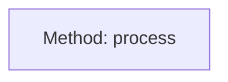

**Fixed (Option A: ダブルクォート)**:


**Fixed (Option B: HTML entity)**:

```mermaid
flowchart LR
    A[Method&#58; process]
```

公式: https://mermaid.js.org/syntax/flowchart.html#entity-codes-to-escape-characters

### 1.2 角括弧 `[]` を含むラベル

**Broken**:

```mermaid
flowchart LR
    A[Array [1, 2, 3]]
```

シェイプ delimiter と衝突する。

**Fixed**:

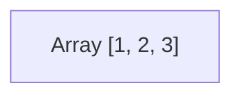

### 1.3 丸括弧 `()` を含むラベル

**Broken**:

```mermaid
flowchart LR
    A[method(arg)]
```

**Fixed**:

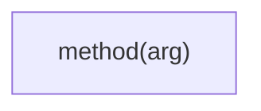

### 1.4 ダブルクォート内のダブルクォート

**Broken**:

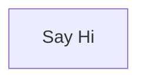

**Fixed**:

```mermaid
flowchart LR
    A["Say &quot;Hi&quot;"]
    B[Say &#34;Hi&#34;]
```

---

## 2. 予約語

### 2.1 lowercase `end` の使用

**Broken**:

```mermaid
flowchart TD
    Start --> end
```

`end` は subgraph 終端と衝突。

**Fixed**:

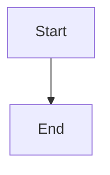

公式: https://mermaid.js.org/syntax/flowchart.html#word-end

---

## 3. edge 開始位置の `o` / `x`

**Broken**:

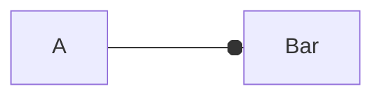

`A o-- Bar` (circle edge) と誤解釈される。

**Fixed (スペースを挟む)**:

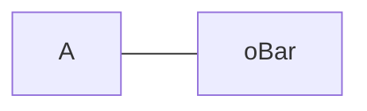

**Fixed (別頭文字)**:

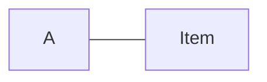

公式: https://mermaid.js.org/syntax/flowchart.html#unexpected-circle-or-cross-arrows

---

## 4. subgraph

### 4.1 ID は必須ではない (注意: 過去の誤解説の訂正)

`subgraph "Title"` は **valid な構文** (公式: https://mermaid.js.org/syntax/flowchart.html#subgraphs)。

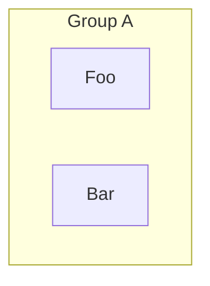

これは問題ない。「subgraph には必ず ID を付けろ」は古い誤った言説。

### 4.2 subgraph に edge を引く場合は ID が必要

**Broken** (subgraph に edge を引きたいのに ID なし):

```mermaid
flowchart TD
    subgraph "Group A"
        Foo
    end

    OtherNode --> Group A    %% スペースを含むため認識されない
```

**Fixed**:

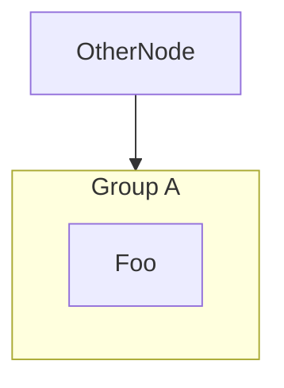

---

## 5. `Note` keyword の誤用

### 5.1 flowchart での Note は不可

**Broken**:

```mermaid
flowchart TD
    A[Foo]
    Note right of A: bad
```

**Fixed (通常ノード化)**:

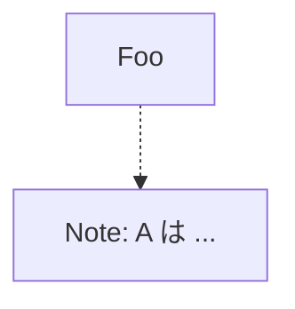

### 5.2 sequenceDiagram / stateDiagram-v2 では可

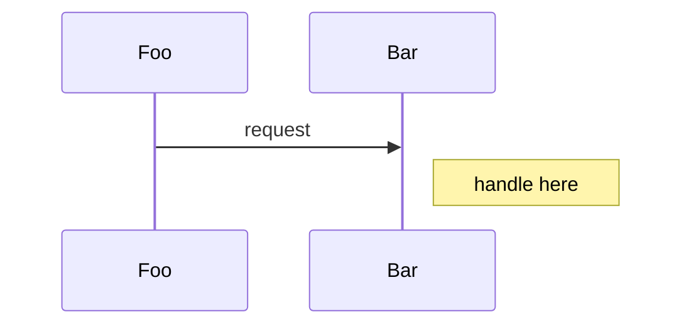

```mermaid
stateDiagram-v2
    [*] --> S1
    note right of S1: 起動直後の状態
```

公式:

- sequenceDiagram: https://mermaid.js.org/syntax/sequenceDiagram.html#notes
- stateDiagram: https://mermaid.js.org/syntax/stateDiagram.html#comments

---

## 6. classDiagram

### 6.1 前方参照

**Broken** (関係を書く時点で class 未定義):

```mermaid
classDiagram
    Foo <|-- Bar

    class Foo {
        +name
    }
```

**Fixed**:

```mermaid
classDiagram
    class Foo {
        +name
    }
    class Bar
    Foo <|-- Bar
```

### 6.2 method 戻り値の前のコロン

**Broken**:

```mermaid
classDiagram
    class Foo {
        run(arg): Result
    }
```

**Fixed**:

```mermaid
classDiagram
    class Foo {
        run(arg) Result
    }
```

戻り値の前にコロンを書かない。属性は `name: Type` でコロン可。

公式: https://mermaid.js.org/syntax/classDiagram.html#defining-a-class

---

## 7. edge label の特殊文字

**Broken**:

```mermaid
flowchart LR
    A -->|process()| B
```

**Fixed**:

```mermaid
flowchart LR
    A -->|"process()"| B
```

パイプ形 edge label `|...|` 内もダブルクォート可。

---

## 8. GitHub レンダラー: btoa Latin-1 エラー [MANDATORY]

GitHub README / Issue / PR で表示する mermaid に **日本語・中国語・絵文字・特殊ダッシュ等の Latin-1 範囲外文字**を含めると、内部の `btoa()` が失敗する:

```
Unable to render rich display
Failed to execute 'btoa' on 'Window': The string to be encoded contains characters outside of the Latin1 range.
```

### 8.1 ノードラベルの場合

**Broken** (日本語ラベル素のまま):

```mermaid
flowchart LR
    R([要件定義]) --> D([設計])
```

**Fixed (Option A: ダブルクォート)** ← まずこれを試す:

```mermaid
flowchart LR
    R(["要件定義"]) --> D(["設計"])
```

**Fixed (Option B: HTML entity)** ← Option A で解消しないとき:

```mermaid
flowchart LR
    R(["&#35201;&#20214;&#23450;&#32681;"]) --> D(["&#35373;&#35336;"])
```

### 8.2 エッジラベルの場合

**Broken**:

```mermaid
flowchart LR
    A -. コンテキスト収集 .-> B
    C --|随時|--> D
```

**Fixed**:

```mermaid
flowchart LR
    A -. "コンテキスト収集" .-> B
    C -->|"随時"| D
```

### 8.3 検証手順

1. https://mermaid.live/ で構文 valid を確認
2. GitHub の PR プレビュー or Gist で rich display エラーが出ないか確認
3. エラーが出たら Option A → Option B の順で適用

### 8.4 影響範囲

| 環境                                       | btoa エラー   | 対応必要       |
| ------------------------------------------ | ------------- | -------------- |
| GitHub (README / Issue / PR / Discussions) | あり          | 必要           |
| mermaid.live editor                        | なし          | 不要           |
| VS Code Markdown preview                   | なし          | 不要           |
| mkdocs-material / Docusaurus 等            | renderer 依存 | 各 docs を確認 |

---

## 9. ありがちな失敗パターン (上位 5 件)

実プロジェクトでの修正履歴ベース:

1. **特殊文字ノーガード**: コロン / 括弧をラベルに直書き → Rule 1 ダブルクォート
2. **GitHub btoa エラー**: 日本語ラベル素のまま → §8 ダブルクォート or HTML entity
3. **lowercase `end`**: ノード ID に `end` → `End` に rename
4. **subgraph ID 混乱**: 「ID を必ず付けろ」と思って必須化 → 「edge を引くときだけ必要」
5. **flowchart に Note 書く**: 通常ノードで代用

---

## 10. デバッグ戦略

エラー位置が分かりにくいときの定石:

1. **コメントアウトで二分探索**: 怪しいノード/エッジを `%%` でコメント化し、再 render
2. **シンプル化**: 全特殊文字を除き、最小構造で render → 通ったら incrementally に戻す
3. **mermaid.live で再現**: GitHub renderer の問題か mermaid 仕様の問題かを切り分け
4. **公式 docs を読む**: バージョンによる挙動差は公式の changelog で確認

---

## 参照

- [SKILL.md](SKILL.md) — Critical Rules と GitHub Caveats の本編
- 公式 docs: https://mermaid.js.org/
- GitHub mermaid サポート: https://docs.github.com/en/get-started/writing-on-github/working-with-advanced-formatting/creating-diagrams
