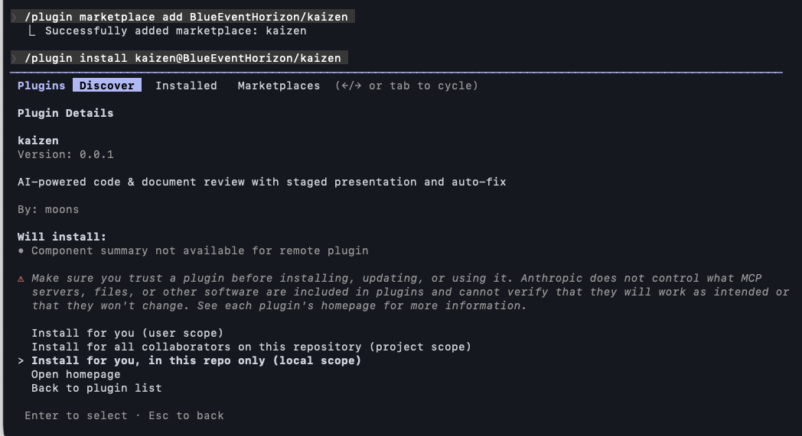

# bw-cc-plugins

A Claude Code plugin marketplace for AI-powered code & document review and project document structure management.

[Japanese README (README_ja.md)](README_ja.md)

## Plugins

| Plugin | Version | Description |
|--------|---------|-------------|
| **kaizen** | 0.0.4 | AI-powered code & document review with staged presentation, auto-fix, and document structure management |

## Installation

### Option A: Marketplace (persistent)

Inside a Claude Code session:

```
/plugin marketplace add BlueEventHorizon/bw-cc-plugins
/plugin install kaizen@bw-cc-plugins
```

If you already installed, from your terminal:

```bash
claude plugin enable kaizen@bw-cc-plugins
```



`marketplace add` registers the GitHub repo as a plugin source (once per user). Once installed, the plugin is always available.

### Option B: Local directory (per session)

```bash
git clone https://github.com/BlueEventHorizon/bw-cc-plugins.git
claude --plugin-dir ./bw-cc-plugins/plugins/kaizen
```

> **Note**: `--plugin-dir` is session-only. You must specify it every time you start Claude Code. To unload, simply start without the flag.

### Update

From your terminal:

```bash
claude plugin update kaizen@bw-cc-plugins --scope local
```

## kaizen

AI-powered code & document review with staged presentation and auto-fix. Also manages project document structure via `.doc_structure.yaml`.

### Usage

```
/kaizen:review <type> [target] [--engine] [--auto-fix]
```

| Argument | Values |
|----------|--------|
| type | `code` \| `requirement` \| `design` \| `plan` \| `generic` |
| target | File path(s), directory, feature name, or omit for interactive |
| engine | `--codex` (default) \| `--claude` |
| mode | `--auto-fix` (auto-fix critical issues) |

### Examples

```bash
# Review source files in a directory
/kaizen:review code src/

# Review a specific file
/kaizen:review code src/services/auth.swift

# Review requirements by feature name
/kaizen:review requirement login

# Review a design document
/kaizen:review design specs/login/design/login_design.md

# Review a plan with auto-fix
/kaizen:review plan specs/login/plan/login_plan.md --auto-fix

# Review any document
/kaizen:review generic README.md

# Review branch diff (no target = current branch changes)
/kaizen:review code

# Use Claude engine instead of Codex
/kaizen:review code src/ --claude

# Create or update .doc_structure.yaml interactively
/kaizen:init-kaizen
```

### Skills

| Skill | User-invocable | Description |
|-------|---------------|-------------|
| `review` | Yes | Main review skill. Detects review type, collects references, and executes review |
| `init-kaizen` | Yes | Scans project directories, classifies them as rules/specs, and generates `.doc_structure.yaml` |
| `present-findings` | No (AI only) | Presents review findings interactively, one item at a time |
| `fix-findings` | No (AI only) | Fixes issues based on review findings with reference doc collection (DocAdvisor or .doc_structure.yaml) |

### Review Types

| Type | Target |
|------|--------|
| `code` | Source code files and directories |
| `requirement` | Requirements documents |
| `design` | Design documents |
| `plan` | Development plans |
| `generic` | Any document (rules, skills, READMEs, etc.) |

### Severity Levels

| Level | Meaning |
|-------|---------|
| Critical | Must fix. Bugs, security issues, data loss risks, spec violations |
| Major | Should fix. Coding standards, error handling, performance |
| Minor | Nice to have. Readability, refactoring suggestions |

### Review Criteria

The plugin includes default review criteria in `defaults/review_criteria.md`. Projects can override this by:

1. **DocAdvisor**: If the project has DocAdvisor skills (`/query-rules`), the plugin queries them for project-specific review criteria
2. **Project config**: Save a custom path in `.claude/review-config.yaml`
3. **Plugin default**: Falls back to the bundled `defaults/review_criteria.md`

### Document Structure (.doc_structure.yaml)

The `init-kaizen` skill scans project directories for markdown files, classifies them interactively, and generates `.doc_structure.yaml`. kaizen reads this file directly to collect reference documents during review and fix operations.

See [docs/specs/design/doc_structure_format.md](docs/specs/design/doc_structure_format.md) for the full schema specification.

```yaml
version: "1.0"

specs:
  requirement:
    paths: [specs/requirements/]
  design:
    paths: [specs/design/]

rules:
  rule:
    paths: [rules/]
```

## Requirements

- [Claude Code](https://claude.ai/code) CLI
- Python 3 (for init-kaizen scan)
- [Codex CLI](https://github.com/openai/codex) (optional, for Codex engine; falls back to Claude if unavailable)

## License

[MIT](LICENSE)
