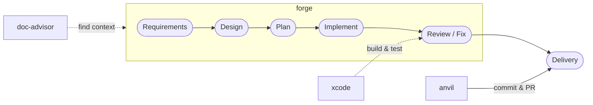

# bw-cc-plugins

A Claude Code plugin marketplace for Spec-Driven Development — from requirements and design through implementation, review, and delivery.

**Marketplace version: 0.1.3**

[Japanese README (README_ja.md)](README_ja.md)

## Workflow



## Plugins

| Plugin    | Version | Description                                                                                                   |
| --------- | ------- | ------------------------------------------------------------------------------------------------------------- |
| **forge** | 0.0.29  | AI-powered document lifecycle tool. Create, review, and auto-fix requirements/design/plan docs and code. |
| **anvil** | 0.0.4   | GitHub operations toolkit. Create PRs, manage issues, and automate GitHub workflows.                          |
| **xcode** | 0.0.1   | Xcode build and test toolkit. Build and test iOS/macOS projects with automatic platform detection.            |
| **doc-advisor** | 0.1.7 | AI-searchable document index with dual search — keyword (ToC) and semantic (OpenAI Embedding). Auto-discovers relevant rules and specs for any task. |

## Skills

### forge

> [Detailed Guide](docs/readme/README_forge.md) — Usage, examples, review types, severity levels, review criteria

| Skill | Description | Trigger |
|-------|-------------|---------|
| [**review**](docs/readme/README_forge.md#review) | Review code & docs with 🔴🟡🟢 severity. Auto-fix with `--auto N`. 5 types | `"レビュー"` `"review"` |
| [**setup-doc-structure**](docs/readme/README_forge.md#setup-doc-structure) | Generate `.doc_structure.yaml` + scaffold missing doc directories | `"forge の初期設定"` |
| [**start-requirements**](docs/readme/README_forge.md#start-requirements) | Create requirements docs via dialog, reverse-engineering, or Figma | `/forge:start-requirements` |
| [**start-design**](docs/readme/README_forge.md#start-design) | Create design documents from requirements | `"設計書作成"` |
| [**start-plan**](docs/readme/README_forge.md#start-plan) | Create or update implementation plan from design documents | `"計画書作成"` |
| [**start-implement**](docs/readme/README_forge.md#start-implement) | Select tasks from a plan, implement, review, and update | `"実装開始"` |
| [**start-uxui-design**](docs/readme/README_forge.md#start-uxui-design) | Create design tokens & component specs from requirements with UX evaluation (iOS/macOS) | `"UXUIデザイン"` |
| [**setup-version-config**](docs/readme/README_forge.md#setup-version-config) | Scan project and generate `.version-config.yaml` | `"version config を作成"` |
| [**update-version**](docs/readme/README_forge.md#update-version) | Bump version across files. patch/minor/major/direct | `"バージョン更新"` |
| [**clean-rules**](docs/readme/README_forge.md#clean-rules) | Analyze and reorganize project rules/ | `"rules を整理"` |
| [**help**](docs/readme/README_forge.md#help) | Interactive help wizard | `"forge help"` |
| *reviewer* | Execute review for a single perspective. AI-only, called by review orchestrator | — |
| *evaluator* | Scrutinize review findings and determine fix/skip/confirm. AI-only | — |
| *fixer* | Fix issues based on review findings. AI-only | — |
| *present-findings* | Present review findings interactively, one item at a time. AI-only | — |
| *doc-structure* | Parse and resolve paths from `.doc_structure.yaml`. AI-only utility | — |

### anvil

> [Detailed Guide](docs/readme/README_anvil.md) — Usage and examples

| Skill | Description | Trigger |
|-------|-------------|---------|
| [**commit**](docs/readme/README_anvil.md#commit) | Generate commit message from changes, commit & push | `"コミットして"` `"commit して"` |
| [**create-pr**](docs/readme/README_anvil.md#create-pr) | Create a GitHub draft PR with auto-generated title/body | `"PR を作成"` `"create-pr"` |

### xcode

> [Detailed Guide](docs/readme/README_xcode.md) — Usage and examples

| Skill | Description | Trigger |
|-------|-------------|---------|
| [**build**](docs/readme/README_xcode.md#build) | Build Xcode project with auto platform detection (iOS/macOS) | `"ビルド"` `"build"` |
| [**test**](docs/readme/README_xcode.md#test) | Run Xcode tests with simulator auto-detection for iOS | `"テスト"` `"test"` |

### doc-advisor

> [Detailed Guide](docs/readme/README_doc-advisor.md) — Usage and examples

| Skill | Description | Trigger |
|-------|-------------|---------|
| [**query-rules**](docs/readme/README_doc-advisor.md#query-rules) | Search rules with ToC (keyword), Index (semantic), or hybrid mode | `"What rules apply?"` `"ルール確認"` |
| [**query-specs**](docs/readme/README_doc-advisor.md#query-specs) | Search specs with ToC (keyword), Index (semantic), or hybrid mode | `"What specs apply?"` `"仕様確認"` |
| [**create-rules-toc**](docs/readme/README_doc-advisor.md#create-rules-toc) | Update the rules search index (ToC) after modifying rule documents | `"Rebuild the rules ToC"` |
| [**create-specs-toc**](docs/readme/README_doc-advisor.md#create-specs-toc) | Update the specs search index (ToC) after modifying spec documents | `"Rebuild the specs ToC"` |

> **Bold** = user-invocable, *Italic* = AI-only (called internally by other skills)

## Installation

### Option A: Marketplace (persistent)

Inside a Claude Code session:

```
/plugin marketplace add BlueEventHorizon/bw-cc-plugins
/plugin install forge@bw-cc-plugins
/plugin install anvil@bw-cc-plugins
/plugin install doc-advisor@bw-cc-plugins
/plugin install xcode@bw-cc-plugins
```

To re-enable a disabled plugin, from your terminal:

```bash
claude plugin enable forge@bw-cc-plugins
```

`marketplace add` registers the GitHub repo as a plugin source (once per user). Once installed, the plugin is always available.

### Option B: Local directory (per session)

```bash
git clone https://github.com/BlueEventHorizon/bw-cc-plugins.git
claude --plugin-dir ./bw-cc-plugins/plugins/forge
```

> **Note**: `--plugin-dir` is session-only. You must specify it every time you start Claude Code. To unload, simply start without the flag.

### Update

From your terminal:

```bash
claude plugin update forge@bw-cc-plugins --scope local
```

## Document Structure (.doc_structure.yaml)

`/forge:setup-doc-structure` scans your project and generates `.doc_structure.yaml`, which forge uses to locate reference documents during review and fix operations.
→ [Schema reference](docs/specs/forge/design/doc_structure_format.md)

## Git Information Cache (.git_information.yaml)

On first run, `/anvil:create-pr` detects your GitHub repo from `git remote` and offers to save the settings to `.git_information.yaml` for future use.

## Requirements

- [Claude Code](https://claude.ai/code) CLI
- Python 3 (for setup scan)
- [Codex CLI](https://github.com/openai/codex) (optional, for Codex engine; falls back to Claude if unavailable)
- OpenAI API key (for doc-advisor embedding features; set `OPENAI_API_KEY`)
- [gh CLI](https://cli.github.com/) (for anvil, authenticated)
- Xcode with `xcodebuild` (for xcode plugin)

## License

[MIT](LICENSE)
