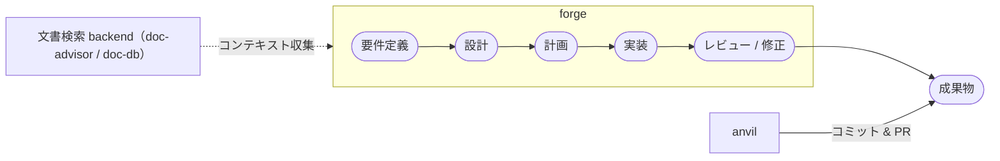
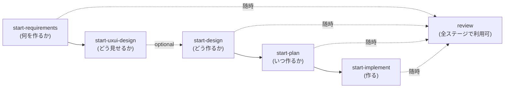

# bw-cc-plugins

[](LICENSE)

**仕様駆動開発（Spec-Driven Development）** のための Claude Code プラグイン — 仕様を先に書き、AI がフルコンテキストで実装・レビューする。

**マーケットプレイスバージョン: 0.3.2**

マーケットプレイスは **2 つのプラグイン**（forge、anvil）で構成される。forge の検索系スキルは、順序リストに基づいて文書検索 backend（**doc-advisor** / **doc-db**）を選択する。既定は doc-advisor 先位で、`.claude/.forge.yaml` の `doc_backend.prefer` で変更できる。doc-advisor は別リポジトリ [BlueEventHorizon/DocAdvisor](https://github.com/BlueEventHorizon/DocAdvisor) が提供する（`index-docs` / `query-docs`）。

[English README (README_en.md)](README_en.md)

## 仕様駆動開発とは

仕様駆動開発は、すべてのコード変更を書かれた仕様に遡れるワークフローである。**forge** が要件定義・設計・計画・実装・レビューの5段階を導き、AI が場当たり的な指示ではなく明文化された意図に基づいて作業する。各段階で文書が生まれ、次の段階の入力になる。結果として追跡可能で監査可能な成果物が得られる — コードがなぜ存在するかを常に説明できる。

→ 哲学と追加開発ワークフローの詳細は [仕様駆動開発ガイド](docs/readme/guide_sdd_ja.md) を参照。

## 文書検索 backend（doc-advisor / doc-db）の役割

プロジェクトが大きくなると、ルール・規約・設計文書が蓄積される。AI がそれらを見つけられなければ活用できない。文書検索 backend はこれらの文書をインデックス化し、forge の重要な場面で自動的に提供する:

- **実装時** — コードを書く前にプロジェクト固有の実装ルールと関連仕様を収集する。
- **レビュー時** — 適用すべきルールをレビュー観点として追加し、汎用的なベストプラクティスではなくプロジェクトの実際の基準で検査する。

forge の `/forge:query-db-rules` / `/forge:query-db-specs` / `/forge:update-db-rules` / `/forge:update-db-specs` は、順序リストに基づいて backend を選択して検索・索引更新を実行する。backend は 2 つある:

- **doc-advisor**（外部プラグイン。[BlueEventHorizon/DocAdvisor](https://github.com/BlueEventHorizon/DocAdvisor)）— 文書を ToC（キーワード／メタデータ）でインデックス化する
- **doc-db** — ローカルで稼働する文書検索サーバ

既定の選択順序は doc-advisor 先位で、`.claude/.forge.yaml` の `doc_backend.prefer` で変更できる。先位の backend を利用できない場合は理由を通知して後位の backend を利用する。これによりコンテキストの欠損がなくなる — AI がシニアメンバーと同じ知識で実装・レビューできるようになる。

## ワークフロー


```mermaid
flowchart LR
    subgraph forge
        R(["要件定義"]) --> D(["設計"]) --> P(["計画"]) --> I(["実装"]) --> RF(["レビュー / 修正"])
    end
    RF --> DL(["成果物"])
    DA["文書検索 backend（doc-advisor / doc-db）"] -. "コンテキスト収集" .-> forge
    AV[anvil] -- "コミット & PR" --> DL
```

## プラグイン一覧

| プラグイン | バージョン | 説明                                                                                                                    |
| ---------- | ---------- | ----------------------------------------------------------------------------------------------------------------------- |
| **forge**  | 0.4.2      | AI によるドキュメントライフサイクルツール。要件定義・設計・計画書の作成、コード・文書レビュー、自動修正、品質確定に対応 |
| **anvil**  | 0.1.1      | GitHub 操作ツールキット。PR 作成、Issue 管理、GitHub ワークフロー自動化に対応                                           |

> **文書検索 backend（doc-advisor / doc-db）は外部依存**: doc-advisor は別リポジトリ [BlueEventHorizon/DocAdvisor](https://github.com/BlueEventHorizon/DocAdvisor) として配布される。インストールは `/plugin marketplace add BlueEventHorizon/DocAdvisor` → `/plugin install doc-advisor@DocAdvisor`。doc-db はローカルで稼働する文書検索サーバで、`doc-db` コマンドとして導入されていれば利用可能な候補として扱われ、順序リストに従って選択されたときに forge が自動的に起動・利用する。いずれの backend もバージョンを条件にせず、必要な機能が利用できるかで判定する。

## スキル一覧

### forge

> Feature と文書構造管理の詳細は [文書構造ガイド](docs/readme/guide_doc_structure_ja.md) を参照。

#### パイプライン


```mermaid
flowchart LR
    REQ["start-requirements<br/>(何を作るか)"]
    UXUI["start-uxui-design<br/>(どう見せるか)"]
    DES["start-design<br/>(どう作るか)"]
    PLAN["start-plan<br/>(いつ作るか)"]
    IMPL["start-implement<br/>(作る)"]

    REQ --> UXUI -.->|optional| DES --> PLAN --> IMPL

    REV["review<br/>(全ステージで利用可)"]
    REQ & DES & PLAN & IMPL -.->|"随時"| REV
```

| 段階          | スキル             | 入力                        | 出力                       |
| ------------- | ------------------ | --------------------------- | -------------------------- |
| 要件定義      | start-requirements | 対話 / ソースコード / Figma | 要件定義書（Markdown）     |
| UXUI デザイン | start-uxui-design  | 要件定義書の ASCII アート   | デザイントークン + UI 仕様 |
| 設計          | start-design       | 要件定義書                  | 設計書（Markdown）         |
| 計画          | start-plan         | 設計書                      | 計画書（YAML）             |
| 実装          | start-implement    | 計画書                      | コード + 進捗更新          |
| レビュー      | review             | コード / 文書               | 指摘 + 修正                |

#### はじめかた

```bash
# 1. プロジェクト設定（初回のみ）
/forge:setup-doc-structure

# 2. 要件定義から実装まで
/forge:start-requirements my-feature --mode interactive --new
/forge:start-design my-feature
/forge:start-plan my-feature
/forge:start-implement my-feature

# 3. レビュー（随時）
/forge:review code --files src/foo.py,src/bar.py --auto
/forge:review design --dirs docs/specs/my-feature/design/
```

#### スキル一覧

| スキル                                                                                    | 説明                                                                                                                                                                                                                                                                                                                                                                                                                 | トリガー                            |
| ----------------------------------------------------------------------------------------- | -------------------------------------------------------------------------------------------------------------------------------------------------------------------------------------------------------------------------------------------------------------------------------------------------------------------------------------------------------------------------------------------------------------------- | ----------------------------------- |
| [**review**](docs/readme/forge/guide_review_ja.md)                                        | レビュー依頼の組み立てと所見の評価・修正・再依頼・完了判定をスキルの実行側が駆動し、レビュアーとの往復はレビューバックエンド SKILL へ委譲。`--backend` で指定、未指定なら候補を順に可用性検査（既定は外部依存を持たない agent-review、次に常駐 Codex を使う msg-review）。依頼/再開の2モード（再開は履歴復元に対応するバックエンドのみ）。`--secrets` で機密情報スキャン、`--scope` で到達目標と意図的な未実装を明示 | `"レビューして"`                    |
| **talk-to-codex**                                                                         | msg-sys 通信基盤上で常駐 Codex と、findings/完了判定契約を持たない自由な相談・会話を1往復単位で行う                                                                                                                                                                                                                                                                                                                  | `"Codexに相談したい"`               |
| [**start-requirements**](docs/readme/forge/guide_create_docs_ja.md#start-requirements)    | 対話・ソース解析・Figma の 3 モードで要件定義書を作成                                                                                                                                                                                                                                                                                                                                                                | `"要件定義"`                        |
| [**start-design**](docs/readme/forge/guide_create_docs_ja.md#start-design)                | 要件定義書から設計書を作成。既存資産の再利用を重視                                                                                                                                                                                                                                                                                                                                                                   | `"設計書作成"`                      |
| [**start-plan**](docs/readme/forge/guide_create_docs_ja.md#start-plan)                    | 設計書からタスクを抽出し YAML 計画書を作成                                                                                                                                                                                                                                                                                                                                                                           | `"計画書作成"`                      |
| [**start-implement**](docs/readme/forge/guide_implement_ja.md)                            | 計画書のタスクを選択し、実装・レビュー・計画書更新を一連で実行                                                                                                                                                                                                                                                                                                                                                       | `"実装開始"`                        |
| [**start-uxui-design**](docs/readme/forge/guide_uxui_design_ja.md)                        | 要件定義書からデザイントークン・UI 仕様を UX 評価付きで創造                                                                                                                                                                                                                                                                                                                                                          | `"UXUIデザイン"`                    |
| **create-feature-from-markdown-plan**                                                     | Claude plan mode の Markdown plan から要件定義書 → 設計書を一気通貫で作成（forge 実装計画書 `{feature}_plan.yaml` は対象外）                                                                                                                                                                                                                                                                                         | `"markdown plan から feature 作成"` |
| **merge-specs**                                                                           | 2 つの仕様 DIR（基本 / 追加）の齟齬を内容単位で解消。追加側を正として基本側を更新し、同一スコープの新規分のみ移す（別スコープは分離維持）                                                                                                                                                                                                                                                                            | `"spec をマージ"`                   |
| [**setup-doc-structure**](docs/readme/guide_doc_structure_ja.md#forgesetup-doc-structure) | `.doc_structure.yaml` 生成 + ディレクトリ scaffold                                                                                                                                                                                                                                                                                                                                                                   | `"初期設定"`                        |
| [**setup-version-config**](docs/readme/forge/guide_setup_ja.md#setup-version-config)      | `.version-config.yaml` 生成・更新                                                                                                                                                                                                                                                                                                                                                                                    | `"バージョン設定"`                  |
| [**update-version**](docs/readme/forge/guide_setup_ja.md#update-version)                  | バージョン一括更新。patch/minor/major/直接指定                                                                                                                                                                                                                                                                                                                                                                       | `"バージョン更新"`                  |
| [**clean-rules**](docs/readme/forge/guide_setup_ja.md#clean-rules)                        | rules/ を分類学に基づいて分析・再構築                                                                                                                                                                                                                                                                                                                                                                                | `"rules を整理"`                    |
| [**help**](docs/readme/forge/guide_setup_ja.md#help)                                      | インタラクティブヘルプ                                                                                                                                                                                                                                                                                                                                                                                               | `"ヘルプ"`                          |
| **onboarding**                                                                            | セッション起動直後に 1 回実行。スキルを経由しない直接作業でも守るべき基盤文書を全件 Read し、規範をプロジェクトの CLAUDE.md へ承認のうえ転記する                                                                                                                                                                                                                                                                     | `"作業をやって"`                    |
| [_doc-structure_](docs/readme/guide_doc_structure_ja.md)                                  | `.doc_structure.yaml` のパース・パス解決                                                                                                                                                                                                                                                                                                                                                                             | ※ 各オーケストレーターが呼び出し    |
| [_next-spec-id_](docs/readme/forge/guide_create_docs_ja.md)                               | 全ブランチをスキャンして仕様書 ID の次番を取得                                                                                                                                                                                                                                                                                                                                                                       | ※ start-requirements が呼び出し     |

### anvil

> [詳細ガイド](docs/readme/guide_anvil_ja.md) — 使い方、使用例

| スキル                                                   | 説明                                                                                      | トリガー                            |
| -------------------------------------------------------- | ----------------------------------------------------------------------------------------- | ----------------------------------- |
| [**commit**](docs/readme/guide_anvil_ja.md#commit)       | 変更内容からコミットメッセージを自動生成し commit & push                                  | `"コミットして"`                    |
| [**create-pr**](docs/readme/guide_anvil_ja.md#create-pr) | GitHub PR をドラフト作成。コミット差分からタイトル/本文を自動生成                         | `"PR を作成"`                       |
| **create-issue**                                         | 問題・背景・原因を整理して GitHub Issue を作成（解決策は impl-issue が担当）              | `"issue を作成"`                    |
| **triage-issue**（試作）                                 | 開発フローの分岐点。軽量実装なら impl-issue を起動、SDD なら forge エントリポイントを提案 | `"このIssueをトリアージして"`       |
| _impl-issue_                                             | GitHub Issue から実装計画策定→ブランチ作成→実装→PR 作成までを一貫実行（UI Issue 対応）    | ※ triage-issue が呼び出し           |
| **capture-emulator-screen**                              | Android Emulator / iOS Simulator 上で実装済みアプリ画面を起動・操作・キャプチャ           | ※ sync-screen-design 等から呼び出し |
| **sync-screen-design**                                   | 画面設計書・Figma・実装キャプチャの三点突合で実装画面を仕様とデザインに同期               | `"Figma 通りに直して"`              |
| _figma-mcp-guide_                                        | Figma MCP サーバーの公式知識ベース。get_design_context / get_screenshot 等のツール仕様    | ※ 他スキルが参照                    |
| _prepare-figma_                                          | Figma デザインからデザイン仕様書を作成。nodeId 検証とプレビュー突合まで                   | ※ impl-issue が呼び出し             |
| _resolve-figma-node_                                     | 画面名/ID から Figma 内の正しい nodeId と URL を PAT で検証して特定                       | ※ prepare-figma 等が呼び出し        |

> **太字** = ユーザー起動可能、_斜体_ = AI 専用（他スキルから内部的に呼び出される）

### 文書検索 backend（doc-advisor / doc-db、外部）

文書検索は 2 つの backend が提供する。doc-advisor は別リポジトリ [BlueEventHorizon/DocAdvisor](https://github.com/BlueEventHorizon/DocAdvisor) のプラグイン（`index-docs` / `query-docs`。詳細は同リポジトリの README を参照）、doc-db はローカルで稼働する文書検索サーバ。forge の `/forge:query-db-rules` 等が順序リストに基づいて選択して呼び出す（既定は doc-advisor 先位。`.claude/.forge.yaml` の `doc_backend.prefer` で変更可）。

## インストール

### 方法 A: マーケットプレイス経由（永続）

Claude Code セッション内で:

```
/plugin marketplace add BlueEventHorizon/bw-cc-plugins
/plugin install forge@bw-cc-plugins
/plugin install anvil@bw-cc-plugins

# 文書検索 backend の doc-advisor は別マーケットプレイス
/plugin marketplace add BlueEventHorizon/DocAdvisor
/plugin install doc-advisor@DocAdvisor
```

もう 1 つの文書検索 backend である doc-db を使う場合は、`doc-db` コマンドを PATH に導入する。導入すると利用可能な候補として扱われ、順序リストに従って選択されたときに forge が自動的に起動・利用する（既定は doc-advisor 先位のため、doc-db を先に使うには `.claude/.forge.yaml` で `doc_backend.prefer: doc-db` を指定する。doc-advisor が利用不能な場合にも選択される）。

`/plugin install` を実行するとインストールスコープの選択を求められます（`--scope` で直接指定することも可能）:

```bash
/plugin install forge@bw-cc-plugins --scope user     # 自分の全プロジェクトで使う
/plugin install forge@bw-cc-plugins --scope project  # このリポのチーム全員で使う
/plugin install forge@bw-cc-plugins --scope local    # このリポで自分だけ使う
```

| スコープ    | 対象範囲                 | チーム共有           | 設定保存先                    |
| ----------- | ------------------------ | -------------------- | ----------------------------- |
| **user**    | 自分・全プロジェクト     | なし                 | `~/.claude/settings.json`     |
| **project** | このリポジトリの全員     | あり（git コミット） | `.claude/settings.json`       |
| **local**   | 自分・このリポジトリのみ | なし（gitignore）    | `.claude/settings.local.json` |

- **全プロジェクトで常に使いたい** → **user**
- **このリポジトリのチーム全員に配布したい** → **project**
- **このリポジトリで自分だけ使いたい** → **local**

> **注意**: 同じプラグインをすでにインストール済みの場合、別スコープで再インストールはできません。スコープを変更するには先にアンインストールしてから再インストールしてください。

特定のプロジェクトで無効化したい場合は `/plugin disable forge@bw-cc-plugins` を実行してください。

無効化したプラグインを再有効化するには、ターミナルから:

```bash
claude plugin enable forge@bw-cc-plugins
```

`marketplace add` は GitHub リポジトリをプラグイン取得元として登録します（ユーザーごとに1回）。

### 方法 B: ローカルディレクトリ（セッション限定）

```bash
git clone https://github.com/BlueEventHorizon/bw-cc-plugins.git
claude --plugin-dir ./bw-cc-plugins/plugins/forge
```

> **注意**: `--plugin-dir` はセッション限定です。Claude Code を起動するたびに指定が必要です。解除するには、フラグなしで起動するだけです。

### 更新

ターミナルから（スコープはインストール時に選択したものを指定）:

```bash
claude plugin update forge@bw-cc-plugins --scope user    # user スコープの場合
claude plugin update forge@bw-cc-plugins --scope project  # project スコープの場合
claude plugin update forge@bw-cc-plugins --scope local    # local スコープの場合
```

## 文書構造管理 (.doc_structure.yaml)

`.doc_structure.yaml` はプロジェクトのドキュメント配置場所と種別を宣言する設定ファイル。forge が参照する（`/forge:update-db-rules` 等が対象パスを解決して、選択した文書検索 backend に渡す）。`/forge:setup-doc-structure` で生成する。
→ [文書構造ガイド](docs/readme/guide_doc_structure_ja.md) | [スキーマ仕様](plugins/forge/docs/doc_structure_format.md)

## Git 情報キャッシュ (.git_information.yaml)

`/anvil:create-pr` の初回実行時に `git remote` から GitHub リポジトリを検出し、`.git_information.yaml` への設定保存を提案します。

## 動作要件

- [Claude Code](https://claude.ai/code) CLI
- Python 3（setup スキャン用）
- [Codex CLI](https://github.com/openai/codex)（任意。常駐 Codex セッションを使うレビューバックエンド `msg-review` と `/forge:talk-to-codex` に必要。未導入なら `msg-review` は候補として利用不可になる）
- 文書検索を使う場合はいずれかの backend: 外部 [doc-advisor](https://github.com/BlueEventHorizon/DocAdvisor)（Python 標準ライブラリのみ・追加 API キー不要）、または doc-db（ローカル文書検索サーバ）
- [gh CLI](https://cli.github.com/)（anvil 用、認証済み）

## ライセンス

[MIT](LICENSE)
