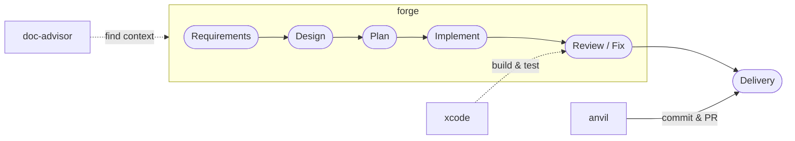
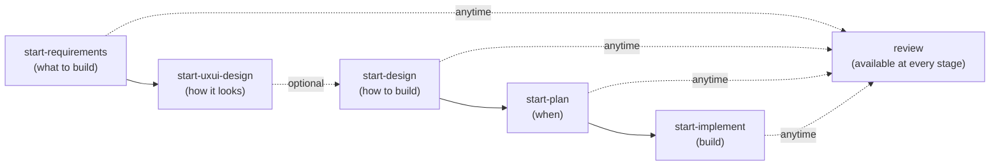

# bw-cc-plugins

Claude Code plugins for **Spec-Driven Development** — write specs first, then let AI implement and review with full context.

**Marketplace version: 0.1.10**

[Japanese README (README.md)](README.md)

## What is Spec-Driven Development?

Spec-Driven Development is a workflow where every code change traces back to a written specification. **forge** guides you through five stages — requirements, design, plan, implement, and review — so that AI always works from explicit, reviewable intent rather than ad-hoc instructions. Each stage produces a document; each document feeds the next stage. The result is traceable, auditable delivery: you can always answer *why* a piece of code exists.

## The Role of doc-advisor

Large projects accumulate rules, standards, and design documents that AI cannot use if it cannot find them. **doc-advisor** indexes these documents (via ToC keyword search and OpenAI Embedding semantic search) and automatically supplies the relevant ones to forge at the moments that matter:

- **During implementation** — project-specific coding rules and related specs are collected before a single line is written.
- **During review** — applicable rules are added as review perspectives, so reviews check against your actual standards, not generic best practices.

This eliminates context gaps: AI implements and reviews with the same knowledge a senior team member would have.

## Workflow



## Plugins

| Plugin    | Version | Description                                                                                                   |
| --------- | ------- | ------------------------------------------------------------------------------------------------------------- |
| **forge** | 0.0.34  | AI-powered document lifecycle tool. Create, review, and auto-fix requirements/design/plan docs and code. |
| **anvil** | 0.0.4   | GitHub operations toolkit. Create PRs, manage issues, and automate GitHub workflows.                          |
| **xcode** | 0.0.1   | Xcode build and test toolkit. Build and test iOS/macOS projects with automatic platform detection.            |
| **doc-advisor** | 0.2.1 | AI-searchable document index with dual search — keyword (ToC) and semantic (OpenAI Embedding). Auto-discovers relevant rules and specs for any task. |

## Skills

### forge

> For Feature management and document structure details, see the [Document Structure Guide](docs/readme/guide_doc_structure.md).

#### Pipeline



| Stage | Skill | Input | Output |
|-------|-------|-------|--------|
| Requirements | start-requirements | Dialog / source code / Figma | Requirements docs (Markdown) |
| UXUI Design | start-uxui-design | ASCII art from requirements | Design tokens + UI specs |
| Design | start-design | Requirements docs | Design docs (Markdown) |
| Plan | start-plan | Design docs | Plan (YAML) |
| Implementation | start-implement | Plan | Code + progress updates |
| Review | review | Code / documents | Findings + fixes |

#### Getting Started

```bash
# 1. Project setup (first time only)
/forge:setup-doc-structure

# 2. Requirements through implementation
/forge:start-requirements my-feature --mode interactive --new
/forge:start-design my-feature
/forge:start-plan my-feature
/forge:start-implement my-feature

# 3. Review (anytime)
/forge:review code src/ --auto
```

#### Skills

| Skill | Description | Trigger |
|-------|-------------|---------|
| [**review**](docs/readme/forge/guide_review.md) | Review code & docs with 🔴🟡🟢 severity. Auto-fix with `--auto N` | `"review"` |
| [**show-browser**](docs/readme/forge/guide_review.md#show-browser) | Display review/implementation progress in browser in real time | `"show browser"` |
| [**start-requirements**](docs/readme/forge/guide_create_docs.md#start-requirements) | Create requirements via dialog, reverse-engineering, or Figma | `"requirements"` |
| [**start-design**](docs/readme/forge/guide_create_docs.md#start-design) | Create design docs from requirements. Prioritizes asset reuse | `"start design"` |
| [**start-plan**](docs/readme/forge/guide_create_docs.md#start-plan) | Extract tasks from design docs into a YAML plan | `"start plan"` |
| [**start-implement**](docs/readme/forge/guide_implement.md) | Select tasks from plan, implement, review, and update | `"start implement"` |
| [**start-uxui-design**](docs/readme/forge/guide_uxui_design.md) | Create design tokens & UI specs with UX evaluation | `"UXUI design"` |
| [**setup-doc-structure**](docs/readme/guide_doc_structure.md#forgesetup-doc-structure) | Generate `.doc_structure.yaml` + scaffold directories | `"setup"` |
| [**setup-version-config**](docs/readme/forge/guide_setup.md#setup-version-config) | Generate/update `.version-config.yaml` | `"version config"` |
| [**update-version**](docs/readme/forge/guide_setup.md#update-version) | Bump version across files. patch/minor/major/direct | `"version bump"` |
| [**clean-rules**](docs/readme/forge/guide_setup.md#clean-rules) | Analyze and reorganize rules/ based on taxonomy | `"clean rules"` |
| [**help**](docs/readme/forge/guide_setup.md#help) | Interactive help wizard | `"help"` |
| [*reviewer*](docs/readme/forge/guide_review.md#execution-flow) | Execute review for a single perspective | ※ Called by review |
| [*evaluator*](docs/readme/forge/guide_review.md#execution-flow) | Scrutinize review findings and determine fix/skip/confirm | ※ Called by review |
| [*fixer*](docs/readme/forge/guide_review.md#execution-flow) | Fix issues based on review findings | ※ Called by review |
| [*present-findings*](docs/readme/forge/guide_review.md#execution-flow) | Present review findings interactively, one item at a time | ※ Called by review |
| [*doc-structure*](docs/readme/guide_doc_structure.md) | Parse and resolve paths from `.doc_structure.yaml` | ※ Called by orchestrators |
| [*next-spec-id*](docs/readme/forge/guide_create_docs.md) | Scan all branches for spec IDs and return the next available number | ※ Called by start-requirements |

### anvil

> [Detailed Guide](docs/readme/guide_anvil.md) — Usage and examples

| Skill | Description | Trigger |
|-------|-------------|---------|
| [**commit**](docs/readme/guide_anvil.md#commit) | Generate commit message from changes, commit & push | `"commit"` |
| [**create-pr**](docs/readme/guide_anvil.md#create-pr) | Create a GitHub draft PR with auto-generated title/body | `"create-pr"` |

### xcode

> [Detailed Guide](docs/readme/guide_xcode.md) — Usage and examples

| Skill | Description | Trigger |
|-------|-------------|---------|
| [**build**](docs/readme/guide_xcode.md#build) | Build Xcode project with auto platform detection (iOS/macOS) | `"build"` |
| [**test**](docs/readme/guide_xcode.md#test) | Run Xcode tests with simulator auto-detection for iOS | `"test"` |

### doc-advisor

> [Detailed Guide](docs/readme/guide_doc-advisor.md) — Usage and examples

| Skill | Description | Trigger |
|-------|-------------|---------|
| [**query-rules**](docs/readme/guide_doc-advisor.md#query-rules) | Search rules with ToC (keyword), Index (semantic), or hybrid mode | `"query rules"` |
| [**query-specs**](docs/readme/guide_doc-advisor.md#query-specs) | Search specs with ToC (keyword), Index (semantic), or hybrid mode | `"query specs"` |
| [**create-rules-toc**](docs/readme/guide_doc-advisor.md#create-rules-toc) | Update the rules search index (ToC) after modifying rule documents | `"rebuild rules ToC"` |
| [**create-specs-toc**](docs/readme/guide_doc-advisor.md#create-specs-toc) | Update the specs search index (ToC) after modifying spec documents | `"rebuild specs ToC"` |

> **Bold** = user-invocable, *Italic* = AI-only (called internally by other skills)

## Installation

### Option A: Marketplace (persistent)

Inside a Claude Code session:

```
/plugin marketplace add BlueEventHorizon/bw-cc-plugins
/plugin install forge@bw-cc-plugins
/plugin install anvil@bw-cc-plugins
/plugin install doc-advisor@bw-cc-plugins
/plugin install xcode@bw-cc-plugins
```

To re-enable a disabled plugin, from your terminal:

```bash
claude plugin enable forge@bw-cc-plugins
```

`marketplace add` registers the GitHub repo as a plugin source (once per user). Once installed, the plugin is always available.

### Option B: Local directory (per session)

```bash
git clone https://github.com/BlueEventHorizon/bw-cc-plugins.git
claude --plugin-dir ./bw-cc-plugins/plugins/forge
```

> **Note**: `--plugin-dir` is session-only. You must specify it every time you start Claude Code. To unload, simply start without the flag.

### Update

From your terminal:

```bash
claude plugin update forge@bw-cc-plugins --scope local
```

## Document Structure (.doc_structure.yaml)

`.doc_structure.yaml` declares where documents live and what types they are. Both forge and doc-advisor reference this file. Generate it with `/forge:setup-doc-structure`.
→ [Document Structure Guide](docs/readme/guide_doc_structure.md) | [Schema reference](plugins/forge/docs/doc_structure_format.md)

## Git Information Cache (.git_information.yaml)

On first run, `/anvil:create-pr` detects your GitHub repo from `git remote` and offers to save the settings to `.git_information.yaml` for future use.

## Requirements

- [Claude Code](https://claude.ai/code) CLI
- Python 3 (for setup scan)
- [Codex CLI](https://github.com/openai/codex) (optional, for Codex engine; falls back to Claude if unavailable)
- OpenAI API key (for doc-advisor embedding features; set `OPENAI_API_KEY`)
- [gh CLI](https://cli.github.com/) (for anvil, authenticated)
- Xcode with `xcodebuild` (for xcode plugin)

## License

[MIT](LICENSE)
