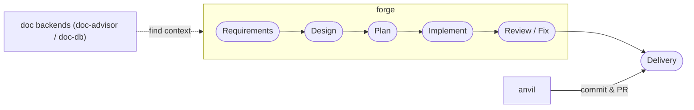
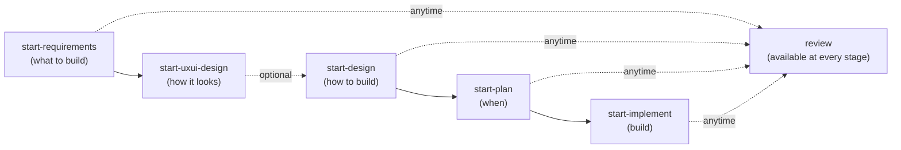

# bw-cc-plugins

Claude Code plugins for **Spec-Driven Development** — write specs first, then let AI implement and review with full context.

**Marketplace version: 0.3.4**

The marketplace ships **2 plugins** (forge, anvil). forge's search skills select a document-search backend (**doc-advisor** / **doc-db**) from an ordered list. The default puts doc-advisor first; you can change the order with `doc_backend.prefer` in `.claude/.forge.yaml`. doc-advisor is provided by a separate repository, [BlueEventHorizon/DocAdvisor](https://github.com/BlueEventHorizon/DocAdvisor) (`index-docs` / `query-docs`).

[Japanese README (README.md)](README.md)

## What is Spec-Driven Development?

Spec-Driven Development is a workflow where every code change traces back to a written specification. **forge** guides you through five stages — requirements, design, plan, implement, and review — so that AI always works from explicit, reviewable intent rather than ad-hoc instructions. Each stage produces a document; each document feeds the next stage. The result is traceable, auditable delivery: you can always answer _why_ a piece of code exists.

## The Role of the Document-Search Backends (doc-advisor / doc-db)

Large projects accumulate rules, standards, and design documents that AI cannot use if it cannot find them. The document-search backends index these documents and automatically supply the relevant ones to forge at the moments that matter:

- **During implementation** — project-specific coding rules and related specs are collected before a single line is written.
- **During review** — applicable rules are added as review perspectives, so reviews check against your actual standards, not generic best practices.

forge's `/forge:query-db-rules` / `query-db-specs` / `update-db-rules` / `update-db-specs` select a backend from an ordered list and run search / index updates against it. There are two backends:

- **doc-advisor** (external plugin, [BlueEventHorizon/DocAdvisor](https://github.com/BlueEventHorizon/DocAdvisor)) — indexes documents as a ToC (keyword / metadata)
- **doc-db** — a locally running document-search server

The default order puts doc-advisor first; change it with `doc_backend.prefer` in `.claude/.forge.yaml`. If the preferred backend is unavailable, forge notifies you and uses the other one. This eliminates context gaps: AI implements and reviews with the same knowledge a senior team member would have.

For the details of switching — the `.claude/.forge.yaml` syntax, the `--backend` forcing argument that only the index-update skills (`/forge:update-db-rules` / `update-db-specs`) accept, and the separate review-executor axis (`agent-review` / `msg-review`) — see [switch-forge-backend.md](docs/readme/switch-forge-backend.md).

## Workflow


```mermaid
flowchart LR
    subgraph forge
        R([Requirements]) --> D([Design]) --> P([Plan]) --> I([Implement]) --> RF([Review / Fix])
    end
    RF --> DL([Delivery])
    DA["doc backends (doc-advisor / doc-db)"] -. find context .-> forge
    AV[anvil] -- commit & PR --> DL
```

## Plugins

| Plugin    | Version | Description                                                                                              |
| --------- | ------- | -------------------------------------------------------------------------------------------------------- |
| **forge** | 0.5.0   | AI-powered document lifecycle tool. Create, review, and auto-fix requirements/design/plan docs and code. |
| **anvil** | 0.1.3   | GitHub operations toolkit. Create PRs, manage issues, and automate GitHub workflows.                     |

> **The document-search backends (doc-advisor / doc-db) are external dependencies**: doc-advisor ships from a separate repository, [BlueEventHorizon/DocAdvisor](https://github.com/BlueEventHorizon/DocAdvisor). Install with `/plugin marketplace add BlueEventHorizon/DocAdvisor` → `/plugin install doc-advisor@DocAdvisor`. doc-db is a locally running document-search server; when the `doc-db` command is installed, it becomes an available candidate, and forge starts and uses it automatically when the ordered list selects it. Neither backend is gated on a version: availability is judged by whether the required features can be used.

## Skills

### forge

> For Feature management and document structure details, see the [Document Structure Guide](docs/readme/guide_doc_structure.md).

#### Pipeline


```mermaid
flowchart LR
    REQ["start-requirements<br/>(what to build)"]
    UXUI["start-uxui-design<br/>(how it looks)"]
    DES["start-design<br/>(how to build)"]
    PLAN["start-plan<br/>(when)"]
    IMPL["start-implement<br/>(build)"]

    REQ --> UXUI -.->|optional| DES --> PLAN --> IMPL

    REV["review<br/>(available at every stage)"]
    REQ & DES & PLAN & IMPL -.->|anytime| REV
```

| Stage          | Skill              | Input                        | Output                       |
| -------------- | ------------------ | ---------------------------- | ---------------------------- |
| Requirements   | start-requirements | Dialog / source code / Figma | Requirements docs (Markdown) |
| UXUI Design    | start-uxui-design  | ASCII art from requirements  | Design tokens + UI specs     |
| Design         | start-design       | Requirements docs            | Design docs (Markdown)       |
| Plan           | start-plan         | Design docs                  | Plan (YAML)                  |
| Implementation | start-implement    | Plan                         | Code + progress updates      |
| Review         | review             | Code / documents             | Findings + fixes             |

#### Getting Started

```bash
# 1. Project setup (first time only)
/forge:setup-doc-structure

# 2. Requirements through implementation
/forge:start-requirements my-feature --mode interactive --new
/forge:start-design my-feature
/forge:start-plan my-feature
/forge:start-implement my-feature

# 3. Review (anytime)
/forge:review code --files src/foo.py,src/bar.py --auto
```

#### Skills

| Skill                                                                                  | Description                                                                                                                                                                                                                                                                                                                                                                                                                                                                                                                                       | Trigger                        |
| -------------------------------------------------------------------------------------- | ------------------------------------------------------------------------------------------------------------------------------------------------------------------------------------------------------------------------------------------------------------------------------------------------------------------------------------------------------------------------------------------------------------------------------------------------------------------------------------------------------------------------------------------------- | ------------------------------ |
| [**review**](docs/readme/forge/guide_review.md)                                        | Whatever runs the skill drives request assembly, finding evaluation, fixing, re-request, and completion; the round-trip with the reviewer is delegated to a review backend SKILL. Pick one with `--backend`, or let forge probe the candidates in order (default: agent-review, which has no external dependencies, then msg-review, which uses a resident Codex session). Request/resume modes (resume only on backends that restore history). `--secrets` scans for leaked secrets; `--scope` states the intended goal and deliberate omissions | `"review"`                     |
| **consult**                                                                            | Drive a discussion with the user. Raises and verifies discussion points, records them in a discussion file, and walks through them one at a time stating background and essence first. The AI decides what to take up next. Discussion mode (the default) never pushes for a decision; decision mode states a recommendation per point and settles it                                                                                                                                                                                             | `"let's discuss"`              |
| **talk-to-codex**                                                                      | Free-form chat with a resident Codex session over msg-sys, one round-trip at a time, with no findings/completion contract                                                                                                                                                                                                                                                                                                                                                                                                                         | `"I want to ask Codex"`        |
| [**start-requirements**](docs/readme/forge/guide_create_docs.md#start-requirements)    | Create requirements via dialog, reverse-engineering, or Figma                                                                                                                                                                                                                                                                                                                                                                                                                                                                                     | `"requirements"`               |
| [**start-design**](docs/readme/forge/guide_create_docs.md#start-design)                | Create design docs from requirements. Prioritizes asset reuse                                                                                                                                                                                                                                                                                                                                                                                                                                                                                     | `"start design"`               |
| [**start-plan**](docs/readme/forge/guide_create_docs.md#start-plan)                    | Extract tasks from design docs into a YAML plan                                                                                                                                                                                                                                                                                                                                                                                                                                                                                                   | `"start plan"`                 |
| [**start-implement**](docs/readme/forge/guide_implement.md)                            | Select tasks from plan, implement, review, and update                                                                                                                                                                                                                                                                                                                                                                                                                                                                                             | `"start implement"`            |
| [**start-uxui-design**](docs/readme/forge/guide_uxui_design.md)                        | Create design tokens & UI specs with UX evaluation                                                                                                                                                                                                                                                                                                                                                                                                                                                                                                | `"UXUI design"`                |
| **merge-specs**                                                                        | Reconcile two spec DIRs (base / additional) at content granularity. Additional is canonical; base is updated; only same-scope new content moves (different scopes stay separate)                                                                                                                                                                                                                                                                                                                                                                  | `"merge spec"`                 |
| [**setup-doc-structure**](docs/readme/guide_doc_structure.md#forgesetup-doc-structure) | Generate `.doc_structure.yaml` + scaffold directories                                                                                                                                                                                                                                                                                                                                                                                                                                                                                             | `"setup"`                      |
| [**setup-version-config**](docs/readme/forge/guide_setup.md#setup-version-config)      | Generate/update `.version-config.yaml`                                                                                                                                                                                                                                                                                                                                                                                                                                                                                                            | `"version config"`             |
| [**update-version**](docs/readme/forge/guide_setup.md#update-version)                  | Bump version across files. patch/minor/major/direct                                                                                                                                                                                                                                                                                                                                                                                                                                                                                               | `"version bump"`               |
| [**help**](docs/readme/forge/guide_setup.md#help)                                      | Interactive help wizard                                                                                                                                                                                                                                                                                                                                                                                                                                                                                                                           | `"help"`                       |
| **onboarding**                                                                         | Run once right after session start. Reads all foundational documents that even direct, non-skill work must follow, and copies the norms into the project CLAUDE.md after approval                                                                                                                                                                                                                                                                                                                                                                 | `"do the work"`                |
| [_doc-structure_](docs/readme/guide_doc_structure.md)                                  | Parse and resolve paths from `.doc_structure.yaml`                                                                                                                                                                                                                                                                                                                                                                                                                                                                                                | ※ Called by orchestrators      |
| [_next-spec-id_](docs/readme/forge/guide_create_docs.md)                               | Scan all branches for spec IDs and return the next available number                                                                                                                                                                                                                                                                                                                                                                                                                                                                               | ※ Called by start-requirements |

### anvil

> [Detailed Guide](docs/readme/guide_anvil.md) — Usage and examples

| Skill                                                 | Description                                                                                                                                                | Trigger                  |
| ----------------------------------------------------- | ---------------------------------------------------------------------------------------------------------------------------------------------------------- | ------------------------ |
| [**commit**](docs/readme/guide_anvil.md#commit)       | Generate commit message from changes, commit & push                                                                                                        | `"commit"`               |
| [**create-pr**](docs/readme/guide_anvil.md#create-pr) | Create a GitHub draft PR with auto-generated title/body                                                                                                    | `"create-pr"`            |
| **create-issue**                                      | Organize problem, background, and root cause into a GitHub Issue (resolution handled by impl-issue)                                                        | `"create issue"`         |
| **triage-issue** (prototype)                          | Dev-flow branching point: launches impl-issue for one-shot work, proposes a forge SDD entry point, or suggests plan-mode exploration when decisions remain | `"triage this issue"`    |
| _impl-issue_                                          | Run end-to-end from a GitHub Issue: plan, branch, implement, PR (UI Issue supported)                                                                       | ※ called by triage-issue |

> **Bold** = user-invocable, _Italic_ = AI-only (called internally by other skills)

### Document-search backends (doc-advisor / doc-db, external)

Document search is provided by two backends: doc-advisor, the external [BlueEventHorizon/DocAdvisor](https://github.com/BlueEventHorizon/DocAdvisor) plugin (`index-docs` / `query-docs`; see that repository's README for details), and doc-db, a locally running document-search server. forge's `/forge:query-db-rules` etc. select one from an ordered list (doc-advisor first by default; change with `doc_backend.prefer` in `.claude/.forge.yaml`).

## Installation

### Option A: Marketplace (persistent)

Inside a Claude Code session:

```
/plugin marketplace add BlueEventHorizon/bw-cc-plugins
/plugin install forge@bw-cc-plugins
/plugin install anvil@bw-cc-plugins

# The doc-advisor document-search backend ships from a separate marketplace
/plugin marketplace add BlueEventHorizon/DocAdvisor
/plugin install doc-advisor@DocAdvisor
```

To use the other document-search backend, doc-db, install the `doc-db` command on your PATH. This makes it an available candidate; forge starts and uses it automatically when the ordered list selects it (doc-advisor comes first by default, so set `doc_backend.prefer: doc-db` in `.claude/.forge.yaml` to try doc-db first; it is also selected when doc-advisor is unavailable).

To re-enable a disabled plugin, from your terminal:

```bash
claude plugin enable forge@bw-cc-plugins
```

`marketplace add` registers the GitHub repo as a plugin source (once per user). Once installed, the plugin is always available.

### Option B: Local directory (per session)

```bash
git clone https://github.com/BlueEventHorizon/bw-cc-plugins.git
claude --plugin-dir ./bw-cc-plugins/plugins/forge
```

> **Note**: `--plugin-dir` is session-only. You must specify it every time you start Claude Code. To unload, simply start without the flag.

### Update

From your terminal:

```bash
claude plugin update forge@bw-cc-plugins --scope local
```

## Document Structure (.doc_structure.yaml)

`.doc_structure.yaml` declares where documents live and what types they are. forge reads it (e.g. `/forge:update-db-rules` resolves the target paths and passes them to the selected document-search backend). Generate it with `/forge:setup-doc-structure`.
→ [Document Structure Guide](docs/readme/guide_doc_structure.md) | [Schema reference](plugins/forge/docs/doc_structure_format.md)

## Git Information Cache (.git_information.yaml)

On first run, `/anvil:create-pr` detects your GitHub repo from `git remote` and offers to save the settings to `.git_information.yaml` for future use.

## Requirements

- [Claude Code](https://claude.ai/code) CLI
- Python 3 (for setup scan)
- [Codex CLI](https://github.com/openai/codex) (optional; needed for the `msg-review` review backend, which uses a resident Codex session, and for `/forge:talk-to-codex`. Without it, `msg-review` is simply unavailable as a candidate)
- For document search, either backend: the external [doc-advisor](https://github.com/BlueEventHorizon/DocAdvisor) (Python standard library only; no API key required), or doc-db (a locally running document-search server)
- [gh CLI](https://cli.github.com/) (for anvil, authenticated)

## License

[MIT](LICENSE)
