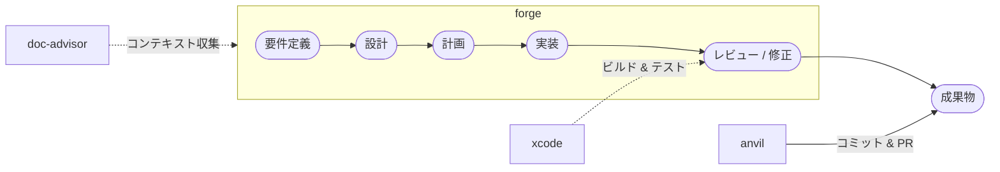

# bw-cc-plugins

**仕様駆動開発（Spec-Driven Development）** のための Claude Code プラグイン — 仕様を先に書き、AI がフルコンテキストで実装・レビューする。

**マーケットプレイスバージョン: 0.1.9**

[English README (README.md)](README.md)

## 仕様駆動開発とは

仕様駆動開発は、すべてのコード変更を書かれた仕様に遡れるワークフローである。**forge** が要件定義・設計・計画・実装・レビューの5段階を導き、AI が場当たり的な指示ではなく明文化された意図に基づいて作業する。各段階で文書が生まれ、次の段階の入力になる。結果として追跡可能で監査可能な成果物が得られる — コードがなぜ存在するかを常に説明できる。

## doc-advisor の役割

プロジェクトが大きくなると、ルール・規約・設計文書が蓄積される。AI がそれらを見つけられなければ活用できない。**doc-advisor** はこれらの文書をインデックス化し（ToC キーワード検索 + OpenAI Embedding セマンティック検索）、forge の重要な場面で自動的に提供する:

- **実装時** — コードを書く前にプロジェクト固有の実装ルールと関連仕様を収集する。
- **レビュー時** — 適用すべきルールをレビュー観点として追加し、汎用的なベストプラクティスではなくプロジェクトの実際の基準で検査する。

これによりコンテキストの欠損がなくなる — AI がシニアメンバーと同じ知識で実装・レビューできるようになる。

## ワークフロー



## プラグイン一覧

| プラグイン | バージョン | 説明                                                                                                                    |
| ---------- | ---------- | ----------------------------------------------------------------------------------------------------------------------- |
| **forge**  | 0.0.33     | AI によるドキュメントライフサイクルツール。要件定義・設計・計画書の作成、コード・文書レビュー、自動修正、品質確定に対応 |
| **anvil**  | 0.0.4      | GitHub 操作ツールキット。PR 作成、Issue 管理、GitHub ワークフロー自動化に対応                                           |
| **xcode**  | 0.0.1      | Xcode ビルド・テストツールキット。iOS/macOS プロジェクトのビルドとテストをプラットフォーム自動判定で実行                |
| **doc-advisor** | 0.2.1 | AI 検索可能な文書インデックス。キーワード（ToC）と OpenAI Embedding セマンティック検索の2層構造で、タスクに関連するルール・仕様文書を自動発見する |

## スキル一覧

### forge

> [詳細ガイド](docs/readme/README_forge_ja.md) — 使い方、使用例、レビュー種別、重大度レベル、レビュー観点

| スキル | 説明 | トリガー |
|--------|------|----------|
| [**review**](docs/readme/README_forge_ja.md#review) | コード・文書を🔴🟡🟢重大度付きでレビュー。`--auto N` で自動修正。5種別対応 | `"レビュー"` `"review"` |
| [**setup-doc-structure**](docs/readme/README_forge_ja.md#setup-doc-structure) | `.doc_structure.yaml` 生成 + 不足ディレクトリの scaffold 作成 | `"forge の初期設定"` |
| [**start-requirements**](docs/readme/README_forge_ja.md#start-requirements) | 対話・ソース解析・Figma の3モードで要件定義書を作成 | `/forge:start-requirements` |
| [**start-design**](docs/readme/README_forge_ja.md#start-design) | 要件定義書から設計書を作成 | `"設計書作成"` |
| [**start-plan**](docs/readme/README_forge_ja.md#start-plan) | 設計書からタスクを抽出し計画書を作成・更新 | `"計画書作成"` |
| [**start-implement**](docs/readme/README_forge_ja.md#start-implement) | 計画書のタスクを選択し、実装・レビュー・計画書更新を一連で実行 | `"実装開始"` |
| [**start-uxui-design**](docs/readme/README_forge_ja.md#start-uxui-design) | 要件定義書からデザイントークン・コンポーネント視覚仕様を UX 評価付きで創造（iOS/macOS） | `"UXUIデザイン"` |
| [**setup-version-config**](docs/readme/README_forge_ja.md#setup-version-config) | プロジェクトをスキャンし `.version-config.yaml` を生成・更新 | `"version config を作成"` |
| [**update-version**](docs/readme/README_forge_ja.md#update-version) | バージョンを一括更新。patch/minor/major/直接指定対応 | `"バージョン更新"` |
| [**clean-rules**](docs/readme/README_forge_ja.md#clean-rules) | rules/ を開発文書の分類学に基づいて分析・再構築 | `"rules を整理"` |
| [**help**](docs/readme/README_forge_ja.md#help) | インタラクティブヘルプ | `"forge help"` |
| *reviewer* | 1 perspective のレビューを実行。AI 専用、review オーケストレーターから呼出 | — |
| *evaluator* | レビュー指摘を吟味し修正/スキップ/要確認を判定。AI 専用 | — |
| *fixer* | レビュー指摘に基づきコード・文書を修正。AI 専用 | — |
| *present-findings* | レビュー結果を対話的に1件ずつ提示。AI 専用 | — |
| *doc-structure* | `.doc_structure.yaml` のパース・パス解決ユーティリティ。AI 専用 | — |
| *next-spec-id* | 全ブランチをスキャンして仕様書 ID の次の連番を取得。AI 専用 | — |

### anvil

> [詳細ガイド](docs/readme/README_anvil_ja.md) — 使い方、使用例

| スキル | 説明 | トリガー |
|--------|------|----------|
| [**commit**](docs/readme/README_anvil_ja.md#commit) | 変更内容からコミットメッセージを自動生成し commit & push | `"コミットして"` `"commit して"` |
| [**create-pr**](docs/readme/README_anvil_ja.md#create-pr) | GitHub PR をドラフト作成。コミット差分からタイトル/本文を自動生成 | `"PR を作成"` `"create-pr"` |

### xcode

> [詳細ガイド](docs/readme/README_xcode_ja.md) — 使い方、使用例

| スキル | 説明 | トリガー |
|--------|------|----------|
| [**build**](docs/readme/README_xcode_ja.md#build) | Xcode プロジェクトをビルドし、エラーを報告。iOS/macOS 自動判定 | `"ビルド"` `"build"` |
| [**test**](docs/readme/README_xcode_ja.md#test) | テストを実行し、失敗を報告。iOS/macOS 自動判定 | `"テスト"` `"test"` |

### doc-advisor

> [詳細ガイド](docs/readme/README_doc-advisor_ja.md) — 使い方、使用例

| スキル | 説明 | トリガー |
|--------|------|----------|
| [**query-rules**](docs/readme/README_doc-advisor_ja.md#query-rules) | ToC（キーワード）・Index（セマンティック）・ハイブリッドでルール文書を検索する | `"What rules apply?"` `"ルール確認"` |
| [**query-specs**](docs/readme/README_doc-advisor_ja.md#query-specs) | ToC（キーワード）・Index（セマンティック）・ハイブリッドで仕様文書を検索する | `"What specs apply?"` `"仕様確認"` |
| [**create-rules-toc**](docs/readme/README_doc-advisor_ja.md#create-rules-toc) | ルール文書の変更後に ToC を構築・更新する | `"Rebuild the rules ToC"` |
| [**create-specs-toc**](docs/readme/README_doc-advisor_ja.md#create-specs-toc) | 仕様文書の変更後に ToC を構築・更新する | `"Rebuild the specs ToC"` |

> **太字** = ユーザー起動可能、*斜体* = AI 専用（他スキルから内部的に呼び出される）

## インストール

### 方法 A: マーケットプレイス経由（永続）

Claude Code セッション内で:

```
/plugin marketplace add BlueEventHorizon/bw-cc-plugins
/plugin install forge@bw-cc-plugins
/plugin install anvil@bw-cc-plugins
/plugin install doc-advisor@bw-cc-plugins
/plugin install xcode@bw-cc-plugins
```

無効化したプラグインを再有効化するには、ターミナルから:

```bash
claude plugin enable forge@bw-cc-plugins
```

`marketplace add` は GitHub リポジトリをプラグイン取得元として登録します（ユーザーごとに1回）。一度インストールすれば、常に利用可能です。

### 方法 B: ローカルディレクトリ（セッション限定）

```bash
git clone https://github.com/BlueEventHorizon/bw-cc-plugins.git
claude --plugin-dir ./bw-cc-plugins/plugins/forge
```

> **注意**: `--plugin-dir` はセッション限定です。Claude Code を起動するたびに指定が必要です。解除するには、フラグなしで起動するだけです。

### 更新

ターミナルから:

```bash
claude plugin update forge@bw-cc-plugins --scope local
```

## 文書構造管理 (.doc_structure.yaml)

`/forge:setup-doc-structure` でプロジェクトをスキャンして `.doc_structure.yaml` を生成します。forge はこのファイルを参照してレビュー・修正時の関連文書を収集します。
→ [スキーマ仕様](docs/specs/forge/design/doc_structure_format.md)

## Git 情報キャッシュ (.git_information.yaml)

`/anvil:create-pr` の初回実行時に `git remote` から GitHub リポジトリを検出し、`.git_information.yaml` への設定保存を提案します。

## 動作要件

- [Claude Code](https://claude.ai/code) CLI
- Python 3（setup スキャン用）
- [Codex CLI](https://github.com/openai/codex)（任意。Codex エンジン使用時に必要。未インストールの場合は Claude にフォールバック）
- OpenAI API キー（doc-advisor の embedding 機能使用時。`OPENAI_API_KEY` 環境変数に設定）
- [gh CLI](https://cli.github.com/)（anvil 用、認証済み）
- Xcode / `xcodebuild`（xcode プラグイン用）

## ライセンス

[MIT](LICENSE)
