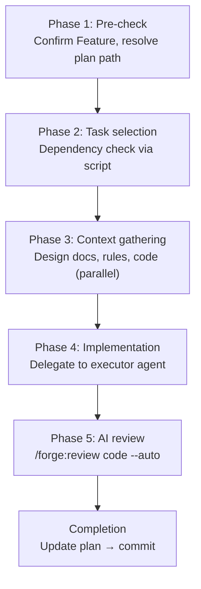

# Implementation Guide

Select tasks from a plan, then execute context gathering → implementation → review → plan update in a single workflow.

## start-implement

```
/forge:start-implement [feature] [--task TASK-ID[,TASK-ID,...]]
```

| Argument  | Description                                                          |
| --------- | -------------------------------------------------------------------- |
| `feature` | Feature name (omit for interactive)                                  |
| `--task`  | Task ID(s), comma-separated (omit for priority-based auto-selection) |

### Usage Examples

```bash
/forge:start-implement login                              # Auto-select by priority
/forge:start-implement login --task TASK-001              # Specific task
/forge:start-implement login --task TASK-001,TASK-003     # Parallel execution
```

### When to Use

- After a plan (`{feature}_plan.json`) is complete
- To implement `pending` tasks one at a time or in parallel

### Execution Flow



### Phase 1: Pre-check

- Confirm Feature (interactive if omitted)
- Resolve the path to `specs/{feature}/plan/{feature}_plan.json` (the AI does not read the whole plan)

### Phase 2: Task Selection

Priority sorting, dependency checks, and atomic group selection are performed by `select_tasks.py`.

| Method                     | Behavior                                                                 |
| -------------------------- | ------------------------------------------------------------------------ |
| No `--task`                | Auto-select 1 task from `pending` by priority                            |
| `--task TASK-001`          | Execute specified task only                                              |
| `--task TASK-001,TASK-003` | Execute all specified tasks in parallel (requires no inter-dependencies) |

#### Dependency Check

- Tasks with unfinished `depends_on` entries cannot be executed
- Inter-dependency among specified tasks → the script returns an error, suggest sequential execution

### Phase 3: Context Gathering

Parallel agents collect information needed for implementation:

| Target                                         | Purpose                      |
| ---------------------------------------------- | ---------------------------- |
| Design docs (by `design_id`)                   | What to implement            |
| Requirements (referenced by design)            | Why this design              |
| Implementation rules (`/forge:query-db-rules`) | Project-specific conventions |
| Existing code                                  | Reference implementations    |

### Phase 4: Implementation

The orchestrator delegates to an **executor agent**.

Executor behavior:

1. Read all provided documents (design, rules, existing code)
2. Implement according to `description` instructions
3. Verify with build and tests
4. Report results

When a strategy document (`{feature}_strategy.md`) exists, it is passed as required reading so the executor understands the implementation approach, phase intent, and risk mitigation before working on the single assigned task.

#### Constraints

- **One task per execution** — no touching adjacent tasks
- **Plan updates are the orchestrator's responsibility** — executor does not modify the plan

#### Parallel Execution

When multiple tasks are specified with `--task TASK-001,TASK-003`:

- Independent executors run simultaneously
- After all complete, successful tasks are reviewed sequentially
- On failure: retry (max 1) → manual fix → skip → escalate to user

### Phase 5: AI Review

Runs `/forge:review code --auto` on the implementation diff. Fix-induced issues are also auto-detected and fixed.

**The target completeness is handed to the reviewer.** The scope this task must reach, and the out-of-scope items owned by later tasks (with their task IDs), are derived from the implementation plan and passed to both the executor and the reviewer. Reviewing a staged task in isolation makes the reviewer report items planned for later tasks as defects, costing a round trip on every review to explain the scope.

When tasks sharing a `group_id` are reviewed together, items owned by **other members of that same group are subtracted** from the out-of-scope list. Without that, items just implemented in this batch would be declared deliberate omissions.

> Implementation instructions, reference code, and verification requirements go to the executor but **not** to the reviewer. Passing the instructions degrades the review into checking conformance to them, so an error in the instructions themselves becomes undetectable; reference code invites "it matches the existing code, so it is fine"; and verification requirements (build/test skips) would excuse the legitimate finding that tests are missing.

### Completion

1. Update plan: change task status from `pending` to `completed`
2. `/anvil:commit` for commit/push confirmation
3. If pending tasks remain, ask whether to continue

### Error Handling

| Situation                            | Response                             |
| ------------------------------------ | ------------------------------------ |
| Executor failure (build error, etc.) | Retry (max 1) → manual fix → skip    |
| Dependency not completed             | Error. Complete the dependency first |
| Plan not found                       | Suggest running `/forge:start-plan`  |
