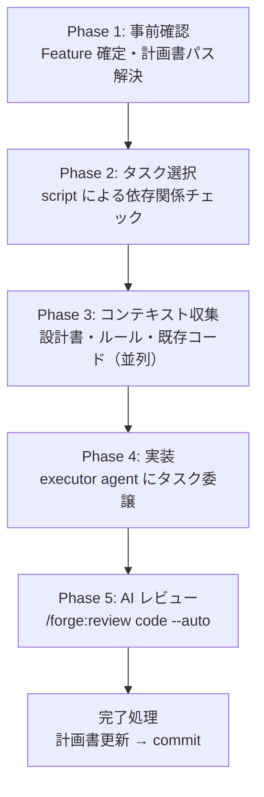

# 実装ガイド

計画書からタスクを選択し、コンテキスト収集 → 実装 → レビュー → 計画書更新を一貫して実行する。

## start-implement

```
/forge:start-implement [feature] [-n N]
```

| 引数      | 説明                                                                                         |
| --------- | -------------------------------------------------------------------------------------------- |
| `feature` | Feature 名（省略時は対話で確定）                                                             |
| `-n`      | 優先度順で選択するタスク数（省略時は1件。依存関係に基づいて並列/ウェーブ実行を自動決定する） |

### 使用例

```bash
/forge:start-implement login              # 優先度順で 1 件自動選択
/forge:start-implement login -n 3         # 優先度順で 3 件を選択して実行
```

### いつ使うか

- 計画書（`{feature}_plan.json`）が完成した後
- 計画書の `pending` タスクを 1 つずつ、または複数同時に実装するとき

### 実行フロー



### Phase 1: 事前確認

- Feature の確定（引数なしなら対話）
- `specs/{feature}/plan/{feature}_plan.json` のパスを解決（AI は計画書全体を読まない）

### Phase 2: タスク選択

タスクの優先度ソート・依存関係チェック・グループ原子的選択は `select_tasks.py` が行う。

| 指定方法  | 動作                                                                           |
| --------- | ------------------------------------------------------------------------------ |
| `-n` なし | `pending` タスクから優先度順で 1 つ自動選択                                    |
| `-n N`    | 優先度順で N 件選択。`group_id` が同じタスクは常に全メンバーが揃って選択される |

#### 依存関係チェック

- 依存タスク（`depends_on`）が `completed` でなければ実行不可
- 選択集合内で依存関係が解決済みのタスクは実行可能グループ、未解決のタスクは待機グループへ分割される（ウェーブ実行）

### Phase 3: コンテキスト収集

実装に必要な情報を並列 Agent で収集する:

| 収集対象                              | 用途                   |
| ------------------------------------- | ---------------------- |
| 設計書（`design_id` に対応）          | 何を実装するか         |
| 要件定義書（設計書が参照）            | なぜこの設計か         |
| 実装ルール（`/forge:query-db-rules`） | プロジェクト固有の規約 |
| 既存コード                            | 参照実装・類似実装     |

### Phase 4: 実装

オーケストレーターが **executor agent** にタスクを委譲する。

executor の動作:

1. 提供された文書（設計書・ルール・既存コード）を全て読む
2. `description` の指示に従い実装する
3. ビルド・テストを実施して検証する
4. 実装結果を報告する

#### 制約

- **1 回の実行で 1 タスクのみ** — 隣接タスクへの着手禁止
- **計画書の更新はオーケストレーターの責務** — executor は触れない

#### 並列実行

`-n N` で複数件選択し、実行可能グループが複数タスクを含む場合:

- 各タスクを独立した executor が同時実行
- 全 executor 完了後、成功タスクについて逐次レビュー
- いずれかが失敗した場合、再実行（上限 1 回）→ 人間にエスカレーション

### Phase 5: AI レビュー

実装差分に対して `/forge:review code --auto` を実行。修正起因の問題も自動検出・修正する。

**今回の到達目標をレビュアーへ渡す**。計画書から「このタスクで到達すべき範囲」と「後続タスクが担当する範囲外の項目（担当タスク ID 付き）」を導出し、executor とレビュアーの両方へ渡す。段階分割したタスクを単体でレビューさせると、後続タスクで実装予定の項目が欠陥として報告され、スコープを説明する往復が毎回発生するためである。

同じ `group_id` のタスクをまとめてレビューする場合は、範囲外の項目から**同じグループの他メンバーが担当する分を差し引く**。差し引かないと、今回すでに実装した項目を「意図的な未実装」として宣言してしまう。

> 実装指示・参照コード・検証要件は executor には渡すが**レビュアーには渡さない**。実装指示を渡すとレビューが「指示どおりか」の確認に退化して指示自体の誤りを検出できなくなり、参照コードは「既存と同型だから妥当」という追認の材料になり、検証要件（ビルド・テストのスキップ指定）は「テストがない」という正当な指摘の免罪符になるためである。

### 完了処理

1. 計画書の更新: タスクステータスを `pending` → `completed` に変更
2. `/anvil:commit` で commit/push 確認
3. 未完了タスクがある場合は継続するか確認

### エラー時の対応

| 状況                            | 対応                                     |
| ------------------------------- | ---------------------------------------- |
| executor 失敗（ビルドエラー等） | 再実行（上限 1 回）→ 手動修正 → スキップ |
| 依存タスク未完了                | エラー。先に依存タスクを完了する         |
| 計画書が見つからない            | `/forge:start-plan` の実行を案内         |
