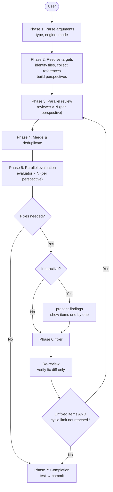

# Review Guide

AI reviews code and documents, scrutinizes findings, and fixes issues in a single workflow. In interactive mode, the user makes final decisions; in auto mode, AI fixes automatically.

## review

```
/forge:review <type> [target] [--codex|--claude] [--auto [N]] [--auto-critical]
```

| Argument | Description |
|----------|-------------|
| `type` | `code` / `requirement` / `design` / `plan` / `uxui` / `generic` |
| `target` | File path / directory / Feature name / omit for interactive |
| `--codex` / `--claude` | Engine selection (default: Codex; falls back to Claude if unavailable) |
| `--auto [N]` | Auto-fix 🔴 + 🟡 for N cycles (default N=1) |
| `--auto-critical` | Auto-fix 🔴 only for 1 cycle |

### Usage Examples

```bash
/forge:review code src/                        # Interactive mode
/forge:review code src/ --auto 3               # 3 auto-fix cycles
/forge:review code src/ --auto-critical        # Critical only
/forge:review requirement login                # By feature name
/forge:review design specs/login/design.md     # Direct file path
/forge:review generic README.md                # Any document
/forge:review code src/ --claude               # Claude engine
```

### When to Use

| Scenario | Recommended mode |
|----------|-----------------|
| Pre-PR final check | `--auto` for bulk fix, then review the diff |
| Document quality review | Interactive for careful per-item judgment |
| CI-style quality gate | `--auto-critical` for minimal safe fixes |
| Completion step of other skills | start-design etc. call `--auto` internally |

### Execution Flow



### Mode Comparison

| Mode | Fix targets | Final judge | Use case |
|------|------------|-------------|----------|
| Interactive (default) | User-selected | Human | Careful quality control |
| `--auto N` | 🔴 + 🟡 | AI | Bulk quality improvement |
| `--auto-critical` | 🔴 only | AI | Minimal safe fixes |

The core loop (reviewer → merge → evaluator → fixer → re-review) is identical across all modes. The only difference is whether human judgment is inserted before fixer.

### Review Types

| Type | Target | Key perspectives |
|------|--------|-----------------|
| `code` | Source code | Correctness, resilience, maintainability |
| `requirement` | Requirements docs | Completeness, consistency, testability |
| `design` | Design docs | Architecture, requirement coverage, feasibility |
| `plan` | Plans | Task granularity, dependencies, traceability |
| `uxui` | Design tokens & UI specs | HIG compliance, usability, visual consistency |
| `generic` | Any document | Structure, clarity, completeness |

### Severity Levels

| Level | Meaning | Auto behavior |
|-------|---------|--------------|
| 🔴 Critical | Must fix. Bugs, security, data loss, spec violations | Fixed by both `--auto` and `--auto-critical` |
| 🟡 Major | Should fix. Standards, error handling, performance | Fixed by `--auto` only |
| 🟢 Minor | Nice to have. Readability, refactoring suggestions | Never auto-fixed |

### Review Criteria (Perspectives)

Perspectives are accumulated from multiple sources. Each perspective runs as an independent parallel reviewer.

| Source | Content |
|--------|---------|
| **Plugin default** | Auto-extracted from `review_criteria_{type}.md` (always included) |
| **DocAdvisor** | Project-specific rules added via `/query-rules` when available |

### Session Management

A session directory is created under `.claude/.temp/` during review.

| File | Content |
|------|---------|
| `session.yaml` | Session metadata (type, engine, cycle count) |
| `refs.yaml` | Reference files (targets, docs, perspectives) |
| `review_*.md` | Per-perspective review results |
| `review.md` | Merged & deduplicated results |
| `plan.yaml` | Fix plan and progress state |

Automatically deleted on normal completion. On interruption, the directory remains and a resume is proposed on next launch.

---

## Browser monitor module

`/forge:review` and the `/forge:start-*` skills automatically launch a **monitor module**
(`plugins/forge/scripts/monitor/`) when a session is created. An SSE server watches the
session directory and pushes updates to the browser in real time.

- **No user action required**: `session_manager` forks the monitor asynchronously at the
  end of `cmd_init()`.
- **URL**: `http://localhost:8765/` (falls back to 8766–8775 if in use).
- **Skill-specific templates**:
  - `review` → Findings list (severity filters + progress bar)
  - `start-requirements` / `start-design` / `start-plan` → Document preview
  - `start-implement` → Task progress
  - `start-uxui-design` → ASCII art + design tokens
- **Notification paths**: Direct notifications from writer scripts + 30-second mtime
  heartbeat fallback.
- **Auto-stop**: The server shuts down when the session directory is deleted.

Set `FORGE_SESSION_SKIP_MONITOR=1` / `FORGE_MONITOR_NO_OPEN=1` to skip launch or to
suppress the browser open. Manual launch:

```bash
python3 ${CLAUDE_PLUGIN_ROOT}/plugins/forge/scripts/monitor/launcher.py \
  --session-dir <session-directory> --skill <skill-name>
```
