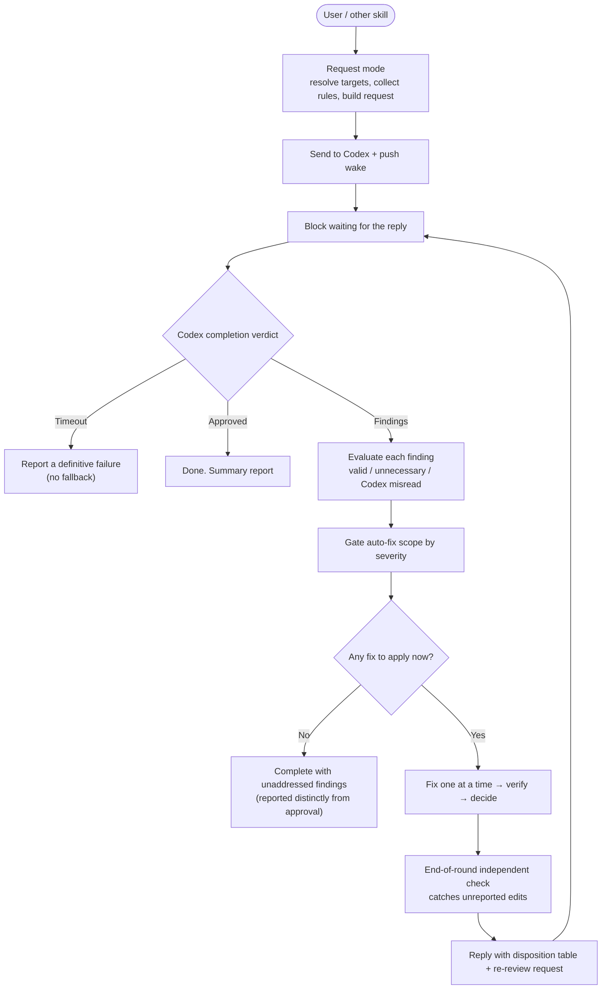

# Review Guide

Have a resident Codex session review your code and documents, while Claude drives the evaluation, fixing, re-request, and completion decisions. Splitting "who reports" from "who fixes" across two different AIs avoids the failure mode where an AI approves its own work.

## review

```
/forge:review <type> [--diff | --branch | --files a.md,b.py,... | --dirs d1/,d2/,...] [--interactive | --auto-critical | --auto] [--focus "<emphasis>"]
```

| Argument          | Description                                                         |
| ----------------- | ------------------------------------------------------------------- |
| `type`            | `code` / `requirement` / `design` / `plan` / `uxui` / `generic`     |
| `--diff`          | Uncommitted changes on the current branch (default)                 |
| `--branch`        | All changes since the base-branch divergence point                  |
| `--files`         | Explicit comma-separated file list                                  |
| `--dirs`          | Everything under the given directories (comma-separated; see below) |
| `--interactive`   | Default. Currently aliased to `--auto` (see "Interim behavior")     |
| `--auto`          | Auto-fix 🔴 + 🟡. 🟢 minor is out of scope                          |
| `--auto-critical` | Auto-fix 🔴 only                                                    |
| `--focus`         | What to pay extra attention to this time (free text, optional)      |
| `--secrets`       | Standalone review for leaked secrets only (see below)               |

> **There is no engine axis (`--codex` / `--claude`).** Review execution is always performed by the resident Codex session. Passing these flags logs a warning and continues with the default behavior (so existing callers migrated from the legacy pipeline keep working).

### Examples

The user types one of these to start:

```bash
/forge:review code                                        # Uncommitted diff (default)
/forge:review code --branch --auto                        # All branch changes, auto-fix critical+major
/forge:review code --files src/foo.py,src/bar.py --auto    # Explicit files
/forge:review requirement --files docs/specs/login_req.md  # Requirement doc
/forge:review design --files specs/login/design.md         # Design doc
/forge:review generic --files README.md                    # Any document
/forge:review design --dirs docs/specs/forge/design/       # Every design doc under a directory
```

### Directory scope (`--dirs`)

When documents are organized by directory (`docs/specs/*/design/` and the like), you can review a whole directory at once.

```bash
/forge:review design --dirs docs/specs/forge/design/
/forge:review requirement --dirs docs/specs/forge/requirements/,docs/specs/anvil/requirements/
```

- **The type is required.** The type (and therefore which review criteria apply) is never inferred from the directory name. A wrong inference would hide why a given set of criteria was applied.
- **The reviewer receives the directories as given.** forge does not expand them into a file list. Expansion would turn any enumeration gap into a silent gap in review coverage; the reviewer determines the scope itself.
- Enumeration for the internal allowlist respects `.gitignore`, and untracked new documents are included.
- It is a target axis, so it cannot be combined with `--diff` / `--branch` / `--files` (specifying two is an error).
- If a directory does not exist, or contains no reviewable files, the request is not sent.

### Secret scanning (`--secrets`)

A standalone review that targets leaked secrets only — tokens, private keys, connection strings.

```bash
/forge:review --secrets
```

- **The target is the whole repository.** It cannot be combined with a type or a target axis (`--diff` / `--branch` / `--files` / `--dirs`). A secret committed earlier does not appear in today's diff but is still in the repository, so narrowing to a diff defeats the purpose.
- **Deterministic scan plus AI, in that order.** `scan_secrets.py` first matches known shapes (AWS / GitHub / Slack tokens, private key blocks, credentialed connection strings, JWTs, high-entropy strings), and its results are attached to the request. The reviewer judges each hit and, separately, hunts for what the scanner cannot match — credentials buried in prose, internal endpoints with no fixed shape.
- **Detected values never appear in the request.** Only position, kind, length, and a short prefix are passed, masked. The request is persisted in the message DB, so including real values would make detection itself a copying channel.
- **Nothing is auto-fixed.** Even with `--auto`, the run completes as "findings left unaddressed". A committed secret survives deletion in history, so remediation means revoking and reissuing it — a human decision.

If a test fixture legitimately needs a string that matches a pattern, end the line with `secrets-scan: ignore`. That classifies it — it does **not** drop it. Suppressed hits are always reported with their positions, and overusing the marker is itself reviewable.

### Emphasis (`--focus`)

Pass "please pay extra attention to X this time" as free text. Stating it conversationally works the same way — the skill interprets the intent even without the flag:

```bash
/forge:review --branch --focus "cross-document reference links written in the documents"
```

Emphasis **does not replace the built-in criteria**. The review defined by the criteria and normative documents named in the template still runs in full; the emphasis is added on top. It is not a way to narrow the review down to a single concern.

Emphasis also never raises severity. Findings that answer the emphasis are still rated 🔴 / 🟡 / 🟢 by the severity catalog in the normative documents.

> **Permanent perspectives live in the criteria.** Cross-document reference links (notation and dead links) are checked in design / requirement / plan / generic / uxui reviews without any `--focus`, because `document_style_guide.md` §5 is a P1 delegate of those criteria. `--focus` adjusts emphasis; it is not the only way to introduce a perspective. If a perspective should always be checked, fix the criteria instead.

### Prerequisites

This skill runs on top of msg-sys (the async Claude ⇔ Codex messaging layer). You need:

- **Codex CLI installed and running as a resident session in the target project directory** (start it manually; the skill never auto-starts Codex)
- The forge plugin installed (the Claude-side Stop hook registers automatically via the plugin mechanism)
- A Codex-side Stop hook entry in `.codex/hooks.json` (the skill self-repairs this before every request, so manual setup is normally unnecessary)

If Codex is not resident, the request is still sent but no reply arrives, and after the wait budget (600s by default) the skill reports a **definitive failure** — it does not fall back. Under cmux, the target pane is discovered automatically and woken via push, so the wait is usually tens of seconds.

### When to Use

| Scenario                        | Recommended mode                                       |
| ------------------------------- | ------------------------------------------------------ |
| Pre-PR final check              | `--auto` for bulk fix, then review the diff            |
| Document quality review         | `--auto`, then check the disposition table for reasons |
| CI-style quality gate           | `--auto-critical` for minimal safe fixes               |
| Completion step of other skills | start-design etc. call `--auto` internally             |

### Three Operating Modes

A review does not finish in a single turn, so the skill has three modes keyed on how it was entered.

| Mode        | Trigger                                                    | Behavior                                                   |
| ----------- | ---------------------------------------------------------- | ---------------------------------------------------------- |
| **Request** | `/forge:review` invoked by a user or another skill         | Resolve targets → build request → send → wait for reply    |
| **Receive** | Codex's reply is delivered back via the Stop hook          | Evaluate findings → fix → reply with a report, or complete |
| **Resume**  | User asks for status after a round-trip-limit notification | Summarize unresolved findings from the round-trip history  |

### Execution Flow


```mermaid
flowchart TD
    START([User / other skill]) --> REQ

    REQ["Request mode<br/>resolve targets, collect rules, build request"] --> SEND

    SEND["Send to Codex + push wake"] --> WAIT

    WAIT["Block waiting for the reply"] --> RESULT

    RESULT{Codex completion verdict}
    RESULT -->|"Timeout"| FAIL["Report a definitive failure<br/>(no fallback)"]
    RESULT -->|"Approved"| DONE["Done. Summary report"]
    RESULT -->|"Findings"| EVAL

    EVAL["Evaluate each finding<br/>valid / unnecessary / Codex misread"] --> GATE

    GATE["Gate auto-fix scope by severity"] --> CONFIRM

    CONFIRM{Any fix to apply now?}
    CONFIRM -->|No| DONE2["Complete with unaddressed findings<br/>(reported distinctly from approval)"]
    CONFIRM -->|Yes| FIX

    FIX["Fix one at a time → verify → decide"] --> VERIFY

    VERIFY["End-of-round independent check<br/>catches unreported edits"] --> REPLY

    REPLY["Reply with disposition table + re-review request"] --> WAIT
```

### Claude Evaluates the Findings

Codex's findings are never applied blindly. Each one is judged against the **same** `review_criteria_<type>.md` that was sent with the request.

| Verdict             | Action                                                               |
| ------------------- | -------------------------------------------------------------------- |
| Valid finding       | Decide the fix after weighing blast radius and alternatives          |
| Unnecessary finding | Drop it; record "determined not applicable" in the disposition table |
| Based on a misread  | Drop it, or ask Codex to reconsider in the next round                |

Using the same criteria on both sides prevents both arbitrary rejection under a different standard and unconditional acceptance.

### Fix Safety Boundaries

Fixes are not batched. Each finding goes through **apply → verify → decide → next**.

- **Allowlist check**: detects edits outside the target files. If a ripple edit is judged legitimate, the change is kept and the reason is stated in the report (no silent scope creep)
- **Syntax check**: compares against a pre-fix baseline to detect newly introduced syntax errors
- **End-of-round independent check**: the above rely on self-reported edited paths, so they cannot catch an omission. The round's whole change set is re-checked without relying on self-reporting

The verification scripts **only detect**; they never roll back automatically. Deciding between an accidental deviation and a legitimate ripple edit is Claude's job.

### Convergence

Re-requesting a review while findings remain unaddressed makes Codex report the same findings forever. Therefore, **if no fix is to be applied this round, no re-review is requested and the review completes.**

That completion differs from Codex approving the work, and the summary distinguishes them:

- **Completed by approval**: Codex reported no findings
- **Completed with unaddressed findings**: Codex still reports findings, but none were in scope this round

In the latter case every unfixed finding is listed with its reason (out of severity scope / severity undetermined / dropped during evaluation / reverted by the safety check). This distinction is mandatory so a human does not overlook it.

### Review Types

| Type          | Target                   | Main perspectives                             |
| ------------- | ------------------------ | --------------------------------------------- |
| `code`        | Source code              | Correctness, robustness, maintainability      |
| `requirement` | Requirements docs        | Completeness, consistency, testability        |
| `design`      | Design docs              | Architecture, requirement coverage, viability |
| `plan`        | Plan docs                | Task granularity, dependencies, traceability  |
| `uxui`        | Design tokens & UI specs | HIG compliance, usability, visual consistency |
| `generic`     | Any document             | Structure, clarity, completeness              |

### Severity Levels

| Level       | Meaning                                              | Under auto modes                             |
| ----------- | ---------------------------------------------------- | -------------------------------------------- |
| 🔴 Critical | Must fix. Bugs, security, data loss, spec violations | Fixed by both `--auto` and `--auto-critical` |
| 🟡 Major    | Should fix. Conventions, error handling, performance | Fixed by `--auto` only                       |
| 🟢 Minor    | Nice to have. Readability, refactoring suggestions   | Never auto-fixed                             |

Findings whose severity could not be determined are excluded from auto-fix and left to human review.

### Review Criteria

The request embeds the paths of the type-specific criteria file and the project documents relevant to the target. Codex reads them itself, read-only.

| Source             | Content                                                                         |
| ------------------ | ------------------------------------------------------------------------------- |
| **Plugin-bundled** | `review_criteria_<type>.md` per type (always included)                          |
| **DocAdvisor**     | Project documents returned by `/forge:query-db-rules` / `/forge:query-db-specs` |

### Interim Behavior: `--interactive`

**`--interactive` (the default) currently applies the same gating as `--auto`** (user-directed, user's responsibility [2026-07-19]). The intended step-by-step presentation — showing findings one at a time and asking the human to decide — is not implemented yet.

This is a deliberate interim measure to get the mechanism into real use across many projects and surface problems early. It will be implemented later, self-contained within this skill.

### No Session Directory

This skill does not persist finding state to files. Receiving, evaluating, fixing, and replying all complete within a single turn, and the round-trip history is reconstructed from the msg-sys message DB on demand.

Even when context is lost (session resume, compaction), the protocol header on the delivered message body triggers the receive mode, and the history for that specific review is filtered back out so work can continue.
