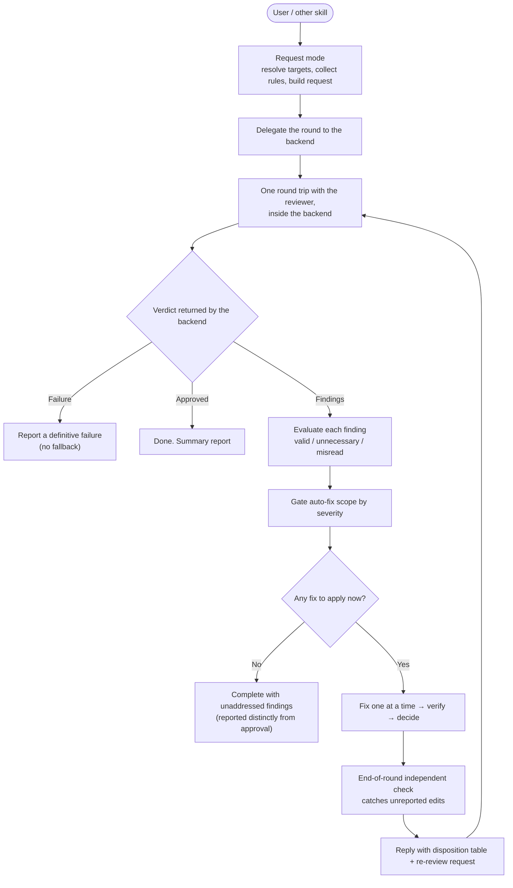

# Review Guide

Request a review of your code and documents; whatever runs the skill drives the evaluation, fixing, re-request, and completion decisions.

**What you hand over** is the review target plus the perspectives that apply to it (the plugin-bundled criteria and your project's own rules and specifications). **What comes back** is a verdict (approved / findings / failure) and an array of findings (severity, location, body).

Findings are **observations, not instructions**. The requesting side decides what to take and what to drop; the reviewer holds no authority over that. Review quality therefore depends not on _who_ reviewed, but on **whether the input you handed over was right**.

The subject that actually performs the review is swappable (see "Review backends"). The criteria documents, the request format, the finding format, the gating, and the fix-safety checks are the same whichever subject you pick.

## review

```
/forge:review <type> [--diff | --branch | --files a.md,b.py,... | --dirs d1/,d2/,...] [--interactive | --auto-critical | --auto] [--focus "<emphasis>"] [--scope "<target completeness>"] [--project-rules a.md,b.md] [--project-specs c.md] [--backend <name>]
```

| Argument          | Description                                                                                          |
| ----------------- | ---------------------------------------------------------------------------------------------------- |
| `type`            | `code` / `requirement` / `design` / `plan` / `uxui`                                                  |
| `--diff`          | Uncommitted changes on the current branch (default)                                                  |
| `--branch`        | All changes since the base-branch divergence point                                                   |
| `--files`         | Explicit comma-separated file list                                                                   |
| `--dirs`          | Everything under the given directories (comma-separated; see below)                                  |
| `--interactive`   | Default. Currently aliased to `--auto` (see "Interim behavior")                                      |
| `--auto`          | Auto-fix 🔴 + 🟡. 🟢 minor is out of scope                                                           |
| `--auto-critical` | Auto-fix 🔴 only                                                                                     |
| `--focus`         | What to pay extra attention to this time (free text, optional)                                       |
| `--scope`         | How complete this change is meant to be, plus deliberate omissions (multi-line, optional; see below) |
| `--project-rules` | Rule documents to hand to the reviewer (comma-separated, optional; see below)                        |
| `--project-specs` | Specification documents to hand to the reviewer (comma-separated, optional; see below)               |
| `--secrets`       | Standalone review for leaked secrets only (see below)                                                |
| `--backend`       | Which subject actually performs the review (optional; see "Review backends")                         |

> **There is no engine axis (`--codex` / `--claude`).** The performing subject is selected only via `--backend`. Passing these legacy flags logs a warning and continues with the default behavior (so existing callers migrated from the legacy pipeline keep working). **`--codex` is never reinterpreted as `--backend codex`.**

### Examples

The user types one of these to start:

```bash
/forge:review code                                        # Uncommitted diff (default)
/forge:review code --branch --auto                        # All branch changes, auto-fix critical+major
/forge:review code --files src/foo.py,src/bar.py --auto    # Explicit files
/forge:review requirement --files docs/specs/login_req.md  # Requirement doc
/forge:review design --files specs/login/design.md         # Design doc
/forge:review design --dirs docs/specs/forge/design/       # Every design doc under a directory
/forge:review code --files src/a.py --scope "Creating a.py only"  # State the target completeness of a staged change
```

### Directory scope (`--dirs`)

When documents are organized by directory (`docs/specs/*/design/` and the like), you can review a whole directory at once.

```bash
/forge:review design --dirs docs/specs/forge/design/
/forge:review requirement --dirs docs/specs/forge/requirements/,docs/specs/anvil/requirements/
```

- **The type is required.** The type (and therefore which review criteria apply) is never inferred from the directory name. A wrong inference would hide why a given set of criteria was applied.
- **The reviewer receives the directories as given.** forge does not expand them into a file list. Expansion would turn any enumeration gap into a silent gap in review coverage; the reviewer determines the scope itself.
- Enumeration for the internal allowlist respects `.gitignore`, and untracked new documents are included.
- It is a target axis, so it cannot be combined with `--diff` / `--branch` / `--files` (specifying two is an error).
- If a directory does not exist, or contains no reviewable files, the request is not sent.

### Secret scanning (`--secrets`)

A standalone review that targets leaked secrets only — tokens, private keys, connection strings.

```bash
/forge:review --secrets
```

- **The target is the whole repository.** It cannot be combined with a type or a target axis (`--diff` / `--branch` / `--files` / `--dirs`). A secret committed earlier does not appear in today's diff but is still in the repository, so narrowing to a diff defeats the purpose.
- **Deterministic scan plus AI, in that order.** `scan_secrets.py` first matches known shapes (AWS / GitHub / Slack tokens, private key blocks, credentialed connection strings, JWTs, high-entropy strings), and its results are attached to the request. The reviewer judges each hit and, separately, hunts for what the scanner cannot match — credentials buried in prose, internal endpoints with no fixed shape.
- **Detected values never appear in the request.** Only position, kind, length, and a short prefix are passed, masked. The request is persisted in the message DB, so including real values would make detection itself a copying channel.
- **Nothing is auto-fixed.** Even with `--auto`, the run completes as "findings left unaddressed". A committed secret survives deletion in history, so remediation means revoking and reissuing it — a human decision.

If a test fixture legitimately needs a string that matches a pattern, end the line with `secrets-scan: ignore`. That classifies it — it does **not** drop it. Suppressed hits are always reported with their positions, and overusing the marker is itself reviewable.

### Emphasis (`--focus`)

Pass "please pay extra attention to X this time" as free text. Stating it conversationally works the same way — the skill interprets the intent even without the flag:

```bash
/forge:review --branch --focus "cross-document reference links written in the documents"
```

Emphasis **does not replace the built-in criteria**. The review defined by the criteria and normative documents named in the template still runs in full; the emphasis is added on top. It is not a way to narrow the review down to a single concern.

Emphasis also never raises severity. Findings that answer the emphasis are still rated 🔴 / 🟡 / 🟢 by the severity catalog in the normative documents.

> **Permanent perspectives live in the criteria.** Cross-document reference links (notation and dead links) are checked in design / requirement / plan / generic / uxui reviews without any `--focus`, because `document_style_guide.md` §5 is a P1 delegate of those criteria. `--focus` adjusts emphasis; it is not the only way to introduce a perspective. If a perspective should always be checked, fix the criteria instead.

### Target completeness (`--scope`)

Tells the reviewer how complete this change is meant to be, and which items were deliberately left out. Multiple lines are allowed:

```bash
/forge:review code --files src/fm_to_pending.py --scope "Creating fm_to_pending.py and its tests only.

The following are out of scope for this change.

- Adding _meta.extracted_by — TASK-011 (split off because the writer and the reader must change together, or the field is dead)"
```

**This is a different axis from `--focus`.** `--focus` is what to look at **in addition to** the normal review; `--scope` is **which level of completeness to evaluate against**. Mixing them leaves the reviewer unable to tell "look here harder" apart from "judge against this bar".

You need it when an implementation is split into stages. Reviewing one stage in isolation makes the reviewer report items planned for later tasks as defects, and every review costs a round trip explaining "that belongs to a later task". `--scope` supplies that explanation up front.

**Omitting it means "the target is the final form"** — not "no information available". Even when nothing is out of scope, say so explicitly if you pass `--scope`, because the reviewer cannot tell an empty section from a deliberate one.

**It is not a way to suppress out-of-scope findings.** If a declared omission contradicts what the design or specification documents state, the reviewer reports that divergence. Being "planned for a later task" does not excuse the fact that design and implementation currently disagree. In that case the fix may belong to the document rather than the code (for example, annotating the staging in the design doc).

> `/forge:start-implement` builds this from the implementation plan and passes it automatically. When several tasks are reviewed as one group, it subtracts the items owned by the other members of that same group first — otherwise items just implemented would be declared "not implemented". You pass it by hand when you request a review directly from the conversation.

### Bringing your own norms (`--project-rules` / `--project-specs`)

Names the rule and specification documents to hand to the reviewer. For each axis you pass, the skill does not run `/forge:query-db-rules` / `/forge:query-db-specs` itself:

```bash
/forge:review code --files src/foo.py --project-rules docs/rules/implementation_guidelines.md
```

The main purpose is to avoid running the same search twice for one task when an upstream skill (such as `/forge:start-implement`) has already done it. If you pass only one axis, only the other one is queried.

An incomplete list does not silently degrade the review. The template instructs the reviewer to report the absence of applicable norms as a finding, so gaps surface as findings.

### Review backends (`--backend`)

The review body is **independent of who performs the review**. It resolves targets, builds the request, evaluates and applies findings, and decides completion; the round trip itself (prerequisite checks, sending, waiting, interpreting the reply) is delegated to a **review backend**.

| Selection                                 | Behavior                                                                                          |
| ----------------------------------------- | ------------------------------------------------------------------------------------------------- |
| Nothing specified                         | Probe candidates in order and take the first available one (order: `agent-review` → `msg-review`) |
| `--backend <name>`                        | Run on that subject. If unavailable, **fail closed** — no substitute is chosen                    |
| `review.backend` in `.claude/.forge.yaml` | Project-level explicit choice (same fail-closed treatment as `--backend`)                         |

| Backend        | Who reviews                                      | External dependencies             |
| -------------- | ------------------------------------------------ | --------------------------------- |
| `agent-review` | A read-only custom Agent shipped with the plugin | None                              |
| `msg-review`   | A resident Codex session                         | Codex CLI, cmux, msg-sys settings |

`agent-review` comes first because it has no external dependencies: installing the plugin is enough to start reviewing. To use a resident Codex session, name it explicitly with `--backend msg-review` or in `.claude/.forge.yaml` — **without an explicit choice, a different subject runs**.

The candidate order itself lives on the design side (`DEFAULT_ORDER` and the design document). What configuration selects is only _which_ subject to use.

An explicit choice never falls back, so "I picked one but another ran" cannot happen. **The chosen backend and how it was chosen (argument / setting / candidate order) are always printed in the argument-interpretation output**, because the origin of the findings must be visible.

A failed round is likewise never retried on a different backend. The failure is reported as final, and choosing another subject is the user's call.

### Prerequisites

Prerequisites differ per backend. **What is missing is likewise reported per backend.**

#### `agent-review` (default)

- The forge plugin installed
- A host that can launch custom Agents

No external tool, resident session, or database is required. It works as installed.

#### `msg-review`

Runs on top of msg-sys (the Claude ⇔ Codex messaging layer). You need:

- **Codex CLI installed and running as a resident session in the target project directory** (start it manually; the skill never auto-starts Codex)
- **The cmux terminal multiplexer on PATH** (used to wake Codex's turn from the second round onward)
- The forge plugin installed (the Claude-side Stop hook registers automatically via the plugin mechanism)
- A Codex-side Stop hook entry in `.codex/hooks.json` (the skill provisions this as initialization on every run, so manual setup is normally unnecessary — a fresh clone or a new worktree is initialized at the availability-probe step)

If the prerequisites hold but Codex never answers, the skill reports a **definitive failure** after the wait budget (600s by default). Under cmux, the target pane is discovered automatically and woken via push, so the wait is usually tens of seconds.

#### When prerequisites cannot be met

**No request is sent at all.** Availability is probed before the backend is settled; when it cannot be satisfied, the skill reports **what is missing together with the remedy** and stops. You will not be kept waiting ten minutes only to be told it timed out.

When resolving by candidate order (no `--backend`, no setting), the next candidate is tried; if every candidate is unavailable, the per-candidate gaps are reported together and the review fails. With an explicit choice, no substitute is chosen and it fails immediately.

### When to Use

| Scenario                        | Recommended mode                                       |
| ------------------------------- | ------------------------------------------------------ |
| Pre-PR final check              | `--auto` for bulk fix, then review the diff            |
| Document quality review         | `--auto`, then check the disposition table for reasons |
| CI-style quality gate           | `--auto-critical` for minimal safe fixes               |
| Completion step of other skills | start-design etc. call `--auto` internally             |

### Two Operating Modes

| Mode        | Trigger                                                    | Behavior                                                                                         |
| ----------- | ---------------------------------------------------------- | ------------------------------------------------------------------------------------------------ |
| **Request** | `/forge:review` invoked by a user or another skill         | Resolve targets → build request → delegate to the backend → evaluate and fix → decide completion |
| **Resume**  | User asks for status after a round-trip-limit notification | Summarize unresolved findings from the round-trip history                                        |

**Resume is only available on backends that persist the round-trip history.** History restoration is an optional extension, and the default `agent-review` does not provide it because it keeps no state. A review interrupted on such a backend is not resumed under the same `review_id`; it is re-run as a new review.

The round trip with the reviewer is contained **inside the backend**, where sending, waiting, and interpreting one round complete synchronously. The body receives a verdict (approved / findings / failure) plus the findings array, and holds no transport details.

### Execution Flow


```mermaid
flowchart TD
    START([User / other skill]) --> REQ

    REQ["Request mode<br/>resolve targets, collect rules, build request"] --> SEND

    SEND["Delegate the round to the backend"] --> WAIT

    WAIT["One round trip with the reviewer,<br/>inside the backend"] --> RESULT

    RESULT{Verdict returned by the backend}
    RESULT -->|"Failure"| FAIL["Report a definitive failure<br/>(no fallback)"]
    RESULT -->|"Approved"| DONE["Done. Summary report"]
    RESULT -->|"Findings"| EVAL

    EVAL["Evaluate each finding<br/>valid / unnecessary / misread"] --> GATE

    GATE["Gate auto-fix scope by severity"] --> CONFIRM

    CONFIRM{Any fix to apply now?}
    CONFIRM -->|No| DONE2["Complete with unaddressed findings<br/>(reported distinctly from approval)"]
    CONFIRM -->|Yes| FIX

    FIX["Fix one at a time → verify → decide"] --> VERIFY

    VERIFY["End-of-round independent check<br/>catches unreported edits"] --> REPLY

    REPLY["Reply with disposition table + re-review request"] --> WAIT
```

### The Requesting Side Evaluates the Findings

**Findings are observations, not instructions.** The requesting side decides what to take and what to drop; a finding that does not hold up is dropped with the reason recorded, and if none of them hold up, all of them are dropped. The severity the reviewer assigned only bounds the auto-fix candidate set — it carries no authority over the decision.

Each finding is judged against the **same** `review_criteria_<type>.md` that was sent with the request.

| Verdict             | Action                                                               |
| ------------------- | -------------------------------------------------------------------- |
| Valid finding       | Decide the fix after weighing blast radius and alternatives          |
| Unnecessary finding | Drop it; record "determined not applicable" in the disposition table |
| Based on a misread  | Drop it, or ask the reviewer to reconsider in the next round         |

Using the same criteria on both sides prevents both arbitrary rejection under a different standard and unconditional acceptance.

The only lever for better review results is **getting the input right** — the criteria, rules, target, emphasis, and target completeness you hand over determine the outcome.

### Fix Safety Boundaries

Fixes are not batched. Each finding goes through **apply → verify → decide → next**.

- **Allowlist check**: detects edits outside the target files. If a ripple edit is judged legitimate, the change is kept and the reason is stated in the report (no silent scope creep)
- **Syntax check**: compares against a pre-fix baseline to detect newly introduced syntax errors
- **End-of-round independent check**: the above rely on self-reported edited paths, so they cannot catch an omission. The round's whole change set is re-checked without relying on self-reporting

The verification scripts **only detect**; they never roll back automatically. Deciding between an accidental deviation and a legitimate ripple edit is the job of whatever runs the skill.

### Convergence

Re-requesting a review while findings remain unaddressed makes the reviewer report the same findings forever. Therefore, **if no fix is to be applied this round, no re-review is requested and the review completes.**

That completion differs from completing by approval, and the summary distinguishes them:

- **Completed by approval**: the reviewer reported no findings
- **Completed with unaddressed findings**: the reviewer still reports findings, but none were in scope this round

In the latter case every unfixed finding is listed with its reason (out of severity scope / severity undetermined / dropped during evaluation / reverted by the safety check). This distinction is mandatory so a human does not overlook it.

### Review Types

| Type          | Target                   | Main perspectives                             |
| ------------- | ------------------------ | --------------------------------------------- |
| `code`        | Source code              | Correctness, robustness, maintainability      |
| `requirement` | Requirements docs        | Completeness, consistency, testability        |
| `design`      | Design docs              | Architecture, requirement coverage, viability |
| `plan`        | Plan docs                | Task granularity, dependencies, traceability  |
| `uxui`        | Design tokens & UI specs | HIG compliance, usability, visual consistency |

> `--diff` / `--branch` take no type (a diff mixes code, docs, and config). For files matching none of the rows above, the reviewer applies `review_criteria_generic.md` (structure, clarity, completeness). `generic` is **not a selectable type**.

### Severity Levels

| Level       | Meaning                                              | Under auto modes                             |
| ----------- | ---------------------------------------------------- | -------------------------------------------- |
| 🔴 Critical | Must fix. Bugs, security, data loss, spec violations | Fixed by both `--auto` and `--auto-critical` |
| 🟡 Major    | Should fix. Conventions, error handling, performance | Fixed by `--auto` only                       |
| 🟢 Minor    | Nice to have. Readability, refactoring suggestions   | Never auto-fixed                             |

Findings whose severity could not be determined are excluded from auto-fix and left to human review.

### Review Criteria

The request embeds the paths of the type-specific criteria file and the project documents relevant to the target. The reviewer reads them itself.

| Source                 | Content                                                                         |
| ---------------------- | ------------------------------------------------------------------------------- |
| **Plugin-bundled**     | `review_criteria_<type>.md` per type (always included)                          |
| **Doc-search backend** | Project documents returned by `/forge:query-db-rules` / `/forge:query-db-specs` |

### Interim Behavior: `--interactive`

**`--interactive` (the default) currently applies the same gating as `--auto`** (user-directed, user's responsibility [2026-07-19]). The intended step-by-step presentation — showing findings one at a time and asking the human to decide — is not implemented yet.

This is a deliberate interim measure to get the mechanism into real use across many projects and surface problems early. It will be implemented later, self-contained within this skill.

### No Session Directory

This skill does not persist finding state to files. Receiving, evaluating, fixing, and replying all complete within a single turn.

When the round-trip history is needed it is requested from the backend, but **only on backends that provide history restoration** (for `msg-review`, the msg-sys message DB is the source; `agent-review` keeps no history). Restoration happens only when a user or the body asks for it with an explicit `review_id` — never automatically in response to a message arriving or a wait timing out.
