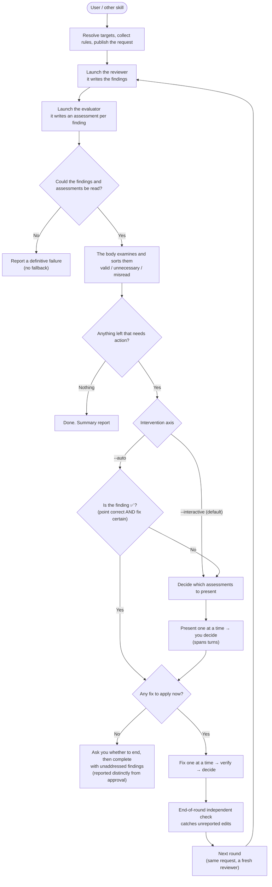

# Review Guide

Request a review of your code and documents; whatever runs the skill drives the evaluation, fixing, re-request, and completion decisions.

**What you hand over** is the review target plus the perspectives that apply to it (the plugin-bundled criteria and your project's own rules and specifications). **What comes back** are the findings the reviewer wrote (location, body) and the evaluator's independent assessment of them (validity, severity, confidence).

Findings are **observations, not instructions**. The requesting side decides what to take and what to drop; the reviewer holds no authority over that. Review quality therefore depends not on _who_ reviewed, but on **whether the input you handed over was right**.

The subject that actually performs the review is swappable (see "Review backends"). The criteria documents, the structure of the request and the results, the gating, and the fix-safety checks are the same whichever subject you pick.

## review

```
/forge:review [--diff | --branch | --files a.md,b.py,... | --dirs d1/,d2/,...] [--interactive | --auto] [--focus "<emphasis>"] [--scope "<target completeness>"] [--project-rules a.md,b.md] [--project-specs c.md] [--backend <name>]
```

| Argument          | Description                                                                                                                    |
| ----------------- | ------------------------------------------------------------------------------------------------------------------------------ |
| `--diff`          | Uncommitted changes on the current branch (default)                                                                            |
| `--branch`        | All changes since the base-branch divergence point                                                                             |
| `--files`         | Explicit comma-separated file list                                                                                             |
| `--dirs`          | Everything under the given directories (comma-separated; see below)                                                            |
| `--interactive`   | Default. Nothing is fixed without asking; findings are presented one at a time. Accepted ones are fixed regardless of severity |
| `--auto`          | **Fixes only what it is sure about; anything it is unsure about is presented for you to decide**                               |
| `--focus`         | What to pay extra attention to this time (free text, optional)                                                                 |
| `--scope`         | How complete this change is meant to be, plus deliberate omissions (multi-line, optional; see below)                           |
| `--project-rules` | Rule documents to hand to the reviewer (comma-separated, optional; see below)                                                  |
| `--project-specs` | Specification documents to hand to the reviewer (comma-separated, optional; see below)                                         |
| `--backend`       | Which subject actually performs the review (optional; see "Review backends")                                                   |

> **There is no engine axis (`--codex` / `--claude`).** The performing subject is selected only via `--backend`. Passing these legacy flags logs a warning and continues with the default behavior (so existing callers migrated from the legacy pipeline keep working). **`--codex` is never reinterpreted as `--backend codex`.**

### Examples

The user types one of these to start:

```bash
/forge:review                                             # Uncommitted diff (default)
/forge:review --branch --auto                             # All branch changes, auto-fix critical+major
/forge:review --files src/foo.py,src/bar.py --auto         # Explicit files
/forge:review --files docs/specs/login_req.md              # Requirement doc
/forge:review --files specs/login/design.md                # Design doc
/forge:review --dirs docs/specs/forge/design/              # Every design doc under a directory
/forge:review --files src/a.py --scope "Creating a.py only"  # State the target completeness of a staged change
```

### Directory scope (`--dirs`)

When documents are organized by directory (`docs/specs/*/design/` and the like), you can review a whole directory at once.

```bash
/forge:review --dirs docs/specs/forge/design/
/forge:review --dirs docs/specs/forge/requirements/,docs/specs/anvil/requirements/
```

- **You do not specify a type.** The type (and therefore which review criteria apply) is determined by the reviewer for each target.
- **The reviewer receives the directories as given.** forge does not expand them into a file list. Expansion would turn any enumeration gap into a silent gap in review coverage; the reviewer determines the scope itself.
- Enumeration for the internal allowlist respects `.gitignore`, and untracked new documents are included.
- It is a target axis, so it cannot be combined with `--diff` / `--branch` / `--files` (specifying two is an error).
- If a directory does not exist, or contains no reviewable files, the request is not published.

### Emphasis (`--focus`)

Pass "please pay extra attention to X this time" as free text. Stating it conversationally works the same way — the skill interprets the intent even without the flag:

```bash
/forge:review --branch --focus "cross-document reference links written in the documents"
```

Emphasis **does not replace the built-in criteria**. The review defined by the criteria and normative documents the reviewer reads for each target type still runs in full; the emphasis is added on top. It is not a way to narrow the review down to a single concern.

Emphasis also never raises severity. Findings that answer the emphasis are still rated 🔴 / 🟡 / 🟢 by the severity catalog in the normative documents.

> **Permanent perspectives live in the criteria.** Cross-document reference links (notation and dead links) are checked in design / requirement / plan / generic / uxui reviews without any `--focus`, because `document_style_guide.md` §5 is a P1 delegate of those criteria. `--focus` adjusts emphasis; it is not the only way to introduce a perspective. If a perspective should always be checked, fix the criteria instead.

### Target completeness (`--scope`)

Tells the reviewer how complete this change is meant to be, and which items were deliberately left out. Multiple lines are allowed:

```bash
/forge:review --files src/fm_to_pending.py --scope "Creating fm_to_pending.py and its tests only.

The following are out of scope for this change.

- Adding _meta.extracted_by — TASK-011 (split off because the writer and the reader must change together, or the field is dead)"
```

**This is a different axis from `--focus`.** `--focus` is what to look at **in addition to** the normal review; `--scope` is **which level of completeness to evaluate against**. Mixing them leaves the reviewer unable to tell "look here harder" apart from "judge against this bar".

You need it when an implementation is split into stages. Reviewing one stage in isolation makes the reviewer report items planned for later tasks as defects, and every review costs a round trip explaining "that belongs to a later task". `--scope` supplies that explanation up front.

**Omitting it means "the target is the final form"** — not "no information available". Even when nothing is out of scope, say so explicitly if you pass `--scope`, because the reviewer cannot tell an empty section from a deliberate one.

**It is not a way to suppress out-of-scope findings.** If a declared omission contradicts what the design or specification documents state, the reviewer reports that divergence. Being "planned for a later task" does not excuse the fact that design and implementation currently disagree. In that case the fix may belong to the document rather than the code (for example, annotating the staging in the design doc).

> `/forge:start-implement` builds this from the implementation plan and passes it automatically. When several tasks are reviewed as one group, it subtracts the items owned by the other members of that same group first — otherwise items just implemented would be declared "not implemented". You pass it by hand when you request a review directly from the conversation.

### Bringing your own norms (`--project-rules` / `--project-specs`)

Names the rule and specification documents to hand to the reviewer. For each axis you pass, the skill does not run `/forge:query-db-rules` / `/forge:query-db-specs` itself:

```bash
/forge:review --files src/foo.py --project-rules docs/rules/implementation_guidelines.md
```

The main purpose is to avoid running the same search twice for one task when an upstream skill (such as `/forge:start-implement`) has already done it. If you pass only one axis, only the other one is queried.

An incomplete list does not silently degrade the review. For code and UI/UX, the reviewer reports the absence of applicable norms as a finding, so gaps surface as findings.

### Review backends (`--backend`)

The review body is **independent of who performs the review**. It resolves targets, publishes the request, launches the reviewer and the evaluator, examines their findings and assessments, applies fixes, and decides completion. What a **review backend** provides is only the availability check before the review starts, and the declaration of whether the reviewer keeps its context across rounds.

| Selection                                 | Behavior                                                                                          |
| ----------------------------------------- | ------------------------------------------------------------------------------------------------- |
| Nothing specified                         | Probe candidates in order and take the first available one (`agent-review` is the only candidate) |
| `--backend <name>`                        | Run on that subject. If unavailable, **fail closed** — no substitute is chosen                    |
| `review.backend` in `.claude/.forge.yaml` | Project-level explicit choice (same fail-closed treatment as `--backend`)                         |

| Backend        | Who reviews                                      | External dependencies |
| -------------- | ------------------------------------------------ | --------------------- |
| `agent-review` | A read-only custom Agent shipped with the plugin | None                  |

`agent-review` is currently the only backend, and it has no external dependencies: installing the plugin is enough to start reviewing. The selection and resolution machinery is kept for when more candidates exist.

The candidate order itself lives on the design side (`DEFAULT_ORDER` and the design document). What configuration selects is only _which_ subject to use.

An explicit choice never falls back, so "I picked one but another ran" cannot happen. **The chosen backend and how it was chosen (argument / setting / candidate order) are always printed in the argument-interpretation output**, because the origin of the findings must be visible.

A failure of the reviewer or the evaluator is likewise never retried on a different backend. The failure is reported as final, and choosing another subject is the user's call.

### Prerequisites

Prerequisites differ per backend. **What is missing is likewise reported per backend.**

#### `agent-review` (default)

- The forge plugin installed
- A host that can launch custom Agents

No external tool, resident session, or database is required. It works as installed.

#### When prerequisites cannot be met

**No request is published at all.** Availability is probed before the backend is settled; when it cannot be satisfied, the skill reports **what is missing together with the remedy** and stops. You will not be kept waiting ten minutes only to be told it timed out.

When resolving by candidate order (no `--backend`, no setting), the next candidate is tried; if every candidate is unavailable, the per-candidate gaps are reported together and the review fails. With an explicit choice, no substitute is chosen and it fails immediately.

### When to Use

| Scenario                        | Recommended mode                                       |
| ------------------------------- | ------------------------------------------------------ |
| Pre-PR final check              | `--auto` for bulk fix, then review the diff            |
| Document quality review         | `--auto`, then check the disposition table for reasons |
| CI-style quality gate           | `--auto` — only confident fixes are applied            |
| Completion step of other skills | start-design etc. call `--auto` internally             |

### How a Review Proceeds

When you start `/forge:review`, the body resolves the targets, publishes the request, launches the reviewer and the evaluator, examines their findings and assessments, applies fixes, and decides completion. The reviewer and the evaluator receive only a `review_id` and a `round_number` from the body; scripts write the request, the findings, and the assessments as JSON, and the body reads the JSON at the paths the scripts return.

**There is no way to resume an interrupted review.** The request, findings, and assessments are deleted when the review ends. Start a new review on the same target if you need to continue.

### Execution Flow


```mermaid
flowchart TD
    START([User / other skill]) --> REQ

    REQ["Resolve targets, collect rules, publish the request"] --> RV

    RV["Launch the reviewer<br/>it writes the findings"] --> EV

    EV["Launch the evaluator<br/>it writes an assessment per finding"] --> READ

    READ{Could the findings and assessments be read?}
    READ -->|"No"| FAIL["Report a definitive failure<br/>(no fallback)"]
    READ -->|"Yes"| EXAM

    EXAM["The body examines and sorts them<br/>valid / unnecessary / misread"] --> REMAIN

    REMAIN{Anything left that needs action?}
    REMAIN -->|"Nothing"| DONE["Done. Summary report"]
    REMAIN -->|"Yes"| MODE

    MODE{Intervention axis}
    MODE -->|"--interactive (default)"| TRIAGE
    MODE -->|"--auto"| SPLIT

    SPLIT{"Is the finding ✅?<br/>(point correct AND fix certain)"}
    SPLIT -->|"Yes"| CONFIRM
    SPLIT -->|"No"| TRIAGE

    TRIAGE["Decide which assessments to present"] --> STEP

    STEP["Present one at a time → you decide<br/>(spans turns)"] --> CONFIRM

    CONFIRM{Any fix to apply now?}
    CONFIRM -->|No| DONE2["Ask you whether to end, then complete<br/>with unaddressed findings<br/>(reported distinctly from approval)"]
    CONFIRM -->|Yes| FIX

    FIX["Fix one at a time → verify → decide"] --> VERIFY

    VERIFY["End-of-round independent check<br/>catches unreported edits"] --> NEXT

    NEXT["Next round<br/>(same request, a fresh reviewer)"] --> RV
```

### The Requesting Side Evaluates the Findings

**Findings are observations, not instructions.** The requesting side decides what to take and what to drop; a finding that does not hold up is dropped with the reason recorded, and if none of them hold up, all of them are dropped. The severity the evaluator assigned only orders the presentation — it carries no authority over the decision.

The body examines each assessment against the **same** `review_criteria_<type>.md` and norm documents the reviewer and the evaluator read. It does not follow the assessment's values as they are: it understands the content and investigates before deciding to fix, drop, or end.

| Verdict             | Action                                                               |
| ------------------- | -------------------------------------------------------------------- |
| Valid finding       | Decide the fix after weighing blast radius and alternatives          |
| Unnecessary finding | Drop it; record "determined not applicable" in the disposition table |
| Based on a misread  | Drop it, or ask the reviewer to reconsider in the next round         |

Using the same criteria prevents both arbitrary rejection under a different standard and unconditional acceptance.

The only lever for better review results is **getting the input right** — the criteria, rules, target, emphasis, and target completeness you hand over determine the outcome.

### Fix Safety Boundaries

Fixes are not batched. Each finding goes through **apply → verify → decide → next**.

- **Allowlist check**: detects edits outside the target files. If a ripple edit is judged legitimate, the change is kept and the reason is stated in the report (no silent scope creep)
- **Syntax check**: compares against a pre-fix baseline to detect newly introduced syntax errors
- **End-of-round independent check**: the above rely on self-reported edited paths, so they cannot catch an omission. The round's whole change set is re-checked without relying on self-reporting

The verification scripts **only detect**; they never roll back automatically. Deciding between an accidental deviation and a legitimate ripple edit is the job of whatever runs the skill.

### Convergence

Re-requesting a review while findings remain unaddressed makes the reviewer report the same findings forever. Therefore, **if nothing can be fixed this round and nothing is queued for presentation, no re-review is requested; the skill asks you whether to end.** You decide when to end; the body never cuts the review off by itself. Interrupting the step-by-step presentation completes the review — after applying the fixes already accepted — regardless of how many they were.

The skill also stops when the next round number would be 5 or more, instead of requesting a re-review. Findings that do not go away after four rounds usually mean the first response was headed in the wrong direction. It re-examines the essence, responsibility, and scope, and asks you whether to continue or end.

That completion differs from completing by approval, and the summary distinguishes them:

- **Completed by approval**: no assessment needing action remains (no valid point and no defect in the norm document)
- **Completed with unaddressed findings**: assessments needing action remain, but none were in scope this round, or you decided to end

In the latter case every unfixed finding is listed with its reason (you decided not to accept it / location undetermined / dropped during evaluation / reverted by the safety check). This distinction is mandatory so a human does not overlook it.

### Review Types

The type is not a value you specify. The reviewer determines it for each target and applies the matching criteria.

| Type          | Target                   | Main perspectives                             |
| ------------- | ------------------------ | --------------------------------------------- |
| `code`        | Source code              | Correctness, robustness, maintainability      |
| `requirement` | Requirements docs        | Completeness, consistency, testability        |
| `design`      | Design docs              | Architecture, requirement coverage, viability |
| `plan`        | Plan docs                | Task granularity, dependencies, traceability  |
| `uxui`        | Design tokens & UI specs | HIG compliance, usability, visual consistency |

> A request takes no type, because the target of one request can mix code, docs, and config (a diff especially); the reviewer determines the type for each target and applies the matching criteria (ADRs are treated as design). For files matching none of the rows above, the reviewer applies `review_criteria_generic.md` (structure, clarity, completeness). `generic` is **not a selectable type**.

### Severity Levels

| Level       | Meaning                                              | Under auto modes |
| ----------- | ---------------------------------------------------- | ---------------- |
| 🔴 Critical | Must fix. Bugs, security, data loss, spec violations | Presented first  |
| 🟡 Major    | Should fix. Conventions, error handling, performance | Presented next   |
| 🟢 Minor    | Nice to have. Readability, refactoring suggestions   | Presented last   |

Severity never decides whether a finding is fixed without asking — it only orders the presentation. That decision comes from two separate judgements forge makes per finding: whether the reviewer's point is correct (`☑️`), and whether the fix can be carried out responsibly (`✅`). Only `✅` findings are fixed without asking, and `✅` implies `☑️`. Both marks appear in the presentation under `--interactive` too, so you can say "just fix the `✅` ones".

Findings whose location cannot be determined are never fixed automatically — there is no place to apply the fix — and are left to human review regardless of severity or confidence.

### Review Criteria

The reviewer and the evaluator read the type-specific criteria file themselves. The request carries the paths of the project documents relevant to the target.

| Source                 | Content                                                                         |
| ---------------------- | ------------------------------------------------------------------------------- |
| **Plugin-bundled**     | `review_criteria_<type>.md` per type (always included)                          |
| **Doc-search backend** | Project documents returned by `/forge:query-db-rules` / `/forge:query-db-specs` |

### The Default `--interactive`: Step-by-Step Presentation

**What may be fixed without asking is decided by confidence, not severity.** Confidence splits into two separate judgements, because they are about different things: whether the reviewer's point is correct, and whether the fix can be carried out responsibly.

| Mark   | Meaning                                                             | Under `--auto`       |
| ------ | ------------------------------------------------------------------- | -------------------- |
| ✅     | The point is correct **and** the fix can be carried out responsibly | Fixed without asking |
| ☑️      | The point is correct, but the fix itself is uncertain               | Presented to you     |
| (none) | The point's own validity is uncertain                               | Presented to you     |

`✅` implies `☑️`: a point that is not established as correct can never be fixed without asking.

Severity says how bad the problem is, not how sure the fix is. A 🔴 critical is not fixed if the fix itself is uncertain; a 🟢 minor is fixed when it is certain. Using weight as a proxy for certainty lets **an unsure fix through just because the finding was severe**.

Stopping where it is unsure is what makes `--auto` trustworthy — get that wrong once and `--auto` becomes "the thing that makes mistakes".

Severity remains as presentation order. The only findings that cannot be fixed at all are those whose location is undetermined, because there is nothing to point the fix at.

`--interactive` presents every fixable finding; `--auto` presents only the ones it is unsure about.

Presentation goes from the highest severity down. For each finding the skill states what the finding is, why it is a problem, what the decision actually hinges on, its recommendation with a reason, `path:line`, and its confidence. **The skill decides what to take up next**, so all you have to do is stop it, skip an item, or reorder.

Findings are presented as prose and your response is free-form. Whether to accept a finding is a matter of substance, and a choice-list UI has nowhere to put the background.

Findings whose location is undetermined are not put to a decision even under `--interactive`. Accepting one would not pin down what to fix, so a human has to read the finding directly. That count is shown together with the list.

To reduce human turns, pass `--auto` explicitly. Note that **`--auto` still asks about anything it is unsure of**, so it does not guarantee an unattended run.

### How State Is Held

An `--auto` round completes within a single turn — launching, reading, fixing, and replying — and holds no state beyond the round's JSON files.

The request, findings, and assessments are written by scripts under `.temp/review/<review_id>/` and deleted when the review ends, whichever way it ends. Only `--interactive` step-by-step presentation spans turns, because it waits on a human; that state (the list, the evaluations, the decisions) is held in the conversation only and is not persisted.

**A review interrupted partway cannot be resumed.** Start a new review on the same target if you need to continue. Settled outcomes show up in the fixes themselves and in the reply table, so nothing is lost.
