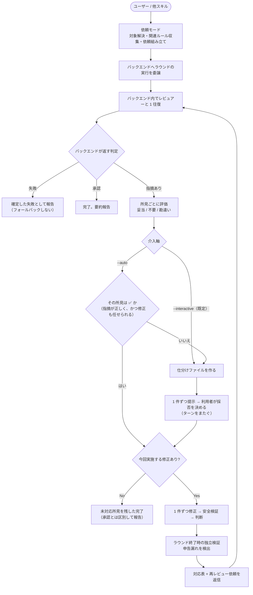

# レビューガイド

コード・文書のレビューを依頼し、返ってきた所見の評価・修正・再依頼・完了判定までをスキルの実行側が駆動する。

**渡すもの**は、レビュー対象と、それに適用する観点（プラグイン同梱の criteria とプロジェクト固有のルール・仕様）である。**返ってくるもの**は、判定（承認 / 指摘あり / 失敗）と所見の配列（重大度・位置・本文）である。

返ってくる所見は**気づきであって指示ではない**。採るか捨てるかを決めるのは依頼した側であり、レビュアーは決定権を持たない。したがってレビューの質は「誰がレビューしたか」ではなく、**渡した入力が適正だったか**で決まる。

レビューを実際に行う主体は差し替えられる（後述「レビューバックエンド」）。観点文書・依頼の書式・所見の書式・振り分け・修正の安全検証は、どの主体を選んでも共通である。

## review

```
/forge:review <種別> [--diff | --branch | --files a.md,b.py,... | --dirs d1/,d2/,...] [--interactive | --auto] [--focus "<重点観点>"] [--scope "<到達目標>"] [--project-rules a.md,b.md] [--project-specs c.md] [--backend <name>]
```

| 引数              | 説明                                                                           |
| ----------------- | ------------------------------------------------------------------------------ |
| `種別`            | `code` / `requirement` / `design` / `plan` / `uxui`                            |
| `--diff`          | 現ブランチの未 commit 差分（デフォルト）                                       |
| `--branch`        | base ブランチ分岐以降の全変更                                                  |
| `--files`         | 明示指定したファイル群（カンマ区切り）                                         |
| `--dirs`          | 明示指定したディレクトリ配下すべて（カンマ区切り。後述）                       |
| `--interactive`   | 既定。修正できる所見を全件提示して採否を得る                                   |
| `--auto`          | **確信のあるものだけ確認なしに直し、確信の無いものは提示して採否を得る**       |
| `--focus`         | 今回特に注意を払う対象（自然文・任意。後述「重点観点」）                       |
| `--scope`         | 今回到達すべき範囲と意図的な未実装（自然文・複数行可・任意。後述「到達目標」） |
| `--project-rules` | レビュアーへ渡すルール文書（カンマ区切り・任意。後述「規範の持ち込み」）       |
| `--project-specs` | レビュアーへ渡す仕様書（カンマ区切り・任意。後述「規範の持ち込み」）           |
| `--secrets`       | 機密情報の混入のみを対象とする独立レビュー（後述）                             |
| `--backend`       | レビューの実行主体（任意。後述「レビューバックエンド」）                       |

> **エンジン軸（`--codex` / `--claude`）は持たない**。実行主体の指定は `--backend` だけで行う。これらの旧フラグを渡しても警告のうえ無視して続行する（旧パイプラインからの差し替えで既存の呼び出し元が壊れないようにするため）。**`--codex` を `--backend codex` と解釈することもしない**。

### 使用例

利用者が以下をタイプして起動する:

```bash
/forge:review code                                        # 未 commit 差分（デフォルト）
/forge:review code --branch --auto                        # 分岐以降の全変更を critical+major 自動修正
/forge:review code --files src/foo.py,src/bar.py --auto    # ファイル指定
/forge:review requirement --files docs/specs/login_req.md  # 要件定義書
/forge:review design --files specs/login/design.md         # 設計書
/forge:review design --dirs docs/specs/forge/design/       # ディレクトリ配下の設計書すべて
/forge:review code --files src/a.py --scope "a.py の新規作成まで"  # 段階分割した実装の到達目標を伝える
```

### ディレクトリ指定（`--dirs`）

文書がディレクトリで分類されている場合（`docs/specs/*/design/` など）、配下をまとめてレビューできます。

```bash
/forge:review design --dirs docs/specs/forge/design/
/forge:review requirement --dirs docs/specs/forge/requirements/,docs/specs/anvil/requirements/
```

- **種別は必須です**。ディレクトリ名から種別（適用するレビュー観点）を推定しません。推定を誤ると、なぜその観点が適用されたのかが分からなくなるためです
- **レビュアーへはディレクトリのまま渡します**。forge 側で配下のファイル一覧に展開しません。展開すると列挙漏れがそのままレビュー範囲の欠落になり、欠落した事実が誰にも見えなくなるためです。対象の確定はレビュアー自身が行います
- 配下の列挙は `.gitignore` を尊重します。未追跡の新規文書も対象に含まれます
- 対象軸なので `--diff` / `--branch` / `--files` とは併用できません（同時指定はエラー）
- 指定ディレクトリが存在しない場合、配下に対象ファイルが 1 件も無い場合は依頼を送らずに終了します

### 機密情報レビュー（`--secrets`）

トークン・秘密鍵・接続文字列などの混入だけを対象とする独立したレビュー。

```bash
/forge:review --secrets
```

- **対象はリポジトリ全体**。種別・対象軸（`--diff` / `--branch` / `--files` / `--dirs`）とは併用できません。過去のコミットで混入した秘密は今回の差分に現れないため、差分に絞ると目的を達成できないからです
- **決定論的スキャンと AI の二段構え**。まず `scan_secrets.py` が既知形式（AWS / GitHub / Slack トークン、秘密鍵ブロック、資格情報付き接続文字列、JWT、高エントロピー文字列など）を機械的に検出し、その結果を添えてレビューを依頼します。レビュアーは検出結果の真偽判定に加えて、**スキャンが拾えない混入**（形式を持たない内部エンドポイント、散文に埋もれた資格情報など）を自力で探します
- **検出値は本文に載りません**。位置・種別・長さ・先頭数文字だけがマスクして渡されます。依頼はメッセージ DB に永続化されるため、実値を載せると検出行為そのものが複製経路になるからです
- **自動修正しません**。`--auto` を付けても未対応所見を残した完了として報告します。commit 済みの秘密は削除しても履歴に残るため、修正は該当する秘密の失効・再発行を伴い、人間の判断が要るからです

テストフィクスチャなどで検出パターンに一致する文字列が必要な場合は、行末に `secrets-scan: ignore` を書くと分類されます。ただし**除外ではありません**。抑制した件数と位置はレビュー依頼に必ず報告され、マーカーの濫用自体が指摘の対象になります。

### 重点観点（`--focus`）

「今回はここを重点的に見てほしい」を自然文で渡せる。フラグを明示しなくても、口頭で伝えれば同じ結果になる:

```bash
/forge:review --branch --focus "文書内に記述された他文書への参照リンク"
```

```text
ブランチレビューで文書レビュー、特に文書内に記述された参照リンクを中心にレビューしてください
```

重点観点は **内蔵の観点を置き換えない**。テンプレートが名指しする criteria・規範文書によるレビューはそのまま行われ、指定した観点がそこに加わる。「これだけを見る」という絞り込みではない。

また、重点観点は重大度を引き上げない。重点として挙げた項目の所見であっても、🔴 / 🟡 / 🟢 は規範文書の重大度カタログから決まる。

> **恒久的な観点は criteria 側にある**。文書内の参照リンク（記法・リンク切れ）は `--focus` を指定しなくても design / requirement / plan / generic / uxui のレビューで検査される（`document_style_guide.md` §5 が各 criteria の P1 委譲先に入っているため）。`--focus` はそこに強弱を付けるための軸であり、観点そのものを追加するための唯一の手段ではない。恒久的に検査したい観点が抜けている場合は、criteria 側の修正を検討する。

### 到達目標（`--scope`）

「今回の変更はどこまで到達していればよいか」と「意図的に含めなかった項目」を渡せる。複数行を書ける:

```bash
/forge:review code --files src/fm_to_pending.py --scope "fm_to_pending.py の新規作成とテストまで。

以下は今回の範囲外である。

- _meta.extracted_by の追加 — TASK-011（読む側と書く側を同時に変えないと死にフィールドになるため分離）"
```

**`--focus` とは別の軸である**。`--focus` は「通常のレビューに**加えて**注意を払う対象」、`--scope` は「**どの完成度を基準に評価するか**」。混ぜると、レビュアーが「重点的に見る対象」と「評価基準」を区別できなくなる。

必要になるのは、実装を段階分割したときである。分割された 1 タスクだけをレビューすると、後続タスクで実装予定の項目が欠陥として報告され、「それは後続タスクのスコープです」と説明する往復が毎回発生する。`--scope` はその説明を最初から渡しておくための軸である。

**未指定は「対象は最終形である」を意味する**。「情報が無い」ではない。範囲外の項目が無い場合も、`--scope` を渡すなら「範囲外はなし」と明示する（空欄との区別がレビュアー側で付かないため）。

**範囲外の指摘を封じる軸ではない**。宣言した未実装が設計書・仕様書の記述と矛盾している場合、レビュアーはその乖離を所見として報告する。「後続タスクで実装予定」であることは、現時点で設計と実装が食い違っている事実を免除しないからである。この場合の修正対象は実装ではなく文書側になりうる（設計書に段階を注記する等）。

> `/forge:start-implement` は計画書からこの内容を自動で組み立てて渡す。グループ単位でまとめてレビューする場合は、同じグループの他タスクが担当する項目を範囲外から差し引いたうえで渡す（差し引かないと、今回実装済みの項目を「未実装」と宣言してしまう）。利用者が手で渡すのは、会話から直接レビューを依頼する場合である。

### 規範の持ち込み（`--project-rules` / `--project-specs`）

レビュアーへ渡すルール文書・仕様書を明示指定する。指定した軸については、スキルが自前で `/forge:query-db-rules` / `/forge:query-db-specs` を実行しない:

```bash
/forge:review code --files src/foo.py --project-rules docs/rules/implementation_guidelines.md
```

主な用途は、上流のスキル（`/forge:start-implement` 等）が既に同じ検索を済ませている場合に、**同一タスクに対して同じ検索が 2 回走るのを避ける**ことである。片方だけ渡した場合、渡さなかった軸だけがクエリされる。

渡した一覧が不足していても黙って進むことはない。テンプレートは「規範が見当たらない場合はその事実を所見として報告せよ」と指示しているため、不足は所見として表に出る。

### レビューバックエンド（`--backend`）

レビュー本体は**実行主体に依存しない**。対象の解決・依頼本文の組み立て・所見の評価と修正・完了判定を本体が担い、レビュアーとの往復（前提検査・送信・待機・応答の解釈）は**レビューバックエンド**へ委譲する。

| 指定                                      | 動作                                                                                         |
| ----------------------------------------- | -------------------------------------------------------------------------------------------- |
| 指定なし                                  | 候補を順に可用性検査し、最初に使えたものを採用する（候補順は `agent-review` → `msg-review`） |
| `--backend <name>`                        | その実行主体で走らせる。使えなければ**代替を選ばず失敗させる**（fail closed）                |
| `.claude/.forge.yaml` の `review.backend` | プロジェクトの既定として明示指定する（`--backend` と同じ fail closed 扱い）                  |

| バックエンド   | 実行主体                                  | 外部依存                        |
| -------------- | ----------------------------------------- | ------------------------------- |
| `agent-review` | プラグイン同梱の read-only カスタム Agent | なし                            |
| `msg-review`   | 常駐している Codex セッション             | Codex CLI・cmux・msg-sys の設定 |

外部依存を持たない `agent-review` が第一候補である。プラグインを導入しただけの状態でレビューを開始できることを優先している。常駐 Codex を使いたい場合は `--backend msg-review` か `.claude/.forge.yaml` で明示指定する（**指定しないと別の実行主体で走る**）。

候補順そのものは設計側（`DEFAULT_ORDER` と設計書）が持つ。設定で指定できるのは「どの実行主体を使うか」だけである。

明示指定で代替を選ばないのは、「指定したのに別の主体で走った」を起こさないためである。**採用したバックエンドと、その決まり方（引数 / 設定 / 候補順）は毎回引数解釈結果に出力される**（所見の出どころが見えている必要があるため）。

また、ラウンドの実行が失敗した場合も別バックエンドへ自動で切り替えない。失敗は確定した結果として報告され、実行主体を選び直すかどうかは利用者が決める。

### 前提条件

前提はバックエンドごとに異なる。**満たしていない前提の内容も、バックエンドごとに報告される。**

#### `agent-review`（既定）

- forge プラグインが導入されていること
- カスタム Agent を起動できるホストであること

外部ツール・常駐セッション・DB を必要としない。プラグインを導入した状態でそのまま使える。

#### `msg-review`

msg-sys（Claude ⇔ Codex のメッセージング基盤）の上で動作する。以下が必要:

- **Codex CLI がインストール済みで、対象プロジェクトのディレクトリで常駐起動していること**（人間が手動で起動しておく。スキルは Codex を自動起動しない）
- **端末多重化ツール cmux が PATH にあること**（往復 2 ラウンド目以降で Codex のターンを起こすために使う）
- forge プラグインが導入されていること（Claude 側の Stop フックはプラグイン機構で自動登録される）
- `.codex/hooks.json` への Codex 側 Stop フック登録（スキルが初期化として毎回用意するため、通常は手動作業不要。クローンや worktree を作った直後も、可用性検査の時点で初期化される）

前提を満たしていても Codex が応答しない場合は、待機予算（既定 600 秒）超過後に**確定した失敗として報告される**。cmux 環境では対象ペインを自動発見して push 型で起床させるため、待機は通常数十秒で済む。

#### 前提を満たせなかったときの動作

**依頼は 1 通も送信されない**。バックエンドを確定する前に可用性を検査し、満たせなければ**何が欠けているかと対処**を並べて報告して終了する。最大 10 分待たされてからタイムアウトで失敗する、ということは起きない。

候補順で解決している場合（`--backend` も設定も無い場合）は次の候補へ進み、全候補が使えなければ候補ごとの不足を並べて失敗する。明示指定している場合は代替を選ばず失敗する。

### いつ使うか

| シーン                | 推奨モード                                  |
| --------------------- | ------------------------------------------- |
| PR 前の最終チェック   | `--auto` で一括修正後に差分を確認           |
| 文書の品質確認        | `--auto` で修正させ、対応表で採否理由を確認 |
| CI 的な自動品質ゲート | `--auto` で確信のあるものだけ修正           |
| 他スキルの完了処理    | start-design 等が内部で `--auto` を呼ぶ     |

### 2 つの動作モード

| モード         | 起動契機                                                   | 動作                                                                       |
| -------------- | ---------------------------------------------------------- | -------------------------------------------------------------------------- |
| **依頼モード** | 利用者または他スキルによる `/forge:review` 起動            | 対象解決 → 依頼組み立て → バックエンドへ委譲 → 所見の評価・修正 → 完了判定 |
| **再開モード** | 往復上限到達の通知を受けた利用者が状況確認を指示したターン | 当該レビューの往復履歴から未解決所見を要約して報告                         |

**再開モードは、往復履歴を永続化するバックエンドでしか使えない**。履歴復元は任意拡張であり、既定の `agent-review` は非永続のため対応しない。非対応のバックエンドで中断したレビューは、同一 `review_id` では再開せず、新しいレビューとして実行し直す。

レビュアーとの往復は**バックエンド側**に閉じており、1 ラウンドの送信・待機・応答の解釈はバックエンド内で同期的に完結する。本スキルは判定（承認 / 指摘あり / 失敗）と所見の配列を受け取る側であり、通信の詳細を持たない。

### 実行フロー



### 所見の評価は依頼した側が行う

**返ってくる所見は気づきであって指示ではない。** 採るか捨てるかを決めるのは依頼した側であり、妥当でない所見は理由を記録して捨てる。全件が妥当でなければ全件捨てる。レビュアーが付けた重大度も、自動修正の候補範囲を決めるだけで採否の決定権を持たない。

所見ごとに、依頼時と**同じ** `review_criteria_<種別>.md` を基準に評価する。

| 判定               | 対応                                                     |
| ------------------ | -------------------------------------------------------- |
| 妥当な指摘         | 影響範囲・代替案を検討したうえで修正内容を決定           |
| 不要な指摘         | ドロップ。対応表に「該当しないと判断」と理由を記載       |
| 勘違いに基づく指摘 | ドロップまたは次ラウンドでレビュアーに確認・訂正を求める |

依頼側と受信側で判断基準を揃えることで、指摘を別基準で恣意的に棄却することも、逆に無条件に採用することも防ぐ。

レビュー結果の質を上げる手段は、**入力を適正にすること**に限られる。渡す観点文書・規範・対象・重点観点・到達目標が適切かどうかが結果を決める。

### 修正の安全境界

修正は全件まとめて行わず、**1 件ずつ「適用 → 検証 → 判断 → 次へ」**を繰り返す。

- **allowlist 検証**: 対象ファイル以外を変更していないか検出する。正当な波及修正と判断した場合は変更を維持し、理由を修正報告に明記する（沈黙したスコープ拡大を許さない）
- **構文検証**: 修正前の baseline と比較し、修正が新たな構文エラーを持ち込んでいないか検出する
- **ラウンド終了時の独立検証**: 上記は「どのファイルを編集したか」の自己申告に基づくため、申告漏れを拾えない。ラウンド全体の変更集合を自己申告に依存しない形で再確認する

検証スクリプトは**検出のみ**を行い、自動ロールバックはしない。事故的な逸脱か正当な波及修正かの判断は、スキルの実行側が行う。

### 往復の収束

対応しなかった所見を残したまま再レビューを依頼すると、レビュアーが同じ所見を指摘し続けて往復が終わらない。そのため**今回対応する所見が無く、提示へ回る所見も無い場合は再レビューを依頼せず完了する**。段階的提示を途中で中断した場合も、それまでに採用が決まった所見の修正を済ませたうえで完了する（中断は件数によらず完了になる）。

この完了は承認による完了とは異なる状態であり、要約報告では明確に区別する:

- **承認による完了**: レビュアーが「指摘なし」と判定した
- **未対応所見を残した完了**: レビュアーはなお指摘ありと判定しているが、今回のモードでは対応対象外だった

後者では、修正しなかった所見すべてを理由付きで一覧する（利用者が採用しないと判断したもの / 位置が確定せず対象外としたもの / 評価でドロップしたもの / 安全検証で取り消したもの）。人間が見落とさないための必須の区別である。

### レビュー種別

| 種別          | 対象                      | 主な観点                               |
| ------------- | ------------------------- | -------------------------------------- |
| `code`        | ソースコード              | 正確性、堅牢性、保守性                 |
| `requirement` | 要件定義書                | 完全性、一貫性、テスト可能性           |
| `design`      | 設計書                    | アーキテクチャ、要件反映、実現可能性   |
| `plan`        | 計画書                    | タスク粒度、依存関係、トレーサビリティ |
| `uxui`        | デザイントークン・UI 仕様 | HIG 準拠、ユーザビリティ、視覚的一貫性 |

> `--diff` / `--branch` では種別を指定しない（差分にはコード・文書・設定が混在するため）。上表のいずれにも当てはまらないファイルには、レビュアーが `review_criteria_generic.md`（構造・明確さ・完全性）を適用する。`generic` は**種別として指定できる値ではない**。

### 重大度レベル

| レベル    | 意味                                               | auto での扱い      |
| --------- | -------------------------------------------------- | ------------------ |
| 🔴 致命的 | 修正必須。バグ、セキュリティ、データ損失、仕様違反 | 提示順で最初に出る |
| 🟡 品質   | 修正推奨。規約、エラーハンドリング、パフォーマンス | 次に出る           |
| 🟢 改善   | あると良い。可読性、リファクタリング提案           | 最後に出る         |

重大度は、確認なしに直してよいかを決めない。提示順を決めるだけである。確認なしに直すかは所見ごとの 2 つの判断（指摘が正しいか `☑️` / その修正を責任を持って実行できるか `✅`）で決まり、確認なしに直すのは `✅` だけである（`✅` は `☑️` を含む）。両方の記号は `--interactive` でもアジェンダに出るため、「`✅` のものは任せる」と言える。

位置が確定していない所見は、重大度にも確信にも関係なく自動修正の対象外とし、人間の確認に委ねる（修正対象を特定できないため）。

### レビュー基準

依頼本文には、種別に対応する基準ファイルと、対象に関連するプロジェクト固有の文書のパスを埋め込む。レビュアーはこれらを自分で読む。

| ソース               | 内容                                                                     |
| -------------------- | ------------------------------------------------------------------------ |
| **プラグイン同梱**   | 種別ごとの `review_criteria_<種別>.md`（常に含む）                       |
| **文書検索 backend** | `/forge:query-db-rules` / `/forge:query-db-specs` が返すプロジェクト文書 |

### 何を確認するか — 確信度が決める

**確認なしに直してよいかを決めるのは確信である。重大度ではない。** 確信は 2 つに分かれる——対象が違うためである。レビュアーの指摘が正しいかと、その修正を責任を持って実行できるかは別の問いである。

| 記号   | 意味                                               | `--auto` での扱い  |
| ------ | -------------------------------------------------- | ------------------ |
| ✅     | 指摘は正しく、**その修正を責任を持って実行できる** | 確認なしに直す     |
| ☑️      | **指摘は正しい**が、直し方に確信が無い             | 提示して採否を聞く |
| (無印) | 指摘そのものの妥当性に確信が無い                   | 提示して採否を聞く |

`✅` は `☑️` を含む。**指摘が正しいと確信できていないものを、確認なしに直すことはできない。**

重大度は「問題の重さ」であって「修正が正しい自信」ではない。🔴 critical でも直し方に確信が無ければ直さず、🟢 minor でも確信があれば直す。重さを自信の代理に使うと、**確信の無い修正が「重大度が高いから」という理由で通ってしまう**。

確信が無いところで止まることが `--auto` を信頼できるものにする。そこで誤れば `--auto` は「間違えるもの」になるからである。

重大度は提示順の材料として残る（どれが重いのかを先に示すため）。直せないのは位置が確定していない所見だけで、これは修正対象を特定できないためである。

### 段階的提示

`--interactive` は修正できる所見を全件、`--auto` は確信の無い所見だけを、1 件ずつ提示して採否を聞く。

提示の順序は重大度の高い順で、各所見について「所見の内容・なぜ問題か・判断を左右している点・推奨と理由・`ファイルパス:行`・確信度」を述べる。**次に何を扱うかは本スキルが決める**ため、利用者がすることは止める・飛ばす・順序を変えることだけでよい。

提示は地の文で行い、応答は自由記述で受ける。所見の採否は議論の内容であり、選択肢 UI では背景を置けないためである。

位置が確定していない所見は、`--interactive` でも採否の判断へ回さない。採用しても修正対象を確定できないため、人間が直接内容を確認する必要がある。この件数はアジェンダと同時に示される。

自動で進めたい場合は `--auto` を明示する。ただし **`--auto` でも確信の無い所見があれば提示して採否を聞く**ため、人間待ちが起きないとは限らない。

### 状態の持ち方

確認を挟まないラウンドは 1 ターン内で受領・評価・修正・返信まで完結し、状態をファイルへ持たない。

段階的提示を行うラウンドだけは人間の応答を挟むため設計上ターンをまたぐ（`--auto` でも確信の無い所見があればこちらになる）。その分の状態（所見・評価・判断）は `.claude/.temp/review/triage.md` に持ち、実パスがコンソールに示される。

**このファイルは常に 1 つで、進行中のラウンドだけを保持する。** 中断すると未判断の行を持ったまま残り、次にレビューを起動したときに「削除して新しく始めるか、続きから進めるか」を聞かれる。ここが再開の入口である。決着した内容は修正そのものと対応表に出るため、ファイルに積み上げない。

往復の履歴が必要な場合はバックエンドへ要求するが、これは**履歴復元に対応するバックエンドに限る**（`msg-review` では msg-sys のメッセージ DB が出所。`agent-review` は履歴を持たない）。復元は利用者または本体が `review_id` を明示して要求したときだけ行われ、メッセージの到着やタイムアウトを契機に自動で往復へ復帰することはない。
