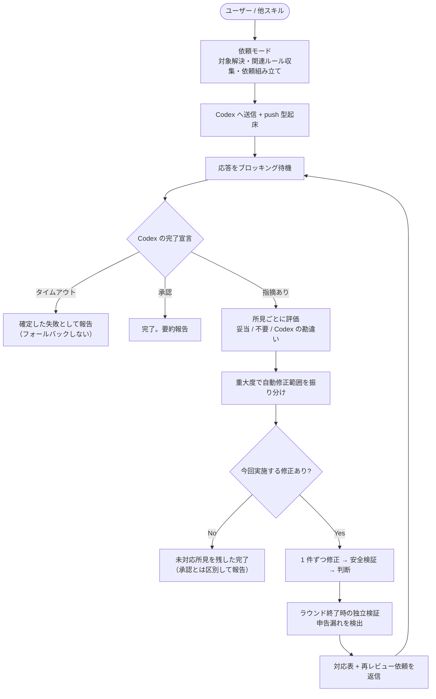

# レビューガイド

コード・文書を常駐 Codex セッションにレビューさせ、受領した所見の評価・修正・再依頼・完了判定までを Claude が駆動する。Claude と Codex という別々の AI が「指摘する側」と「直す側」に分かれることで、自分の書いたものを自分で承認する構造を避ける。

## review

```
/forge:review <種別> [--diff | --branch | --files a.md,b.py,...] [--interactive | --auto-critical | --auto]
```

| 引数              | 説明                                                             |
| ----------------- | ---------------------------------------------------------------- |
| `種別`            | `code` / `requirement` / `design` / `plan` / `uxui` / `generic`  |
| `--diff`          | 現ブランチの未 commit 差分（デフォルト）                         |
| `--branch`        | base ブランチ分岐以降の全変更                                    |
| `--files`         | 明示指定したファイル群（カンマ区切り）                           |
| `--interactive`   | 既定。現状は暫定的に `--auto` と同じ振り分け（後述「暫定運用」） |
| `--auto`          | 🔴 + 🟡 を自動修正。🟢 minor は対象外                            |
| `--auto-critical` | 🔴 のみを自動修正                                                |

> **エンジン軸（`--codex` / `--claude`）は持たない**。レビュー実行は常に常駐 Codex セッションが担う。これらのフラグを渡しても警告のうえ無視して続行する（旧パイプラインからの差し替えで既存の呼び出し元が壊れないようにするため）。

### 使用例

利用者が以下をタイプして起動する:

```bash
/forge:review code                                        # 未 commit 差分（デフォルト）
/forge:review code --branch --auto                        # 分岐以降の全変更を critical+major 自動修正
/forge:review code --files src/foo.py,src/bar.py --auto    # ファイル指定
/forge:review requirement --files docs/specs/login_req.md  # 要件定義書
/forge:review design --files specs/login/design.md         # 設計書
/forge:review generic --files README.md                    # 任意の文書
```

### 前提条件

本スキルは msg-sys（Claude ⇔ Codex の非同期メッセージング基盤）の上で動作する。以下が必要:

- **Codex CLI がインストール済みで、対象プロジェクトのディレクトリで常駐起動していること**（人間が手動で起動しておく。スキルは Codex を自動起動しない）
- forge プラグインが導入されていること（Claude 側の Stop フックはプラグイン機構で自動登録される）
- `.codex/hooks.json` への Codex 側 Stop フック登録（依頼送信前にスキルが毎回自己修復するため、通常は手動作業不要）

Codex が常駐していない場合、依頼は送信されるが応答が得られず、待機予算（既定 600 秒）超過後に**確定した失敗として報告される**（フォールバックしない）。cmux 環境では対象ペインを自動発見して push 型で起床させるため、待機は通常数十秒で済む。

### いつ使うか

| シーン                | 推奨モード                                  |
| --------------------- | ------------------------------------------- |
| PR 前の最終チェック   | `--auto` で一括修正後に差分を確認           |
| 文書の品質確認        | `--auto` で修正させ、対応表で採否理由を確認 |
| CI 的な自動品質ゲート | `--auto-critical` で致命的のみ修正          |
| 他スキルの完了処理    | start-design 等が内部で `--auto` を呼ぶ     |

### 3 つの動作モード

単一ターンで完結しないため、起動契機に応じて 3 つのモードを持つ。

| モード         | 起動契機                                                   | 動作                                               |
| -------------- | ---------------------------------------------------------- | -------------------------------------------------- |
| **依頼モード** | 利用者または他スキルによる `/forge:review` 起動            | 対象解決 → 依頼組み立て → 送信 → 応答待機          |
| **受信モード** | Codex の返信が Stop フック経由で差し戻されたターン         | 所見の評価 → 修正 → 修正報告の返信、または完了判定 |
| **再開モード** | 往復上限到達の通知を受けた利用者が状況確認を指示したターン | 当該レビューの往復履歴から未解決所見を要約して報告 |

### 実行フロー



### 所見の評価は Claude が行う

Codex の指摘を鵜呑みにしない。所見ごとに、依頼時と**同じ** `review_criteria_<種別>.md` を基準に評価する。

| 判定                   | 対応                                                  |
| ---------------------- | ----------------------------------------------------- |
| 妥当な指摘             | 影響範囲・代替案を検討したうえで修正内容を決定        |
| 不要な指摘             | ドロップ。対応表に「該当しないと判断」と理由を記載    |
| Codex の勘違いに基づく | ドロップまたは次ラウンドで Codex に確認・訂正を求める |

依頼側と受信側で判断基準を揃えることで、指摘を別基準で恣意的に棄却することも、逆に無条件に採用することも防ぐ。

### 修正の安全境界

修正は全件まとめて行わず、**1 件ずつ「適用 → 検証 → 判断 → 次へ」**を繰り返す。

- **allowlist 検証**: 対象ファイル以外を変更していないか検出する。正当な波及修正と判断した場合は変更を維持し、理由を修正報告に明記する（沈黙したスコープ拡大を許さない）
- **構文検証**: 修正前の baseline と比較し、修正が新たな構文エラーを持ち込んでいないか検出する
- **ラウンド終了時の独立検証**: 上記は「どのファイルを編集したか」の自己申告に基づくため、申告漏れを拾えない。ラウンド全体の変更集合を自己申告に依存しない形で再確認する

検証スクリプトは**検出のみ**を行い、自動ロールバックはしない。事故的な逸脱か正当な波及修正かの判断は Claude が行う。

### 往復の収束

対応しなかった所見を残したまま再レビューを依頼すると、Codex が同じ所見を指摘し続けて往復が終わらない。そのため**今回実施する修正が 1 件も無い場合は再レビューを依頼せず完了する**。

この完了は Codex の承認とは異なる状態であり、要約報告では明確に区別する:

- **承認による完了**: Codex が「指摘なし」と判定した
- **未対応所見を残した完了**: Codex はなお指摘ありと判定しているが、今回のモードでは対応対象外だった

後者では、修正しなかった所見すべてを理由付きで一覧する（重大度によるモード範囲外 / 重大度を判定できなかったもの / 評価でドロップしたもの / 安全検証で取り消したもの）。人間が見落とさないための必須の区別である。

### レビュー種別

| 種別          | 対象                      | 主な観点                               |
| ------------- | ------------------------- | -------------------------------------- |
| `code`        | ソースコード              | 正確性、堅牢性、保守性                 |
| `requirement` | 要件定義書                | 完全性、一貫性、テスト可能性           |
| `design`      | 設計書                    | アーキテクチャ、要件反映、実現可能性   |
| `plan`        | 計画書                    | タスク粒度、依存関係、トレーサビリティ |
| `uxui`        | デザイントークン・UI 仕様 | HIG 準拠、ユーザビリティ、視覚的一貫性 |
| `generic`     | 任意の文書                | 構造、明確さ、完全性                   |

### 重大度レベル

| レベル    | 意味                                               | auto での扱い                         |
| --------- | -------------------------------------------------- | ------------------------------------- |
| 🔴 致命的 | 修正必須。バグ、セキュリティ、データ損失、仕様違反 | `--auto` `--auto-critical` 両方で修正 |
| 🟡 品質   | 修正推奨。規約、エラーハンドリング、パフォーマンス | `--auto` のみで修正                   |
| 🟢 改善   | あると良い。可読性、リファクタリング提案           | 自動修正しない                        |

重大度を判定できなかった所見は、安全側に倒して自動修正の対象外とし、人間の確認に委ねる。

### レビュー基準

依頼本文には、種別に対応する基準ファイルと、対象に関連するプロジェクト固有の文書のパスを埋め込む。Codex は read-only でこれらを自分で読む。

| ソース             | 内容                                                                     |
| ------------------ | ------------------------------------------------------------------------ |
| **プラグイン同梱** | 種別ごとの `review_criteria_<種別>.md`（常に含む）                       |
| **DocAdvisor**     | `/forge:query-db-rules` / `/forge:query-db-specs` が返すプロジェクト文書 |

### 暫定運用: `--interactive`

**`--interactive`（既定）は現状 `--auto` と同じ振り分けを適用する**（ユーザー指示・ユーザー責任 [2026-07-19]）。本来の「所見を 1 件ずつ提示して人間の判断を仰ぐ」段階的提示は未実装である。

この仕組みを早期に多くのプロジェクトで実運用して問題を洗い出すための暫定措置であり、次回以降に本スキル内で完結する形で実装する。

### セッションディレクトリを持たない

本スキルは所見の状態をファイルに永続化しない。1 ターン内で受領・評価・修正・返信まで完結させ、往復の履歴は msg-sys のメッセージ DB から都度復元する。

文脈が失われたターン（セッション再開・compaction 後等）でも、差し戻されたメッセージ本文のプロトコルヘッダをトリガーに受信モードへ復帰し、当該レビューの往復のみを履歴から絞り込んで再開できる。
