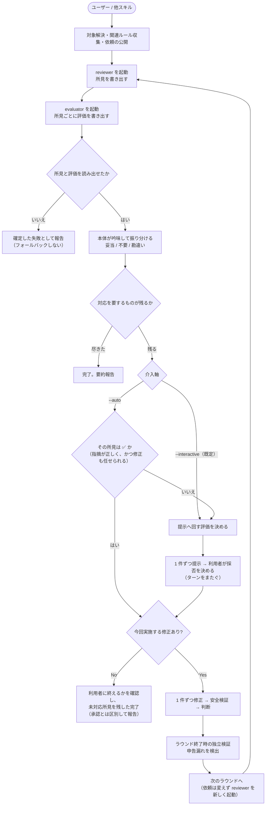

# レビューガイド

コード・文書のレビューを依頼し、返ってきた所見の評価・修正・再依頼・完了判定までをスキルの実行側が駆動する。

**渡すもの**は、レビュー対象と、それに適用する観点（プラグイン同梱の criteria とプロジェクト固有のルール・仕様）である。**返ってくるもの**は、reviewer が書き出した所見（位置・本文）と、それを独立に検証した evaluator の評価（当否・重大度・確信）である。

返ってくる所見は**気づきであって指示ではない**。採るか捨てるかを決めるのは依頼した側であり、レビュアは決定権を持たない。したがってレビューの質は「誰がレビューしたか」ではなく、**渡した入力が適正だったか**で決まる。

レビューを実際に行う主体は差し替えられる（後述「レビューバックエンド」）。観点文書・依頼と結果の構成・振り分け・修正の安全検証は、どの主体を選んでも共通である。

## review

```
/forge:review [--diff | --branch | --files a.md,b.py,... | --dirs d1/,d2/,...] [--interactive | --auto] [--focus "<重点観点>"] [--scope "<到達目標>"] [--project-rules a.md,b.md] [--project-specs c.md] [--backend <name>]
```

| 引数              | 説明                                                                           |
| ----------------- | ------------------------------------------------------------------------------ |
| `--diff`          | 現ブランチの未 commit 差分（デフォルト）                                       |
| `--branch`        | base ブランチ分岐以降の全変更                                                  |
| `--files`         | 明示指定したファイル群（カンマ区切り）                                         |
| `--dirs`          | 明示指定したディレクトリ配下すべて（カンマ区切り。後述）                       |
| `--interactive`   | 既定。修正できる所見を全件提示して採否を得る                                   |
| `--auto`          | **確信のあるものだけ確認なしに直し、確信の無いものは提示して採否を得る**       |
| `--focus`         | 今回特に注意を払う対象（自然文・任意。後述「重点観点」）                       |
| `--scope`         | 今回到達すべき範囲と意図的な未実装（自然文・複数行可・任意。後述「到達目標」） |
| `--project-rules` | レビュアへ渡すルール文書（カンマ区切り・任意。後述「規範の持ち込み」）         |
| `--project-specs` | レビュアへ渡す仕様書（カンマ区切り・任意。後述「規範の持ち込み」）             |
| `--backend`       | レビューの実行主体（任意。後述「レビューバックエンド」）                       |

> **エンジン軸（`--codex` / `--claude`）は持たない**。実行主体の指定は `--backend` だけで行う。これらの旧フラグを渡しても警告のうえ無視して続行する（旧パイプラインからの差し替えで既存の呼び出し元が壊れないようにするため）。**`--codex` を `--backend codex` と解釈することもしない**。

### 使用例

利用者が以下をタイプして起動する:

```bash
/forge:review                                             # 未 commit 差分（デフォルト）
/forge:review --branch --auto                             # 分岐以降の全変更を critical+major 自動修正
/forge:review --files src/foo.py,src/bar.py --auto         # ファイル指定
/forge:review --files docs/specs/login_req.md              # 要件定義書
/forge:review --files specs/login/design.md                # 設計書
/forge:review --dirs docs/specs/forge/design/              # ディレクトリ配下の設計書すべて
/forge:review --files src/a.py --scope "a.py の新規作成まで"  # 段階分割した実装の到達目標を伝える
```

### ディレクトリ指定（`--dirs`）

文書がディレクトリで分類されている場合（`docs/specs/*/design/` など）、配下をまとめてレビューできます。

```bash
/forge:review --dirs docs/specs/forge/design/
/forge:review --dirs docs/specs/forge/requirements/,docs/specs/anvil/requirements/
```

- **種別は指定しません**。種別（適用するレビュー観点）は、対象ごとにレビュアが判定します
- **レビュアへはディレクトリのまま渡します**。forge 側で配下のファイル一覧に展開しません。展開すると列挙漏れがそのままレビュー範囲の欠落になり、欠落した事実が誰にも見えなくなるためです。対象の確定はレビュア自身が行います
- 配下の列挙は `.gitignore` を尊重します。未追跡の新規文書も対象に含まれます
- 対象軸なので `--diff` / `--branch` / `--files` とは併用できません（同時指定はエラー）
- 指定ディレクトリが存在しない場合、配下に対象ファイルが 1 件も無い場合は依頼を公開せずに終了します

### 重点観点（`--focus`）

「今回はここを重点的に見てほしい」を自然文で渡せる。フラグを明示しなくても、口頭で伝えれば同じ結果になる:

```bash
/forge:review --branch --focus "文書内に記述された他文書への参照リンク"
```

```text
ブランチレビューで文書レビュー、特に文書内に記述された参照リンクを中心にレビューしてください
```

重点観点は **内蔵の観点を置き換えない**。reviewer が対象の種別ごとに読む criteria・規範文書によるレビューはそのまま行われ、指定した観点がそこに加わる。「これだけを見る」という絞り込みではない。

また、重点観点は重大度を引き上げない。重点として挙げた項目の所見であっても、🔴 / 🟡 / 🟢 は規範文書の重大度カタログから決まる。

> **恒久的な観点は criteria 側にある**。文書内の参照リンク（記法・リンク切れ）は `--focus` を指定しなくても design / requirement / plan / generic / uxui のレビューで検査される（`document_style_guide.md` §5 が各 criteria の P1 委譲先に入っているため）。`--focus` はそこに強弱を付けるための軸であり、観点そのものを追加するための唯一の手段ではない。恒久的に検査したい観点が抜けている場合は、criteria 側の修正を検討する。

### 到達目標（`--scope`）

「今回の変更はどこまで到達していればよいか」と「意図的に含めなかった項目」を渡せる。複数行を書ける:

```bash
/forge:review --files src/fm_to_pending.py --scope "fm_to_pending.py の新規作成とテストまで。

以下は今回の範囲外である。

- _meta.extracted_by の追加 — TASK-011（読む側と書く側を同時に変えないと死にフィールドになるため分離）"
```

**`--focus` とは別の軸である**。`--focus` は「通常のレビューに**加えて**注意を払う対象」、`--scope` は「**どの完成度を基準に評価するか**」。混ぜると、レビュアが「重点的に見る対象」と「評価基準」を区別できなくなる。

必要になるのは、実装を段階分割したときである。分割された 1 タスクだけをレビューすると、後続タスクで実装予定の項目が欠陥として報告され、「それは後続タスクのスコープです」と説明する往復が毎回発生する。`--scope` はその説明を最初から渡しておくための軸である。

**未指定は「対象は最終形である」を意味する**。「情報が無い」ではない。範囲外の項目が無い場合も、`--scope` を渡すなら「範囲外はなし」と明示する（空欄との区別がレビュア側で付かないため）。

**範囲外の指摘を封じる軸ではない**。宣言した未実装が設計書・仕様書の記述と矛盾している場合、レビュアはその乖離を所見として報告する。「後続タスクで実装予定」であることは、現時点で設計と実装が食い違っている事実を免除しないからである。この場合の修正対象は実装ではなく文書側になりうる（設計書に段階を注記する等）。

> `/forge:start-implement` は計画書からこの内容を自動で組み立てて渡す。グループ単位でまとめてレビューする場合は、同じグループの他タスクが担当する項目を範囲外から差し引いたうえで渡す（差し引かないと、今回実装済みの項目を「未実装」と宣言してしまう）。利用者が手で渡すのは、会話から直接レビューを依頼する場合である。

### 規範の持ち込み（`--project-rules` / `--project-specs`）

レビュアへ渡すルール文書・仕様書を明示指定する。指定した軸については、スキルが自前で `/forge:query-db-rules` / `/forge:query-db-specs` を実行しない:

```bash
/forge:review --files src/foo.py --project-rules docs/rules/implementation_guidelines.md
```

主な用途は、上流のスキル（`/forge:start-implement` 等）が既に同じ検索を済ませている場合に、**同一タスクに対して同じ検索が 2 回走るのを避ける**ことである。片方だけ渡した場合、渡さなかった軸だけがクエリされる。

渡した一覧が不足していても黙って進むことはない。コードと UI/UX については、reviewer が「規範が見当たらない場合はその事実を所見として報告する」ため、不足は所見として表に出る。

### レビューバックエンド（`--backend`）

レビュー本体は**実行主体に依存しない**。対象の解決・依頼の公開・reviewer と evaluator の起動・所見と評価の吟味・修正・完了判定を本体が担う。**レビューバックエンド**が担うのは、レビューを始める前の可用性検査と、往復の文脈を保持するかの宣言だけである。

| 指定                                      | 動作                                                                                   |
| ----------------------------------------- | -------------------------------------------------------------------------------------- |
| 指定なし                                  | 候補を順に可用性検査し、最初に使えたものを採用する（現在の候補は `agent-review` のみ） |
| `--backend <name>`                        | その実行主体で走らせる。使えなければ**代替を選ばず失敗させる**（fail closed）          |
| `.claude/.forge.yaml` の `review.backend` | プロジェクトの既定として明示指定する（`--backend` と同じ fail closed 扱い）            |

| バックエンド   | 実行主体                                  | 外部依存 |
| -------------- | ----------------------------------------- | -------- |
| `agent-review` | プラグイン同梱の read-only カスタム Agent | なし     |

現在のバックエンドは外部依存を持たない `agent-review` だけである。複数の候補があるときに備えて指定と解決の機構は残してあり、**採用したバックエンドと、その決まり方（引数 / 設定 / 候補順）は毎回引数解釈結果に出力される**。reviewer または evaluator が失敗した場合も別バックエンドへ自動で切り替えない。

前提条件はバックエンドごとに異なり、満たしていない場合は依頼を公開せず不足内容を報告する（fail closed）。候補順の設計根拠・各バックエンドの前提条件の詳細は `review/SKILL.md`、`REQ-013` FNC-1318 を参照。

### いつ使うか

| シーン                | 推奨モード                                  |
| --------------------- | ------------------------------------------- |
| PR 前の最終チェック   | `--auto` で一括修正後に差分を確認           |
| 文書の品質確認        | `--auto` で修正させ、対応表で採否理由を確認 |
| CI 的な自動品質ゲート | `--auto` で確信のあるものだけ修正           |
| 他スキルの完了処理    | start-design 等が内部で `--auto` を呼ぶ     |

### 動作の流れ

`/forge:review` を起動すると、本体は対象の解決 → 依頼の公開 → reviewer と evaluator の起動 → 所見と評価の吟味・修正 → 完了判定の順に進める。reviewer と evaluator は、本体から `review_id` と `round_number` だけを受け取り、依頼・所見・評価は script が JSON として書く。本体は script が返したパスの JSON を直接読む。

**中断したレビューを続きから再開する経路は持たない**。依頼・所見・評価はレビューの終了時に削除される。続きが必要なら、同じ対象で新しいレビューを起動する。

### 実行フロー


```mermaid
flowchart TD
    START([ユーザー / 他スキル]) --> REQ

    REQ["対象解決・関連ルール収集・依頼の公開"] --> RV

    RV["reviewer を起動<br/>所見を書き出す"] --> EV

    EV["evaluator を起動<br/>所見ごとに評価を書き出す"] --> READ

    READ{所見と評価を読み出せたか}
    READ -->|"いいえ"| FAIL["確定した失敗として報告<br/>（フォールバックしない）"]
    READ -->|"はい"| EXAM

    EXAM["本体が吟味して振り分ける<br/>妥当 / 不要 / 勘違い"] --> REMAIN

    REMAIN{対応を要するものが残るか}
    REMAIN -->|"尽きた"| DONE["完了。要約報告"]
    REMAIN -->|"残る"| MODE

    MODE{介入軸}
    MODE -->|"--interactive（既定）"| TRIAGE
    MODE -->|"--auto"| SPLIT

    SPLIT{"その所見は ✅ か<br/>（指摘が正しく、かつ修正も任せられる）"}
    SPLIT -->|"はい"| CONFIRM
    SPLIT -->|"いいえ"| TRIAGE

    TRIAGE["提示へ回す評価を決める"] --> STEP

    STEP["1 件ずつ提示 → 利用者が採否を決める<br/>（ターンをまたぐ）"] --> CONFIRM

    CONFIRM{今回実施する修正あり?}
    CONFIRM -->|No| DONE2["利用者に終えるかを確認し、<br/>未対応所見を残した完了<br/>（承認とは区別して報告）"]
    CONFIRM -->|Yes| FIX

    FIX["1 件ずつ修正 → 安全検証 → 判断"] --> VERIFY

    VERIFY["ラウンド終了時の独立検証<br/>申告漏れを検出"] --> NEXT

    NEXT["次のラウンドへ<br/>（依頼は変えず reviewer を新しく起動）"] --> RV
```

### 所見の評価は依頼した側が行う

**返ってくる所見は気づきであって指示ではない。** 採るか捨てるかを決めるのは依頼した側であり、妥当でない所見は理由を記録して捨てる。全件が妥当でなければ全件捨てる。evaluator が付けた重大度も、提示順の材料であり、採否の決定権を持たない。

本体は、evaluator の評価を、reviewer と evaluator が読んだものと**同じ** `review_criteria_<種別>.md` と規範文書に照らして吟味する。評価の値にそのまま従わず、内容を理解し、調査してから、修正・ドロップ・終端を決める。

| 判定               | 対応                                                   |
| ------------------ | ------------------------------------------------------ |
| 妥当な指摘         | 影響範囲・代替案を検討したうえで修正内容を決定         |
| 不要な指摘         | ドロップ。対応表に「該当しないと判断」と理由を記載     |
| 勘違いに基づく指摘 | ドロップまたは次ラウンドでレビュアに確認・訂正を求める |

判断基準を揃えることで、指摘を別基準で恣意的に棄却することも、逆に無条件に採用することも防ぐ。

レビュー結果の質を上げる手段は、**入力を適正にすること**に限られる。渡す観点文書・規範・対象・重点観点・到達目標が適切かどうかが結果を決める。

### 修正の安全境界

修正は全件まとめて行わず、**1 件ずつ「適用 → 検証 → 判断 → 次へ」**を繰り返す。

- **allowlist 検証**: 対象ファイル以外を変更していないか検出する。正当な波及修正と判断した場合は変更を維持し、理由を修正報告に明記する（沈黙したスコープ拡大を許さない）
- **構文検証**: 修正前の baseline と比較し、修正が新たな構文エラーを持ち込んでいないか検出する
- **ラウンド終了時の独立検証**: 上記は「どのファイルを編集したか」の自己申告に基づくため、申告漏れを拾えない。ラウンド全体の変更集合を自己申告に依存しない形で再確認する

検証スクリプトは**検出のみ**を行い、自動ロールバックはしない。事故的な逸脱か正当な波及修正かの判断は、スキルの実行側が行う。

### 往復の収束

対応しなかった所見を残したまま再レビューを依頼すると、レビュアが同じ所見を指摘し続けて往復が終わらない。そのため**今回対応できる所見が無く、提示へ回る所見も無い場合は、再レビューを依頼せず、利用者に終えるかを確認する**。終えるかを決めるのは利用者であり、本体が単独で打ち切らない。段階的提示を途中で中断した場合は、それまでに採用が決まった所見の修正を済ませたうえで完了する（中断は件数によらず完了になる）。

次のラウンド番号が 5 以上になる場合も、再レビューを依頼せずに止まる。4 ラウンドを超えても所見が解消しないのは、多くの場合、最初の対応自体の方向が誤っている兆候である。本質・責務・範囲を見直し、続けるか終えるかを利用者に確認する。

この完了は承認による完了とは異なる状態であり、要約報告では明確に区別する:

- **承認による完了**: 評価に、対応を要する指摘（妥当な指摘、または規範文書自体の欠陥）が無くなった
- **未対応所見を残した完了**: 対応を要する評価がなお残っているが、今回のモードでは対応対象外だった、または利用者が終えると決めた

後者では、修正しなかった所見すべてを理由付きで一覧する（利用者が採用しないと判断したもの / 位置が確定せず対象外としたもの / 評価でドロップしたもの / 安全検証で取り消したもの）。人間が見落とさないための必須の区別である。

### レビュー種別

種別は指定する値ではない。レビュアが対象 1 件ごとに判定し、種別に対応する観点文書を適用する（ADR は design として扱う）。

| 種別          | 対象                      | 主な観点                               |
| ------------- | ------------------------- | -------------------------------------- |
| `code`        | ソースコード              | 正確性、堅牢性、保守性                 |
| `requirement` | 要件定義書                | 完全性、一貫性、テスト可能性           |
| `design`      | 設計書                    | アーキテクチャ、要件反映、実現可能性   |
| `plan`        | 計画書                    | タスク粒度、依存関係、トレーサビリティ |
| `uxui`        | デザイントークン・UI 仕様 | HIG 準拠、ユーザビリティ、視覚的一貫性 |

> 1 つの依頼が指す対象には、コード・文書・設定が混在しうる（`--diff` / `--branch` では特に）。そのため種別は依頼に持たせない。上表のいずれにも当てはまらないファイルには、レビュアが `review_criteria_generic.md`（構造・明確さ・完全性）を適用する。`generic` は**種別として指定できる値ではない**。

### 重大度レベル

| レベル    | 意味                                               | auto での扱い      |
| --------- | -------------------------------------------------- | ------------------ |
| 🔴 致命的 | 修正必須。バグ、セキュリティ、データ損失、仕様違反 | 提示順で最初に出る |
| 🟡 品質   | 修正推奨。規約、エラーハンドリング、パフォーマンス | 次に出る           |
| 🟢 改善   | あると良い。可読性、リファクタリング提案           | 最後に出る         |

**重大度は、確認なしに直してよいかを決めない。提示順を決めるだけである。** 確認なしに直してよいかを決めるのは所見ごとの確信（指摘が正しいか `☑️` / その修正を責任を持って実行できるか `✅`）であり、確認なしに直すのは `✅` だけである。位置が確定していない所見は、重大度にも確信にも関係なく自動修正の対象外とする。確信の判定基準の詳細は `review/SKILL.md`「確信は自動修正の可否を決める」を参照。

### レビュー基準

reviewer と evaluator は、対象の種別に対応する基準ファイルを自分で読む。依頼は、対象に関連するプロジェクト固有の文書のパスを運ぶ。

| ソース               | 内容                                                                     |
| -------------------- | ------------------------------------------------------------------------ |
| **プラグイン同梱**   | 種別ごとの `review_criteria_<種別>.md`（常に含む）                       |
| **文書検索 backend** | `/forge:query-db-rules` / `/forge:query-db-specs` が返すプロジェクト文書 |

### 段階的提示

`--interactive` は修正できる所見を全件、`--auto` は確信の無い所見だけを、重大度の高い順に1件ずつ提示して採否を聞く。**次に何を扱うかは本スキルが決める**ため、利用者がすることは止める・飛ばす・順序を変えることだけでよい。位置が確定していない所見はここでも対象外とし、人間が直接内容を確認する。提示の作法は `review/SKILL.md` Step 7.5 を参照。

### 中断

段階的提示（1 件ずつ採否を聞くやり取り）は人間の応答を挟むため、途中で作業を中断できる。提示の状態は会話にだけ持たれ、永続化されない。続きが必要なら、同じ対象で新しいレビューを起動する。決着した内容は修正そのものと対応表に出るため、積み上げられて残ることはない。
