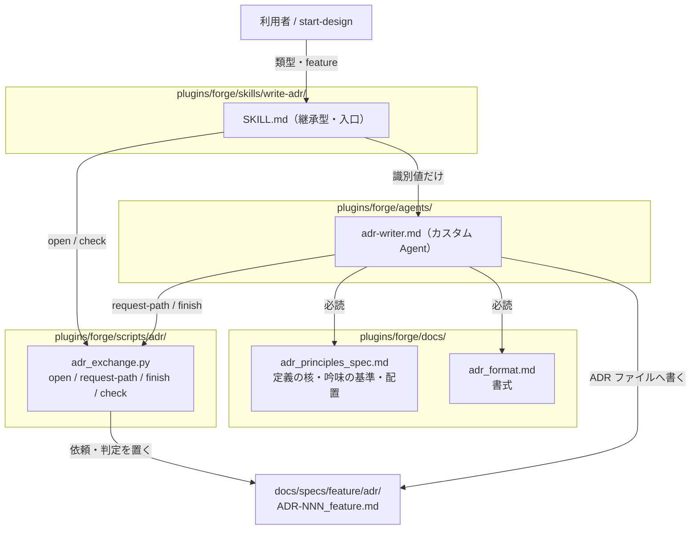
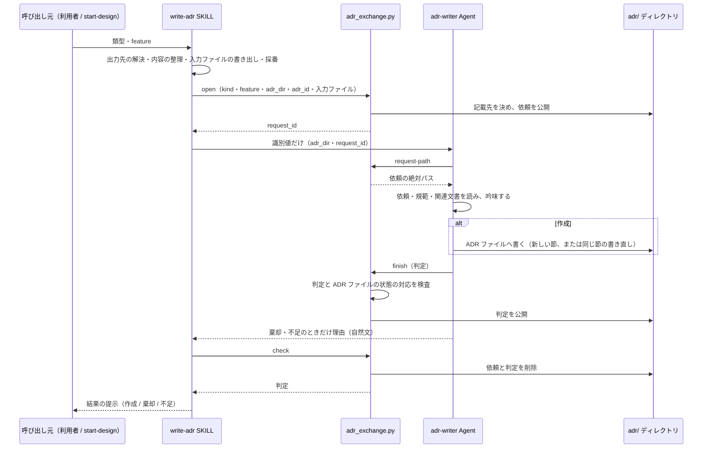

# DES-085 ADR ライター 設計書

## 1. 概要

[REQ-030](../requirements/REQ-030_adr_writer.md) の How を定める。

ADR ライターは、3 つの部品からなる。

- 入口の継承型 SKILL `write-adr`: 依頼を組み立て、Agent を起動し、判定で分岐し、完了処理を行う
- カスタム Agent `adr-writer`: 隔離した context で、依頼を吟味し、ADR ファイルへ記載する
- 受け渡しの script `adr_exchange.py`: 識別値の生成、依頼の公開、判定の記録、後始末を行う

構成は `start-plan`（SKILL）と `plan-strategist`（カスタム Agent）の先例（[DES-019](../../forge/design/DES-019_create_plan_workflow_design.md)）に倣う。呼び出し元と Agent の間で運ぶのは識別値だけで、依頼の中身は script が公開したファイルを Agent が読み、判定は script が記録する。

ADR は、feature ごとに 1 つの ADR ファイルへ、すべて書く。決定ごとにファイルを分けない。

## 2. アーキテクチャ

### 2.1 責務

| 部品               | 責務                                                                                      | 書き込み先                          |
| ------------------ | ----------------------------------------------------------------------------------------- | ----------------------------------- |
| `write-adr` SKILL  | 内容の整理、出力先の解決、採番、依頼の公開、Agent の起動、判定による分岐、完了処理        | 依頼の入力ファイル（一時）          |
| `adr-writer` Agent | 依頼の吟味、棄却・修正・不足の判定、ADR ファイルへの記載、判定の記録                      | ADR ファイルだけ                    |
| `adr_exchange.py`  | 識別値の生成、記載先の決定、依頼と判定の公開、判定と ADR ファイルの状態の対応検査、後始末 | `adr/` の依頼ファイルと判定ファイル |
| 規範文書           | ADR の定義の核、吟味の基準、書式、配置（本文は 1 か所に持ち、Agent 定義は参照する）       | なし                                |

### 2.2 設計判断

#### Agent にする理由

ADR の判断を、設計と同じ context で行うと、設計の途中経過が判断に混ざる。継承型 SKILL は親の context を引き継ぐため、SKILL として新設するだけでは、この混ざりを除けない。`context: fork` は採用しない（[Claude Code リファレンス][reference] §1 の不具合の記録）。

隔離が要る処理はカスタム Agent にする（[Claude Code 作成ガイド][authoring-guide]）。ADR ライターは、次の 2 つに当たる。

- 書き込みの境界（ADR ファイルだけ）を常時拘束したい
- 親の context が肥大する（作らない場合が大半の ADR の規範・書式が常駐する）

#### 入口を SKILL にする理由

Agent は単独で起動できず、SKILL 経由になる（`plan-strategist`・`reviewer` と同じ）。呼び出し元が複数（利用者の直接起動、`start-design`）あっても、依頼の形と完了処理を、入口 1 か所に保つ。

#### feature ごとに 1 つの ADR ファイルへ書く

同じ feature の決定は、すべて 1 つの ADR ファイルに書き、決定ごとにファイルを分けない。読み手が「検討済みか」を引くとき、開くファイルが 1 つで済む。ファイル名に番号（`ADR-{NNN}`）を持たせるのは、ファイル名で指定し、検索できるようにするためである。番号は、ファイルを最初に作るときに 1 回だけ決める。

否決は、同じ決定の節の書き直しで扱う。別の ADR を作らず、失効の印も付けない。旧い案は、同じ節の「検討した代替案」へ移す。誤った理由を残しても、読み手は間違った理由を読むだけであり、ADR を可変にしたのは、書き損じを書き直して正すためだからである。

#### ADR の本文は Agent が直接書く

置き場・ファイル名・ID・判定の記録は、決定論的に作れるので script が担う。ADR の本文は、内容そのものの決定であり、AI が担う（[deterministic_generation_spec.md](../../../../plugins/forge/docs/deterministic_generation_spec.md) §6）。先例の `plan-strategist` も、戦略書を直接書く。

節構成の検査（決定の節の番号、4 つの小節、旧書式の混入など）は、script の実行時検査に持たせない。受け取る側の形式検査は、検査点を増やし、落ちた理由を分からなくする（同 §7）。節構成は、既存の `test_adr_reference_integrity.py` と、レビュー観点（`review_criteria_design.md` の「ADR 運用」）が担う。

#### 返すのは判定だけにする

ADR ライターは独立した書き手であり、「作成」は、できたこと自体で足りる。記載先は、feature の ADR ファイルであり、呼び出し元が出力先から知っている。返す情報があるのは、呼び出し元が次の手を取るために理由を要する、棄却と不足だけである。理由は量が小さく、読み手が人と呼び出し元の AI なので、return value に自然文で書く。呼び出し元が分岐に使う判定は、閉じた 3 値として script が記録する。承認記録で判定を読み違えると、承認の記録が無いまま設計が進むためである。

[DES-022](../../forge/design/DES-022_parallel_agent_output_contract_design.md) は、収集系・並列の Agent の結果の受け渡し契約であり、書き込み系の ADR ライターには、その §3.0 により適用されない。

## 3. モジュール設計

### 3.1 モジュール一覧

| モジュール                                  | 責務                                                             | 依存                                             |
| ------------------------------------------- | ---------------------------------------------------------------- | ------------------------------------------------ |
| `plugins/forge/skills/write-adr/SKILL.md`   | 入口。内容の整理・採番・依頼の公開・Agent の起動・分岐・完了処理 | `adr_exchange.py`、`adr-writer`、`doc-structure` |
| `plugins/forge/agents/adr-writer.md`        | 吟味と記載。書いてよいのは ADR ファイルだけ                      | `adr_exchange.py`、規範文書                      |
| `plugins/forge/scripts/adr/adr_exchange.py` | 依頼の公開・判定の記録・後始末                                   | 標準ライブラリのみ                               |
| `plugins/forge/docs/adr_principles_spec.md` | ADR の定義の核、吟味の基準、配置、重大度カタログ                 | なし                                             |
| `plugins/forge/docs/adr_format.md`          | ADR ファイルの書式                                               | なし                                             |
| `plugins/forge/docs/adr_usage_spec.md`      | 読み手向けの義務（ADR を根拠に判断するとき）                     | なし                                             |

依存は、SKILL → script・Agent → script・規範文書の一方向である。script は SKILL・Agent を import しない。

### 3.2 `adr_exchange.py`

#### 識別値と置き場

- 識別値は、出力先ディレクトリ（`adr_dir`）と `request_id` の 2 つである。`request_id` は `open` が依頼ごとに生成して返す。同じ feature で複数の依頼があり得るため、先例（feature ごとに 1 件）と違い、依頼ごとの値を持つ
- 依頼と判定のファイルは、`adr_dir` に `adr_request_{request_id}.json`、`adr_result_{request_id}.json` として置く。残骸は、`git status` に未追跡として現れるため、異常を検知できる

#### 記載先の決定

`open` が、`adr_dir` の `ADR-*.md` を調べて、記載先を決める。

| `adr_dir` の ADR ファイル | 記載先                                                                                                   |
| ------------------------- | -------------------------------------------------------------------------------------------------------- |
| 1 つある                  | そのファイル。`--adr-id` は使わない                                                                      |
| 無い                      | `{adr_dir}/{adr_id}_{feature}.md`。`--adr-id` が必須。`{feature}` は、feature 名の `-` を `_` に直した値 |
| 2 つ以上ある              | 失敗する。同じ feature の ADR は 1 つのファイルに書く決定に反する状態であり、どれに書くかを推測しない    |

#### サブコマンド

| サブコマンド   | 呼ぶ主体 | 動作                                                                                                |
| -------------- | -------- | --------------------------------------------------------------------------------------------------- |
| `open`         | SKILL    | 入力ファイルを読み、依頼を組み立てて公開し、`request_id` を返す。入力ファイルは読んだあとに削除する |
| `request-path` | Agent    | 公開済みの依頼の絶対パスだけを返す                                                                  |
| `finish`       | Agent    | 判定（`created` / `rejected` / `insufficient`）を検査して記録する。上書きしない                     |
| `check`        | SKILL    | 判定を返す。成否にかかわらず依頼と判定を削除する。ADR ファイルは残す                                |

#### 依頼のフィールド

| フィールド        | 内容                                                                                                                   |
| ----------------- | ---------------------------------------------------------------------------------------------------------------------- |
| `request_id`      | `open` が生成した識別値                                                                                                |
| `kind`            | `approval-record`（承認記録）/ `judgement`（判断記録）/ `update`（更新）                                               |
| `feature`         | 対象の feature 名                                                                                                      |
| `adr_dir`         | 出力先ディレクトリの絶対パス                                                                                           |
| `adr_path`        | 記載先の絶対パス（上の表で決まる ADR ファイル）                                                                        |
| `baseline_sha256` | `open` 時点の ADR ファイルの内容のハッシュ。ADR ファイルがまだ無ければ `null`                                          |
| `decision` ほか   | `decision`・`context`・`alternatives`・`approval_quote`・`change`。入力ファイルの内容を、そのまま置く。無ければ `null` |
| `related_docs`    | 関連する文書の絶対パスの配列                                                                                           |

自由記述の値（`decision` など）は、コマンド引数ではなく、利用者の会話から整理して Write ツールで書いた入力ファイルから読む。コマンド引数にすると、改行・引用符・バッククォートが変形するためである。値は生成・要約・改変せずに置く。

#### `open` の入力

入力ファイルは、SKILL が `.claude/.temp/adr-${CLAUDE_SESSION_ID}-{名前}.md` に書く。`open` は、読んだあとに削除する。

| 入力ファイル（`{名前}`） | オプション              | 依頼のフィールド | 必須の類型         |
| ------------------------ | ----------------------- | ---------------- | ------------------ |
| `decision`               | `--decision-file`       | `decision`       | 承認記録・判断記録 |
| `change`                 | `--change-file`         | `change`         | 更新               |
| `context`                | `--context-file`        | `context`        | 任意               |
| `alternatives`           | `--alternatives-file`   | `alternatives`   | 任意               |
| `approval-quote`         | `--approval-quote-file` | `approval_quote` | 承認記録           |

| 引数            | 内容                                                                 |
| --------------- | -------------------------------------------------------------------- |
| `--kind`        | 類型。閉じた集合（`approval-record` / `judgement` / `update`）。必須 |
| `--feature`     | 対象の feature 名。必須                                              |
| `--adr-dir`     | 出力先ディレクトリ。必須                                             |
| `--adr-id`      | 採番した ID。ADR ファイルがまだ無いときだけ使われる                  |
| `--related-doc` | 関連する文書の絶対パス。1 件ごとに繰り返す                           |

`open` の出力は、標準出力の JSON の `request_id` である。

#### 検査

引数の形の検査（`open`）:

- `kind` が閉じた集合に含まれる
- `--adr-id` を渡す場合は、`ADR-` と数字の形である
- 承認記録・判断記録では `decision` の入力ファイルが、更新では `change` の入力ファイルが必須である
- ADR ファイルが無いのに `--adr-id` が無い場合と、`adr_dir` に ADR ファイルが 2 つ以上ある場合は、失敗する

判定と ADR ファイルの状態の対応検査（`finish`）。これは、script が組み立てても自動的には満たされない、2 つの結果の間の対応関係である。

| 判定                        | ADR ファイルが `open` 時点で無かった場合 | ADR ファイルが `open` 時点であった場合    |
| --------------------------- | ---------------------------------------- | ----------------------------------------- |
| `created`                   | 記載先が実在し、空でない                 | 内容のハッシュが `baseline_sha256` と違う |
| `rejected` / `insufficient` | 記載先が存在しない                       | 内容のハッシュが `baseline_sha256` と同じ |

#### 終了コードと出力

終了コードは `0`（完了）・`1`（区別のない失敗）・`2`（引数を受理できない）だけを返す。標準出力は、`0` のとき結果の JSON、非 0 のとき `errors`（自然文の配列）を持つ JSON とする（`2` は `argparse` が標準エラー出力へ書く）。例外のキャッチは外部要因（`OSError`、判定ファイルの `ValueError`）に限り、内部のバグは握りつぶさない（[COMMON-REQ-002](../../common/requirements/COMMON-REQ-002_error_handling_policy.md)）。

判定の `rejected` と `insufficient` はエラーではなく、判定できる結果であり、終了コードは `0` である。

### 3.3 `adr-writer` Agent

| 項目     | 内容                                                                                                                                                                                  |
| -------- | ------------------------------------------------------------------------------------------------------------------------------------------------------------------------------------- |
| tools    | `Read` / `Grep` / `Glob` / `Bash` / `Write` / `Edit`。`Agent`・`Skill`・`AskUserQuestion` は持たない                                                                                  |
| model    | `inherit`                                                                                                                                                                             |
| 書き込み | 依頼の `adr_path` だけ（ADR ファイル）。仕様・ルール・コードを書き換えない                                                                                                            |
| Bash     | 受け渡しの script（`request-path`、`finish`）だけ                                                                                                                                     |
| 必読     | `adr_principles_spec.md`、`adr_format.md`、`document_style_guide.md`。呼び出し元は渡さない                                                                                            |
| 入力     | 識別値の 2 つ（`adr_dir`、`request_id`）だけ。依頼の中身は、識別値を `request-path` へ渡して得た絶対パスのファイルを直接読んで知る。フィールドは[依頼のフィールド](#依頼のフィールド) |
| 出力     | return value に、棄却と不足のときだけ、理由を自然文で書く。作成のときは書かない。ADR の本文は載せない。判定は `finish` で 1 回だけ記録する                                            |
| 異常     | 最後まで終えられないときは、`finish` を呼ばずに終える。何が起きたかは return value に自然文で書く                                                                                     |

吟味の基準は、規範文書（`adr_principles_spec.md`「吟味の基準」）が持つ。Agent 定義は、その節に従うことと、類型ごとの扱い（下表）だけを持ち、基準の本文を再掲しない。

| 類型     | 吟味                                                                                                                 | 判定               |
| -------- | -------------------------------------------------------------------------------------------------------------------- | ------------------ |
| 承認記録 | 義務の記録が成立しているか（要件へ戻せない理由・利用者の承認の引用）。棄却しない                                     | 作成 / 不足        |
| 判断記録 | 規範の基準で、棄却・修正して記載・不足を判定する。記載するときは、ADR ファイルに新しい決定の節を足す                 | 作成 / 棄却 / 不足 |
| 更新     | 対象の決定の節と変更を読み、同じ節を書き直す。旧い案は、同じ節の代替案へ、正しい理由とともに移す。旧い理由は残さない | 作成 / 棄却 / 不足 |

記載するときは、書く前に、書こうとする各文が依頼の内容か読んだ文書に根拠を持つかを 1 文ずつ確かめる。根拠の無い文は書かず、棄却理由の根拠が無ければ「不足」へ改める。根拠の基準は、規範文書（`adr_principles_spec.md`「吟味の基準」）が持つ。

### 3.4 `write-adr` SKILL

継承型 SKILL（`context: fork` を指定しない）。冒頭に、「このスキルは ADR の作成の依頼のみを行う。親が依頼している他の作業を引き継いではならない」を書く。

| 引数             | 内容                                                                                 |
| ---------------- | ------------------------------------------------------------------------------------ |
| 類型             | `approval-record` / `judgement` / `update`                                           |
| `feature`        | 対象の feature 名。省略時は対話で確定する。複数のコンポーネントに跨る決定は `common` |
| `--defer-finish` | 呼び出し元が完了処理を担うときに付ける。入口は完了処理を行わない                     |

処理の流れは、次のとおりである。

1. **出力先の解決**: `doc-structure` スキルの「出力先ディレクトリの解決」手順で、文書種別 `adr`、feature `{feature}` の出力先を求める。種別の宣言が無ければ、同手順の引き継ぎに従う
2. **内容の整理**: 呼び出し元の会話から、決定・文脈・検討した代替案と棄却理由・関連する文書を整理し、Write ツールで入力ファイルへ書く。承認記録では、利用者の承認の発言を逐語で引用する。更新では、対象の決定の節と、変更の内容と理由を書く。会話に無い情報は、利用者に確認する
3. **採番**: `next-spec-id` の採番スクリプトを `ADR --share-prefixes ADR,DES` で実行し、`next_id` を得る。ADR ファイルがまだ無いときだけ、記載先の名前に使われる。`duplicates` が空でなければ、利用者に提示する。採番は `docs/specs/` 全体で共有される
4. **依頼の公開**: `adr_exchange.py open` を実行し、`request_id` を得る
5. **Agent の起動**: Agent ツールで `forge:adr-writer` を起動する。prompt に書くのは、識別値（`adr_dir`、`request_id`）だけである
6. **判定の取得**: `adr_exchange.py check` を実行する。失敗なら、Agent の return value を添えて利用者へ報告し、再実行か中止かを確認する。再実行は 2 からやり直す（`check` が依頼を削除し、`open` が入力ファイルを削除しているため）。棄却と不足の理由は、Agent の return value から読み取る
7. **判定による分岐**:

| 判定 | 動作                                                                                                      |
| ---- | --------------------------------------------------------------------------------------------------------- |
| 作成 | 何も受け取らない。記載先は、出力先の ADR ファイルである。`--defer-finish` が無ければ、完了処理（8）へ進む |
| 棄却 | 理由を利用者へ提示して終える。ADR ファイルには何も書かれていない                                          |
| 不足 | 理由（足りない情報）を利用者に確認して補い、2 からやり直す                                                |

8. **完了処理**（`--defer-finish` が無いとき）: `/forge:review --files {ADR ファイル} --auto`、`/forge:update-db-specs`、commit の確認（`anvil:commit`）の順に行う

呼び出し元（`start-design`）は、`--defer-finish` を固定の値として、起動箇所にリテラルで書く（[REQ-003](../../forge/requirements/REQ-003_skill_script_separation.md) FNC-006）。

### 3.5 規範文書

| 文書                        | 変更                                                                                                                                                                                                                                                         |
| --------------------------- | ------------------------------------------------------------------------------------------------------------------------------------------------------------------------------------------------------------------------------------------------------------ |
| `adr_principles_spec.md`    | 定義の核（優れた方式がありそうなのに採らなかった）、「誰が見ても正しい方式は書かない」、吟味の基準（書く内容は、渡された内容と読んだ文書に根拠のあるものだけ）、配置（feature ごとに 1 つの ADR ファイル）、否決の取り込み、失効の廃止、重大度カタログの更新 |
| `adr_usage_spec.md`（新規） | 読み手向けの義務（棄却理由が依拠する前提の確認、ADR の番号の併記、拘束力を持たないこと）                                                                                                                                                                     |
| `adr_format.md`             | ADR ファイルの書式。決定ごとの節（`## N.`）と、4 つの小節。失効マーカーの廃止。ID への言及の記法                                                                                                                                                             |
| `doc_structure_format.md`   | 推奨する文書種別に `adr` を足す                                                                                                                                                                                                                              |

## 4. ユースケース設計

### 4.1 ユースケース一覧

| ID    | ユースケース                                     | 主体                         |
| ----- | ------------------------------------------------ | ---------------------------- |
| UC-01 | 判断記録を依頼し、決定が ADR ファイルに足される  | 利用者 → `write-adr`         |
| UC-02 | 判断記録が棄却される                             | 利用者 → `write-adr`         |
| UC-03 | 情報が足りず、不足として返り、補って再依頼する   | `write-adr` ⇄ 利用者         |
| UC-04 | 設計中に承認記録を依頼する                       | `start-design` → `write-adr` |
| UC-05 | 既存の決定が否決され、同じ節が書き直される       | 利用者 → `write-adr`         |
| UC-06 | Agent が最後まで終えられず、異常として報告される | `write-adr`                  |

### 4.2 シーケンス図

**前提条件**: 文書種別 `adr` が `.doc_structure.yaml` に宣言されている。
**正常フロー**: 上図のとおり。判定が「作成」なら、feature の ADR ファイルに、決定が書かれている。
**エラーフロー**:

- `open` の失敗（`adr_dir` に ADR ファイルが 2 つ以上ある、入力ファイルが無い）: `errors` を利用者へ報告して止める
- `finish` の失敗（判定と ADR ファイルの状態が合わない）: Agent は、内容を直して `finish` をやり直す。直せなければ呼ばずに終える
- `check` の失敗（判定が記録されていない）: 異常として報告し、再実行か中止かを確認する

## 5. 使用する既存コンポーネント

| コンポーネント            | ファイルパス                                                                                 | 用途                                               |
| ------------------------- | -------------------------------------------------------------------------------------------- | -------------------------------------------------- |
| 受け渡しの型の先例        | `plugins/forge/scripts/plan/strategy_exchange.py`、`plugins/forge/agents/plan-strategist.md` | `open` / `request-path` / `finish` / `check` の型  |
| 出力先の解決              | `plugins/forge/skills/doc-structure/SKILL.md`                                                | 文書種別 `adr` の出力先、宣言が無い場合の引き継ぎ  |
| 採番                      | `plugins/forge/skills/next-spec-id/scripts/scan_spec_ids.py`                                 | ADR ファイルの番号。`ADR --share-prefixes ADR,DES` |
| Agent の frontmatter 検査 | `tests/forge/agents/test_agent_frontmatter.py`                                               | tools の allowlist の回帰検査                      |
| ADR の参照と書式の検査    | `tests/common/test_adr_reference_integrity.py`                                               | `adr/` 配下の ADR ファイルを `rglob` で走査する    |
| ADR のレビュー観点        | `plugins/forge/docs/criteria/review_criteria_design.md`                                      | `target_files` に ADR が含まれる場合の「ADR 運用」 |

`scan_spec_ids.py` は、他の SKILL（`start-design`、`start-plan` など）も直接呼ぶ。skill 固有の配置にあるものを複数の SKILL が呼ぶ現状は、本設計では変えない。

## 6. テスト設計

- **単体テスト対象**: `adr_exchange.py`（`tests/forge/adr/test_adr_exchange.py`）

| 対象                 | 検証                                                                                                       |
| -------------------- | ---------------------------------------------------------------------------------------------------------- |
| `open`（記載先）     | ADR ファイルが無ければ採番した ID で新しく決め、1 つあればそのファイルを使い、2 つ以上あれば失敗する       |
| `open`（依頼）       | 依頼の公開、`adr_dir` の作成、絶対パス化、`request_id` の生成と返却、`baseline_sha256` の記録              |
| `open`（値の保存）   | 改行・引用符・バッククォート・非 ASCII を含む自由記述が、変形せずに依頼に届く。入力ファイルが削除される    |
| `open`（引数の検査） | 閉じた `kind`、`adr_id` の形、類型ごとの必須の入力ファイル、ADR ファイルの数と `--adr-id` の要否           |
| `request-path`       | 公開前は失敗する。返すのは絶対パスだけで、依頼の中身を標準出力に載せない                                   |
| `finish`             | 判定の閉じた集合、判定と ADR ファイルの状態の対応（新しい・既存の両方）、上書きしない                      |
| `check`              | 判定だけを返す。判定が無い・壊れている・未知の値は失敗する。成否にかかわらず依頼と判定を削除し、ADR を残す |
| 出力契約             | 終了コードが 0・1・2 だけである。失敗は `errors` の配列で返る。例外は握りつぶされない                      |

- **Agent の Role 制約**: `tests/forge/agents/test_agent_frontmatter.py` に `adr-writer` の tools の allowlist を足し、`Agent`・`Skill`・`AskUserQuestion` を持たないことを検査する
- **契約テスト**（`tests/forge/adr/test_adr_writer_contract.py`）:
  - `write-adr` が `forge:adr-writer` を起動し、`allowed-tools` に `Agent` を持つ
  - `adr-writer.md` が、書き込みの範囲と、利用者に質問しないことを述べる
  - `start-design` が、ADR の書式・規範文書の読み込みと、ADR の採番の手順を持たない
- **評価テスト**（`ai_tests/forge/adr-writer/`）: 吟味の基準の評価。決定・文脈・代替案と期待判定（作成・棄却・不足）を持つケースを、Markdown で置く。ケースは、実在の決定を改変したものと、架空のものからなる。ADR ライターにケースを渡し、判定を期待と比べる。判定は AI の出力で揺れ、費用もかかるため、CI のゲートには入れず、手動で実行する。手順は同じ場所の `README.md` が持つ

## 7. 未確定事項

該当なし。

[reference]: ../../../rules/claude_code_reference.md
[authoring-guide]: ../../../rules/claude_code_authoring_guide.md
