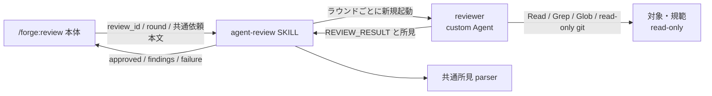

# DES-072 agent-review バックエンド設計

## メタデータ

| 項目     | 値                                    |
| -------- | ------------------------------------- |
| 設計 ID  | DES-072                               |
| 関連要件 | REQ-016 / REQ-013 FNC-1318            |
| 関連設計 | ADR-066 / ADR-071 / DES-055 / DES-066 |
| 作成日   | 2026-08-06                            |
| 対象     | `agent-review` と `reviewer` Agent    |

## 1. 概要

`agent-review` は `/forge:review` 本体から共通依頼本文を受け取り、read-only カスタム Agent `reviewer` を 1 ラウンドにつき 1 回起動する継承型バックエンド SKILL である。

バックエンドは Agent の起動、出力の契約検証、共通所見形式への変換だけを担う。Agent セッション、レビュー履歴、DB レコード、終了時に解放する資源を保持しない。

## 2. アーキテクチャ

### 2.1 コンポーネント

| コンポーネント       | 責務                                                                   |
| -------------------- | ---------------------------------------------------------------------- |
| `agent-review` SKILL | モード判定、可用性検査、Agent 起動、出力検証、共通結果の返却           |
| `reviewer` Agent     | 対象と規範の読解、所見の判断、統一返信形式による結果返却               |
| 共通所見 parser      | `REVIEW_RESULT` と finding の構文を判定し、所見配列へ変換              |
| `/forge:review` 本体 | 依頼本文の構築、バックエンド選択、所見評価、修正、次ラウンド、終端処理 |

本体は Agent の定義名、ツール制約、起動方法を知らない。`reviewer` の事情は `agent-review` 内に閉じる。

### 2.2 Agent 定義

`reviewer` はプラグインのカスタム Agent として同梱し、次の制約を Agent 定義の構築点 1 箇所へ置く。

- `Write`、`Edit`、Notebook 編集、Agent 起動、Skill 起動の各ツールを許可しない
- `Read`、`Grep`、`Glob` を許可する
- 差分・ブランチ対象の確定に必要な場合だけ、read-only git 照会を許可する
- permission mode を `plan` とし、変更操作の承認要求へ昇格させない
- 役割を「所見の判断と統一返信形式の返却」に限定し、修正やコミットを指示しない
- 環境から注入される `advisor` ツールの呼び出しを役割定義で禁じる（レビュー判断に不要であり、応答待ちがラウンド実行時間を浪費する。ツールは「他 Agent・Skill の起動禁止」に掛からないため個別に禁じる）

read-only git 照会は、`status`、`diff`、`show`、`log`、`merge-base`、`rev-parse`、`ls-files` などリポジトリを変更しない操作に限定する。`add`、`commit`、`checkout`、`switch`、`reset`、`clean`、`stash`、`rebase`、`merge`、`push` を含む変更操作を許可しない。

ツール制約とプロンプト指示の双方を設けるのは、役割の誤解による修正実行と、利用可能ツールの過剰付与を別々に防ぐためである。

レビュアーには汎用コマンド実行を許可する。対象を自分で確定するために必要であり（REQ-013 FNC-1312）、これを外すと範囲指定のレビューが成立しない。役割定義には許可する git 操作の列挙と変更操作の禁止列挙を置く。

read-only を能力の限定で保証する設計を採らない経緯は ADR-073 にある。

## 3. バックエンドモード

### 3.1 可用性検査

可用性検査は Agent を起動せず、次を確認する。

1. `reviewer` Agent 定義を解決できる
2. Agent 起動ツールが現在のホストで利用できる
3. Agent 定義が編集専用ツール・Agent 起動・Skill 起動を許可していない
4. permission mode が `plan` である
5. 統一返信形式と read-only の役割指示が定義されている（汎用コマンド実行を許可している場合は、許可する git 操作の列挙と変更操作の禁止列挙があること）

汎用コマンド実行を許可していること自体は不足として扱わない（§2.2 のとおり対象の確定に必要である）。検査は Agent 定義が意図どおりに書かれていることを確認する。

すべて満たせば `available` を返す。不足は 1 件に畳み込まず、条件ごとの説明として返す。検査では Agent、ファイル、DB、プロセスを作成しない。

### 3.2 ラウンド実行

入力は共通契約の `review_id`、ラウンド番号、レビューのパターン、テンプレート展開済みの依頼本文とする。パターンは本体が確定した値をそのまま受け取るだけで、本バックエンドは判定にも Agent 起動にも使わない（ワイヤヘッダを持たないため用途がない）。

1. 入力の必須値と型を検証する
2. 新しい `reviewer` Agent を起動し、依頼本文を変更せず渡す
3. Agent の最終応答だけを取得する
4. 共通所見 parser で応答を検証する
5. `approved`、`findings`、`failure` のいずれかを本体へ返す
6. parser が注意（位置未確定として受理した所見の件数等）を返した場合、それも本体へ渡す
7. Agent への参照を保持せずラウンドを終える

**parser の注意を破棄しない [MANDATORY]**: 判定と所見配列だけを返すと、位置未確定の件数が本バックエンドで消える。同じ共通 parser を使う他のバックエンドはこれを本体へ渡すため、バックエンドを替えただけで利用者への通知が失われる非対称が生まれる。

Agent 起動時に resume ID、前ラウンドの transcript、前回の最終応答を渡さない。後続ラウンドで必要な変更内容と未解決所見は、本体が共通依頼本文へ明示的に組み立てた情報だけを使う。

`review_id` とラウンド番号は本体との結果対応に使うが、Agent の継続識別子としては使わない。`[msg-review]` ワイヤヘッダを生成または注入しない。受信した共通本文の先頭行が厳密なワイヤヘッダ形に一致する場合だけ混入として拒否し、本文中の説明や引用にある単なる `[msg-review]` の言及は許可する。

### 3.3 終了通知

終了通知モードは `review_id` を受理し、成功として直ちに返る no-op とする。

ラウンドごとの Agent は結果返却時に既に終了しており、バックエンドはプロセス、スレッド、履歴、DB レコードを保持しない。終了通知を契機に Agent の探索、停止、削除、追加通信を行わない。

### 3.4 履歴復元要求

`agent-review` は履歴復元拡張を公開しない。互換性のため履歴復元要求を受け取った場合は、空配列ではなく `unsupported` と、非永続バックエンドである旨を返す。

本体はこの結果を同一レビューの開始状態として扱わない。継続が必要なら新しい `review_id` を生成し、新規レビューの通常経路へ戻る。

## 4. 出力契約

### 4.1 Agent 応答

`reviewer` は共通テンプレートが定める統一返信形式を使う。バックエンドは自由文から判定を推測せず、共通所見 parser が受理した結果だけを採用する。

| Agent 応答                                 | バックエンド結果 |
| ------------------------------------------ | ---------------- |
| `REVIEW_RESULT: approved`                  | `approved`       |
| `REVIEW_RESULT: findings` + 1 件以上の所見 | `findings`       |
| 起動不能、timeout、応答欠落                | `failure`        |
| 未知の判定、構文不正、空の findings        | `failure`        |

### 4.2 所見

`findings` の各要素は、共通形式の次の情報を保持する。

- `severity`
- 所見本文の `text`
- ファイルパスと行番号、または位置未確定を表す `location`

対象位置を特定できない所見は、推測で補完または破棄せず、共通契約に従って位置未確定を明示する。応答から位置を取り出せない所見も共通 parser が位置未確定として受理し、件数を `warnings` で返す（REQ-013 の共通書式契約）。**位置表記の欠落を理由にラウンドを `failure` にしない**。

### 4.3 失敗

`failure` はレビュー所見ではない。少なくとも失敗段階と利用者向け説明を持つ。

| 失敗段階     | 例                                     |
| ------------ | -------------------------------------- |
| availability | Agent 定義不在、起動機能不在、制約不備 |
| launch       | Agent を起動できない                   |
| execution    | timeout、Agent の異常終了              |
| response     | 応答欠落、未知判定、共通形式違反       |

ラウンド実行後の `failure` を理由に `msg-review` へ切り替えない。

## 5. 状態と資源

| 対象                | 保持     |
| ------------------- | -------- |
| Agent セッション    | しない   |
| ラウンド transcript | しない   |
| レビュー履歴        | しない   |
| DB レコード         | 作らない |
| 常駐プロセス        | 作らない |
| 終了通知対象の資源  | 持たない |

本体の会話に Agent 応答が残ることは、バックエンドが履歴復元可能であることを意味しない。復元可能性は、バックエンドが `review_id` をキーに完全な往復と解決状態を再構成できる場合に限る。

## 6. テスト設計

| 対象                 | 検証                                                                              |
| -------------------- | --------------------------------------------------------------------------------- |
| 可用性検査           | Agent 定義、起動機能、permission mode、禁止ツールの各不足を副作用なく個別報告する |
| Agent ライフサイクル | 連続ラウンドで新しい Agent を起動し、resume ID を渡さない                         |
| read-only 制約       | 編集・外部書き込みツールが無く、変更 git 操作を実行できない                       |
| 正常結果             | `approved` と、位置情報付き所見配列を伴う `findings` を共通形式で返す             |
| 異常結果             | 起動失敗、timeout、応答欠落、未知判定、形式不正を理由付き `failure` にする        |
| ワイヤ中立性         | Agent 入力に `[msg-review]` を付加しない                                          |
| 終了通知             | 成功する no-op であり、Agent、記録、通信を追加しない                              |
| 履歴非対応           | 履歴要求に `unsupported` を返し、空履歴または暗黙の前ラウンド文脈を返さない       |
| 非永続性             | ラウンド後に DB、履歴ファイル、常駐プロセス、再利用可能な Agent 参照が残らない    |

## 7. 未確定事項

なし。
