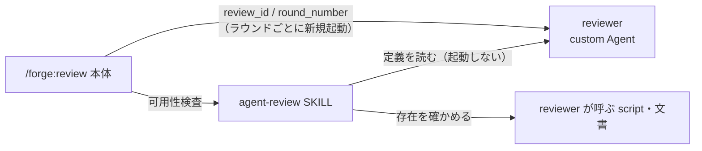

# DES-072 agent-review バックエンド設計

## 1. 概要

`agent-review` は、read-only カスタム Agent `reviewer` を実行主体とするレビューバックエンド SKILL である。SKILL が担うのは**可用性検査だけ**であり、reviewer の起動と所見の受け渡しは `/forge:review` 本体が直接行う（[DES-084](../../review/design/DES-084_reviewer_design.md)・[REQ-029](../../review/requirements/REQ-029_review_exchange.md)）。

バックエンドは Agent セッション、レビュー履歴、DB レコード、解放すべき資源を保持しない。

## 2. アーキテクチャ

```mermaid
flowchart LR
    Body["/forge:review 本体"]
    Backend["agent-review SKILL"]
    Agent["reviewer<br/>custom Agent"]
    Parts["reviewer が呼ぶ script・文書"]

    Body -->|"可用性検査"| Backend
    Backend -->|"定義を読む（起動しない）"| Agent
    Backend -->|"存在を確かめる"| Parts
    Body -->|"review_id / round_number（ラウンドごとに新規起動）"| Agent
```

### 2.1 コンポーネント

| コンポーネント       | 責務                                                                                                   |
| -------------------- | ------------------------------------------------------------------------------------------------------ |
| `agent-review` SKILL | 可用性検査（reviewer の定義と、reviewer が呼ぶ script・文書の確認）。`retains_context` の申告          |
| `reviewer` Agent     | 対象と規範の読解、所見の判断、script 経由での所見の書き出し（DES-084 §4.2）                            |
| `/forge:review` 本体 | 依頼の公開、バックエンド選択、reviewer・evaluator の起動、所見と評価の吟味、修正、次ラウンド、終端処理 |

本体は reviewer を `forge:reviewer` として起動する。reviewer の定義が成立しているか、reviewer が呼ぶ script と読む文書が揃っているかの確認は、`agent-review` が可用性検査として持つ。

### 2.2 Agent 定義

`reviewer` はプラグインのカスタム Agent として同梱し、次の制約を Agent 定義の構築点 1 箇所へ置く。

- `Write`、`Edit`、Notebook 編集、Agent 起動、Skill 起動の各ツールを許可しない
- `Read`、`Grep`、`Glob`、`Bash` を許可する。`Bash` で実行してよいのは、reviewer が呼ぶ script（DES-084 §6.6）と、差分・ブランチ対象の確定に必要な read-only git 照会だけである
- permission mode を `plan` とし、変更操作の承認要求へ昇格させない
- 役割を「所見の判断と、script 経由の書き出し」に限定し、修正やコミットを指示しない
- 環境から注入される `advisor` ツールの呼び出しを役割定義で禁じる（レビュー判断に不要であり、応答待ちがラウンド実行時間を浪費する。ツールは「他 Agent・Skill の起動禁止」に掛からないため個別に禁じる）

read-only git 照会は、`status`、`diff`、`show`、`log`、`merge-base`、`rev-parse`、`ls-files` などリポジトリを変更しない操作に限定する。`add`、`commit`、`checkout`、`switch`、`reset`、`clean`、`stash`、`rebase`、`merge`、`push` を含む変更操作を許可しない。

ツール制約とプロンプト指示の双方を設けるのは、役割の誤解による修正実行と、利用可能ツールの過剰付与を別々に防ぐためである。

レビュアには汎用コマンド実行を許可する。対象を自分で確定するために必要であり（REQ-013 FNC-1312）、所見を書き出す script を呼ぶためにも要る。これを外すと範囲指定のレビューも所見の書き出しも成立しない。役割定義には許可する git 操作の列挙と変更操作の禁止列挙を置く。

上記の役割定義とツール制約は違反を防ぐ手段であり、read-only の担保ではない。許可の単位が汎用である以上「読み取りだけ」を宣言する手段が無く、能力の限定では担保できない。

## 3. 可用性検査

可用性検査は Agent を起動せず、`reviewer.md` を読んで条件 1〜4 を、script と文書の存在を確かめて条件 5 を、個別に確認する。

1. 定義ファイルが存在し、名前が `reviewer` である
2. `tools` が `Read, Grep, Glob, Bash` と一致し、編集専用ツール・Agent 起動・Skill 起動を含まない
3. `model: inherit` と `permissionMode: plan` がある
4. 役割が read-only の禁止列挙と、許可する git 読み取り操作の列挙を規定し、所見の書き出しを script 経由と規定している。応答本文の宣言行や重大度マーカーを完了の条件にしていない
5. reviewer が呼ぶ script（依頼のパスを得る・所見を渡す・書き出しを終える・異常を伝える `reviewer_*` の 4 本と `resolve_doc_structure.py`）と、読む文書（`criteria/review_target_types.md`）が、プラグイン内に存在する

汎用コマンド実行を許可していること自体は不足として扱わない（§2.2 のとおり対象の確定と書き出しに必要である）。検査は Agent 定義が意図どおりに書かれていることを確認する。

すべて満たせば `{"available": true, "missing": [], "retains_context": false}` を返す。不足は 1 件に畳み込まず、条件ごとに `axis`・`detail`・`remedy` を持つ要素として `missing` へ並べる。検査では Agent、ファイル、DB、プロセスを作成しない。

**`retains_context` は常に `false` である**。このバックエンドはラウンドごとに新しい reviewer を起動し、前ラウンドの transcript を渡さない。本体はこの値で流れを分ける（REQ-029 FNC-316）。値の宣言は `resolve_review_backend.py` が持ち（DES-084 §6.7）、可用性検査の申告はそれと一致させる。申告を誤ると、レビューの流れが reviewer の実態と食い違う。

別のバックエンドへ切り替えない。

## 4. 状態と資源

| 対象                | 保持     |
| ------------------- | -------- |
| Agent セッション    | しない   |
| ラウンド transcript | しない   |
| レビュー履歴        | しない   |
| DB レコード         | 作らない |
| 常駐プロセス        | 作らない |
| 解放すべき資源      | 持たない |

reviewer が書く依頼・所見・評価は、本体が管理する保持物であり（DES-084 §5）、バックエンドの状態ではない。バックエンドは、レビューの途中状態を持たない。

## 5. テスト設計

| 対象           | 検証                                                                                      |
| -------------- | ----------------------------------------------------------------------------------------- |
| 可用性検査     | 定義・tools・permission mode・禁止列挙・script と文書の各不足を、副作用なく個別に報告する |
| 申告           | `retains_context` が常に `false` であり、`resolve_review_backend.py` の宣言と一致する     |
| read-only 制約 | 編集・外部書き込みツールが無く、変更 git 操作を許可していない                             |
| 非永続性       | 検査の後に DB、履歴ファイル、常駐プロセス、再利用可能な Agent 参照が残らない              |

## 6. 未確定事項

なし。
