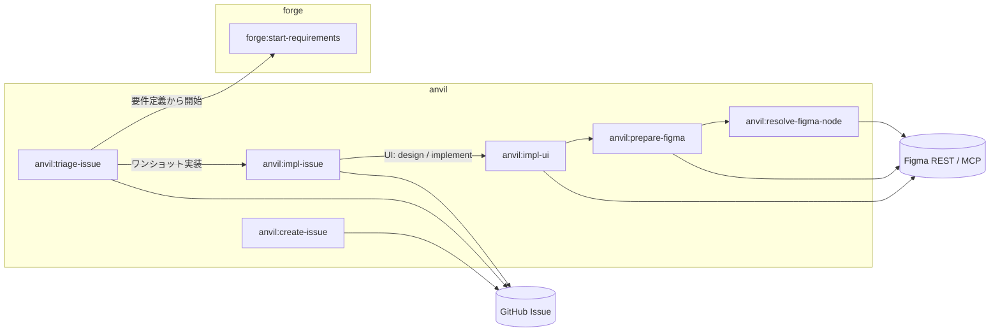
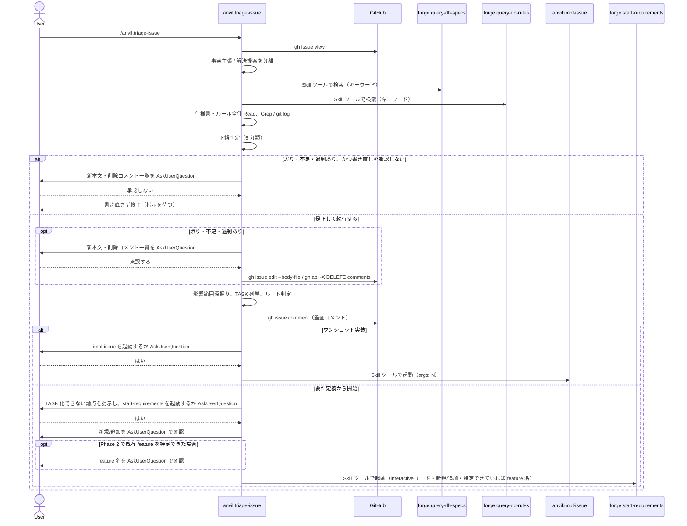
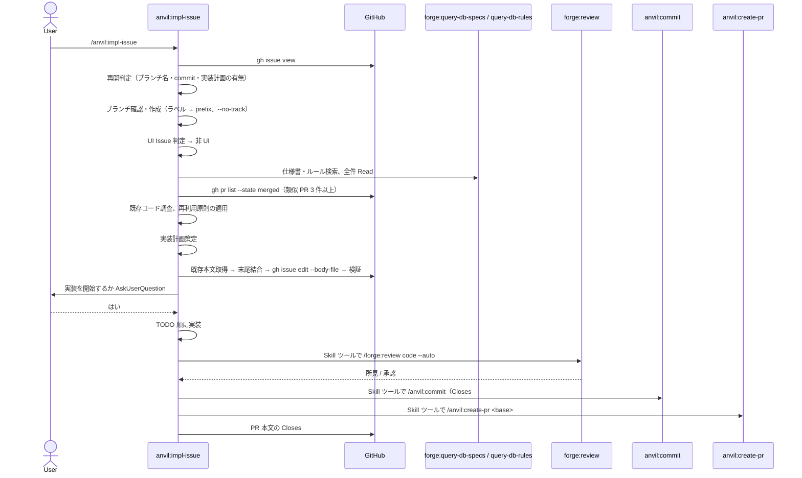
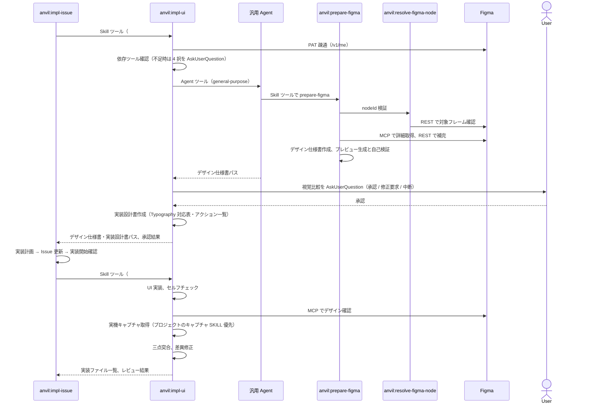

# DES-025 Issue 起点開発フロー 設計

## 1. 概要

REQ-005 が定める Issue 起点開発フローを、anvil プラグイン配下の 4 つの継承型 SKILL（`create-issue` / `triage-issue` / `impl-issue` / `impl-ui`）と、UI 補助 skill（`prepare-figma` / `resolve-figma-node`）、既存の `commit` / `create-pr` で構成する。forge の検索・レビュー・要件定義 skill は Skill ツール経由で呼び出し、forge は改変しない。判定と手順はすべて SKILL.md に置き、Issue 本文のマーカー対と監査コメントで工程間の状態を受け渡す。

---

## 2. アーキテクチャ概要

### 2.1 コンポーネントと依存方向



図はフローを構成する skill と外部システムの依存だけを示す。各 skill が利用する横断的なユーティリティ（forge の検索・レビュー、anvil の commit / create-pr）は §2.2・§3.1・§7 に記す。

- 依存は anvil → forge の一方向のみ。forge 側から anvil を参照しない
- forge の skill は常に Skill ツールで起動し、forge のスクリプトを直接 import / subprocess 実行しない

### 2.2 skill 一覧と起動経路

| Skill                      | `user-invocable` | 起動経路                                                                         | 責務                                                                                                             |
| -------------------------- | ---------------- | -------------------------------------------------------------------------------- | ---------------------------------------------------------------------------------------------------------------- |
| `anvil:create-issue`       | true             | 利用者                                                                           | 種別選択、必須セクション収集、Issue 起票                                                                         |
| `anvil:triage-issue`       | true             | 利用者                                                                           | Issue の正誤検証・是正、TASK 化、ルート判定、監査コメント、`impl-issue` または `forge:start-requirements` の起動 |
| `anvil:impl-issue`         | true             | 利用者、または `triage-issue` から Skill ツール                                  | ブランチ準備、修正のための調査、実装計画、Issue 更新、実装、レビュー、commit / PR 作成                           |
| `anvil:impl-ui`            | false            | `impl-issue` から Skill ツール（`--stage design` / `--stage implement` の 2 回） | Figma ベースの設計・実装・三点突合レビュー                                                                       |
| `anvil:prepare-figma`      | false            | `impl-ui` が立てる汎用 Agent の中で Skill ツール                                 | デザイン仕様書の作成（nodeId 検証、MCP / REST 取得、AI 理解プレビューの生成と自己検証）                          |
| `anvil:resolve-figma-node` | false            | `prepare-figma` から Skill ツール                                                | Figma REST API による対象フレームの識別子確定                                                                    |
| `anvil:commit`             | true             | 利用者、または `impl-issue` から Skill ツール                                    | commit（ステージ状態検査を script で行う）                                                                       |
| `anvil:create-pr`          | true             | 利用者、または `impl-issue` から Skill ツール                                    | ドラフト PR 作成（CI 状態検査を script で行う）                                                                  |

すべて継承型 SKILL であり、`context: fork` を持たない。隔離 context が必要な処理は Agent ツールで行う（`prepare-figma` を汎用 Agent で実行、`forge:review` が `forge:reviewer` / `forge:evaluator` カスタム Agent を起動）。

---

## 3. モジュール設計

### 3.1 モジュール一覧

| モジュール                                                                                                | 責務                                                                                                                                                                                          | 依存                                                                                                                                                        |
| --------------------------------------------------------------------------------------------------------- | --------------------------------------------------------------------------------------------------------------------------------------------------------------------------------------------- | ----------------------------------------------------------------------------------------------------------------------------------------------------------- |
| `plugins/anvil/skills/create-issue/SKILL.md`                                                              | Phase 0〜5: 環境確認、種別選択、必須セクション収集（不在表現・中核密度・Figma 参照情報）、タイトル確定、プレビューと起票、次ステップ案内                                                      | `gh` CLI、`.git_information.yaml`                                                                                                                           |
| `plugins/anvil/skills/triage-issue/SKILL.md`                                                              | Phase 0〜8: リポジトリ解決、Issue 取得と主張 / 提案の分離、仕様書・ルール・既存コード調査、正誤判定と是正、影響範囲深掘りと TASK 化、ルート判定、報告・監査コメント・引き渡し                 | `gh` CLI、`/forge:query-db-specs`、`/forge:query-db-rules`、`anvil:impl-issue`、`/forge:start-requirements`                                                 |
| `plugins/anvil/skills/impl-issue/SKILL.md`                                                                | Phase 0〜12: リポジトリ解決・再開判定・ブランチ準備、UI Issue 判定、修正のための調査、UI 設計委譲、実装計画、Issue 更新、実装開始確認、実装、レビュー、commit / PR 作成                       | `gh` CLI、`/forge:query-db-specs`、`/forge:query-db-rules`、`/forge:query-forge-rules`、`/forge:review`、`anvil:impl-ui`、`anvil:commit`、`anvil:create-pr` |
| `plugins/anvil/skills/impl-issue/assets/TEMPLATE.md`                                                      | Issue に追記する実装計画の書式                                                                                                                                                                | —                                                                                                                                                           |
| `plugins/anvil/skills/impl-issue/references/reuse-principles.md`                                          | 既存資産の再利用原則・検証チェックリスト（Phase 5 / 7 で適用）                                                                                                                                | —                                                                                                                                                           |
| `plugins/anvil/skills/impl-issue/references/issue-update.md`                                              | Issue 本文の取得・検証・結合・更新手順、参照の記法、非 ASCII URL のエンコード（Phase 8）                                                                                                      | `gh` CLI                                                                                                                                                    |
| `plugins/anvil/skills/impl-ui/SKILL.md`                                                                   | Phase 0〜5: 段階解析と Figma PAT・依存ツール確認、デザイン仕様書作成、視覚比較レビュー、実装設計書、UI 実装、三点突合レビュー                                                                 | `anvil:prepare-figma`（汎用 Agent 経由）、Figma MCP、`FIGMA_PAT`、`/forge:query-db-rules`                                                                   |
| `plugins/anvil/skills/impl-ui/references/{impl-design,ui-implementation,typography-mapping,ui-review}.md` | 実装設計書の作成ルール、UI 実装ルール、Typography 照合ルール、三点突合レビュールール                                                                                                          | —                                                                                                                                                           |
| `plugins/anvil/skills/prepare-figma/SKILL.md` と `scripts/`                                               | 画面設計書読み込み、nodeId 検証、Figma 取得、デザイン仕様書作成、プレビュー生成（`extract_preview_json.py` / `json_to_html.py` / `render_preview.sh` / `trim_screenshot.py`）と自己検証ループ | `anvil:resolve-figma-node`、Figma MCP / REST、`FIGMA_PAT`、Chrome、`uv` または Pillow                                                                       |
| `plugins/anvil/skills/resolve-figma-node/SKILL.md`                                                        | Figma REST API による nodeId・URL の確定（fileKey の既定値を持たない）                                                                                                                        | Figma REST、`FIGMA_PAT`                                                                                                                                     |
| `plugins/anvil/skills/commit/SKILL.md` と `scripts/inspect_stage_state.py`                                | dprint 整形、ステージ状態検査、保護ブランチ確認、commit、push 確認                                                                                                                            | `git`、`dprint`                                                                                                                                             |
| `plugins/anvil/skills/create-pr/SKILL.md` と `scripts/inspect_ci_status.py`                               | コミット差分からタイトル・本文生成、ドラフト PR 作成、CI 状態検査                                                                                                                             | `gh` CLI、`.git_information.yaml`                                                                                                                           |

### 3.2 Phase 構成

**triage-issue**

| Phase | 内容                                                                                                                                                                                                         |
| ----- | ------------------------------------------------------------------------------------------------------------------------------------------------------------------------------------------------------------ |
| 0     | `.git_information.yaml` または `gh repo view` でリポジトリ解決。URL 引数はリポジトリ整合を確認                                                                                                               |
| 1     | Issue 取得。事実主張 / 解決提案の分離。非構造化なら不足項目を AskUserQuestion で 1 回にまとめて確認                                                                                                          |
| 2     | `/forge:query-db-specs` で仕様書特定、全件 Read。外部リポジトリ・symlink は実体の GitHub URL で記録                                                                                                          |
| 3     | `/forge:query-db-rules` でルール特定、全件 Read。CLAUDE.md と基盤ルールの一般クエリ                                                                                                                          |
| 4     | Grep / Glob / `git log` で発生箇所・参照元・同種箇所・直近変更を特定                                                                                                                                         |
| 5     | 5-1 判定（正しい / 誤り / 不足 / 過剰 / 判定不能）、5-2 是正（承認後に本文置換とコメント全削除、検証）                                                                                                       |
| 6     | 影響範囲の再調査、TASK 列挙（対象・変更内容・確認方法）、TASK 化できない理由の分類                                                                                                                           |
| 7     | ルート判定（全 TASK 列挙 → ワンショット実装 / 残余 → 要件定義から開始）と一文根拠                                                                                                                            |
| 8     | 8-1 会話報告、8-2 監査コメント、8-3 起動確認 1 回のうえ `impl-issue`（args: Issue 番号）または `start-requirements`（args: interactive モード・新規/追加・既存 feature を特定できていれば feature 名）を起動 |

**impl-issue**

| Phase | 内容                                                                                               |
| ----- | -------------------------------------------------------------------------------------------------- |
| 0     | 0-1 リポジトリ解決と URL 整合、0-2 Issue 取得と再開判定、0-3 ブランチ確認・作成                    |
| 1     | 実装内容の把握、UI Issue 判定（表。割れたら AskUserQuestion）                                      |
| 2〜5  | 仕様書 / ルール / 類似 PR（3 件以上）/ 既存コードの調査（修正のため。全件 Read、該当なしを記録）   |
| 6     | UI Issue のみ: `anvil:impl-ui --stage design`                                                      |
| 7     | 実装計画策定（スコープ・順序・スコープ外・参考 PR）                                                |
| 8     | Issue 更新（既存本文取得 → 検証 → 末尾結合 → `gh issue edit --body-file` → 検証）                  |
| 9     | 実装開始確認（AskUserQuestion）                                                                    |
| 10    | 実装。UI Issue は `anvil:impl-ui --stage implement`（レビューを含む）、非 UI は TODO 順に実装      |
| 11    | 非 UI のみ: `/forge:review code --auto`                                                            |
| 12    | 12-1 `/anvil:commit`（`Closes #N`）、12-2 `/anvil:create-pr`（PR 本文の `Closes #N` を確認・追記） |

**impl-ui**

| Phase | 段階      | 内容                                                                                     |
| ----- | --------- | ---------------------------------------------------------------------------------------- |
| 0     | 共通      | `--stage` 解析、Figma PAT 疎通、依存ツール確認（design のみ。不足時は 4 択）             |
| 1     | design    | `prepare-figma` を汎用 Agent で実行しデザイン仕様書を作成                                |
| 2     | design    | 視覚比較（Figma SS と AI プレビュー）を利用者が承認 / 修正要求 / 中断                    |
| 3     | design    | 実装設計書作成（Typography 対応表・アクション一覧を必須で含む）                          |
| 4     | implement | UI 実装（仕様書 = 構造の正、Figma = ビジュアルの正。共用コンポーネント変更禁止）         |
| 5     | implement | 三点突合レビュー（Figma SS / 実機キャプチャ / コード・設計書）、結果を impl-issue へ返す |

### 3.3 判定ロジック

**正誤判定（triage-issue Phase 5-1）**: 事実主張・解決提案の各項目を、Phase 2〜4 で得た実体（仕様書の記述、ルール、コードの位置）と突き合わせ、5 分類のいずれかに置く。判定不能は AskUserQuestion で解消する。

**TASK 化判定（Phase 6）**: TASK は「対象（実在をパスで確認済み）」「変更内容（調査・検討は含まない）」「完了の確認方法」の 3 項目が埋まるもの。埋まらない項目は「要件が定まっていない」「妥当な解が複数あり選択基準が要件に依存」「影響範囲が閉じない」のいずれかに分類する。

**ルート判定（Phase 7）**: 全 TASK が列挙できればワンショット実装、TASK 化できない項目が 1 つでも残れば要件定義から開始。判定には一文の根拠を添える（ワンショットなら TASK 一覧、要件定義なら TASK 化できない項目と理由分類）。

**UI Issue 判定（impl-issue Phase 1）**:

| 観点                                               | UI Issue | 非 UI Issue            |
| -------------------------------------------------- | -------- | ---------------------- |
| 実装対象が UI / 画面ディレクトリ                   | ✅       | ✗                      |
| Figma URL が実装対象として記載                     | ✅       | ✗（参考添付なら非 UI） |
| 画面設計書への参照が実装対象として記載             | ✅       | ✗（参考添付なら非 UI） |
| ラベルに UI / 画面相当                             | ✅       | ✗                      |
| ラベルに data / domain / infrastructure / api 相当 | ✗        | ✅                     |
| 実装対象がドメイン層 / データ層のみ                | ✗        | ✅                     |

**ブランチ名（impl-issue Phase 0-3）**: `<prefix>/<issue-number>-<slug>`。prefix はラベル語句の部分一致（`bug`/`fix`/`defect`/`修正`/`不具合` → `fix/`、`feature`/`enhancement`/`feat`/`新機能`/`機能追加` → `feature/`、`refactor`/`refactoring`/`cleanup`/`リファクタ` → `refactor/`、`doc`/`docs`/`documentation`/`文書` → `docs/`、`chore`/`build`/`ci`/`test`/`dependencies`/`その他` → `chore/`）。該当なしは AskUserQuestion。`git checkout -b <branch> origin/<base> --no-track` で作成する。

---

## 4. ユースケース設計

### 4.1 ユースケース一覧

| ユースケース                    | 起動                                       | 主たる成果                                                                 |
| ------------------------------- | ------------------------------------------ | -------------------------------------------------------------------------- |
| UC-01 Issue 起票                | `/anvil:create-issue [タイトル]`           | 必須セクションとマーカー対を持つ Issue                                     |
| UC-02 トリアージ                | `/anvil:triage-issue #N`                   | 是正済み Issue、監査コメント、ルート判定。ワンショットなら impl-issue 起動 |
| UC-03 ワンショット実装（非 UI） | `/anvil:impl-issue #N` または UC-02 から   | 実装計画が追記された Issue、実装、レビュー、commit、`Closes #N` 付き PR    |
| UC-04 UI Issue の実装           | UC-03 の Phase 6 / 10 から `anvil:impl-ui` | デザイン仕様書・実装設計書・UI 実装・三点突合レビュー結果                  |
| UC-05 PR 作成失敗からの再開     | `/anvil:impl-issue #N`                     | Phase 12 からの再開                                                        |

### 4.2 シーケンス図

#### UC-02 トリアージ



**前提条件**: gh 認証済み、Issue が現在のリポジトリに属する（URL 指定時）。
**正常フロー**: 調査 → 判定 → 是正 → TASK 化 → ルート判定 → 報告・監査コメント → 引き渡し。
**エラーフロー**: 認証・権限不足・参照先消失は調査ブロッカーとして終了し、確認できなかった事項と再開条件を報告する。

#### UC-03 ワンショット実装（非 UI）



**前提条件**: gh 認証済み、git リポジトリ、remote 設定済み。
**正常フロー**: 再開判定 → ブランチ → 調査 → 計画 → Issue 更新 → 確認 → 実装 → レビュー → commit → PR。
**エラーフロー**: PR 作成失敗時は `/anvil:impl-issue #N` を再実行し、Phase 0-2 の再開判定で Phase 12 へ直行する（UC-05）。

#### UC-04 UI Issue の実装



**前提条件**: `FIGMA_PAT` で Figma に到達できる。プレビュー生成には Chrome と `uv`（または Pillow）。
**正常フロー**: 設計段階（仕様書 → 承認 → 実装設計書）→ impl-issue の計画・確認 → 実装段階（実装 → 三点突合）。
**エラーフロー**: PAT 疎通失敗・MCP 失敗は推測で進めず、利用者に報告して再試行 / 中断を確認する。実機キャプチャを取れない場合は依頼 / 未実施を明示して進行 / 中断を利用者が選ぶ。

---

## 5. データ設計

### 5.1 Issue 本文の構造

```markdown
<!-- issue-driven-flow:user-content:start -->

## 背景 / コンテキスト

…（種別ごとの必須セクション。create-issue が書き、triage-issue の是正で書き直されうる）

<!-- issue-driven-flow:user-content:end -->

## 実装計画

…（impl-issue Phase 8 が assets/TEMPLATE.md の書式で末尾に追記する）

## TODO

…
```

- マーカー対の内側は起票者の記述と是正内容。実装工程は上書きしない
- `gh issue edit --body-file` は完全置換のため、既存本文を取得・検証してから結合した全文を渡す（`references/issue-update.md`）
- 実装計画の参照は GitHub / Figma で開ける URL のみ。非 ASCII を含む URL はパーセントエンコードする

### 5.2 監査コメント

`triage-issue` Phase 8-2 が `gh issue comment` で残す。内容は Issue の正誤（判定・是正の要旨）、TASK 一覧または TASK 化できない項目、結論と根拠、調査結果（関連仕様書はローカルパスまたは GitHub URL、ルール文書、既存コード。該当なしも明記）。機械可読マーカーは持たない。

### 5.3 UI 工程の成果物

`specs/design/{画面 ID}/` に、`デザイン仕様書.md`、`images/`（Figma スクリーンショット）、`previews/`（AI 理解プレビュー）、実装設計書、`captures/`（実機キャプチャ）を置く。1 画面 = 1 ディレクトリ。

### 5.4 リポジトリ情報

`.git_information.yaml`（`github.owner` / `github.repo` / `github.remote_url` / `github.default_base_branch` / `github.pr_template`）を各 skill が読む。無ければ `gh repo view` / `git remote` から解決する。

---

## 6. エラーハンドリング設計

| 状況                                                        | 振る舞い                                                                                   |
| ----------------------------------------------------------- | ------------------------------------------------------------------------------------------ |
| gh 未インストール / 未認証、git リポジトリ外、remote 未設定 | エラー終了し、充足手順を案内する（create-issue Phase 0、create-pr Phase 1）                |
| Issue URL のリポジトリが現在のリポジトリと不一致            | triage-issue / impl-issue とも警告して中断し、対象リポジトリでの再実行を案内する           |
| トリアージの調査を完了できない（認証・権限・参照先消失）    | 調査ブロッカーとして終了。確認できなかった事項と再開条件を報告                             |
| 非構造化 Issue で必須情報が読み取れない                     | AskUserQuestion で 1 回にまとめて確認                                                      |
| 既存本文の取得失敗 / 空 / `null`                            | Issue 更新を中断して報告（`gh issue edit` を実行しない）                                   |
| Figma PAT 疎通失敗                                          | AskUserQuestion: 再試行 / 中断                                                             |
| プレビュー生成の依存ツール不足                              | AskUserQuestion: AI がインストール / 手動インストール待機 / プレビュー生成スキップ / 中断  |
| Figma MCP 失敗                                              | 報告し、REST を試す。検証が不十分なら中断（推測で進めない）                                |
| 実機キャプチャ取得不能                                      | AskUserQuestion: 利用者が取得 / 未実施を明示して進行 / 中断                                |
| `/forge:review` の所見                                      | 確信のある所見は自動修正、確信の無い所見は提示して採否を得る                               |
| PR 作成失敗                                                 | `/anvil:create-pr` を直接再実行せず、`/anvil:impl-issue #N` を再実行して Phase 12 から再開 |
| `git fetch origin <base>` 失敗                              | AskUserQuestion で対応確認（中止推奨）                                                     |

---

## 7. 使用する既存コンポーネント

| コンポーネント                  | ファイルパス                                              | 用途                                                                   |
| ------------------------------- | --------------------------------------------------------- | ---------------------------------------------------------------------- |
| forge:query-db-specs / db-rules | `plugins/forge/skills/query-db-specs/`, `query-db-rules/` | 仕様書・ルールの検索（triage-issue Phase 2〜3、impl-issue Phase 2〜3） |
| forge:query-forge-rules         | `plugins/forge/skills/query-forge-rules/`                 | 比例性・過剰設計の判断基準（impl-issue Phase 7）                       |
| forge:review                    | `plugins/forge/skills/review/`                            | 非 UI 実装のレビュー（impl-issue Phase 11）                            |
| forge:start-requirements        | `plugins/forge/skills/start-requirements/`                | 要件定義から開始の起動先（triage-issue Phase 8-3）                     |
| anvil:commit                    | `plugins/anvil/skills/commit/`                            | commit（impl-issue Phase 12-1）                                        |
| anvil:create-pr                 | `plugins/anvil/skills/create-pr/`                         | PR 作成（impl-issue Phase 12-2）                                       |
| anvil:prepare-figma             | `plugins/anvil/skills/prepare-figma/`                     | デザイン仕様書（impl-ui Phase 1）                                      |
| anvil:resolve-figma-node        | `plugins/anvil/skills/resolve-figma-node/`                | nodeId 検証（prepare-figma から）                                      |
| dprint                          | `dprint.jsonc`                                            | Markdown / JSON の整形（commit Phase 0）                               |

---

## 8. テスト設計

- **単体テスト対象**（`tests/anvil/`）: `commit/scripts/inspect_stage_state.py`（ステージ状態・stale 検出・quote / rename 表記）、`create-pr/scripts/inspect_ci_status.py`、`prepare-figma/scripts/extract_preview_json.py` / `json_to_html.py`
- **SKILL.md はテスト対象外**。以下を手動の統合検証項目とする:
  - トリアージが事実主張を実体で裏取りし、誤り・不足・過剰を承認のうえ是正すること
  - TASK 化できない項目を挙げずに要件定義から開始と判定しないこと。変更量を判定根拠にしないこと
  - 監査コメントが判定・根拠・是正要旨・参照先・TASK 一覧を含み、実装方法を含まないこと
  - impl-issue が直接起動でもトリアージ経由でも同じ調査手順を踏むこと
  - Issue 更新が既存本文を保ち、実装計画を末尾に追記すること
  - UI Issue が design / implement の 2 段階で impl-ui に委譲され、視覚比較の承認なしに実装設計書へ進まないこと
  - PR 作成失敗後の再実行が Phase 12 から再開すること
- **共通テスト**（`tests/common/`）: SKILL.md の frontmatter・`name` とディレクトリ名の一致・README との整合・`context: fork` 不在

---

## 9. 設計判断の根拠

- forge の skill を Skill ツール経由で呼び、スクリプトを直接呼ばないのは、anvil → forge の一方向依存を構造で保つため（REQ-005 NFR-01）
- Issue 本文のマーカー対で利用者記述を区切るのは、後続工程の追記で上書きしないことを機械的に判別できるようにするため
- トリアージの責務を正誤検証と TASK 化可否に置き、impl-issue を直接起動可能・自前調査とし、Figma フローを impl-ui に分離した判断は ADR-082 が持つ
- impl-ui を design / implement の 2 段階契約にしたのは、実装計画の Issue 記載と利用者の実装開始確認を impl-issue 側に残すため
