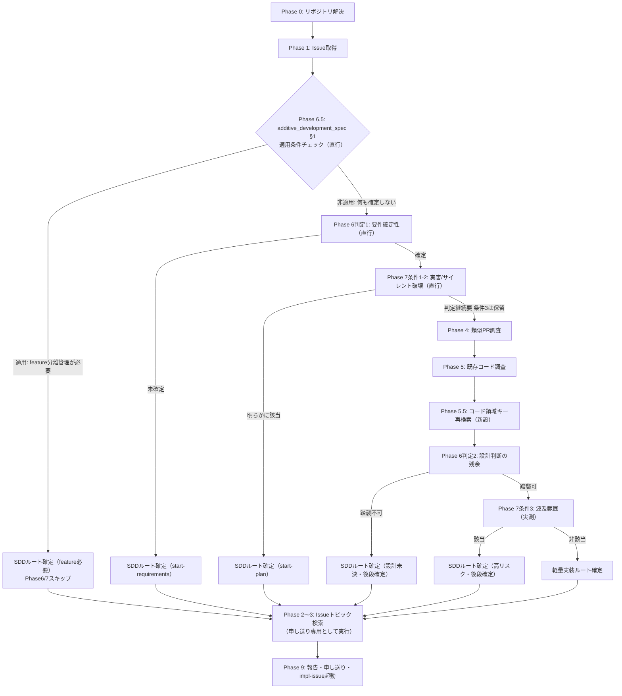
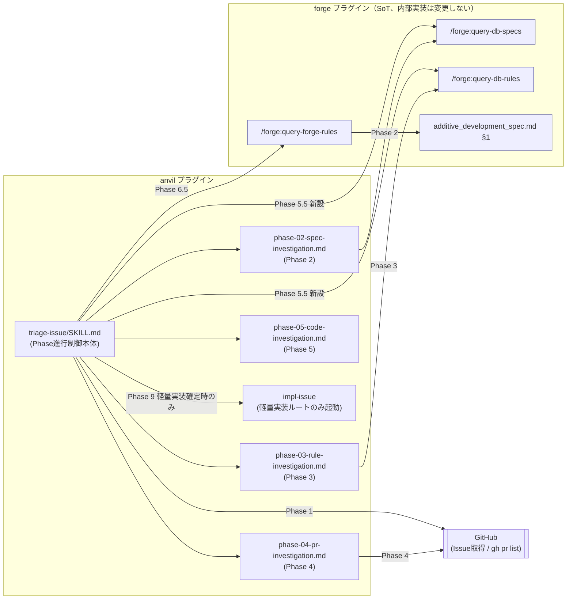

# DES-038 開発フロー分岐（トリアージ）設計: Phase 構造・SoT の分析と anvil 内での改善

## メタデータ

| 項目     | 値                        |
| -------- | ------------------------- |
| 設計ID   | DES-038                   |
| 関連要件 | REQ-005, REQ-007          |
| 親設計   | DES-025（親フロー、参考） |
| 作成日   | 2026-07-14                |
| 対象     | anvil プラグイン          |

## 1. 概要

`anvil:triage-issue` の既存 Phase 構成（0〜9）を分析し、判定ロジックの一次情報（SoT）の所在、各 Phase の判定への依存関係を明らかにする。分析結果に基づき、REQ-005 NFR-01 ／ REQ-007 NFR-01（いずれも anvil → forge 一方向依存、forge 改修禁止を定める）の制約内で実施可能な改善（Phase 構成の見直し）を設計する。

forge 側への変更が必要と判明した項目（判定基準の forge への切り出し等）は、NFR-01 が定める正規手順（本 feature 内で forge を改修せず、別 Issue・別 feature として要件定義からやり直す）に従い、本設計書の対象外とし §7 に一覧化する。

## 2. 分析結果: 判定ロジックの SoT 分類

triage-issue が行う判定を、判定基準（ルール）の性質で分類する。

| 判定の性質                                       | 例                                                                                                   | 固定ロジック化の可否                                             | 現在の SoT                                                 |
| ------------------------------------------------ | ---------------------------------------------------------------------------------------------------- | ---------------------------------------------------------------- | ---------------------------------------------------------- |
| 固定ルールの機械的適用                           | additive_development_spec.md §1 の対象外条件（バグ修正／リファクタリング／軽微な追記／初期立ち上げ） | 可能（forge が既存文書として所有）                               | forge（`plugins/forge/docs/additive_development_spec.md`） |
| Issue ごとに変わる文脈判断                       | 要件確定性・設計判断の残余                                                                           | 不可（判断内容が都度変わる）                                     | anvil（判断手続きそのものが anvil 内に存在）               |
| 独自ヒューリスティック（forge 側に対応文書なし） | リスクゲート 3 条件（後戻り困難な実害／サイレント破壊／波及範囲）                                    | 理論上は可能だが、**forge 側に受け皿となる既存文書が存在しない** | anvil（triage-issue/SKILL.md にインラインで定義）          |

固定ルールの機械的適用（1 行目）は forge が既に SoT を持つため、判定手続きを anvil 側で重複定義せず forge の文書をそのまま参照する設計が成立する。一方、リスクゲート基準（3 行目）は forge 側に対応する文書が存在しないため、forge へ委譲する場合は新規文書の作成を要する。これは NFR-01 が禁止する「本 feature 内での forge 改修」に該当するため、本設計書のスコープでは実施しない（§7 参照）。

## 3. 分析結果: Phase 別の目的・依存関係

### 3.1 現状の Phase 構成

| Phase | 目的                                                      | 性質                                                                        | 参照文書                                                                                 |
| ----- | --------------------------------------------------------- | --------------------------------------------------------------------------- | ---------------------------------------------------------------------------------------- |
| 0     | リポジトリ解決                                            | 前処理                                                                      | `.git_information.yaml`                                                                  |
| 1     | Issue 本文・コメント取得、構造化度確認                    | 入力取得                                                                    | Issue 本文                                                                               |
| 2     | 関連仕様書の検索                                          | 現状確認（主目的: impl-issue への申し送り）                                 | `query-db-specs` が返すプロジェクト固有文書                                              |
| 3     | 関連ルールの検索                                          | 現状確認（主目的: impl-issue への申し送り）                                 | `query-db-rules` が返すプロジェクト固有文書                                              |
| 4     | 類似 PR 調査                                              | 現状確認（主目的: impl-issue の実装パターン学習）                           | なし（`gh pr list` の実行結果）                                                          |
| 5     | 既存コード調査                                            | 現状確認 + 判定（Phase 6 判定2・Phase 7 条件3）の直接根拠。二重の目的を持つ | なし（Grep/Glob の実行結果）                                                             |
| 6     | 不確定性判定（要件確定性・設計判断の残余）                | 判定（文脈依存）                                                            | なし（Phase 2〜5 の調査結果を二次利用）                                                  |
| 7     | リスクゲート判定                                          | 判定（ヒューリスティック、forge 側に SoT なし）                             | なし                                                                                     |
| 8     | feature 要否判定                                          | 判定（固定ルール）                                                          | `additive_development_spec.md` §1（`query-forge-rules` 経由で Phase 8 時点で初めて読む） |
| 9     | 報告・Issue への申し送り・（軽量実装のみ）impl-issue 起動 | 出力                                                                        | なし                                                                                     |

### 3.2 判定の直行可能性（Phase 1 からの依存の有無）

| Phase / 判定                                                | Phase 1 のみで判定可能か（直行可能性）                                                               | 直行できない場合の依存先          |
| ----------------------------------------------------------- | ---------------------------------------------------------------------------------------------------- | --------------------------------- |
| Phase 6 判定1（要件確定性）                                 | 可能（Issue 本文の記述具体性のみで判定できる）                                                       | —                                 |
| Phase 6 判定2（設計判断の残余）                             | 不可                                                                                                 | Phase 4〜5（既存パターン調査）    |
| Phase 7 条件1（実害可能性）                                 | ほぼ可能（Issue 本文の推論で足りる）                                                                 | —                                 |
| Phase 7 条件2（サイレント破壊性）                           | ほぼ可能                                                                                             | —                                 |
| Phase 7 条件3（波及範囲）                                   | 不可                                                                                                 | Phase 5（既存コードの参照元実測） |
| Phase 8 相当（additive_development_spec §1 対象外チェック） | **可能**（Issue の性質分類のみで判定できる。バグ修正か等は仕様書・PR・コード調査を経由せず判定可能） | —                                 |

Phase 8 の判定内容（現状 Phase 2〜7 を経た後に初めて forge 文書を読む設計）は、実際には Phase 1 の直後に判定可能である。現状の Phase 順序は、直行可能な判定を Phase 2〜5 の重い調査の後まで待たせている。

### 3.3 分析結果: Phase 5 の判定利用には Phase 2〜3 の裏付けが必要

Phase 5（既存コード調査）の結果は、Phase 6 判定2・Phase 7 条件3 の直接の根拠として使われるが、**コードの現物（Grep/Glob 結果）だけでは判定を安全に行えない**。

- 参照元の件数（波及範囲の実測値）は、その結合が意図的な設計（ADR 等で明文化された疎結合方針）か、想定外の広がりかによって意味が変わる。件数のみでは重大性を判断できない
- 「既存パターンを踏襲すればよい」（Phase 6 判定2）と結論づける前に、そのパターン自体が ADR・ルールと矛盾していないかを確認する必要がある。確認を怠ると、既に誤りと判明している設計を「既存パターン」として是認してしまうリスクがある

このため、Phase 5 で発見したコード領域をキーに、`query-db-specs` / `query-db-rules` を**再検索**する手順が必要になる。既存の Phase 2〜3（Issue の話題をキーにした検索）とは検索キーワードの起点が異なるため、既存 Phase 2〜3 の実行では代替できない。

## 4. 設計: Phase 構成の見直し（NFR-01 制約内）

分析結果 §3.2・§3.3 を踏まえ、Phase 構成を以下のように見直す。forge 側への変更は伴わない（既存の `query-forge-rules` 呼び出しパターンをそのまま使う）。

### 4.1 新しい Phase 順序

Phase 順序の転換理由・検討した代替案は ADR-039（未承認の提案）の提案内容を参照。**Phase 6.5 は一方向の早期終了ゲートとして提案されている**: §1 適用時（feature 分離管理が必要）は確実に SDD ルートに確定できるが、§1 非適用時は「feature 分離が不要」を意味するに留まり「SDD 自体が不要」を意味しないため、通常の判定（Phase 6・Phase 7）を継続する。

### 4.1.1 ルート別ユースケース一覧

本設計は、ユーザーによる Issue 起点の起動、GitHub からの Issue 本文取得、`impl-issue`（軽量実装）への確認・委譲、SDD エントリポイント（`start-requirements` / `start-design` / `start-plan`）の提案という外部相互作用を伴う。§4.1 の Phase フロー（`RouteReq` / `RouteSDD` / `RoutePlan1` / `RouteFinal_Design` / `RouteFinal_Risk` / `RouteFinal_Light`）が確定する経路について、起動条件と成果を整理する。「設計未決」「高リスク」は、Phase 4〜5.5 の実行有無が異なる早期終了ルート（`RouteSDD` / `RoutePlan1`）と後段ルート（`RouteFinal_Design` / `RouteFinal_Risk`）の 2 経路をそれぞれ含むため、成果内容が異なる行に分けて整理する（要件未確定・軽量実装の各 1 行と合わせて合計 6 行）。

| 経路                 | 起動条件                                                                                                                                                            | 主な成果                                                                                                                                                        |
| -------------------- | ------------------------------------------------------------------------------------------------------------------------------------------------------------------- | --------------------------------------------------------------------------------------------------------------------------------------------------------------- |
| 要件未確定           | Phase 6 判定1（要件確定性判定、Phase 1 直後に直行可能）で、Issue 本文の記述具体性が不足していると判定される（`RouteReq`）                                           | ユーザーに `start-requirements` の起動を提案する。Phase 2〜3（ルート確定後に実行、§4.3）の検索結果を申し送り情報として提示に添付する                            |
| 設計未決（早期確定） | Phase 6.5（additive_development_spec.md §1 適用条件チェック）で feature 分離管理が必要と判定される（`RouteSDD`、Phase 4〜5.5 は未実行）                             | ユーザーに `start-design` の起動を提案する。SDD ルート確定（feature 必要）である旨を提示する。Phase 4〜5.5 は未実行のため、既存パターンとの整合状況は添付しない |
| 設計未決（後段確定） | Phase 6 判定2（Phase 4〜5・5.5 の調査結果に基づく設計判断の残余判定）で既存パターンの踏襲では対応できないと判定される（`RouteFinal_Design`、Phase 4〜5.5 実行済み） | ユーザーに `start-design` の起動を提案する。Phase 5.5 で確認した既存パターンと ADR・ルールとの整合状況を提示に添付する                                          |
| 高リスク（早期確定） | Phase 7 条件1〜2（実害可能性／サイレント破壊性、Phase 1 直後にほぼ直行可能）に明らかに該当する（`RoutePlan1`、Phase 4〜5 は未実行）                                 | ユーザーに `start-plan` の起動を提案する。該当条件を提示する。Phase 5 は未実行のため、波及範囲の実測結果は添付しない                                            |
| 高リスク（後段確定） | Phase 7 条件3（波及範囲、Phase 5 の実測結果に依存）に該当すると判定される（`RouteFinal_Risk`、Phase 5 実行済み）                                                    | ユーザーに `start-plan` の起動を提案する。該当条件・波及範囲の実測結果を提示に添付する                                                                          |
| 軽量実装             | Phase 6.5 が非適用（feature 分離不要）、かつ Phase 6 判定1「確定」・Phase 7 条件1〜3 のすべてが非該当と判定される（`RouteFinal_Light`）                             | `anvil:impl-issue` を起動する。Phase 2〜3 の検索結果を委譲情報として渡す                                                                                        |

いずれの経路も、ルート確定後に Phase 2〜3（申し送り専用、§4.3）を経て Phase 9（報告・申し送り・軽量実装のみ `impl-issue` 起動）に到達する（§4.1 mermaid 図の `P23 --> P9`）。

### 4.2 新設 Phase の内容

#### Phase 6.5: additive_development_spec §1 適用条件チェック（新設）[ADR-039]

Phase 1 の直後、Phase 2〜5 の前に実行する。既存の Phase 8 が行っていた判定を早期に移動する。**一方向の早期終了ゲート**として使う（§1 適用時のみ確定し、非適用時は何も確定させない）。

- 手順: `Skill: /forge:query-forge-rules`（既存パターンをそのまま使用。新規呼び出し先を作らない）で additive_development_spec.md のパスを取得し Read、§1「適用条件」（旧仕様の存在・新規要件群・分離管理価値）に該当するか判定する
- **適用条件に該当する場合**: feature 分離管理が必要であり、これは確実に SDD ルートを意味する（§1 は旧仕様と新規要件群の分離管理という、要件定義からやり直す規模の変更を前提とするため）。Phase 6・Phase 7 をスキップし、SDD ルート（feature 必要）に確定する
- **該当しない場合**: 「feature 分離管理が不要」と分かるのみで、「SDD 自体が不要」は意味しない（設計判断や高リスクを伴うバグ修正・リファクタリングは feature 分離が不要でも SDD ルートに進むべきケースがあるため）。**何も確定させず** Phase 6 判定1 に進む
- 旧 Phase 8（feature 要否判定）は本判定に統合し、削除する（同じ §1 を 2 回別々に読む重複を解消）。§1 対象外条件（バグ修正／リファクタリング等）は、Phase 6.5 では判定しない（早期の軽量実装確定には使わない。この誤用は ADR-039 §3（未承認の提案）で棄却案として検討されている）

#### Phase 5.5: コード領域キー再検索（新設）

Phase 5 の直後に実行する。

- 手順: Phase 5 で発見した参照元・変更対象コードのファイルパス・モジュール名をキーワードとして、`/forge:query-db-specs` / `/forge:query-db-rules` を再度呼ぶ（Issue の話題をキーにした既存 Phase 2〜3 とは別の検索）
- 結果を Phase 6 判定2・Phase 7 条件3 の判定に用いる。既存パターンの追認前に、ADR・ルールとの矛盾がないかを確認する

### 4.3 Phase 4〜5 の依存関係の維持、Phase 2〜3 の位置づけの明確化

Phase 6 判定2（設計判断の残余）・Phase 7 条件3（波及範囲）は Phase 4〜5 の調査結果を判定の直接根拠として要求する（既存の依存関係、§3.2 参照）。この依存は変更せず、**Phase 4〜5 はこれらの判定より前に実行する**（判定確定後に後ろ倒しにしない）。

Phase 2（仕様書検索）・Phase 3（ルール検索）は判定への直接の依存が弱いため、ルート確定後に impl-issue / forge の SDD エントリポイントへの申し送り専用として実行する位置づけに変更する。実行自体は既存のまま維持し、実行タイミングのみを判定確定後に後ろ倒しする。

### 4.3.1 Phase 7 条件3（波及範囲）の測定単位の明確化

既存の条件3の文言「波及が配布物全体・下流プロジェクトに及ぶ（Phase 5 実測で参照元が複数 skill/agent 共通基盤・配布物全体）」は曖昧であり、誤読を招く。**本条件が測定するのは、当該変更を実装するために Phase 5 で実測される「実際に修正が必要になるファイル数・参照元数」であり、変更対象コンポーネントが将来どれだけ多くの箇所から利用され続けるか（論理的・概念的な影響範囲）ではない**。

この区別が必要な理由: 「triage-issue は開発フロー全体の唯一の分岐点である」という事実は、triage-issue に対するあらゆる変更を機械的に条件3該当とみなしてしまう（実際に本 feature 自身のトリアージで、この誤読により実測を伴わない過大評価が発生した）。しかし「唯一の分岐点である」ことと「この変更で何ファイルの修正が要るか」は別問題であり、後者が Phase 5 の実測対象である。

- **正しい適用**: Phase 5 で実測した「この変更により実際に編集が必要なファイル数」が **3 ファイル以上**である場合にのみ該当とする（`plugins/anvil/skills/triage-issue/SKILL.md` Phase 7 条件3 と同一の閾値）
- **誤った適用**: 変更対象コンポーネントの利用側（呼び出し元・将来の利用者）が多い、という理由だけで該当と判定してはならない。利用側への影響は、呼び出し契約（インターフェース）自体を変更しない限り実際の修正を要しない

### 4.4 コンポーネント依存関係図

§4.1 の図は Phase の制御フロー（実行順序・分岐条件）のみを示す。以下は `triage-issue`・Phase 別 reference・query 系 skill・GitHub・`impl-issue` 間の**構造的な依存関係**（呼び出し方向）を示す。依存方向は §5.2「変更対象モジュール一覧」の依存列と一致させている。

図中の矢印はすべて **anvil 側モジュールから forge 側モジュールへの一方向**であり、forge 側モジュール（`forge` サブグラフ内）から anvil 側への逆方向の依存・呼び出しは存在しない（REQ-005 §5.6 NFR-01 ／ REQ-007 §5.5 NFR-01: anvil → forge 一方向依存、forge 改修禁止）。`forge` サブグラフ内の各コンポーネントは本設計で内部実装・呼び出しインターフェースを変更しない（§5.1・§5.2 参照）。`impl-issue` は anvil 内部のスキルであり、`triage-issue/SKILL.md` から軽量実装ルート確定時のみ一方向に起動される（forge への依存はない）。

## 5. 使用する既存コンポーネント

### 5.1 参照専用コンポーネント（forge 側、変更しない）

| コンポーネント                    | ファイルパス                                      | 用途                                     |
| --------------------------------- | ------------------------------------------------- | ---------------------------------------- |
| `additive_development_spec.md` §1 | `plugins/forge/docs/additive_development_spec.md` | Phase 6.5 の判定基準（既存、変更しない） |

### 5.2 変更対象モジュール一覧（責務・依存・変更内容）

REQ-005 §5.6 NFR-01 ／ REQ-007 §5.5 NFR-01 が定める「anvil → forge 一方向依存、forge 改修禁止」の制約により、下表の依存はすべて anvil 側モジュールから forge 側モジュールへの片方向のみとする（forge 側モジュールの内部実装・呼び出しインターフェースは変更しない）。

| モジュール                                                                    | 責務                                                                                      | 依存                                                                                                                                            | 変更内容                                                                                                                          |
| ----------------------------------------------------------------------------- | ----------------------------------------------------------------------------------------- | ----------------------------------------------------------------------------------------------------------------------------------------------- | --------------------------------------------------------------------------------------------------------------------------------- |
| `plugins/anvil/skills/triage-issue/SKILL.md`                                  | Phase 進行制御本体。Phase 0〜9 の実行順序・分岐条件・ルート確定ロジックを保持する         | 下表の Phase 別 reference（phase-02〜05）、`/forge:query-forge-rules`・`/forge:query-db-specs`・`/forge:query-db-rules`（一方向、呼び出しのみ） | §4.1 の新フローに合わせて Phase 順序を書き換える。Phase 6.5・Phase 5.5 を新設。旧 Phase 8 を削除し判定内容を Phase 6.5 に統合する |
| `plugins/anvil/skills/triage-issue/references/phase-02-spec-investigation.md` | Phase 2（仕様書検索）の実行手順書。`/forge:query-db-specs` の呼び出し方法・結果整形を定義 | `/forge:query-db-specs`（一方向、呼び出しのみ）                                                                                                 | 手順内容は変更なし。SKILL.md からの呼び出しタイミングをルート確定後（impl-issue／SDD エントリポイントへの申し送り専用）に変更     |
| `plugins/anvil/skills/triage-issue/references/phase-03-rule-investigation.md` | Phase 3（ルール検索）の実行手順書。`/forge:query-db-rules` の呼び出し方法・結果整形を定義 | `/forge:query-db-rules`（一方向、呼び出しのみ）                                                                                                 | 手順内容は変更なし。呼び出しタイミングをルート確定後（申し送り専用）に変更                                                        |
| `plugins/anvil/skills/triage-issue/references/phase-04-pr-investigation.md`   | Phase 4（類似 PR 調査）の実行手順書。`gh pr list` 実行結果の整形を定義                    | なし（GitHub CLI のみ、forge への依存なし）                                                                                                     | 手順内容は変更なし。実行位置を Phase 7 条件1-2 の後・Phase 5 の前（判定確定前）に復元                                             |
| `plugins/anvil/skills/triage-issue/references/phase-05-code-investigation.md` | Phase 5（既存コード調査）の実行手順書。Grep/Glob による既存パターン調査を定義             | なし（Grep/Glob のみ、forge への依存なし）                                                                                                      | 手順内容は変更なし。Phase 4 の直後という実行順序を維持。出力は新設 Phase 5.5 の入力として使われる                                 |
| `/forge:query-forge-rules`（呼び出し先、forge 側 SoT）                        | forge 内蔵知識ベースからルール・原則文書のパスを返す                                      | `additive_development_spec.md`（forge 内部）                                                                                                    | 呼び出しインターフェースは変更しない。呼び出し元を Phase 8 から Phase 6.5 へ移動する（既存の呼び出しパターンを流用）              |
| `/forge:query-db-specs`（呼び出し先、forge 側 SoT）                           | `docs/specs/` 配下のプロジェクト仕様書を検索する                                          | `docs/specs/` 配下の文書（forge 内部）                                                                                                          | 呼び出しインターフェースは変更しない。既存の Phase 2 に加え、新設 Phase 5.5 でも呼び出す（呼び出し回数のみ増加）                  |
| `/forge:query-db-rules`（呼び出し先、forge 側 SoT）                           | `docs/rules/` 配下のプロジェクトルールを検索する                                          | `docs/rules/` 配下の文書（forge 内部）                                                                                                          | 呼び出しインターフェースは変更しない。既存の Phase 3 に加え、新設 Phase 5.5 でも呼び出す（呼び出し回数のみ増加）                  |

## 6. テスト設計

SKILL.md はテスト対象外（`docs/rules/implementation_guidelines.md` 準拠）。以下は手動での統合検証項目とする。

- Phase 6.5 が §1 適用条件に該当する Issue（旧仕様との分離管理が必要なケース）で SDD ルート（feature 必要）に確定すること
- Phase 6.5 が §1 非適用の Issue（例: 通常のバグ修正）で **何も確定させず** Phase 6 判定1 に進むこと（軽量実装への早期確定をしないこと。ADR-039 §2（未承認の提案）が提案する一方向ゲート仕様に基づく）
- 高リスクなバグ修正（§1 非適用だが Phase 7 条件に該当）が Phase 6.5 で早期に軽量実装確定されず、Phase 7 のリスクゲートを経て SDD ルートに進むこと
- Phase 6 判定2・Phase 7 条件3 の判定前に Phase 4〜5 が実行され、判定の入力として使われること（Phase 4 が判定前の位置に復元されていること）
- Phase 5.5 が Phase 5 で発見したコード領域に対応する ADR・ルールを検索し、Phase 6 判定2・Phase 7 条件3 の判定に反映されること
- 旧 Phase 8 の削除後も feature 要否判定が Phase 6.5 の結果から導出され、判定内容が変化しないこと

## 7. 本設計の対象外（別 Issue で扱う）

以下は forge 側の変更を要するため、REQ-005 NFR-01 の正規手順（本 feature 内で forge を改修せず、別 Issue・別 feature として要件定義からやり直す）に従い、本設計書のスコープに含めない。

| 項目                                | 内容                                                                                                                                            | 理由                                                                                                                                                                                               |
| ----------------------------------- | ----------------------------------------------------------------------------------------------------------------------------------------------- | -------------------------------------------------------------------------------------------------------------------------------------------------------------------------------------------------- |
| リスクゲート基準の forge への文書化 | Phase 7 の 3 条件（後戻り困難な実害／サイレント破壊／波及範囲）を forge 側の新規文書（`additive_development_spec.md` 同種の SoT）として定義する | forge が「いつ `start-plan` の構造化タスク分解を要するか」という価値判断を持つべきという設計上の指摘があるが、forge 側の新規文書作成は NFR-01 の禁止事項（本 feature 内での forge 改修）に該当する |
| forge 側判定 skill の新設           | Phase 6.5・Phase 7 相当の判定を一元的に適用する forge の単機能内部 skill（`doc-structure` 同型）を新設する                                      | 同上                                                                                                                                                                                               |
| NFR-01 自体の改訂検討               | anvil → forge 一方向依存の制約を見直すか否か                                                                                                    | 制約自体の妥当性は別途検討課題とし、本 feature では現行の NFR-01 を前提として設計する                                                                                                              |

上記は別 GitHub Issue として起票し、独立した feature の要件定義から検討する。

## 8. 設計判断の根拠

### 8.1 forge 側への判定移譲を本設計に含めない理由

REQ-005（issue-driven-flow）§5.6 NFR-01・REQ-007（triage-flow）§5.5 NFR-01 は、2 つの独立した feature で共通して「forge 改修が必要と判明した場合は本 feature 内で対応せず、別 Issue・別 feature として要件定義からやり直す」という正規手順を明文化している。この手順に従い、forge 側の変更を要する項目は本設計書から切り出す。

### 8.2 Phase 6.5・Phase 5.5 を新設する理由

分析（§3.2・§3.3）により、直行可能な判定（Phase 6.5 相当）を Phase 2〜5 の後まで待たせている現状の Phase 順序が非効率であること、および Phase 5 単独では判定の安全性を担保できないことが判明した。いずれも既存の forge 呼び出しパターン（`query-forge-rules` / `query-db-specs` / `query-db-rules`）の呼び出しタイミングを変更するのみで実現でき、forge 側の変更を伴わない。
