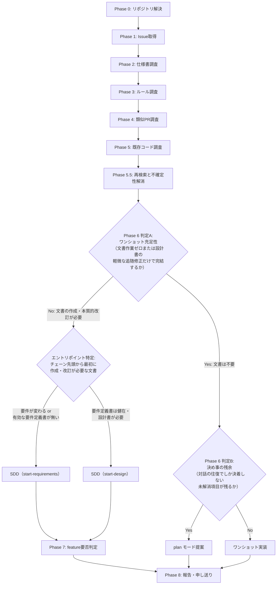
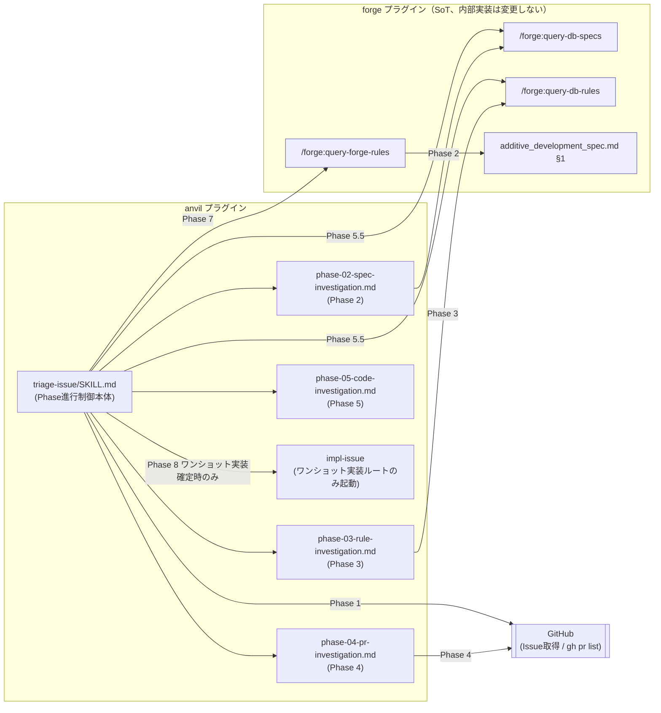

# DES-038 開発フロー分岐（トリアージ）設計: Phase 構造・SoT の分析と anvil 内での改善

## 1. 概要

`anvil:triage-issue` の Phase 構成（0〜8）を分析し、判定ロジックの一次情報（SoT）の所在、各 Phase の判定への依存関係を明らかにする。分析結果に基づき、REQ-005 NFR-01 ／ REQ-007 NFR-01（いずれも anvil → forge 一方向依存、forge 改修禁止を定める）の制約内で実施可能な設計（フローの責務定義に基づくルート判定・Phase 構成）を定める。

forge 側への変更が必要と判明した項目は、NFR-01 が定める正規手順（本 feature 内で forge を改修せず、別 Issue・別 feature として要件定義からやり直す）に従い、本設計書の対象外とし §7 に一覧化する。

## 2. 分析結果: 判定ロジックの SoT 分類

triage-issue が行う判定を、判定基準（ルール）の性質で分類する。

| 判定の性質                 | 例                                                                                                   | 固定ロジック化の可否               | 現在の SoT                                                           |
| -------------------------- | ---------------------------------------------------------------------------------------------------- | ---------------------------------- | -------------------------------------------------------------------- |
| 固定ルールの機械的適用     | additive_development_spec.md §1 の対象外条件（バグ修正／リファクタリング／軽微な追記／初期立ち上げ） | 可能（forge が既存文書として所有） | forge（`plugins/forge/docs/additive_development_spec.md`）           |
| Issue ごとに変わる文脈判断 | 判定 A（ワンショット充足性）・判定 B（決め事の残余）                                                 | 不可（判断内容が都度変わる）       | anvil（フローの責務定義と判定手続きが triage-issue/SKILL.md に存在） |

固定ルールの機械的適用（1 行目）は forge が既に SoT を持つため、判定手続きを anvil 側で重複定義せず forge の文書をそのまま参照する設計が成立する。判定 A・B（2 行目）はフローの責務定義（§4.3）への照合として anvil 側が持つ。

## 3. 分析結果: Phase 別の目的・依存関係

### 3.1 Phase 構成

| Phase | 目的                                                              | 性質                                                   | 参照文書                                                                                 |
| ----- | ----------------------------------------------------------------- | ------------------------------------------------------ | ---------------------------------------------------------------------------------------- |
| 0     | リポジトリ解決                                                    | 前処理                                                 | `.git_information.yaml`                                                                  |
| 1     | Issue 本文・コメント取得、構造化度確認                            | 入力取得                                               | Issue 本文                                                                               |
| 2     | 関連仕様書の検索                                                  | 現状確認（主目的: impl-issue への申し送り）            | `query-db-specs` が返すプロジェクト固有文書                                              |
| 3     | 関連ルールの検索                                                  | 現状確認（主目的: impl-issue への申し送り）            | `query-db-rules` が返すプロジェクト固有文書                                              |
| 4     | 類似 PR 調査                                                      | 現状確認（主目的: impl-issue の実装パターン学習）      | なし（`gh pr list` の実行結果）                                                          |
| 5     | 既存コード調査                                                    | 現状確認 + 判定（Phase 6）の直接根拠。二重の目的を持つ | なし（Grep/Glob の実行結果）                                                             |
| 5.5   | 不確定性の解消（本スキルの中核機能）                              | 吟味・その場での調整・決定                             | なし（Phase 1〜5 の結果と再検索・利用者確認）                                            |
| 6     | ルート判定（判定 A: ワンショット充足性 / 判定 B: 決め事の残余）   | 判定（文脈依存。フローの責務定義への照合）             | なし（Phase 2〜5.5 の調査・解消結果を二次利用）                                          |
| 7     | feature 要否判定                                                  | 判定（固定ルール）                                     | `additive_development_spec.md` §1（`query-forge-rules` 経由で Phase 7 時点で初めて読む） |
| 8     | 報告・Issue への申し送り・（ワンショット実装のみ）impl-issue 起動 | 出力                                                   | なし                                                                                     |

### 3.2 判定の直行可能性（Phase 1 からの依存の有無）

| Phase / 判定                                                | Phase 1 のみで判定可能か（直行可能性）                                                               | 直行できない場合の依存先           |
| ----------------------------------------------------------- | ---------------------------------------------------------------------------------------------------- | ---------------------------------- |
| Phase 6 判定 A（ワンショット充足性）                        | 不可（要件定義・設計書との整合の確認に Phase 2〜3、既存パターンの確認に Phase 4〜5 を要する）        | Phase 2〜5.5（調査・不確定性解消） |
| Phase 6 判定 B（決め事の残余）                              | 不可（Phase 5.5 の解消手段を尽くした後の残余で判定する）                                             | Phase 5.5（不確定性解消）          |
| Phase 7 相当（additive_development_spec §1 対象外チェック） | **可能**（Issue の性質分類のみで判定できる。バグ修正か等は仕様書・PR・コード調査を経由せず判定可能） | —                                  |

Phase 7 の判定内容（現状 Phase 2〜6 を経た後に初めて forge 文書を読む設計）は、実際には Phase 1 の直後に判定可能である。現状の Phase 順序は、直行可能な判定を Phase 2〜5 の重い調査の後まで待たせている。

### 3.3 分析結果: Phase 5 の判定利用には Phase 2〜3 の裏付けが必要

Phase 5（既存コード調査）の結果は、Phase 6 判定 A の直接の根拠として使われるが、**コードの現物（Grep/Glob 結果）だけでは判定を安全に行えない**。

- 「要件定義と整合したまま完結するか」（判定 A）は、コードだけでは答えられない。対応する要件定義書・設計書（Phase 2〜3 の検索結果）との突合が必要である
- 「既存パターンを踏襲すればよい」と結論づける前に、そのパターン自体が ADR・ルールと矛盾していないかを確認する必要がある。確認を怠ると、既に誤りと判明している設計を「既存パターン」として是認してしまうリスクがある

このため、Phase 5 で発見したコード領域をキーに、`query-db-specs` / `query-db-rules` を**再検索**する手順が必要になる。既存の Phase 2〜3（Issue の話題をキーにした検索）とは検索キーワードの起点が異なるため、既存 Phase 2〜3 の実行では代替できない。

## 4. 設計: フローの責務定義とルート判定（NFR-01 制約内）

分析結果 §3.2・§3.3 を踏まえ、Phase 構成とルート判定を以下のように定める。forge 側への変更は伴わない（既存の `query-forge-rules` 呼び出しパターンをそのまま使う）。

### 4.1 Phase 順序と分岐

Phase 1〜5.5 の調査・確認をすべて終えてから、Phase 6 のルート判定を行う。Issue 本文だけで早期判定する経路は持たない。調査で解消できる不確定性を残したまま分岐すると、`start-*` がトリアージの調査不足を埋める工程になり、入口の責務が崩れるためである。

### 4.1.1 ルート別ユースケース一覧

本設計は、ユーザーによる Issue 起点の起動、GitHub からの Issue 本文取得、調査中の利用者確認、`impl-issue`（ワンショット実装）への確認・委譲、SDD エントリポイント（`start-requirements` / `start-design`）と plan モードの提案という外部相互作用を伴う。全経路が Phase 1〜5.5 を通り、調査可能な不確定性を解消してから分岐する。

| 経路             | 起動条件                                                                   | 主な成果                                                                                  |
| ---------------- | -------------------------------------------------------------------------- | ----------------------------------------------------------------------------------------- |
| 要件定義         | 要件が変わる・要件の合意形成が必要・有効な要件定義書が存在しない           | `start-requirements` を提案し、解消済み事項・残る合意対象・調査結果を添付する             |
| 設計             | 要件定義書は健在で、設計書の作成・本質的な改訂が必要                       | `start-design` を提案し、入力となる要件定義書の実在パス・照合結果・解消済み事項を添付する |
| plan モード提案  | 文書は不要だが、解消手段を尽くしても対話の往復でしか決着しない決め事が残る | plan モードでの検討を地の文で提案する（自動遷移・確定フローの自動起動をしない）           |
| ワンショット実装 | 文書作業ゼロまたは設計書の軽微な追随修正だけで完結し、決め事の残余が無い   | `impl-issue` の起動確認を行い、Phase 2〜5.5 の調査結果と解消した不確定性の結論を引き継ぐ  |
| 調査中断         | 認証・権限不足、参照先消失等で Phase 5.5 の調査を完了できない              | SDD へ分岐せず、確認できなかった事項・原因・再開条件を報告して終了する                    |

### 4.2 Phase 5.5: コード領域キー再検索と不確定性解消

Phase 5 の直後に実行する。フロー選定の前に Issue を吟味し、その場で調整・決定できることを実施する、本スキルの中核機能である。

1. Phase 5 で発見した参照元・変更対象コードのファイルパス・モジュール名をキーワードとして、`/forge:query-db-specs` / `/forge:query-db-rules` を再度呼ぶ（Issue の話題をキーにした既存 Phase 2〜3 とは別の検索）
2. Phase 1〜5 で認識した不明点・判断分岐を台帳形式（項目 / 解消手段の分類 / 結論 / 根拠）で列挙する。Issue の解決提案の検証（より単純な解決で足りないか・スコープは利用者の意図と一致するか）も台帳の項目に含める
3. 実物で確認できるものは、仕様書・ルール・コード・テスト・git 履歴・類似 PR・外部公式文書・安全な read-only 実行で追加調査して結論を出す
4. 既存パターンで決まるものは、ADR・ルールとの矛盾がないことを確認して結論を出す
5. 利用者の意思決定が必要なものは、選択による差を示して確認し、結論を得る
6. 解消した不確定性の結論と根拠を Phase 8 の申し送りへ含める

台帳に未解消の項目が残る状態で Phase 6 へ進まない。利用者確認に分類した項目は回答を得るまで未解消として扱い、どの手段でも解消できなかった項目だけを「真の未確定」として（試行と決まらなかった理由の記録つきで）Phase 6 の判定根拠に使う。

「Issue に書かれていない」「未調査」「要確認」だけを未確定の根拠にしない。調査・利用者確認で解消できる事柄を `start-requirements` / `start-design` へ先送りしない。認証・権限不足や参照先消失で調査できない場合は、SDD へ送らず調査ブロッカーとして終了する。

結果を Phase 6 判定 A・判定 B の判定に用いる。既存パターンの追認前に ADR・ルールとの矛盾がないかを確認する。

### 4.3 フローの責務定義とルート判定

フロー選択は各フローの責務への照合としてのみ行える。判定するのは**変更の検証・追跡に必要な開発文書の種別**であり、変更量・修正規模・AI の判断量を判定の根拠にしない（大規模でも機械的に適用できる変更はワンショットで足りる）。

| フロー                    | 文書作業                                                 | 責務（何を検証可能にするか）                                                                                     |
| ------------------------- | -------------------------------------------------------- | ---------------------------------------------------------------------------------------------------------------- |
| ワンショット実装          | なし、または設計書の一部の追随修正（同じ変更の中で直す） | 要件定義と整合したまま完結する変更。量は無関係                                                                   |
| SDD: `start-requirements` | 要件定義書から連続フローを開始                           | What の痕跡。要件が変わる変更、または有効な要件定義書が無い状態で文書の裏付けが必要な変更                        |
| SDD: `start-design`       | 設計書から開始（入力にする要件定義書の実在が前提）       | How の痕跡。設計の本質を新たに起こさないと良し悪しを判定できない変更                                             |
| plan モード（提案）       | 不要（開発文書は作らない）                               | 文書は不要だが、作業の形・決め事が対話の往復でしか決着しない作業（利用者と対話しながら計画・調査・検証を進める） |

SDD は要件定義 → 設計 → 計画 → 実装の連続フローであり、エントリポイントは「チェーン先頭から最初に作成・改訂が必要な文書」で決まる。forge の `start-design` / `start-plan` は上流文書が見つからない場合に手動指定または「無しで進める」の確認を挟むだけで、上流の `start-*` へ自動で繰り上がらない。したがってエントリポイントの正しさは triage の判定が担保する（`start-design` の提案には入力となる要件定義書の実在パスを添える）。

#### 4.3.1 判定 A（ワンショット充足性）の判定規律

判定 A は「要件定義と整合したまま、文書作業ゼロまたは設計書の軽微な追随修正だけで完結するか」を Yes/No で判定する。

- **No（SDD 行き）には立証を課す**: どの文書に、なぜ本質的な作成・改訂が必要かを、Phase 5.5 の台帳の項目で具体的に挙げる。挙げられなければ Yes とする（挙証責任は SDD 側にある）。SDD 偏向（迷ったら SDD へ倒す判定癖）を、判定の向きで構造的に抑止するためである
- **数えない対象**: 編集対象ファイルの総数・修正量・変更対象コンポーネントの利用範囲。これらは文書の必要性と無関係である
- **誤った適用**: 「修正量が膨大なので SDD」「やり方が未定なので SDD」「設計書に触るので SDD」（設計書の軽微な追随修正はワンショットの範囲）

#### 4.3.2 判定 B（決め事の残余）の判定規律

判定 B は判定 A = Yes の場合のみ行い、「Phase 5.5 の解消手段を尽くしてなお、対話・調査・検証の往復でしか決着しない決め事が残るか」を Yes/No で判定する。

- **Yes（plan モード提案）にできるのは**、台帳で「真の未確定」と記録された項目（何を試してなぜ決まらなかったかの記録つき）を具体的に挙げられる場合に限る。「検討に有益だから」では Yes にしない（過剰トリガーはワンショット実装を空洞化させる）
- 調査ブロッカー（外的障害で調べられない）とは区別する。plan モード提案は調査を完了した上での判定であり、ブロッカーは判定に入らず再開条件を報告して終了する
- plan モード提案の終端は地の文での提示とし、自動遷移・確定フローの自動起動をしない

### 4.4 コンポーネント依存関係図

§4.1 の図は Phase の制御フロー（実行順序・分岐条件）のみを示す。以下は `triage-issue`・Phase 別 reference・query 系 skill・GitHub・`impl-issue` 間の**構造的な依存関係**（呼び出し方向）を示す。依存方向は §5.2「変更対象モジュール一覧」の依存列と一致させている。

図中の矢印はすべて **anvil 側モジュールから forge 側モジュールへの一方向**であり、forge 側モジュール（`forge` サブグラフ内）から anvil 側への逆方向の依存・呼び出しは存在しない（REQ-005 §5.6 NFR-01 ／ REQ-007 §5.6 NFR-01: anvil → forge 一方向依存、forge 改修禁止）。`forge` サブグラフ内の各コンポーネントは本設計で内部実装・呼び出しインターフェースを変更しない（§5.1・§5.2 参照）。`impl-issue` は anvil 内部のスキルであり、`triage-issue/SKILL.md` からワンショット実装ルート確定時のみ一方向に起動される（forge への依存はない）。

## 5. 使用する既存コンポーネント

### 5.1 参照専用コンポーネント（forge 側、変更しない）

| コンポーネント                    | ファイルパス                                      | 用途                                   |
| --------------------------------- | ------------------------------------------------- | -------------------------------------- |
| `additive_development_spec.md` §1 | `plugins/forge/docs/additive_development_spec.md` | Phase 7 の判定基準（既存、変更しない） |

### 5.2 変更対象モジュール一覧（責務・依存・変更内容）

REQ-005 §5.6 NFR-01 ／ REQ-007 §5.6 NFR-01 が定める「anvil → forge 一方向依存、forge 改修禁止」の制約により、下表の依存はすべて anvil 側モジュールから forge 側モジュールへの片方向のみとする（forge 側モジュールの内部実装・呼び出しインターフェースは変更しない）。

| モジュール                                                                    | 責務                                                                                      | 依存                                                                                                                                            | 変更内容                                                                                                    |
| ----------------------------------------------------------------------------- | ----------------------------------------------------------------------------------------- | ----------------------------------------------------------------------------------------------------------------------------------------------- | ----------------------------------------------------------------------------------------------------------- |
| `plugins/anvil/skills/triage-issue/SKILL.md`                                  | Phase 進行制御本体。Phase 0〜8 の実行順序・分岐条件・ルート確定ロジックを保持する         | 下表の Phase 別 reference（phase-02〜05）、`/forge:query-forge-rules`・`/forge:query-db-specs`・`/forge:query-db-rules`（一方向、呼び出しのみ） | §4.1 のフローに合わせ、フローの責務定義（§4.3）に基づき判定 A・B でルートを確定する                         |
| `plugins/anvil/skills/triage-issue/references/phase-02-spec-investigation.md` | Phase 2（仕様書検索）の実行手順書。`/forge:query-db-specs` の呼び出し方法・結果整形を定義 | `/forge:query-db-specs`（一方向、呼び出しのみ）                                                                                                 | 手順内容は変更なし。Phase 5.5 とルート判定の入力として使う                                                  |
| `plugins/anvil/skills/triage-issue/references/phase-03-rule-investigation.md` | Phase 3（ルール検索）の実行手順書。`/forge:query-db-rules` の呼び出し方法・結果整形を定義 | `/forge:query-db-rules`（一方向、呼び出しのみ）                                                                                                 | 手順内容は変更なし。Phase 5.5 とルート判定の入力として使う                                                  |
| `plugins/anvil/skills/triage-issue/references/phase-04-pr-investigation.md`   | Phase 4（類似 PR 調査）の実行手順書。`gh pr list` 実行結果の整形を定義                    | なし（GitHub CLI のみ、forge への依存なし）                                                                                                     | 手順内容は変更なし。Phase 3 の後、Phase 5 の前に実行する                                                    |
| `plugins/anvil/skills/triage-issue/references/phase-05-code-investigation.md` | Phase 5（既存コード調査）の実行手順書。Grep/Glob による既存パターン調査を定義             | なし（Grep/Glob のみ、forge への依存なし）                                                                                                      | 手順内容は変更なし。Phase 4 の直後という実行順序を維持。出力は Phase 5.5 の入力として使われる               |
| `/forge:query-forge-rules`（呼び出し先、forge 側 SoT）                        | forge 内蔵知識ベースからルール・原則文書のパスを返す                                      | `additive_development_spec.md`（forge 内部）                                                                                                    | Phase 7 の feature 要否判定で既存の呼び出しパターンを使う                                                   |
| `/forge:query-db-specs`（呼び出し先、forge 側 SoT）                           | `docs/specs/` 配下のプロジェクト仕様書を検索する                                          | `docs/specs/` 配下の文書（forge 内部）                                                                                                          | 呼び出しインターフェースは変更しない。既存の Phase 2 に加え、Phase 5.5 でも呼び出す（呼び出し回数のみ増加） |
| `/forge:query-db-rules`（呼び出し先、forge 側 SoT）                           | `docs/rules/` 配下のプロジェクトルールを検索する                                          | `docs/rules/` 配下の文書（forge 内部）                                                                                                          | 呼び出しインターフェースは変更しない。既存の Phase 3 に加え、Phase 5.5 でも呼び出す（呼び出し回数のみ増加） |

## 6. テスト設計

SKILL.md はテスト対象外（`docs/rules/implementation_guidelines.md` 準拠）。以下は手動での統合検証項目とする。

- Phase 6 の判定前に Phase 2〜5.5 が実行され、判定の入力として使われること
- Phase 5.5 が Phase 5 で発見したコード領域に対応する ADR・ルールを検索し、既存パターンの追認前に矛盾を確認すること
- Phase 5.5 が調査で確認できる事実をすべて追加調査し、「未調査」を未確定性として Phase 6 へ渡さないこと
- 利用者判断が必要な選択を Phase 5.5 で確認し、結論と根拠を Phase 8 の申し送りへ含めること
- 利用者確認に分類された未決点が、AskUserQuestion の実行と回答の取得を経ずに Phase 6 の判定根拠として使われないこと（不確定性台帳の未解消項目が残る状態で Phase 6 へ進まないこと）
- 判定 A が変更量・修正規模・判断量を根拠にせず、No 判定に台帳項目による立証を伴うこと
- 判定 B の Yes（plan モード提案）が「真の未確定」の記録を伴い、終端が地の文の提案であること（自動遷移しないこと）
- `start-design` の提案に入力となる要件定義書の実在パスが添えられること
- 調査ブロッカーを SDD ルートへ変換せず、必要な再開条件とともに終了すること
- SDD ルートでは Phase 7 が `additive_development_spec.md` §1 に基づいて feature 要否を判定すること

## 7. 本設計の対象外（別 Issue で扱う）

以下は forge 側の変更を要するため、REQ-005 NFR-01 の正規手順（本 feature 内で forge を改修せず、別 Issue・別 feature として要件定義からやり直す）に従い、本設計書のスコープに含めない。

| 項目                      | 内容                                                                                               | 理由                                                                                         |
| ------------------------- | -------------------------------------------------------------------------------------------------- | -------------------------------------------------------------------------------------------- |
| forge 側判定 skill の新設 | Phase 6〜7 相当の判定を一元的に適用する forge の単機能内部 skill（`doc-structure` 同型）を新設する | forge 側の新規文書・skill 作成は NFR-01 の禁止事項（本 feature 内での forge 改修）に該当する |
| NFR-01 自体の改訂検討     | anvil → forge 一方向依存の制約を見直すか否か                                                       | 制約自体の妥当性は別途検討課題とし、本 feature では現行の NFR-01 を前提として設計する        |

上記は別 GitHub Issue として起票し、独立した feature の要件定義から検討する。

## 8. 設計判断の根拠

### 8.1 forge 側への判定移譲を本設計に含めない理由

REQ-005（issue-driven-flow）§5.6 NFR-01・REQ-007（triage-flow）§5.6 NFR-01 は、2 つの独立した feature で共通して「forge 改修が必要と判明した場合は本 feature 内で対応せず、別 Issue・別 feature として要件定義からやり直す」という正規手順を明文化している。この手順に従い、forge 側の変更を要する項目は本設計書から切り出す。

### 8.2 Phase 5.5 を中核機能とする理由

Phase 5 単独では、発見したコード領域に対応する規範との照合と、調査中に生じた不確定性の解消を完了できない。Phase 5.5 はコード領域を起点に規範を再検索し、さらに判定前に不確定性を解消する。これにより、調べれば分かる事実や利用者へ確認できる選択を未確定のまま下流工程へ渡さない。既存の forge 呼び出しパターン（`query-db-specs` / `query-db-rules`）と `AskUserQuestion` を使うため、forge 側の変更を伴わない。

### 8.3 判定をワンショット充足性から始める理由

判定の一次軸は「変更の検証・追跡に必要な開発文書の種別」である。文書の要否（SDD 要否）を先に問う構造は、判定主体の AI が「設計書に触る」「修正量が多い」を文書必要性の代理指標にして SDD へ倒しやすく、「設計書の軽微な追随修正はワンショットの範囲」という判定に到達しにくい。ワンショット充足性を先に明示的な基準で検査し、SDD 行き（No）に台帳項目による立証を課すことで、この偏りを判定の向きで構造的に抑止する。

### 8.4 plan モード提案を判定 A = Yes 側に置く理由

調査を尽くした後の判定 A は常に Yes/No で決定可能であり、「判定不能」という出口は存在しない。plan モード提案が受けるのは「文書は不要と決定済みだが、作業の形・決め事が対話の往復でしか決着しない作業」である。SDD 側（判定 A = No）の合意形成は `start-requirements` の対話が担うため、SDD 側に plan モード分岐は置かない。
