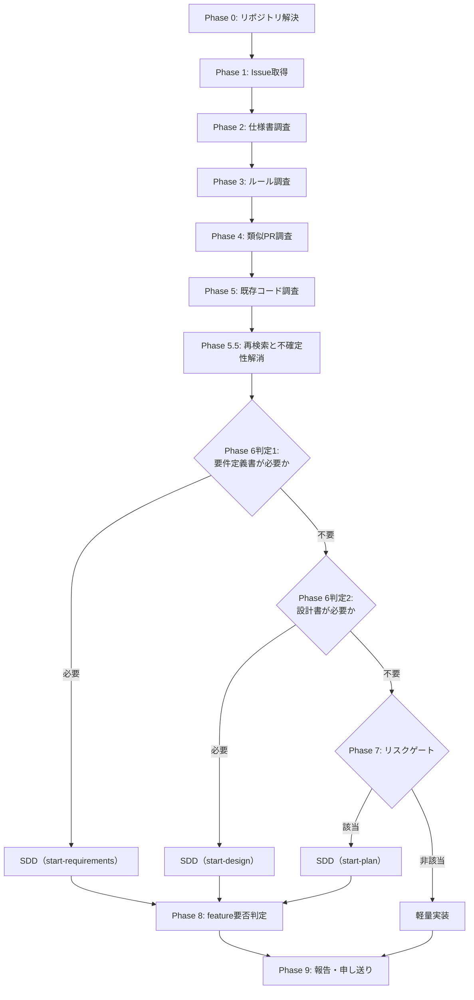

# DES-038 開発フロー分岐（トリアージ）設計: Phase 構造・SoT の分析と anvil 内での改善

## メタデータ

| 項目     | 値                        |
| -------- | ------------------------- |
| 設計ID   | DES-038                   |
| 関連要件 | REQ-005, REQ-007          |
| 親設計   | DES-025（親フロー、参考） |
| 作成日   | 2026-07-14                |
| 対象     | anvil プラグイン          |

## 1. 概要

`anvil:triage-issue` の既存 Phase 構成（0〜9）を分析し、判定ロジックの一次情報（SoT）の所在、各 Phase の判定への依存関係を明らかにする。分析結果に基づき、REQ-005 NFR-01 ／ REQ-007 NFR-01（いずれも anvil → forge 一方向依存、forge 改修禁止を定める）の制約内で実施可能な改善（Phase 構成の見直し）を設計する。

forge 側への変更が必要と判明した項目（判定基準の forge への切り出し等）は、NFR-01 が定める正規手順（本 feature 内で forge を改修せず、別 Issue・別 feature として要件定義からやり直す）に従い、本設計書の対象外とし §7 に一覧化する。

## 2. 分析結果: 判定ロジックの SoT 分類

triage-issue が行う判定を、判定基準（ルール）の性質で分類する。

| 判定の性質                                       | 例                                                                                                   | 固定ロジック化の可否                                             | 現在の SoT                                                 |
| ------------------------------------------------ | ---------------------------------------------------------------------------------------------------- | ---------------------------------------------------------------- | ---------------------------------------------------------- |
| 固定ルールの機械的適用                           | additive_development_spec.md §1 の対象外条件（バグ修正／リファクタリング／軽微な追記／初期立ち上げ） | 可能（forge が既存文書として所有）                               | forge（`plugins/forge/docs/additive_development_spec.md`） |
| Issue ごとに変わる文脈判断                       | 要件確定性・設計判断の残余                                                                           | 不可（判断内容が都度変わる）                                     | anvil（判断手続きそのものが anvil 内に存在）               |
| 独自ヒューリスティック（forge 側に対応文書なし） | リスクゲート 3 条件（後戻り困難な実害／サイレント破壊／AI の個別判断量）                             | 理論上は可能だが、**forge 側に受け皿となる既存文書が存在しない** | anvil（triage-issue/SKILL.md にインラインで定義）          |

固定ルールの機械的適用（1 行目）は forge が既に SoT を持つため、判定手続きを anvil 側で重複定義せず forge の文書をそのまま参照する設計が成立する。一方、リスクゲート基準（3 行目）は forge 側に対応する文書が存在しないため、forge へ委譲する場合は新規文書の作成を要する。これは NFR-01 が禁止する「本 feature 内での forge 改修」に該当するため、本設計書のスコープでは実施しない（§7 参照）。

## 3. 分析結果: Phase 別の目的・依存関係

### 3.1 現状の Phase 構成

| Phase | 目的                                                      | 性質                                                                        | 参照文書                                                                                 |
| ----- | --------------------------------------------------------- | --------------------------------------------------------------------------- | ---------------------------------------------------------------------------------------- |
| 0     | リポジトリ解決                                            | 前処理                                                                      | `.git_information.yaml`                                                                  |
| 1     | Issue 本文・コメント取得、構造化度確認                    | 入力取得                                                                    | Issue 本文                                                                               |
| 2     | 関連仕様書の検索                                          | 現状確認（主目的: impl-issue への申し送り）                                 | `query-db-specs` が返すプロジェクト固有文書                                              |
| 3     | 関連ルールの検索                                          | 現状確認（主目的: impl-issue への申し送り）                                 | `query-db-rules` が返すプロジェクト固有文書                                              |
| 4     | 類似 PR 調査                                              | 現状確認（主目的: impl-issue の実装パターン学習）                           | なし（`gh pr list` の実行結果）                                                          |
| 5     | 既存コード調査                                            | 現状確認 + 判定（Phase 6 判定2・Phase 7 条件3）の直接根拠。二重の目的を持つ | なし（Grep/Glob の実行結果）                                                             |
| 6     | 不確定性判定（要件確定性・設計判断の残余）                | 判定（文脈依存）                                                            | なし（Phase 2〜5.5 の調査・解消結果を二次利用）                                          |
| 7     | リスクゲート判定                                          | 判定（ヒューリスティック、forge 側に SoT なし）                             | なし                                                                                     |
| 8     | feature 要否判定                                          | 判定（固定ルール）                                                          | `additive_development_spec.md` §1（`query-forge-rules` 経由で Phase 8 時点で初めて読む） |
| 9     | 報告・Issue への申し送り・（軽量実装のみ）impl-issue 起動 | 出力                                                                        | なし                                                                                     |

### 3.2 判定の直行可能性（Phase 1 からの依存の有無）

| Phase / 判定                                                | Phase 1 のみで判定可能か（直行可能性）                                                               | 直行できない場合の依存先           |
| ----------------------------------------------------------- | ---------------------------------------------------------------------------------------------------- | ---------------------------------- |
| Phase 6 判定1（要件確定性）                                 | 可能（Issue 本文の記述具体性のみで判定できる）                                                       | —                                  |
| Phase 6 判定2（設計判断の残余）                             | 不可                                                                                                 | Phase 4〜5.5（調査・不確定性解消） |
| Phase 7 条件1（実害可能性）                                 | ほぼ可能（Issue 本文の推論で足りる）                                                                 | —                                  |
| Phase 7 条件2（サイレント破壊性）                           | ほぼ可能                                                                                             | —                                  |
| Phase 7 条件3（AI の個別判断量）                            | 不可                                                                                                 | Phase 5（修正要否・内容の実測）    |
| Phase 8 相当（additive_development_spec §1 対象外チェック） | **可能**（Issue の性質分類のみで判定できる。バグ修正か等は仕様書・PR・コード調査を経由せず判定可能） | —                                  |

Phase 8 の判定内容（現状 Phase 2〜7 を経た後に初めて forge 文書を読む設計）は、実際には Phase 1 の直後に判定可能である。現状の Phase 順序は、直行可能な判定を Phase 2〜5 の重い調査の後まで待たせている。

### 3.3 分析結果: Phase 5 の判定利用には Phase 2〜3 の裏付けが必要

Phase 5（既存コード調査）の結果は、Phase 6 判定2・Phase 7 条件3 の直接の根拠として使われるが、**コードの現物（Grep/Glob 結果）だけでは判定を安全に行えない**。

- 編集対象の件数だけでは、同じ判断を機械的に適用できる定型変更か、ファイルごとに修正要否・内容を検討する変更かを区別できない。条件3で測るのは後者の件数である
- 「既存パターンを踏襲すればよい」（Phase 6 判定2）と結論づける前に、そのパターン自体が ADR・ルールと矛盾していないかを確認する必要がある。確認を怠ると、既に誤りと判明している設計を「既存パターン」として是認してしまうリスクがある

このため、Phase 5 で発見したコード領域をキーに、`query-db-specs` / `query-db-rules` を**再検索**する手順が必要になる。既存の Phase 2〜3（Issue の話題をキーにした検索）とは検索キーワードの起点が異なるため、既存 Phase 2〜3 の実行では代替できない。

## 4. 設計: Phase 構成の見直し（NFR-01 制約内）

分析結果 §3.2・§3.3 を踏まえ、Phase 構成を以下のように見直す。forge 側への変更は伴わない（既存の `query-forge-rules` 呼び出しパターンをそのまま使う）。

### 4.1 新しい Phase 順序

Phase 1〜5.5 の調査・確認をすべて終えてから、Phase 6 以降のルート判定を行う。Issue 本文だけで早期判定する経路は持たない。調査で解消できる不確定性を残したまま分岐すると、`start-*` がトリアージの調査不足を埋める工程になり、入口の責務が崩れるためである。

### 4.1.1 ルート別ユースケース一覧

本設計は、ユーザーによる Issue 起点の起動、GitHub からの Issue 本文取得、調査中の利用者確認、`impl-issue`（軽量実装）への確認・委譲、SDD エントリポイント（`start-requirements` / `start-design` / `start-plan`）の提案という外部相互作用を伴う。全経路が Phase 1〜5.5 を通り、調査可能な不確定性を解消してから分岐する。

| 経路     | 起動条件                                                                           | 主な成果                                                                                 |
| -------- | ---------------------------------------------------------------------------------- | ---------------------------------------------------------------------------------------- |
| 要件定義 | 調査・利用者確認後も、複数の What の合意形成を要件定義書の作成過程で行う必要がある | `start-requirements` を提案し、解消済み事項・残る合意対象・調査結果を添付する            |
| 設計     | 要件は確定したが、比較・決定すべき実現方式が設計書の作成過程に残る                 | `start-design` を提案し、既存パターンとの照合結果・解消済み事項・残る設計対象を添付する  |
| 計画     | 要件・設計は確定しており、Phase 7 のリスクゲートに該当する                         | `start-plan` を提案し、該当条件と実測結果を添付する                                      |
| 軽量実装 | 要件・設計は確定しており、Phase 7 のリスクゲートに該当しない                       | `impl-issue` の起動確認を行い、Phase 2〜5.5 の調査結果と解消した不確定性の結論を引き継ぐ |
| 調査中断 | 認証・権限不足、参照先消失等で Phase 5.5 の調査を完了できない                      | SDD へ分岐せず、確認できなかった事項・原因・再開条件を報告して終了する                   |

### 4.2 新設 Phase の内容

#### Phase 5.5: コード領域キー再検索と不確定性解消（新設）

Phase 5 の直後に実行する。

1. Phase 5 で発見した参照元・変更対象コードのファイルパス・モジュール名をキーワードとして、`/forge:query-db-specs` / `/forge:query-db-rules` を再度呼ぶ（Issue の話題をキーにした既存 Phase 2〜3 とは別の検索）
2. Phase 1〜5 で認識した不明点・判断分岐を台帳形式（項目 / 解消手段の分類 / 結論 / 根拠）で列挙する。Issue の解決提案の検証（より単純な解決で足りないか・スコープは利用者の意図と一致するか）も台帳の項目に含める
3. 実物で確認できるものは、仕様書・ルール・コード・テスト・git 履歴・類似 PR・外部公式文書・安全な read-only 実行で追加調査して結論を出す
4. 既存パターンで決まるものは、ADR・ルールとの矛盾がないことを確認して結論を出す
5. 利用者の意思決定が必要なものは、選択による差を示して確認し、結論を得る
6. 解消した不確定性の結論と根拠を Phase 9 の申し送りへ含める

台帳に未解消の項目が残る状態で Phase 6 へ進まない。利用者確認に分類した項目は回答を得るまで未解消として扱い、どの手段でも解消できなかった項目だけを「真の未確定」として（試行と決まらなかった理由の記録つきで）Phase 6 の判定根拠に使う。

「Issue に書かれていない」「未調査」「要確認」だけを未確定の根拠にしない。調査・利用者確認で解消できる事柄を `start-requirements` / `start-design` へ先送りしない。認証・権限不足や参照先消失で調査できない場合は、SDD へ送らず調査ブロッカーとして終了する。

結果を Phase 6 判定2・Phase 7 条件3 の判定に用いる。既存パターンの追認前に ADR・ルールとの矛盾がないかを確認し、同一判断を機械適用できる対象とファイルごとの個別判断が必要な対象を分ける。

### 4.3 Phase 2〜5.5 と判定の依存関係

Phase 6 の要件・設計判断と Phase 7 のリスクゲートは、Phase 2〜5.5 の調査・確認結果を直接根拠とする。したがって Phase 2〜5.5 は必ず判定より前に実行する。検索結果のパス一覧だけでなく、本文の精読、実体確認、既存パターンとの照合、利用者判断までを完了させる。

調査結果は軽量実装・SDD のどちらにも引き継ぐ。下流工程は、解消済みの不確定性を再び未決事項として扱わない。

### 4.3.1 Phase 7 条件3（AI の個別判断量）の測定単位

条件3が測定するのは、Phase 5 の AI による調査・検討を経て、**ファイルごとに修正要否または修正内容を個別に判断する必要があるファイル数**である。編集対象ファイルの総数や、変更対象コンポーネントが将来利用される範囲ではない。

この区別が必要な理由: 同じ決定を機械的に適用できる一括置換・定型削除は、対象が多数でも AI の判断量を増やさない。ファイル数だけで条件3を満たすと、単純な横断変更を内容に関係なく `start-plan` へ送ることになり、不確定性を主軸とする Phase 6 の判断を件数で覆してしまう。一方、同じ語が現れていても文脈ごとに残す・移す・書き換える判断が必要なら、ファイル間で作業を分解してレビューする価値がある。

- **正しい適用**: Phase 5 で本文と関連規範を調査し、ファイルごとの修正要否・内容に独立した判断が必要な対象が **3 ファイル以上**ある
- **数えない対象**: 同じ判断を機械的に適用できる一括置換・定型削除。編集対象が 3 ファイル以上でも条件3には該当しない
- **誤った適用**: 編集対象の総数、参照元の数、変更対象コンポーネントの利用側の多さだけを根拠に該当とする

### 4.4 コンポーネント依存関係図

§4.1 の図は Phase の制御フロー（実行順序・分岐条件）のみを示す。以下は `triage-issue`・Phase 別 reference・query 系 skill・GitHub・`impl-issue` 間の**構造的な依存関係**（呼び出し方向）を示す。依存方向は §5.2「変更対象モジュール一覧」の依存列と一致させている。

図中の矢印はすべて **anvil 側モジュールから forge 側モジュールへの一方向**であり、forge 側モジュール（`forge` サブグラフ内）から anvil 側への逆方向の依存・呼び出しは存在しない（REQ-005 §5.6 NFR-01 ／ REQ-007 §5.5 NFR-01: anvil → forge 一方向依存、forge 改修禁止）。`forge` サブグラフ内の各コンポーネントは本設計で内部実装・呼び出しインターフェースを変更しない（§5.1・§5.2 参照）。`impl-issue` は anvil 内部のスキルであり、`triage-issue/SKILL.md` から軽量実装ルート確定時のみ一方向に起動される（forge への依存はない）。

## 5. 使用する既存コンポーネント

### 5.1 参照専用コンポーネント（forge 側、変更しない）

| コンポーネント                    | ファイルパス                                      | 用途                                   |
| --------------------------------- | ------------------------------------------------- | -------------------------------------- |
| `additive_development_spec.md` §1 | `plugins/forge/docs/additive_development_spec.md` | Phase 8 の判定基準（既存、変更しない） |

### 5.2 変更対象モジュール一覧（責務・依存・変更内容）

REQ-005 §5.6 NFR-01 ／ REQ-007 §5.5 NFR-01 が定める「anvil → forge 一方向依存、forge 改修禁止」の制約により、下表の依存はすべて anvil 側モジュールから forge 側モジュールへの片方向のみとする（forge 側モジュールの内部実装・呼び出しインターフェースは変更しない）。

| モジュール                                                                    | 責務                                                                                      | 依存                                                                                                                                            | 変更内容                                                                                                         |
| ----------------------------------------------------------------------------- | ----------------------------------------------------------------------------------------- | ----------------------------------------------------------------------------------------------------------------------------------------------- | ---------------------------------------------------------------------------------------------------------------- |
| `plugins/anvil/skills/triage-issue/SKILL.md`                                  | Phase 進行制御本体。Phase 0〜9 の実行順序・分岐条件・ルート確定ロジックを保持する         | 下表の Phase 別 reference（phase-02〜05）、`/forge:query-forge-rules`・`/forge:query-db-specs`・`/forge:query-db-rules`（一方向、呼び出しのみ） | §4.1 の新フローに合わせ、Phase 5.5 で調査可能な不確定性を解消してから判定する                                    |
| `plugins/anvil/skills/triage-issue/references/phase-02-spec-investigation.md` | Phase 2（仕様書検索）の実行手順書。`/forge:query-db-specs` の呼び出し方法・結果整形を定義 | `/forge:query-db-specs`（一方向、呼び出しのみ）                                                                                                 | 手順内容は変更なし。Phase 5.5 とルート判定の入力として使う                                                       |
| `plugins/anvil/skills/triage-issue/references/phase-03-rule-investigation.md` | Phase 3（ルール検索）の実行手順書。`/forge:query-db-rules` の呼び出し方法・結果整形を定義 | `/forge:query-db-rules`（一方向、呼び出しのみ）                                                                                                 | 手順内容は変更なし。Phase 5.5 とルート判定の入力として使う                                                       |
| `plugins/anvil/skills/triage-issue/references/phase-04-pr-investigation.md`   | Phase 4（類似 PR 調査）の実行手順書。`gh pr list` 実行結果の整形を定義                    | なし（GitHub CLI のみ、forge への依存なし）                                                                                                     | 手順内容は変更なし。Phase 3 の後、Phase 5 の前に実行する                                                         |
| `plugins/anvil/skills/triage-issue/references/phase-05-code-investigation.md` | Phase 5（既存コード調査）の実行手順書。Grep/Glob による既存パターン調査を定義             | なし（Grep/Glob のみ、forge への依存なし）                                                                                                      | 手順内容は変更なし。Phase 4 の直後という実行順序を維持。出力は新設 Phase 5.5 の入力として使われる                |
| `/forge:query-forge-rules`（呼び出し先、forge 側 SoT）                        | forge 内蔵知識ベースからルール・原則文書のパスを返す                                      | `additive_development_spec.md`（forge 内部）                                                                                                    | Phase 8 の feature 要否判定で既存の呼び出しパターンを使う                                                        |
| `/forge:query-db-specs`（呼び出し先、forge 側 SoT）                           | `docs/specs/` 配下のプロジェクト仕様書を検索する                                          | `docs/specs/` 配下の文書（forge 内部）                                                                                                          | 呼び出しインターフェースは変更しない。既存の Phase 2 に加え、新設 Phase 5.5 でも呼び出す（呼び出し回数のみ増加） |
| `/forge:query-db-rules`（呼び出し先、forge 側 SoT）                           | `docs/rules/` 配下のプロジェクトルールを検索する                                          | `docs/rules/` 配下の文書（forge 内部）                                                                                                          | 呼び出しインターフェースは変更しない。既存の Phase 3 に加え、新設 Phase 5.5 でも呼び出す（呼び出し回数のみ増加） |

## 6. テスト設計

SKILL.md はテスト対象外（`docs/rules/implementation_guidelines.md` 準拠）。以下は手動での統合検証項目とする。

- Phase 6・Phase 7 の判定前に Phase 2〜5.5 が実行され、判定の入力として使われること
- Phase 5.5 が Phase 5 で発見したコード領域に対応する ADR・ルールを検索し、同一判断を機械適用できる対象を条件3の件数から除外すること
- Phase 5.5 が調査で確認できる事実をすべて追加調査し、「未調査」を未確定性として Phase 6 へ渡さないこと
- 利用者判断が必要な選択を Phase 5.5 で確認し、結論と根拠を Phase 9 の申し送りへ含めること
- 利用者確認に分類された未決点が、AskUserQuestion の実行と回答の取得を経ずに Phase 6 の「未確定」根拠として使われないこと（不確定性台帳の未解消項目が残る状態で Phase 6 へ進まないこと）
- 調査ブロッカーを SDD ルートへ変換せず、必要な再開条件とともに終了すること
- SDD ルートでは Phase 8 が `additive_development_spec.md` §1 に基づいて feature 要否を判定すること

## 7. 本設計の対象外（別 Issue で扱う）

以下は forge 側の変更を要するため、REQ-005 NFR-01 の正規手順（本 feature 内で forge を改修せず、別 Issue・別 feature として要件定義からやり直す）に従い、本設計書のスコープに含めない。

| 項目                                | 内容                                                                                                                                                   | 理由                                                                                                                                                                                               |
| ----------------------------------- | ------------------------------------------------------------------------------------------------------------------------------------------------------ | -------------------------------------------------------------------------------------------------------------------------------------------------------------------------------------------------- |
| リスクゲート基準の forge への文書化 | Phase 7 の 3 条件（後戻り困難な実害／サイレント破壊／AI の個別判断量）を forge 側の新規文書（`additive_development_spec.md` 同種の SoT）として定義する | forge が「いつ `start-plan` の構造化タスク分解を要するか」という価値判断を持つべきという設計上の指摘があるが、forge 側の新規文書作成は NFR-01 の禁止事項（本 feature 内での forge 改修）に該当する |
| forge 側判定 skill の新設           | Phase 6〜8 相当の判定を一元的に適用する forge の単機能内部 skill（`doc-structure` 同型）を新設する                                                     | 同上                                                                                                                                                                                               |
| NFR-01 自体の改訂検討               | anvil → forge 一方向依存の制約を見直すか否か                                                                                                           | 制約自体の妥当性は別途検討課題とし、本 feature では現行の NFR-01 を前提として設計する                                                                                                              |

上記は別 GitHub Issue として起票し、独立した feature の要件定義から検討する。

## 8. 設計判断の根拠

### 8.1 forge 側への判定移譲を本設計に含めない理由

REQ-005（issue-driven-flow）§5.6 NFR-01・REQ-007（triage-flow）§5.5 NFR-01 は、2 つの独立した feature で共通して「forge 改修が必要と判明した場合は本 feature 内で対応せず、別 Issue・別 feature として要件定義からやり直す」という正規手順を明文化している。この手順に従い、forge 側の変更を要する項目は本設計書から切り出す。

### 8.2 Phase 5.5 を新設する理由

Phase 5 単独では、発見したコード領域に対応する規範との照合と、調査中に生じた不確定性の解消を完了できない。Phase 5.5 はコード領域を起点に規範を再検索し、さらに判定前に不確定性を解消する。これにより、調べれば分かる事実や利用者へ確認できる選択を未確定のまま下流工程へ渡さない。既存の forge 呼び出しパターン（`query-db-specs` / `query-db-rules`）と `AskUserQuestion` を使うため、forge 側の変更を伴わない。
