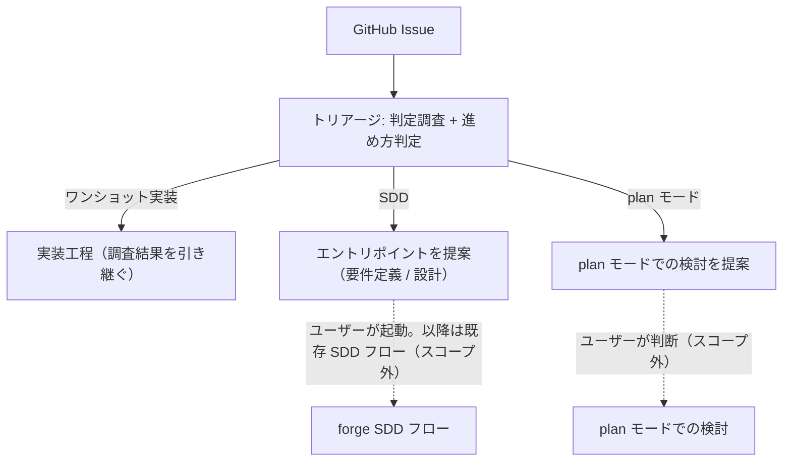

# REQ-007 開発フロー分岐（トリアージ）要件定義

## 1. 背景

GitHub Issue を入口とする開発には、**変更の検証・追跡に必要な開発文書の種別**に応じた 3 つの進め方がある。要件定義と整合したまま完結する変更は文書を起こさず直接実装した方が速く（変更量は無関係）、開発文書（要件定義書・設計書）の作成・本質的な改訂を要する変更は SDD（要件定義 → 設計 → 計画 → 実装）を通さないと品質が守れない。文書は不要だが作業の形・決め事が対話の往復でしか決着しない作業は、確定フローに乗せず plan モードで検討するのが適する。

しかし現状、この振り分けを行う正式な分岐点が存在しない。ユーザーが Issue ごとに「どれで進めるか」を自分で判断し、実装スキルや SDD の各スキルを個別に起動している。その結果:

- 軽微な修正にフル SDD を回す・文書の裏付けが必要な変更を直接実装するという取り違えが起こりうる
- 振り分け判断のために行った調査（仕様書・ルール・類似実装・既存コード）が、後続の工程で再実行され無駄になる
- 開発の入口が複数あり、フロー全体を一貫して制御できない

本 feature は、Issue を入口とするすべての開発を**単一の分岐点（トリアージ）**で制御し、判定結果に応じてワンショット実装ルート・SDD ルート・plan モードルートへ振り分ける仕組みを確立する。

> 参考: 既存の issue-driven-flow feature（anvil:REQ-005_issue_driven_flow）は SDD ルート側のオーケストレーションを扱い、軽量ルートをスコープ外としていた。本 feature は両ルートを統合する分岐点を新規に定義するものであり、既存文書は参考に留め前提としない。

---

## 2. 目的

1. Issue を入口とする開発の進め方の判断を、単一の分岐点に一元化する
2. 分岐点での判定に用いた調査結果を下流工程が再利用し、重複調査を排除する
3. どのルートに進んだかとその根拠を、事後に検証できる形で残す
4. 調査・確認で解消できる不確定性を分岐前に解消し、未調査を理由に下流工程へ判断を先送りしない

---

## 3. スコープ

### 3.1 含める

- Issue の内容に基づく進め方判定（ワンショット実装 / SDD / plan モード提案）
- ワンショット実装ルートへの振り分け: 実装工程（既存の impl-issue 相当）への引き継ぎ。入口の一本化と調査結果の引き継ぎを含む
- SDD ルートへの振り分け: SDD のどのエントリポイント（要件定義 / 設計）から入るべきかの判定と提案
- plan モードルートへの振り分け: plan モードでの検討の提案（提案のみ。遷移は利用者判断）
- 判定根拠の記録

### 3.2 含めない

| 非対象                                                            | 理由                                                                                                                                                               |
| ----------------------------------------------------------------- | ------------------------------------------------------------------------------------------------------------------------------------------------------------------ |
| SDD フロー自体（forge start-* 系）の変更・自動起動                | SDD ルートはエントリポイント判定・提案までが本 feature の責務                                                                                                      |
| forge プラグインの改修                                            | anvil → forge の一方向依存を維持する                                                                                                                               |
| 実装工程の下流工程（実装計画策定・実装・レビュー・PR 作成）の変更 | 本 feature が変えるのは実装工程の「入口（開始経路）」と「入力の取得方法（自ら調査する → 引き継がれた調査結果を受け取る）」まで。調査より後の工程の進み方は変えない |
| Issue 起票（create-issue 相当）の変更                             | 起票は分岐点の上流。案内文言の追随は実装時の整合調整として扱う                                                                                                     |
| UI Issue 判定の分岐点への統合                                     | 別途検討。UI Issue の判定を分岐点に載せるかは本 feature では決めない                                                                                               |

---

## 4. 用語定義

| 用語                   | 定義                                                                                                                                                                                                                                  |
| ---------------------- | ------------------------------------------------------------------------------------------------------------------------------------------------------------------------------------------------------------------------------------- |
| トリアージ             | Issue の内容を調査し、ワンショット実装ルート・SDD ルート・plan モードルートのいずれかを判定して振り分ける操作。開発フロー全体の唯一の分岐点。判定の軸は変更の検証・追跡に必要な開発文書の種別であり、変更量・修正規模は判定に使わない |
| ワンショット実装ルート | 開発文書を起こさず（設計書の一部の追随修正は含んでよい）、実装工程（impl-issue 相当）へ直接進む経路                                                                                                                                   |
| SDD ルート             | forge の SDD フロー（要件定義 → 設計 → 計画 → 実装）へ進む経路。SDD は連続フローであり、途中から入るには上流文書の実在が前提になる                                                                                                    |
| plan モードルート      | 開発文書は不要だが、作業の形・決め事が対話の往復でしか決着しない Issue について、plan モードでの検討を提案する経路。提案のみで、遷移は利用者判断                                                                                      |
| エントリポイント       | SDD ルートに入る起点工程。チェーン先頭から最初に作成・改訂が必要な文書で決まる。要件定義（start-requirements）/ 設計（start-design）の 2 つ                                                                                           |
| 判定調査               | トリアージが判定のために行う調査。関連仕様書・ルール文書・類似実装（過去の PR）・既存コードを対象とする                                                                                                                               |
| 調査結果               | 判定調査で特定された参照先の集合（仕様書・ルール文書のパス、類似 PR の識別子、既存コードのパス等）                                                                                                                                    |

---

## 5. 要件一覧

### 5.1 FNC-01: 進め方判定

**目的**: Issue の内容から、ワンショット実装ルート・SDD ルート・plan モードルートのどれで進めるべきかを判定する。

**ユーザー視点の振る舞い**:

- ユーザーが Issue を指定すると、判定調査（関連仕様書・ルール文書・類似実装・既存コード）が行われ、3 ルートのいずれかの判定が根拠とともに提示される
- 判定根拠は、後から「この判定は妥当だったか」を検証できる粒度で明示される
- 判定調査で判明した不明点は、追加の実物確認・既存パターンとの照合・利用者への質問によって、分岐前に解消される

**不変条件**:

- 判定は根拠なしに提示されない
- 判定の軸は変更の検証・追跡に必要な開発文書の種別であり、変更量・修正規模・判断量を判定の根拠にしない
- SDD ルートの判定（ワンショットで完結しない、の判定）には「どの文書に、なぜ本質的な作成・改訂が必要か」の立証を伴う（立証できなければワンショット側とする）
- 調査で確認できる事実を「Issue に書かれていない」「未調査」であることだけを理由に未確定として扱わない
- 利用者が決める選択は、選択肢による差を示して確認してから判定する
- 認証・権限不足や参照先消失で調査できない場合は、SDD へ送らず調査ブロッカーとして報告する
- 判定基準そのものは運用しながら調整する前提とし、本要件では固定しない（方式は TBD-101 で決定済み。粒度・条件の調整は運用で継続）

### 5.2 FNC-02: SDD ルートへの振り分け

**目的**: SDD が必要と判定された Issue を、適切なエントリポイントへ導く。

**ユーザー視点の振る舞い**:

- 調査・利用者確認を尽くした後の状態に応じて、エントリポイントが「チェーン先頭から最初に作成・改訂が必要な文書」で判定され、根拠とともに**提案**される:
  - 要件が変わる・要件の合意形成が必要・有効な要件定義書が存在しない → 要件定義から
  - 要件定義書は健在で、設計書の作成・本質的な改訂が必要 → 設計から（入力となる要件定義書の実在パスを添える）
- SDD フローの起動はユーザーの判断に委ねる（自動起動しない）。振り分け後は既存の SDD フローにそのまま従う（計画書以降は SDD の連続フローの中で続く）

**不変条件**:

- SDD フロー自体には手を入れない（振り分け先として使うのみ）
- 途中エントリ（設計から）の提案は、入力となる上流文書（要件定義書）の実在を確認してから行う

### 5.3 FNC-03: ワンショット実装ルートへの振り分けと入口の一本化

**目的**: ワンショット実装と判定された Issue を実装工程へ引き継ぎ、開発フローの分岐制御をトリアージに一元化する。

**ユーザー視点の振る舞い**:

- ワンショット実装と判定された場合、実装工程（impl-issue 相当）へ進む
- 実装工程は**トリアージを経由してのみ**開始される。ユーザーが実装工程を直接起動する経路は廃止する（破壊的変更として許容する）

**不変条件**:

- 実装工程の開始経路はトリアージ経由の一本のみ
- トリアージを経ずに実装工程が起動されることはない

### 5.4 FNC-04: 調査結果の引き継ぎ

**目的**: 判定調査の結果を実装工程が再利用し、同一 Issue に対する重複調査を排除する。

**ユーザー視点の振る舞い**:

- ワンショット実装ルートに進んだ場合、トリアージの判定調査で特定された調査結果が実装工程に引き継がれる
- 実装工程は引き継がれた調査結果を使い、同じ調査（仕様書検索・ルール検索・類似実装探索・既存コード探索）を再実行しない
- トリアージ中に解消した不確定性の結論と根拠が実装工程に引き継がれる

**不変条件**:

- 引き継ぐのは調査結果（参照先の識別子・パス）であり、Issue 本文などの生データは含めない（実装工程が自ら取得できるものは引き継がない）
- 「調査したが該当なし」と「未調査」が区別できること
- 引き継ぎは調査の**特定**を再利用するものであり、参照先の**内容の精読**（引き継がれたパス・PR の中身を実装のために読み込むこと）は実装工程の責務として残る
- 解消済みの不確定性を、下流工程が未決事項として再検討しないこと

### 5.5 FNC-05: plan モードルートへの振り分け

**目的**: 開発文書は不要だが、作業の形・決め事が対話の往復でしか決着しない Issue を、確定フローに乗せず plan モードでの検討へ導く。

**ユーザー視点の振る舞い**:

- 判定調査と不確定性の解消を尽くしてなお、対話・調査・検証の往復でしか決着しない決め事が残る場合に限り、plan モードでの検討が根拠（何を試してなぜ決まらなかったか）とともに**地の文で提案**される
- 提案に対して利用者が問い返して議論できる（「これでも行けますか」等）。plan モードへの遷移・作業の開始は利用者の判断に委ねる

**不変条件**:

- plan モードルートは提案までとし、自動遷移・確定フローの自動起動を行わない
- 「検討に有益」を理由に提案しない（必要な場合に限る。過剰な提案はワンショット実装ルートを空洞化させる）
- 調査ブロッカー（外的障害で調査を完了できない場合）を plan モードルートへ変換しない

### 5.6 NFR-01: 依存方向と既存フローの不変

- 本 feature の全機能は anvil プラグイン配下に配置する
- forge の既存スキルを呼び出してよいが、forge の実装には手を入れない（anvil → forge の一方向依存）
- 仕様書・ルール文書の識別と検索は forge の既存機能（query-db-specs / query-db-rules 相当）に依存する。この依存は本 feature の前提であり、代替手段を持たない

### 5.7 NFR-02: 判定の監査可能性

- 判定結果（ルート・エントリポイント）とその根拠は、Issue 上に記録として残し、事後に参照できるようにする

---

## 6. 主要シナリオ

**S1. ワンショット実装ルート**

1. ユーザーが Issue を指定してトリアージを開始する
2. 判定調査と追加確認によって不確定性が解消される
3. 「ワンショット実装」と判定される（根拠つき）
4. 判定結果・根拠・解消した不確定性が Issue に記録される
5. 実装工程へ進み、引き継がれた調査結果をもとに実装が行われる（重複調査なし）

**S2. SDD ルート**

1. ユーザーが Issue を指定してトリアージを開始する
2. 判定調査と追加確認によって、調査で解消できる不確定性が解消される
3. 開発文書の作成・本質的な改訂の必要性が立証され、「SDD」と判定される（根拠つき）
4. エントリポイント（要件定義 / 設計のいずれか）が根拠とともに提案される（設計からの場合は入力となる要件定義書の実在パスつき）
5. 判定結果・根拠・解消した不確定性が Issue に記録される
6. ユーザーが提案されたエントリポイントから既存の SDD フローを開始する（以降は既存フローに従う）

**S3. plan モードルート**

1. ユーザーが Issue を指定してトリアージを開始する
2. 判定調査と追加確認によって、調査で解消できる不確定性が解消される
3. 開発文書は不要と判定されるが、対話の往復でしか決着しない決め事が残る（根拠つき）
4. plan モードでの検討が地の文で提案される（自動遷移しない）
5. 判定結果・根拠・残る決め事が Issue に記録される
6. ユーザーが plan モードでの検討を開始するか、提案に問い返して議論する



---

## 7. 横断不変条件

| ID   | 内容                                                                               |
| ---- | ---------------------------------------------------------------------------------- |
| I-01 | 実装工程（ワンショット実装ルート）の入口はトリアージ経由の一本のみ（FNC-03）       |
| I-02 | 同一 Issue に対する判定調査は一度だけ行われ、下流で再実行されない（FNC-04）        |
| I-03 | SDD ルートはエントリポイントの判定・提案まで。SDD フローは自動起動しない（FNC-02） |
| I-04 | forge の既存スキルは改変されない（NFR-01）                                         |
| I-05 | 調査・利用者確認で解消できる不確定性を残したままルート判定しない（FNC-01）         |
| I-06 | plan モードルートは提案まで。自動遷移・確定フローの自動起動を行わない（FNC-05）    |
| I-07 | 変更量・修正規模・判断量をルート判定の根拠にしない（FNC-01）                       |

---

## 8. フロー資産の再配置（実施前の合意用リスト）

> 「各工程の手順書はその工程を責務とするスキルが所有する」のは当たり前の原則であり要件ではない。現状はそうなっていない（調査手順書がすべて実装工程配下にあり、トリアージが借用参照している）ため、本節に是正内容を列挙して実施前の合意に使う。実施後の SoT は各 SKILL.md / references 自身である。

### 8.1 現状の手順書と中身の切り分け

現状 `impl-issue/references/` にある調査系手順書 3 本（+ ルール調査はファイルすら無く両 SKILL.md にインライン重複）は、いずれも「特定のやり方（トリアージの責務）」と「特定結果の使い方（実装工程の責務）」が混在している:

| 現状ファイル                     | 特定のやり方（→ トリアージへ）                 | 特定結果の使い方（→ 実装工程に残す）                                           |
| -------------------------------- | ---------------------------------------------- | ------------------------------------------------------------------------------ |
| `phase-02-spec-investigation.md` | query-db-specs 検索手順・外部リポ/symlink 対応 | UI Issue の追加記録（画面設計書パス・Figma URL 等。Phase 6 へ渡す）            |
| （ルール調査: ファイルなし）     | query-db-rules 検索手順・全件 Read・CLAUDE.md  | —（特定後の精読は Phase 3 本文で足りる）                                       |
| `phase-04-pr-investigation.md`   | gh pr list による探索手順（3 件以上）          | 調査のポイント（学習観点）・「同じスコープ・同じ実装方法を採用する」原則       |
| `phase-05-code-investigation.md` | Grep/Glob による探索手順                       | 新規作成回避の原則・検証チェックリスト（実装計画時に適用）・共通部品の採用判断 |

### 8.2 再配置後の姿

```
plugins/anvil/skills/
├── triage-issue/
│   ├── SKILL.md                 # Phase 2〜5 は自配下の references を参照
│   └── references/              # ★新設: 調査（特定）手順の所有者
│       ├── phase-02-spec-investigation.md   # 検索手順・外部リポ対応のみ
│       ├── phase-03-rule-investigation.md   # ルール検索手順（インライン重複を統合）
│       ├── phase-04-pr-investigation.md     # PR 探索手順のみ
│       └── phase-05-code-investigation.md   # 既存コード探索手順のみ
└── impl-issue/
    ├── SKILL.md                 # Phase 2〜5 は「引き継いだ結果の精読・適用」のみ
    └── references/              # 実装側の適用原則の所有者
        ├── phase-02-ui-recording.md         # UI Issue の追加記録（旧 phase-02 から分離）
        ├── phase-04-pr-learning.md          # PR 学習観点・同スコープ採用原則（旧 phase-04 から分離）
        ├── phase-05-reuse-principles.md     # 新規作成回避の原則・検証チェックリスト（旧 phase-05 から分離）
        ├── phase-08-impl-design.md          # （既存のまま）
        └── ...                              # phase-09 / 11 / 12（既存のまま、実装側の資産）
```

- 参照方向: triage-issue は自配下のみを参照する。impl-issue も自配下のみを参照する（相互借用を解消。責務境界 = ファイル境界 = 参照境界）
- 短い内容（UI 追加記録・PR 学習観点）をファイルに分けるか SKILL.md 本文へインライン化するかは実施時の判断に委ねる（ファイル数を無闇に増やさない）

### 8.3 併せて必要な整合調整

- `create-issue/SKILL.md`: 起票後の「すぐ実装に進む」案内を `/anvil:impl-issue` 直接起動から `/anvil:triage-issue` 経由に変更
- `README.md` / `README_en.md`: impl-issue を AI 専用（斜体・「※ triage-issue が呼び出し」）表記に変更
- `DES-025_issue_driven_flow_design.md`: impl-issue を user-invocable と記す役割分担表の行を実態に合わせて更新（乖離注記を1文追加。mermaid 図は触らない）

---

## 9. 未確定事項

| ID      | 内容                                                                                                                                                                                                                                                                                                     | 状態                       |
| ------- | -------------------------------------------------------------------------------------------------------------------------------------------------------------------------------------------------------------------------------------------------------------------------------------------------------- | -------------------------- |
| TBD-101 | 進め方判定の判定基準 → **決定済み（2026-08-29 改訂）**: 変更の検証・追跡に必要な開発文書の種別を一次軸とし、ワンショット充足性を先に判定する（SDD 行きには文書必要性の立証を課す）。変更量・修正規模・判断量は判定に使わない。リスクを理由とする昇格ゲートは置かない。判定粒度の調整は運用課題として継続 | 決定済み（運用調整継続）   |
| TBD-102 | 引き継ぐ調査結果の範囲 → **決定済み（2026-07-10）**: 判定調査で特定した 4 カテゴリ（仕様書・ルール・類似 PR・既存コード）すべてを引き継ぐ。0 件も「該当なし」で明示                                                                                                                                      | 決定済み                   |
| TBD-103 | ワンショット実装ルートへ進む際のユーザー確認 → **決定済み（2026-07-10）**: 起動前に確認を 1 回だけ挟む（判定基準がヒューリスティックであることを踏まえた暫定。判定信頼度が上がれば自動化を再検討）                                                                                                       | 決定済み（再検討余地あり） |
| TBD-104 | 判定結果の Issue への記録形式 → **決定済み（2026-07-10）**: Issue コメント（監査記録 + セッション跨ぎ復元の永続ストアを兼ねる）                                                                                                                                                                          | 決定済み                   |
