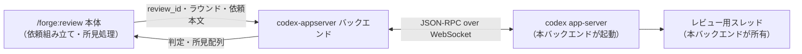
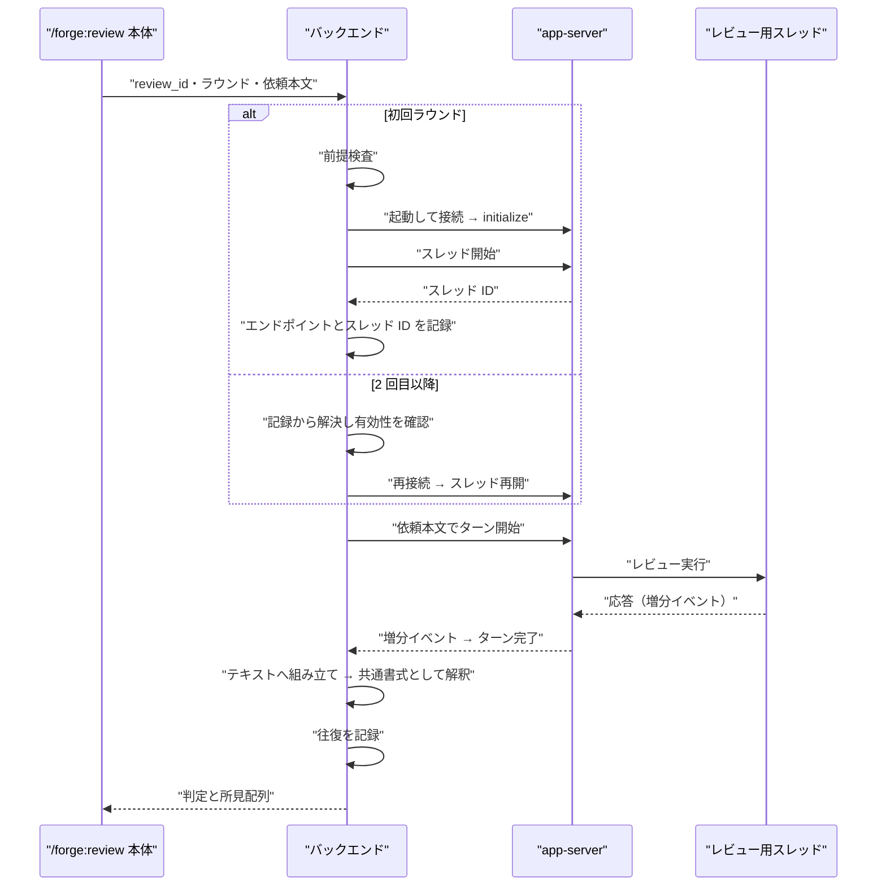

# DES-064 codex-appserver レビューバックエンド設計書

## メタデータ

| 項目     | 値                                                                                                                                               |
| -------- | ------------------------------------------------------------------------------------------------------------------------------------------------ |
| 設計ID   | DES-064                                                                                                                                          |
| 関連要件 | REQ-015（FNC-001〜FNC-006・BL-001・NFR-001〜002）                                                                                                |
| 関連設計 | ADR-063（本設計を採る決定）、forge:ADR-060 / forge:REQ-013 FNC-1318（バックエンド軸）                                                            |
| 作成日   | 2026-08-02                                                                                                                                       |
| 状態     | **実装ブロック中**（forge:REQ-013 FNC-1318 の改訂待ち。REQ-015 TBD-005〜007）。あわせて headless レビュー往復の実機確認も未了（REQ-015 TBD-001） |

> **本文書のスコープ**
>
> - **定めること**: app-server への接続方式、スレッドの所有とラウンド間の継続、応答の共通書式への変換、往復の記録、失敗時の縮退
> - **定めないこと**: レビュー依頼の組み立て・所見の評価と修正・完了判定（`/forge:review` 本体の責務）
> - **他バックエンドとの関係**: msg-review / msg-sys の設計・実装を一切変更しない。起床・シム・Stop フック・メッセージ DB を使わない

---

## 1. 概要

Codex CLI の app-server 上に**本バックエンドが所有するスレッド**を立て、そこでレビューを実行する。人間の TUI セッションには接続しないため、起床・起動シム・端末多重化ツールを必要としない。`/forge:review` 本体からはラウンド単位で呼ばれ、判定と所見配列を返す。

---

## 2. アーキテクチャ概要

msg-review との対比を明示しておく。msg-review は「人間が常駐させた TUI」を相手にするため、相手のターンを起こす手段が要る。本バックエンドは相手を自分で持つため、**起こす対象が存在しない**。

---

## 3. モジュール設計

### 3.1 モジュール一覧

| モジュール             | 責務                                                             |
| ---------------------- | ---------------------------------------------------------------- |
| バックエンド入口       | 本体から呼ばれ、1 ラウンドを実行して判定と所見配列を返す         |
| WebSocket クライアント | RFC 6455 のクライアント側最小実装（後述 3.3 の範囲）             |
| サーバライフサイクル   | app-server の起動・再接続・停止と、エンドポイントの記録          |
| スレッド管理           | `review_id` に紐づくスレッドの開始・再開・解放                   |
| 応答収集と変換         | イベント列をテキストへ組み立て、共通書式として解釈して所見配列へ |
| 往復記録               | ラウンドごとの依頼本文と応答をレビュー単位で保存                 |
| 前提検査               | Codex の可用性とプロトコル整合を送信前に検査                     |

### 3.2 トランスポート

**既定は Unix ドメインソケット**（`unix://`）とする。TUI が接続する必要がないため、ループバック TCP を開く理由がなく、ファイル権限でアクセスを閉じられる方が安全である。

これは msg-review:ADR-061 が検討した構成との相違点である。あちらは TUI が `--remote` で接続する必要があり、そのために TCP が要求される可能性があった。本バックエンドにはその制約が無い。

非ループバック接続は行わないため、関連する認証系オプションは使用しない。

### 3.3 WebSocket クライアントの実装範囲

`unix://` / `ws://` のいずれも WebSocket を要求する（素の改行区切り JSON-RPC は接続を閉じられることを実測で確認済み）。同梱の中継サブコマンドは生バイトを流すのみでハンドシェイクを代行しないため、クライアント側に実装が要る。

NFR-001 に従い標準ライブラリのみで実装する。必要な範囲は以下に限る。

- HTTP Upgrade ハンドシェイク（鍵の生成と応答の検証）
- クライアント→サーバ方向のマスキング
- テキストフレームの送受信と継続フレームの結合
- ping/pong への応答、close の送受信

**意図的に実装しないもの**: TLS、非ループバック接続、圧縮拡張、サブプロトコル交渉。

### 3.4 サーバライフサイクルとスレッドの継続

本体はラウンド単位で本バックエンドを呼ぶため、ラウンド間で状態を引き継ぐ必要がある。

- app-server は**レビュー単位**で起動する。エンドポイントと稼働情報を `review_id` に紐づけて記録し、次ラウンドは記録から再接続する
- スレッド ID も同じ記録に保持し、再接続時にスレッドを再開して文脈を継続する
- **起動した Codex のバージョンを記録する**。バージョンが変わっていたら再利用せず作り直す（異なるビルド間で会話が成立しない）
- 記録はキャッシュとして扱わず、毎回その場で有効性を確認する（stale 化した記録が残ると恒久的に機能しなくなる失敗が起こりうる。msg-review:DES-045 §3.8 が同種の失敗を経験している）

**解放は終了通知に依存できない [MANDATORY]**: 本体からバックエンドへ「レビューが終わった」を伝える入力が契約に無い（REQ-015 FNC-002 の契約ギャップ）。レビューは `approved` 以外でも終わる——本体が介入軸により打ち切る、失敗が確定する、利用者が中断する——ため、`approved` を返したことを終了の代替信号にすると解放漏れが残る。次ラウンドを待ち続けて app-server プロセスと記録がリークする。

**時間経過による回収を代替手段として採らない**。最終利用時刻が一定時間更新されていない記録を次回起動時に走査する方式を検討したが、REQ-015 FNC-002 の「最終的に必ず解放する」を満たさない。

- 次回の起動が無ければ走査自体が行われず、最後のレビューの資源が残り続ける
- 人間の介入で長時間中断しているレビューを、経過時間だけを根拠に破棄しうる

`approved` の直後に即時解放する経路は持てるが、それだけでは本体の打ち切り・利用者の中断を拾えない。両者を組み合わせても上記 2 点は解消しない。

**したがって本節は、契約に明示的なライフサイクル操作（finalize / cancel 相当）または本体側のクリーンアップ義務が追加されることを前提とする。** 追加されるまで解放の設計は確定できず、本バックエンドは実装に着手しない（REQ-015 FNC-001 の実装ブロック。§7 TBD-006）。

**再利用の最適化は v1 では持たない。** レビューをまたいで app-server を使い回すと、停止漏れと状態の混線という失敗を新たに抱える。起動コストより確実さを優先する。

### 3.5 権限の限定

レビューは対象を読んで所見を述べる作業であり、対象の変更を伴わない（REQ-015 FNC-006）。本バックエンドが開始するターンには、書き込みと承認要求を伴わない設定を与える。

具体値は実機確認のうえ確定する（REQ-015 TBD-002）。承認要求が発生する設定を選ぶと、応答する人間がいないため往復が停止する。**無人で完結する設定であることを前提条件とする。**

### 3.6 応答の収集と共通書式への変換

依頼テンプレートは全バックエンド共通であり、レビュアーには共通の所見書式（自由記述 markdown + 重大度マーカー + 完了宣言行）で答えるよう求めている。本バックエンドの変換は次の 2 段からなる。

1. **イベント列 → テキスト**: ターン開始後、応答の増分イベントを受け取って本文を組み立て、ターン完了で確定する
2. **テキスト → 所見配列**: 共通書式として解釈し、判定（`approved` / `findings`）と所見配列（重大度・ファイルパス・行・本文）を得る

第 2 段の解釈規則は全バックエンド共通であり、本バックエンド固有の書式を持ち込まない（forge:ADR-060）。

**解釈に失敗した場合を `approved` に畳み込まない**（REQ-015 FNC-003）。完了宣言行や重大度マーカーを取り出せないことは「指摘が無い」ことを意味しない。この場合はラウンドの失敗として確定する。

#### 位置情報が取れない所見の扱い

共通書式はファイルパスと行番号の表現形式を規定していないのに、出力の所見配列はそれらを要求する（REQ-015 FNC-003 の契約ギャップ）。この落差は実測されており、レビュアーが `パス:行` を明記した所見でも共通書式のパーサが位置を抽出できない事例が確認されている。

採りうる選択肢はいずれも契約を満たさない。

| 選択肢                     | 採らない理由                                                       |
| -------------------------- | ------------------------------------------------------------------ |
| 位置を推測で埋める         | 存在しない指摘箇所を本体に信じさせる                               |
| 位置の無い所見を破棄する   | 指摘そのものを消す                                                 |
| 位置を欠いたまま所見を返す | 必須項目（ファイルパス・行）を満たさない出力であり、契約充足でない |

**したがって本節は、共通書式に位置情報の必須形式が追加されるか、位置未確定を表現できる所見スキーマが契約に定義されることを前提とする。** 定義されるまで変換の設計は確定できず、本バックエンドは実装に着手しない（REQ-015 FNC-001 の実装ブロック。§7 TBD-007）。

### 3.7 往復の記録

`review_id` 単位のディレクトリに、ラウンドごとの依頼本文と確定した応答テキストを追記形式で保存する（REQ-015 BL-001）。

msg-review はこれを msg-sys の履歴に委ねているが、本バックエンドはメッセージ DB を使わないため自前で持つ。記録は監査目的であり、レビューの制御には用いない。

---

## 4. ユースケース設計

### 4.1 ユースケース一覧

| ID    | ユースケース                     | 主体                  |
| ----- | -------------------------------- | --------------------- |
| UC-01 | 初回ラウンドを実行する           | 本体 → 本バックエンド |
| UC-02 | 2 回目以降のラウンドを実行する   | 本体 → 本バックエンド |
| UC-03 | 前提が整わずレビューを開始しない | 本バックエンド        |
| UC-04 | レビュー完了で資源を解放する     | 本バックエンド        |

### 4.2 シーケンス図（UC-01 / UC-02）

### 4.3 エラーフロー [MANDATORY]

| 事象                                     | 扱い                       | 根拠                                                       |
| ---------------------------------------- | -------------------------- | ---------------------------------------------------------- |
| Codex CLI が無い / app-server を持たない | 依頼を送らず失敗を確定     | 前提検査（FNC-004）。他バックエンドへ暗黙に倒さない        |
| 必要なプロトコルメソッドが存在しない     | 依頼を送らず失敗を確定     | 前提検査（FNC-004）                                        |
| app-server の起動・再接続に失敗          | ラウンドの失敗として確定   | FNC-005。保留にしない                                      |
| スレッドの再開に失敗                     | ラウンドの失敗として確定   | 文脈を失ったまま続行すると前ラウンドの経緯が消える         |
| ターンが完了しない                       | 上限時間で打ち切り失敗確定 | FNC-005。無期限に待たない                                  |
| 応答を共通書式として解釈できない         | ラウンドの失敗として確定   | FNC-003。`approved` に畳み込まない                         |
| 承認要求が発生した                       | ラウンドの失敗として確定   | 無人前提のため応答できない（§3.5）。設定不備として報告する |

いずれの失敗も**別バックエンドへフォールバックしない**（forge:REQ-013 FNC-1318 の fail closed）。失敗は本体へ確定した結果として伝え、利用者が実行主体を選び直せるようにする。

#### 失敗をどう伝えるか

契約の出力は判定（`approved` / `findings`）と所見配列のみで、**失敗を表す値を持たない**（REQ-015 FNC-005 の契約ギャップ）。したがって失敗を戻り値では表現できない。

採りうる選択肢はいずれも契約を満たさない。

| 選択肢                               | 採らない理由                                                                     |
| ------------------------------------ | -------------------------------------------------------------------------------- |
| `approved` を返す                    | 所見なしとして完了する。失敗が消える                                             |
| 所見 0 件の `findings` を返す        | 指摘ありなのに所見が無いという矛盾した状態。本体は正常な判定として扱う           |
| 呼び出しエラー（非ゼロ終了）で伝える | 契約の戻り値に含まれない結果であり、本体側の扱いも定義されていない。契約外の経路 |

**したがって本節は、契約が failure を判別可能な結果として表現できるようになることを前提とする。** 表現できるまで失敗の伝達方法は確定できず、本バックエンドは実装に着手しない（REQ-015 FNC-001 の実装ブロック。§7 TBD-005）。

---

## 5. 使用する既存コンポーネント

- **`/forge:review` 本体**: 依頼の組み立てと所見の処理。本設計は変更しない
- **共通の所見書式の解釈規則**: 全バックエンド共通（forge:ADR-060）。本バックエンド固有の解釈を持たない
- **Codex CLI**: 外部コマンド呼び出しとして利用する。NFR-001 が `codex` 等の呼び出しを許容している
- **msg-review / msg-sys**: **使用しない**。起床・Stop フック・メッセージ DB のいずれにも依存しない

---

## 6. テスト設計

| 層                     | 対象                                                       | 方式                                                  |
| ---------------------- | ---------------------------------------------------------- | ----------------------------------------------------- |
| WebSocket クライアント | ハンドシェイク・マスキング・継続フレーム・ping/pong・close | ローカルの最小 WebSocket サーバに対するユニットテスト |
| 応答の変換             | イベント列の組み立て、共通書式の解釈、解釈失敗の扱い       | 記録した応答を入力とするユニットテスト                |
| ライフサイクル         | 記録からの再接続、バージョン変化時の作り直し、停止漏れ防止 | app-server をスタブ化したユニットテスト               |
| 前提検査               | 各不成立ケースで依頼を送らないこと                         | ユニットテスト                                        |
| プロトコル整合         | 使用するメソッドが実際の Codex に存在すること              | Codex 自身が出力するプロトコル定義に対する照合        |
| 統合                   | レビュー 1 往復の成立                                      | 実機確認。**TUI を要さないため自動化できる**          |

最後の行が本バックエンドの利点である。msg-review:ADR-061 が `proposed` に留まった原因は、TUI の対話起動を人手で行わないと検証できないことだった。本バックエンドにはその制約が無い。

---

## 7. 未確定事項

| ID      | 内容                                                           | 解決方法                                                       |
| ------- | -------------------------------------------------------------- | -------------------------------------------------------------- |
| TBD-001 | レビュー 1 往復が headless で成立すること                      | 実機確認（ADR-063 を accepted へ移す条件）                     |
| TBD-002 | 権限設定の具体値（§3.5）                                       | 実機確認のうえ確定                                             |
| TBD-003 | ターン開始に用いるメソッドの選択                               | 実機確認のうえ確定                                             |
| TBD-004 | ターン完了までの上限時間と、滞留分の回収までの猶予時間（§3.4） | 実運用の所要時間を測って確定                                   |
| TBD-005 | 契約に failure を表す値が無い（§4.3）                          | forge:REQ-013 FNC-1318 の改訂として提起する（REQ-015 TBD-005） |
| TBD-006 | 契約にレビュー終了を伝える経路が無い（§3.4）                   | forge:REQ-013 FNC-1318 の改訂として提起する（REQ-015 TBD-006） |
| TBD-007 | 共通書式に位置情報の機械可読な形式が無い（§3.6）               | forge:REQ-013 FNC-1318 の改訂として提起する（REQ-015 TBD-007） |
