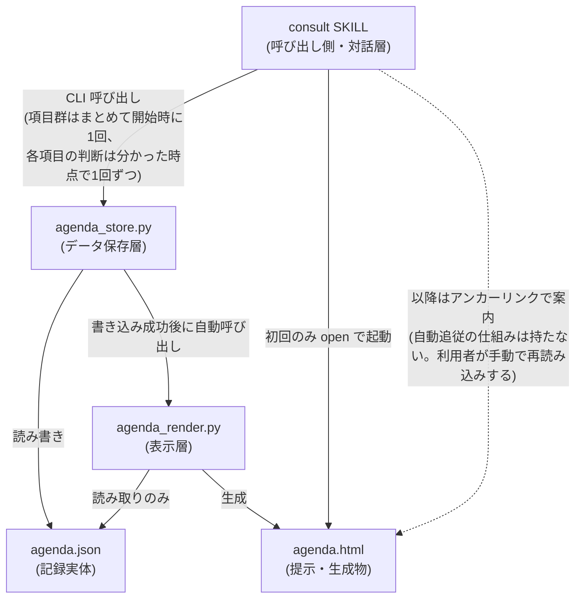
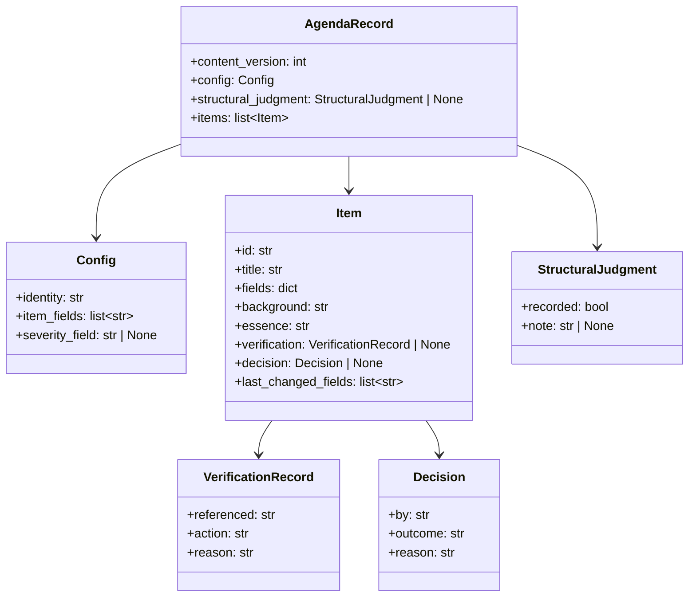
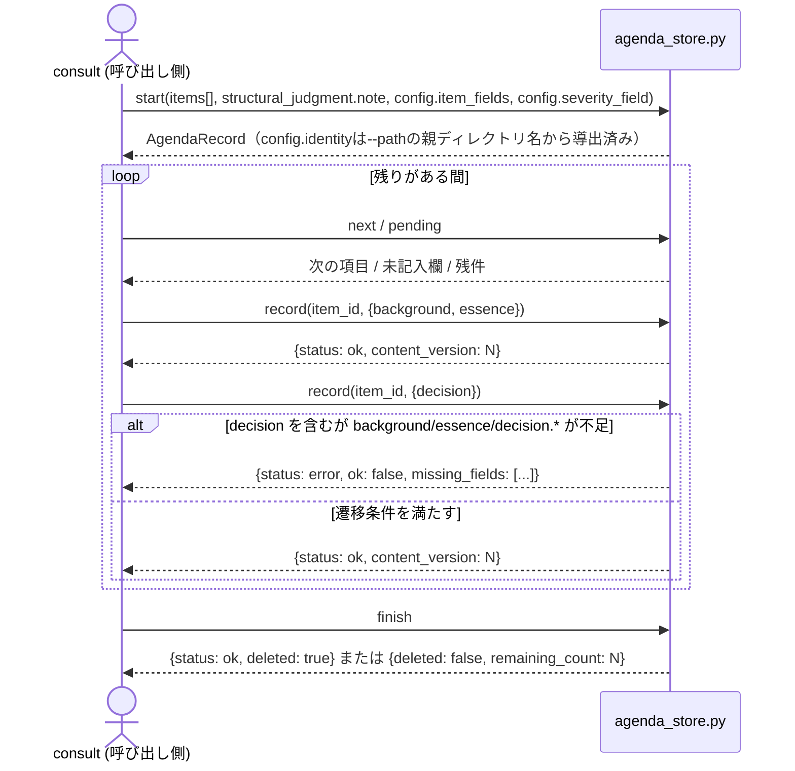

# DES-075 agenda 機構 設計書

> `doc_status: not_implemented` は「未着手」ではなく「依存先の機構がまだ実装・設計されていない」ことを意味する。`plugins/forge/scripts/agenda/agenda_store.py`/`agenda_render.py`/`agenda_schema.py` は本設計書が定める CLI 契約（`start`/`record`/`next`/`pending`/`finish`）へ既に書き換え済みである。残るのは呼び出し側（`plugins/forge/skills/consult/SKILL.md`）の追従であり、その完了をもって本キーを削除する。

## 1. 概要

agenda 機構は、`review`・`consult`（consult:REQ-017）が扱う議題項目（レビュー所見・議論の論点）の**記録・状態遷移判定・表示生成**を担う共通機構である。データ保存層（agenda:REQ-019）と表示層（agenda:REQ-021。表示層の設計は子設計書 DES-077 が持つ）の 2 責務に分かれ、呼び出し側（`consult`。`review` は `consult` を経由する間接呼び出し）は CLI スクリプト経由で構造化データを渡すだけで、状態を自ら保持しない。

保存形式は JSON（標準ライブラリ `json` のみ）を採用する。採用理由・PyYAML を採らない理由は [ADR-076](ADR-076_agenda_storage_format.md) に記す。

既存の `consult` 実装からの移行手順・フェーズ分割は本設計書の範囲外である（時間軸・順序を含む記述は設計書ではなく実装戦略の責務。[DES-027](../../../forge/design/DES-027_plan_strategy_phase_adr.md)）。実装完了後に削除される ephemeral 文書（実装戦略書）を恒久文書である本設計書から参照しない。

## 2. アーキテクチャ概要



- **依存方向は一方向**: `consult` → `agenda_store`。agenda 側は `consult` / `review` を知らない（呼び出し側固有の値は FNC-009 に従い引数で受け取る。用途中立性は [consult:REQ-017](../../requirements/REQ-017_consult_skill.md) NFR-002 と対応する）
- **`agenda_store` の書き込み系操作は完了後に `agenda_render` を自動的に呼ぶ**（§8.1）。呼び出し側（consult）が明示的に再描画を要求する経路は持たない。**理由**: 呼び出す/呼び出さないを consult の記憶に委ねると、`update` 後に再描画を呼び忘れた場合、提示（HTML）が記録より古いまま取り残される。これは FNC-003「提示の内容と記録の内容が食い違わないこと」を構造的に壊す経路になるため、生成のトリガーを機構側（store）に持たせ、呼び忘れという人的失敗経路そのものを無くす
- **`agenda_render` は `agenda_store` の内部構造に依存しない**: 両者は `agenda.json` というデータ契約のみを共有する（スキーマは §4 で固定）。`agenda_store` は `agenda_render` を呼び出す（サブプロセスまたは関数呼び出し）が、`agenda_render` は `agenda_store` の内部 API を一切参照せず、独立して直接呼び出すことも妨げない
- **`review` は `consult` を経由する間接呼び出し**であり、agenda を直接呼ばない（[DES-066](../../../forge/design/DES-066_review_body_design.md) §3.11・[consult:REQ-017](../../requirements/REQ-017_consult_skill.md) §1.2 と整合）
- **初回表示は consult が能動的に開く**: `agenda_store.py start` 実行直後、consult が Bash で `open` コマンドを実行し表示物をブラウザで開く。**自動追従の仕組みは持たない**——以降の更新を見るには利用者がタブを手動で再読み込みする（詳細設計は [DES-077](DES-077_agenda_display_design.md) §2.2・§4）

## 3. モジュール設計

### 3.1 モジュール一覧

| モジュール                                      | 責務                                                                                                                                                                           | 依存                                                                                                    |
| ----------------------------------------------- | ------------------------------------------------------------------------------------------------------------------------------------------------------------------------------ | ------------------------------------------------------------------------------------------------------- |
| `plugins/forge/scripts/agenda/agenda_store.py`  | 記録の CRUD・状態遷移の可否判定・検証記録の必須化（FNC-011）・構造判定の必須化（FNC-012）・変更情報の保持（FNC-013）・書き込み成功後の `agenda_render.py` 自動呼び出し（§8.1） | 標準ライブラリのみ（`json`）。`agenda_schema.py`（§5.1 の状態遷移契約）と `agenda_render.py` を呼び出す |
| `plugins/forge/scripts/agenda/agenda_render.py` | `agenda.json` から表示を生成する（詳細設計は [DES-077](DES-077_agenda_display_design.md)）                                                                                     | 標準ライブラリのみ（`html`）。`agenda_store.py` から呼ばれるが、それに依存しない（独立実行も可能）      |
| `plugins/forge/scripts/agenda/agenda_schema.py` | レコードのスキーマ定義・状態遷移ルールの定義（`plan_contract.py` と同型の契約モジュール）                                                                                      | なし                                                                                                    |
| `plugins/forge/scripts/agenda/__init__.py`      | パッケージマーカー（`plan/__init__.py` と同型）                                                                                                                                | なし                                                                                                    |

いずれも `plugins/forge/scripts/` 直下の既存パターン（`doc_backend/`・`doc_structure/`・`plan/`・`review/`）に倣い、複数 SKILL（`consult`・将来的な他呼び出し側）が共有する置き場に配置する。

### 3.2 クラス図



`fields` は呼び出し側が定義する項目属性（例: `severity`）をまとめて保持する（§4 の `items[].fields` と対応。agenda 機構はキー名の意味を解釈しない。FNC-009）。**`status` フィールド・独立した状態語彙（`status_vocabulary`/`terminal_statuses`/`active_statuses`）は持たない**——状態は「`decision` が記録されているか否か」という構造的事実だけで表現する（§4「状態の表現」参照）。agenda:REQ-019 FNC-009の表は「状態の語彙」を呼び出し側が渡しうる事項の**例**として挙げているが、これは「語彙を持つ場合はハードコードしない」ことを求める記述であり、語彙という概念自体を必須にしていない。呼び出し側（consult）が語彙を渡す必要のない設計は、FNC-009の制約と矛盾しない。

`start`（新規開始）と `record`（判断の記録）という**用途による CLI 分離**は行うが、これは新規/更新の判定を呼び出し側に負わせる分離ではない。`record` は引き続き `agenda_store.py` の `upsert_item()` に一本化されており、項目が存在しなければ追加、存在すれば更新するという upsert 意味論を保つ（1 項目 = 1 回の受け渡しという FNC-005 の趣旨のまま、呼び出し側が「新規か更新か」を判定する負担を無くす）。`start`/`record` の分離は「アジェンダ全体を始める」と「1 項目への判断を記録する」という**アクションの種類**による分離である（§6）。

**本図に `agenda_store.py`・`agenda_render.py`・`agenda_schema.py` を含めない**: いずれも UML クラスとして設計されたコンポーネントではなく、関数群として実装されている（`agenda_store.py` は record（dict）を引数に取る独立関数群、[DES-077](DES-077_agenda_display_design.md) の表示層は `agenda_render.py` モジュールの関数群、状態遷移契約は `agenda_schema.py` の `required_fields_for()`/`validate()` 関数）。本図（データ構造のクラス図）が表すのは `agenda.json` のスキーマであり、`AgendaRecord`/`Config`/`Item`/`VerificationRecord`/`Decision` はこのデータ構造（実装では入れ子の dict）を表す。各モジュールがこのスキーマを読み書きする関係は §2 のアーキテクチャ図・§3.1 のモジュール一覧が既に示しており、本図で重複して表現しない。

**`content_version` のインクリメント対象**: `agenda_store.py` の `start`・`record`（いずれも `items`・`structural_judgment` という「本文」を変える操作）は書き込み時に `content_version` を 1 増やす。「対話中の項目」を軽量に示す仕組み（旧 `current_item_id`/`set-current`）は廃止した——agenda:REQ-019はこの機構を要求しておらず、人間は生きた対話そのものから「今何を話しているか」を把握でき、別途表示層へ伝える必要がない（設計判断。要件文書自体は変更していない）。

**`VerificationRecord` と `Decision` の役割分担**: 両者は別の関心事を記録する。`VerificationRecord`（`referenced`・`action`・`reason`）は**外部指摘由来の項目に固有の検証記録**（FNC-011）であり、「指摘の真偽を確かめるために何を参照したか」「採否（`action`）とその理由」を保持する。`action` が採否を表す唯一のフィールドであり、真偽二値の重複表現は持たない。`Decision`（`by`・`outcome`・`reason`）は**項目全般に対する利用者（またはAIが代行した場合はその旨）の最終判断記録**（[consult:REQ-017](../../requirements/REQ-017_consult_skill.md) FNC-008）であり、外部指摘由来かどうかに関わらずすべての決着項目が持つ。§5.1 の遷移条件が `verification` 側のみを検証対象とするのは、`decision` を書き込む遷移の可否を機械的に判定するのは検証記録の充足（FNC-011）であり、`decision` の記入自体は呼び出し側（consult）が FNC-008 の要求（判断を得ないまま埋めない）として担保する対話進行上の責務であるため（agenda 機構は記録の形式のみを扱い、判断が実際に下されたかの意味的な妥当性は判定しない。FNC-009「内容の妥当性の判定は呼び出し側が行う」）。

## 4. データ設計（スキーマ）

`agenda.json` のトップレベル構造。`fields`（呼び出し側固有の項目属性。例: `severity`）は agenda 側が意味を解釈しない値としてそのまま格納する（FNC-009）。

**新規フィールドを追加する前に [consult:DES-078](../../design/DES-078_consult_dialogue_flow_design.md) §2.2 の必要性契約を満たすことを確認する**: 対応する情報移動の場面が対話シーケンス（同 §2）に存在しないフィールドは追加しない。

`verification.action` の語彙（`adopt` / `reject` の2値）は FNC-011 が定める agenda 機構固有のスキーマである。この語彙は `agenda_schema.py` が固定して定義し、呼び出し側から受け取らない。

```json
{
  "content_version": 3,
  "config": {
    "identity": "20260819-agenda-design",
    "item_fields": ["severity"],
    "severity_field": "severity"
  },
  "structural_judgment": {
    "recorded": true,
    "note": "同型の指摘は無い。個別の食い違いに留まる"
  },
  "items": [
    {
      "id": "01",
      "title": "<短い名前>",
      "fields": { "severity": "critical" },
      "background": "...",
      "essence": "...",
      "verification": {
        "referenced": "plugins/forge/skills/consult/SKILL.md:56-80",
        "action": "adopt",
        "reason": "..."
      },
      "decision": { "by": "human", "outcome": "adopt", "reason": "..." },
      "last_changed_fields": ["decision"]
    }
  ]
}
```

| フィールド                    | 意味                                                                                                                                                                                                                                                                                                                                                                                                                                                                                                                                                                                                    | 対応する要件            |
| ----------------------------- | ------------------------------------------------------------------------------------------------------------------------------------------------------------------------------------------------------------------------------------------------------------------------------------------------------------------------------------------------------------------------------------------------------------------------------------------------------------------------------------------------------------------------------------------------------------------------------------------------------- | ----------------------- |
| `content_version`             | `agenda_store.py` が書き込みごとにインクリメントする整数。比較が確実な整数を使う（タイムスタンプではない）                                                                                                                                                                                                                                                                                                                                                                                                                                                                                              | FNC-013                 |
| `config.identity`             | 記録の識別名。`agenda_store.py` が `--path` 引数の**親ディレクトリ名**から機械的に導出する（`Path(path).parent.name`）。起点の判定を別途行わない——`--path` は呼び出し側（consult）が既に完全に指定する値であり、ファイル名は起点を問わず常に`agenda.json`（[DES-077](DES-077_agenda_display_design.md)が前提とする固定名）、親ディレクトリ名だけが起点で変わる（review 起点は`.claude/.temp/review/agenda.json`→識別名`"review"`、consult 直接利用は`.claude/.temp/consult/${CLAUDE_SESSION_ID}/agenda.json`→識別名は`${CLAUDE_SESSION_ID}`の値。§7参照）。呼び出し側は `identity` を組み立てて渡さない | FNC-009・NFR-003        |
| `config.item_fields`          | 呼び出し側が `items[].fields` に含める属性キーの一覧（agenda 側は意味を解釈しない）                                                                                                                                                                                                                                                                                                                                                                                                                                                                                                                     | FNC-009                 |
| `config.severity_field`       | `item_fields` のうち、表示層（[DES-077](DES-077_agenda_display_design.md) §3.1a）が重大度バッジとして強調表示する対象キー名。未指定（`null`）ならバッジを表示しない。**キー名を指定するだけで、値の意味には agenda 側は立ち入らない**                                                                                                                                                                                                                                                                                                                                                                   | FNC-009                 |
| `structural_judgment`         | FNC-012 の判定結果。**個別項目の状態遷移が起きる前に、このフィールドが埋まっていなければならない**。呼び出し側が候補JSONで渡すのは`note`のみであり、`recorded`（bool）は`content_version`（本表）と同様に`agenda_store.py`が自動導出する——`note`が非空文字列で渡された`start`呼び出し・`record`呼び出し（新規項目追加時。§5.1a）のいずれでも、`agenda_store.py`はその場で`recorded: true`を書き込む。呼び出し側はこのフィールドを渡さない（渡すと未知フィールドとして拒否される。`recorded_at`のような監査用タイムスタンプは、どのロジック・表示からも参照されない不要フィールドと判断し設計しない）    | FNC-012                 |
| `items[].verification`        | FNC-011 が要求する検証記録。`referenced` は位置情報（ファイル:行 / コマンドと出力）を必須とする                                                                                                                                                                                                                                                                                                                                                                                                                                                                                                         | FNC-011                 |
| `items[].decision`            | 項目の最終判断記録（§3.2）。**このキーが `dict` 型で `outcome` が非空であることが「決着済み」を表す**（下記「状態の表現」参照）                                                                                                                                                                                                                                                                                                                                                                                                                                                                         | consult:REQ-017 FNC-008 |
| `items[].last_changed_fields` | 直前の更新で変わったフィールド名の配列（表示層 FNC-002 が使う）                                                                                                                                                                                                                                                                                                                                                                                                                                                                                                                                         | FNC-013                 |

### 状態の表現（独立した状態語彙を持たない）

`status` フィールド・`config.status_vocabulary`/`terminal_statuses`/`active_statuses`は持たない。項目の状態は次の構造的事実だけで表す。

- **`decision`が `dict` 型で `outcome` が非空でない項目**（`decision`キー自体が無い場合を含む）= 未対応（残件）
- **`decision`が `dict` 型で `outcome` が非空の項目** = 決着済み。`decision.outcome`が「どう決着したか」（`"adopt"`・`"取り下げ"`・`"対象外"`等、呼び出し側の自由記述）を表す

`agenda_store.py`は新規項目の初期値として `decision` キー自体を（値 `None` で）持たせる実装を取ってよい——判定は常に上記の値ベースの条件（`isinstance(decision, dict) and decision.get("outcome")`）で行われ、キーの有無そのものを見ないため、初期値としてキーを持たせるか省略するかは実装判断に委ねられる。独立した語彙を持たないことで、`agenda_schema.py`は「`decision`を含む差分パッチかどうか」だけを見て終端相当の検証（§5.1）を課せばよくなり、呼び出し側は語彙を宣言する負担（旧`--status-vocabulary`等）を持たない。

**値の境界は JSON の構文自身が持つ**（NFR-001）。`background` / `essence` 等の自由記述フィールドに区切り文字・改行・記号が含まれても、JSON の文字列リテラルとしてエスケープされるため保存が破損しない。

### 4.1 機密情報の扱い（NFR-005）

`agenda_store.py` / `agenda_render.py` は、渡された値に機密情報が含まれるかどうかを判定しない（FNC-009「内容の妥当性の判定は呼び出し側が行う」と同じ分担）。機密情報の検知・除外・マスキングは呼び出し側（`consult`）の責務であり、`agenda` 機構は呼び出し側が既にマスキング済みの値を受け取る前提で保存・表示する。

- 呼び出し側は、機密情報を検知した項目について、値そのものではなく「どこに」「どの種類の」機密が含まれるかを `background` 等のフィールドへ記述する（[consult:REQ-017](../../requirements/REQ-017_consult_skill.md) NFR-004 と同じ制約を呼び出し側が満たす）
- `agenda_store.py` / `agenda_render.py` はこの制約を検証しない。**検証を課さない理由**は、機構が受け取った文字列が機密情報を含むか否かを判定する手段を原理的に持たないためである（FNC-011・FNC-012 と同じ判定主体の分離: 機構は形式のみを扱い、内容の妥当性は呼び出し側が担う）

## 5. 状態遷移設計

### 5.1 遷移の必要条件（FNC-008）

`agenda_schema.py` の `required_fields_for()`/`validate()` が、必須フィールドを宣言的に定義する（散文の禁止事項に依存しない）。判定のトリガーは「`record` 呼び出しが渡した差分パッチのキー集合（`patch_keys`）に `decision` を含むかどうか」だけを見る——状態語彙は存在しないため、遷移先の値そのものを解釈しない。**トリガーが成立した場合、必須フィールドの非空チェック自体は、今回の差分パッチだけではなく、既存項目へ差分パッチを適用した後の項目全体（`upsert_item()` がマージした結果）に対して行う**——`background`/`essence`が前回以前の`record`呼び出しで既に保存済みの値であっても、今回`decision`を渡すタイミングで満たされていれば足りる（§6.2の呼び出し②はこの前提に依拠する）。

| 判定条件                                                            | 必須フィールド                                                                                                                     | 対応する要件 |
| ------------------------------------------------------------------- | ---------------------------------------------------------------------------------------------------------------------------------- | ------------ |
| `patch_keys` に `decision` を含む（＝決着させる `record` 呼び出し） | `background`・`essence`・`decision.by`・`decision.outcome`・`decision.reason` が空でないこと                                       | FNC-008      |
| 上記かつ外部指摘由来の項目（`verification` を持つ項目）全般         | 上記に加え `verification.referenced` が空でないこと（**採否によらず検証を要求する**。「採用する場合も検証を要求すること」FNC-011） | FNC-011      |
| 上記かつ `verification.action != adopt`                             | 上記に加え `verification.reason` が空でないこと（**採らない場合も理由を書く**）                                                    | FNC-011      |
| 個別項目への遷移全般                                                | `structural_judgment.recorded == true` であること                                                                                  | FNC-012      |

条件を満たさない `record` 呼び出しは拒否し、不足しているフィールド名を含む `{"ok": bool, "missing_fields": list[str]}` を返す。呼び出し側（consult）はこれをそのまま利用者・コンソールへ提示できる。`verification.action` の語彙（`adopt` / `reject` の2値）はFNC-011が定める agenda 機構固有のスキーマである（§4）。

**残件数は「`decision` が未決着の項目」の件数として算出する**（FNC-006）。`pending_item_ids()` は `decision` が `dict` 型でない、または `decision.outcome` が空の項目の `id` を返し、呼び出し元が `len()` で件数を導出する（§9）。§7 の記録削除条件（「全項目に `decision` が記録された時点」）も同じ判定を参照する。

### 5.1a 新規項目の追加に伴う構造判定の再要求（FNC-012）

`record` は `upsert_item()` に一本化されており、`--item-id` が既存項目を指さない場合は新規追加として扱う（§3.2）。この upsert 意味論は、`structural_judgment.recorded` を「一度立てば立ちっぱなしの単一フラグ」として扱うと整合しない——`start` 時点で下した「集合全体に構造的な誤りがないか」という判断は、その後 `record` で項目が追加され集合そのものが変わった時点で古くなる。

この不整合を解消するため、次の前提条件を課す。**中間状態を永続化しない**（新規追加と再判定を同一の `record` 呼び出し内でアトミックに完結させ、判定が古いまま保存される瞬間を作らない）。

| `record` 呼び出しの種類                        | 課す前提条件                                                                                                                                    |
| ---------------------------------------------- | ----------------------------------------------------------------------------------------------------------------------------------------------- |
| 新規追加（`--item-id` が既存項目を指さない）   | 候補 JSON のトップレベルキーに `structural_judgment.note`（非空文字列）を伴うこと。伴わなければ呼び出し全体を拒否し、項目・判定ともに保存しない |
| 既存項目の更新（`--item-id` が既存項目を指す） | `structural_judgment.note` は不要（既存の判定が現在の集合を表し続けているため）                                                                 |

この判定は §5.1 表の「個別項目への遷移全般」の行と独立に働く——後者は「`decision` を書く瞬間に `recorded == true` であること」を課すのに対し、本節は「新規項目を追加する瞬間に、その追加後の集合について再判定済みであること」を課す。両者を組み合わせることで、`start` 後に追加された項目を含めて構造判定が漏れなく及ぶ。候補 JSON における `structural_judgment` の扱い（項目パッチとは別枠であること）は §6.1 で定める。

### 5.2 構造判定（FNC-012）の単位

判定を課す「集合」の単位は、起点ごとに 1 つに固定する（FNC-009 の「呼び出し側から受け取るもの」には含めない。単位そのものは起点の性質から導出される固定値であり、都度変える対象ではない）。

**「呼び出し側」は agenda 機構にとって常に `consult` である**（§2）。`review` は agenda を直接呼ばず、consult を経由する間接利用者であり、下表の `review` はあくまで consult がどの文脈（起点）から呼ばれているかを指す。`review` 起点であっても、agenda を呼ぶのは常に consult 自身であり、`config.identity`・記録の置き場（§7）が起点ごとに異なる値を持つに過ぎない。

| 起点                                        | 集合の単位                                                 | 導出根拠                                                                                                                                          |
| ------------------------------------------- | ---------------------------------------------------------- | ------------------------------------------------------------------------------------------------------------------------------------------------- |
| `review` 起点                               | 1 回のレビュー実行                                         | `review` は同時に 1 つのレビューしか実行しない（§7 の導出と同じ性質）。記録の生存期間（初期化〜終端処理での削除）と一致する範囲を集合の単位とする |
| `consult` 起点（review 経由でない直接利用） | 1 回の consult セッション全体（起動から Phase 5 終了まで） | consult の記録は 1 セッションの開始から終了まで存在する（§7）。記録の生存期間と集合の単位を一致させる                                             |

## 6. CLI インターフェース設計（FNC-005・NFR-006）

AI（consult）から agenda への入力は、**AI が渡し方そのもの（値の並べ方・書式）を組み立てない**ことを原則とする（agenda:REQ-019 FNC-005）。AI は候補JSONをWriteツールで一時ファイルへ書き、`--input-file`でそのパスを渡す。JSONへの書き込みは常に`agenda_store.py`自身が行う。5つのサブコマンドは、3つのアクション（アジェンダを開始する／項目への判断を記録する／残りを問う・終える）に対応する。

```bash
# アジェンダを開始する（consult Phase 2 相当。項目群＋アジェンダ全体の判断をまとめて1回で）
python3 agenda_store.py start --path <path-to-agenda.json> --input-file <candidate.json>
# candidate.json:
# {
#   "structural_judgment": { "note": "同型の指摘は無い。個別の食い違いに留まる" },
#   "config": { "item_fields": ["severity"], "severity_field": "severity" },
#   "items": [ { "id": "01", "title": "<短い名前>" }, ... ]
# }
# config.identity は agenda_store.py 自身が --path の親ディレクトリ名から導出する（AIは渡さない）

# 項目への判断を記録する（1項目につき2回。背景・本質が分かった時点で1回、結論が出た時点でもう1回）
python3 agenda_store.py record --path <path> --item-id "01" --input-file <candidate.json>
# 呼び出し①候補: {"background": "...", "essence": "..."}
# 呼び出し②候補: {"decision": {"by": "human", "outcome": "adopt", "reason": "..."}}
# --item-id が既存項目を指さない（新規追加）場合、structural_judgment.note の同時指定が必須（§5.1a）:
# {"title": "...", "structural_judgment": {"note": "追加後もなお構造的な誤りは無い"}}

# 次に扱う項目・残件を数えずに得る（FNC-006）
python3 agenda_store.py next --path <path>
python3 agenda_store.py pending --path <path>

# 終える（全項目にdecisionが記録されていれば削除、残っていれば残件数を返す）
python3 agenda_store.py finish --path <path>
```

**失敗は既定値で補わない（NFR-006）**: 各コマンドはJSONの読み書きに失敗した場合、非ゼロ終了と`{"status": "error", "message": "..."}`を返す。呼び出し側（consult）は成功を仮定して進行しない。

### 6.1 `record`のセマンティクス（差分パッチ）

`agenda_store.py`の`record`コマンドは、**変更したいフィールドだけを`--item-id`（必須）と候補JSON（`--input-file`）で受け取る**。`agenda_store.py`はこの候補JSONを差分パッチdictとして扱い、既存項目に対しては渡されたキーだけを既存値へマージし、渡されなかったキーは変更しない。

- **`id`は`--item-id`専用**: 候補JSONに`id`キーを含めることは曖昧さを避けるため拒否する
- **`structural_judgment`は項目パッチではなくレコード直下（`AgendaRecord.structural_judgment`。§3.2）へのパッチである**: 候補JSONのトップレベルキーのうち`structural_judgment`だけは項目（`items[itemId]`）へマージせず、レコード直下の`structural_judgment`フィールドへ別経路でマージする。他の全キー（`title`/`background`/`essence`/`decision`/`verification`/`fields`）は項目パッチである。`agenda_store.py`はこの2つの宛先を候補JSONのキー名だけで機械的に振り分ける（`structural_judgment`かどうかで分岐し、それ以外は`upsert_item()`へ渡す）。新規追加時にこのキーを要求する条件は§5.1aで定める
- 例: 背景・本質だけを先に記録したい場合、`{"background": "...", "essence": "..."}`だけを渡せば足りる。`decision`等、まだ決まっていないフィールドを含める必要はない
- **理由（FNC-004との対応）**: 全フィールドを毎回書き直すフルオブジェクト方式は、一部だけを変える更新でもAIに無関係なフィールドの再送を強いる。これは「記録の維持にAIが使う出力量を減らす」という本機構の存在意義（agenda:REQ-019 §1.1）に反する。差分パッチは、AIが生成する量を「実際に変わった内容」だけに絞る
- **理由（AIが渡し方を組み立てない。FNC-009の入力境界）**: `--input-file`はAIがWriteツールで書いた候補JSONファイルのパスを渡すだけであり、AIが値をシェルコマンドの書式（`--set key=value`等）に組み立てる工程を持たない。`agenda_store.py`が候補JSONの型・キー集合を検証する（旧`--item-file`方式が持っていた「AIが自由な構造のJSONを組み立てられる」という型混入経路とは異なり、許可するトップレベルキー集合をscript側が固定する）
- `last_changed_fields`（§4）は、この差分パッチで実際に渡されたキーの集合から`id`を除いたものを記録する
- **マージの粒度はトップレベルキー単位である**: `fields`のような入れ子キーは1階層として扱い、`fields`全体をそのパッチの`fields`で置き換える（キー単位の再帰マージは行わない）。`fields`の一部キーだけを変えたい場合、呼び出し側が既存の`fields`全体を読み取ったうえで変更後の全体を渡す

### 6.2 正常系のコマンド呼び出し順序

本節は consult↔agenda_store.py 間の CLI レベルの呼び出し順序のみを扱う。review・reviewer・evaluator・人間を含む端から端までの全体シーケンス、および `items[]` が起点（review 経由か直接利用か）によってどう組み立てられるかは [consult:DES-078](../../design/DES-078_consult_dialogue_flow_design.md) §2・§3 が持つ。



## 7. 置き場・個数・寿命設計（NFR-003）

導出根拠は起点の性質（同時成立数・識別の要否・内容の引き継ぎ先の有無）から次のように定める。**「呼び出し側」は常に `consult` であり（§2・§5.2）、下表の `review`/`consult` は consult がどの起点から呼ばれているかを指す。**

| 起点                                        | 置き場                                                   | 個数                                                                                                   | 識別方法                                                                                                                                   | 寿命                                                                                                                   |
| ------------------------------------------- | -------------------------------------------------------- | ------------------------------------------------------------------------------------------------------ | ------------------------------------------------------------------------------------------------------------------------------------------ | ---------------------------------------------------------------------------------------------------------------------- |
| `review` 起点                               | `.claude/.temp/review/agenda.json`（固定パス）           | 同時に 1 つ（review は同時に 1 つのレビューしか実行しない運用前提。`/forge:review` SKILL.md Step 1.1） | 親ディレクトリ名 `review`（固定）。`agenda_store.py`が`--path`から機械的に導出する                                                         | レビューの完了時（終端処理 Step 到達時）に削除する                                                                     |
| `consult` 起点（review 経由でない直接利用） | `.claude/.temp/consult/${CLAUDE_SESSION_ID}/agenda.json` | 複数が同時に開ける（別主題の議論を並行できる）                                                         | 親ディレクトリ名 `${CLAUDE_SESSION_ID}`（`agenda_store.py`が`--path`から機械的に導出する。呼び出し側は`identity`自体を組み立てて渡さない） | 全項目に `decision` が記録された時点で削除する（§5.1・`finish`コマンドが判定。agenda:REQ-019 旧 TBD-004 の決着どおり） |

`review` 起点が固定名・箱なしなのは「同時に 1 つしか成立しないなら識別のための名前も列挙のための境界も要らない」（NFR-003 導出例）ため。`consult` 起点が主題名を持ち、寿命を明示的な終了条件で管理するのは「複数が同時に成立するなら名前が主題を持つ」ためである。

## 8. 表示生成設計（agenda:REQ-021）

表示層（`agenda_render.py`、HTML 生成・状態表示・更新方式・初回表示のトリガー）の設計は [DES-077](DES-077_agenda_display_design.md) が持つ。本文書はデータ保存層の責務として、書き込み成功後に表示層の再生成を呼び出す契約（§8.1）のみを扱う。

### 8.1 再描画のトリガー（呼び出し側から独立させる）

**`agenda_store.py` の書き込み系コマンド（`start`・`record`）は、JSON への書き込みが成功した直後に `agenda_render.py` を呼び出し、表示を再生成する。** 呼び出し側（consult）が明示的に再描画を要求する CLI コマンド・引数は持たない。

- **理由**: 再描画の要否・タイミングを呼び出し側の記憶に委ねると、`record` の後に再描画を呼び忘れた場合、提示が記録（`agenda.json`）より古いまま取り残される。これは FNC-003「提示の内容と記録の内容が食い違わないこと」が禁じる状態そのものであり、呼び忘れという人的な失敗経路を許すことになる。生成のトリガーを機構側（`agenda_store.py`）に持たせることで、記録が変わった時点で提示も必ず追従する構造にする
- `start`・`record`はいずれも`content_version`を増やし、`agenda.html`を再生成する（[DES-077](DES-077_agenda_display_design.md) §4。表示層は`agenda.html`のみを生成する単純な仕組みであり、自動追従の仕組みは持たない）
- **実装方針**: `agenda_store.py` は書き込み成功後、`agenda_render.py` の描画関数を呼び出す（同一プロセス内の関数呼び出し、または軽量なサブプロセス起動）。読み取り専用コマンド（`next`・`pending`）は記録を変更しないため再描画を伴わない
- **失敗時の扱い（NFR-006 と同じ扱い）**: 再描画に失敗した場合も、JSON への書き込み自体が成功しているなら状態遷移は成立させる。ただし再描画の失敗は隠さず、呼び出し側（consult）へ明示的に伝える（`{"status": "partial", "message": "記録は更新されたが再描画に失敗した: ..."}` 等）。**記録の正しさを表示の失敗で道連れにしない**——記録は単体の真実源であり、表示側の障害で記録の更新自体を巻き戻す理由にはならない

## 9. テスト設計

- **単体テスト対象**:
  - `agenda_store.py`: `decision`を含む`record`呼び出しでのみ`background`/`essence`/`decision.*`が必須になること（§5.1）、`structural_judgment`未記録時に個別項目の遷移が拒否されること（FNC-012）、外部指摘由来の項目で`referenced`が空の場合は採否によらず決着が拒否されること、`verification.action != adopt`の場合はさらに`reason`が空でも拒否されること（いずれもFNC-011）、JSON読み書き失敗時に既定値で補わず明示エラーを返すこと（NFR-006）、`next_item_id()`/`pending_item_ids()`が`decision`の値ベース判定（`dict`型で`outcome`が非空か）に基づき次項目・残件（`pending_item_ids()`の呼び出し元が`len()`で導出する）を正しく返すこと（FNC-006）、`start`/`record`の書き込み成功後に`agenda_render.py`が自動的に呼ばれること・呼び出しが失敗しても記録側の状態遷移は成立したままであること（§8.1）、`start`/`record`の実行で`content_version`が1増えること、`items[].last_changed_fields`が今回の差分パッチで渡されたキーの集合（`id`を除く）と一致すること（FNC-013）、`finish`が未対応項目を残したまま呼ばれても記録を削除しないこと、全項目に`decision`が記録された場合は削除すること
  - `agenda_schema.py`: スキーマ検証（不正な JSON 構造の拒否）
  - `agenda_render.py` の単体テストは [DES-077](DES-077_agenda_display_design.md) §5 が持つ
- **統合テスト対象**: `agenda_store.py start`（項目群＋構造判定をまとめて渡す） → `record` × N（背景・本質→決着への遷移を含む） → `next`/`pending` → `finish`の一連の呼び出しで、記録が意図通り遷移すること。あわせて、各書き込み操作の直後に表示が再生成され、内容が最新の`agenda.json`と一致すること（§8.1・[DES-077](DES-077_agenda_display_design.md)）

## 10. FNC-004 充足の測定方法

agenda:REQ-019 FNC-004（記録の維持に AI が使う出力量・読み取り量が、現行より減っていること）の充足を、次の手順で測定する（[NOTES_open_design_questions.md](NOTES_open_design_questions.md) 旧 TBD-002 の決着）。

- **比較対象**: 現行の `consult` 自前実装（`plugins/forge/skills/consult/SKILL.md` Phase 2・4 が行う、討議ファイルの Write/Edit と `discussion_file_template.md` 書式の手動組み立て）
- **測定単位**: 1 項目を決着させるまでに AI が生成した文字数（コンソール出力 + ファイルへの書き込み内容の合計。ツール呼び出しの引数文字列を含む）
- **計測方法**: 移行前後で同一シナリオ（例: 3 項目のレビュー所見を 1 件ずつ決着させる）を実行し、上記測定単位をシナリオ全体で合計して比較する。移行後の値が移行前を下回ることを確認する

**比較対象の実態**: `update_triage.py` 相当の永続化スクリプトは本リポジトリに実在しないため（§11 参照）、比較対象は `review` 側ではなく `consult` の自前 Markdown 実装である。

## 11. 使用する既存コンポーネント

| コンポーネント          | ファイルパス                                     | 用途                                               |
| ----------------------- | ------------------------------------------------ | -------------------------------------------------- |
| 単一責務モジュール構成  | `plugins/forge/scripts/plan/plan_contract.py`    | `agenda_schema.py` のモジュール構成の参考          |
| 状態機械 + CLI パターン | `plugins/forge/scripts/review/parse_findings.py` | `agenda_store.py` の CLI 設計・JSON 出力設計の参考 |

表示層が使用する既存コンポーネント（討議ファイルテンプレート・HTML エスケープパターン）は [DES-077](DES-077_agenda_display_design.md) §6 が持つ。

再利用しない判断: `update_triage.py` 相当の永続化スクリプトは本リポジトリに実在しない（review 側の仕分けは会話内で完結していたため）。したがって置き換え対象は `consult` の自前 Markdown 実装のみである。
