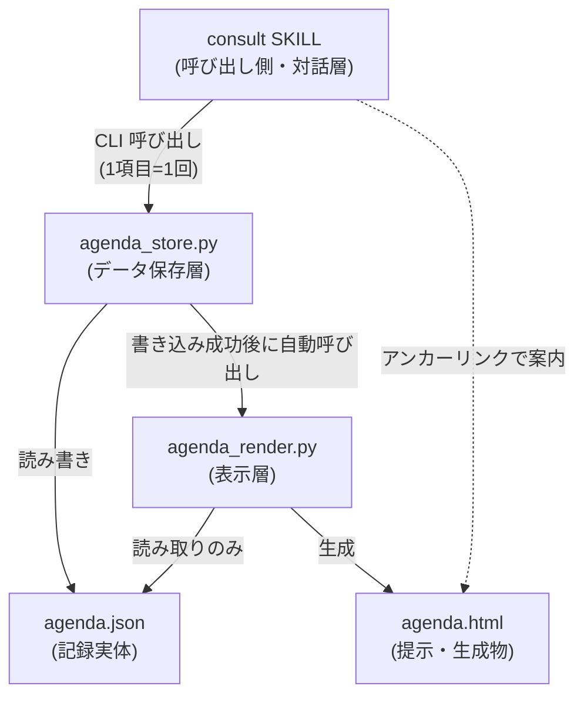
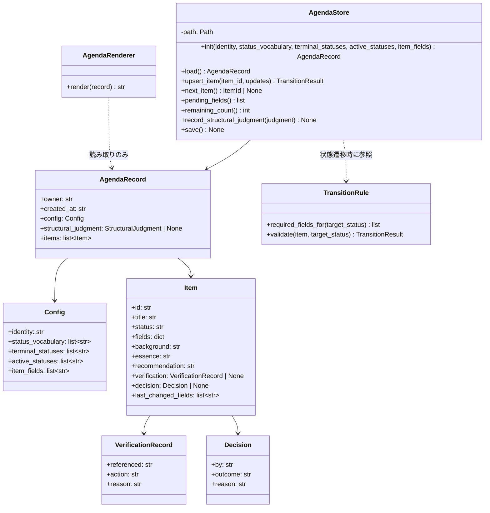
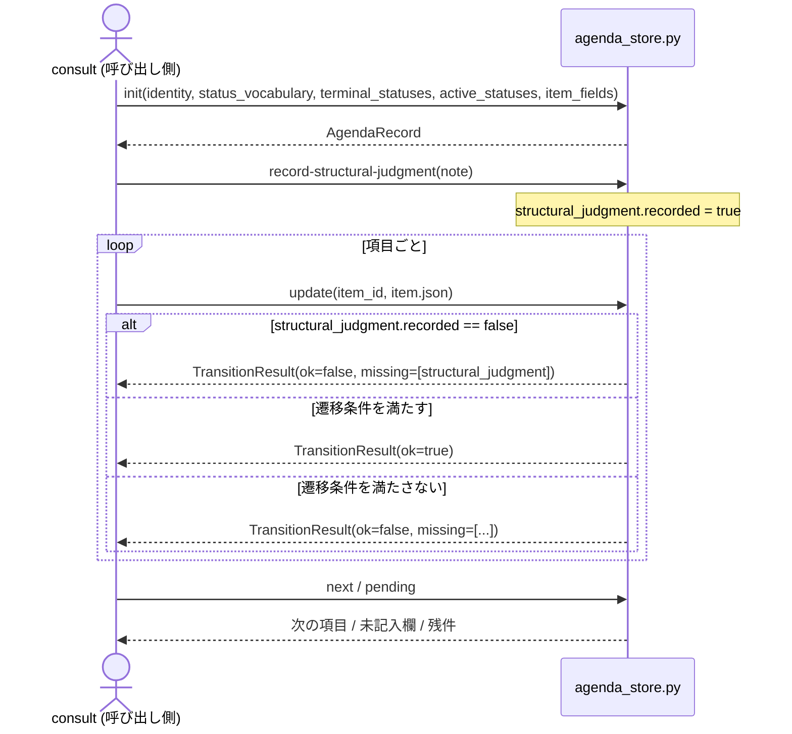

# DES-075 agenda 機構 設計書

## メタデータ

| 項目     | 値                                              |
| -------- | ----------------------------------------------- |
| 設計ID   | DES-075                                         |
| 関連要件 | agenda:REQ-019, agenda:REQ-021, consult:REQ-017 |
| 作成日   | 2026-08-19                                      |

## 1. 概要

agenda 機構は、`review`・`consult` が扱う議題項目（レビュー所見・議論の論点）の**記録・状態遷移判定・表示生成**を担う共通機構である。データ保存層（agenda:REQ-019）と表示層（agenda:REQ-021）の 2 責務に分かれ、呼び出し側（`consult`。`review` は `consult` を経由する間接呼び出し）は CLI スクリプト経由で構造化データを渡すだけで、状態を自ら保持しない。

保存形式は JSON（標準ライブラリ `json` のみ）を採用する。採用理由・PyYAML を採らない理由は [ADR-076](ADR-076_agenda_storage_format.md) に記す。

既存の `consult` 実装からの移行手順・フェーズ分割は本設計書の範囲外である（時間軸・順序を含む記述は設計書ではなく実装戦略の責務。[DES-027](../../../forge/design/DES-027_plan_strategy_phase_adr.md)）。実装完了後に削除される ephemeral 文書（実装戦略書）を恒久文書である本設計書から参照しない。

## 2. アーキテクチャ概要



- **依存方向は一方向**: `consult` → `agenda_store`。agenda 側は `consult` / `review` を知らない（呼び出し側固有の値は FNC-009 に従い引数で受け取る。用途中立性は [consult:REQ-017](../../requirements/REQ-017_consult_skill.md) NFR-002 と対応する）
- **`agenda_store` の書き込み系操作は完了後に `agenda_render` を自動的に呼ぶ**（§8.3）。呼び出し側（consult）が明示的に再描画を要求する経路は持たない。**理由**: 呼び出す/呼び出さないを consult の記憶に委ねると、`update` 後に再描画を呼び忘れた場合、提示（HTML）が記録より古いまま取り残される。これは FNC-003「提示の内容と記録の内容が食い違わないこと」を構造的に壊す経路になるため、生成のトリガーを機構側（store）に持たせ、呼び忘れという人的失敗経路そのものを無くす
- **`agenda_render` は `agenda_store` の内部構造に依存しない**: 両者は `agenda.json` というデータ契約のみを共有する（スキーマは §4 で固定）。`agenda_store` は `agenda_render` を呼び出す（サブプロセスまたは関数呼び出し）が、`agenda_render` は `agenda_store` の内部 API を一切参照せず、独立して直接呼び出すことも妨げない
- **`review` は `consult` を経由する間接呼び出し**であり、agenda を直接呼ばない（[DES-066](../../../forge/design/DES-066_review_body_design.md) §3.11・[consult:REQ-017](../../requirements/REQ-017_consult_skill.md) §1.2 と整合）

## 3. モジュール設計

### 3.1 モジュール一覧

| モジュール                                      | 責務                                                                                                                                                                           | 依存                                                                                               |
| ----------------------------------------------- | ------------------------------------------------------------------------------------------------------------------------------------------------------------------------------ | -------------------------------------------------------------------------------------------------- |
| `plugins/forge/scripts/agenda/agenda_store.py`  | 記録の CRUD・状態遷移の可否判定・検証記録の必須化（FNC-011）・構造判定の必須化（FNC-012）・変更情報の保持（FNC-013）・書き込み成功後の `agenda_render.py` 自動呼び出し（§8.3） | 標準ライブラリのみ（`json`）。`agenda_render.py` を呼び出す                                        |
| `plugins/forge/scripts/agenda/agenda_render.py` | `agenda.json` から HTML を生成する（FNC-001〜005・NFR-001）                                                                                                                    | 標準ライブラリのみ（`html`）。`agenda_store.py` から呼ばれるが、それに依存しない（独立実行も可能） |
| `plugins/forge/scripts/agenda/agenda_schema.py` | レコードのスキーマ定義・状態遷移ルールの定義（`plan_contract.py` と同型の契約モジュール）                                                                                      | なし                                                                                               |
| `plugins/forge/scripts/agenda/__init__.py`      | パッケージマーカー（`plan/__init__.py` と同型）                                                                                                                                | なし                                                                                               |

いずれも `plugins/forge/scripts/` 直下の既存パターン（`doc_backend/`・`doc_structure/`・`plan/`・`review/`）に倣い、複数 SKILL（`consult`・将来的な他呼び出し側）が共有する置き場に配置する。

### 3.2 クラス図



`fields` は呼び出し側が定義する項目属性（例: `severity`・`confidence`）をまとめて保持する（§4 の `items[].fields` と対応。agenda 機構はキー名の意味を解釈しない。FNC-009）。`add`/`update` の CLI 分離は設けず、`AgendaStore.upsert_item()` に一本化する（項目が存在しなければ追加、存在すれば更新。1 項目 = 1 回の受け渡しという FNC-005 の趣旨に合わせ、呼び出し側が「新規か更新か」を判定する負担を無くす）。CLI 側も §6 のとおり `update` サブコマンド 1 つで両方を扱う。

**`VerificationRecord` と `Decision` の役割分担**: 両者は別の関心事を記録する。`VerificationRecord`（`referenced`・`action`・`reason`）は**外部指摘由来の項目に固有の検証記録**（FNC-011）であり、「指摘の真偽を確かめるために何を参照したか」「採否（`action`）とその理由」を保持する。`action` が採否を表す唯一のフィールドであり、真偽二値の重複表現は持たない。`Decision`（`by`・`outcome`・`reason`）は**項目全般に対する利用者（またはAIが代行した場合はその旨）の最終判断記録**（[consult:REQ-017](../../requirements/REQ-017_consult_skill.md) FNC-008）であり、外部指摘由来かどうかに関わらずすべての決着項目が持つ。§5.1 の遷移条件が `verification` 側のみを検証対象とするのは、決着への遷移可否を機械的に判定するのは検証記録の充足（FNC-011）であり、`decision` の記入自体は呼び出し側（consult）が FNC-008 の要求（判断を得ないまま埋めない）として担保する対話進行上の責務であるため（agenda 機構は記録の形式のみを扱い、判断が実際に下されたかの意味的な妥当性は判定しない。FNC-009「内容の妥当性の判定は呼び出し側が行う」）。

## 4. データ設計（スキーマ）

`agenda.json` のトップレベル構造。`fields`（呼び出し側固有の項目属性。例: `severity`・`confidence`）は agenda 側が意味を解釈しない値としてそのまま格納する（FNC-009）。**一方、`status_vocabulary` は agenda 機構が状態遷移の可否を機械判定するために参照する（FNC-008）ため、値そのもの（例: `"決着"`）ではなく `config.terminal_statuses` という役割マッピングを介して参照する**。呼び出し側は任意の語彙を使えるが、そのうち「§5.1 の必須フィールドを課す終端状態」がどれかを `terminal_statuses` で明示する。`TransitionRule` は `terminal_statuses` に含まれる値への遷移かどうかだけを見て、語彙そのものの意味（「決着」が何を意味するか等）には立ち入らない。

`verification.action` の語彙（`adopt` / それ以外）は呼び出し側の状態語彙とは別物で、FNC-011 が定める agenda 機構固有のスキーマである（呼び出し側が自由に定義する `status_vocabulary` の対象に含まれない）。この語彙は `agenda_schema.py` が固定して定義し、呼び出し側から受け取らない。

```json
{
  "owner": "consult",
  "created_at": "2026-08-19T10:00:00",
  "config": {
    "identity": "20260819-agenda-design",
    "status_vocabulary": [
      "未着手",
      "進行中",
      "決着",
      "保留",
      "対象外",
      "取り下げ"
    ],
    "terminal_statuses": ["決着", "対象外", "取り下げ"],
    "active_statuses": ["未着手", "進行中"],
    "item_fields": ["severity", "confidence"]
  },
  "structural_judgment": {
    "recorded": true,
    "note": "同型の指摘は無い。個別の食い違いに留まる",
    "recorded_at": "2026-08-19T10:05:00"
  },
  "items": [
    {
      "id": "01",
      "title": "<短い名前>",
      "status": "決着",
      "fields": { "severity": "critical", "confidence": "confirmed" },
      "background": "...",
      "essence": "...",
      "recommendation": "...",
      "verification": {
        "referenced": "plugins/forge/skills/consult/SKILL.md:56-80",
        "action": "adopt",
        "reason": "..."
      },
      "decision": { "by": "human", "outcome": "adopt", "reason": "..." },
      "last_changed_fields": ["status", "decision"]
    }
  ]
}
```

| フィールド                    | 意味                                                                                                                                                                                                                                                                                       | 対応する要件     |
| ----------------------------- | ------------------------------------------------------------------------------------------------------------------------------------------------------------------------------------------------------------------------------------------------------------------------------------------ | ---------------- |
| `owner`                       | 呼び出し側の識別（`consult` 固定。将来の呼び出し側追加時に増える）                                                                                                                                                                                                                         | FNC-009          |
| `config.identity`             | 記録の識別名（`review` は固定名 `review`、`consult` は主題スラッグ）                                                                                                                                                                                                                       | FNC-009・NFR-003 |
| `config.status_vocabulary`    | 呼び出し側が渡す状態語彙                                                                                                                                                                                                                                                                   | FNC-009          |
| `config.terminal_statuses`    | `status_vocabulary` のうち、§5.1 の必須フィールドを課す終端状態への役割マッピング。`TransitionRule` はこの集合への遷移かどうかだけを見る（語彙の意味には立ち入らない）                                                                                                                     | FNC-008・FNC-009 |
| `config.active_statuses`      | `status_vocabulary` のうち、`remaining_count()`・§7 の記録削除条件が参照する「未対応」とみなす状態への役割マッピング。**`terminal_statuses` とは独立した集合であり、両者の和集合が `status_vocabulary` 全体を覆うとは限らない**（例: `保留` はいずれの集合にも属さない中間状態でありうる） | FNC-006・NFR-003 |
| `config.item_fields`          | 呼び出し側が `items[].fields` に含める属性キーの一覧（agenda 側は意味を解釈しない）                                                                                                                                                                                                        | FNC-009          |
| `structural_judgment`         | FNC-012 の判定結果。**個別項目の状態遷移が起きる前に、このフィールドが埋まっていなければならない**                                                                                                                                                                                         | FNC-012          |
| `items[].verification`        | FNC-011 が要求する検証記録。`referenced` は位置情報（ファイル:行 / コマンドと出力）を必須とする                                                                                                                                                                                            | FNC-011          |
| `items[].last_changed_fields` | 直前の更新で変わったフィールド名の配列（表示層 FNC-002 が使う）                                                                                                                                                                                                                            | FNC-013          |

**値の境界は JSON の構文自身が持つ**（NFR-001）。`background` / `essence` 等の自由記述フィールドに区切り文字・改行・記号が含まれても、JSON の文字列リテラルとしてエスケープされるため保存が破損しない。

### 4.1 機密情報の扱い（NFR-005）

`agenda_store.py` / `agenda_render.py` は、渡された値に機密情報が含まれるかどうかを判定しない（FNC-009「内容の妥当性の判定は呼び出し側が行う」と同じ分担）。機密情報の検知・除外・マスキングは呼び出し側（`consult`）の責務であり、`agenda` 機構は呼び出し側が既にマスキング済みの値を受け取る前提で保存・表示する。

- 呼び出し側は、機密情報を検知した項目について、値そのものではなく「どこに」「どの種類の」機密が含まれるかを `background` 等のフィールドへ記述する（[consult:REQ-017](../../requirements/REQ-017_consult_skill.md) NFR-004 と同じ制約を呼び出し側が満たす）
- `agenda_store.py` / `agenda_render.py` はこの制約を検証しない。**検証を課さない理由**は、機構が受け取った文字列が機密情報を含むか否かを判定する手段を原理的に持たないためである（FNC-011・FNC-012 と同じ判定主体の分離: 機構は形式のみを扱い、内容の妥当性は呼び出し側が担う）

## 5. 状態遷移設計

### 5.1 遷移の必要条件（FNC-008）

`agenda_schema.py` の `TransitionRule` が、状態ごとの必須フィールドを宣言的に定義する（散文の禁止事項に依存しない）。

| 遷移先                                                      | 必須フィールド                                                                                                                     | 対応する要件 |
| ----------------------------------------------------------- | ---------------------------------------------------------------------------------------------------------------------------------- | ------------ |
| `config.terminal_statuses` に含まれる状態への遷移           | `background`・`essence` が空でないこと                                                                                             | FNC-008      |
| 上記かつ外部指摘由来の項目（`verification` を持つ項目）全般 | 上記に加え `verification.referenced` が空でないこと（**採否によらず検証を要求する**。「採用する場合も検証を要求すること」FNC-011） | FNC-011      |
| 上記かつ `verification.action != adopt`                     | 上記に加え `verification.reason` が空でないこと（**採らない場合も理由を書く**）                                                    | FNC-011      |
| 個別項目への遷移全般                                        | `structural_judgment.recorded == true` であること                                                                                  | FNC-012      |

`TransitionRule.validate()` は `config.terminal_statuses` を参照して遷移先が終端状態かどうかを判定するだけで、状態語彙そのもの（`"決着"` が何を意味するか等）は解釈しない。条件を満たさない遷移は拒否し、不足しているフィールド名を含む `TransitionResult`（`ok: bool`, `missing_fields: list[str]`）を返す。呼び出し側（consult）はこれをそのまま利用者・コンソールへ提示できる。`verification.action` の語彙（`adopt` / それ以外）は呼び出し側の状態語彙とは独立した agenda 機構固有のスキーマであり（§4）、`status_vocabulary` の中立性原則の対象外である。

**`remaining_count()` は `config.active_statuses` を参照する**（FNC-006）。項目の `status` が `active_statuses` に含まれる件数を残件として返す。§7 の記録削除条件（「全項目の状態が『未対応』でなくなった時点」）も同じ `active_statuses` を参照し、全項目の `status` がこの集合に含まれなくなった時点を削除の契機とする。`terminal_statuses`（決着に必要なフィールドを課す対象）と `active_statuses`（残件・削除判定の対象）は独立した集合であり、`保留` のように両方に属さない中間状態を状態語彙が持つことを許す。

### 5.2 構造判定（FNC-012）の単位

判定を課す「集合」の単位は、起点ごとに 1 つに固定する（FNC-009 の「呼び出し側から受け取るもの」には含めない。単位そのものは起点の性質から導出される固定値であり、都度変える対象ではない）。

**「呼び出し側」は agenda 機構にとって常に `consult` である**（§2）。`review` は agenda を直接呼ばず、consult を経由する間接利用者であり、下表の `review` はあくまで consult がどの文脈（起点）から呼ばれているかを指す。`review` 起点であっても、agenda が受け取る `owner` は `consult` のままであり、`config.identity`・記録の置き場（§7）が起点ごとに異なる値を持つに過ぎない。

| 起点                                        | 集合の単位                                                 | 導出根拠                                                                                                                                          |
| ------------------------------------------- | ---------------------------------------------------------- | ------------------------------------------------------------------------------------------------------------------------------------------------- |
| `review` 起点                               | 1 回のレビュー実行                                         | `review` は同時に 1 つのレビューしか実行しない（§7 の導出と同じ性質）。記録の生存期間（初期化〜終端処理での削除）と一致する範囲を集合の単位とする |
| `consult` 起点（review 経由でない直接利用） | 1 回の consult セッション全体（起動から Phase 5 終了まで） | consult の記録は 1 セッションの開始から終了まで存在する（§7）。記録の生存期間と集合の単位を一致させる                                             |

## 6. CLI インターフェース設計（FNC-005・NFR-006）

AI（consult）から agenda への入力は、**1 回の構造化された受け渡し**で完結する。長い引数列を組み立てさせないため、更新内容は JSON ファイル経由で渡す（`build_review_request.py` 等、既存 forge スクリプトの `--entries-file` パターンに倣う）。

```bash
# 記録の初期化（consult Phase 2 相当）
python3 agenda_store.py init --identity "20260819-agenda-design" \
  --status-vocabulary '["未着手","進行中","決着","保留","対象外","取り下げ"]' \
  --terminal-statuses '["決着","対象外","取り下げ"]' \
  --active-statuses '["未着手","進行中"]' \
  --item-fields '["severity","confidence"]' \
  --path <path-to-agenda.json>

# 1 項目の追加・更新（1 件 = 1 回の受け渡し。FNC-005）
# item.json は差分パッチである（下記「更新のセマンティクス」参照）
python3 agenda_store.py update --path <path> --item-file <item.json>

# 次に扱う項目・残件・未記入欄を数えずに得る（FNC-006）
python3 agenda_store.py next --path <path>
python3 agenda_store.py pending --path <path>

# 構造判定の記録（FNC-012。個別項目の遷移より先に実行する）
python3 agenda_store.py record-structural-judgment --path <path> --note "..."
```

**失敗は既定値で補わない（NFR-006）**: 各コマンドは JSON の読み書きに失敗した場合、非ゼロ終了と `{"status": "error", "message": "..."}` を返す。呼び出し側（consult）は成功を仮定して進行しない。

### 6.1 更新のセマンティクス（`update` は差分パッチ）

`AgendaStore.upsert_item()` が受け取る `item.json` は、**変更したいフィールドだけを含む差分パッチである**。既存項目に対する `update` は、渡されたキーだけを既存値へマージし、渡されなかったキーは変更しない。

- 例: 状態だけを「未着手」→「決着」に変えたい場合、`item.json` は `{"id": "01", "status": "決着"}` のように、変更するフィールドのみで足りる。`title`・`fields`・`background` 等、変更しないフィールドを含める必要はない
- **新規追加時は例外的に必須フィールドを持つ**: 項目が存在しない場合（新規追加）は `id`・`title` を最低限含める必要がある（`background`・`essence` 等は §5.1 の遷移条件が要求する状態への遷移時にのみ必須になる）
- **理由（FNC-004 との対応）**: 全フィールドを毎回書き直すフルオブジェクト方式は、状態だけを変える更新でも AI に無関係なフィールドの再送を強いる。これは「記録の維持に AI が使う出力量を減らす」という本機構の存在意義（agenda:REQ-019 §1.1）に反する。差分パッチは、AI が生成する量を「実際に変わった内容」だけに絞る
- `last_changed_fields`（§4）は、この差分パッチで実際に渡されたキーの集合をそのまま記録する（`agenda_store.py` が推測しない）

### 6.2 正常系のコマンド呼び出し順序

`record-structural-judgment` は個別項目の遷移より先に実行する必要がある（FNC-012）。この順序制約を誤ると `update` が拒否される。



## 7. 置き場・個数・寿命設計（NFR-003）

導出根拠は起点の性質（同時成立数・識別の要否・内容の引き継ぎ先の有無）から次のように定める。**「呼び出し側」は常に `consult` であり（§2・§5.2）、下表の `review`/`consult` は consult がどの起点から呼ばれているかを指す。**

| 起点                                        | 置き場                                         | 個数                                                                                                   | 識別方法                                                                | 寿命                                                                                                                                                                                            |
| ------------------------------------------- | ---------------------------------------------- | ------------------------------------------------------------------------------------------------------ | ----------------------------------------------------------------------- | ----------------------------------------------------------------------------------------------------------------------------------------------------------------------------------------------- |
| `review` 起点                               | `.claude/.temp/review/agenda.json`（固定パス） | 同時に 1 つ（review は同時に 1 つのレビューしか実行しない運用前提。`/forge:review` SKILL.md Step 1.1） | 固定名 `review`。識別のための名前空間は不要                             | レビューの完了時（終端処理 Step 到達時）に削除する                                                                                                                                              |
| `consult` 起点（review 経由でない直接利用） | `.claude/.temp/consult/<identity>.json`        | 複数が同時に開ける（別主題の議論を並行できる）                                                         | 主題スラッグ（`<日付>-<主題のスラッグ>`。既存の討議ファイル命名を踏襲） | 全項目の `status` が `config.active_statuses` に含まれなくなった時点で削除する（§5.1「`remaining_count()` は `active_statuses` を参照する」と同じ判定。agenda:REQ-019 旧 TBD-004 の決着どおり） |

`review` 起点が固定名・箱なしなのは「同時に 1 つしか成立しないなら識別のための名前も列挙のための境界も要らない」（NFR-003 導出例）ため。`consult` 起点が主題名を持ち、寿命を明示的な終了条件で管理するのは「複数が同時に成立するなら名前が主題を持つ」ためである。

## 8. 表示生成設計（agenda:REQ-021）

### 8.1 生成形式

HTML を採用する（採用理由: 識別子からの直接到達（FNC-005）をアンカーリンク `#item-01` で実現できる。[consult:REQ-017](../../requirements/REQ-017_consult_skill.md) §1.2 が示す 3 つの理由——大量情報の整理・番号指定ジャンプ・コンソールノイズからの分離——のうち後 2 つは HTML でのみ満たせる）。

### 8.2 テンプレートの構造

既存 `plugins/forge/skills/consult/assets/discussion_file_template.md` が持つ構造（アジェンダ表 + `## [ID] 項目名` の項目節）を、レンダリング出力の構造としてそのまま引き継ぐ。ただし本テンプレートは**保存形式ではなく表示専用**（agenda:REQ-019 NFR-001 が禁じるのは「保存に使うこと」であり、読み戻さない生成専用の表示は対象外）。

```html
<head>
  <!-- ブラウザで開いたタブの自動更新（§8.2a 参照） -->
  <meta http-equiv="refresh" content="{reload_interval_seconds}">
</head>
<h1>アジェンダ: {identity}</h1>
<!-- 生成物であることを示す注記（NFR-001） -->
<p class="generated-notice">この提示は agenda_render.py によって {generated_at} に生成された。手編集しても保存されない。</p>

<table id="agenda-summary"><!-- ID/項目/重要度/状態/結果・課題 の一覧。FNC-001 --></table>

<section id="item-01"><!-- FNC-005: アンカーリンク到達点 -->
  <h2>[01] {title}</h2>
  <p class="changed-marker" data-changed="{is_last_changed}"><!-- FNC-002 --></p>
  <p>背景: ...</p>
  <p>本質: ...</p>
  <p>決着: ...</p>
</section>
```

- **FNC-003（提示と記録の一致）**: `agenda_render.py` は `agenda.json` の内容のみから HTML 文字列を組み立てる。AI が HTML を直接書く経路を持たない
- **FNC-002（変更箇所の可視化）**: `items[].last_changed_fields` が空でない項目に `data-changed="true"` を付与し、CSS で強調する
- 出力値は `html.escape()` を通す（`yaml_to_html.py` の既存パターンを踏襲。今回は入力が JSON のため PyYAML 依存は生じない）

#### 8.2a ブラウザタブの自動更新

`agenda_render.py` は §8.3 のトリガーで `agenda.html` を都度上書き生成するが、**既に開いているブラウザタブは自動では更新されない**。`file://` で開く運用（本機構は NFR-005 と同じ理由で外部公開・サーバー常駐を前提としない。§1.1）のまま、開いているタブを追従させるため、`<meta http-equiv="refresh" content="{reload_interval_seconds}">` による定期ポーリングリロードを採用する。

- **サーバー不要である理由**: `meta refresh` はブラウザ標準機能であり、`file://` で開いたファイルもブラウザが単純に同じパスを再読み込みするだけで動作する。JavaScript の `fetch`/`XHR` による差分検出は `file://` オリジンが CORS 制約でブロックされ、ローカル HTTP サーバーの起動が前提になる（機構に新たな責務が増える）ため採らない
- **`reload_interval_seconds` の値は未確定**: 「利用者が読んでいる最中にリロードされて煩わしくないか」は実行後に人間が体感して決める性質の値であり、AI が数値例から推測して確定しない（`spec_priorities_spec.md` §3.4）。初期実装では暫定値から始め、運用しながら調整する
- 双方向インタラクション（HTML 上での操作をサーバー経由で AI へ伝える等）は本機構のスコープ外である（agenda:REQ-021 §2.2）。判断の取得はコンソール（consult との対話）が担い、HTML は一方向の提示に留まる

#### 8.2b CSS の適用対象（値は実装時に決定）

どのセレクタが何をスタイリングするかは設計事項として以下に固定する。**具体的な値（色コード・px サイズ等）は本設計書で確定しない**——実装後に生成された `agenda.html` を実際に見て、あなたと調整しながら決める（design_principles_spec.md「実行後に人間が体感して決める値」と同じ扱い）。

| セレクタ                               | 適用対象                                              | 備考                                                                                       |
| -------------------------------------- | ----------------------------------------------------- | ------------------------------------------------------------------------------------------ |
| `body`                                 | 全体のベースフォント・行間・背景色                    | 落ち着いたトーンとする（きつい原色は避ける）                                               |
| `h1`, `h2`                             | タイトル階層（アジェンダ全体タイトル / 項目タイトル） | 階層が視覚的に区別できる程度の差（フォントサイズ・太さ）                                   |
| `.generated-notice`                    | 生成物であることを示す注記（§8.1 NFR-001）            | 本文より控えめな見た目（例: 小さめ・薄い色）にして目立たせすぎない                         |
| `#agenda-summary`                      | アジェンダ表（ID/項目/重要度/状態/結果・課題）        | 罫線・余白で表として読みやすくする                                                         |
| `.changed-marker[data-changed="true"]` | 直前の更新で変わった項目の強調（FNC-002）             | 背景色等でハイライトする。**severity の色分けとは独立**（下記参照）                        |
| （severity 表示）                      | 重大度（🔴/🟡/🟢）                                    | **CSS では追加の色分けをしない**。絵文字自体が色を表現しているため、二重に色を重ねない方針 |
| `section`                              | 項目ごとの区切り（アンカーリンク到達点）              | 項目間の境界が視認できる程度の区切り（罫線・余白）                                         |

### 8.3 再描画のトリガー（呼び出し側から独立させる）

**`agenda_store.py` の書き込み系コマンド（`init`・`update`・`record-structural-judgment`）は、JSON への書き込みが成功した直後に `agenda_render.py` を呼び出し、`agenda.html` を再生成する。** 呼び出し側（consult）が明示的に再描画を要求する CLI コマンド・引数は持たない。

- **理由**: 再描画の要否・タイミングを呼び出し側の記憶に委ねると、`update` の後に再描画を呼び忘れた場合、提示（`agenda.html`）が記録（`agenda.json`）より古いまま取り残される。これは FNC-003「提示の内容と記録の内容が食い違わないこと」が禁じる状態そのものであり、呼び忘れという人的な失敗経路を許すことになる。生成のトリガーを機構側（`agenda_store.py`）に持たせることで、記録が変わった時点で提示も必ず追従する構造にする
- **実装方針**: `agenda_store.py` は書き込み成功後、`agenda_render.py` の描画関数を呼び出す（同一プロセス内の関数呼び出し、または軽量なサブプロセス起動）。読み取り専用コマンド（`next`・`pending`）は記録を変更しないため再描画を伴わない
- **失敗時の扱い（NFR-006 と同じ扱い）**: 再描画に失敗した場合も、JSON への書き込み自体が成功しているなら状態遷移は成立させる。ただし再描画の失敗は隠さず、呼び出し側（consult）へ明示的に伝える（`{"status": "partial", "message": "record updated but render failed: ..."}` 等）。**記録の正しさを表示の失敗で道連れにしない**——記録は単体の真実源であり、表示側の障害で記録の更新自体を巻き戻す理由にはならない

## 9. テスト設計

- **単体テスト対象**:
  - `agenda_store.py`: 状態遷移の必要条件（§5.1 の各行）を満たさない更新が拒否されること、`structural_judgment` 未記録時に個別項目の遷移が拒否されること（FNC-012）、外部指摘由来の項目で `referenced` が空の場合は採否によらず決着が拒否されること、`verification.action != adopt` の場合はさらに `reason` が空でも拒否されること（いずれも FNC-011）、JSON 読み書き失敗時に既定値で補わず明示エラーを返すこと（NFR-006）、`next_item()`/`pending_fields()`/`remaining_count()` が `active_statuses` に基づき次項目・未記入欄・残件を正しく返すこと（FNC-006）、`update`/`init`/`record-structural-judgment` の書き込み成功後に `agenda_render.py` が自動的に呼ばれること・呼び出しが失敗しても記録側の状態遷移は成立したままであること（§8.3）
  - `agenda_render.py`: `last_changed_fields` に応じた強調表示、HTML エスケープ（機密情報・特殊文字を含む本文の安全な出力）、生成物注記の出力
  - `agenda_schema.py`: スキーマ検証（不正な JSON 構造の拒否）
- **統合テスト対象**: `agenda_store.py init` → `record-structural-judgment`（構造判定は個別項目の遷移より先に行う。FNC-012） → `update` × N（決着等への遷移を含む） → `next`/`pending` の一連の呼び出しで、記録が意図通り遷移すること。あわせて、各書き込み操作の直後に `agenda.html` が再生成され、内容が最新の `agenda.json` と一致すること（§8.3）

## 10. FNC-004 充足の測定方法

agenda:REQ-019 FNC-004（記録の維持に AI が使う出力量・読み取り量が、現行より減っていること）の充足を、次の手順で測定する（[NOTES_open_design_questions.md](NOTES_open_design_questions.md) 旧 TBD-002 の決着）。

- **比較対象**: 現行の `consult` 自前実装（`plugins/forge/skills/consult/SKILL.md` Phase 2・4 が行う、討議ファイルの Write/Edit と `discussion_file_template.md` 書式の手動組み立て）
- **測定単位**: 1 項目を決着させるまでに AI が生成した文字数（コンソール出力 + ファイルへの書き込み内容の合計。ツール呼び出しの引数文字列を含む）
- **計測方法**: 移行前後で同一シナリオ（例: 3 項目のレビュー所見を 1 件ずつ決着させる）を実行し、上記測定単位をシナリオ全体で合計して比較する。移行後の値が移行前を下回ることを確認する

**比較対象の実態**: `update_triage.py` 相当の永続化スクリプトは本リポジトリに実在しないため（§11 参照）、比較対象は `review` 側ではなく `consult` の自前 Markdown 実装である。

## 11. 使用する既存コンポーネント

| コンポーネント           | ファイルパス                                                      | 用途                                                                            |
| ------------------------ | ----------------------------------------------------------------- | ------------------------------------------------------------------------------- |
| 討議ファイルテンプレート | `plugins/forge/skills/consult/assets/discussion_file_template.md` | 表示テンプレートへリライトして転用（移行手順は実装戦略書が持つ。§1）            |
| 単一責務モジュール構成   | `plugins/forge/scripts/plan/plan_contract.py`                     | `agenda_schema.py` のモジュール構成の参考                                       |
| 状態機械 + CLI パターン  | `plugins/forge/scripts/review/parse_findings.py`                  | `agenda_store.py` の CLI 設計・JSON 出力設計の参考                              |
| HTML エスケープパターン  | `plugins/anvil/skills/prepare-figma/scripts/yaml_to_html.py`      | `agenda_render.py` の `html.escape()` 使用箇所の参考（PyYAML 依存は踏襲しない） |

再利用しない判断: `update_triage.py` 相当の永続化スクリプトは本リポジトリに実在しない（review 側の仕分けは会話内で完結していたため）。したがって置き換え対象は `consult` の自前 Markdown 実装のみである。
