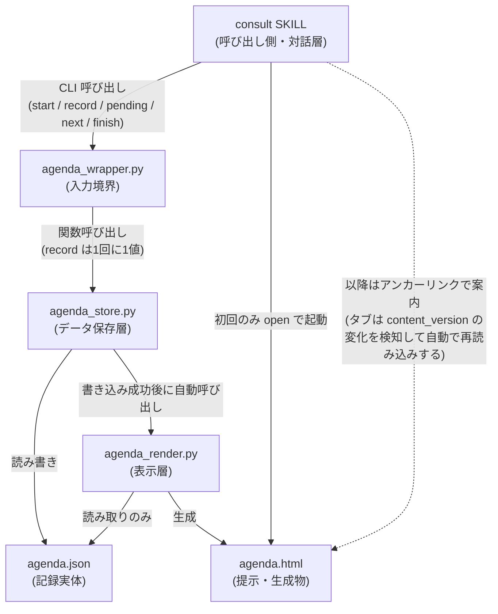
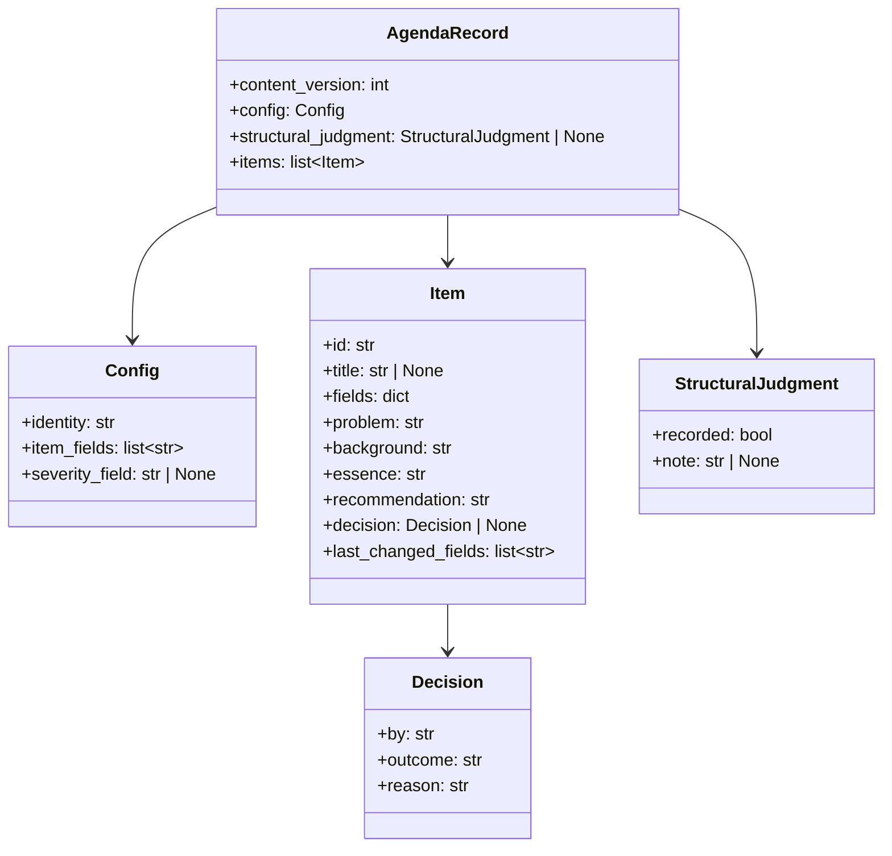
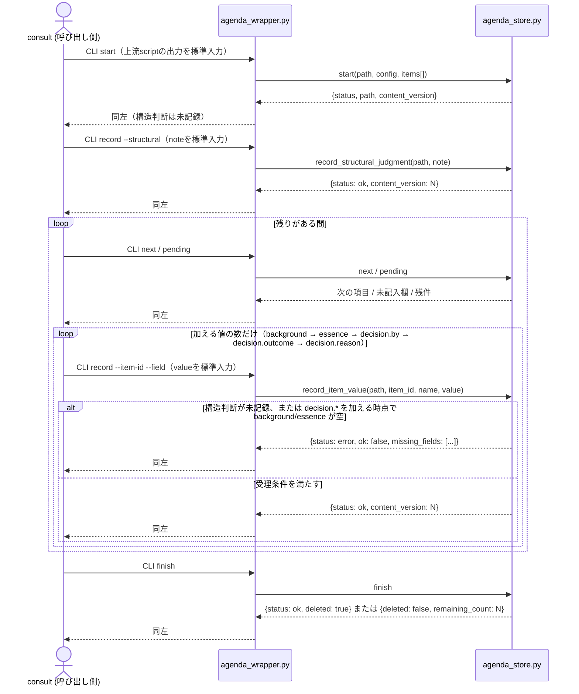

# DES-075 agenda 機構 設計書

## 1. 概要

agenda 機構は、`review`・`consult`（consult:REQ-017）が扱う議題項目（レビュー所見・議論の論点）の**記録・状態遷移判定・表示生成**を担う共通機構である。データ保存層（agenda:REQ-019）と表示層（agenda:REQ-021。表示層の設計は子設計書 DES-077 が持つ）の 2 責務に分かれ、呼び出し側（`consult`。`review` は `consult` を経由する間接呼び出し）は CLI スクリプト経由で構造化データを渡すだけで、状態を自ら保持しない。

保存形式は JSON（標準ライブラリ `json` のみ）を採用する。採用理由・PyYAML を採らない理由は [ADR-076](ADR-076_agenda_storage_format.md) に記す。

既存の `consult` 実装からの移行手順・フェーズ分割は本設計書の範囲外である（時間軸・順序を含む記述は設計書ではなく実装戦略の責務。[DES-027](../../../forge/design/DES-027_plan_strategy_phase_adr.md)）。実装完了後に削除される ephemeral 文書（実装戦略書）を恒久文書である本設計書から参照しない。

## 2. アーキテクチャ概要



- **依存方向は一方向**: `consult` → `agenda_wrapper` → `agenda_store`。`agenda_wrapper` が起点ごとの置き場・`config`・入力の入れ物を解決し、`agenda_store` は `consult` / `review` を知らない（呼び出し側固有の値は FNC-009 に従い引数で受け取る。用途中立性は [consult:REQ-017](../../requirements/REQ-017_consult_skill.md) NFR-002 と対応する）
- **`agenda_store` の書き込み系操作は完了後に `agenda_render` を自動的に呼ぶ**（§8.1）。呼び出し側（consult）が明示的に再描画を要求する経路は持たない。**理由**: 呼び出す/呼び出さないを consult の記憶に委ねると、`update` 後に再描画を呼び忘れた場合、提示（HTML）が記録より古いまま取り残される。これは FNC-003「提示の内容と記録の内容が食い違わないこと」を構造的に壊す経路になるため、生成のトリガーを機構側（store）に持たせ、呼び忘れという人的失敗経路そのものを無くす
- **`agenda_render` は `agenda_store` の内部構造に依存しない**: 両者は `agenda.json` というデータ契約のみを共有する（スキーマは §4 で固定）。`agenda_store` は `agenda_render` を呼び出す（サブプロセスまたは関数呼び出し）が、`agenda_render` は `agenda_store` の内部 API を一切参照せず、独立して直接呼び出すことも妨げない
- **`review` は `consult` を経由する間接呼び出し**であり、agenda を直接呼ばない（[DES-066](../../../forge/design/DES-066_review_body_design.md) §3.11・[consult:REQ-017](../../requirements/REQ-017_consult_skill.md) §1.2 と整合）
- **初回表示は consult が能動的に開く**: `agenda_wrapper.py start` 実行直後、consult が Bash で `open` コマンドを実行し表示物をブラウザで開く。開いたタブは `content_version` の変化を検知して自動で全体を再読み込みする（詳細設計は [DES-077](DES-077_agenda_display_design.md) §2.2・§4）

## 3. モジュール設計

### 3.1 モジュール一覧

| モジュール                                       | 責務                                                                                                                                              | 依存                                                                                                    |
| ------------------------------------------------ | ------------------------------------------------------------------------------------------------------------------------------------------------- | ------------------------------------------------------------------------------------------------------- |
| `plugins/forge/scripts/agenda/agenda_wrapper.py` | AI からの唯一の入力境界。起点から絶対パスと `config` を解決し、標準入力から受けた値を `agenda_store.py` の関数へ渡す                              | 標準ライブラリのみ。`agenda_store.py` を呼び出す                                                        |
| `plugins/forge/scripts/agenda/agenda_store.py`   | 記録の CRUD・状態遷移の可否判定・構造判定の必須化（FNC-012）・変更情報の保持（FNC-013）・書き込み成功後の `agenda_render.py` 自動呼び出し（§8.1） | 標準ライブラリのみ（`json`）。`agenda_schema.py`（§5.1 の状態遷移契約）と `agenda_render.py` を呼び出す |
| `plugins/forge/scripts/agenda/agenda_render.py`  | `agenda.json` から表示を生成する（詳細設計は [DES-077](DES-077_agenda_display_design.md)）                                                        | 標準ライブラリのみ（`html`）。`agenda_store.py` から呼ばれるが、それに依存しない（独立実行も可能）      |
| `plugins/forge/scripts/agenda/agenda_schema.py`  | 状態遷移の受理条件と決着述語の定義（`plan_contract.py` と同型の契約モジュール）                                                                   | なし                                                                                                    |
| `plugins/forge/scripts/agenda/__init__.py`       | パッケージマーカー（`plan/__init__.py` と同型）                                                                                                   | なし                                                                                                    |

いずれも `plugins/forge/scripts/` 直下の既存パターン（`doc_backend/`・`doc_structure/`・`plan/`・`review/`）に倣い、複数 SKILL（`consult`・将来的な他呼び出し側）が共有する置き場に配置する。

### 3.2 クラス図



`fields` は呼び出し側が定義する項目属性をまとめて保持する（§4 の `items[].fields` と対応。agenda 機構はキー名の意味を解釈しない。FNC-009）。**現在 review 起点では `fields` へ入れる属性が無く、`config.item_fields` は空である**——重大度は項目の直下に置かれる（表示層の探索順は DES-077 §3.1a）。**`status` フィールド・独立した状態語彙（`status_vocabulary`/`terminal_statuses`/`active_statuses`）は持たない**——状態は「`decision.by`・`decision.outcome`・`decision.reason` の 3 値がすべて非空か」という構造的事実だけで表現する（§4「状態の表現」参照）。agenda:REQ-019 FNC-009の表は「状態の語彙」を呼び出し側が渡しうる事項の**例**として挙げているが、これは「語彙を持つ場合はハードコードしない」ことを求める記述であり、語彙という概念自体を必須にしていない。呼び出し側（consult）が語彙を渡す必要のない設計は、FNC-009の制約と矛盾しない。

`start`（新規開始）と `record`（判断の記録）は**アクションの種類**による分離である（§6）。`record` はさらに 3 つの形（構造判断を記す／既存項目へ値を 1 つ加える／新規項目を足す）を持ち、新規項目が生まれるのは 3 形目だけである。存在しない `id` を指した呼び出しは拒否する——存在しなければ追加する upsert 意味論は、`id` の打ち間違いを黙って新規項目に変える経路になるため採らない。項目の識別子は agenda が採番するので、呼び出し側が `id` を作る場面自体が無い（§3.2）。

**本図に `agenda_wrapper.py`・`agenda_store.py`・`agenda_render.py`・`agenda_schema.py` を含めない**: いずれも UML クラスとして設計されたコンポーネントではなく、関数群として実装されている（`agenda_wrapper.py` は CLI 入力を対応する store 関数へ振り分け、`agenda_store.py` は `start()` と 3 形の `record` 関数を持ち、[DES-077](DES-077_agenda_display_design.md) の表示層は `agenda_render.py` モジュールの関数群、状態遷移契約は `agenda_schema.py` の `required_fields_for()`/`validate()` 関数）。本図（データ構造のクラス図）が表すのは `agenda.json` のスキーマであり、`AgendaRecord`/`Config`/`Item`/`Decision` はこのデータ構造（実装では入れ子の dict）を表す。各モジュールがこのスキーマを読み書きする関係は §2 のアーキテクチャ図・§3.1 のモジュール一覧が既に示しており、本図で重複して表現しない。

**`content_version` のインクリメント対象**: `agenda_store.py` の `start`・`record`（いずれも `items`・`structural_judgment` という「本文」を変える操作）は書き込み時に `content_version` を 1 増やす。「対話中の項目」を軽量に示す仕組み（旧 `current_item_id`/`set-current`）は廃止した——agenda:REQ-019はこの機構を要求しておらず、人間は生きた対話そのものから「今何を話しているか」を把握でき、別途表示層へ伝える必要がない（設計判断。要件文書自体は変更していない）。

**`Decision` が持つ役割**: `Decision`（`by`・`outcome`・`reason`）は**項目全般に対する利用者（またはAIが代行した場合はその旨）の最終判断記録**（[consult:REQ-017](../../requirements/REQ-017_consult_skill.md) FNC-008）である。`decision` の記入自体は呼び出し側（consult）が FNC-008 の要求（判断を得ないまま埋めない）として担保する対話進行上の責務であり、agenda 機構は記録の形式のみを扱い、判断が実際に下されたかの意味的な妥当性は判定しない（FNC-009「内容の妥当性の判定は呼び出し側が行う」）。

外部から与えられた指摘（レビュー所見等）を検証する主体は `forge:evaluator`（独立した Agent 起動として対象を実際に読み、判定を行う）であり、agenda 機構はこの検証結果を別途構造化データとして保持しない（agenda は record（`background`/`essence`/`decision`）の形式のみを扱う汎用機構であり、review 固有の検証プロセスを機構側のスキーマへ複製しない）。かつて `items[].verification` として検証記録の形式検査のみを機構側へ持たせる設計を検討したが、形式検査は検証が本物かを判定する手段を持たず（evaluator による実質的な検証と機能上重複する一方で表示層からも一切参照されない）、撤回した。

## 4. データ設計（スキーマ）

`agenda.json` のトップレベル構造。`fields`（呼び出し側固有の項目属性。例: `severity`）は agenda 側が意味を解釈しない値としてそのまま格納する（FNC-009）。

**新規フィールドを追加する前に [consult:DES-078](../../design/DES-078_consult_dialogue_flow_design.md) §2.2 の必要性契約を満たすことを確認する**: 対応する情報移動の場面が対話シーケンス（同 §2）に存在しないフィールドは追加しない。

```json
{
  "content_version": 3,
  "config": {
    "identity": "20260819-agenda-design",
    "item_fields": [],
    "severity_field": "severity"
  },
  "structural_judgment": {
    "recorded": true,
    "note": "同型の指摘は無い。個別の食い違いに留まる"
  },
  "items": [
    {
      "id": "01",
      "title": "<短い名前>",
      "fields": {},
      "severity": "critical",
      "problem": "...",
      "background": "...",
      "essence": "...",
      "recommendation": "...",
      "decision": { "by": "human", "outcome": "adopt", "reason": "..." },
      "last_changed_fields": ["decision.reason"]
    }
  ]
}
```

| フィールド                    | 意味                                                                                                                                                                                                                                                                                                                                                                                                                                                                                                                                                                                                                               | 対応する要件            |
| ----------------------------- | ---------------------------------------------------------------------------------------------------------------------------------------------------------------------------------------------------------------------------------------------------------------------------------------------------------------------------------------------------------------------------------------------------------------------------------------------------------------------------------------------------------------------------------------------------------------------------------------------------------------------------------- | ----------------------- |
| `content_version`             | `agenda_store.py` が書き込みごとにインクリメントする整数。比較が確実な整数を使う（タイムスタンプではない）                                                                                                                                                                                                                                                                                                                                                                                                                                                                                                                         | FNC-013                 |
| `config.identity`             | 記録の識別名。`agenda_store.py` が `path` 引数の**親ディレクトリ名**から機械的に導出する（`Path(path).parent.name`）。起点の判定を別途行わない——`path` は呼び出し側 script（`agenda_wrapper.py`）が起点から絶対パスとして解決する値であり、ファイル名は起点を問わず常に`agenda.json`（[DES-077](DES-077_agenda_display_design.md)が前提とする固定名）、親ディレクトリ名だけが起点で変わる（review 起点は`.claude/.temp/review/agenda.json`→識別名`"review"`、consult 直接利用は`.claude/.temp/consult/${CLAUDE_SESSION_ID}/agenda.json`→識別名は`${CLAUDE_SESSION_ID}`の値。§7参照）。呼び出し側は `identity` を組み立てて渡さない | FNC-009・NFR-003        |
| `config.item_fields`          | 呼び出し側が `items[].fields` に含める属性キーの一覧（agenda 側は意味を解釈しない）                                                                                                                                                                                                                                                                                                                                                                                                                                                                                                                                                | FNC-009                 |
| `config.severity_field`       | 重大度を引くキー名。表示層（[DES-077](DES-077_agenda_display_design.md) §3.1a）が重大度バッジとして強調表示する対象キー名。未指定（`null`）ならバッジを表示しない。**キー名を指定するだけで、値の意味には agenda 側は立ち入らない**                                                                                                                                                                                                                                                                                                                                                                                                | FNC-009                 |
| `structural_judgment`         | FNC-012 の判定結果。**個別項目の状態遷移が起きる前に、このフィールドが埋まっていなければならない**。呼び出し側が専用の `record` 呼び出し（§6）で渡すのは `note` の 1 値だけであり、`recorded`（bool）は `agenda_store.py` がその非空値を受理したときに `true` として書き込む。`start` は構造判断を受け取らず、`recorded: false`・`note: null` で記録を開始する。新規項目追加の専用形は、追加後の集合に対する非空の構造判断を 1 値として受け取り、項目追加と一体で記録する（§5.1a）。`recorded_at` のような監査用タイムスタンプは、どのロジック・表示からも参照されない不要フィールドと判断し設計しない                             | FNC-012                 |
| `items[].problem`             | 何が問題か・何を決めたいのか（論点そのもの）。任意の自由記述。`agenda_wrapper.py` が上流 script の出力から `items[]` を組み立てる際、review 起点では結合済み所見の `text` を `problem` にも置く。consult 起点では consult 自身が立てた論点がここへ移る（[consult:DES-078](../../design/DES-078_consult_dialogue_flow_design.md) §2.2）。`record` での追記・修正も可。状態遷移の判定（§5.1）には関与しない                                                                                                                                                                                                                          | agenda:REQ-021 FNC-001  |
| `items[].recommendation`      | 選択肢と帰結を踏まえた推奨 + 確信度。任意の自由記述。決定モードで AI がコンソールへ述べる内容と同じもの（提示と記録の構造を一致させる。[consult:DES-078](../../design/DES-078_consult_dialogue_flow_design.md) §2.2）。`record` の差分パッチで渡す。状態遷移の判定（§5.1）には関与しない                                                                                                                                                                                                                                                                                                                                           | agenda:REQ-021 FNC-003  |
| `items[].decision`            | 項目の最終判断記録（§3.2）。**`by`・`outcome`・`reason` の 3 値がすべて非空であることが「決着済み」を表す**（下記「状態の表現」参照）                                                                                                                                                                                                                                                                                                                                                                                                                                                                                              | consult:REQ-017 FNC-008 |
| `items[].last_changed_fields` | 直前の更新で変わったフィールド名の配列（表示層 FNC-002 が使う）                                                                                                                                                                                                                                                                                                                                                                                                                                                                                                                                                                    | FNC-013                 |

### 状態の表現（独立した状態語彙を持たない）

`status` フィールド・`config.status_vocabulary`/`terminal_statuses`/`active_statuses`は持たない。項目の状態は次の構造的事実だけで表す。

- **`decision`の 3 値（`by`・`outcome`・`reason`）が揃っていない項目**（`decision`キー自体が無い場合・一部だけ埋まっている場合を含む）= 未対応（残件）
- **3 値がすべて非空の項目** = 決着済み。`decision.outcome`が「どう決着したか」（`"adopt"`・`"取り下げ"`・`"対象外"`等、呼び出し側の自由記述）を表す。3 値は 1 つずつ加えられるため、途中の項目は未対応として扱う

`agenda_store.py`は新規項目の初期値として `decision` キー自体を（値 `None` で）持たせる実装を取ってよい——判定は常に上記の値ベースの条件（`decision` が dict で、`by`・`outcome`・`reason` がすべて非空）で行われ、キーの有無そのものを見ないため、初期値としてキーを持たせるか省略するかは実装判断に委ねられる。独立した語彙を持たないことで、`agenda_schema.py`は「`decision`を含む差分パッチかどうか」だけを見て終端相当の検証（§5.1）を課せばよくなり、呼び出し側は語彙を宣言する負担（旧`--status-vocabulary`等）を持たない。

**値の境界は JSON の構文自身が持つ**（NFR-001）。`background` / `essence` 等の自由記述フィールドに区切り文字・改行・記号が含まれても、JSON の文字列リテラルとしてエスケープされるため保存が破損しない。

### 4.1 機密情報の扱い（NFR-005）

`agenda_store.py` / `agenda_render.py` は、渡された値に機密情報が含まれるかどうかを判定しない（FNC-009「内容の妥当性の判定は呼び出し側が行う」と同じ分担）。機密情報の検知・除外・マスキングは呼び出し側（`consult`）の責務であり、`agenda` 機構は呼び出し側が既にマスキング済みの値を受け取る前提で保存・表示する。

- 呼び出し側は、機密情報を検知した項目について、値そのものではなく「どこに」「どの種類の」機密が含まれるかを `background` 等のフィールドへ記述する（[consult:REQ-017](../../requirements/REQ-017_consult_skill.md) NFR-004 と同じ制約を呼び出し側が満たす）
- `agenda_store.py` / `agenda_render.py` はこの制約を検証しない。**検証を課さない理由**は、機構が受け取った文字列が機密情報を含むか否かを判定する手段を原理的に持たないためである（FNC-012 と同じ判定主体の分離: 機構は形式のみを扱い、内容の妥当性は呼び出し側が担う）

## 5. 状態遷移設計

### 5.1 遷移の必要条件（FNC-008）

`agenda_schema.py` の `required_fields_for()`/`validate()` が、必須フィールドを宣言的に定義する（散文の禁止事項に依存しない）。`record` 呼び出しが渡した項目パッチのキー集合（`patch_keys`）を見て条件を決める——状態語彙は存在しないため、遷移先の値そのものを解釈しない。名前はドット区切りの入れ子表記（`decision.by` 等）で渡る。**必須フィールドの非空チェックは、今回のパッチだけではなく、既存項目へパッチを適用した後の項目全体に対して行う**——`background`/`essence`が前回以前の`record`呼び出しで既に保存済みの値であっても、今回`decision.*`を渡すタイミングで満たされていれば足りる。

| 判定条件                                                                | 必須フィールド                                    | 対応する要件 |
| ----------------------------------------------------------------------- | ------------------------------------------------- | ------------ |
| 項目へ値を加える呼び出し（`patch_keys` が空でない。値の種類を問わない） | `structural_judgment.recorded == true` であること | FNC-012      |
| そのうち `decision.*` を含む呼び出し                                    | 上に加えて `background`・`essence` が空でないこと | FNC-008      |

`decision` の 3 値（`by`・`outcome`・`reason`）は 1 つずつ加えるため、`decision.*` を加える呼び出しで残りの値の未記入を不足として返さない。項目へ値を加えない呼び出し（構造判断だけを記す `record`）には、いずれの条件も課さない。

条件を満たさない `record` 呼び出しは拒否し、不足しているフィールド名を含む `{"ok": bool, "missing_fields": list[str]}` を返す。呼び出し側（consult）はこれをそのまま利用者・コンソールへ提示できる。

**決着は `decision` の 3 値がすべて空でないことをもって判定する**（`is_settled()`）。2 値までしか揃っていない項目は未決着である。**残件数はこの述語で未決着と判定される項目の件数として算出する**（FNC-006）。`pending_item_ids()` はその `id` を返し、呼び出し元が `len()` で件数を導出する（§9）。§7 の記録削除条件も同じ述語を参照する。表示層（DES-077 §3.3）も同じ定義に揃える——記録側と提示側で判定が割れると、同じ記録が一方で未決着・他方で決着として現れる。

### 5.1a 新規項目の追加に伴う構造判定の再要求（FNC-012）

`record` は 3 つの形を持ち、新規追加は専用の形（`record --new`）として区別する（§6）。項目の追加は、`structural_judgment.recorded` を「一度立てば立ちっぱなしの単一フラグ」として扱うと整合しない——`start` 時点で下した「集合全体に構造的な誤りがないか」という判断は、その後 `record` で項目が追加され集合そのものが変わった時点で古くなる。

この不整合を解消するため、次の前提条件を課す。**中間状態を永続化しない**（新規追加と再判定を同一の `record` 呼び出し内でアトミックに完結させ、判定が古いまま保存される瞬間を作らない）。

| `record` 呼び出しの種類              | 課す前提条件                                                                                                                                                     |
| ------------------------------------ | ---------------------------------------------------------------------------------------------------------------------------------------------------------------- |
| 新規追加（専用の形）                 | 構造判断の記述（非空文字列）を伴うこと。伴わなければ呼び出し全体を拒否し、項目・判定ともに保存しない                                                             |
| 既存項目の更新（`--item-id` で指す） | 構造判断の記述は不要（既存の判定が現在の集合を表し続けているため）。存在しない `id` を指した場合は拒否する（新規項目が生まれるのは新規追加の呼び出しだけである） |

この判定は §5.1 表の「個別項目への遷移全般」の行と独立に働く——後者は「`decision` を書く瞬間に `recorded == true` であること」を課すのに対し、本節は「新規項目を追加する瞬間に、その追加後の集合について再判定済みであること」を課す。両者を組み合わせることで、`start` 後に追加された項目を含めて構造判定が漏れなく及ぶ。構造判断は項目パッチとは別枠でレコード直下へ記録する（§6.1）。

### 5.2 構造判定（FNC-012）の単位

判定を課す「集合」の単位は、起点ごとに 1 つに固定する（`consult` 起点は現在停止している。§7）（FNC-009 の「呼び出し側から受け取るもの」には含めない。単位そのものは起点の性質から導出される固定値であり、都度変える対象ではない）。

**「呼び出し側」は agenda 機構にとって常に `consult` である**（§2）。`review` は agenda を直接呼ばず、consult を経由する間接利用者であり、下表の `review` はあくまで consult がどの文脈（起点）から呼ばれているかを指す。`review` 起点であっても、agenda を呼ぶのは常に consult 自身であり、`config.identity`・記録の置き場（§7）が起点ごとに異なる値を持つに過ぎない。

| 起点                                        | 集合の単位                                                 | 導出根拠                                                                                                                                          |
| ------------------------------------------- | ---------------------------------------------------------- | ------------------------------------------------------------------------------------------------------------------------------------------------- |
| `review` 起点                               | 1 回のレビュー実行                                         | `review` は同時に 1 つのレビューしか実行しない（§7 の導出と同じ性質）。記録の生存期間（初期化〜終端処理での削除）と一致する範囲を集合の単位とする |
| `consult` 起点（review 経由でない直接利用） | 1 回の consult セッション全体（起動から Phase 5 終了まで） | consult の記録は 1 セッションの開始から終了まで存在する（§7）。記録の生存期間と集合の単位を一致させる                                             |

## 6. 入力インターフェース設計（FNC-005・NFR-006）

AI（consult）から agenda への入力は、**AI が渡し方そのもの（値の並べ方・書式）を組み立てない**ことを原則とする（agenda:REQ-019 FNC-005）。**AI はファイルを書かず、JSON を組み立てない。** AI に対する入力境界は `agenda_wrapper.py` の CLI である。記録を開始する入力は上流 script の出力をそのまま標準入力から受け取り、判断の記録は 1 回に 1 つの値を標準入力から受け取る。入れ物（`config` / `items` / パッチ）を組み立てるのは `agenda_wrapper.py` であり、JSON への書き込みは常に `agenda_store.py` 自身が行う。

`agenda_store.py` の `start` と 3 形の `record` は**関数呼び出し専用**であり CLI を持たない（AI の文章を引数に載せる経路を残さないため）。`agenda_wrapper.py` は AI に `start` / `record` / `pending` / `next` / `finish` の CLI を公開し、受け取った入力をメモリ上で store の関数へ渡す。`agenda_store.py` 自身が CLI を持つのは `pending` / `next` / `finish` の 3 つで、いずれも AI の文章を受け取らない。

```bash
# アジェンダを開始する（wrapper が上流の出力を標準入力から読み、入れ物を組み立てて渡す）
python3 agenda_wrapper.py --origin review start < <結合 script の出力>
#   start(path, config={"item_fields": [], "severity_field": "severity"}, items=[...])
#   - config.identity は agenda_store.py 自身が path の親ディレクトリ名から導出する
#   - 構造判断は start では受け取らず、続く record の 1 回で受ける
#   - item_fields は空である（重大度は項目の直下に置かれ、fields へ入れる属性が無い）

# 判断を記録する（3 形。本文はいずれも標準入力から読む）
python3 agenda_wrapper.py --origin review record --structural < <構造判断の記述>
#   record_structural_judgment(path, note) … 構造判断を記す（非空必須）
python3 agenda_wrapper.py --origin review record --item-id <id> --field <name> < <本文>
#   record_item_value(path, item_id, name, value) … 既存項目へ値を 1 つ加える
python3 agenda_wrapper.py --origin review record --new < <構造判断の記述>
#   record_new_item(path, note) … 新規項目を足し、採番した id を返す（非空の構造判断を伴う）

# 次に扱う項目・残件を数えずに得る（FNC-006）
python3 agenda_wrapper.py --origin review next
python3 agenda_wrapper.py --origin review pending

# 終える（全項目が決着していれば削除、残っていれば残件数を返す）
python3 agenda_wrapper.py --origin review finish
```

**失敗は既定値で補わない（NFR-006）**: 各コマンドはJSONの読み書きに失敗した場合、非ゼロ終了と`{"status": "error", "message": "..."}`を返す。呼び出し側（consult）は成功を仮定して進行しない。

### 6.1 `record`のセマンティクス（1 回 1 値）

`record` は**1 回の呼び出しで 1 つの値だけ**を受け取る（agenda:REQ-019 FNC-005）。値の名前を引数で指定し、本文を標準入力から読む。渡された名前だけを既存項目へマージし、渡されなかったキーは変更しない。

- **値の名前は呼び出し側が自由に決める**。agenda は保存するだけで意味を解釈しない。agenda が読むのは §4 のキーに限る
- **ドット区切りの名前は入れ子として扱う**（`decision.by` を 1 つずつ積んでも先に加えた値が消えない）
- **agenda が自ら書くキー（`id` / `last_changed_fields`）は名前として受け付けない**。入れ子表記（`id.x` 等）でも拒否する。受け付けると識別子が書き換わり §3 の採番と両立しない。`fields` / `decision` そのものも受け付けないが、その配下（`fields.severity` / `decision.by`）は受け付ける
- **構造判断は項目パッチではなくレコード直下（`AgendaRecord.structural_judgment`。§3.2）へ書く**。専用の呼び出しを持ち、項目への値の記録とは経路が分かれる
- **入力の形式を検査しない**（許可キー集合・型検証を持たない）。入れ物を組み立てるのが script である以上、形が壊れるのはバグであり、実行時の検査で受け止める対象ではない。状態遷移の必要条件（§5.1）は形式検査ではないので残る
- `last_changed_fields`（§4）は、渡された名前をそのまま（例: `decision.by`）記録する
- **理由（FNC-004との対応）**: 全フィールドを毎回書き直すフルオブジェクト方式は、一部だけを変える更新でもAIに無関係なフィールドの再送を強いる。これは「記録の維持にAIが使う出力量を減らす」という本機構の存在意義（agenda:REQ-019 §1.1）に反する
- **理由（AIが渡し方を組み立てない）**: 複数の値を 1 回で渡すには値を区切る書式が要り、その書式を AI が組み立てることになる。1 回 1 値にすれば区切りそのものが不要になる

### 6.2 正常系のコマンド・関数呼び出し順序

本節は consult↔`agenda_wrapper.py` 間の CLI 呼び出しと、wrapper↔`agenda_store.py` 間の関数呼び出しを扱う。review・reviewer・evaluator・人間を含む端から端までの全体シーケンス、および `items[]` が起点（review 経由か直接利用か）によってどう組み立てられるかは [consult:DES-078](../../design/DES-078_consult_dialogue_flow_design.md) §2・§3 が持つ。



## 7. 置き場・個数・寿命設計（NFR-003）

導出根拠は起点の性質（同時成立数・識別の要否・内容の引き継ぎ先の有無）から次のように定める。**「呼び出し側」は常に `consult` であり（§2・§5.2）、下表の `review`/`consult` は consult がどの起点から呼ばれているかを指す。**

**`consult` 起点は現在停止しており、動くのは `review` 起点だけである**（consult:REQ-017 §1）。停止であって廃止ではないため、下表の `consult` 起点の行は停止中の経路として残す。

| 起点                                        | 置き場                                                   | 個数                                                                                                   | 識別方法                                                                                                                                                             | 寿命                                                                                                                                   |
| ------------------------------------------- | -------------------------------------------------------- | ------------------------------------------------------------------------------------------------------ | -------------------------------------------------------------------------------------------------------------------------------------------------------------------- | -------------------------------------------------------------------------------------------------------------------------------------- |
| `review` 起点                               | `.claude/.temp/review/agenda.json`（固定パス）           | 同時に 1 つ（review は同時に 1 つのレビューしか実行しない運用前提。`/forge:review` SKILL.md Step 1.1） | 親ディレクトリ名 `review`（固定）。`agenda_store.py` が wrapper から受け取った `path` から機械的に導出する                                                           | 全項目で `decision.by`・`decision.outcome`・`decision.reason` がすべて非空になった時点で削除する（`consult` 起点と同一条件。下記参照） |
| `consult` 起点（review 経由でない直接利用） | `.claude/.temp/consult/${CLAUDE_SESSION_ID}/agenda.json` | 複数が同時に開ける（別主題の議論を並行できる）                                                         | 親ディレクトリ名 `${CLAUDE_SESSION_ID}`（`agenda_store.py` が wrapper から受け取った `path` から機械的に導出する。呼び出し側は `identity` 自体を組み立てて渡さない） | 全項目で `decision.by`・`decision.outcome`・`decision.reason` がすべて非空になった時点で削除する（§5.1・`finish` が判定）              |

**寿命は起点で分岐しない**——両起点とも「全項目で `decision.by`・`decision.outcome`・`decision.reason` がすべて非空になった時点」（`finish` が判定）を条件とする。review 起点についても「レビューの完了時（終端処理 Step 到達時）に無条件で削除する」という規則は**採らない**。理由: [DES-066](../../../forge/design/DES-066_review_body_design.md) §3.11 が定めるとおり、段階的提示は所見を残したまま終端に到達しうる（`halted_with_open_findings`。中断は `confirmed_fix` の件数によらず終端である）。この場合、review 本体は終端処理 Step へ到達済みだが、consult 側の項目には未決着のものが残る。もし「終端処理 Step 到達時」を無条件の削除条件にすると、未判断のまま残った所見がその場で消え、**何件が判断されずに終わったかを利用者へ示す機会が失われる**。記録が残っていれば、次にレビューを起動したとき `/forge:review` SKILL.md Step 1.1 が件数を示したうえで破棄する。したがって、削除条件は起点を問わず 3 値がすべて非空の状態に統一する。

`review` 起点が固定名・箱なしなのは「同時に 1 つしか成立しないなら識別のための名前も列挙のための境界も要らない」（NFR-003 導出例）ため。`consult` 起点が主題名を持ち、寿命を明示的な終了条件で管理するのは「複数が同時に成立するなら名前が主題を持つ」ためである。

## 8. 表示生成設計（agenda:REQ-021）

表示層（`agenda_render.py`、HTML 生成・状態表示・更新方式・初回表示のトリガー）の設計は [DES-077](DES-077_agenda_display_design.md) が持つ。本文書はデータ保存層の責務として、書き込み成功後に表示層の再生成を呼び出す契約（§8.1）のみを扱う。

### 8.1 再描画のトリガー（呼び出し側から独立させる）

**`agenda_store.py` の書き込み系関数（`start`・3 形の `record`）は、JSON への書き込みが成功した直後に `agenda_render.py` を呼び出し、表示を再生成する。** 呼び出し側（consult）が明示的に再描画を要求する CLI コマンド・引数は持たない。

- **理由**: 再描画の要否・タイミングを呼び出し側の記憶に委ねると、`record` の後に再描画を呼び忘れた場合、提示が記録（`agenda.json`）より古いまま取り残される。これは FNC-003「提示の内容と記録の内容が食い違わないこと」が禁じる状態そのものであり、呼び忘れという人的な失敗経路を許すことになる。生成のトリガーを機構側（`agenda_store.py`）に持たせることで、記録が変わった時点で提示も必ず追従する構造にする
- `start`・`record`はいずれも`content_version`を増やし、`agenda.html`と`agenda_state.js`を再生成する（[DES-077](DES-077_agenda_display_design.md) §4。開いているタブは`content_version`の変化を検知して自動で全体を再読み込みする）
- **実装方針**: `agenda_store.py` は書き込み成功後、`agenda_render.py` の描画関数を呼び出す（同一プロセス内の関数呼び出し、または軽量なサブプロセス起動）。読み取り専用コマンド（`next`・`pending`）は記録を変更しないため再描画を伴わない
- **失敗時の扱い（NFR-006 と同じ扱い）**: 再描画に失敗した場合も、JSON への書き込み自体が成功しているなら状態遷移は成立させる。ただし再描画の失敗は隠さず、呼び出し側（consult）へ明示的に伝える（`{"status": "partial", "message": "記録は更新されたが再描画に失敗した: ..."}` 等）。**記録の正しさを表示の失敗で道連れにしない**——記録は単体の真実源であり、表示側の障害で記録の更新自体を巻き戻す理由にはならない

## 9. テスト設計

- **単体テスト対象**:
  - `agenda_store.py`: `structural_judgment` 未記録時は種類を問わず項目への値追加が拒否されること（FNC-012）、`decision.*` の各値は `background` / `essence` が非空なら 1 つずつ受理され、残りの `decision` 値を同じ呼び出しの必須条件にしないこと（§5.1）、JSON 読み書き失敗時に既定値で補わず明示エラーを返すこと（NFR-006）、`next_item_id()` / `pending_item_ids()` が `decision.by`・`decision.outcome`・`decision.reason` の 3 値すべてが非空かという決着述語に基づき次項目・残件（`pending_item_ids()` の呼び出し元が `len()` で導出する）を正しく返すこと（FNC-006）、`start` / 3 形の `record` の書き込み成功後に `agenda_render.py` が自動的に呼ばれること・呼び出しが失敗しても記録側の状態遷移は成立したままであること（§8.1）、各書き込みで `content_version` が 1 増えること、`items[].last_changed_fields` がその呼び出しで加えた 1 つの名前と一致すること（FNC-013）、`finish` が 3 値の揃わない項目を残したまま呼ばれても記録を削除せず、全項目で 3 値が揃った場合に削除すること
  - `agenda_schema.py`: 受理条件の判定（§5.1 の表と決着の述語。入力の形式検査は持たない）
  - `agenda_render.py` の単体テストは [DES-077](DES-077_agenda_display_design.md) §5 が持つ
- **統合テスト対象**: `start`（項目群を渡す） → 構造判断を記す `record` → 項目へ値を 1 つずつ加える `record` × N（背景・本質・決着の 3 値） → `next`/`pending` → `finish`の一連の呼び出しで、記録が意図通り遷移すること。あわせて、各書き込み操作の直後に表示が再生成され、内容が最新の`agenda.json`と一致すること（§8.1・[DES-077](DES-077_agenda_display_design.md)）

## 10. FNC-004 充足の測定方法

agenda:REQ-019 FNC-004（記録の維持に AI が使う出力量・読み取り量が、現行より減っていること）の充足を、次の手順で測定する（[NOTES_open_design_questions.md](NOTES_open_design_questions.md) 旧 TBD-002 の決着）。

- **比較対象**: 現行の `consult` 自前実装（`plugins/forge/skills/consult/SKILL.md` Phase 2・4 が行う、討議ファイルの Write/Edit と `discussion_file_template.md` 書式の手動組み立て）
- **測定単位**: 1 項目を決着させるまでに AI が生成した文字数（コンソール出力 + ファイルへの書き込み内容の合計。ツール呼び出しの引数文字列を含む）
- **計測方法**: 移行前後で同一シナリオ（例: 3 項目のレビュー所見を 1 件ずつ決着させる）を実行し、上記測定単位をシナリオ全体で合計して比較する。移行後の値が移行前を下回ることを確認する

**比較対象の実態**: `update_triage.py` 相当の永続化スクリプトは本リポジトリに実在しないため（§11 参照）、比較対象は `review` 側ではなく `consult` の自前 Markdown 実装である。

## 11. 使用する既存コンポーネント

| コンポーネント          | ファイルパス                                     | 用途                                                  |
| ----------------------- | ------------------------------------------------ | ----------------------------------------------------- |
| 単一責務モジュール構成  | `plugins/forge/scripts/plan/plan_contract.py`    | `agenda_schema.py` のモジュール構成の参考             |
| 状態機械 + CLI パターン | `plugins/forge/scripts/review/parse_findings.py` | `agenda_store.py` の読み取り CLI・JSON 出力設計の参考 |

表示層が使用する既存コンポーネント（討議ファイルテンプレート・HTML エスケープパターン）は [DES-077](DES-077_agenda_display_design.md) §6 が持つ。

再利用しない判断: `update_triage.py` 相当の永続化スクリプトは本リポジトリに実在しない（review 側の仕分けは会話内で完結していたため）。したがって置き換え対象は `consult` の自前 Markdown 実装のみである。
