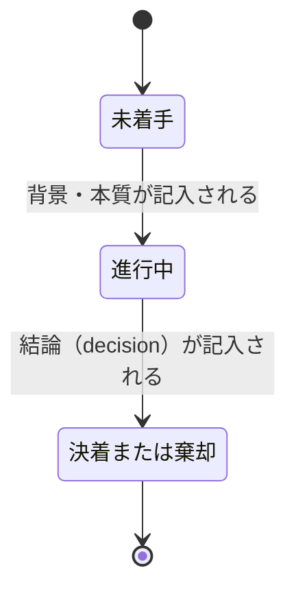

# DES-077 agenda 表示層設計書

## メタデータ

| 項目     | 値                                                               |
| -------- | ---------------------------------------------------------------- |
| 設計ID   | DES-077                                                          |
| 関連要件 | agenda:REQ-021, agenda:REQ-019, consult:REQ-017                  |
| 親設計書 | [DES-075](DES-075_agenda_mechanism_design.md)（agenda 機構全体） |
| 作成日   | 2026-08-22                                                       |

## 1. 概要

agenda:REQ-021 が定める表示層（`agenda_render.py`）の設計。データ保存層・状態遷移・CLI 設計は [DES-075](DES-075_agenda_mechanism_design.md) が持つ。本文書は[DES-075](DES-075_agenda_mechanism_design.md) §8 から分離した（表示層の実装詳細が量的に増え、単一ファイルが肥大化したため。[design_principles_spec.md](../../../../../plugins/forge/docs/design_principles_spec.md)「階層構造ガイドライン」）。

## 2. 生成形式と初回表示

### 2.1 HTML の採用理由

HTML を採用する（識別子からの直接到達（FNC-005）をアンカーリンク `#item-01` で実現できる。[consult:REQ-017](../../requirements/REQ-017_consult_skill.md) §1.2 が示す 3 つの理由——大量情報の整理・番号指定ジャンプ・コンソールノイズからの分離——のうち後 2 つは HTML でのみ満たせる）。

### 2.2 初回表示のトリガー（`open` コマンド）

**consult は `agenda_store.py start` 実行直後、Bash で `open {path}/agenda.html` を実行し、ブラウザで自動的に開く。**

- **理由**: OS 標準の `open`（macOS）1 コマンドで、ローカルファイルをブラウザで開ける。専用の提示手段を追加せずに済み、既存の「サーバー不要・`file://` 前提」の設計方針を変えずに満たせる
- **2 回目以降は `open` を呼ばない**: `record` の度に `open` を呼ぶと、ブラウザによっては重複タブが開く。**自動追従の仕組みは持たない**（§4）——最新の内容を見るには利用者がタブを手動で再読み込みする

## 3. テンプレートの構造

既存 `plugins/forge/skills/consult/assets/discussion_file_template.md` が持つ構造（アジェンダ表 + `## [ID] 項目名` の項目節）を、レンダリング出力の構造としてそのまま引き継ぐ。ただし本テンプレートは**保存形式ではなく表示専用**（agenda:REQ-019 NFR-001 が禁じるのは「保存に使うこと」であり、読み戻さない生成専用の表示は対象外）。

```html
<h1>アジェンダ: {identity}</h1>
<!-- 生成物であることを示す注記（NFR-001） -->
<p class="generated-notice">この提示は agenda_render.py によって {generated_at} に生成された。手編集しても保存されない。</p>

<table id="agenda-summary"><!-- ID/項目/重要度/状態/結果・課題 の一覧。FNC-001 --></table>

<section id="item-01" data-changed="{is_last_changed}"><!-- FNC-005: アンカーリンク到達点 -->
  <h2>
    [01] {title}
    <span class="severity-badge" data-severity="{fields[severity_field]}">{fields[severity_field]}</span><!-- §3.1a。severity_field 未指定なら本要素を出力しない -->
  </h2>
  <p>背景: ...</p>
  <p>本質: ...</p>
  <p>決着: ...</p>
</section>
```

- **FNC-003（提示と記録の一致）**: `agenda_render.py` は `agenda.json` の内容のみから HTML 文字列を組み立てる。AI が HTML を直接書く経路を持たない
- 出力値は `html.escape()` を通す（`json_to_html.py` の既存パターンを踏襲）

### 3.1 状態表示は背景全面ではなく「ガターのドット 1 点」に集約する

変更箇所（FNC-002）の強調は、**カード左側の余白（ガター）に置く小さなドット 1 点に色を集約する**方式で表す（カード全体の背景色 + 左ボーダーによる強調は採らない）。

- **理由**: カード全体を塗ると、severity バッジ（§3.1a）の配色と合わせて色の意味が重なり、画面が騒がしくなる。ガターの小さなドットに絞ることで、状態が「今どうなっているか」を示す信号を 1 箇所に限定できる
- 「対話中」の表示（`.state-dot.current`）は廃止した——agenda:REQ-019はこの機構を要求しておらず、人間は生きた対話そのものから「今何を話しているか」を把握でき、別途表示層へ伝える必要がない（設計判断。要件文書自体は変更していない）

### 3.1a 重大度は絵文字ではなく「パステル配色 + テキストラベル」で表す

重大度（`critical`/`major`/`minor` 等）を絵文字（🔴🟡🟢）だけで表現しない。絵文字は「形が同じ円で色だけが違う」ため、**色以外の手がかりを持たない表現**であり、[WCAG 2.2 達成基準 1.4.1「色の使用」](https://www.w3.org/TR/WCAG22/#use-of-color)が要求する「色を、情報を伝える・操作を示す・応答を促す・視覚要素を区別するための唯一の視覚的手段として使用しない」に反するためである。

- 重大度は**パステル調（低彩度・高明度）の背景色またはボーダー + 短いテキストラベル**の併用で表す。色だけでなく文字でも重大度が判別できるようにする
- きつい原色は避ける（利用者の要望）
- 具体的な配色の値（色コード）は本設計書で確定しない。実装後に生成された `agenda.html` を見ながら利用者と調整する（§3.2 と同じ扱い）

**中立性原則との整合**: agenda 機構は `fields`（呼び出し側固有の項目属性）のキー名・値の意味を解釈しない（FNC-009）。したがって `agenda_render.py` は `severity` というキー名を決め打ちでバッジ表示するのではなく、**`config.severity_field`（[DES-075](DES-075_agenda_mechanism_design.md) §4）が指定するキー名**を参照する。`severity_field` が未指定（`null`）の場合、バッジは表示しない。

```html
<span class="severity-badge" data-severity="{fields[severity_field]}">{fields[severity_field]}</span>
```

- `data-severity` の値（`critical`/`major`/`minor` 等）は呼び出し側が渡した文字列そのままであり、agenda 側はこの値の意味（重大度の順序等）を解釈しない。CSS 側は `data-severity` の値ごとにパステル配色を対応させる（例: `[data-severity="critical"] { ... }`）が、これは表示層が呼び出し側の語彙に依存する数少ない箇所であり、[DES-075](DES-075_agenda_mechanism_design.md) §5.1 の状態遷移契約（`agenda_schema.py`の`required_fields_for()`/`validate()`。語彙の意味に立ち入らない）とは異なるレイヤーの話である

### 3.2 CSS の適用対象（値は実装時に決定）

どのセレクタが何をスタイリングするかは設計事項として以下に固定する。**具体的な値（色コード・px サイズ等）は本設計書で確定しない**——実装後に生成された `agenda.html` を実際に見て、利用者と調整しながら決める（[design_principles_spec.md](../../../../../plugins/forge/docs/design_principles_spec.md)「実行後に人間が体感して決める値」と同じ扱い）。

| セレクタ                                         | 適用対象                                              | 備考                                                                                                                                                          |
| ------------------------------------------------ | ----------------------------------------------------- | ------------------------------------------------------------------------------------------------------------------------------------------------------------- |
| `body`                                           | 全体のベースフォント・行間・背景色                    | 落ち着いたトーンとする（きつい原色は避ける）                                                                                                                  |
| `h1`, `h2`                                       | タイトル階層（アジェンダ全体タイトル / 項目タイトル） | 階層が視覚的に区別できる程度の差（フォントサイズ・太さ）                                                                                                      |
| `.generated-notice`                              | 生成物であることを示す注記（§2.1 NFR-001）            | 本文より控えめな見た目（例: 小さめ・薄い色）にして目立たせすぎない                                                                                            |
| `#agenda-summary`                                | アジェンダ表（ID/項目/重要度/状態/結果・課題）        | 罫線・余白で表として読みやすくする                                                                                                                            |
| `.state-dot.changed`（`section` 内のガター要素） | 変更箇所の状態表示（§3.1）                            | ガターに置く小さいドットのみに色を使う。カード背景・ボーダーは塗らない                                                                                        |
| `.severity-badge[data-severity]`                 | 重大度バッジ（§3.1a）                                 | パステル配色（低彩度・高明度）+ テキストラベルを併用する。色だけに意味を依存させない（[WCAG 2.2 達成基準 1.4.1](https://www.w3.org/TR/WCAG22/#use-of-color)） |
| `section`                                        | 項目ごとの区切り（アンカーリンク到達点）              | 項目間の境界が視認できる程度の区切り（罫線・余白）。状態によらず常にニュートラル                                                                              |

### 3.3 「状態」欄の導出（独立フィールドを持たない）

[DES-075](DES-075_agenda_mechanism_design.md) §4「状態の表現」の通り、項目は独立した状態フィールドを持たない。アジェンダ表（`#agenda-summary`）の「状態」欄、および項目節の表示は、`background`・`essence`・`decision`の記入有無から次の状態遷移で導出する（consult:REQ-017 FNC-002が区別を要求する4状態と対応する）。



| 状態       | 判定条件（`agenda_render.py`が`agenda.json`を読んで導出）     | 表示文言                                                                                                               |
| ---------- | ------------------------------------------------------------- | ---------------------------------------------------------------------------------------------------------------------- |
| 未着手     | `background`・`essence`のいずれも空                           | 「未着手」                                                                                                             |
| 進行中     | `background`・`essence`のいずれかが非空、かつ`decision`が無い | 「進行中」                                                                                                             |
| 決着／棄却 | `decision`が存在する                                          | `decision.outcome`の内容をそのまま表示（「決着」「棄却」等、呼び出し側の自由記述。agenda機構は内容の意味を解釈しない） |

判定は`background`→`essence`→`decision`の順に記入されるという、consultの対話進行（1項目につき2回の判断記録。[DES-075](DES-075_agenda_mechanism_design.md) §6.2）と対応しており、この順序を逆行する記入（`decision`のみ先に記入する等）は`agenda_schema.py`の状態遷移契約（[DES-075](DES-075_agenda_mechanism_design.md) §5.1。`decision`を含む差分パッチは`background`/`essence`の非空を要求する）により拒否される。

## 4. 表示の更新方式

**自動追従の仕組みは持たない**。`agenda_render.py`は書き込み成功時（[DES-075](DES-075_agenda_mechanism_design.md) §8.1のトリガー）に`agenda.html`を`agenda.json`の内容のみから毎回まるごと再生成する、単純な生成専用ファイルである（§3のテンプレートそのもの）。開いているブラウザタブへ変更を伝える手段（ポーリング・部分更新・スクロール位置の保持）は持たない。最新の内容を見るには利用者がタブを手動で再読み込みする。

**理由**: `start`/`record`（agenda機構が持つ唯一の書き込み系コマンド。§2）はいずれも本文を変える操作であり、常に全項目の再表示が要る。「本文を変えずに軽量な状態フラグだけを更新する」という書き込みが存在しないため、全体再読み込みと部分更新を使い分ける仕組み自体が不要である。

## 5. テスト設計

- **単体テスト対象**:
  - `agenda_render.py`: `last_changed_fields`に応じた`data-changed`属性の付与、HTMLエスケープ（機密情報・特殊文字を含む本文の安全な出力）、生成物注記の出力、`config.severity_field`が指定されている場合に`fields[severity_field]`の値がバッジとして出力されること・未指定の場合にバッジ要素自体が出力されないこと（§3.1a）
- **手動検証観点**（ブラウザの実際の挙動に依存し、単体テストで機械的に保証できない事項）:
  - `open` コマンドでの初回表示が実際のブラウザで動作すること

## 6. 使用する既存コンポーネント

| コンポーネント           | ファイルパス                                                      | 用途                                                                                                               |
| ------------------------ | ----------------------------------------------------------------- | ------------------------------------------------------------------------------------------------------------------ |
| 討議ファイルテンプレート | `plugins/forge/skills/consult/assets/discussion_file_template.md` | 表示テンプレートへリライトして転用（移行手順は実装戦略書が持つ。[DES-075](DES-075_agenda_mechanism_design.md) §1） |
| HTML エスケープパターン  | `plugins/anvil/skills/prepare-figma/scripts/json_to_html.py`      | `agenda_render.py` の `html.escape()` 使用箇所の参考                                                               |
