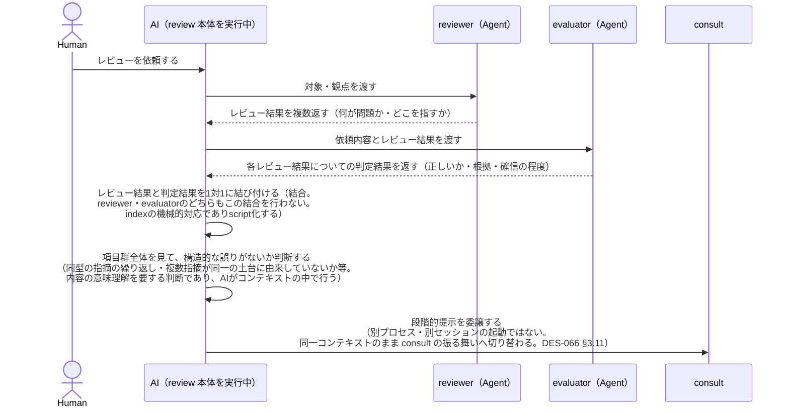
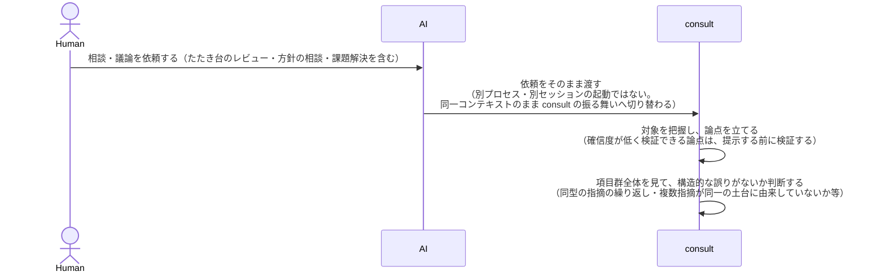
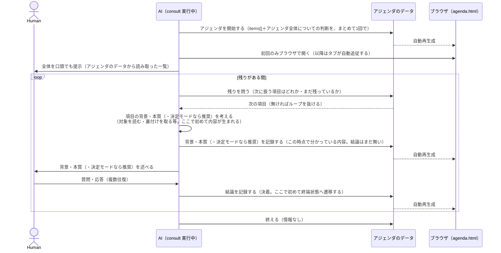

# DES-078 consult 対話進行フロー設計書

## 1. 概要

本設計書は、consult（consult:REQ-017）が担う「対話の進行」の**全体シーケンス**を定める。review 起点（`/forge:review` からの委譲。forge:REQ-013 FNC-1318）と consult 起点（利用者による直接起動）の両方を、単一のシーケンスとして扱う——両者は別のフローではなく、**同一の思考が続く 1 つの AI**が、どちらの起点で始まったかに応じて一部の値（記録の置き場・識別名・論点の出所）だけを変える構造だからである（§3・§4）。本設計書は agenda:REQ-019 / agenda:REQ-021 が定める記録・表示機構（agenda）を前提とし、その CLI 契約は DES-075、表示層は DES-077 が持つ。review 側の設計は DES-066 が持つ。

**本設計書が正本として定める内容は、以下のいずれの既存文書にも欠けていた**:

- review→reviewer→evaluator→結合→consult→agenda→ブラウザという端から端までの全体像（[DES-075](../agenda/design/DES-075_agenda_mechanism_design.md) §6.2 は consult↔agenda_store.py 間の CLI レベルのみを扱い、review・reviewer・evaluator を含まない）
- review 起点で consult に渡される論点が、consult 自身が Phase 1 で立てるのではなく、reviewer 所見と evaluator 判定を結合した**出来合いの配列**であるという、論点の出所の分岐

## 2. 対話シーケンス（正本）

**「AI」は単一のアクターである**（review 本体を実行している思考が、委譲によって consult の振る舞いへ切り替わるだけであり、別プロセス・別セッションの起動ではない。[DES-066](../../forge/design/DES-066_review_body_design.md) §3.11 と整合）。

シーケンスは 2 つの図に分けて示す。**起点（review 起点／consult 起点）によって異なるのは `items[]` と `structural_judgment.note` が揃うまでの前段（図 A-1 / 図 A-2）だけであり、それらが揃った後の本体（図 B）は起点を問わず完全に同一である**。共通部分を 2 つの図へ複製すると、片方だけが更新され食い違う経路を作るため、本体は図 B の 1 箇所にだけ書く。

### 図 A-1: review 起点（reviewer/evaluator との往復）

この区間の「AI」は review 本体（`/forge:review` の SKILL.md）を実行している。consult ではない。最後の矢印が、review 本体から consult への委譲（切り替え）を表す。以降は図 B（共通本体）へ続く。

### 図 A-2: consult 起点（review を経由しない直接利用。議論・課題解決を問わない）

この時点で `items[]`（consult 自身が立てた論点）と `structural_judgment.note` が揃う。reviewer・evaluator は登場しない——review 起点でないかぎり、この 2 者は存在自体しない。図 A-1 との違いは、対象の把握・論点の抽出・構造判断が「review 本体」の文脈で行われるか（図 A-1）、それとも consult 自身の文脈（Phase 1 相当）で行われるか（本図）だけであり、いずれも consult 自身から見れば区別する情報を持たない。以降は図 B（共通本体）へ続く。

### 図 B: 共通本体（起点を問わず同一）

**この図から判明する構造**: 情報を実際に渡す場面は「アジェンダを開始する」（項目群の配列＋アジェンダ全体についての判断）と「項目への判断を記録する」（根拠・結論。分かった時点でその都度、項目ごとに 2 回）の 2 種類だけである。「残りを問う」「終える」は情報を持たない。「今どの項目を話しているか」はどのアクションにも現れない（`current_item_id` に相当する概念は存在しない。[DES-075](../agenda/design/DES-075_agenda_mechanism_design.md) §3.2 の削除判断と整合）。

### 2.1 `items[]` と `structural_judgment` の結合契約

`start` は `items[]` と `structural_judgment.note` を**単一の呼び出しで同時に受け取る**（分割不可）。`structural_judgment.note` が対象とする範囲は、同じ呼び出しで渡された `items[]` の全体である。一部の項目だけを見た判断を `structural_judgment.note` に記録することはできない。

`record` が新規項目を追加する場合（`--item-id` が既存項目を指さない場合）も、同じ制約を持つ。新規追加後の項目群全体を対象にした `structural_judgment.note` を、追加操作と同じ `record` 呼び出しに同時に含めなければならない（[DES-075](../agenda/design/DES-075_agenda_mechanism_design.md) §5.1a）。項目が追加された状態で `structural_judgment.recorded` が過去の値のまま残ることは許されない。

項目を 1 件ずつ逐次追加する CLI（旧設計の `init`→`record-structural-judgment`→`register`×N）は、この結合契約を満たせない——`structural_judgment.note` の対象範囲が、逐次追加の各時点で確定していないためである。5 コマンド CLI（[DES-075](../agenda/design/DES-075_agenda_mechanism_design.md) §6）はこの契約を満たすように設計されている。

### 2.2 スキーマフィールドの必要性契約

本図（§2 の図 A-1・図 A-2・図 B）は、consult が扱う情報の移動をすべて列挙したものである。情報が移動する場面は次の 3 つに限られる。

1. `start`: `items[]`（各項目の `id`・`title`・`fields`・`problem`。`problem` は「何が問題か・何を決めたいのか」という論点そのもので、review 起点では結合済み所見の内容、consult 起点では consult 自身が立てた論点がここへ移る）と `structural_judgment.note`
2. `record`（背景・本質）: `background`・`essence`・`recommendation`（推奨。決定モードで AI がコンソールへ述べる内容と同じもの。任意）
3. `record`（決着）: `decision.by`・`decision.outcome`・`decision.reason`

**[DES-075](../agenda/design/DES-075_agenda_mechanism_design.md) §4 のスキーマが持つフィールドは、上記 3 つのいずれかに対応することを要件とする。** 対応するメッセージを本図に持たないフィールドをスキーマへ追加してはならない。スキーマへフィールドを追加する変更は、まず本図を更新し、対応するメッセージ（情報が移動する新しい場面）を追加することから始める。

| 対応するメッセージが無かったため削除されたフィールド                                                   | 出典                                                                            |
| ------------------------------------------------------------------------------------------------------ | ------------------------------------------------------------------------------- |
| `owner`・`created_at`                                                                                  | [DES-075](../agenda/design/DES-075_agenda_mechanism_design.md) §3.2             |
| `current_item_id`（`set-current`）                                                                     | 同上                                                                            |
| 状態語彙（`status_vocabulary`/`terminal_statuses`/`active_statuses`）                                  | [DES-075](../agenda/design/DES-075_agenda_mechanism_design.md) §4「状態の表現」 |
| `config.identity`（呼び出し側が組み立てて渡す旧方式。`--path` の親ディレクトリ名からの自動導出に置換） | [DES-075](../agenda/design/DES-075_agenda_mechanism_design.md) §7               |
| `structural_judgment.recorded_at`                                                                      | 本文書起草の契機となった TASK-008 レビュー                                      |

`recommendation` はかつてこの表に載っていた（旧設計で削除）。その後、表示物に「問題そのものが書かれていないのに推奨だけ表示しても判断できない」という利用者所見を受けて、`problem` とともに図 B のメッセージへ載せたうえで復活させた（提示（コンソールの 問題 → 背景 → 本質 → 推奨 → 決着）と記録の構造を一致させる。agenda:REQ-021 FNC-003 の思想と整合）。

## 3. 起点による分岐（review 起点 / consult 起点）

**agenda 機構を呼び出す実行主体は常に consult ただ 1 つである**（[DES-075](../agenda/design/DES-075_agenda_mechanism_design.md) §7）。review が agenda を直接呼ぶことはない。review と consult は対等な 2 つの起点ではなく、「review 起点」「consult 起点」という語は、**consult 自身が今どちらの文脈で動いているか**を指すラベルにすぎない——review は継承型 SKILL の委譲を通じて consult の振る舞いへ切り替わる、その手前に立つ呼び出し元の 1 つでしかない（§2）。

図 A-1（review 起点）と図 A-2（consult 起点）のどちらを辿るかは **review からの委譲であるかどうか**の1点だけで決まり、扱う話題の種類（一般的な議論・課題解決・たたき台のレビュー等）では変わらない——これらはいずれも review を経由しない側（consult 起点）に属する。**分岐は「AI が今どちらの起点で動いているか」で決まる。ファイル名・パスの違いは分岐の結果であって、分岐の原因ではない**——パスを変えれば区別できるようになるのではなく、区別できているからこそ違うパスを選べる。この判定に新しい仕組み（外部から渡される構造化フラグ等）は要らない——review→consult は同一会話内での継承型 SKILL の切り替えであり、AI は直前に reviewer/evaluator と往復したかどうかを、共有されたコンテキストから既に知っている（§3.1）。

| 項目                                            | review 起点（図 A-1）                                                                                                                                      | consult 起点（図 A-2。議論・課題解決を問わない）                    |
| ----------------------------------------------- | ---------------------------------------------------------------------------------------------------------------------------------------------------------- | ------------------------------------------------------------------- |
| 「アジェンダを開始する」に渡す `items[]` の出所 | reviewer 所見と evaluator 判定を結合した配列（図 A-1「AI->>AI: 結合」の結果）。consult 自身は論点を立てない                                                | consult 自身が Phase 1 相当（対象の把握・論点の抽出・検証）で立てる |
| 記録の置き場・識別名                            | 固定パス・固定識別名（[DES-075](../agenda/design/DES-075_agenda_mechanism_design.md) §7「review 起点」の行）                                               | `${CLAUDE_SESSION_ID}` ベース（同 §7「consult 起点」の行）          |
| 構造的判断（`structural_judgment.note`）の材料  | 「同型の指摘の繰り返し・複数指摘が同一の土台に由来していないか」（reviewer 所見群を見て判断する）                                                          | consult 自身が立てた論点群を見て判断する                            |
| 重要度（`config.severity_field` 等）            | reviewer/evaluator が確認・訂正した重要度をそのまま `item_fields`/`severity_field` へ反映する（consult:REQ-017 FNC-002「重要度はレビュー所見と同じ語彙」） | 用いない（`item_fields: []`, `severity_field: null`）               |

**この表がどの要件・設計から来ているかを明示する**: 「記録の置き場・識別名」の行は [DES-075](../agenda/design/DES-075_agenda_mechanism_design.md) §7 が既に定めていた内容であり、本設計書はそれを覆さない。本設計書が新たに定めるのは、それ以外の 3 行（`items[]` の出所・構造的判断の材料・重要度の反映）である——これらはどの既存文書にも書かれていなかった。

### 3.1 consult SKILL.md が起点を判定する方法

consult は継承型 SKILL であり、review 本体を実行しているのと同じ会話が consult の振る舞いへ切り替わるだけである（[DES-066](../../forge/design/DES-066_review_body_design.md) §3.11）。したがって「起点の判定」は、consult が外部から受け取る構造化されたフラグではなく、**その時点で AI 自身が置かれている文脈**（直前に reviewer/evaluator との往復を行い、結合済みの所見配列を持っているか、それとも利用者から直接依頼を受けて論点をまだ持っていないか）によって、AI 自身が判断する。

consult SKILL.md の Phase 0・Phase 1・Phase 2.2 は、この判定を明示的な手順として持たなければならない——「review から委譲された文脈であれば、Phase 1（論点の抽出）を経由せず、既に結合済みの所見配列をそのまま `items[]` として用い、記録の置き場は固定パス・固定識別名（[DES-075](../agenda/design/DES-075_agenda_mechanism_design.md) §7）を用いる」という分岐を欠くと、review 委譲時にも consult 起点と同じ経路（セッションベースのパス・自前の論点抽出）を辿ってしまう（本設計書起草の契機となった実装上の欠陥）。

## 4. reviewer 所見と evaluator 判定の結合

§2 の「AI->>AI: 結合」に対応する。この結合はレビュー本体（review）の責務であり、consult の責務ではない——結合済みの配列が consult（の振る舞いへ切り替わった後の AI）に渡された時点で、consult から見た`items[]`の出所として扱われるに過ぎない。

結合の詳細設計（配置先スクリプト・検証規則・変換規則）は [DES-066](../../forge/design/DES-066_review_body_design.md) §3.10a が持つ。本設計書は、結合された配列が consult の `items[]` としてそのまま使える形（[DES-075](../agenda/design/DES-075_agenda_mechanism_design.md) §4 のスキーマ）であることを前提とする。

## 5. 未確定事項

| ID      | 内容                                                                                                                                                                      | 状態                                                                                |
| ------- | ------------------------------------------------------------------------------------------------------------------------------------------------------------------------- | ----------------------------------------------------------------------------------- |
| TBD-001 | `.claude/.temp/consult/` 配下の既存記録走査を、セッション単位に限定するか、全ディレクトリを対象に拡張するか（他セッションの進行中の記録への割り込みリスクとの trade-off） | 未確定。TASK-011 実装時の判断（走査拡張）を暫定採用しているが、正式な決着は別途行う |
