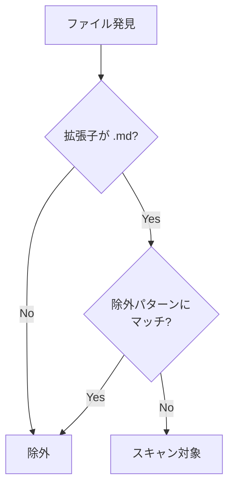

# DES-004: ドキュメントモデル設計書

## 概要

本設計書では、Doc Advisor が管理するドキュメントモデルの全体構造、設定項目、およびスキャン対象の仕様を定義する。

## 関連要件

- REQ-001 FR-01: ドキュメント管理
- REQ-001 NFR-02: 設定可能性

---

## ドキュメントカテゴリ

Doc Advisor は2つのカテゴリでドキュメントを管理する。

### カテゴリ一覧

| カテゴリ | 用途                                                                     | index ファイル                                   |
| -------- | ------------------------------------------------------------------------ | ---------------------------------------------- |
| `rule`   | 開発ドキュメント（コーディング規約、アーキテクチャルール、ワークフロー） | `.claude/doc-advisor/indexes/rules/rules_index.yaml` |
| `spec`   | プロジェクト仕様書（要件定義、設計書、画面仕様、API仕様等）              | `.claude/doc-advisor/indexes/specs/specs_index.yaml` |

### 処理の共通性

両カテゴリは**同一の処理ロジック**で動作する:

1. 設定されたルートディレクトリ群配下の `**/*.md` をスキャン
2. 除外パターンでフィルタリング
3. 並列処理でメタデータ抽出
4. カテゴリごとの単一 index YAML に出力

違いは index ファイルの出力先と、検索スキル（`/query-rules` / `/query-specs`）のみ。

---

## ディレクトリ構造

### ルートディレクトリ

各カテゴリは**1つ以上のルートディレクトリ**を持つ。ルートディレクトリ配下のサブディレクトリ構造は自由。

`root_dirs` の設定方法（`.doc_structure.yaml` に記述。ランタイムで直接参照: FR-08）:

- `.doc_structure.yaml` がある場合: そのまま使用
- `.doc_structure.yaml` がない場合: `/forge:setup-doc-structure` スキルで AI が分類し `.doc_structure.yaml` を作成

```yaml
rules:
  root_dirs:
    - rules/

specs:
  root_dirs:
    - specs/
    # 複数ディレクトリの例:
    # - screen_design/
    # - api_specs/
```

### ディレクトリ構造の例

```
# シンプルな構成（単一ルートディレクトリ）
rules/
├── coding_standards.md
├── architecture/
│   └── principles.md
└── workflow/
    └── review_process.md

specs/
├── requirements/
│   ├── user_auth.md
│   └── billing.md
├── design/
│   ├── login_screen.md
│   └── api_design.md
└── overview.md
```

```
# 複数ルートディレクトリの構成
specs/                    # root_dirs[0]
├── requirements.md
└── auth/
    └── oauth_spec.md

screen_design/            # root_dirs[1]
├── login.md
└── dashboard.md

api_specs/                # root_dirs[2]
└── rest_api.md
```

### index 関連ファイル

各カテゴリの index 関連ファイルは `.claude/doc-advisor/indexes/` 配下に生成される。

```
.claude/doc-advisor/indexes/
├── rules/
│   ├── rules_index.yaml           # 生成される index
│   ├── .index_checksums.yaml      # 変更検出用チェックサム
│   └── .index_work/               # 作業ディレクトリ（一時）
└── specs/
    ├── specs_index.yaml
    ├── .index_checksums.yaml
    └── .index_work/
```

---

## スキャン対象と除外ルール

### スキャンパターン

両カテゴリ共通: 各ルートディレクトリ配下の `**/*.md`

```
ルートディレクトリ/**/*.md
```

### スキャン対象判定フロー



### 除外パターンの適用

除外パターンは**ディレクトリパスのみ**に対して判定する。`/` を含むパターンは**パス部分一致**、`/` を含まないパターンは**ディレクトリ名の完全一致**として扱う（ファイル名は対象外）。

```python
def should_exclude(filepath, exclude_patterns, root_dir):
    rel_path = str(filepath.relative_to(root_dir))
    path_parts = rel_path.split('/')
    dir_parts = path_parts[:-1]  # ファイル名を除く
    dir_path = '/'.join(dir_parts)

    for pattern in exclude_patterns:
        normalized = pattern.strip('/')
        if '/' in normalized:
            if normalized in dir_path:
                return True
        else:
            if normalized in dir_parts:
                return True
    return False
```

### 除外例

| パス                          | 除外パターン | 結果                                                             |
| ----------------------------- | ------------ | ---------------------------------------------------------------- |
| `specs/plan/roadmap.md`       | `plan`       | 除外                                                             |
| `specs/archive/old_spec.md`   | `archive`    | 除外                                                             |
| `specs/design/info/readme.md` | `/info/`     | 除外                                                             |
| `specs/requirements/info.md`  | `/info/`     | **対象**（`info.md` はファイル名であり `/info/` にマッチしない） |

> **Note**: `.index_work`, `rules_index.yaml`, `specs_index.yaml`, `.index_checksums.yaml` はシステム除外として常に無視される。

---

## 設定ファイル仕様

### 設定ファイル

| パス                              | 用途             |
| --------------------------------- | ---------------- |
| `.doc_structure.yaml`（プロジェクトルート） | 文書構造設定（root_dirs, doc_types_map, patterns） |

> **Note**: Doc Advisor 内部設定（checksums_file, output, common）は `index_utils.py` の `_get_default_config()` にコードデフォルトとして定義。`load_config()` が `.doc_structure.yaml` とマージして返す。

### .doc_structure.yaml スキーマ

#### バージョン

ファイル先頭に `# doc_structure_version: 3.0` コメントを記述する。
これは forge プラグインと Doc Advisor で共通のバージョニング規約。

#### 構造

```yaml
# doc_structure_version: 3.0

{category}:           # "rules" または "specs"
  root_dirs:          # [必須] スキャン対象ディレクトリ群
    - {path}/
  doc_types_map:      # [必須] パス → doc_type の対応
    {path}/: {doc_type}
  patterns:           # [任意] スキャンパターン
    target_glob: "**/*.md"  # デフォルト: "**/*.md"
    exclude: []             # 除外パターン（ディレクトリ名またはパス部分文字列）
```

#### フィールド定義

| フィールド | 型 | 必須 | デフォルト | 説明 |
|---|---|---|---|---|
| `root_dirs` | string[] | 必須 | — | スキャン対象ディレクトリ。glob パターン対応（例: `specs/*/requirements/`） |
| `doc_types_map` | object | 必須 | — | パス → doc_type の対応。キーは root_dirs のパスまたはそのサブパス |
| `patterns.target_glob` | string | 任意 | `"**/*.md"` | スキャン対象ファイルのグロブパターン |
| `patterns.exclude` | string[] | 任意 | `[]` | 除外パターン。`/` を含む場合はパス部分文字列、含まない場合はディレクトリ名として完全一致 |

#### doc_type 一覧

| category | doc_type | 意味 |
|---|---|---|
| rules | rule | 開発プロセスのルール・規約・手順 |
| specs | requirement | ゴール定義（機能要件、非機能要件） |
| specs | design | 技術的構造（アーキテクチャ、DB スキーマ） |
| specs | plan | 作業計画（タスク分割、マイルストーン） |
| specs | api | 外部インターフェース契約 |
| specs | reference | 補助文書（調査メモ、用語集） |
| specs | spec | デフォルト（上記に該当しない仕様文書） |

> **Note**: 上記は組み込みタイプである。`doc_types_map` に任意の識別子文字列を指定することでカスタムタイプも使用可能（例: `adr`）。
>
> **カスタムタイプの仕様**:
> - `doc_type` は非空文字列としてのみ検証し、固定リストへの照合は行わない
> - 検証ポリシー: フォーマット制約は設けない。タイポ検出はプロジェクトオーナーの責任とする
> - 下流への影響: 検索スキル（`/query-rules`, `/query-specs`）は index 全件を AI が解釈する方式であり、カスタム doc_type の追加による動作影響はない

#### ランタイム設定のマージ

`index_utils.py` の `load_config()` は以下の順序で設定を構築する:

1. `_get_default_config()` でコードデフォルトを取得（checksums_file, output, common + フォールバック用 root_dirs）
2. `.doc_structure.yaml` を読み込み・パース
3. `_deep_merge(defaults, doc_structure)` でマージ（`.doc_structure.yaml` の値が優先）
4. 後方互換: `root_dir`（単数）→ `root_dirs`（複数）の変換

リスト値（root_dirs, exclude 等）はマージではなく上書きされる。

### 設定項目一覧

#### rules セクション

| 項目                    | 型     | 設定ソース / デフォルト                                            | 説明                                 |
| ----------------------- | ------ | ------------------------------------------------------------------ | ------------------------------------ |
| `root_dirs`             | array  | `.doc_structure.yaml`（`/forge:setup-doc-structure` で設定）                    | ルートディレクトリ群                 |
| `doc_types_map`         | object | `.doc_structure.yaml`（`/forge:setup-doc-structure` で設定）                    | パス → doc_type の対応。FR-01-6 参照 |
| `patterns.target_glob`  | string | `.doc_structure.yaml` / デフォルト: `**/*.md`                      | スキャン対象パターン                 |
| `patterns.exclude`      | array  | `.doc_structure.yaml` / デフォルト: `[]`                           | 除外パターン（ユーザー定義）         |
| `checksums_file`        | string | コードデフォルト（`index_utils.py`）: `.claude/doc-advisor/indexes/rules/.index_checksums.yaml` | チェックサムファイルパス             |
| `output.header_comment` | string | コードデフォルト（`index_utils.py`）                                 | index ヘッダーコメント                 |
| `output.metadata_name`  | string | コードデフォルト（`index_utils.py`）                                 | メタデータ名                         |

#### specs セクション

| 項目                    | 型     | 設定ソース / デフォルト                                            | 説明                                 |
| ----------------------- | ------ | ------------------------------------------------------------------ | ------------------------------------ |
| `root_dirs`             | array  | `.doc_structure.yaml`（`/forge:setup-doc-structure` で設定）                    | ルートディレクトリ群                 |
| `doc_types_map`         | object | `.doc_structure.yaml`（`/forge:setup-doc-structure` で設定）                    | パス → doc_type の対応。FR-01-6 参照 |
| `patterns.target_glob`  | string | `.doc_structure.yaml` / デフォルト: `**/*.md`                      | スキャン対象パターン                 |
| `patterns.exclude`      | array  | `.doc_structure.yaml` / デフォルト: `[]`                           | 除外パターン（ユーザー定義）         |
| `checksums_file`        | string | コードデフォルト（`index_utils.py`）: `.claude/doc-advisor/indexes/specs/.index_checksums.yaml` | チェックサムファイルパス             |
| `output.header_comment` | string | コードデフォルト（`index_utils.py`）                                 | index ヘッダーコメント                 |
| `output.metadata_name`  | string | コードデフォルト（`index_utils.py`）                                 | メタデータ名                         |

> **Note**: rules と specs の設定項目は完全に同一構造。

#### common セクション

| 項目                          | 型      | デフォルト | 説明                 |
| ----------------------------- | ------- | ---------- | -------------------- |
| `parallel.max_workers`        | integer | `5`        | 最大並列処理数       |
| `parallel.fallback_to_serial` | boolean | `true`     | 並列失敗時に直列実行 |

#### 後方互換性

旧設定の `root_dir`（単数形、文字列）は `root_dirs: [値]` として処理する。

### 完全な設定例

```yaml
# .doc_structure.yaml (文書構造) + コードデフォルト (Doc Advisor 内部設定) のマージ結果

rules:
  root_dirs:
    - rules/
  checksums_file: .claude/doc-advisor/indexes/rules/.index_checksums.yaml  # コードデフォルト

  patterns:
    target_glob: "**/*.md"
    exclude:
  # - archive
  # - draft

  output:
    header_comment: "Development documentation search index for query-rules skill"
    metadata_name: "Development Document Search Index"

specs:
  root_dirs:
    - specs/
    # - screen_design/
    # - api_specs/
  checksums_file: .claude/doc-advisor/indexes/specs/.index_checksums.yaml  # コードデフォルト

  patterns:
    target_glob: "**/*.md"
    exclude:
      - plan # Read in full during work, no search needed
  # - archive
  # - /info/

  output:
    header_comment: "Project specification document search index for query-specs skill"
    metadata_name: "Project Specification Document Search Index"

common:
  parallel:
    max_workers: 5
    fallback_to_serial: true
```

---

## 生成ファイル

### index ファイル

| カテゴリ | ファイル                                       | 内容                           |
| -------- | ---------------------------------------------- | ------------------------------ |
| rule     | `.claude/doc-advisor/indexes/rules/rules_index.yaml` | 開発ドキュメントのインデックス |
| spec     | `.claude/doc-advisor/indexes/specs/specs_index.yaml` | 仕様書のインデックス           |

### チェックサムファイル

| カテゴリ | ファイル                                            | 用途               |
| -------- | --------------------------------------------------- | ------------------ |
| rule     | `.claude/doc-advisor/indexes/rules/.index_checksums.yaml` | 差分検出用ハッシュ |
| spec     | `.claude/doc-advisor/indexes/specs/.index_checksums.yaml` | 差分検出用ハッシュ |

### 作業ディレクトリ

| カテゴリ | ディレクトリ                               | 用途                  |
| -------- | ------------------------------------------ | --------------------- |
| rule     | `.claude/doc-advisor/indexes/rules/.index_work/` | 処理中の pending YAML |
| spec     | `.claude/doc-advisor/indexes/specs/.index_work/` | 処理中の pending YAML |

---

## 関連設計書

| 設計書  | 内容                                  |
| ------- | ------------------------------------- |
| DES-006 | セマンティック検索設計                |
