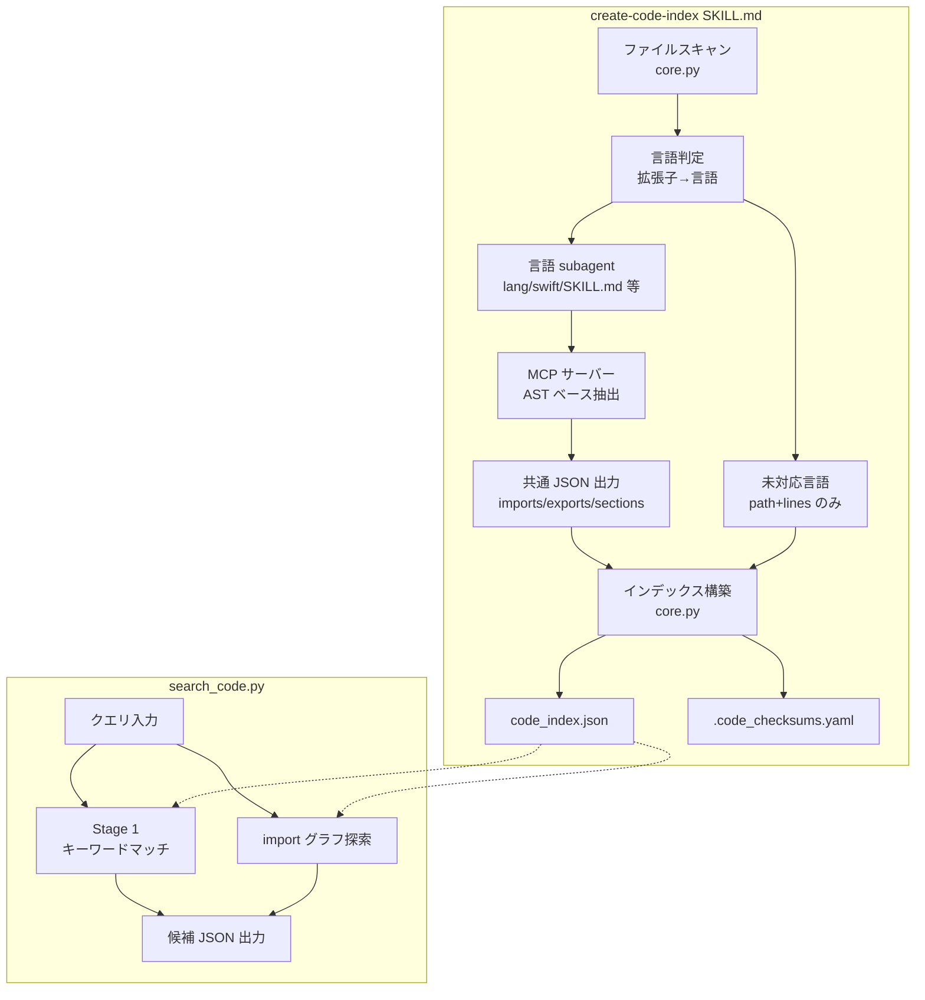
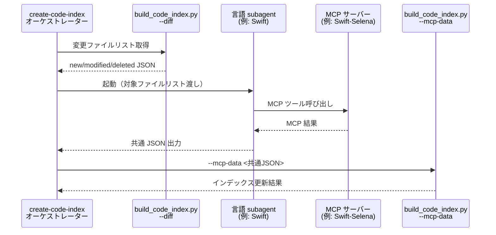
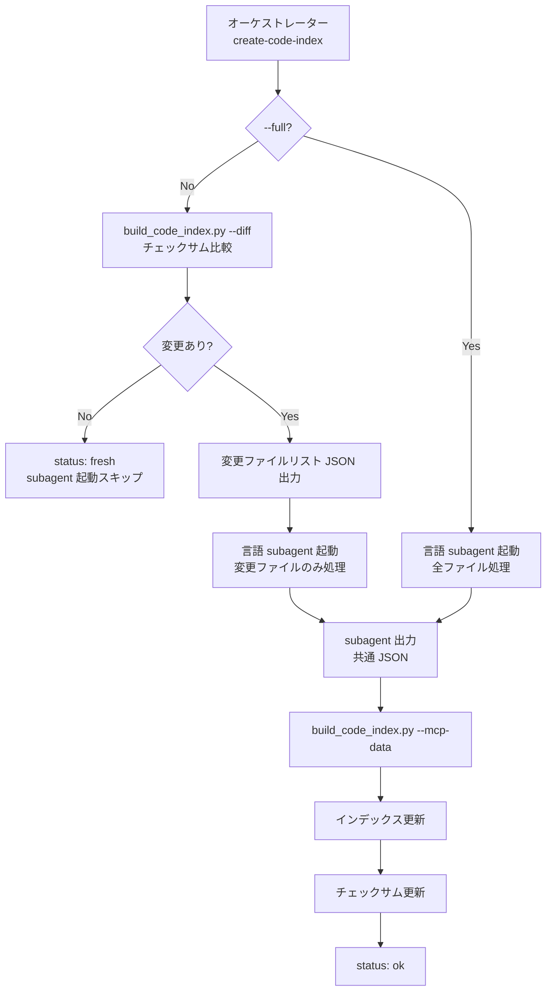

# DES-007: コードインデックス設計書

## メタデータ

| 項目     | 値 |
|----------|-----|
| 設計ID   | DES-007 |
| 関連要件 | REQ-004 |
| 作成日   | 2026-04-02 |

## 1. 概要

ソースコードファイルの構造情報（import、export、ドキュメントコメント等）を機械的に抽出し、永続的なコードインデックスを構築する。2段階検索（機械的絞り込み + AI 推論）により、プロジェクト規模に関わらず高速かつ高精度なコード検索を実現する。

言語固有の抽出ロジックを subagent（SKILL.md ベース）として分離し、初期実装は Swift に特化する。メタデータ抽出は Swift-Selena MCP（AST ベース）を必須前提とし、高精度な構造情報を取得する。

## 2. アーキテクチャ概要

### 責務の分担

| レイヤー | 責務 | 担当モジュール |
|----------|------|---------------|
| スキャン | ファイル検出・除外・チェックサム比較 | `core.py` |
| 抽出 | 言語固有のメタデータ抽出（MCP サーバー経由） | 言語 subagent（例: `lang/swift/SKILL.md`） |
| グラフ | import 依存関係の構築・探索 | `graph.py` |
| 検索 | キーワードマッチ・影響範囲検索 | `search_code.py` |
| 永続化 | インデックス JSON・チェックサム管理 | `core.py` |
| AI 推論 | Stage 2 の候補評価 | SKILL.md（query-code スキル） |

### 設計判断: core.py への責務集約

core.py にスキャン・永続化の責務を集約している。これはファイル数が少ない初期段階では、モジュール分離のオーバーヘッド（import 管理・インターフェース定義）が実装コストに見合わないためである。ただし、import 依存関係グラフの構築・探索ロジックは `graph.py`（`ImportGraph` クラス）として分離済みである（§3.1 参照）。

### コンポーネント図



## 3. モジュール設計

### 3.1 モジュール一覧

| モジュール | ファイルパス | 責務 | 依存 |
|-----------|-------------|------|------|
| core | `scripts/code_index/core.py` | スキャン・差分検出・インデックス構築 | `toc_utils.py`, `graph.py` |
| graph | `scripts/code_index/graph.py` | import 依存関係グラフの構築・探索（`ImportGraph` クラス） | なし |
| build_code_index | `scripts/code_index/build_code_index.py` | CLI エントリポイント（インデックス構築）。`--mcp-data` で subagent が出力した共通 JSON を受け取りインデックスを構築する | core |
| search_code | `scripts/code_index/search_code.py` | CLI エントリポイント（キーワード検索・影響範囲検索） | core |

#### 言語 subagent（SKILL.md ベース）

| subagent | ファイルパス | 責務 |
|----------|-------------|------|
| Swift subagent | `skills/create-code-index/lang/swift/SKILL.md` | Swift-Selena MCP を呼び出し、結果を共通 JSON フォーマットに変換して出力 |

### 3.2 使用する既存コンポーネント

| コンポーネント | ファイルパス | 用途 |
|---------------|-------------|------|
| `get_project_root()` | `toc_utils.py` | プロジェクトルートの検出 |
| `normalize_path()` | `toc_utils.py` | macOS NFD → NFC パス正規化 |
| `calculate_file_hash()` | `toc_utils.py` | SHA-256 差分検出 |
| `rglob_follow_symlinks()` | `toc_utils.py` | symlink 安全な再帰スキャン |
| `write_checksums_yaml()` | `toc_utils.py` | チェックサム永続化 |
| `load_checksums()` | `toc_utils.py` | チェックサム読み込み |
| `log()` | `toc_utils.py` | stderr ログ出力 |
| `validate_path_within_base()` | `toc_utils.py` | 指定パスがベースディレクトリ配下であることを検証（パストラバーサル防止） |

> **注**: `init_common_config()` は `.doc_structure.yaml` 依存のため再利用しない。コードインデックスは `.doc_structure.yaml` 不要（REQ-004 FR-01-5）。

### 3.3 言語 subagent インターフェース

言語固有のメタデータ抽出は **subagent**（SKILL.md ベース）として実装する。Python モジュールではなく SKILL.md にすることで、MCP ツール呼び出しロジック・中間スキーマ・結果変換を言語 subagent 内に完全にカプセル化する。オーケストレーター（create-code-index スキル）は言語非依存のまま維持され、新言語追加は `lang/` ディレクトリに subagent を追加し、言語判定テーブル（下記）に1行追加するのみで完結する（REQ-004 FR-02-4）。

#### subagent の配置

```
skills/create-code-index/lang/
├── swift/
│   └── SKILL.md    # Swift-Selena MCP 呼び出し・結果変換
├── kotlin/         # 将来追加
│   └── SKILL.md
└── ...
```

#### 言語 subagent の責務

各言語 subagent は以下を担当する:

1. 対応する MCP サーバーの利用可能性確認
2. MCP ツールの呼び出し（ツール選択・呼び出し順序は subagent 内で決定）
3. MCP 結果を**共通出力フォーマット**に変換して JSON ファイルに出力

#### 共通出力フォーマット

全言語 subagent が出力する JSON の共通スキーマ。オーケストレーターはこのフォーマットのみを扱う。

> **注**: `lines`（行数）フィールドは subagent の責務外である。`build_code_index.py` がファイルを読み込み行数を算出してインデックスに付加する（§5.4 の `lines` フィールドに対応）。`language`（言語名）も subagent の責務外であり、オーケストレーターが拡張子→言語判定テーブル（§3.3 言語判定）から決定してインデックスに付加する。

```json
{
  "<プロジェクトルート相対パス>": {
    "imports": ["モジュール名"],
    "exports": [
      {
        "name": "シンボル宣言名",
        "kind": "シンボル種別（Class/Struct/Enum/Protocol/Function 等）",
        "line": "定義行番号（整数）",
        "access": "アクセスレベル（public/internal/private）",
        "conforms_to": ["プロトコル名"],
        "doc": "ドキュメントコメント（null 許容）",
        "extensions": "Extension 情報の配列（null 許容）。各要素は {\"file\": \"Extension 定義ファイルパス\"}"
      }
    ],
    "sections": ["セクション名"]
  }
}
```

#### オーケストレーターと subagent の連携



#### 言語判定

オーケストレーターはファイル拡張子から言語を判定し、対応する subagent を選択する。拡張子→言語のマッピングはオーケストレーター SKILL.md 内にテーブルとして保持する:

| 拡張子 | 言語 | subagent パス |
|--------|------|--------------|
| `.swift` | Swift | `lang/swift/SKILL.md` |

対応する subagent が存在しない拡張子のファイルは、パス・行数のみをインデックスに含める（FR-01-6）。

### 3.4 Swift 言語 subagent

本節は §3.3 で定義した subagent インターフェースの具体的な実装例として、Swift 言語 subagent（`lang/swift/SKILL.md`）の詳細を記述する。

#### 前提条件

Swift-Selena MCP がプロジェクトに登録されていること（必須）。未登録の場合はエラーとし、登録方法を案内する。

#### subagent の責務

Swift subagent は以下の処理を SKILL.md 内に閉じ込める（オーケストレーターは関知しない）:

1. **MCP ツール呼び出し順序の決定**: Swift-Selena の各ツールをどの順序で呼び出すかは subagent 内で管理
2. **MCP 結果の変換**: MCP ツールの出力を §3.3 の共通出力フォーマットに変換
3. **セクション抽出**: `// MARK: -` コメントからの sections 抽出（正規表現 `r'//\s*MARK:\s*-?\s*(.+)'`）

#### subagent が使用する MCP ツール

以下は Swift subagent 内部の仕様であり、オーケストレーターには非公開:

| MCP ツール | 用途 | 取得する情報 |
|-----------|------|-------------|
| `initialize_project` | プロジェクト初期化（初回のみ） | プロジェクト構成 |
| `analyze_imports` | 対象ファイルの import 依存関係 | モジュール依存 |
| `list_symbols` | 対象ファイルのシンボル一覧（行番号付き） | Class/Struct/Enum/Function 等 |
| `list_protocol_conformances` | プロトコル準拠・継承関係 | プロトコル準拠 |
| `list_extensions` | Extension 情報 | Extension 一覧 |

#### MCP 結果 → 共通フォーマット変換

Swift subagent は MCP ツールの出力を統合し、§3.3 の共通出力フォーマットに変換する:

- `analyze_imports` の結果 → `imports` フィールド
- `list_symbols` の結果 → `exports` フィールド:
  - `name` → シンボル宣言名
  - `kind` → シンボル種別（Class/Struct/Enum/Protocol/Function 等）
  - `line` → 定義行番号（整数）
  - `doc` → ドキュメントコメント
  - `access` → アクセスレベル
- `list_protocol_conformances` の結果 → 各 export の `conforms_to` フィールド
- `list_extensions` の結果 → 対象型の export に Extension 情報を付加
- ソースファイル内の `// MARK: -` コメント → `sections` フィールド

> **対象ファイルの決定**: オーケストレーターが変更ファイルリスト（または全ファイル）を subagent に渡す。subagent はこのリストに基づいて MCP ツールを呼び出す。これにより REQ-004 FR-07-2（変更ファイルのみ処理）・NFR-01-2（変更ファイル数比例の時間）を満たす。

#### 共通 JSON 出力例

Swift subagent が出力する JSON の具体例（§3.3 の共通出力フォーマットに準拠）:

```json
{
  "Sources/Auth/JwtVerifier.swift": {
    "imports": ["Foundation", "CryptoKit", "Auth.TokenStore"],
    "exports": [
      {"name": "JwtVerifier", "kind": "Class", "line": 15, "access": "public", "conforms_to": ["TokenVerifying", "Sendable"], "doc": "JWT トークンを検証する", "extensions": [{"file": "Sources/Auth/JwtVerifier+Logging.swift"}, {"file": "Sources/Auth/JwtVerifier+Cache.swift"}]},
      {"name": "verify(_:)", "kind": "Function", "line": 42, "access": "public", "conforms_to": [], "doc": "署名を検証", "extensions": null}
    ],
    "sections": ["Public API", "Validation", "Private Helpers"]
  }
}

## 4. import グラフ設計

### 4.1 データ構造

```python
class ImportGraph:
    # ファイル → import しているモジュール名のリスト
    _imports: dict[str, list[str]]  # {"Sources/A.swift": ["Foundation", "MyModule"]}
    
    # モジュール名 → それを定義しているファイルのリスト
    _module_to_files: dict[str, list[str]]  # {"MyModule": ["Sources/MyModule/..."]}
    
    def dependents_of(self, file_path: str) -> set[str]:
        """このファイルを import しているファイル（依存元）"""
    
    def dependencies_of(self, file_path: str) -> set[str]:
        """このファイルが import しているファイル（依存先）"""
    
    def affected_files(self, file_path: str, hops: int = 1) -> set[str]:
        """N ホップ以内で影響を受けるファイル"""
```

### 4.2 モジュール解決

Swift の import はモジュール単位（ファイル単位ではない）。プロジェクト内モジュールとファイルの対応は以下の方式で推定する:

1. **ディレクトリ名マッチ**: `import Auth` → `Sources/Auth/` 配下の全ファイル
2. **Package.swift のターゲット名**: 将来対応。初期版はディレクトリ名マッチのみ
3. **外部フレームワーク**: プロジェクト内に対応ディレクトリがなければ外部と判定

### 4.3 N ホップ探索アルゴリズム

```
affected_files(target, hops=2):
  visited = {target}
  frontier = {target}
  for hop in range(hops):
    next_frontier = {}
    for file in frontier:
      next_frontier |= dependents_of(file) - visited
    visited |= next_frontier
    frontier = next_frontier
  return visited - {target}
```

BFS（幅優先探索）で N ホップ以内の依存元を探索。計算量は O(V+E) で、2000 ファイル規模でもミリ秒で完了する。

## 5. 検索設計

### 5.1 Stage 1: キーワード検索

`search_code.py --query "検索文字列"` の処理フロー:

1. クエリを空白で分割してキーワードリストを生成
2. インデックスの全エントリに対して以下を検索:
   - パス名（部分一致、大文字小文字無視）
   - export 名（部分一致、大文字小文字無視）
   - ドキュメントコメント（部分一致、大文字小文字無視）
   - import 名（完全一致）
3. マッチしたキーワード数でスコアリング
4. スコア降順で結果を返却（上限: 100 件）

> **FR-06-4 設計保証（30KB 制約）**: Stage 1 の上限 100 件 × 1エントリ約 300 バイト ≒ 30KB。結果が 30KB を超過する場合はスコア上位のエントリのみを返却し、低スコアのエントリを切り詰めることで Stage 2 に渡すメタデータ量を制約内に収める。

### 5.2 Stage 1: 影響範囲検索

`search_code.py --affected-by <ファイルパス> [--hops N]` の処理フロー:

1. `validate_path_within_base()` で指定ファイルパスがプロジェクトルート配下であることを検証する。範囲外の場合はエラー終了（パストラバーサル防止）
2. import グラフを構築（インデックスの imports フィールドから）
3. 指定ファイルから N ホップ以内の依存元を BFS で探索
4. 影響を受けるファイルのメタデータを返却

### 5.3 出力 JSON フォーマット

```json
{
  "status": "ok",
  "query": "JWT認証",
  "result_count": 3,
  "results": [
    {
      "path": "Sources/Auth/JwtVerifier.swift",
      "language": "swift",
      "lines": 142,
      "score": 3,
      "matched_keywords": ["JWT", "認証"],
      "exports": [
        {"name": "class JwtVerifier", "kind": "Class", "line": 15, "access": "public", "doc": "JWT トークンを検証する", "extensions": [{"file": "Sources/Auth/JwtVerifier+Logging.swift"}]}
      ]
    }
  ]
}
```

### 5.4 インデックススキーマ定義

インデックス JSON（`code_index.json`）の正式スキーマを以下に定義する。REQ-004 FR-08-3 に基づき、スキーマバージョンを `metadata.schema_version` で管理する。

```json
{
  "metadata": {
    "schema_version": "1.0",
    "generated_at": "ISO 8601 タイムスタンプ",
    "file_count": "整数",
    "languages": {"言語名": "ファイル数"},
    "mcp_server": "使用した MCP サーバー名"
  },
  "entries": {
    "プロジェクトルート相対パス": {
      "language": "言語名（unknown 含む）",
      "lines": "行数（整数）",
      "imports": ["モジュール名"],
      "exports": [
        {
          "name": "シンボル宣言（例: class Foo）",
          "kind": "シンボル種別（Class/Struct/Enum/Protocol/Function 等）",
          "line": "定義行番号（整数）",
          "access": "アクセスレベル（public/internal/private）",
          "conforms_to": ["プロトコル名"],
          "doc": "ドキュメントコメント（null 許容）",
          "extensions": [{"file": "Extension 定義ファイルパス"}]
        }
      ],
      "sections": ["セクション名（Swift の場合は // MARK: - から抽出）"]
    }
  }
}
```

#### スキーマバージョン管理方針

| 状況 | 対応 |
|------|------|
| `schema_version` が一致 | そのまま差分更新 |
| `schema_version` が不一致 | 警告を出力し `--full` での再構築を案内。差分更新は実行しない |
| `schema_version` が未設定（v1.0 以前） | `--full` での再構築を案内 |

## 6. 差分更新設計

### 6.1 処理フロー

create-code-index スキル（オーケストレーター）、言語 subagent、`build_code_index.py` が連携して差分更新を実現する。差分検出は subagent 起動**前**に行い、変更ファイルのみを subagent に渡すことで FR-07-2・NFR-01-2 を満たす。



### 6.2 差分検出

既存の `toc_utils.py` の `calculate_file_hash()` / `load_checksums()` / `write_checksums_yaml()` をそのまま再利用する。

| 状態 | 検出方法 | 処理 |
|------|---------|------|
| 新規 | チェックサムに存在しない | 抽出してインデックスに追加 |
| 変更 | ハッシュが異なる | 再抽出してインデックスを更新 |
| 削除 | ディスクに存在しない | インデックスから削除 |
| 未変更 | ハッシュが一致 | スキップ |

### 6.3 書き込み安全性

#### アトミック書き込み

インデックス JSON の書き込みは `tempfile` + `os.replace` パターンを使用する（DES-005 Phase 3 のバックアップ・復元パターンを踏襲）。書き込み中断時に既存インデックスが破損しない。

#### 書き込み順序と不整合防止

書き込み順序: インデックス JSON → チェックサム YAML。インデックス書き込み成功後にチェックサムを更新する。中断時はチェックサムが古いまま残るため、次回実行時の差分検出で自動的に再処理される（冪等性保証）。

#### 実行結果レポート

`build_code_index.py` の成功時 JSON 出力に統計フィールドを含める:

```json
{
  "status": "ok",
  "file_count": 342,
  "new": 5,
  "modified": 2,
  "deleted": 1,
  "skipped": 334,
  "failed": 0
}
```

### 6.4 --check モード

インデックスを変更せず、鮮度のみを報告する:

```json
{"status": "stale", "reason": "5 new, 2 modified, 1 deleted"}
```
または
```json
{"status": "fresh"}
```

### 6.5 --diff モード

インデックスを変更せず、変更ファイルリストを JSON で出力する。SKILL.md が MCP 呼び出し対象を決定するために使用する（§7.1 ステップ2）。

```json
{
  "status": "stale",
  "new": ["Sources/Auth/NewFile.swift"],
  "modified": ["Sources/Auth/JwtVerifier.swift"],
  "deleted": ["Sources/Auth/OldFile.swift"]
}
```
または
```json
{"status": "fresh", "new": [], "modified": [], "deleted": []}
```

> オーケストレーターは `new` + `modified` のファイルを言語 subagent に渡し、subagent が MCP ツール呼び出しを実行する。`deleted` はインデックスからの削除対象として `build_code_index.py --mcp-data` に渡す。

## 7. スキル連携設計

### 7.1 create-code-index スキル

`/doc-advisor:create-code-index [--full]` — インデックス構築スキル。

処理フロー:
1. **差分検出（subagent 起動前）**: `build_code_index.py --diff` を実行し、変更ファイルリスト（JSON）を取得する。`--full` 指定時はこのステップをスキップし全ファイルを対象とする
2. **言語判定と subagent 選択**: 変更ファイルの拡張子から言語を判定し、対応する言語 subagent を選択する（§3.3 言語判定テーブル参照）。対応 subagent がない拡張子のファイルはパス・行数のみをインデックスに含める
3. **言語 subagent 起動**: 選択した subagent に対象ファイルリストを渡して起動する。subagent は MCP ツール呼び出し・結果変換を実行し、§3.3 の共通出力フォーマットに準拠した JSON を出力する。`--full` の場合は全ファイルを対象とする
4. `build_code_index.py --mcp-data <path>` を実行。`--mcp-data` で渡されたファイルパスは `validate_path_within_base()` でプロジェクトルート配下であることを検証する。このステップで `build_code_index.py` が各ファイルを読み込み行数（`lines`）を算出してインデックスに付加する（subagent の共通出力には `lines` を含まない）
5. 結果を報告

> **設計根拠**: 差分検出を subagent 起動の前に行うことで、変更のないファイルに対する MCP ツール呼び出しコストを回避する。これにより REQ-004 FR-07-2（変更ファイルのみ処理）・NFR-01-2（変更ファイル数比例の時間）を満たす。
>
> **FR-02-4 対応**: 新言語追加は `lang/` ディレクトリに言語 subagent（SKILL.md）を追加し、オーケストレーターの拡張子→言語テーブルに1行追加するのみで完結する。ロジック変更は不要。
>
> **FR-09-1 との差異**: REQ-004 FR-09-1 は `build_code_index.py [--full]` を CLI として定義しているが、設計上 `--full` はスキル（オーケストレーター）レベルのオプションであり、`build_code_index.py` 自体は `--mcp-data` / `--diff` / `--check` の3モードで動作する。`--full` の責務をオーケストレーターに移したのは、差分検出→subagent 起動→インデックス更新の連携フロー（§6.1）を実現するための設計判断である。

### 7.2 query-code スキル

`/doc-advisor:query-code <タスク説明>` — コード検索スキル。

処理フロー:
1. `build_code_index.py --check` で鮮度確認。stale なら警告
2. Stage 1: `search_code.py --query "<タスク説明>"` で候補を絞り込み
3. Stage 2: AI が候補のメタデータを読んで最終判断
4. 確認済みファイルパスのリストを返却

### 7.3 affected-by スキル

`/doc-advisor:affected-by <ファイルパス>` — 影響範囲検索スキル。

処理フロー:
1. `search_code.py --affected-by <ファイルパス> --hops 2` で影響ファイルを取得
2. 結果を返却

## 8. エラーハンドリング

| エラー | 検出方法 | 対応 |
|--------|---------|------|
| プロジェクトルート不明 | `get_project_root()` が CWD にフォールバック | 警告を出力し、CWD をプロジェクトルートとして扱う（Claude Code 環境では CWD が常にプロジェクトルートに設定されるため、事実上の正常動作。PRE-01 参照） |
| インデックス未作成 | `code_index.json` が存在しない | `{"status": "error", "error": "Index not found. Run build_code_index.py first."}` |
| インデックス破損 | JSON パースエラー | `--full` で再構築を案内 |
| Swift-Selena 未登録 | MCP ツール呼び出し失敗 | エラー終了し登録方法を案内 |
| Swift-Selena 接続失敗 | MCP ツール呼び出しタイムアウト | エラー終了し再接続を案内 |
| subagent 内 MCP 呼び出し失敗 | 言語 subagent 内で MCP ツール呼び出し中にエラー発生 | subagent がエラーを報告。オーケストレーターはエラー終了し、再実行を案内 |
| subagent 出力 JSON のスキーマ不正 | 必須キー（imports/exports）の存在チェック・型チェック | エラー終了し、subagent の出力内容をログ出力 |
| ファイル読み取りエラー | `IOError` / `PermissionError` | スキップして stderr に警告 |

## 9. テスト設計

### 9.1 テスト対象

| テスト対象 | テストファイル | テスト内容 |
|-----------|--------------|-----------|
| `core.py` | `tests/doc_advisor/code_index/test_core.py` | スキャン、差分検出、import グラフ構築・探索 |
| `build_code_index.py` | `tests/doc_advisor/code_index/test_build_code_index.py` | CLI 統合テスト（subprocess） |
| `search_code.py` | `tests/doc_advisor/code_index/test_search_code.py` | キーワード検索、影響範囲検索 |

> **注**: 言語 subagent（`lang/swift/SKILL.md` 等）は SKILL.md ベースのため、Python ユニットテストの対象外とする（CLAUDE.md の SKILL.md テスト例外ルールに準拠）。

### 9.2 テスト方針

- **共通 JSON フィクスチャでテスト**: 言語 subagent の出力（§3.3 共通出力フォーマット）と同じ形式の JSON フィクスチャを作成し、`build_code_index.py --mcp-data` の処理をテストする
- **tmpdir でプロジェクト構造を模擬**: 既存テスト（`test_create_pending.py`）のパターンを踏襲
- **core.py のテスト**: スキャン・差分検出・import グラフは言語非依存なので、フィクスチャ JSON から直接テスト可能

### 9.3 主要テストケース

**import グラフ探索（core.py）**:
- A→B→C の依存チェーンで `affected_by(C, hops=1)` → `{B}`、`affected_by(C, hops=2)` → `{A, B}`

**キーワード検索（search_code.py）**:
- クエリ `"JWT verify"` でパス名・export 名がマッチするエントリが返る
- 大文字小文字無視
- マッチなし → 空リスト

**差分検出（core.py）**:
- 新規ファイル追加 → インデックスに追加
- ファイル変更 → インデックスを更新
- ファイル削除 → インデックスから削除

**共通 JSON 統合（build_code_index.py）**:
- 共通出力フォーマットの JSON を `--mcp-data` で渡してインデックスが正しく構築される
- 空の JSON（対象ファイルなし）でエラーにならない

## 10. 要件トレーサビリティ

### 機能要件

| 要件ID | 要件名 | 対応する設計節 |
|--------|--------|---------------|
| FR-01-1 | ソースコードファイルの再帰スキャン | §2 core.py、§3.1 core モジュール |
| FR-01-2 | 拡張子による言語判定・ディスパッチ | §3.3 言語判定テーブル |
| FR-01-3 | 除外ディレクトリの自動スキップ | §3.1 core モジュール（スキャン責務） |
| FR-01-4 | 除外ディレクトリのコードデフォルト | §3.1 core モジュール |
| FR-01-5 | `.doc_structure.yaml` 不要 | §3.2 注記 |
| FR-01-6 | 未対応拡張子はパス・行数のみ | §3.3 言語判定、§7.1 ステップ2 |
| FR-02-1 | 言語別プラグインモジュール分離 | §3.3 言語 subagent インターフェース |
| FR-02-2 | 言語プラグインのインターフェース | §3.3 共通出力フォーマット |
| FR-02-3 | 拡張子からの自動選択 | §3.3 言語判定テーブル |
| FR-02-4 | 新言語追加時のcore変更不要 | §3.3 subagent 配置、§7.1 FR-02-4 対応 |
| FR-03-1 | 全言語共通メタデータ抽出 | §3.3 共通出力フォーマット、§5.4 インデックススキーマ |
| FR-03-2 | MCP 経由の言語固有情報抽出 | §3.4 Swift subagent が使用する MCP ツール |
| FR-03-3 | MCP 未登録時のエラー | §3.4 前提条件、§8 エラーハンドリング |
| FR-04-1 | Swift 対応拡張子 | §3.3 言語判定テーブル |
| FR-04-2 | Swift-Selena MCP 必須 | §3.4 前提条件 |
| FR-04-3 | analyze_imports | §3.4 MCP ツール一覧 |
| FR-04-4 | list_symbols | §3.4 MCP ツール一覧 |
| FR-04-5 | list_protocol_conformances | §3.4 MCP ツール一覧 |
| FR-04-6 | list_extensions | §3.4 MCP ツール一覧 |
| FR-04-7 | AST ベースの正確な抽出 | §3.4（Swift-Selena MCP が AST ベース） |
| FR-04-8 | 接続失敗時のエラー処理 | §8 エラーハンドリング |
| FR-05-1 | import 依存関係グラフ構築 | §4.1 データ構造（ImportGraph クラス） |
| FR-05-2 | 内部/外部 import の区別 | §4.2 モジュール解決 |
| FR-05-3 | 依存先・依存元の取得 | §4.1 `dependents_of` / `dependencies_of` |
| FR-05-4 | N ホップ連鎖探索 | §4.3 N ホップ探索アルゴリズム |
| FR-06-1 | Stage 1 キーワードマッチ | §5.1 キーワード検索 |
| FR-06-2 | Stage 1 はミリ秒オーダー | §5.1（AI 呼び出しなし、スコアリングのみ） |
| FR-06-3 | Stage 2 AI 推論 | §7.2 query-code スキル ステップ3 |
| FR-06-4 | Stage 2 メタデータ量 30KB 以下 | §5.1 FR-06-4 設計保証 |
| FR-06-5 | 影響範囲検索 | §5.2 影響範囲検索、§7.3 affected-by スキル |
| FR-07-1 | SHA-256 差分検出 | §6.2 差分検出 |
| FR-07-2 | 差分更新モード | §6.1 処理フロー、§7.1 ステップ1 |
| FR-07-3 | 全体再構築モード | §6.1 `--full` 分岐 |
| FR-07-4 | 数秒で完了 | §6.2（toc_utils.py 再利用） |
| FR-08-1 | JSON 形式で永続化 | §5.4 インデックススキーマ |
| FR-08-2 | チェックサムファイル保存 | §6.2 差分検出 |
| FR-08-3 | スキーマバージョン管理 | §5.4 スキーマバージョン管理方針 |
| FR-09-1 | インデックス生成 CLI | §3.1 build_code_index モジュール |
| FR-09-2 | キーワード検索 CLI | §3.1 search_code モジュール |
| FR-09-3 | 影響範囲検索 CLI | §3.1 search_code モジュール |
| FR-09-4 | 鮮度チェック CLI | §6.4 --check モード |
| FR-09-5 | JSON 出力形式 | §5.3 出力 JSON フォーマット、§6.3 実行結果レポート |

### 非機能要件

| 要件ID | 要件名 | 対応する設計節 |
|--------|--------|---------------|
| NFR-01-1 | 全体再構築の妥当な時間 | §6.1 処理フロー（MCP サーバー応答に依存） |
| NFR-01-2 | 差分更新は変更ファイル数比例 | §6.1 差分検出→subagent 起動前実行、§7.1 設計根拠 |
| NFR-01-3 | Stage 1 検索 100ms 以内 | §5.1 キーワード検索（インメモリ走査のみ） |
| NFR-02-1 | Python 標準ライブラリのみ | §3.1/§3.2（toc_utils.py 再利用、外部依存なし） |
| NFR-02-2 | MCP サーバー必須前提 | §3.4 前提条件 |
| NFR-03-1 | 言語追加は言語プラグインのみ | §3.3 subagent 配置、§7.1 FR-02-4 対応 |
| NFR-03-2 | MCP + 言語プラグインのペア追加 | §3.3 言語 subagent インターフェース |

## 改定履歴

| 日付 | バージョン | 内容 |
|------|-----------|------|
| 2026-04-02 | 1.0 | 初版作成 |
| 2026-04-02 | 1.1 | 正規表現バックエンド削除。Swift-Selena MCP を必須前提に変更 |
| 2026-04-02 | 1.2 | レビュー指摘反映（MCP JSON スキーマ定義、アトミック書き込み、レポート形式、不整合防止、部分失敗リカバリ） |
| 2026-04-02 | 1.3 | レビュー指摘反映（§2 graph.py 分離済み記述修正、§3.2 validate_path_within_base 追加、§5.2/§7.1 パス検証明記、parse_mcp_results→normalize_mcp_results 改名） |
| 2026-04-02 | 1.4 | レビュー指摘反映（差分検出を MCP 呼び出し前に移動。§3.4/§6.1/§6.5/§7.1 を修正し FR-07-2・NFR-01-2 との整合を確保） |
| 2026-04-02 | 1.5 | レビュー指摘反映（§5.4 exports スキーマに line/kind 追加、§3.4 に sections 抽出方式（MARK コメント正規表現）を定義、§5.3/§9.3 を整合更新） |
| 2026-04-02 | 1.6 | レビュー指摘反映（言語プラグインを Python モジュールから subagent に再設計。§2/§3.1/§3.3/§3.4/§6.1/§6.5/§7.1/§8/§9 を更新。REQ-004 FR-02-4 対応） |
| 2026-04-02 | 1.7 | レビュー指摘反映（§3.3 lines フィールド責務注記追加、§7.1 行数算出責務明記、§3.3 拡張点の文言修正、§10 要件トレーサビリティ表追加） |
