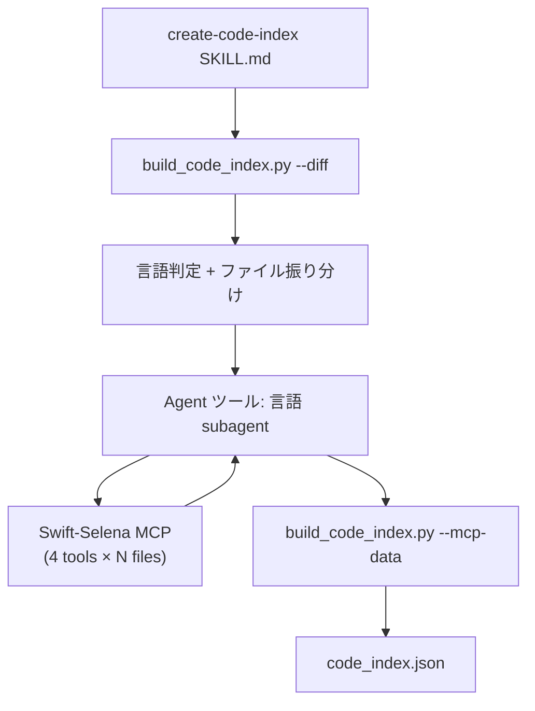
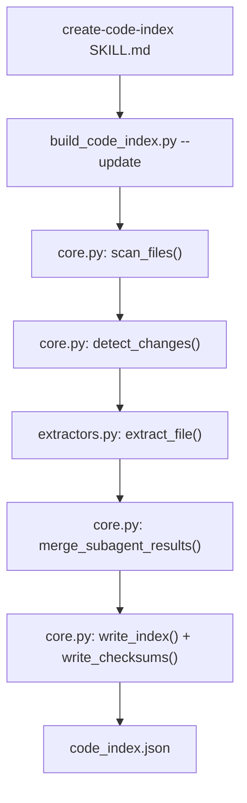
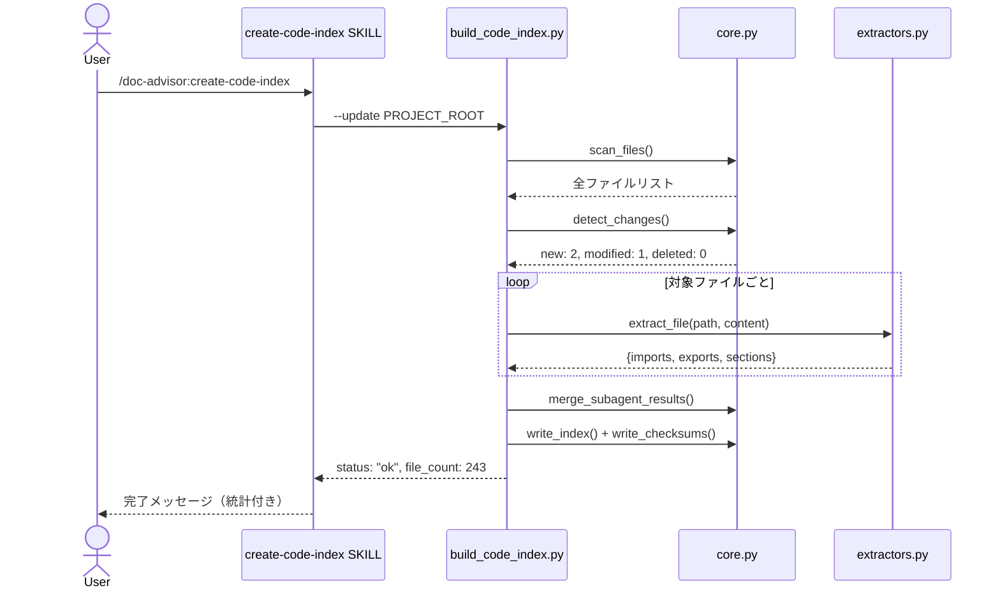

# DES-008: コードインデックス スクリプトベース抽出 設計書

## メタデータ

| 項目     | 値 |
|----------|-----|
| 設計ID   | DES-008 |
| 関連要件 | REQ-004 v2.0（PRE-04 廃止 / FR-02〜04 / FR-09 / NFR-02-2 / NFR-03-2 改訂） |
| 関連設計 | DES-007（実装後に改訂予定） |
| 作成日   | 2026-04-04 |

## 1. 概要

AI subagent + MCP（Swift-Selena）方式によるコード構造抽出を、Python regex/AST スクリプトに置き換える。

### 課題

DES-007 の言語 subagent 方式は、243 ファイルの Swift プロジェクトで以下の問題を起こした:

- AI subagent が 243 ファイル × (4 MCP calls + 1 Read) ≈ 1,215 ツール呼び出しを1コンテキスト内で逐次実行
- MCP 結果の蓄積によりコンテキストがファイル数に比例して膨大化
- トークン消費が過大で実用的でない

### 解決策

`search_code.py`（Stage 1 検索）が exports から参照するのは `name` と `doc` のみであり、`kind`・`conforms_to`・`extensions` は未使用。Swift-Selena の AST 精度は不要であるため、Python regex/AST による抽出で十分である。

### 変更範囲

抽出レイヤーのみ。検索（`search_code.py`）、グラフ（`graph.py`）、永続化（`core.py`）は変更しない。

## 2. アーキテクチャ概要

### 変更前後の比較

| 項目 | DES-007（MCP 方式） | DES-008（スクリプト方式） |
|------|---------------------|--------------------------|
| 抽出方法 | AI agent + Swift-Selena MCP | Python regex/AST スクリプト |
| 243 ファイルの処理コスト | 〜1,215 MCP calls + context 肥大 | ミリ秒（Python in-process） |
| AI トークン消費（抽出） | 大（subagent context 累積） | ゼロ |
| MCP 依存 | 必須 | なし |
| `exports.extensions` | cross-file 追跡可 | 非対応（常に null） |
| `exports.conforms_to` | AST 100% 精度 | regex 〜90% 精度 |
| `exports.doc` | 正確 | regex 〜80% 精度 |

### コンポーネント図

#### DES-007（MCP 方式）— 廃止



#### DES-008（スクリプト方式）— 新



## 3. モジュール設計

### 3.1 モジュール一覧

| モジュール | ファイルパス | 変更 | 依存 |
|-----------|------------|------|------|
| extractors | `scripts/code_index/extractors.py` | **新規** | Python 標準ライブラリ（re, ast） |
| build_code_index | `scripts/code_index/build_code_index.py` | **修正** | core, extractors |
| create-code-index SKILL | `skills/create-code-index/SKILL.md` | **修正** | build_code_index |
| lang/swift SKILL | `skills/create-code-index/lang/swift/SKILL.md` | **削除** | — |
| core | `scripts/code_index/core.py` | 変更なし | toc_utils |
| graph | `scripts/code_index/graph.py` | 変更なし | なし |
| search_code | `scripts/code_index/search_code.py` | 変更なし | core |

### 3.2 extractors.py 設計

新規モジュール。言語別の構造情報抽出を担当する。

#### 公開インターフェース

```
extract_file(rel_path: str, content: str) -> dict
```

拡張子から言語を判定し、対応する抽出関数にディスパッチする。

**エラーハンドリング方針**: 抽出関数が例外を送出した場合（不正な UTF-8、バイナリ混入、極端に長い行等）、`extract_file()` は try-except ガードにより空の結果 `{"imports": [], "exports": [], "sections": []}` を返す。これにより、個別ファイルの抽出失敗がバッチ全体を停止させないことを保証する。Python の `SyntaxError`（§3.4）もこの共通ポリシーの一部として処理される。

戻り値は DES-007 §3.3 の共通 JSON フォーマットに準拠する:

```json
{
  "imports": ["モジュール名"],
  "exports": [
    {
      "name": "シンボル名",
      "kind": "Class/Struct/Enum/Protocol/Function/Actor 等",
      "line": 行番号,
      "access": "public/internal/private",
      "conforms_to": ["プロトコル名"],
      "doc": "ドキュメントコメント or null",
      "extensions": null
    }
  ],
  "sections": ["セクション名"]
}
```

#### 拡張子ディスパッチテーブル

| 拡張子 | 抽出関数 | 方式 |
|--------|---------|------|
| `.swift` | `extract_swift` | regex |
| `.py` | `extract_python` | ast module |
| `.ts`, `.tsx` | `extract_typescript` | regex |
| `.js`, `.jsx` | `extract_javascript` | regex |
| その他 | — | 空の imports/exports/sections を返す |

#### 新言語追加時の手順

1. `extractors.py` に `extract_{language}(content: str) -> dict` 関数を追加
2. `extract_file()` のディスパッチテーブルに拡張子を追加

core.py・build_code_index.py の変更は不要（NFR-03-1 準拠）。

> **注**: core.py の `DEFAULT_EXTENSION_MAP`（8 言語分）は `scan_files()` のフィルタと `detect_language()` で使用される。extractors.py のディスパッチテーブル（4 言語）はその部分集合であり、`DEFAULT_EXTENSION_MAP` に含まれるが extractors.py で未対応の言語（kotlin, java, go, rust）は `extract_file()` が空の結果を返す。将来的には extractors.py 側に `SUPPORTED_EXTENSIONS` を定義し core.py がそれを参照する一方向依存への統合を検討する。

### 3.3 Swift 抽出アルゴリズム

#### imports 抽出

```
パターン: ^(?:@\w+\s+)?import\s+(\w+(?:\.\w+)*)
フラグ: MULTILINE
```

対象:
- `import Foundation`
- `@testable import MyModule`
- `import Auth.TokenStore`（ドット付き）

#### exports 抽出

```
パターン: ^[ \t]*(?P<access>public|open)\s+
          (?:(?:final|static|class|override|required|convenience|nonisolated)\s+)*
          (?P<kind>class|struct|enum|protocol|func|var|let|typealias|extension|actor)\s+
          (?P<name>\w+)
フラグ: MULTILINE
```

修飾子（`final`, `static`, `class`, `override`, `required`, `convenience`, `nonisolated`）は 0 個以上を読み飛ばし、型キーワードが出現したら名前を取得する。

> **extension が型キーワードに含まれる理由**: REQ-004 FR-04-6 の「extension 宣言を regex で抽出する」要件に準拠するため。`extension` を exports に含めることで、ファイル内で拡張される型の存在を記録する。ただし `exports.extensions` フィールド（cross-file 追跡、常に null）とは別の概念であり、ここでの `extension` は個別の export エントリとして kind="Extension" で記録される。

**取得する情報**:
- `name`: キャプチャグループ `name`
- `kind`: キャプチャグループ `kind`（先頭大文字化）
- `line`: マッチ位置から算出
- `access`: キャプチャグループ `access`

#### conforms_to 抽出

exports 抽出でマッチした行から、型宣言（class / struct / enum / actor）に続く `: TypeA, TypeB` を追加で解析する。

```
パターン: (?:class|struct|enum|actor)\s+\w+\s*:\s*([^{]+)
```

キャプチャした文字列をカンマ区切りで分割し、各型名をトリムしてリスト化する。`where` 句がある場合は `where` 以前のみを対象とする。

#### doc 抽出

exports でマッチした行の直前の `///` コメントを逆方向にスキャンして取得する。

アルゴリズム:
1. exports のマッチ行番号 `L` を取得
2. 行 `L-1` から逆方向に走査
3. `///` で始まる行が連続する間、テキストを収集
4. `///` を除去し、空白をトリムして結合
5. 連続が途切れたら終了

#### sections 抽出

```
パターン: //\s*MARK:\s*-?\s*(.+)
```

`// MARK: - Properties` → `"Properties"` のように、`MARK:` 以降のテキストを取得する。

### 3.4 Python 抽出アルゴリズム

`ast` モジュール（標準ライブラリ）を使用する。SyntaxError 発生時は空の結果を返す。

#### imports 抽出

`ast.walk()` で `ast.Import` / `ast.ImportFrom` ノードを走査する。モジュール名はドットの最初の部分（トップレベルパッケージ名）を使用する。

#### exports 抽出

`ast.walk()` で以下のノードを対象とする:
- `ast.ClassDef` → kind: "Class"
- `ast.FunctionDef` → kind: "Function"
- `ast.AsyncFunctionDef` → kind: "Function"

`_` で始まるプライベート名は除外する。

**取得する情報**:
- `name`: ノードの `name` 属性
- `kind`: ノード型から判定
- `line`: ノードの `lineno` 属性
- `access`: `_` 先頭なら "private"、それ以外は "public"
- `doc`: `ast.get_docstring(node)`（先頭100文字に制限）
- `conforms_to`: `[]`（Python では不要）

#### sections 抽出

```
パターン: #\s*MARK:\s*-?\s*(.+)
```

### 3.5 TypeScript / JavaScript 抽出アルゴリズム

TypeScript と JavaScript は同一の regex 方式を使用する。

#### imports 抽出

```
パターン: (?:import|from)\s+['"]([^'"]+)['"]
```

相対パス（`.` または `..` で始まるもの）は除外し、パッケージ名のみを取得する。

> **制限**: このパターンは ES module 構文（`import`/`from`）のみ対応し、CommonJS の `require()` 構文には未対応。Node.js プロジェクトでは require が広く使われるため import グラフの精度に影響する可能性がある。この制限は §7 トレードオフ分析に記載する。

#### exports 抽出

```
パターン: ^export\s+(?:default\s+)?
          (?P<kind>class|function|interface|type|enum|const|let|var)\s+
          (?P<name>\w+)
フラグ: MULTILINE
```

**取得する情報**:
- `name`, `kind`, `line`: マッチから取得
- `access`: 常に "public"（export されているため）
- `conforms_to`: `[]`
- `doc`: 宣言直前の `/** ... */` JSDoc コメントを抽出（単行のみ）

### 3.6 build_code_index.py --update モード設計

新しい `--update` モードを追加する。差分検出 → 抽出 → インデックス更新を 1 コマンドで完結させる。

#### CLI インターフェース

```
python3 build_code_index.py --update PROJECT_ROOT [--full]
```

| 引数 | 説明 |
|------|------|
| `--update PROJECT_ROOT` | 差分検出 + 抽出 + インデックス更新 |
| `--full` | `--update` と組み合わせて全ファイル再構築 |

#### 処理フロー

```
cmd_update(project_root, full):
  1. scan_files(project_root, extensions=None) → 全ファイルリスト
     ※ REQ-004 FR-01-6 準拠のため、extensions=None（全テキストファイル対象）で呼び出す。
     core.py scan_files() のデフォルトは DEFAULT_EXTENSION_MAP のキーでフィルタするが、
     --update モードでは未対応拡張子のファイルもスキャン対象に含め、
     パス・行数のみをインデックスに記録する。
     ※ 実装時に scan_files() の extensions 引数にテキストファイル拡張子のセット
     （DEFAULT_EXTENSION_MAP のキー + 一般的なテキストファイル拡張子）を渡すか、
     全拡張子を対象にしてバイナリファイルを除外するフィルタを追加する。
  2. detect_changes(project_root, files, checksums_path) → new/modified/deleted/unchanged
  3. full の場合: targets = new + modified + unchanged
     通常の場合: targets = new + modified
  4. targets が空 かつ deleted が空 → status: "fresh" で終了
  5. targets の各ファイルに対して:
     - content = read_text(abs_path)
     - extracted[rel_path] = extract_file(rel_path, content)
     - OSError 時は failed に追加（既存インデックスに当該ファイルのエントリが存在する場合は、前回の抽出結果を保持する。merge_subagent_results() は extracted に含まれないキーをそのまま維持するため、この挙動は自動的に保証される）
  6. load_index(index_path) → 既存インデックス（存在しない場合は空）
  7. merge_subagent_results(existing, extracted, project_root, deleted)
  8. write_index(updated_index, index_path)
  9. write_checksums(current_checksums, checksums_path)
  10. status: "ok" + 統計情報を JSON 出力
```

#### 出力 JSON

```json
{
  "status": "ok",
  "file_count": 243,
  "new": 5,
  "modified": 3,
  "deleted": 1,
  "skipped": 234,
  "failed": 0
}
```

#### 後方互換

既存モード（`--diff`, `--check`）は維持する。

`--mcp-data` は旧 SKILL.md（DES-007 のステップ 6）からのみ呼ばれていた。DES-008 で SKILL.md を `--update` に切り替えるため、呼び出し元がなくなる。`--mcp-data` は **deprecated** とし、将来のバージョンで削除する。実装時に deprecation warning（stderr）を追加する。

### 3.7 create-code-index SKILL.md 設計

現在の 7 ステップ（diff → 言語判定 → Agent ツール subagent 起動 → mcp-data 統合 → 完了）を 2 ステップに簡素化する。

#### ステップ 1: インデックス更新

Bash で以下を実行:

```
python3 ${CLAUDE_PLUGIN_ROOT}/scripts/code_index/build_code_index.py --update PROJECT_ROOT [--full]
```

`--full` は `$ARGUMENTS` に `--full` が含まれる場合に付与する。

出力 JSON の `status` を判定:
- `"ok"` → ステップ 2 へ
- `"fresh"` → 「コードインデックスは最新です」と表示して終了
- `"error"` → AskUserQuestion でエラー報告

#### ステップ 2: 完了メッセージ表示

```
コードインデックスを更新しました。
- ファイル数: {file_count}
- 新規: {new}
- 更新: {modified}
- 削除: {deleted}
- スキップ: {skipped}
```

#### 削除する要素

- 拡張子 → 言語テーブル（SKILL.md 内の定義）
- Agent ツールによる subagent 起動
- 未対応言語ファイルの個別処理
- subagent 結果の JSON 統合

## 4. ユースケース設計

### UC-1: 増分更新

**前提条件**: コードインデックスが構築済み。一部のソースファイルが変更されている。

**正常フロー**:



### UC-2: 全体再構築

**前提条件**: 初回構築、またはスキーマ変更による再構築。

**正常フロー**: UC-1 と同一だが `--full` フラグにより全ファイルが対象となる。

### UC-3: 変更なし

**前提条件**: 前回のインデックス構築以降、ソースファイルに変更がない。

**正常フロー**:

1. `--update` で差分検出
2. new=0, modified=0, deleted=0
3. `status: "fresh"` を返却
4. SKILL.md が「コードインデックスは最新です」と表示

## 5. 使用する既存コンポーネント

| コンポーネント | ファイルパス | 用途 |
|---------------|------------|------|
| core.py | `plugins/doc-advisor/scripts/code_index/core.py` | scan_files, detect_changes, merge_subagent_results, write_index, write_checksums, load_index, detect_language |
| toc_utils.py | `plugins/doc-advisor/scripts/toc_utils.py` | calculate_file_hash, load_checksums, normalize_path, rglob_follow_symlinks, write_checksums_yaml |
| build_code_index.py | `plugins/doc-advisor/scripts/code_index/build_code_index.py` | _index_path, _checksums_path, _output_json, _output_error（既存ヘルパー） |

## 6. 設計判断

| 判断 | 採用案 | 代替案 | 採用理由 |
|------|--------|--------|---------|
| 抽出方式 | Python regex/AST | AI subagent + MCP（DES-007） | 速度・コスト。search_code.py が参照するのは name/doc のみであり AST 精度は不要 |
| extensions 追跡 | 廃止（常に null） | cross-file 解析 | query-code（search_code.py）で未使用。スクリプトでの cross-file 解析はコスト対効果が低い |
| 既存モード互換 | `--diff`/`--check` 維持、`--mcp-data` deprecated | 全削除 | `--diff`/`--check` は診断用途で有用。`--mcp-data` は呼び出し元（旧 SKILL.md）が廃止されるため deprecated とする |
| 書き込み順序 | write_index() → write_checksums() | アトミック一括 | core.py の既存実装に準拠。チェックサム書き込みが失敗しても、次回実行時に全ファイルが modified として再処理されるため、データ整合性は損なわれない（冪等性保証） |
| 抽出関数配置 | 1 ファイル（`extractors.py`） | 言語別ファイル分割 | 現時点で 4 言語。1 ファイルで管理可能な規模。10 言語を超えた場合に分割を検討 |
| Python 抽出方式 | ast モジュール | regex | AST のほうが正確で、Python 標準ライブラリに含まれる |

## 7. トレードオフ分析

| フィールド | MCP 方式（DES-007） | スクリプト方式（DES-008） | query-code への影響 |
|-----------|---------------------|--------------------------|-------------------|
| exports.extensions | cross-file 追跡可 | 非対応（常に null） | なし（search_code.py 未参照） |
| exports.conforms_to | AST 100% 精度 | regex 〜90% 精度 | なし（search_code.py 未参照） |
| exports.doc | AST + コメント解析で正確 | regex 〜80% 精度 | 中（Stage 1 で doc フィールドを検索。偽陰性の可能性あり） |
| ネスト型 | AST で正確に検出 | トップレベル宣言のみ | 軽微（ネスト型はファイル単位の検索で十分） |
| TS/JS imports | — | ES module のみ（`require()` 未対応） | 中（Node.js プロジェクトで import グラフの精度が低下。ES module 移行が進むプロジェクトでは影響軽微） |

**doc フィールドの精度低下への対策**: export 名（name）のマッチ重み（WEIGHT_EXPORT=3）が doc（WEIGHT_DOC=1）より大きいため、doc の偽陰性が検索精度全体に与える影響は限定的。

## 8. テスト設計

### テストファイル

`tests/doc_advisor/code_index/test_extractors.py`

### テストクラス

| クラス | テスト内容 |
|--------|-----------|
| TestExtractSwift | imports / exports（修飾子パターン含む）/ sections / conforms_to / doc 抽出 |
| TestExtractPython | imports / class / function / async function / docstring / private 除外 |
| TestExtractTypeScript | import / export / interface / type / JSDoc |
| TestExtractJavaScript | import / export（TypeScript と同一ロジックの検証） |
| TestExtractFile | 拡張子ディスパッチ / unknown 拡張子で空結果 |
| TestCmdUpdate | `--update` モードの E2E テスト（tmpdir でプロジェクト構造を模擬） |

### 主要テストケース（TestExtractSwift）

| テストケース | 入力例 | 期待出力 |
|-------------|--------|---------|
| 基本 import | `import Foundation` | `["Foundation"]` |
| testable import | `@testable import MyModule` | `["MyModule"]` |
| ドット付き import | `import Auth.TokenStore` | `["Auth.TokenStore"]` |
| public class | `public class Foo {` | name="Foo", kind="Class", access="public" |
| open class | `open class Bar {` | name="Bar", kind="Class", access="open" |
| 修飾子付き | `public static func baz()` | name="baz", kind="Func" |
| 複数修飾子 | `public override final func qux()` | name="qux", kind="Func" |
| actor | `public actor MyActor {` | name="MyActor", kind="Actor" |
| conforms_to | `public class Foo: Bar, Baz {` | conforms_to=["Bar", "Baz"] |
| where 句 | `public struct A: B where T: C {` | conforms_to=["B"] |
| doc コメント（単行） | `/// 説明\npublic class X {` | doc="説明" |
| doc コメント（複数行 `///`） | `/// 行1\n/// 行2\npublic class X {` | doc="行1 行2" |
| doc コメント（`/** */` ブロック） | `/** ブロック説明 */\npublic class X {` | doc="ブロック説明"（対応する場合）or null（非対応の場合） |
| doc コメント（空行で分断） | `/// 関係ない\n\npublic class X {` | doc=null |
| MARK セクション | `// MARK: - Properties` | sections=["Properties"] |

### TestCmdUpdate 設計

tmpdir にテストプロジェクト構造を作成し、`build_code_index.py --update` を subprocess で実行する。

1. tmpdir に .swift / .py ファイルを配置
2. `--update --full` で初回構築 → status: "ok" を検証
3. code_index.json の中身を検証（entries 数、imports/exports 内容）
4. ファイル変更なしで `--update` → status: "fresh" を検証
5. ファイル追加して `--update` → new: 1 を検証

## 9. インデックススキーマへの影響

- **schema_version**: `"1.0"` を維持。フィールド構造に変更なし
- **metadata.mcp_server**: フィールドを削除（スクリプト方式では不要）。metadata は `write_index()` で毎回再構築されるため、既存インデックスの `mcp_server` フィールドは `--update` 実行時に自動的に除去される。明示的なマイグレーション処理は不要
- **entries**: 構造は同一。`exports.extensions` が常に `null` になる
- **後方互換**: 既存の `code_index.json` は `--update` でそのまま増分更新可能

## 改定履歴

| 日付 | バージョン | 内容 |
|------|-----------|------|
| 2026-04-04 | v1.0 | 初版作成 |
