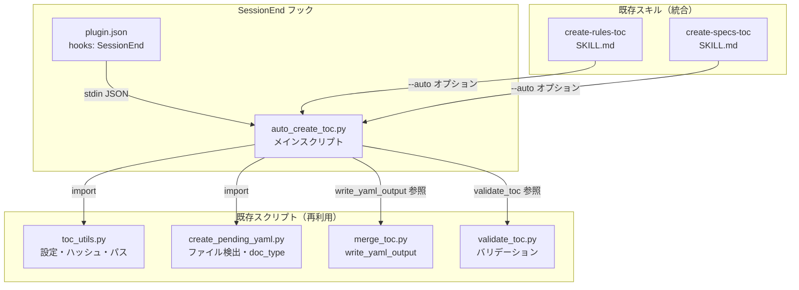
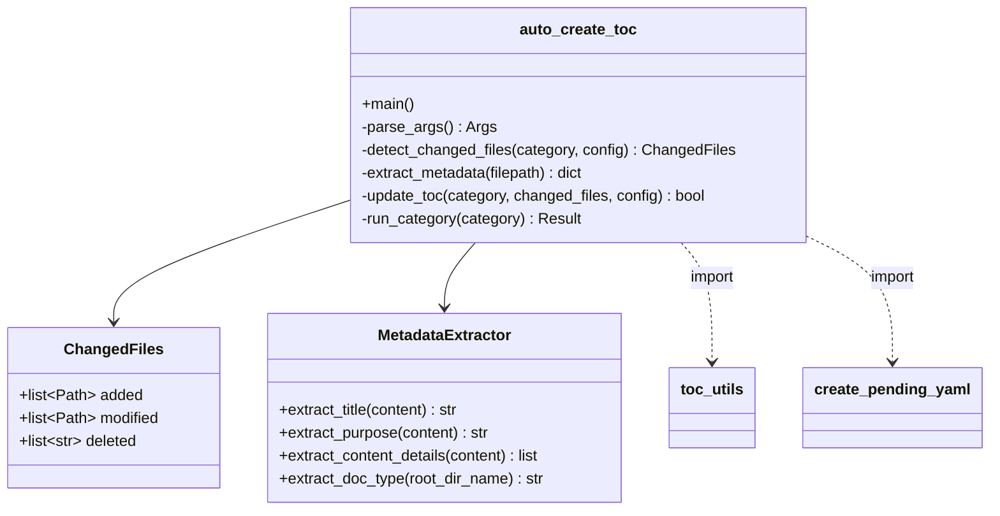
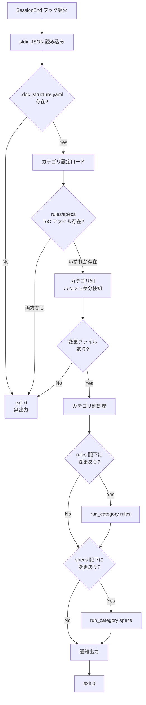
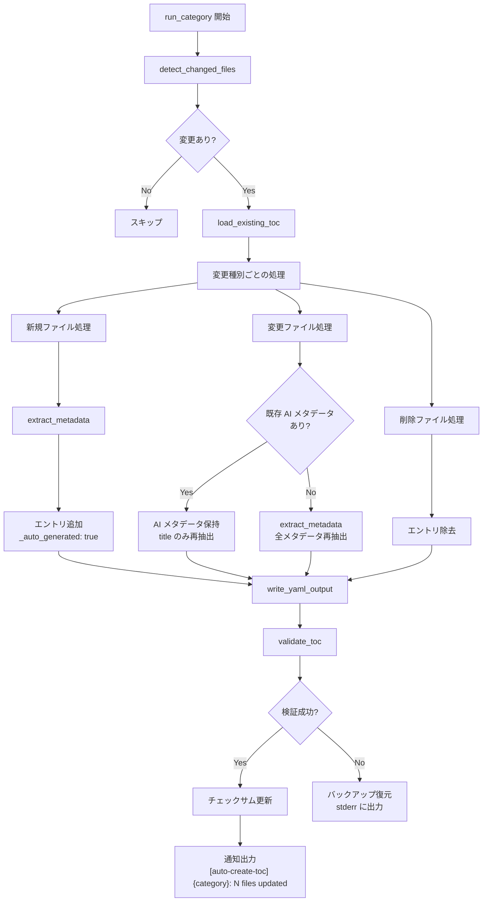
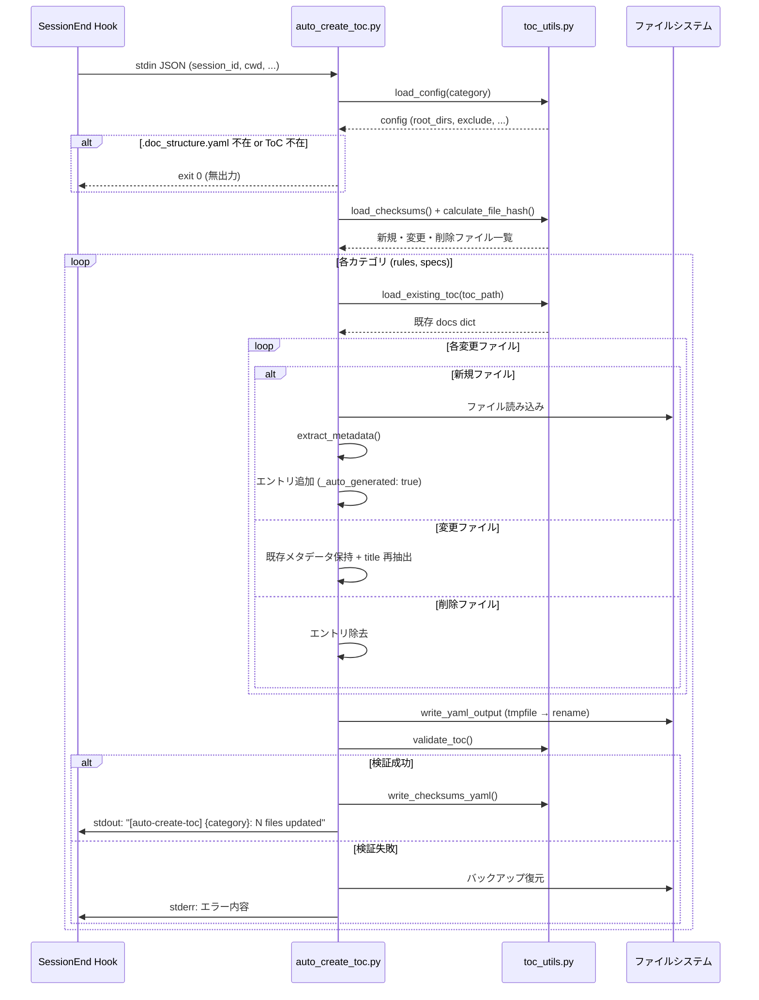

# DES-009 auto-create-toc 設計書

## メタデータ

| 項目     | 値                                              |
| -------- | ----------------------------------------------- |
| 設計ID   | DES-009                                         |
| 関連要件 | REQ-005（auto-create-toc 要件定義書）                  |
| 関連設計 | DES-004（ドキュメントモデル）, DES-005（ToC 生成フロー） |
| 作成日   | 2026-04-04                                      |

## 1. 概要

セッション終了時にスクリプトのみで ToC を自動更新する機能（auto-create-toc）を doc-advisor プラグインに追加する。
既存の AI ベース ToC 生成（create-rules-toc / create-specs-toc）と共存する 2 層構造を実現し、
日常的な文書変更を高速・低コストで ToC に反映する。

**設計方針**: 既存スクリプト群（toc_utils.py, create_pending_yaml.py, merge_toc.py）を最大限再利用し、
新規スクリプト `auto_create_toc.py` 1 ファイルに auto-create-toc 固有ロジックを集約する。

### 1.1 前提条件

- `.doc_structure.yaml` がプロジェクトルートに存在し、rules/specs ディレクトリが設定済みであること
- doc-advisor プラグインがインストールされていること

> **Note**: 要件定義書（REQ-005）では「Stop フック」と記載されているが、設計検討の結果
> **SessionEnd フック**を採用した（セッション終了時に 1 回だけ発火、オーバーヘッド最小）。
> 要件定義書の当該箇所は本設計に合わせて更新する。

### 1.2 要件対応表

| 要件ID | 要件名 | 設計セクション |
| ------ | ------ | -------------- |
| FNC-001 | SessionEnd フック自動トリガー | 6. plugin.json hooks 定義 |
| FNC-002 | 差分検知 | 3.3 detect_changed_files, 4.1 処理フロー |
| FNC-003 | カテゴリ別更新 | 4.1 処理フロー, 4.2 run_category |
| FNC-004 | スクリプトベース処理 | 5. メタデータ抽出戦略 |
| FNC-005 | 既存スキルとの統合 | 7. 既存スキル統合 |
| FNC-006 | プラグインフック統合 | 6. plugin.json hooks 定義 |
| FNC-007 | エラーハンドリング | 9. エラーハンドリング設計 |
| NFR-001 | 実行通知 | 10. 通知出力設計 |
| NFR-002 | 互換性 | 5.4 バリデーション互換性 |
| NFR-003 | 実行速度 | 6.2 設計判断（timeout: 30秒） |

## 2. アーキテクチャ概要

### 2.1 コンポーネント構成



### 2.2 新規・変更ファイル一覧

| ファイル | 種別 | 内容 |
| -------- | ---- | ---- |
| `plugins/doc-advisor/scripts/auto_create_toc.py` | 新規 | auto-create-toc メインスクリプト |
| `plugins/doc-advisor/.claude-plugin/plugin.json` | 変更 | hooks フィールド追加 |
| `plugins/doc-advisor/skills/create-rules-toc/SKILL.md` | 変更 | `--auto` オプション追加 |
| `plugins/doc-advisor/skills/create-specs-toc/SKILL.md` | 変更 | `--auto` オプション追加 |
| `plugins/doc-advisor/scripts/merge_toc.py` | 変更 | `write_yaml_output()` にパラメータ追加（グローバル変数依存排除） |
| `plugins/doc-advisor/scripts/validate_toc.py` | 変更 | `validate_toc()` にパラメータ追加（グローバル変数依存排除） |
| `plugins/doc-advisor/scripts/create_pending_yaml.py` | 変更 | `determine_doc_type()` にパラメータ追加（グローバル変数依存排除） |

## 3. モジュール設計

### 3.1 モジュール一覧

| モジュール | 責務 | 依存 | auto-create-toc での利用 |
| ---------- | ---- | ---- | ----------------- |
| `auto_create_toc.py` | 変更検知・メタデータ抽出・ToC 更新のオーケストレーション | toc_utils, create_pending_yaml, merge_toc, validate_toc | — |
| `toc_utils.py`（既存） | 設定ロード・ハッシュ計算・ファイル操作 | なし | 直接 import |
| `create_pending_yaml.py`（既存・変更） | ファイル検出・空判定・doc_type 推定 | toc_utils | `has_substantive_content()` 直接 import、`determine_doc_type()` パラメータ追加後 import |
| `merge_toc.py`（既存・変更） | ToC YAML 書き出し | toc_utils | `write_yaml_output()` パラメータ追加後 import |
| `validate_toc.py`（既存・変更） | ToC 整合性検証 | toc_utils | `validate_toc()` パラメータ追加後 import |

### 3.2 auto_create_toc.py 内部構造



### 3.3 主要関数の設計

#### `main()`

エントリポイント。動作モードを判定し、カテゴリごとに処理を実行する。

- **フックモード**（引数なし）: stdin から SessionEnd JSON を読み、SHA-256 ハッシュベースで変更ファイルを検出
- **スキルモード**（`--category {rules|specs}`）: 同じく SHA-256 ハッシュベースで差分検知

#### `detect_changed_files(category, config)`

変更ファイルの検出。モードにより検出方法が異なる。

- **フックモード・スキルモード共通**: `load_checksums()` と `calculate_file_hash()` で SHA-256 ハッシュベースの差分検知。
  root_dirs 配下の全 `.md` ファイルを走査し、チェックサムファイルと比較して新規・変更・削除を検出する。

理由: 検知方式を 1 つに統一することで、実装の複雑さを抑え、Git 非依存で動作可能にした。
既存の `create_pending_yaml.py` と同じハッシュベース方式を再利用するため、検知精度も担保される。
典型的なプロジェクト（root_dirs 配下の `.md` が数十〜数百ファイル）ではハッシュ計算は数秒以内に完了し、
timeout: 30秒の制約内に十分収まる。

#### `extract_metadata(filepath)`

Markdown ファイルからスクリプトのみでメタデータを抽出する。
TBD-001（AI メタデータなしでの品質維持）の解決策。

#### `update_toc(category, changed_files, config)`

既存 ToC を読み込み、変更を反映し、書き出す。
書き出しは `merge_toc.py` の `write_yaml_output()` を直接呼び出す（同一コードパス）。
バリデーションも `validate_toc.py` の `validate_toc()` を直接呼び出す。

## 4. 処理フロー設計

### 4.1 SessionEnd フック処理フロー



### 4.2 カテゴリ別処理フロー（run_category）



### 4.3 シーケンス図



## 5. TBD-001 解決: メタデータ抽出戦略

### 5.1 2 層戦略

| 対象 | 処理 | メタデータ品質 | マーカー |
| ---- | ---- | -------------- | -------- |
| 新規ファイル | Markdown 構造から抽出 | 中（検索可能だが AI 品質には劣る） | `_auto_generated: true` |
| 変更ファイル（AI メタデータあり） | 既存 AI メタデータ保持、title のみ再抽出 | 高（AI 生成を維持） | 変更なし |
| 変更ファイル（AI メタデータなし） | Markdown 構造から全メタデータ再抽出 | 中 | `_auto_generated: true` |
| 削除ファイル | エントリ除去 | — | — |

### 5.2 Markdown メタデータ抽出アルゴリズム

```
extract_metadata(filepath):
    1. ファイル読み込み
    2. frontmatter パース（YAML frontmatter があれば）
    3. title ← H1 見出し（最初の `# ` 行）
       - H1 なし → ファイル名から生成
    4. セクション解析（1パスで全 H2/H3 を走査し、以降のステップで使う中間データを構築）
       a. metadata_table: {} — `## メタデータ` にマッチするセクションのテーブル key-value
       b. overview_text: "" — 概要セクション（下記パターン参照）の本文（最大2行）
       c. headings: [] — その他 H2/H3 見出しテキスト（メタデータ・改定履歴セクションは除外）
       d. first_para: "" — H1 直後の最初の段落テキスト（概要セクションがない場合のフォールバック）

       セクション見出しのマッチングルール:
       番号プレフィックス（`## 1.`, `## 2` 等）を除去した後のテキストで判定する。
       ```
       正規化: re.sub(r'^\d+\.?\s*', '', heading_text).strip()
       例: "1. 概要" → "概要", "2. アーキテクチャ概要" → "アーキテクチャ概要"
       ```
       | 対象セクション | マッチ条件（正規化後） | マッチ例 |
       | -------------- | ---------------------- | -------- |
       | 概要 | `概要`, `Overview` に完全一致 | `## 概要`, `## 1. 概要`, `## 1 概要`, `## Overview` |
       | メタデータ | `メタデータ`, `Metadata` に完全一致 | `## メタデータ`, `## 1. メタデータ` |
       | 改定履歴 | `改定履歴` に完全一致 | `## 改定履歴`, `## 10. 改定履歴` |
    5. purpose ← 以下の優先順で決定
       a. frontmatter の description/purpose フィールド
       b. overview_text（ステップ 4b）
       c. first_para（ステップ 4d）
    6. doc_type ← resolve_doc_type(filepath, root_dirs, doc_types_map)
       filepath の相対パスで doc_types_map を照合し、最長一致するパスの doc_type を返す。
       一致なしの場合は determine_doc_type(root_dir_name) にフォールバック。
       （DES-004 の doc_types_map はサブパス単位で型を分けられるため、root_dir_name だけでは不十分）
    7. content_details ← headings（ステップ 4c）から最大10件
       - 0 件の場合: first_para から 1 項目を生成（非空保証）
    8. keywords ← 以下のソースから抽出（重複除去、最大10語）
       - title の単語
       - headings の単語
       - metadata_table の「関連要件」値（例: REQ-005 → "REQ-005" をキーワード化）
       - 0 件の場合: ファイル名から 1 語を生成（非空保証）
    9. applicable_tasks ← doc_type に基づく汎用タスクを 1 件以上生成（非空保証）
       - rule → ["ルール確認"], spec → ["仕様確認"], design → ["設計確認"] 等
       - スクリプトでは具体的な推定が困難なため、doc_type ベースの汎用値で代替する
```

**採用理由**: AI を使わずに取得可能なメタデータのうち、title・purpose・content_details・keywords は
Markdown の構造情報から十分な品質で抽出できる。applicable_tasks は doc_type ベースの汎用値で代替し、
次回の AI ベース更新（create-*-toc）でより具体的な値に上書きされる。

**非空保証**: 既存の `validate_toc.py` は `content_details`, `applicable_tasks`, `keywords` を
非空配列として検証する（validate_toc.py:124）。auto-create-toc で生成するエントリもこの制約を満たす必要があるため、
各フィールドに最低 1 件の値を必ず生成する設計とした。

**代替案の検討**: frontmatter だけに依存する方式も検討したが、frontmatter がない文書が多いプロジェクトでは
メタデータが空になるため、見出し構造からの抽出を併用する方式を採用した。
validate_toc.py 側を `_auto_generated` エントリに対して緩和する案も検討したが、
ToC の検索品質を下げるリスクがあるため、非空保証をスクリプト側で担保する方式を採用した。

### 5.3 `_auto_generated` マーカー

auto-create-toc で作成・更新したエントリに `_auto_generated: true` を付与する。

- **用途**: 次回 `create-rules-toc` / `create-specs-toc` 実行時に AI で上書きする対象の識別
- **互換性**: `validate_toc.py` は未知のフィールドを無視するため、追加フィールドによる互換性問題なし
- **query スキルへの影響**: `query-rules` / `query-specs` は ToC 全体を AI が解釈するため、追加フィールドの影響なし

#### `_auto_generated` のライフサイクル

```
1. auto-create-toc がエントリを新規作成 → _auto_generated: true を付与
2. auto-create-toc が同エントリを更新 → _auto_generated: true を維持（title のみ再抽出）
3. create-*-toc (AI) が実行 → _auto_generated: true のエントリを AI メタデータで上書き
   → _auto_generated フィールドを削除（AI 生成済みのため不要）
4. auto-create-toc が AI 生成済みエントリを更新 → AI メタデータを保持、title のみ再抽出
   → _auto_generated は付与しない（既に AI 品質のメタデータを保持しているため）
```

**所有権ルール**: `_auto_generated` の付与は auto-create-toc のみ、削除は create-*-toc のみが行う。
auto-create-toc は `_auto_generated` の有無で「AI メタデータあり」を判定する
（`_auto_generated` なし = AI 生成済みまたは既存エントリ）。

### 5.4 バリデーション互換性（NFR-002 対応）

auto-create-toc が生成するエントリは、既存の `validate_toc.py` の全検査を通過する:

| 検査項目 | 対応 |
| -------- | ---- |
| `title` 非空 | H1 見出し or ファイル名から必ず生成 |
| `purpose` 非空 | frontmatter or 段落テキストから生成 |
| `doc_type` 非空 | doc_types_map or フォールバックで必ず決定 |
| `content_details` 非空配列 | H2/H3 見出し or 段落テキストから最低 1 件 |
| `applicable_tasks` 非空配列 | doc_type ベースの汎用値で最低 1 件 |
| `keywords` 非空配列 | title/見出しから最低 1 語 |
| ファイル参照 | 実在ファイルのみエントリ化 |

## 6. plugin.json hooks 定義

### 6.1 hooks フィールドの追加

`plugins/doc-advisor/.claude-plugin/plugin.json` に SessionEnd フックを追加する。

```json
{
  "name": "doc-advisor",
  "description": "AI-searchable document index (ToC) generator for Claude Code",
  "version": "0.1.3",
  "author": { "name": "moons" },
  "license": "MIT",
  "skills": "./skills/",
  "hooks": {
    "SessionEnd": [
      {
        "hooks": [
          {
            "type": "command",
            "command": "python3 $CLAUDE_PLUGIN_ROOT/scripts/auto_create_toc.py",
            "timeout": 30000
          }
        ]
      }
    ]
  }
}
```

### 6.2 設計判断

- **SessionEnd を採用**（Stop ではなく）: セッション終了時に 1 回だけ発火し、オーバーヘッドが最小。
  要件定義書（REQ-005）の「Stop フック」は本設計に合わせて「SessionEnd フック」に更新する。
- **timeout: 30000**（30秒）: 通常の処理は数秒で完了するが、大量ファイル変更時の余裕を確保
- **`$CLAUDE_PLUGIN_ROOT`**: プラグインフック内で使用可能な環境変数。インストール先に依存しないパス解決
- **代替更新経路**: SessionEnd フックが何らかの理由（環境差分、仕様変更等）で発火しない場合、
  `--auto` オプション経由で手動更新が可能。フック障害時は `[auto-create-toc]` の通知が出ないことで
  ユーザーが気づき、`/doc-advisor:create-rules-toc --auto` で復旧できる。

### 6.3 stdin JSON スキーマ

SessionEnd フックは stdin で以下の JSON を受け取る:

```json
{
  "session_id": "abc123",
  "transcript_path": "/path/to/transcript.jsonl",
  "cwd": "/path/to/project"
}
```

auto_create_toc.py は `cwd` を作業ディレクトリとして使用する。
`session_id` と `transcript_path` は現時点では使用しないが、将来の拡張に備えて受け取る。

## 7. FNC-005: 既存スキル統合

### 7.1 `--auto` オプション

`create-rules-toc` / `create-specs-toc` に `--auto` オプションを追加し、
AI を使わないスクリプトのみの更新を可能にする。

```
/doc-advisor:create-rules-toc --auto   # AI なし、スクリプトのみ更新
/doc-advisor:create-specs-toc --auto   # AI なし、スクリプトのみ更新
```

### 7.2 SKILL.md への追記内容

各 SKILL.md の Options セクションに以下を追加:

```markdown
| `--auto` | AI を使わずスクリプトのみで ToC を更新（auto-create-toc と同等） |
```

`--auto` 指定時の処理フロー:

```
1. auto_create_toc.py --category {category} を実行
2. 結果を表示
3. 終了（Phase 2 の AI subagent 処理をスキップ）
```

### 7.3 auto_create_toc.py のインターフェース

| モード | 起動方法 | 変更検知 | 用途 |
| ------ | -------- | -------- | ---- |
| フックモード | 引数なし（stdin JSON） | SHA-256 ハッシュベース | SessionEnd 自動トリガー |
| スキルモード | `--category {rules\|specs}` | SHA-256 ハッシュベース | `--auto` オプション経由 |

**理由**: 両モードとも同一のハッシュベース検知を使用。Git 非依存で動作し、
`create-*-toc` の incremental モードと同じ方式のため検知精度が担保される。

## 8. 使用する既存コンポーネント

| コンポーネント | ファイルパス | 用途 |
| -------------- | ------------ | ---- |
| `init_common_config()` | `plugins/doc-advisor/scripts/toc_utils.py:1132` | カテゴリ設定初期化（root_dirs 展開、exclude パターン構築） |
| `load_config()` | `plugins/doc-advisor/scripts/toc_utils.py:171` | `.doc_structure.yaml` 読み込み・デフォルトマージ |
| `get_project_root()` | `plugins/doc-advisor/scripts/toc_utils.py:67` | プロジェクトルート解決 |
| `calculate_file_hash()` | `plugins/doc-advisor/scripts/toc_utils.py:916` | SHA-256 ファイルハッシュ（スキルモード差分検知） |
| `load_checksums()` | `plugins/doc-advisor/scripts/toc_utils.py:952` | チェックサム YAML 読み込み |
| `write_checksums_yaml()` | `plugins/doc-advisor/scripts/toc_utils.py:885` | チェックサム YAML 書き出し |
| `load_existing_toc()` | `plugins/doc-advisor/scripts/toc_utils.py:806` | 既存 ToC 読み込み |
| `should_exclude()` | `plugins/doc-advisor/scripts/toc_utils.py:1023` | 除外パターンマッチ |
| `rglob_follow_symlinks()` | `plugins/doc-advisor/scripts/toc_utils.py:1062` | シンボリックリンク対応再帰 glob |
| `normalize_path()` | `plugins/doc-advisor/scripts/toc_utils.py:55` | NFC 正規化（macOS NFD 互換） |
| `yaml_escape()` | `plugins/doc-advisor/scripts/toc_utils.py:750` | YAML 出力用エスケープ |
| `backup_existing_file()` | `plugins/doc-advisor/scripts/toc_utils.py:938` | 既存ファイルの .bak バックアップ |
| `has_substantive_content()` | `plugins/doc-advisor/scripts/create_pending_yaml.py:138` | 空/スタブファイル判定 |
| `determine_doc_type()` | `plugins/doc-advisor/scripts/create_pending_yaml.py:118` | doc_type 推定 |
| `write_yaml_output()` | `plugins/doc-advisor/scripts/merge_toc.py:124` | ToC YAML 書き出し（tmpfile → rename 安全パターン） |
| `validate_toc()` | `plugins/doc-advisor/scripts/validate_toc.py:77` | ToC 整合性検査 |

### 8.1 再利用方式の設計判断

**方針**: auto-create-toc と create-\*-toc の運用差分を最小化するため、既存スクリプトの関数を**直接呼び出す**。
メタデータ生成方法（AI vs スクリプト）以外の処理パス（ToC 書き出し・バリデーション・チェックサム管理）は
同一のコードを通す。

**課題**: 既存スクリプトの一部関数（`write_yaml_output`, `validate_toc`, `determine_doc_type`）は
グローバル変数（`CATEGORY`, `OUTPUT_CONFIG`, `PROJECT_ROOT` 等）に依存しており、
そのままでは外部から import して呼び出せない。

**採用方式**: 該当関数にオプショナルパラメータを追加し、引数がある場合はそちらを優先する。
既存の呼び出し元（CLI エントリポイント）は引数なしで呼び出すため、後方互換性を維持できる。

#### リファクタリング対象

| 関数 | ファイル | 追加パラメータ | 既存呼び出し元への影響 |
| ---- | -------- | -------------- | ---------------------- |
| `write_yaml_output(docs, output_path)` | merge_toc.py | `category=None, output_config=None` | なし（省略時はグローバル変数にフォールバック） |
| `validate_toc(toc_path)` | validate_toc.py | `category=None, project_root=None` | なし（同上） |
| `determine_doc_type(root_dir_name)` | create_pending_yaml.py | `doc_types_map=None, category=None` | なし（同上） |

#### 変更例（write_yaml_output）

```python
# Before
def write_yaml_output(docs, output_path):
    toc_name = f"{CATEGORY}_toc.yaml"
    header_comment = OUTPUT_CONFIG.get('header_comment', ...)

# After
def write_yaml_output(docs, output_path, *, category=None, output_config=None):
    _category = category or CATEGORY
    _output_config = output_config or OUTPUT_CONFIG
    toc_name = f"{_category}_toc.yaml"
    header_comment = _output_config.get('header_comment', ...)
```

**理由**: ロジックを再実装するとコード分岐が生まれ、ToC スキーマ変更時に 2 箇所の同期保守が必要になる。
パラメータ追加は最小限の変更で既存コードに影響を与えず、auto-create-toc と create-\*-toc が
同一のコードパスを通ることを保証できる。

#### import 方式の整理

| 既存モジュール | 関数 | import 方式 |
| -------------- | ---- | ----------- |
| `toc_utils.py` | 全関数 | 直接 import（グローバル変数依存なし） |
| `create_pending_yaml.py` | `has_substantive_content()` | 直接 import（グローバル変数依存なし） |
| `create_pending_yaml.py` | `determine_doc_type()` | パラメータ追加後に import |
| `merge_toc.py` | `write_yaml_output()` | パラメータ追加後に import |
| `validate_toc.py` | `validate_toc()` | パラメータ追加後に import |

## 9. エラーハンドリング設計

### 9.1 基本方針

**全エラーで exit 0 を返し、セッション終了を妨げない。** エラー内容は stderr に出力する。

### 9.2 エラー種別と対応

| エラー | 検出箇所 | 対応 | exit code |
| ------ | -------- | ---- | --------- |
| `.doc_structure.yaml` 不在 | 初期化時 | スキップ（無出力） | 0 |
| `.doc_structure.yaml` 破損 | `load_config()` | スキップ（stderr 出力） | 0 |
| ToC ファイル不在（初回） | 早期終了チェック | スキップ（無出力）。初回作成は `create-*-toc` の責務 | 0 |
| チェックサム読み込み失敗 | `detect_changed_files` | full スキャンにフォールバック（全ファイルを新規扱い） | 0 |
| ファイル読み込みエラー | `extract_metadata` | 該当ファイルをスキップ、他は継続 | 0 |
| ToC 書き込み権限エラー | `write_yaml_output` | stderr 出力、既存 ToC を破壊しない | 0 |
| バリデーション失敗 | `validate_toc` | バックアップから復元、stderr 出力 | 0 |
| `ConfigNotReadyError` | `init_common_config` | スキップ（無出力） | 0 |

### 9.3 安全性保証

- **既存 ToC を破壊しない**: tmpfile → rename パターンにより、書き込み途中の異常でファイルが壊れない
- **チェックサムも原子的書き出し**: `write_checksums_yaml()` も tmpfile → rename パターンを使用し、
  ToC とチェックサムの不整合を防止する。チェックサム書き込みが失敗した場合は ToC もバックアップから復元し、
  次回実行時に再処理される（安全側に倒す）
- **バックアップ復元**: バリデーション失敗時は `backup_existing_file()` で作成した `.bak` から復元
- **Git 非依存**: 差分検知はハッシュベースのみで完結し、Git がなくても動作する

## 10. 通知出力設計

### 10.1 出力形式（NFR-001 対応）

```
[auto-create-toc] rules: 2 updated, 1 deleted
[auto-create-toc] specs: 1 updated (1 skipped)
```

- ToC 更新が実行された場合のみ、カテゴリ・件数を 1 行で stdout に出力
- 変更なしの場合は何も表示しない（NFR-001 準拠）
- スキップ（ファイル読み込みエラー等）があった場合は `(N skipped)` を付加
- エラーは stderr に出力（stdout を汚さない）
- 失敗したファイルは stderr に相対パス付きで列挙する

### 10.2 出力例

| 状況 | stdout | stderr |
| ---- | ------ | ------ |
| rules に 2 ファイル更新、1 削除 | `[auto-create-toc] rules: 2 updated, 1 deleted` | — |
| 部分成功（1件スキップ） | `[auto-create-toc] rules: 2 updated (1 skipped)` | `[auto-create-toc] Skipped: rules/broken.md (read error)` |
| 変更なし | （なし） | — |
| .doc_structure.yaml 不在 | （なし） | — |
| 書き込みエラー | — | `[auto-create-toc] Error: Failed to write rules_toc.yaml: Permission denied` |

## 11. テスト設計

### 11.1 単体テスト

| テスト対象 | テスト内容 |
| ---------- | ---------- |
| `extract_metadata()` | H1 抽出、frontmatter パース、H2/H3 収集、空ファイル、frontmatter なし |
| `detect_changed_files()` | ハッシュベース差分検知（新規・変更・削除・変更なし）、チェックサム不在時のフォールバック |
| `update_toc()` | 新規追加、変更更新（AI メタデータ保持）、削除除去、`_auto_generated` マーカー |

### 11.2 統合テスト

| テスト対象 | テスト内容 |
| ---------- | ---------- |
| フックモード end-to-end | テスト用ディレクトリでファイル変更 → auto_create_toc.py 実行 → ToC 更新確認 |
| スキルモード end-to-end | `--category rules` でハッシュベース差分 → ToC 更新確認 |
| 互換性 | auto-create-toc 更新後の ToC で `query-rules` / `query-specs` が正常動作するか確認 |

### 11.3 異常系テスト

| テスト対象 | テスト内容 |
| ---------- | ---------- |
| `.doc_structure.yaml` 不在 | exit 0、無出力 |
| ToC ファイル不在（初回） | exit 0、無出力 |
| チェックサムファイル不在（初回） | full スキャンで全ファイル処理 |
| 書き込み権限なし | exit 0、既存 ToC 未破壊 |
| バリデーション失敗 | バックアップ復元、stderr 出力 |

### 11.4 テスト配置

```
tests/doc_advisor/scripts/test_auto_create_toc.py
```

## 改定履歴

| 日付       | バージョン | 内容     |
| ---------- | ---------- | -------- |
| 2026-04-04 | 1.0        | 初版作成 |
| 2026-04-04 | 1.1        | レビュー指摘対応（バリデーション互換性、git status 採用、原子的チェックサム書き出し、通知改善、_auto_generated ライフサイクル、doc_type 解決改善） |
| 2026-04-06 | 1.2        | 既存スクリプト再利用方式を変更: ロジック再実装 → パラメータ追加による直接 import に統一。運用差分の最小化 |
