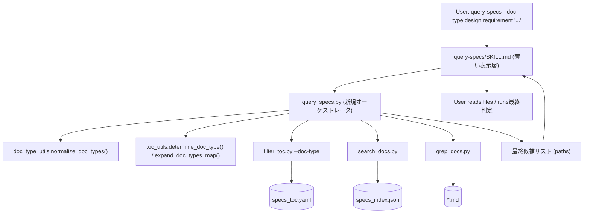
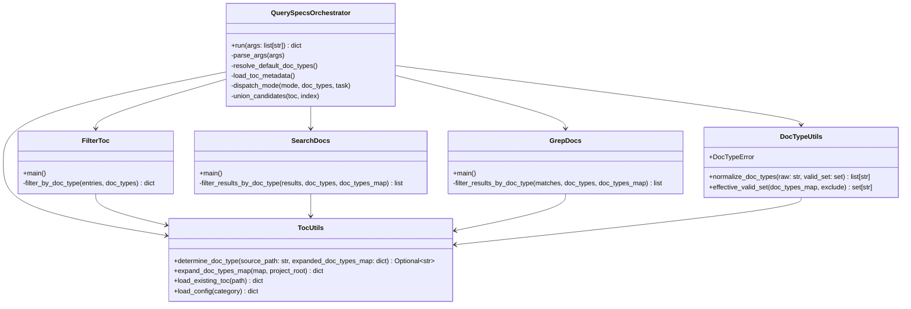
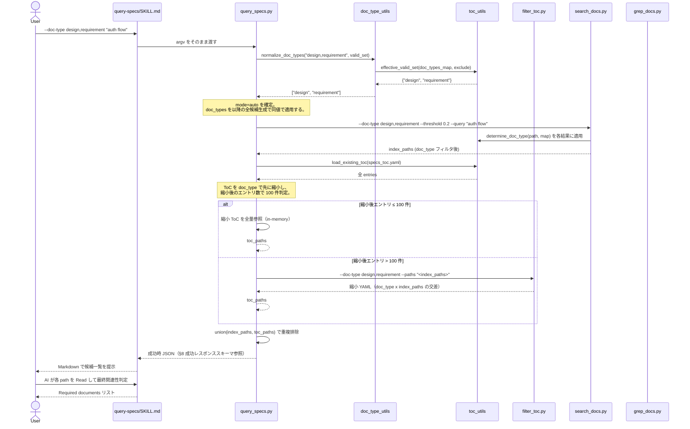
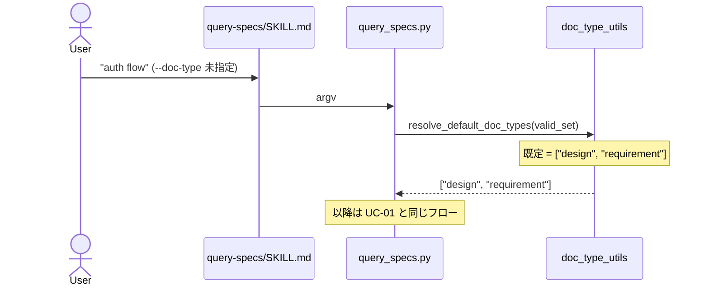
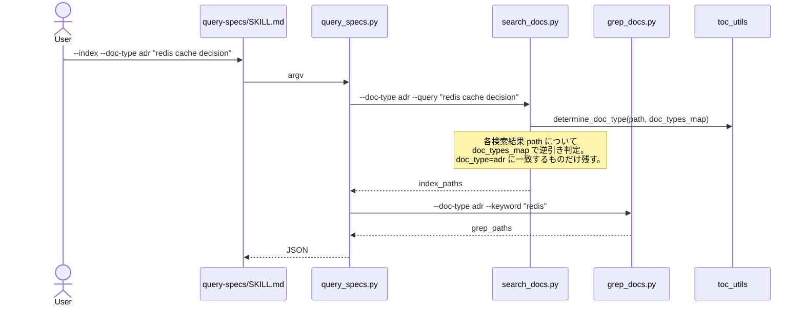
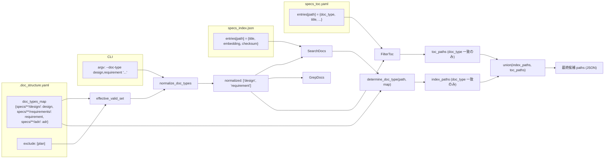

# DES-026 doc_type 絞り込み検索 設計書（feature: add-adr）

## メタデータ

| 項目     | 値                                                             |
| -------- | -------------------------------------------------------------- |
| 設計ID   | DES-026                                                        |
| 関連要件 | FNC-004（主）、FNC-001 / FNC-002 / FNC-003 / NFR-001 / REQ-001 |
| 関連設計 | DES-005（ToC 生成フロー）、DES-006（セマンティック検索）       |
| 作成日   | 2026-04-30                                                     |

## 1. 概要

`query-specs` SKILL に `--doc-type` 引数を追加し、ToC / Index / auto の 3 モード全てで同一意味の doc_type 絞り込みを実現する。あわせて ADR を `doc_type=adr` として既存 specs に同居させる構成を確立する。設計上のキー判断は次の 3 点である:

1. **doc_type 適用順序**: 引数正規化 → doc_type フィルタを `auto` 経路の **最初**に適用し、しきい値判定（100 件超）と統合を縮小済み集合で行う。これにより「判定対象 = 最終扱い対象」が一致し、判定段階での false negative 発生要因（フィルタ前後で集合がずれる現象）を構造的に排除する方針を採る。最終的な精度確認は §11.4 のゴールデンセット品質テストで行う。
2. **分岐ロジックを script に集約**: モード判定・しきい値判定・doc_type 既定値補完・統合の 4 軸分岐を、新規オーケストレータ script `query_specs.py` に閉じ込め、`query-specs/SKILL.md` は引数を渡し結果を表示するだけに薄くする。AI workflow から再現性のない条件分岐を排除する。
3. **Index 経路の doc_type 判定（TBD-005 解決）**: Index JSON 自体は doc_type を持たないため、検索結果の path 列に対して `.doc_structure.yaml` の `doc_types_map` 由来の path → doc_type 解決関数（`determine_doc_type`）を適用して事後フィルタする。これにより Index スキーマ拡張・全 Index 再構築を回避しつつ、ToC 経路（entry.doc_type 比較）と意味的に同一のフィルタを実現する。

## 2. アーキテクチャ概要

### 2.1 レイヤー構成



| レイヤー | 責務                                                                                   | 該当ファイル                                                                                        |
| -------- | -------------------------------------------------------------------------------------- | --------------------------------------------------------------------------------------------------- |
| 表示層   | 引数を受け取り、結果を Markdown で出力する。AI による最終関連性判定（候補 Read）も担う | `plugins/doc-advisor/skills/query-specs/SKILL.md`                                                   |
| 制御層   | 引数解析・正規化・既定値補完・モード分岐・しきい値判定・候補統合                       | `plugins/doc-advisor/scripts/query_specs.py`（新規）                                                |
| 共通層   | doc_type 値検証、`doc_types_map` 展開、path → doc_type 解決                            | `plugins/doc-advisor/scripts/doc_type_utils.py`（新規）/ `plugins/doc-advisor/scripts/toc_utils.py` |
| 検索層   | ToC / Index / grep に対する候補生成。各々が doc_type フィルタを適用する                | `filter_toc.py`（修正）/ `search_docs.py`（修正）/ `grep_docs.py`（修正）                           |
| データ層 | `.doc_structure.yaml` / `specs_toc.yaml` / `specs_index.json` / 個別 md ファイル       | プロジェクトデータ                                                                                  |

### 2.2 責務境界の確定

要件 §機能要件 — 検索網羅性の保証 末尾の脚注「内部処理フロー（経路選択順序・Index 候補との統合順序など）は設計書（DES-006）で規定する」を本設計書で具体化する。

| 判断項目                           | 旧（plan 課題提起時）                          | 新（本設計）                                                   |
| ---------------------------------- | ---------------------------------------------- | -------------------------------------------------------------- |
| モード判定                         | SKILL.md の AI が `--toc` / `--index` を解釈   | `query_specs.py` の argparse                                   |
| 100 件しきい値判定                 | SKILL.md の AI が `metadata.file_count` を確認 | `query_specs.py` が ToC を Read して判定                       |
| `--doc-type` 既定値補完            | （未定義）                                     | `query_specs.py` が `design,requirement` を補う                |
| Index 候補と ToC 候補の union      | SKILL.md の AI が手動で union                  | `query_specs.py` が dict / set で統合                          |
| doc_type フィルタ適用              | （未定義）                                     | `query_specs.py` が **mode 分岐の前**に ToC ヘッダから絞り込み |
| 候補ファイル Read と最終関連性判定 | SKILL.md の AI                                 | SKILL.md の AI（変更なし）                                     |

## 3. モジュール設計

### 3.1 モジュール一覧

| モジュール名                   | パス                                               | 責務                                                                                                                                                                                                                                                                                                                | 依存                                                                    | 区分 |
| ------------------------------ | -------------------------------------------------- | ------------------------------------------------------------------------------------------------------------------------------------------------------------------------------------------------------------------------------------------------------------------------------------------------------------------- | ----------------------------------------------------------------------- | ---- |
| `query-specs/SKILL.md`         | `plugins/doc-advisor/skills/query-specs/SKILL.md`  | 引数を `query_specs.py` にそのまま渡し、JSON 結果を Markdown 表に整形する。`argument-hint` を `[--toc\|--index] [--doc-type TYPE[,TYPE...]] task description` に更新し、未指定時 default の `design,requirement` を本文に明示する。最終関連性判定（候補 Read）は AI が担う                                          | `query_specs.py`                                                        | 修正 |
| `query_specs.py`               | `plugins/doc-advisor/scripts/query_specs.py`       | オーケストレータ。引数解析、`--doc-type` 正規化・既定値補完、モード分岐、ToC サイズ判定、候補生成サブ script の呼び出し、union、結果 JSON 出力。サブ script との依存契約は §3.3 を参照                                                                                                                              | `doc_type_utils`, `toc_utils`, `filter_toc`, `search_docs`, `grep_docs` | 新規 |
| `toc_utils.determine_doc_type` | `plugins/doc-advisor/scripts/toc_utils.py`         | `create_pending_yaml.py` から移設。`(source_path: str, expanded_doc_types_map: dict[str, str]) -> Optional[str]` を正式 API として公開。入力は project_root 相対の正規化済みパス（ファイル or ディレクトリ）、判定規則は最長 prefix match、未一致時 `None`。3 経路（ToC 生成 / 検索 ToC / Index・grep）から共通利用 | `toc_utils` 既存                                                        | 移設 |
| `doc_type_utils.py`            | `plugins/doc-advisor/scripts/doc_type_utils.py`    | `--doc-type` 値の正規化（trim / 重複除去 / 空要素検出 / case-sensitive 検証）と有効値集合の算出（`doc_types_map` − `exclude`）                                                                                                                                                                                      | `toc_utils`                                                             | 新規 |
| `filter_toc.py`                | `plugins/doc-advisor/scripts/filter_toc.py`        | 既存責務に加え、`--doc-type` を受け取って ToC エントリを doc_type で絞り込む                                                                                                                                                                                                                                        | `toc_utils`                                                             | 修正 |
| `search_docs.py`               | `plugins/doc-advisor/scripts/search_docs.py`       | 既存責務に加え、`--doc-type` を受け取って Index 検索結果を path → doc_type で事後フィルタする                                                                                                                                                                                                                       | `toc_utils.determine_doc_type`                                          | 修正 |
| `grep_docs.py`                 | `plugins/doc-advisor/scripts/grep_docs.py`         | 既存責務に加え、`--doc-type` を受け取って grep 結果を path → doc_type で事後フィルタする                                                                                                                                                                                                                            | `toc_utils.determine_doc_type`                                          | 修正 |
| `query_toc_workflow.md`        | `plugins/doc-advisor/docs/query_toc_workflow.md`   | `filter_toc.py` 起動コマンド例に `--doc-type` を追記。**所有境界の注記必須**: 「`--doc-type` は `query-specs` 経由でのみ使用される。`query-rules` SKILL は `--doc-type` を提供しないため、rules カテゴリではこのオプションは渡されない」（FNC-004 §スコープ外との整合のため）                                       | -                                                                       | 修正 |
| `query_index_workflow.md`      | `plugins/doc-advisor/docs/query_index_workflow.md` | `search_docs.py` / `grep_docs.py` 起動コマンド例に `--doc-type` を追記。**所有境界の注記必須**: 上記 `query_toc_workflow.md` と同じ specs 専用注記を追加する                                                                                                                                                        | -                                                                       | 修正 |
| `toc_format.md`                | `plugins/doc-advisor/docs/toc_format.md`           | ADR ハンドリング指針節（§ADR Mapping）を追補。FNC-004 §文書要件 を満たす                                                                                                                                                                                                                                            | -                                                                       | 修正 |
| `.doc_structure.yaml`          | プロジェクトルート                                 | `specs.root_dirs` / `specs.doc_types_map` に ADR 配置先を追加                                                                                                                                                                                                                                                       | -                                                                       | 修正 |

### 3.2 クラス図



### 3.3 サブ script 呼び出し契約（query_specs.py ↔ filter_toc / search_docs / grep_docs）

`query_specs.py` は候補生成サブ script を **subprocess.run（同一 Python 実行系、`shell=False`、`capture_output=True`、`text=True`）** で呼び出す。Python import ではなく subprocess を採用する理由: (a) 既存サブ script の CLI 契約を維持し独立実行を可能にする、(b) 検索層を将来別言語/別実行系に差し替える際にも制御層を変更しない結合度を保つ、(c) 既存ワークフロー文書のコマンド例と整合させる。

**入出力契約（成功・失敗ケース別）**:

| 子 script        | returncode                                   | stdout 形式                                          | stderr | 解釈規則                                                                                                                                                    |
| ---------------- | -------------------------------------------- | ---------------------------------------------------- | ------ | ----------------------------------------------------------------------------------------------------------------------------------------------------------- |
| `filter_toc.py`  | 0                                            | YAML（`render_subset_yaml` 出力）                    | 空     | `toc_utils.parse_toc_subset_yaml`（本 feature で新設、§3.4 の補助 API）で読み、`docs` キー配下のパスを candidate に変換。`missing_paths` を warnings に保持 |
| `filter_toc.py`  | !=0                                          | `{"status": "error", ...}` JSON                      | -      | `--toc` / `auto` 両モードで上位に伝播し `status: error` を返す（auto は ToC 必須のため代替なし。§8.3 と整合）                                               |
| `search_docs.py` | 0                                            | `{"status": "ok", "query", "results": [...]}` JSON   | 空     | `results[].path` を candidate に変換                                                                                                                        |
| `search_docs.py` | !=0 + `Model mismatch`                       | `{"status": "error", ...}` JSON                      | -      | `embed_docs.py --full` を 1 回だけ実行して再構築 → 1 回のみリトライ。失敗時は §8.3 の mode 別規則に従う                                                     |
| `search_docs.py` | !=0 + `API error` / `OPENAI_API_KEY not set` | `{"status": "error", ...}` JSON                      | -      | mode 別規則は §8.3 を参照（`mode=index` は status:error、`mode=auto` はフォールバック）                                                                     |
| `search_docs.py` | 任意 + 非 JSON 出力                          | （任意）                                             | -      | `status: error` 扱い。元出力を `error` フィールドに格納。mode 別規則は §8.3 を参照                                                                          |
| `grep_docs.py`   | 0                                            | `{"status": "ok", "keyword", "results": [...]}` JSON | 空     | `results[].path` を candidate に変換                                                                                                                        |
| `grep_docs.py`   | !=0                                          | `{"status": "error", ...}` JSON                      | -      | 空候補で続行（`warnings` に記録）                                                                                                                           |

**共通候補表現（query_specs.py 内部）**:

```python
Candidate = TypedDict("Candidate", {
    "path": str,                # project_root 相対パス
    "source": Literal["toc", "index", "grep"],
    "score": Optional[float],   # search_docs のみ。toc/grep は None
})
```

**形式変換の責務境界**: 各 CLI の stdout 形式の差分（YAML / JSON）と終了コード意味は **`query_specs.py` 内の adapter 層が吸収する**。SKILL.md / 検索層は変換ロジックを知らない。これにより検索層差し替え時に SKILL.md / 制御層インターフェースが安定する。

**stderr 警告の扱い**: 子 script の stderr 出力（および `toc_utils.get_all_md_files` の警告。§9.1 参照）は `query_specs.py` 側で集約し、最終 JSON の `warnings` フィールドに格納する。SKILL.md は warnings をユーザーに表示する。

**Model mismatch リトライ抑止**: 1 サイクルあたり最大 1 回（無限ループ抑止）。リトライ後も失敗したら空候補で続行する。

### 3.4 toc_utils.determine_doc_type の API 契約

`toc_utils.py` に移設後の正式 API。3 経路（ToC 生成 / 検索 ToC / 検索 Index・grep）すべてが本関数を通じて path → doc_type 解決を行う。

| 項目       | 値                                                                                                                           |
| ---------- | ---------------------------------------------------------------------------------------------------------------------------- |
| シグネチャ | `determine_doc_type(source_path: str, expanded_doc_types_map: dict[str, str]) -> Optional[str]`                              |
| 入力 1     | `source_path`: project_root 相対の正規化済みパス（ファイル or ディレクトリ）。`os.path.normpath` + `as_posix()` 適用後を想定 |
| 入力 2     | `expanded_doc_types_map`: `expand_doc_types_map` で glob 展開済みの dict。キーは末尾スラッシュ付きディレクトリパス           |
| 戻り値     | 一致した `doc_type` 文字列、または一致なしのとき `None`                                                                      |
| 判定規則   | **最長 prefix match**。両辺末尾スラッシュ統一の上で `source_path.startswith(map_key)` を満たすキーのうち最長のものを採用     |
| 副作用     | なし（純粋関数）。同じ入力に対して常に同じ出力（決定論的）                                                                   |
| 例外       | 投げない。一致なしは `None` で表現する                                                                                       |

**呼び出し側の責務**: `None` が返ったエントリは結果から除外する（エラーにしない）。これは ADR ディレクトリ未作成時の `--doc-type adr` シナリオ（§9.1 / §11.2）と整合する。

**補助 API（本 feature で新設）**: `toc_utils.parse_toc_subset_yaml(content: str) -> dict`

| 項目       | 値                                                                                                                                                            |
| ---------- | ------------------------------------------------------------------------------------------------------------------------------------------------------------- |
| シグネチャ | `parse_toc_subset_yaml(content: str) -> dict`                                                                                                                 |
| 入力       | `filter_toc.render_subset_yaml` 出力相当の YAML 文字列。`docs:` 配下に複数 path を持つ ToC subset 形式                                                        |
| 戻り値     | `{"docs": {path: entry_dict, ...}, "missing_paths": [str, ...]}` 形式の dict。`docs` 配下のパス一覧、および `filter_toc.py` が出力した `missing_paths` を保持 |
| 責務       | ToC subset stdout 解析（複数 entry 対応）。pending entry file 用の既存 `parse_simple_yaml`（単一 entry 専用）とは別 API として明確に分離する                  |
| 例外       | YAML 構文不正時は `ValueError` を送出                                                                                                                         |

`query_specs.py` adapter 層は本関数で stdout を解釈し、`docs` キー配下のパスを candidate に変換、`missing_paths` を warnings に積む（§3.3）。

## 4. ユースケース設計

### 4.1 ユースケース一覧

| ID    | ユースケース                        | 説明                                                                |
| ----- | ----------------------------------- | ------------------------------------------------------------------- |
| UC-01 | auto モード + `--doc-type` 指定     | 既定の auto モードで複数 doc_type を OR 結合した検索を行う          |
| UC-02 | toc モード + `--doc-type` 指定      | ToC のみを使って doc_type 絞り込みを行う                            |
| UC-03 | index モード + `--doc-type` 指定    | Index と grep のみを使って doc_type 絞り込みを行う                  |
| UC-04 | `--doc-type` 未指定（既定値適用）   | 旧来の暗黙挙動（`design,requirement`）を顕在化する                  |
| UC-05 | 不正な `--doc-type` 値              | 未定義値・空要素・case 不一致をエラーで通知する                     |
| UC-06 | `--doc-type adr` で ADR 検索        | ADR 配置パスから ToC 化された `doc_type=adr` エントリのみを取得する |
| UC-07 | ToC 不在 + `--index` + `--doc-type` | Index 結果に対して path → doc_type 解決で事後フィルタを適用する     |

### 4.2 シーケンス図 — UC-01（auto モード + `--doc-type`）



**前提条件**: `.doc_structure.yaml` に `specs.doc_types_map` が定義されていること。`OPENAI_API_KEY` は任意（無ければ Index 候補が空となり、ToC 経路のみで動作）。

**正常フロー**: 上記シーケンス通り。

**エラーフロー**: `normalize_doc_types` がエラー（未定義値・空要素・case 不一致）を返した場合、`query_specs.py` は `{"status": "error", "error": "...", "valid_doc_types": [...]}` を JSON で出力して非 0 終了する。SKILL は JSON を受けてエラーメッセージと有効値集合をユーザーに提示する。

### 4.3 シーケンス図 — UC-04（既定値適用）



**設計判断**: 既定値の補完は `query_specs.py` 内で行う。`.doc_structure.yaml` の `exclude` は SKILL の母集合定義（要件で確定）であり、`--doc-type` 既定値はその母集合のうち `design,requirement` を採るユーザー向け既定。両者は別の役割を担う。

### 4.4 シーケンス図 — UC-07（ToC 不在 + `--index` + `--doc-type`）



**設計判断（TBD-005 解決）**: Index JSON は `entries[path] = {title, embedding, checksum}` のみで `doc_type` を持たない。この事実から以下を採用する。

- **採用**: 検索結果の path に対して `toc_utils.determine_doc_type(source_path, expanded_doc_types_map)` を適用する事後フィルタ方式（API 契約は §3.4 で確定）
- **不採用 A**: Index スキーマに `doc_type` を追加（`embed_docs.py` 拡張、全 Index 再構築が必要）
- **不採用 B**: ToC を経由して entry.doc_type を引く（ToC 不在環境では成立しない）

採用案の利点:

- `embed_docs.py` / Index の出力スキーマを変更しない（後方互換）
- ToC が存在しなくても ToC 経路（entry.doc_type）と意味的に同一の判定（同じ `doc_types_map` 経由で算出）を狙える
- ToC 生成側（`create_pending_yaml.py`）も同じ `determine_doc_type` を経由するよう書き換える（§5 / §12 Step 1）。3 経路すべてが同一定義を踏み、再現性要件への構造的根拠を担保する

**入力の取り扱い**: 現行の `create_pending_yaml.determine_doc_type` は `root_dir_name`（ディレクトリ名単位）を入力とする実装だが、Index/grep 経路の事後フィルタは「検索結果のフルパス」を入力とする必要がある。両者を共通 API でカバーするため、移設後 API は **入力をフルパス（または末尾スラッシュ付きディレクトリ）として受理**し、**最長 prefix match** で判定する（§3.4）。これにより `docs/specs/foo/design/file.md` のような source_file フルパスでも `docs/specs/foo/design/` キーに正しく一致する。

## 5. 使用する既存コンポーネント

| コンポーネント                                      | ファイルパス                                         | 用途                                                                                                                                                                                                                                                                                                                                                                                           |
| --------------------------------------------------- | ---------------------------------------------------- | ---------------------------------------------------------------------------------------------------------------------------------------------------------------------------------------------------------------------------------------------------------------------------------------------------------------------------------------------------------------------------------------------- |
| `toc_utils.load_existing_toc`                       | `plugins/doc-advisor/scripts/toc_utils.py`           | `query_specs.py` が ToC YAML を読み込んでエントリを doc_type で絞り込み、しきい値判定する                                                                                                                                                                                                                                                                                                      |
| `toc_utils.load_config` / `init_common_config`      | `plugins/doc-advisor/scripts/toc_utils.py`           | `.doc_structure.yaml` を読み込み `doc_types_map` / `exclude` を取得する                                                                                                                                                                                                                                                                                                                        |
| `toc_utils.expand_doc_types_map`                    | `plugins/doc-advisor/scripts/toc_utils.py`           | glob パターンを実際のディレクトリに展開する。Index 経路の path → doc_type 解決でも同じ展開済 map を使う                                                                                                                                                                                                                                                                                        |
| `create_pending_yaml.determine_doc_type`            | `plugins/doc-advisor/scripts/create_pending_yaml.py` | path → doc_type の正解判定。**`toc_utils.py` に移設し新 API（§3.4: `(source_path, expanded_doc_types_map) -> Optional[str]`、最長 prefix match、未一致 None）として再定義**して 3 経路（ToC 生成 / 検索 ToC / Index・grep）から共通利用する。`create_pending_yaml.py` 側の旧定義は削除し、ToC 生成パスでも新 API を呼び出すよう呼び出し側を修正する（§12 Step 1）。移設は本 feature の作業範囲 |
| `filter_toc.render_subset_yaml`                     | `plugins/doc-advisor/scripts/filter_toc.py`          | 既存の縮小 YAML 出力ロジックを再利用。`--doc-type` フィルタは `main` の `filtered = {p: docs[p] for p in requested if p in docs}` 直前に挿入する                                                                                                                                                                                                                                               |
| `tests/doc_advisor/scripts/test_filter_toc.py`      | プロジェクトルート                                   | `FilterTocTestBase`、`render_subset_yaml` 単体、CLI 統合、Edge Case の各テストパターンを踏襲して `--doc-type` 用テストを追加                                                                                                                                                                                                                                                                   |
| `query_toc_workflow.md` / `query_index_workflow.md` | `plugins/doc-advisor/docs/`                          | 既存ワークフロー文書。コマンド例の `--doc-type` 注記追記のみ                                                                                                                                                                                                                                                                                                                                   |

新規作成しない判断（理由含む）:

- doc_type フィルタ適用クラスを新設しない: 既存の path 比較ロジックで足りる。クラス化は責務超過で YAGNI
- Index へのメタ追加 script を新設しない: §4.4 の設計判断により不要

### 5.1 既存パーサ・有効値集合算出の整合性確保（前提条件）

§9.1 の `.doc_structure.yaml` サンプルおよび 3 経路の path → doc_type 判定が現行コードベース上で機能するため、本 feature の作業範囲に以下を含める。

| 対象                                            | 修正方針                                                                                                                                                                                                                                                                                                                                                                                                                              |
| ----------------------------------------------- | ------------------------------------------------------------------------------------------------------------------------------------------------------------------------------------------------------------------------------------------------------------------------------------------------------------------------------------------------------------------------------------------------------------------------------------- |
| `toc_utils._parse_config_yaml` の dict key 処理 | 現行実装は `key, _, value = stripped.partition(':'); key = key.strip()` のみで、quote 文字 `"` `'` を除去しないため、サンプルの quoted key `"docs/specs/**/design/"` が dict key にそのまま残り `expand_doc_types_map` が 0 件展開する。本 feature で **key の quote 除去（`key.strip().strip('"\'')`）** をパーサに追加する                                                                                                          |
| 有効値集合（`effective_valid_set`）の算出元     | **raw `doc_types_map` のキー由来の値集合**（`exclude` を除いた集合）から算出する。glob 展開後の `expand_doc_types_map` 結果ではない。これにより ADR ディレクトリ未作成時も `adr` が有効値として認識される（§9.1 / §11.2 のシナリオ参照）                                                                                                                                                                                              |
| path → doc_type 解決                            | **glob 展開済 map（`expand_doc_types_map` 結果）** を使う。一致がない path は `None`（= 結果から除外、エラーにしない）                                                                                                                                                                                                                                                                                                                |
| 共有 API `toc_utils.determine_doc_type` の契約  | **map-only**（`doc_types_map` のみで判定、未一致時 `None`）。FNC-004 §機能要件 — ADR の検索対象登録 が要求する「`doc_types_map` 登録で定義し、未登録なら未定義値エラー」と整合させ、設定外の推論ポリシー（キーワードフォールバック等）を共有 resolver に持たせない。これにより `.doc_structure.yaml` → `expand_doc_types_map` → resolver の依存方向を保つ。3 経路（ToC 生成 / ToC 検索 / Index・grep）は必ず本 map-only 新 API を使う |
| `create_pending_yaml.DOC_TYPE_KEYWORDS` の扱い  | 共有 API には組み込まない。legacy wrapper として残す場合は、`create_pending_yaml.py` 内の **別名関数（例: `legacy_determine_doc_type_with_keywords`）に隔離** し、共有 `toc_utils.determine_doc_type` とは明確に分離する。ToC 生成パイプラインは共有 map-only API へ書き換える（§9.3 / §12 Step 1）                                                                                                                                   |
| `toc_utils.get_all_md_files` の警告出力         | 現行実装は `print(f"Warning: {root_dir} does not exist, skipping")` を **stdout** に出力するため、`query_specs.py` の stdout JSON 契約を汚染する。本 feature で **stderr へ出力先を変更**する（または無警告 skip + warnings 集約に統一）                                                                                                                                                                                              |

これらは ADR 配置・3 経路共通化を成立させる構造的前提であり、Step 1（§12）の作業に含める。

## 6. データフロー設計

### 6.1 データの流れ（auto モード + `--doc-type` 指定時）



### 6.2 doc_type の決定経路（3 ルート整合）

| ルート               | 値の決定方法                                                                                  | 判定タイミング       |
| -------------------- | --------------------------------------------------------------------------------------------- | -------------------- |
| ToC entry.doc_type   | `toc_utils.determine_doc_type(source_path, expanded_doc_types_map)`（移設後 API）で生成時決定 | ToC 構築時に確定     |
| Index 経路の事後判定 | `toc_utils.determine_doc_type(source_path, expanded_doc_types_map)` で検索結果 path から計算  | 検索実行時に動的算出 |
| grep 経路の事後判定  | 同上                                                                                          | 検索実行時に動的算出 |

**整合性の根拠**: 3 ルートはすべて同じ `.doc_structure.yaml` の `doc_types_map`（v3.0 形式、`expand_doc_types_map` で glob 展開済）を入力とする。`determine_doc_type(source_path, expanded_doc_types_map)` は決定論的純粋関数（同じ入力に対して常に同じ出力）であり（§3.4）、ToC 生成時 / 検索時で結果が一致する。**3 ルートが同一定義を踏むことを保証するため**、ToC 生成側（`create_pending_yaml.py`）も同関数を呼び出す形にリファクタする（§5 / §12 Step 1）。テスト設計上は同等性ユニットテスト（同じパス入力に対して 3 経路が同じ doc_type を返す）を §11.1 に追加する。

## 7. 状態管理設計

`query_specs.py` は stateless な CLI script として設計する。引数解析・ToC / Index 読込・候補生成・統合・JSON 出力をワンショットで完了し、内部状態は呼び出し間で持ち越さない。

| 状態種別                      | 保持場所                           | 永続化         |
| ----------------------------- | ---------------------------------- | -------------- |
| `.doc_structure.yaml` 設定値  | プロジェクトルート                 | 永続           |
| `specs_toc.yaml` の docs      | `.claude/doc-advisor/toc/specs/`   | 永続           |
| `specs_index.json` の entries | `.claude/doc-advisor/index/specs/` | 永続           |
| 検索結果（候補 paths）        | プロセス内変数                     | 一時（捨てる） |

## 8. エラーハンドリング設計

`query_specs.py` は標準出力に JSON のみを出力する（SKILL.md がパースするため）。stderr は子 script 経由の警告集約用で SKILL.md は読まない。

### 8.1 成功レスポンス JSON スキーマ

FNC-002 の「false negative ゼロを追跡できる」要件・FNC-004 のエラーケース完全列挙の要請に対し、可観測性フィールドを設計時点で確定する。`query_specs.py` 成功時は以下のスキーマで stdout に JSON を出力する。

```json
{
  "status": "ok",
  "mode_requested": "auto|toc|index",
  "mode_effective": "auto|toc|index",
  "doc_types_requested": ["design", "requirement"],
  "doc_types_applied": ["design", "requirement"],
  "doc_types_default_applied": false,
  "toc_total_count": 142,
  "toc_filtered_count": 38,
  "index_status": "ok|skipped|error",
  "index_error": null,
  "grep_status": "ok|skipped|error",
  "fallbacks": ["index_unavailable_used_toc_only"],
  "warnings": ["doc_type=adr matched no directory"],
  "missing_paths": [],
  "candidate_sources": {
    "docs/specs/foo/design/DES-001_design.md": ["toc", "index"],
    "docs/specs/foo/requirements/FNC-001_spec.md": ["toc"]
  },
  "paths": ["docs/specs/foo/design/DES-001_design.md", "..."]
}
```

| フィールド                  | 型                               | 説明                                                                           |
| --------------------------- | -------------------------------- | ------------------------------------------------------------------------------ |
| `status`                    | `"ok"` 固定                      | 成功                                                                           |
| `mode_requested`            | string                           | ユーザー指定 mode（`auto` / `toc` / `index`）                                  |
| `mode_effective`            | string                           | 実際に動作した mode。フォールバック後の値                                      |
| `doc_types_requested`       | list[string]                     | ユーザーが渡した値（既定値補完前の状態。未指定時は空）                         |
| `doc_types_applied`         | list[string]                     | 実際に適用された値（既定値補完後）                                             |
| `doc_types_default_applied` | bool                             | `true` のとき既定値（`design,requirement`）を補完した                          |
| `toc_total_count`           | int                              | doc_type 適用前の ToC エントリ数                                               |
| `toc_filtered_count`        | int                              | doc_type 適用後の ToC エントリ数                                               |
| `index_status`              | `"ok"` / `"skipped"` / `"error"` | Index 利用結果                                                                 |
| `index_error`               | string \| null                   | Index 失敗時の内訳（Model mismatch / API error / 非 JSON など）                |
| `grep_status`               | 同 `index_status`                | grep 利用結果                                                                  |
| `fallbacks`                 | list[string]                     | 発動したフォールバック識別子                                                   |
| `warnings`                  | list[string]                     | 子 script の stderr / `get_all_md_files` の警告 / 「ADR ディレクトリ未作成」等 |
| `missing_paths`             | list[string]                     | `filter_toc.py` の `missing_paths` を保持                                      |
| `candidate_sources`         | dict[path, list[source]]         | 候補ごとの由来。`source ∈ {"toc", "index", "grep"}`                            |
| `paths`                     | list[string]                     | 最終候補（重複排除済）                                                         |

SKILL.md はこのうち `paths` を Markdown 表として整形し、`warnings` / `fallbacks` をユーザーに表示する。`mode_effective` / `doc_types_applied` / `doc_types_default_applied` は既定値が動いたことの可視化に使う。

### 8.2 エラーレスポンス JSON スキーマ

```json
{
  "status": "error",
  "error": "Invalid doc_type: 'Design'. Use lowercase, no aliases.",
  "valid_doc_types": ["design", "requirement"]
}
```

| 条件（FNC-004 §エラーケース）                                | `query_specs.py` 動作                                                                          | 終了コード |
| ------------------------------------------------------------ | ---------------------------------------------------------------------------------------------- | ---------- |
| `--doc-type` 値が `doc_types_map` に未定義（exclude 適用後） | `status: error`、有効値集合を返却                                                              | 1          |
| `--doc-type` 値が空文字列                                    | `status: error`、構文ヘルプを返却                                                              | 1          |
| `--doc-type` 値内に空要素                                    | `status: error`、該当位置を明示                                                                | 1          |
| `--doc-type` 大文字小文字不一致                              | `status: error`、未定義値扱い、有効値集合を返却                                                | 1          |
| `--doc-type` 適用後 ToC + Index 双方 0 件                    | `status: ok`、`paths: []`                                                                      | 0          |
| `--doc-type adr` + ADR ディレクトリ未作成（glob 0 件展開）   | `status: ok`、`paths: []`、`warnings: ["doc_type=adr matched no directory"]`（§9.1 で詳述）    | 0          |
| `--doc-type` 多値で一部未定義                                | `status: error`、未定義値を明示                                                                | 1          |
| ToC 不在 + Index 利用不可                                    | `status: error`、`/doc-advisor:create-specs-toc` または `OPENAI_API_KEY` 設定を案内            | 1          |
| `--doc-type` のみでタスク説明が無い                          | `status: error`、構文 `query-specs [--toc\|--index] [--doc-type TYPE[,TYPE...]] <task>` を返却 | 1          |

### 8.3 サブ script 失敗時の扱い（subprocess エラー継承）

`query_specs.py` が呼び出す `search_docs.py` / `filter_toc.py` / `grep_docs.py` の失敗を mode 別に集約する規則。詳細な入出力契約は §3.3 にある。DES-006 §10.5 / §10.7 と整合させ、`mode=index` は Index 必須・`mode=auto` は ToC 必須の前提で扱う。

| 子 script        | returncode + 状況                            | mode=auto                                                                                                                                                          | mode=index                                                                                                  | mode=toc                                  |
| ---------------- | -------------------------------------------- | ------------------------------------------------------------------------------------------------------------------------------------------------------------------ | ----------------------------------------------------------------------------------------------------------- | ----------------------------------------- |
| `search_docs.py` | 0 / `status:ok`                              | 候補に統合 / `index_status=ok`                                                                                                                                     | 候補に統合 / `index_status=ok`                                                                              | 呼ばない                                  |
| `search_docs.py` | !=0 / `Model mismatch`                       | `embed_docs.py --full` 再構築 → 1 回リトライ → 成功で統合。**失敗時は doc_type 適用後 ToC 全量 Read にフォールバック** / `index_status=error` / `fallbacks` に記録 | `embed_docs.py --full` 再構築 → 1 回リトライ → **失敗時は status:error で返す**（フォールバックしない）     | -                                         |
| `search_docs.py` | !=0 / `API error` / `OPENAI_API_KEY not set` | **doc_type 適用後 ToC 全量 Read にフォールバック** / `index_status=error` / `index_error` に記録（DES-006 §10.7 と整合: auto は ToC で代替可能）                   | **status:error で返す**（DES-006 §10.5 / §10.7: index モードは Index 必須・代替不可）                       | -                                         |
| `search_docs.py` | 任意 / 非 JSON 出力                          | doc_type 適用後 ToC 全量 Read にフォールバック / `index_status=error` / 元出力を `index_error` に格納                                                              | status:error で返す / 元出力を `error` フィールドに格納                                                     | -                                         |
| `filter_toc.py`  | 0 / YAML                                     | 縮小 ToC として採用                                                                                                                                                | -                                                                                                           | 採用                                      |
| `filter_toc.py`  | !=0 / `status:error`                         | **status:error で返す**（auto は ToC が候補母集合のため、ToC 取得不能なら推論不可）                                                                                | -                                                                                                           | **status:error で返す**（ToC モード必須） |
| `grep_docs.py`   | 0 / `status:ok`                              | 候補に統合 / `grep_status=ok`                                                                                                                                      | 候補に統合 / `grep_status=ok`                                                                               | -                                         |
| `grep_docs.py`   | !=0 / `status:error`                         | 空候補で続行 / `grep_status=error` / `warnings` に記録                                                                                                             | 空候補で続行 / `grep_status=error` / `warnings` に記録（grep は補助経路のため、Index が生きていれば継続可） | -                                         |

**フォールバック識別子（`fallbacks` フィールドに記録）**:

- `index_unavailable_used_toc_only`: `mode=auto` で Index 利用不可（API キー未設定 / API error / Model mismatch リトライ後失敗 / 非 JSON 出力）→ doc_type 適用後 ToC 全量 Read にフォールバックした場合

**subprocess 起動方式**: `subprocess.run([...], shell=False, capture_output=True, text=True)` を統一して使用。

**stderr の集約**: 子 script の stderr 出力（および `toc_utils.get_all_md_files` の警告。§5.1 / §9.1 参照）はすべて `query_specs.py` 側で `warnings` に集約する。

**Model mismatch リトライ抑止**: 1 サイクルあたり最大 1 回（無限ループ防止）。`mode=auto` ではリトライ後も失敗したら ToC 全量 Read にフォールバックし `index_status=error` を立てる。`mode=index` ではリトライ後も失敗したら status:error を返す。

**参照**: DES-006 §10.5（`--index` 単独指定時のエラー扱い）/ DES-006 §10.7（`mode=auto` の Index 不在フォールバック）。

## 9. ADR ハンドリング設計

### 9.1 配置パス（FNC-004 §機能要件 — ADR の検索対象登録 確定）

ADR は specs カテゴリ配下に **`docs/specs/{plugin}/adr/` の新ディレクトリ** を設けて配置する。`.doc_structure.yaml` に以下を追加する:

```yaml
specs:
  root_dirs:
    - "docs/specs/**/design/"
    - "docs/specs/**/plan/"
    - "docs/specs/**/requirements/"
    - "docs/specs/**/adr/"
  doc_types_map:
    "docs/specs/**/design/": design
    "docs/specs/**/plan/": plan
    "docs/specs/**/requirements/": requirement
    "docs/specs/**/adr/": adr
  patterns:
    target_glob: "**/*.md"
    exclude: [plan]
```

**設計判断**: 既存 `design/` ディレクトリへの同居案（`docs/specs/**/design/` 配下に ADR を混在させる）と比較して、新規 `adr/` ディレクトリ案を採用する。理由:

- ADR と通常設計書は寿命が異なる（ADR は決定済の意思決定、設計書は活きた実装ガイド）。`doc_type` で区別可能でも、**ファイル列挙時の人間視認性** を確保したい
- `doc_types_map` のキー単位で doc_type が決まるため、新規ディレクトリ案のほうが glob 衝突を起こさない
- `exclude: [plan]` の母集合定義との整合性（`adr` は exclude しないため母集合に含まれる）

**現行パーサ前提条件（§5.1 と連動）**: 上記 YAML サンプルの quoted key（例: `"docs/specs/**/design/"`）は、現行 `toc_utils._parse_config_yaml()` ではクォートが残存し `expand_doc_types_map()` が 0 件展開する。本 feature では §5.1 に示す「dict key の quote 除去」をパーサに追加した上でこのサンプルを採用する。

**ADR ディレクトリ未作成時の挙動（既存プロジェクトの段階的展開）**:

`.doc_structure.yaml` に `adr` を登録しても、実プロジェクトに `docs/specs/{plugin}/adr/` ディレクトリがまだ作成されていない時点では、以下の規則で動作する。

| 観点                                | 規則                                                                                                                                                                                                                          |
| ----------------------------------- | ----------------------------------------------------------------------------------------------------------------------------------------------------------------------------------------------------------------------------- |
| 有効値集合（`effective_valid_set`） | **raw `doc_types_map` のキー由来の値集合**（`exclude` を除いた集合）から算出する。`expand_doc_types_map` 結果ではない。これにより未作成時も `adr` は有効値として認識される（`--doc-type adr` が「未定義値」エラーにならない） |
| path → doc_type 解決                | **glob 展開済 map** を使う（§3.4）。展開後 0 件になった key は path 判定時に存在しないため、未作成プロジェクトでも誤一致は発生しない                                                                                          |
| `--doc-type adr` の結果             | `status: ok`, `paths: []`, `warnings: ["doc_type=adr matched no directory"]` を返す（§8.2 表参照）。エラーにしない                                                                                                            |
| `get_all_md_files` の警告出力       | 現行は stdout に `Warning: ...` を出力する実装だが、§5.1 の方針で **stderr 化または無警告 skip** に統一済。`query_specs.py` の stdout JSON 契約が汚染されない                                                                 |
| ToC 再生成（§12 Step 8）            | ADR が現存しなくても無害（再生成パイプラインは未存在ディレクトリを skip するのみ）                                                                                                                                            |

### 9.2 ADR ToC マッピング指針（FNC-004 §文書要件 確定）

要件の AND 条件を満たすため、`plugins/doc-advisor/docs/toc_format.md` に新節 **「§ADR Mapping（doc_type=adr 専用ガイドライン）」** を追補する。指針の確定形:

| ADR 要素                   | ToC エントリ内マップ先         | 補足                                                                                                                 |
| -------------------------- | ------------------------------ | -------------------------------------------------------------------------------------------------------------------- |
| Title                      | `title`                        | H1 から抽出（既存規則を踏襲）                                                                                        |
| Decision                   | `purpose`                      | 「Decided to use X to address Y」のように 1 文で要約。200 字上限                                                     |
| Context / Problem          | `content_details[0]` から記述  | 背景・前提を箇条書き                                                                                                 |
| Considered Options         | `content_details` に列挙       | 比較した選択肢を 1 行ずつ                                                                                            |
| Consequences               | `content_details` に列挙       | 影響範囲・トレードオフ                                                                                               |
| Status                     | `keywords` に追加              | `proposed` / `accepted` / `superseded` / `deprecated` のいずれかを必ず含める                                         |
| Supersedes / Superseded by | `content_details` + `keywords` | 関係 ADR の path / ID を `content_details` に記述。`keywords` に対象 ADR 番号（例: `ADR-007`）を追加して検索性を担保 |
| 適用作業                   | `applicable_tasks`             | 「Cache layer redesign」「Auth provider replacement」など、ADR が再参照されうる作業名                                |

**スキーマ拡張禁止（要件 [制約]）**: `status` 専用フィールドや `supersedes` 専用フィールドは追加しない。既存 `keywords` / `content_details` で吸収する。

**追補先確定（TBD-003 解決）**: 追補先は `plugins/doc-advisor/docs/toc_format.md`（既存ファイルへの新節追加）。新規ファイル新設は不採用。理由:

- ToC エントリのスキーマ定義は `toc_format.md` に Single Source of Truth として集約されている（同ファイル冒頭の宣言）
- ADR 専用ガイドラインを別ファイルに分離すると、ToC 利用者が doc_type ごとに参照先を切り替える必要が生じ、検索体験が分散する
- `toc-updater` agent が ToC 生成時に参照する文書も `toc_format.md` であり、ガイドラインを同居させるほうが生成精度が安定する

### 9.3 ToC 生成パイプラインへの影響（DES-005 連動）

ADR 追加そのものは判定ロジックの変更を要求しない。`create_pending_yaml.determine_doc_type` は既に `doc_types_map` を入力とする実装であり、`.doc_structure.yaml` に `adr` を追加するだけで（§5.1 の dict key 正規化が前提）、ToC 生成パイプライン（`/doc-advisor:create-specs-toc`）が自動的に `doc_type: adr` を付与する仕組みになる。

ただし本 feature では 3 経路共通化（ToC 生成 / 検索 ToC / Index・grep）のため、§5 / §12 Step 1 で示した `determine_doc_type` の `toc_utils.py` への移設と新 API 化（§3.4）、`create_pending_yaml.py` 内の旧定義削除と新 API への呼び出し書き換え、を別途行う。これは ADR 機能のためではなく、Index/grep 経路のフルパス入力を共通 API でカバーするための作業範囲である。

## 10. 設計判断（Design Decisions）

| ID    | 判断対象                              | 採用                                                                                   | 不採用                                                                                                            |
| ----- | ------------------------------------- | -------------------------------------------------------------------------------------- | ----------------------------------------------------------------------------------------------------------------- |
| DD-01 | doc_type 適用順序（plan 課題 1）      | 引数正規化 → doc_type フィルタ → 100 件しきい値判定 → mode 分岐 → 候補生成 → union     | 100 件判定後に doc_type を絞る順序（plan が指摘した false negative を引き起こす）                                 |
| DD-02 | 分岐ロジックの責務（plan 課題 3）     | 新規 `query_specs.py` オーケストレータに集約（plan A 案）。SKILL.md は薄い表示層       | B 案（mode 別 workflow を線形化）/ C 案（`filter_toc.py` を肥大化）                                               |
| DD-03 | Index 経路の doc_type 判定（TBD-005） | path に `determine_doc_type(path, map)` を適用する事後フィルタ（§4.4 採用案）          | Index スキーマに `doc_type` 追加（embed_docs.py 拡張、全 Index 再構築が必要）/ ToC 経由判定（ToC 不在環境で破綻） |
| DD-04 | `--doc-type all` 拡張（TBD-001）      | 不採用（YAGNI）。多値指定で代替可能                                                    | 採用                                                                                                              |
| DD-05 | ADR ハンドリング指針追補先（TBD-003） | `plugins/doc-advisor/docs/toc_format.md` の新節として追補                              | 別ファイル新設（`adr_mapping_guideline.md` 等）                                                                   |
| DD-06 | ADR 配置パス                          | `docs/specs/{plugin}/adr/` 新設し `.doc_structure.yaml` に登録                         | `docs/specs/{plugin}/design/` 配下に同居（doc_type で区別、ディレクトリは共有）                                   |
| DD-07 | doc_type 既定値の補完位置             | `query_specs.py`（オーケストレータ層）                                                 | SKILL.md（AI 解釈）/ `.doc_structure.yaml`（設定）                                                                |
| DD-08 | `determine_doc_type` の所属           | `toc_utils.py` に移設して 3 経路（ToC 生成 / 検索 ToC / 検索 Index・grep）から共通利用 | `create_pending_yaml.py` に残置（重複実装を生む）                                                                 |

## 11. テスト設計

### 11.1 単体テスト

| 対象                                 | 主要テストケース                                                                                                                                                                                                               |
| ------------------------------------ | ------------------------------------------------------------------------------------------------------------------------------------------------------------------------------------------------------------------------------ |
| `doc_type_utils.normalize_doc_types` | 単値受理 / 多値 OR 受理 / trim / 重複一意化 / 空要素エラー / 空文字列エラー / case-sensitive エラー / 未定義値エラー / エイリアス拒否                                                                                          |
| `doc_type_utils.effective_valid_set` | `exclude` あり / `exclude` なし / 空 `doc_types_map` / `doc_types_map` と `exclude` の組合せ                                                                                                                                   |
| `toc_utils.determine_doc_type`       | フルパス入力（例: `docs/specs/foo/design/file.md`）の最長 prefix match / ディレクトリ入力の最長 prefix match / 末尾スラッシュ正規化 / 一致なし時の `None` 返却 / `expand_doc_types_map` との連携 / 決定論性（同入力 → 同出力） |
| ToC 生成 ↔ 検索経路の同等性          | 同じ source_path に対して、(a) ToC 生成側（`create_pending_yaml.py` 経由）の判定結果、(b) Index 経路の事後フィルタ判定結果、(c) grep 経路の事後フィルタ判定結果 の 3 経路で同じ doc_type が返ること                            |
| `filter_toc.py --doc-type`           | 単値フィルタ / 多値 OR / フィルタ後 0 件 / 既存 `--paths` との併用 / `--doc-type` 未指定時の挙動（フィルタなし）                                                                                                               |
| `search_docs.py --doc-type`          | 事後フィルタの基本ケース / Index 結果が `doc_types_map` 外パスを含む場合の除外 / `--doc-type` 未指定時の挙動                                                                                                                   |
| `grep_docs.py --doc-type`            | 同上                                                                                                                                                                                                                           |
| `query_specs.py`                     | mode 判定（auto / toc / index）/ 既定値補完 / 100 件しきい値判定 / union ロジック / エラーパス（ToC 不在 / Index 利用不可 / 不正引数）                                                                                         |

### 11.2 統合テスト

| シナリオ                                                                        | 検証項目                                                                                                                           |
| ------------------------------------------------------------------------------- | ---------------------------------------------------------------------------------------------------------------------------------- |
| 同一 `--doc-type` 値に対して 3 モード（toc / index / auto）の結果集合が意味同等 | 結果集合の対称差が「モード固有の精度差由来」のみであり、doc_type に外れる要素が混入しないこと                                      |
| `--doc-type` 適用前後で false negative が増えない                               | 適用前ベースラインに対し劣化なしをゴールデンセットで確認する。最終検証は §11.4 の品質テストで行う                                  |
| ADR を含む状態で `--doc-type adr` が ADR のみを返す                             | `docs/specs/{plugin}/adr/` 配下のファイルだけが結果に含まれること、`design` / `requirement` の漏れ込みが無いこと                   |
| 100 件しきい値前後で `--doc-type` 動作が安定                                    | エントリ数 ≤ 100 と > 100 の両方で `--doc-type` 適用後に、ゴールデンセット上で false negative の劣化（適用前比）が観測されないこと |
| `--doc-type adr` + ADR ディレクトリ未作成（glob 0 件展開）                      | `status: ok`, `paths: []`, `warnings` に `doc_type=adr matched no directory` が含まれることを確認                                  |
| 同一入力（タスク説明 + `--doc-type` 値 + ToC / Index 状態）で結果集合が一致     | `query_specs.py` が決定論的に動作することを 5 回連続実行で確認                                                                     |

### 11.3 配置

`tests/doc_advisor/scripts/` 配下に以下を追加する:

- `test_doc_type_utils.py`（新規）
- `test_query_specs.py`（新規）
- `test_filter_toc.py`（既存に doc_type 系テストを追記）
- `test_search_docs.py` / `test_grep_docs.py`（既存があれば追記、無ければ新規）

### 11.4 doc-advisor 品質テスト（meta/test_docs/）

CLAUDE.md の「doc-advisor 品質テスト」節に従い、ゴールデンセットに `--doc-type` 指定クエリを追加して、Embedding / ToC / 統合の各方式で false negative ゼロを再測定する。本作業は計画書（後続フェーズ）で扱う。

## 12. 段階的展開（Additive Development 準拠）

`additive_development_spec.md` に従い、既存挙動を破壊しない順序で展開する:

1. **Step 1（共通層整備）**: `toc_utils.py` に `determine_doc_type` を新 API（§3.4 シグネチャ、map-only / 未一致 None）として再定義し移設、あわせて `parse_toc_subset_yaml`（§3.4 補助 API）を新設して `query_specs.py` adapter からの ToC subset stdout 解析に備える。`create_pending_yaml.py` 側は旧 `determine_doc_type` を削除し ToC 生成経路を共有 map-only API 呼び出しに書き換える（同等性ユニットテストを先に追加: §11.1 の「3 経路同等性」）。`DOC_TYPE_KEYWORDS` を残す場合は §5.1 のとおり別名関数に隔離（共有 API には組み込まない）。あわせて §5.1 の前提整備（`_parse_config_yaml` の dict key quote 除去 / `get_all_md_files` の警告出力先を stderr 化 or 無警告 skip）を本 Step に含める
2. **Step 2（共通層追加）**: `doc_type_utils.py` を新規追加し、ユニットテストを通過させる。`effective_valid_set` は **raw `doc_types_map`** から算出する（§5.1 / §9.1 参照）
3. **Step 3（検索層拡張）**: `filter_toc.py` / `search_docs.py` / `grep_docs.py` に `--doc-type` を追加。**未指定時は既存挙動を維持**（後方互換）。各 CLI の stdout 形式（YAML / JSON）と終了コードは既存契約を維持する（§3.3）
4. **Step 4（オーケストレータ追加）**: `query_specs.py` を新規追加。サブ script の呼び出しは §3.3 の subprocess 契約に従う。サブ script 失敗時の継承規則は §8.3 に従う。成功時 JSON は §8.1 のスキーマに従う。SKILL.md からの呼び出しは未だ既存ルート（AI workflow）と並走可能
5. **Step 5（SKILL.md 切替）**: `query-specs/SKILL.md` を `query_specs.py` 呼び出し型に書き換え。`argument-hint` を `[--toc\|--index] [--doc-type TYPE[,TYPE...]] task description` に更新し、既定値 `design,requirement` を本文に明示する。`query_toc_workflow.md` / `query_index_workflow.md` は共有文書のため、`--doc-type` 注記には **「`query-specs` 経由でのみ使用、`query-rules` SKILL は提供しない」** の所有境界を必ず明記する（§3.1）
6. **Step 6（`.doc_structure.yaml` 更新）**: ADR 配置パスを `root_dirs` / `doc_types_map` に追加する。**ADR ディレクトリ未作成時の挙動は §9.1 の規則に従い無害**: 有効値集合は raw map から算出するため `--doc-type adr` でも有効値判定エラーにならず、glob 展開後の path 判定では未作成ディレクトリ key が消失するため誤一致もしない。`get_all_md_files` の警告は Step 1 で stderr 化済のため stdout JSON が汚染されない
7. **Step 7（toc_format.md 追補）**: §ADR Mapping を追補
8. **Step 8（ToC 再生成）**: `/doc-advisor:create-specs-toc --full` で `doc_type` 系を再決定（ADR が現存しなくても無害）

各ステップ単独で commit / PR 化が可能。段階展開により、途中で問題が発覚しても直前 step まで巻き戻せる。

## 改定履歴

| 日付       | バージョン | 内容                                                                                                                                                                                                                                                                                                                                                                                                                                                                                                                                                                                                            |
| ---------- | ---------- | --------------------------------------------------------------------------------------------------------------------------------------------------------------------------------------------------------------------------------------------------------------------------------------------------------------------------------------------------------------------------------------------------------------------------------------------------------------------------------------------------------------------------------------------------------------------------------------------------------------- |
| 2026-04-30 | 1.0        | 初版。FNC-004 の How を確定。plan 課題 1（処理順序）/ 課題 3（分岐の script 集約）を解決。TBD-001（不採用）/ TBD-003（toc_format.md 追補）/ TBD-005（path → doc_type 事後フィルタ）を確定                                                                                                                                                                                                                                                                                                                                                                                                                       |
| 2026-04-30 | 1.1        | レビュー指摘 11 件を反映。§1 / §11.2 の保証的記述を構造方針提示に修正。§3.3（subprocess 契約）/ §3.4（`determine_doc_type` API 契約: 最長 prefix match / フルパス入力 / 未一致 None）/ §5.1（パーサ・警告出力の前提整備）/ §8.1（成功レスポンス JSON スキーマ）/ §8.3（subprocess 失敗時の継承規則）を新設。§9.1 に ADR ディレクトリ未作成時の挙動を明文化。§9.3 の create_pending_yaml.py 変更有無の矛盾を解消。§3.1 / §12 Step 5 に argument-hint 更新と shared workflow docs の所有境界明記を追加                                                                                                            |
| 2026-04-30 | 1.2        | 修正起因 3 件を反映。§3.3 / §3.4 で ToC subset YAML 解析を `parse_toc_subset_yaml`（新設補助 API）に分離し、pending entry 用 `parse_simple_yaml` との混同を解消。§8.3 を DES-006 §10.5 / §10.7 と整合: `mode=index` で Index 利用不可は status:error（フォールバック禁止）/ `mode=auto` で Index 利用不可は doc_type 適用後 ToC 全量フォールバック / `mode=auto` で `filter_toc.py` 失敗は status:error。§5.1 / §12 Step 1 から `DOC_TYPE_KEYWORDS` への `'adr': 'adr'` 追加を削除し、共有 `determine_doc_type` を map-only に固定。legacy KEYWORDS fallback は `create_pending_yaml.py` 内に別名関数として隔離 |
