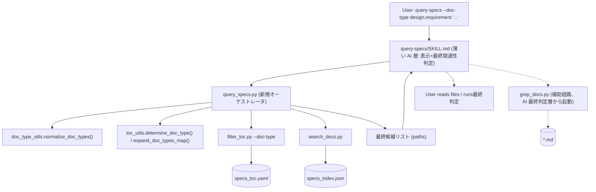
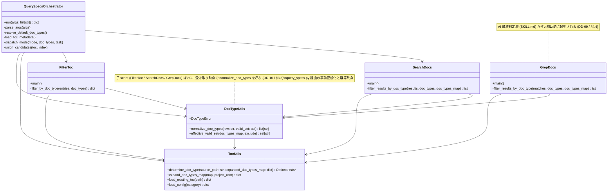
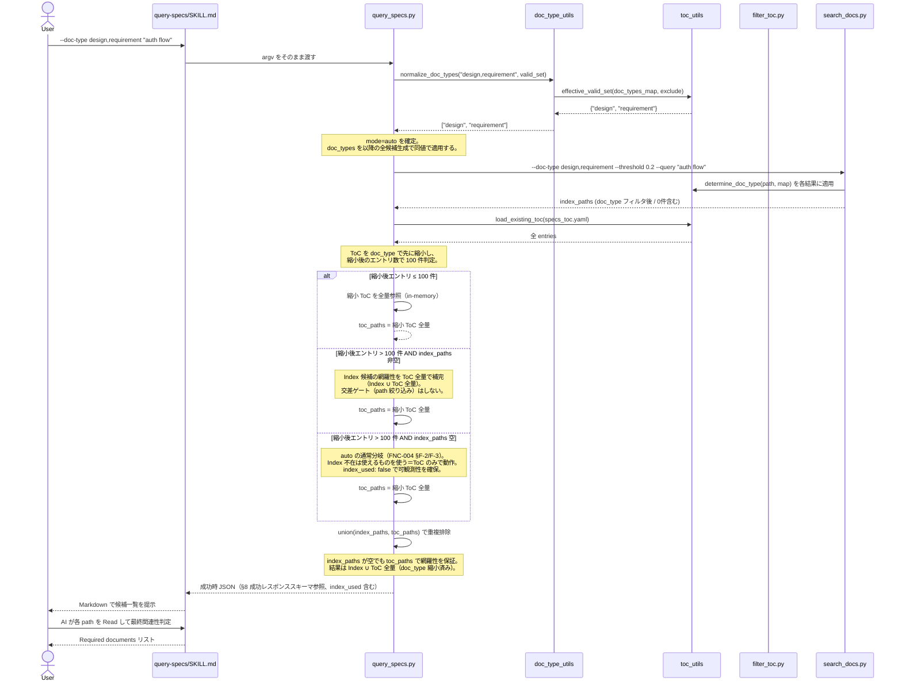
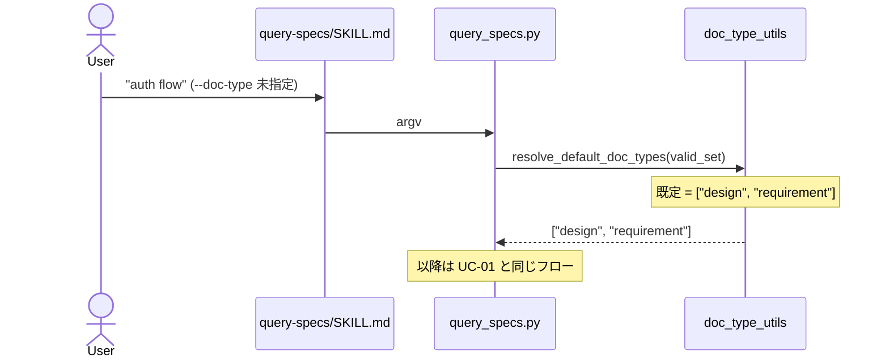
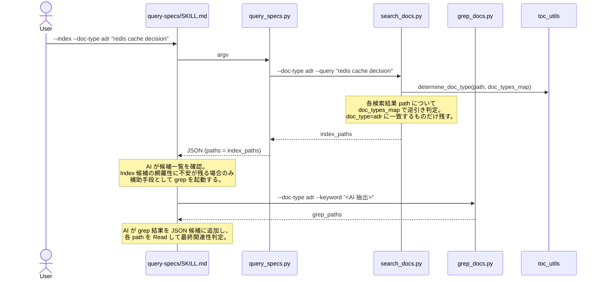
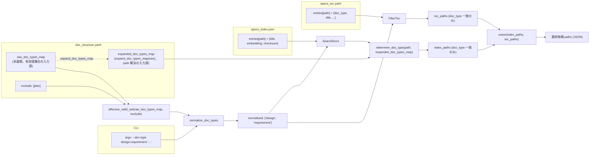

# DES-026 doc_type 絞り込み検索 設計書（feature: add-adr）

## メタデータ

| 項目     | 値                                                             |
| -------- | -------------------------------------------------------------- |
| 設計ID   | DES-026                                                        |
| 関連要件 | FNC-004（主）、FNC-001 / FNC-002 / FNC-003 / NFR-001 / REQ-001 |
| 関連設計 | DES-005（ToC 生成フロー）、DES-006（セマンティック検索）       |
| 作成日   | 2026-04-30                                                     |

## 1. 概要

`query-specs` SKILL に `--doc-type` 引数を追加し、ToC / Index / auto の 3 モード全てで同一意味の doc_type 絞り込みを実現する。あわせて ADR を `doc_type=adr` として既存 specs に同居させる構成を確立する。設計上のキー判断は次の 4 点である:

1. **doc_type 適用順序**: 引数正規化 → doc_type フィルタを `auto` 経路の **最初**に適用し、しきい値判定（100 件超）と統合を縮小済み集合で行う。これにより「判定対象 = 最終扱い対象」が一致し、判定段階での false negative 発生要因（フィルタ前後で集合がずれる現象）を構造的に排除する方針を採る。最終的な精度確認は §11.4 のゴールデンセット品質テストで行う。
2. **分岐ロジックを script に集約（ToC + Index 経路のみ）**: モード判定・しきい値判定・doc_type 既定値補完・ToC ∪ Index 統合の 4 軸分岐を、新規オーケストレータ script `query_specs.py` に閉じ込め、`query-specs/SKILL.md` は (i) 引数の受け渡し、(ii) 結果整形、(iii) 候補 Read による最終関連性判定、(iv) 必要に応じた grep 経路の補助起動 を担う薄い AI 層に絞る。AI workflow から再現性のない条件分岐を排除しつつ、最終関連性判定（候補 Read）は SKILL.md の AI が引き続き担う。**grep 経路（`grep_docs.py`）は `query_specs.py` の責務に含めない**。タスク説明から `--keyword` を決定的に抽出する規則は曖昧さ（複合キーワード・固有名詞境界・stop word 判定）を本質的に伴うため、決定的制御層よりも SKILL.md の AI 最終判定層（候補一覧を Read した後の補助手段）に残すほうが整合的（DD-09、§4.4 / §10）。
3. **Index 経路の doc_type 判定（TBD-005 解決）**: Index JSON 自体は doc_type を持たないため、検索結果の path 列に対して `.doc_structure.yaml` の `doc_types_map` 由来の path → doc_type 解決関数（`determine_doc_type`）を適用して事後フィルタする。これにより Index スキーマ拡張・全 Index 再構築を回避しつつ、ToC 経路（entry.doc_type 比較）と意味的に同一のフィルタを実現する。
4. **Index と ToC の関係（FNC-004 §フォールバック原則準拠）**: Index は ToC の **補完** であり代替ではない。`mode=auto` における Index 不在時の ToC 単独動作は、`auto` の本質（「使えるものを使う」）に基づく **通常分岐** であり、フォールバックではない（FNC-004 §F-2/F-3）。一方、バグ・設定不備（例: `mode=index` で Index 不在 / `auto` で ToC 取得不能）を隠蔽するフォールバックは FNC-004 §F-1 により **禁止** し、`status: error` として返す。100 件超でも false negative を増やさない網羅性は、Index 補完設計（Index ∪ ToC 全量、§4.2）で達成し、Index 候補の有無に依存しない決定論的フローを維持する。

## 2. アーキテクチャ概要

### 2.1 レイヤー構成



| レイヤー                        | 責務                                                                                                                                                                                           | 該当ファイル                                                                                        |
| ------------------------------- | ---------------------------------------------------------------------------------------------------------------------------------------------------------------------------------------------- | --------------------------------------------------------------------------------------------------- |
| 表示+最終判定層（薄い AI 層）   | 分岐ロジックは持たず、(i) 引数の受け渡し、(ii) 結果の Markdown 整形、(iii) 候補 Read による最終関連性判定、(iv) **grep 経路の補助起動（候補一覧確認後、必要に応じて）** を担う                 | `plugins/doc-advisor/skills/query-specs/SKILL.md`                                                   |
| 制御層                          | 引数解析・正規化・既定値補完・モード分岐・しきい値判定・候補統合（ToC + Index 経路のみ。grep は呼ばない）                                                                                      | `plugins/doc-advisor/scripts/query_specs.py`（新規）                                                |
| 共通層                          | doc_type 値検証、`doc_types_map` 展開、path → doc_type 解決                                                                                                                                    | `plugins/doc-advisor/scripts/doc_type_utils.py`（新規）/ `plugins/doc-advisor/scripts/toc_utils.py` |
| 検索層（制御層から呼ばれる）    | ToC / Index に対する候補生成（`query_specs.py` から subprocess 経由で起動）。各々が doc_type フィルタを適用する                                                                                | `filter_toc.py`（修正）/ `search_docs.py`（修正）                                                   |
| 補助検索層（AI 層から呼ばれる） | grep に対する候補生成。`query-specs/SKILL.md` の AI 最終判定層が候補一覧を Read した後の補助手段として起動する（DD-09 / §4.4）。`query_specs.py` からは呼ばれない。doc_type フィルタは事後適用 | `grep_docs.py`（修正）                                                                              |
| データ層                        | `.doc_structure.yaml` / `specs_toc.yaml` / `specs_index.json` / 個別 md ファイル                                                                                                               | プロジェクトデータ                                                                                  |

### 2.2 責務境界の確定

要件 §機能要件 — 検索網羅性の保証 末尾の脚注「内部処理フロー（経路選択順序・Index 候補との統合順序など）は設計書（DES-006）で規定する」を本設計書で具体化する。

| 判断項目                           | 旧（plan 課題提起時）                          | 新（本設計）                                                   |
| ---------------------------------- | ---------------------------------------------- | -------------------------------------------------------------- |
| モード判定                         | SKILL.md の AI が `--toc` / `--index` を解釈   | `query_specs.py` の argparse                                   |
| 100 件しきい値判定                 | SKILL.md の AI が `metadata.file_count` を確認 | `query_specs.py` が ToC を Read して判定                       |
| `--doc-type` 既定値補完            | （未定義）                                     | `query_specs.py` が `design,requirement` を補う                |
| Index 候補と ToC 候補の union      | SKILL.md の AI が手動で union                  | `query_specs.py` が dict / set で統合                          |
| doc_type フィルタ適用              | （未定義）                                     | `query_specs.py` が **mode 分岐の前**に ToC ヘッダから絞り込み |
| 候補ファイル Read と最終関連性判定 | SKILL.md の AI                                 | SKILL.md の AI（変更なし）                                     |
| grep 経路の起動（`grep_docs.py`）  | SKILL.md の AI が必要に応じて起動              | SKILL.md の AI が候補一覧確認後の補助手段として起動（DD-09）   |

## 3. モジュール設計

### 3.1 モジュール一覧

| モジュール名                   | パス                                               | 責務                                                                                                                                                                                                                                                                                                                                                                                                                                                                                                                                                                                                                                                              | 依存                                                       | 区分 |
| ------------------------------ | -------------------------------------------------- | ----------------------------------------------------------------------------------------------------------------------------------------------------------------------------------------------------------------------------------------------------------------------------------------------------------------------------------------------------------------------------------------------------------------------------------------------------------------------------------------------------------------------------------------------------------------------------------------------------------------------------------------------------------------- | ---------------------------------------------------------- | ---- |
| `query-specs/SKILL.md`         | `plugins/doc-advisor/skills/query-specs/SKILL.md`  | 薄い AI 層（表示+最終判定層）。分岐ロジックは持たず、(i) 引数を `query_specs.py` にそのまま渡し、(ii) JSON 結果を Markdown 表に整形し、(iii) 候補 Read による最終関連性判定を行い、(iv) **必要に応じて `grep_docs.py` を補助起動**（候補一覧確認後、AI がタスク説明から `--keyword` を抽出。DD-09 / §4.4）。`argument-hint` を `[--toc\|--index] [--doc-type TYPE[,TYPE...]] task description` に更新し、未指定時 default の `design,requirement` を本文に明示する。**`grep_docs.py --doc-type` の補助起動コマンド例と AI 手順は本 SKILL.md 本文に SSoT として明記する**（他文書からは grep コマンド例を載せず本 SKILL.md を参照させる方針。§12 Step 5 で具体化） | `query_specs.py`, `grep_docs.py`                           | 修正 |
| `query_specs.py`               | `plugins/doc-advisor/scripts/query_specs.py`       | オーケストレータ。引数解析、`--doc-type` 正規化・既定値補完、モード分岐、ToC サイズ判定、ToC / Index 候補生成サブ script の呼び出し、union、結果 JSON 出力。**`grep_docs.py` は直接呼ばない**（§1 / DD-09 / §4.4）。サブ script との依存契約は §3.3 を参照                                                                                                                                                                                                                                                                                                                                                                                                        | `doc_type_utils`, `toc_utils`, `filter_toc`, `search_docs` | 新規 |
| `toc_utils.determine_doc_type` | `plugins/doc-advisor/scripts/toc_utils.py`         | `create_pending_yaml.py` から移設。`(source_path: str, expanded_doc_types_map: dict[str, str]) -> Optional[str]` を正式 API として公開。入力は project_root 相対の正規化済みパス（ファイル or ディレクトリ）、判定規則は最長 prefix match、未一致時 `None`。3 経路（ToC 生成 / 検索 ToC / Index・grep）から共通利用                                                                                                                                                                                                                                                                                                                                               | `toc_utils` 既存                                           | 移設 |
| `doc_type_utils.py`            | `plugins/doc-advisor/scripts/doc_type_utils.py`    | `--doc-type` 値の正規化（trim / 重複除去 / 空要素検出 / case-sensitive 検証）と有効値集合の算出（`doc_types_map` − `exclude`）                                                                                                                                                                                                                                                                                                                                                                                                                                                                                                                                    | `toc_utils`                                                | 新規 |
| `filter_toc.py`                | `plugins/doc-advisor/scripts/filter_toc.py`        | 既存責務に加え、`--doc-type` を受け取って ToC エントリを doc_type で絞り込む。**`--doc-type` 値は受け取り時に `doc_type_utils.normalize_doc_types` で正規化・検証する**（CLI 直叩き経路でも検証ロジックを共通化、§3.3 末尾「子 script の doc_type 正規化責務」/ §11.1）                                                                                                                                                                                                                                                                                                                                                                                                                                  | `doc_type_utils`, `toc_utils`                              | 修正 |
| `search_docs.py`               | `plugins/doc-advisor/scripts/search_docs.py`       | 既存責務に加え、`--doc-type` を受け取って Index 検索結果を path → doc_type で事後フィルタする。**`--doc-type` 値は受け取り時に `doc_type_utils.normalize_doc_types` で正規化・検証する**（同上）                                                                                                                                                                                                                                                                                                                                                                                                                                                                  | `doc_type_utils`, `toc_utils.determine_doc_type`           | 修正 |
| `grep_docs.py`                 | `plugins/doc-advisor/scripts/grep_docs.py`         | 既存責務に加え、`--doc-type` を受け取って grep 結果を path → doc_type で事後フィルタする。**呼び出し元は `query_specs.py` ではなく `query-specs/SKILL.md` の AI 最終判定層**（候補一覧を Read した上で必要に応じて補助起動）。詳細は §1 / DD-09 / §4.4。**`--doc-type` 値は受け取り時に `doc_type_utils.normalize_doc_types` で正規化・検証する**（同上）                                                                                                                                                                                                                                                                                                          | `doc_type_utils`, `toc_utils.determine_doc_type`           | 修正 |
| `query_toc_workflow.md`        | `plugins/doc-advisor/docs/query_toc_workflow.md`   | `filter_toc.py` 起動コマンド例に `--doc-type` を追記。**所有境界の注記必須**: 「`--doc-type` は `query-specs` 経由でのみ使用される。`query-rules` SKILL は `--doc-type` を提供しないため、rules カテゴリではこのオプションは渡されない」（FNC-004 §スコープ外との整合のため）                                                                                                                                                                                                                                                                                                                                                                                     | -                                                          | 修正 |
| `query_index_workflow.md`      | `plugins/doc-advisor/docs/query_index_workflow.md` | `search_docs.py` 起動コマンド例にのみ `--doc-type` を追記する（**`mode=index` 経路は `query_specs.py` → `search_docs.py` であり、grep は流れない**）。**所有境界の注記必須**: 上記 `query_toc_workflow.md` と同じ specs 専用注記を追加する。grep への言及・コマンド例は本ファイルには載せない（DD-09 / §4.4）                                                                                                                                                                                                                                                                                                                                                     | -                                                          | 修正 |
| `toc_format.md`                | `plugins/doc-advisor/docs/toc_format.md`           | ADR ハンドリング指針節（§ADR Mapping）を追補。FNC-004 §文書要件 を満たす                                                                                                                                                                                                                                                                                                                                                                                                                                                                                                                                                                                          | -                                                          | 修正 |
| `.doc_structure.yaml`          | プロジェクトルート                                 | `specs.root_dirs` / `specs.doc_types_map` に ADR 配置先を追加                                                                                                                                                                                                                                                                                                                                                                                                                                                                                                                                                                                                     | -                                                          | 修正 |

### 3.2 クラス図



### 3.3 サブ script 呼び出し契約（query_specs.py ↔ filter_toc / search_docs）

`query_specs.py` は候補生成サブ script を **subprocess.run（同一 Python 実行系、`shell=False`、`capture_output=True`、`text=True`）** で呼び出す。Python import ではなく subprocess を採用する理由: (a) 既存サブ script の CLI 契約を維持し独立実行を可能にする、(b) 検索層を将来別言語/別実行系に差し替える際にも制御層を変更しない結合度を保つ、(c) 既存ワークフロー文書のコマンド例と整合させる。

**スコープ外**: `grep_docs.py` は `query_specs.py` の subprocess 契約に含まない（§1 / DD-09）。grep 経路は `query-specs/SKILL.md` の AI 最終判定層が候補一覧を Read した後に補助起動する。SKILL.md からの呼び出し方は §4.4（UC-07 シーケンス）を参照。

**入出力契約（成功・失敗ケース別）**:

| 子 script        | returncode                                   | stdout 形式                                        | stderr | 解釈規則                                                                                                                                                                                                                                                                                                    |
| ---------------- | -------------------------------------------- | -------------------------------------------------- | ------ | ----------------------------------------------------------------------------------------------------------------------------------------------------------------------------------------------------------------------------------------------------------------------------------------------------------- |
| `filter_toc.py`  | 0                                            | YAML（`render_subset_yaml` 出力）                  | 空     | `toc_utils.parse_toc_subset_yaml`（本 feature で新設、§3.4 の補助 API）で読み、`docs` キー配下のパスを candidate に変換。戻り値の `missing_paths` は §8.1 の top-level `missing_paths` フィールドへ転写する。`warnings` には §8.1 SSoT 規定の要約フォーマット（`missing paths: {N} entries skipped`、N>=1 時のみ追加）のみを追加し、生のパス列は持たない（フォーマット詳細は §8.1 を参照） |
| `filter_toc.py`  | !=0                                          | `{"status": "error", ...}` JSON                    | -      | `--toc` / `auto` 両モードで上位に伝播し `status: error` を返す（auto は ToC 必須のため代替なし。§8.3 と整合）                                                                                                                                                                                               |
| `search_docs.py` | 0                                            | `{"status": "ok", "query", "results": [...]}` JSON | 空     | `results[].path` を candidate に変換                                                                                                                                                                                                                                                                        |
| `search_docs.py` | !=0 + `Model mismatch`                       | `{"status": "error", ...}` JSON                    | -      | `embed_docs.py --full` を 1 回だけ実行して再構築 → 1 回のみリトライ。失敗時は §8.3 の mode 別規則に従う                                                                                                                                                                                                     |
| `search_docs.py` | !=0 + `Index is stale`                       | `{"status": "error", ...}` JSON                    | -      | `index_error="Index is stale"` として記録（§8.3 と整合）。mode 別規則は §8.3 を参照（`mode=index` は status:error、`mode=auto` は doc_type 適用後 ToC のみで **通常分岐動作**（FNC-004 §F-2/F-3、フォールバックではない）/ `index_used: false`）。FNC-002 §エラーケース「再生成完了までは検索しない」と整合 |
| `search_docs.py` | !=0 + `API error` / `OPENAI_API_KEY not set` | `{"status": "error", ...}` JSON                    | -      | mode 別規則は §8.3 を参照（`mode=index` は status:error、`mode=auto` は ToC のみで通常分岐動作 / `index_used: false`）                                                                                                                                                                                      |
| `search_docs.py` | 任意 + 非 JSON 出力                          | （任意）                                           | -      | `status: error` 扱い。元出力を `error` フィールドに格納。mode 別規則は §8.3 を参照                                                                                                                                                                                                                          |

**共通候補表現（query_specs.py 内部）**:

```python
Candidate = TypedDict("Candidate", {
    "path": str,                # project_root 相対パス
    "source": Literal["toc", "index"],
    "score": Optional[float],   # search_docs のみ。toc は None
})
```

> grep 経路の候補は `query_specs.py` には流れ込まない（§1 / DD-09）。SKILL.md AI 層が候補一覧を Read した後に独自に grep を起動し、追加情報源として扱う。

**形式変換の責務境界（ToC + Index 経路のみ）**: ToC / Index 経路の各 CLI の stdout 形式の差分（YAML / JSON）と終了コード意味は **`query_specs.py` 内の adapter 層が吸収する**。`query_specs.py` から呼ばれる検索層（`filter_toc.py` / `search_docs.py`）は変換ロジックを知らない。これにより検索層差し替え時に制御層インターフェースが安定する。**grep 経路は本責務境界の対象外**: `grep_docs.py` は §1 / DD-09 / §4.4 のとおり `query_specs.py` の adapter 対象外であり、`query-specs/SKILL.md` の AI 最終判定層が `grep_docs.py` の stdout を直接解釈する責務を持つ（候補一覧確認後の補助手段として AI が起動・解釈する）。すなわち、本設計では「制御層が呼ぶ sub-script の stdout は `query_specs.py` 内 adapter が吸収」「AI 層が呼ぶ sub-script（grep）の stdout は SKILL.md AI が直接解釈」という二層の独立した解釈責務が並立する。

**stderr 警告の扱い**: 子 script の stderr 出力（および `toc_utils.get_all_md_files` の警告。§9.1 参照）は `query_specs.py` 側で集約し、最終 JSON の `warnings` フィールドに格納する。加えて `parse_toc_subset_yaml` 戻り値の `missing_paths` 要約も `warnings` に追加する（生のパス列は §8.1 top-level `missing_paths` に格納し、`warnings` には重複させない。要約フォーマットは §8.1 SSoT、詳細は本節 `filter_toc.py`(rc=0) 行 / §3.4 / §8.1）。SKILL.md は warnings をユーザーに表示する。

**Model mismatch リトライ抑止**: 1 サイクルあたり最大 1 回（無限ループ抑止）。リトライ後の失敗時の扱いは mode 別に §8.3 表に従う（`mode=auto`: ToC のみで通常分岐動作 / `mode=index`: `status: error`、FNC-004 §F-1）。

**子 script の doc_type 正規化責務**: `filter_toc.py` / `search_docs.py` / `grep_docs.py` は **CLI 受け取り時点で自身が `doc_type_utils.normalize_doc_types` を呼び出して正規化・検証する責務を持つ**（共通正規化方式 / 採用根拠は §10 DD-10）。これにより以下を保証する: (a) `query_specs.py` 経由・CLI 直叩き・テストランナー直叩きのいずれの経路でも検証ロジックが一意（重複実装なし）、(b) `query_specs.py` でも事前正規化を行うが、子 script 側でも冪等な再正規化として呼び出して契約を保つ（同一入力に対して同一出力の純粋関数のため副作用なし）、(c) error message のフォーマットが分散しない。テストは §11.1 で各 CLI 単独実行時の正規化動作をカバーする。

### 3.4 toc_utils.determine_doc_type の API 契約

`toc_utils.py` に移設後の正式 API。3 経路（ToC 生成 / 検索 ToC / 検索 Index・grep）すべてが本関数を通じて path → doc_type 解決を行う。

| 項目       | 値                                                                                                                           |
| ---------- | ---------------------------------------------------------------------------------------------------------------------------- |
| シグネチャ | `determine_doc_type(source_path: str, expanded_doc_types_map: dict[str, str]) -> Optional[str]`                              |
| 入力 1     | `source_path`: project_root 相対の正規化済みパス（ファイル or ディレクトリ）。`os.path.normpath` + `as_posix()` 適用後を想定 |
| 入力 2     | `expanded_doc_types_map`: `expand_doc_types_map` で glob 展開済みの dict。キーは末尾スラッシュ付きディレクトリパス           |
| 戻り値     | 一致した `doc_type` 文字列、または一致なしのとき `None`                                                                      |
| 判定規則   | **最長 prefix match**。両辺末尾スラッシュ統一の上で `source_path.startswith(map_key)` を満たすキーのうち最長のものを採用     |
| 副作用     | なし（純粋関数）。同じ入力に対して常に同じ出力（決定論的）                                                                   |
| 例外       | 投げない。一致なしは `None` で表現する                                                                                       |

**呼び出し側の責務**: `None` が返ったエントリは結果から除外する（エラーにしない）。これは ADR ディレクトリ未作成時の `--doc-type adr` シナリオ（§9.1 / §11.2）と整合する。

**補助 API（本 feature で新設）**: `toc_utils.parse_toc_subset_yaml(content: str) -> dict`

**所属に関する設計判断**: 本関数は `filter_toc.render_subset_yaml` 出力を解釈する。§3.3「形式変換の責務境界」では子 script の stdout 形式差分を **`query_specs.py` 内 adapter 層が吸収** とした一方、本関数は共通層 `toc_utils.py` に置く。これは **ToC subset YAML を `filter_toc.py` 固有の出力形式ではなく `plugins/doc-advisor/docs/toc_format.md` の公開 ToC 形式の一種（複数 entry を持つ ToC）として位置付ける** ためであり、`filter_toc.py` 以外の利用者（将来の ToC 系 CLI / テストハーネス / 検証ツール）も同 API で読めるようにする方針による。`query_specs.py` adapter 層は本関数を呼ぶラッパーであり、stdout 形式の解釈そのものは公開 ToC 形式の知識として `toc_utils.py` に閉じる。採用根拠は DD-12（§10）。

| 項目             | 値                                                                                                                                                                                                                                                                                                                                                                                                      |
| ---------------- | ------------------------------------------------------------------------------------------------------------------------------------------------------------------------------------------------------------------------------------------------------------------------------------------------------------------------------------------------------------------------------------------------------- |
| シグネチャ       | `parse_toc_subset_yaml(content: str) -> dict`                                                                                                                                                                                                                                                                                                                                                           |
| 入力             | `filter_toc.render_subset_yaml` 出力相当の YAML 文字列。`docs:` 配下に複数 path を持つ ToC subset 形式                                                                                                                                                                                                                                                                                                  |
| 戻り値           | `{"docs": {path: entry_dict, ...}, "missing_paths": [str, ...]}` 形式の dict。`docs` 配下のパス一覧、および `filter_toc.py` が出力した `missing_paths` を保持                                                                                                                                                                                                                                           |
| 責務             | ToC subset stdout 解析（複数 entry 対応）と `metadata.missing_paths` のトップレベル `missing_paths` への正規化。pending entry file 用の既存 `parse_simple_yaml`（単一 entry 専用）とは別 API として明確に分離する                                                                                                                                                                                       |
| 入力構造との対応 | 現行 `filter_toc.render_subset_yaml` は `missing_paths` を `metadata.missing_paths` 配下にネストして出力する（`filter_toc.render_subset_yaml` 内の `metadata.missing_paths` 出力箇所）。`parse_toc_subset_yaml` は本ネスト構造を読み取り、戻り値ではトップレベル `missing_paths` キーに平坦化する。`metadata` キーが存在しない、もしくは `metadata.missing_paths` が存在しない場合は空 list `[]` を返す |
| 例外             | YAML 構文不正時は `ValueError` を送出                                                                                                                                                                                                                                                                                                                                                                   |

`query_specs.py` adapter 層は本関数で stdout を解釈し、`docs` キー配下のパスを candidate に変換、戻り値の `missing_paths` は §8.1 の top-level `missing_paths` フィールドへ転写する。`warnings` には §8.1 SSoT 規定の要約フォーマット（`missing paths: {N} entries skipped`、N>=1 時のみ追加）のみを追加し、生のパス列は重複保持しない（フォーマット詳細は §8.1 を参照、§3.3 と整合）。なお `filter_toc.py` 側の YAML 出力構造（`metadata.missing_paths` ネスト）は本 feature では変更しない（既存テスト・既存利用箇所への影響回避）。

## 4. ユースケース設計

### 4.1 ユースケース一覧

| ID    | ユースケース                        | 説明                                                                                 |
| ----- | ----------------------------------- | ------------------------------------------------------------------------------------ |
| UC-01 | auto モード + `--doc-type` 指定     | 既定の auto モードで複数 doc_type を OR 結合した検索を行う                           |
| UC-02 | toc モード + `--doc-type` 指定      | ToC のみを使って doc_type 絞り込みを行う                                             |
| UC-03 | index モード + `--doc-type` 指定    | Index のみを使って doc_type 絞り込みを行う（grep は SKILL.md AI が必要時に補助起動） |
| UC-04 | `--doc-type` 未指定（既定値適用）   | 旧来の暗黙挙動（`design,requirement`）を顕在化する                                   |
| UC-05 | 不正な `--doc-type` 値              | 未定義値・空要素・case 不一致をエラーで通知する                                      |
| UC-06 | `--doc-type adr` で ADR 検索        | ADR 配置パスから ToC 化された `doc_type=adr` エントリのみを取得する                  |
| UC-07 | ToC 不在 + `--index` + `--doc-type` | Index 結果に対して path → doc_type 解決で事後フィルタを適用する                      |

### 4.2 シーケンス図 — UC-01（auto モード + `--doc-type`）



**前提条件**: `.doc_structure.yaml` に `specs.doc_types_map` が定義されていること。`OPENAI_API_KEY` は任意（`mode=auto` では無くても通常分岐として ToC のみで動作する。FNC-004 §F-3）。

**正常フロー**: 上記シーケンス通り。

**100 件超分岐の設計判断**: 旧版の「`filter_toc.py --paths <index_paths>` で Index と ToC を交差させて縮小」案は採用しない。理由は FNC-004 §機能要件 — 検索網羅性の保証「ToC / Index のいずれかに存在する限り必ず含まれる」と矛盾するため（Index が見落とした ToC 上の対象 doc_type 文書が結果から落ちる）。本設計では **Index ∪ ToC 全量補完** によって網羅性を確保する（`mode=auto` 100 件超 Index 非空ケース）。100 件超による縮小ToC全量 Read のコスト懸念は NFR-001 とのトレードオフだが、doc_type で縮小済みのため実用範囲に収まる。最終確認は §11.4 のゴールデンセット品質テストで行う。

**`mode=auto` での Index 不在時の扱い（FNC-004 §F-3 準拠）**: Index 候補が空（`OPENAI_API_KEY` 未設定 / API error / Model mismatch リトライ後失敗 / Index is stale / 非 JSON 出力）であっても、`mode=auto` では **通常分岐** として `status: ok` を返し、`index_used: false` で可観測性を確保する。フォールバック識別子の発行は行わない（フォールバックではないため）。`mode=index` の場合は §8.3 表に従い `status: error` を返す。

**エラーフロー**: `normalize_doc_types` がエラー（未定義値・空要素・case 不一致）を返した場合、`query_specs.py` は `{"status": "error", "error": "...", "valid_doc_types": [...]}` を JSON で出力して非 0 終了する。SKILL は JSON を受けてエラーメッセージと有効値集合をユーザーに提示する。

### 4.3 シーケンス図 — UC-04（既定値適用）



**設計判断**: 既定値の補完は `query_specs.py` 内で行う。`.doc_structure.yaml` の `exclude` は SKILL の母集合定義（要件で確定）であり、`--doc-type` 既定値はその母集合のうち `design,requirement` を採るユーザー向け既定。両者は別の役割を担う。

### 4.4 シーケンス図 — UC-07（ToC 不在 + `--index` + `--doc-type`）



**設計判断（grep 経路の責務分離 / DD-09）**: タスク説明（例: "redis cache decision"）から `grep_docs.py --keyword` の値を決定する規則は、決定的制御層に置くと曖昧さ（複合キーワード / 固有名詞境界 / stop word 判定）を抱える。代わりに SKILL.md の AI 最終判定層が候補一覧を確認した後の **補助手段** として grep を起動する。これにより `query_specs.py` は再現性の高い ToC + Index 統合に専念し、grep の柔軟性は AI の文脈理解に委ねる。`--keyword` 値の選定責務は SKILL.md にある。

**FNC-004 §再現性要件との整合（DD-09 補足）**: FNC-004 §再現性要件（line 88-94）のスコープは、本設計では `query_specs.py` が返す JSON 候補集合（ToC + Index 統合、§8.1）に限定される。すなわち決定論的に再現性を担保する対象は ToC 経路と Index 経路のみであり、SKILL.md AI 最終判定層から補助起動される `grep_docs.py` は同節 line 94「AI の最終判定（候補 Read 後の関連性確認）はこの再現性要件の対象外」の除外項に該当する。grep 起動有無や `--keyword` 抽出の AI 揺らぎ（DD-09 自身が「曖昧さを本質的に伴う」と認める要素）は再現性スコープに含めない。これにより「`query_specs.py` の候補集合（ToC + Index）は決定論的、AI 最終判定（grep 補助起動を含む）は再現性要件の例外」という整合解釈が成立する（§1 キー判断 2 / §8.1 / DD-09 で一貫）。

**設計判断（TBD-005 解決）**: Index JSON は `entries[path] = {title, embedding, checksum}` のみで `doc_type` を持たない。この事実から以下を採用する。

- **採用**: 検索結果の path に対して `toc_utils.determine_doc_type(source_path, expanded_doc_types_map)` を適用する事後フィルタ方式（API 契約は §3.4 で確定）
- **不採用 A**: Index スキーマに `doc_type` を追加（`embed_docs.py` 拡張、全 Index 再構築が必要）
- **不採用 B**: ToC を経由して entry.doc_type を引く（ToC 不在環境では成立しない）

採用案の利点:

- `embed_docs.py` / Index の出力スキーマを変更しない（後方互換）
- ToC が存在しなくても ToC 経路（entry.doc_type）と意味的に同一の判定（同じ `doc_types_map` 経由で算出）を狙える
- ToC 生成側（`create_pending_yaml.py`）も同じ `determine_doc_type` を経由するよう書き換える（§5 / §12 Step 1）。3 経路すべてが同一定義を踏み、再現性要件への構造的根拠を担保する

**入力の取り扱い**: 現行の `create_pending_yaml.determine_doc_type` は `root_dir_name`（ディレクトリ名単位）を入力とする実装だが、Index/grep 経路の事後フィルタは「検索結果のフルパス」を入力とする必要がある。両者を共通 API でカバーするため、移設後 API は **入力をフルパス（または末尾スラッシュ付きディレクトリ）として受理**し、**最長 prefix match** で判定する（§3.4）。これにより `docs/specs/foo/design/file.md` のような source_file フルパスでも `docs/specs/foo/design/` キーに正しく一致する。

## 5. 使用する既存コンポーネント

| コンポーネント                                      | ファイルパス                                         | 用途                                                                                                                                                                                                                                                                                                                                                                                           |
| --------------------------------------------------- | ---------------------------------------------------- | ---------------------------------------------------------------------------------------------------------------------------------------------------------------------------------------------------------------------------------------------------------------------------------------------------------------------------------------------------------------------------------------------- |
| `toc_utils.load_existing_toc`                       | `plugins/doc-advisor/scripts/toc_utils.py`           | `query_specs.py` が ToC YAML を読み込んでエントリを doc_type で絞り込み、しきい値判定する                                                                                                                                                                                                                                                                                                      |
| `toc_utils.load_config` / `init_common_config`      | `plugins/doc-advisor/scripts/toc_utils.py`           | `.doc_structure.yaml` を読み込み `doc_types_map` / `exclude` を取得する。**本 feature で戻り値に `raw_doc_types_map` / `expanded_doc_types_map` の 2 キーを追加する**（DD-11 / §5.1 / §10。詳細は §5.1）                                                                                                                                                                                                                                                                                                                                                                                                                                                                                                              |
| `toc_utils.expand_doc_types_map`                    | `plugins/doc-advisor/scripts/toc_utils.py`           | glob パターンを実際のディレクトリに展開する。Index 経路の path → doc_type 解決でも同じ展開済 map を使う                                                                                                                                                                                                                                                                                        |
| `create_pending_yaml.determine_doc_type`            | `plugins/doc-advisor/scripts/create_pending_yaml.py` | path → doc_type の正解判定。**`toc_utils.py` に移設し新 API（§3.4: `(source_path, expanded_doc_types_map) -> Optional[str]`、最長 prefix match、未一致 None）として再定義**して 3 経路（ToC 生成 / 検索 ToC / Index・grep）から共通利用する。`create_pending_yaml.py` 側の旧定義は削除し、ToC 生成パスでも新 API を呼び出すよう呼び出し側を修正する（§12 Step 1）。移設は本 feature の作業範囲 |
| `filter_toc.render_subset_yaml`                     | `plugins/doc-advisor/scripts/filter_toc.py`          | 既存の縮小 YAML 出力ロジックを再利用。`--doc-type` フィルタは `main` の `filtered = {p: docs[p] for p in requested if p in docs}` 直前に挿入する                                                                                                                                                                                                                                               |
| `tests/doc_advisor/scripts/test_filter_toc.py`      | プロジェクトルート                                   | `FilterTocTestBase`、`render_subset_yaml` 単体、CLI 統合、Edge Case の各テストパターンを踏襲して `--doc-type` 用テストを追加                                                                                                                                                                                                                                                                   |
| `query_toc_workflow.md` / `query_index_workflow.md` | `plugins/doc-advisor/docs/`                          | 既存ワークフロー文書。コマンド例の `--doc-type` 注記追記のみ                                                                                                                                                                                                                                                                                                                                   |

新規作成しない判断（理由含む）:

- doc_type フィルタ適用クラスを新設しない: 既存の path 比較ロジックで足りる。クラス化は責務超過で YAGNI
- Index へのメタ追加 script を新設しない: §4.4 の設計判断により不要

### 5.1 既存パーサ・有効値集合算出の整合性確保（前提条件）

§9.1 の `.doc_structure.yaml` サンプルおよび 3 経路の path → doc_type 判定が現行コードベース上で機能するため、本 feature の作業範囲に以下を含める。

| 対象                                            | 修正方針                                                                                                                                                                                                                                                                                                                                                                                                                              |
| ----------------------------------------------- | ------------------------------------------------------------------------------------------------------------------------------------------------------------------------------------------------------------------------------------------------------------------------------------------------------------------------------------------------------------------------------------------------------------------------------------- |
| `toc_utils._parse_config_yaml` の dict key 処理 | 現行実装は `key, _, value = stripped.partition(':'); key = key.strip()` のみで、quote 文字 `"` `'` を除去しないため、サンプルの quoted key `"docs/specs/**/design/"` が dict key にそのまま残り `expand_doc_types_map` が 0 件展開する。本 feature で **key の quote 除去（`key.strip().strip('"\'')`）** をパーサに追加する                                                                                                          |
| 有効値集合（`effective_valid_set`）の算出元     | **raw `doc_types_map` のキー由来の値集合**（`exclude` を除いた集合）から算出する。glob 展開後の `expand_doc_types_map` 結果ではない。これにより ADR ディレクトリ未作成時も `adr` が有効値として認識される（§9.1 / §11.2 のシナリオ参照）                                                                                                                                                                                              |
| path → doc_type 解決                            | **glob 展開済 map（`expand_doc_types_map` 結果）** を使う。一致がない path は `None`（= 結果から除外、エラーにしない）                                                                                                                                                                                                                                                                                                                |
| 共有 API `toc_utils.determine_doc_type` の契約  | **map-only**（`doc_types_map` のみで判定、未一致時 `None`）。FNC-004 §機能要件 — ADR の検索対象登録 が要求する「`doc_types_map` 登録で定義し、未登録なら未定義値エラー」と整合させ、設定外の推論ポリシー（キーワードフォールバック等）を共有 resolver に持たせない。これにより `.doc_structure.yaml` → `expand_doc_types_map` → resolver の依存方向を保つ。3 経路（ToC 生成 / ToC 検索 / Index・grep）は必ず本 map-only 新 API を使う |
| `create_pending_yaml.DOC_TYPE_KEYWORDS` の扱い  | 共有 API には組み込まない。legacy wrapper として残す場合は、`create_pending_yaml.py` 内の **別名関数（例: `legacy_determine_doc_type_with_keywords`）に隔離** し、共有 `toc_utils.determine_doc_type` とは明確に分離する。ToC 生成パイプラインは共有 map-only API へ書き換える（§9.3 / §12 Step 1）                                                                                                                                   |
| `toc_utils.get_all_md_files` の警告出力         | 現行実装は `print(f"Warning: {root_dir} does not exist, skipping")` を **stdout** に出力するため、`query_specs.py` の stdout JSON 契約を汚染する。本 feature で **stderr へ出力先を変更**する（または無警告 skip + warnings 集約に統一）                                                                                                                                                                                              |
| `init_common_config()` 戻り値の raw / expanded 分離 | 現行 `init_common_config()` は `doc_types_map` キーで **glob 展開済 map のみ** を返しており、`effective_valid_set` 算出（raw 必須）と `determine_doc_type` 解決（expanded 必須）の入力源が API レベルで分離されていない。本 feature で戻り値に **`raw_doc_types_map`**（`.doc_structure.yaml` から読み込んだ未展開 dict、quote 除去後）と **`expanded_doc_types_map`**（`expand_doc_types_map` 適用後）の 2 キーを追加する。既存キー `doc_types_map` は **expanded を指す（後方互換）** として残置するが新規呼び出し側は `expanded_doc_types_map` を使用する（DD-11 / 採用根拠は §10）。これにより、`effective_valid_set(raw_doc_types_map, exclude) -> set[str]` と `determine_doc_type(source_path, expanded_doc_types_map) -> Optional[str]` の入力契約が引数名で固定され、ADR ディレクトリ未作成時に `adr` が有効値判定から消失するリスクを構造的に防ぐ |

これらは ADR 配置・3 経路共通化を成立させる構造的前提であり、Step 1（§12）の作業に含める。

## 6. データフロー設計

### 6.1 データの流れ（auto モード + `--doc-type` 指定時）



### 6.2 doc_type の決定経路（3 ルート整合）

| ルート               | 値の決定方法                                                                                  | 判定タイミング       |
| -------------------- | --------------------------------------------------------------------------------------------- | -------------------- |
| ToC entry.doc_type   | `toc_utils.determine_doc_type(source_path, expanded_doc_types_map)`（移設後 API）で生成時決定 | ToC 構築時に確定     |
| Index 経路の事後判定 | `toc_utils.determine_doc_type(source_path, expanded_doc_types_map)` で検索結果 path から計算  | 検索実行時に動的算出 |
| grep 経路の事後判定  | 同上                                                                                          | 検索実行時に動的算出 |

**整合性の根拠**: 3 ルートはすべて同じ `.doc_structure.yaml` の `doc_types_map`（v3.0 形式、`expand_doc_types_map` で glob 展開済）を入力とする。`determine_doc_type(source_path, expanded_doc_types_map)` は決定論的純粋関数（同じ入力に対して常に同じ出力）であり（§3.4）、ToC 生成時 / 検索時で結果が一致する。**3 ルートが同一定義を踏むことを保証するため**、ToC 生成側（`create_pending_yaml.py`）も同関数を呼び出す形にリファクタする（§5 / §12 Step 1）。テスト設計上は同等性ユニットテスト（同じパス入力に対して 3 経路が同じ doc_type を返す）を §11.1 に追加する。

## 7. 状態管理設計

`query_specs.py` は stateless な CLI script として設計する。引数解析・ToC / Index 読込・候補生成・統合・JSON 出力をワンショットで完了し、内部状態は呼び出し間で持ち越さない。

| 状態種別                      | 保持場所                           | 永続化         |
| ----------------------------- | ---------------------------------- | -------------- |
| `.doc_structure.yaml` 設定値  | プロジェクトルート                 | 永続           |
| `specs_toc.yaml` の docs      | `.claude/doc-advisor/toc/specs/`   | 永続           |
| `specs_index.json` の entries | `.claude/doc-advisor/index/specs/` | 永続           |
| 検索結果（候補 paths）        | プロセス内変数                     | 一時（捨てる） |

## 8. エラーハンドリング設計

`query_specs.py` は標準出力に JSON のみを出力する（SKILL.md がパースするため）。stderr は子 script 経由の警告集約用で SKILL.md は読まない。

### 8.1 成功レスポンス JSON スキーマ

FNC-002 の「false negative ゼロを追跡できる」要件・FNC-004 のエラーケース完全列挙の要請に対し、可観測性フィールドを設計時点で確定する。`query_specs.py` 成功時は以下のスキーマで stdout に JSON を出力する。

```json
{
  "status": "ok",
  "mode_requested": "auto|toc|index",
  "mode_effective": "auto|toc|index",
  "doc_types_requested": ["design", "requirement"],
  "doc_types_applied": ["design", "requirement"],
  "doc_types_default_applied": false,
  "toc_total_count": 142,
  "toc_filtered_count": 38,
  "index_used": true,
  "index_status": "ok|skipped|error",
  "index_error": null,
  "warnings": ["doc_type=adr matched no directory", "missing paths: 2 entries skipped"],
  "missing_paths": [
    "docs/specs/foo/design/DES-009_obsolete.md",
    "docs/specs/foo/design/DES-010_deprecated.md"
  ],
  "candidate_sources": {
    "docs/specs/foo/design/DES-001_design.md": ["toc", "index"],
    "docs/specs/foo/requirements/FNC-001_spec.md": ["toc"]
  },
  "paths": ["docs/specs/foo/design/DES-001_design.md", "..."]
}
```

> **grep 関連フィールド非搭載**: `query_specs.py` は grep 経路を起動しない（§1 / DD-09 / §4.4）ため、`grep_status` フィールドは出力しない。grep は SKILL.md AI 層が補助起動するもので、`query_specs.py` の JSON 契約には現れない。

| フィールド                  | 型                               | 説明                                                                                                                                  |
| --------------------------- | -------------------------------- | ------------------------------------------------------------------------------------------------------------------------------------- |
| `status`                    | `"ok"` 固定                      | 成功                                                                                                                                  |
| `mode_requested`            | string                           | ユーザー指定 mode（`auto` / `toc` / `index`）                                                                                         |
| `mode_effective`            | string                           | 実際に動作した mode。`mode=auto` で Index 不在のときも `auto` のまま（FNC-004 §F-3 通常分岐のため、フォールバック概念で書き換えない） |
| `doc_types_requested`       | list[string]                     | ユーザーが渡した値（既定値補完前の状態。未指定時は空）                                                                                |
| `doc_types_applied`         | list[string]                     | 実際に適用された値（既定値補完後）                                                                                                    |
| `doc_types_default_applied` | bool                             | `true` のとき既定値（`design,requirement`）を補完した                                                                                 |
| `toc_total_count`           | int                              | doc_type 適用前の ToC エントリ数                                                                                                      |
| `toc_filtered_count`        | int                              | doc_type 適用後の ToC エントリ数                                                                                                      |
| `index_used`                | bool                             | Index 候補が結果に組み込まれたかどうか。`mode=auto` で Index 不在時は `false`（FNC-004 §F-3 通常分岐の可観測性確保）                  |
| `index_status`              | `"ok"` / `"skipped"` / `"error"` | Index 利用結果。`mode=toc` は常に `skipped`                                                                                           |
| `index_error`               | string \| null                   | Index 失敗時の内訳（Model mismatch / API error / Index is stale / 非 JSON など）。`mode=auto` で Index 不在時も内訳を保持             |
| `warnings`                  | list[string]                     | 子 script の stderr / `get_all_md_files` の警告 / 「ADR ディレクトリ未作成」等。`missing_paths` の生のパス列は持たず、人間向け要約のみを追加する（フォーマット規定は本表 `missing_paths` 行を SSoT として参照、§3.3 / §3.4 と整合） |
| `missing_paths`             | list[string]                     | **SSoT**: `filter_toc.py` の `metadata.missing_paths` を `parse_toc_subset_yaml`（§3.4）で読み取り平坦化したものを保持。`warnings` には生パス列を重複させず、代わりに以下フォーマットの要約 1 件を追加する（**要約フォーマットも本行を SSoT とする**）: `"missing paths: {N} entries skipped"` 固定。`{N}` は十進整数、英語固定（ロケール非依存）、単数形/複数形は使い分けず常に `entries` を使用、`N >= 1` のときのみ `warnings` に追加し `N == 0` のときは追加しない |
| `candidate_sources`         | dict[path, list[source]]         | 候補ごとの由来。`source ∈ {"toc", "index"}`（grep は `query_specs.py` には流れ込まない、§1 / DD-09）                                  |
| `paths`                     | list[string]                     | 最終候補（重複排除済）                                                                                                                |

SKILL.md はこのうち `paths` を Markdown 表として整形し、`warnings` / `index_used` をユーザーに表示する。`mode_effective` / `doc_types_applied` / `doc_types_default_applied` / `index_used` は既定値が動いたことや Index 利用状況の可視化に使う。

> **設計上の注記（fallbacks フィールド非搭載）**: 旧版で計画した `fallbacks` 識別子（`index_unavailable_used_toc_only` 等）は **廃止**。FNC-004 §フォールバック原則の整理により、`mode=auto` の Index 不在は通常分岐（フォールバックではない）と位置付け、`index_used: bool` のみで状態を表現する。バグ・設定不備に該当するケース（`mode=index` で Index 不在 / `auto` で ToC 取得不能）は `status: error` で返す（§8.2 / §8.3）。

### 8.2 エラーレスポンス JSON スキーマ

```json
{
  "status": "error",
  "error": "Invalid doc_type: 'Design'. Use lowercase, no aliases.",
  "valid_doc_types": ["design", "requirement"]
}
```

| 条件（FNC-004 §エラーケース）                                | `query_specs.py` 動作                                                                          | 終了コード |
| ------------------------------------------------------------ | ---------------------------------------------------------------------------------------------- | ---------- |
| `--doc-type` 値が `doc_types_map` に未定義（exclude 適用後） | `status: error`、有効値集合を返却                                                              | 1          |
| `--doc-type` 値が空文字列                                    | `status: error`、構文ヘルプを返却                                                              | 1          |
| `--doc-type` 値内に空要素                                    | `status: error`、該当位置を明示                                                                | 1          |
| `--doc-type` 大文字小文字不一致                              | `status: error`、未定義値扱い、有効値集合を返却                                                | 1          |
| `--doc-type` 適用後 ToC + Index 双方 0 件                    | `status: ok`、`paths: []`                                                                      | 0          |
| `--doc-type adr` + ADR ディレクトリ未作成（glob 0 件展開）   | `status: ok`、`paths: []`、`warnings: ["doc_type=adr matched no directory"]`（§9.1 で詳述）    | 0          |
| `--doc-type` 多値で一部未定義                                | `status: error`、未定義値を明示                                                                | 1          |
| ToC 不在 + Index 利用不可                                    | `status: error`、`/doc-advisor:create-specs-toc` または `OPENAI_API_KEY` 設定を案内            | 1          |
| `--doc-type` のみでタスク説明が無い                          | `status: error`、構文 `query-specs [--toc\|--index] [--doc-type TYPE[,TYPE...]] <task>` を返却 | 1          |

### 8.3 サブ script 失敗時の扱い（subprocess エラー継承）

`query_specs.py` が呼び出す `search_docs.py` / `filter_toc.py` の失敗を mode 別に集約する規則。詳細な入出力契約は §3.3 にある。DES-006 §10.5 / §10.7 および FNC-004 §フォールバック原則と整合させ、`mode=index` は Index 必須・`mode=auto` は ToC 必須の前提で扱う。

> **`grep_docs.py` は対象外**: §1 / DD-09 / §4.4 のとおり grep 経路は SKILL.md の AI 最終判定層から起動するため、`query_specs.py` の subprocess 失敗継承の対象に含まない。SKILL.md AI 層は grep 失敗時、空候補のまま AI 判定を続行する（grep は補助情報源）。

**設計の基本方針（FNC-004 §フォールバック原則準拠）**:

- `mode=auto` で Index が利用不可になった場合は **通常分岐**（FNC-004 §F-2/F-3）として ToC のみで動作し、`status: ok` / `index_used: false` を返す。これは「フォールバック」ではない。
- `mode=index` で Index が利用不可は **F-1 該当**（バグ・設定不備の隠蔽禁止）として `status: error` を返す。
- `mode=auto` で ToC が取得不能（`filter_toc.py` 失敗）は **F-1 該当**（候補母集合不在は推論不可なバグ・設定不備）として `status: error` を返す。

| 子 script        | returncode + 状況                            | mode=auto                                                                                                                                                                                                  | mode=index                                                                                                                    | mode=toc                                            |
| ---------------- | -------------------------------------------- | ---------------------------------------------------------------------------------------------------------------------------------------------------------------------------------------------------------- | ----------------------------------------------------------------------------------------------------------------------------- | --------------------------------------------------- |
| `search_docs.py` | 0 / `status:ok`                              | 候補に統合 / `index_used=true` / `index_status=ok`                                                                                                                                                         | 候補に統合 / `index_used=true` / `index_status=ok`                                                                            | 呼ばない                                            |
| `search_docs.py` | !=0 / `Model mismatch`                       | `embed_docs.py --full` 再構築 → 1 回リトライ → 成功で統合。**失敗時は ToC のみで通常分岐動作**（FNC-004 §F-2/F-3） / `status: ok` / `index_used=false` / `index_status=error` / `index_error` に内訳を記録 | `embed_docs.py --full` 再構築 → 1 回リトライ → **失敗時は `status: error`**（FNC-004 §F-1: Index 必須 mode で隠蔽不可）       | -                                                   |
| `search_docs.py` | !=0 / `Index is stale`                       | **ToC のみで通常分岐動作**（FNC-004 §F-2/F-3） / `status: ok` / `index_used=false` / `index_status=error` / `index_error="Index is stale"`                                                                 | **`status: error`**（FNC-002 §エラーケース「再生成完了までは検索しない」/ FNC-004 §F-1: 古い Index による見落としを隠蔽不可） | -                                                   |
| `search_docs.py` | !=0 / `API error` / `OPENAI_API_KEY not set` | **ToC のみで通常分岐動作**（FNC-004 §F-2/F-3） / `status: ok` / `index_used=false` / `index_status=error` / `index_error` に内訳を記録（DES-006 §10.7 と整合）                                             | **`status: error`**（DES-006 §10.5 / §10.7 / FNC-004 §F-1: index モードは Index 必須・代替不可）                              | -                                                   |
| `search_docs.py` | 任意 / 非 JSON 出力                          | **ToC のみで通常分岐動作**（FNC-004 §F-2/F-3） / `status: ok` / `index_used=false` / `index_status=error` / 元出力を `index_error` に格納                                                                  | **`status: error`** / 元出力を `error` フィールドに格納（FNC-004 §F-1）                                                       | -                                                   |
| `filter_toc.py`  | 0 / YAML                                     | 縮小 ToC として採用                                                                                                                                                                                        | -                                                                                                                             | 採用                                                |
| `filter_toc.py`  | !=0 / `status:error`                         | **`status: error`**（FNC-004 §F-1: auto は ToC が候補母集合のため、ToC 取得不能はバグ・設定不備として隠蔽不可）                                                                                            | -                                                                                                                             | **`status: error`**（FNC-004 §F-1: ToC モード必須） |

**`mode=auto` 100 件超 + Index 非空時の挙動**: §4.2 に従い **Index ∪ ToC 全量補完**。Index 候補で ToC 全量を絞り込む（交差ゲート）方式は採用しない（FNC-004 §機能要件 — 検索網羅性の保証「ToC / Index のいずれかに存在する限り必ず含まれる」と矛盾するため）。

**`fallbacks` フィールド廃止の理由**: FNC-004 §F-2/F-3 により `mode=auto` の Index 不在は通常分岐に再分類されたため、フォールバック識別子の発行は廃止。状態は `index_used: bool` / `index_status` / `index_error` の組合せで完全に表現する。

**subprocess 起動方式**: `subprocess.run([...], shell=False, capture_output=True, text=True)` を統一して使用。

**stderr の集約**: 子 script の stderr 出力（および `toc_utils.get_all_md_files` の警告。§5.1 / §9.1 参照）はすべて `query_specs.py` 側で `warnings` に集約する。

**Model mismatch リトライ抑止**: 1 サイクルあたり最大 1 回（無限ループ防止）。`mode=auto` ではリトライ後も失敗したら ToC のみで通常分岐動作し `index_used=false` / `index_status=error` を立てる。`mode=index` ではリトライ後も失敗したら `status: error` を返す（FNC-004 §F-1）。

**参照**: FNC-004 §フォールバック原則 / DES-006 §10.5（`--index` 単独指定時のエラー扱い）/ DES-006 §10.7（`mode=auto` の Index 不在時の通常分岐動作）。

## 9. ADR ハンドリング設計

### 9.1 配置パス（FNC-004 §機能要件 — ADR の検索対象登録 確定）

ADR は specs カテゴリ配下に **`docs/specs/{plugin}/adr/` の新ディレクトリ** を設けて配置する。`.doc_structure.yaml` に以下を追加する:

```yaml
specs:
  root_dirs:
    - "docs/specs/**/design/"
    - "docs/specs/**/plan/"
    - "docs/specs/**/requirements/"
    - "docs/specs/**/adr/"
  doc_types_map:
    "docs/specs/**/design/": design
    "docs/specs/**/plan/": plan
    "docs/specs/**/requirements/": requirement
    "docs/specs/**/adr/": adr
  patterns:
    target_glob: "**/*.md"
    exclude: [plan]
```

**設計判断**: 既存 `design/` ディレクトリへの同居案（`docs/specs/**/design/` 配下に ADR を混在させる）と比較して、新規 `adr/` ディレクトリ案を採用する。理由:

- ADR と通常設計書は寿命が異なる（ADR は決定済の意思決定、設計書は活きた実装ガイド）。`doc_type` で区別可能でも、**ファイル列挙時の人間視認性** を確保したい
- `doc_types_map` のキー単位で doc_type が決まるため、新規ディレクトリ案のほうが glob 衝突を起こさない
- `exclude: [plan]` の母集合定義との整合性（`adr` は exclude しないため母集合に含まれる）

**現行パーサ前提条件（§5.1 と連動）**: 上記 YAML サンプルの quoted key（例: `"docs/specs/**/design/"`）は、現行 `toc_utils._parse_config_yaml()` ではクォートが残存し `expand_doc_types_map()` が 0 件展開する。本 feature では §5.1 に示す「dict key の quote 除去」をパーサに追加した上でこのサンプルを採用する。

**ADR ディレクトリ未作成時の挙動（既存プロジェクトの段階的展開）**:

`.doc_structure.yaml` に `adr` を登録しても、実プロジェクトに `docs/specs/{plugin}/adr/` ディレクトリがまだ作成されていない時点では、以下の規則で動作する。

| 観点                                | 規則                                                                                                                                                                                                                          |
| ----------------------------------- | ----------------------------------------------------------------------------------------------------------------------------------------------------------------------------------------------------------------------------- |
| 有効値集合（`effective_valid_set`） | **raw `doc_types_map` のキー由来の値集合**（`exclude` を除いた集合）から算出する。`expand_doc_types_map` 結果ではない。これにより未作成時も `adr` は有効値として認識される（`--doc-type adr` が「未定義値」エラーにならない） |
| path → doc_type 解決                | **glob 展開済 map** を使う（§3.4）。展開後 0 件になった key は path 判定時に存在しないため、未作成プロジェクトでも誤一致は発生しない                                                                                          |
| `--doc-type adr` の結果             | `status: ok`, `paths: []`, `warnings: ["doc_type=adr matched no directory"]` を返す（§8.2 表参照）。エラーにしない                                                                                                            |
| `get_all_md_files` の警告出力       | 現行は stdout に `Warning: ...` を出力する実装だが、§5.1 の方針で **stderr 化または無警告 skip** に統一済。`query_specs.py` の stdout JSON 契約が汚染されない                                                                 |
| ToC 再生成（§12 Step 8）            | ADR が現存しなくても無害（再生成パイプラインは未存在ディレクトリを skip するのみ）                                                                                                                                            |

### 9.2 ADR ToC マッピング指針（FNC-004 §文書要件 確定）

要件の AND 条件を満たすため、`plugins/doc-advisor/docs/toc_format.md` に新節 **「§ADR Mapping（doc_type=adr 専用ガイドライン）」** を追補する。指針の確定形:

| ADR 要素                   | ToC エントリ内マップ先         | 補足                                                                                                                 |
| -------------------------- | ------------------------------ | -------------------------------------------------------------------------------------------------------------------- |
| Title                      | `title`                        | H1 から抽出（既存規則を踏襲）                                                                                        |
| Decision                   | `purpose`                      | 「Decided to use X to address Y」のように 1 文で要約。200 字上限                                                     |
| Context / Problem          | `content_details[0]` から記述  | 背景・前提を箇条書き                                                                                                 |
| Considered Options         | `content_details` に列挙       | 比較した選択肢を 1 行ずつ                                                                                            |
| Consequences               | `content_details` に列挙       | 影響範囲・トレードオフ                                                                                               |
| Status                     | `keywords` に追加              | `proposed` / `accepted` / `superseded` / `deprecated` のいずれかを必ず含める                                         |
| Supersedes / Superseded by | `content_details` + `keywords` | 関係 ADR の path / ID を `content_details` に記述。`keywords` に対象 ADR 番号（例: `ADR-007`）を追加して検索性を担保 |
| 適用作業                   | `applicable_tasks`             | 「Cache layer redesign」「Auth provider replacement」など、ADR が再参照されうる作業名                                |

**スキーマ拡張禁止（要件 [制約]）**: `status` 専用フィールドや `supersedes` 専用フィールドは追加しない。既存 `keywords` / `content_details` で吸収する。

**追補先確定（TBD-003 解決）**: 追補先は `plugins/doc-advisor/docs/toc_format.md`（既存ファイルへの新節追加）。新規ファイル新設は不採用。理由:

- ToC エントリのスキーマ定義は `toc_format.md` に Single Source of Truth として集約されている（同ファイル冒頭の宣言）
- ADR 専用ガイドラインを別ファイルに分離すると、ToC 利用者が doc_type ごとに参照先を切り替える必要が生じ、検索体験が分散する
- `toc-updater` agent が ToC 生成時に参照する文書も `toc_format.md` であり、ガイドラインを同居させるほうが生成精度が安定する

### 9.3 ToC 生成パイプラインへの影響（DES-005 連動）

ADR 追加そのものは判定ロジックの変更を要求しない。`create_pending_yaml.determine_doc_type` は既に `doc_types_map` を入力とする実装であり、`.doc_structure.yaml` に `adr` を追加するだけで（§5.1 の dict key 正規化が前提）、ToC 生成パイプライン（`/doc-advisor:create-specs-toc`）が自動的に `doc_type: adr` を付与する仕組みになる。

ただし本 feature では 3 経路共通化（ToC 生成 / 検索 ToC / Index・grep）のため、§5 / §12 Step 1 で示した `determine_doc_type` の `toc_utils.py` への移設と新 API 化（§3.4）、`create_pending_yaml.py` 内の旧定義削除と新 API への呼び出し書き換え、を別途行う。これは ADR 機能のためではなく、Index/grep 経路のフルパス入力を共通 API でカバーするための作業範囲である。

## 10. 設計判断（Design Decisions）

| ID    | 判断対象                                                   | 採用                                                                                                                                                                                                                                                           | 不採用                                                                                                                                                                                                            |
| ----- | ---------------------------------------------------------- | -------------------------------------------------------------------------------------------------------------------------------------------------------------------------------------------------------------------------------------------------------------- | ----------------------------------------------------------------------------------------------------------------------------------------------------------------------------------------------------------------- |
| DD-01 | doc_type 適用順序（plan 課題 1）                           | 引数正規化 → doc_type フィルタ → 100 件しきい値判定 → mode 分岐 → 候補生成 → union                                                                                                                                                                             | 100 件判定後に doc_type を絞る順序（plan が指摘した false negative を引き起こす）                                                                                                                                 |
| DD-02 | 分岐ロジックの責務（plan 課題 3）                          | 新規 `query_specs.py` オーケストレータに集約（plan A 案）。SKILL.md は薄い AI 層（表示+最終関連性判定）                                                                                                                                                        | B 案（mode 別 workflow を線形化）/ C 案（`filter_toc.py` を肥大化）                                                                                                                                               |
| DD-03 | Index 経路の doc_type 判定（TBD-005）                      | path に `determine_doc_type(path, map)` を適用する事後フィルタ（§4.4 採用案）                                                                                                                                                                                  | Index スキーマに `doc_type` 追加（embed_docs.py 拡張、全 Index 再構築が必要）/ ToC 経由判定（ToC 不在環境で破綻）                                                                                                 |
| DD-04 | `--doc-type all` 拡張（TBD-001）                           | 不採用（YAGNI）。多値指定で代替可能                                                                                                                                                                                                                            | 採用                                                                                                                                                                                                              |
| DD-05 | ADR ハンドリング指針追補先（TBD-003）                      | `plugins/doc-advisor/docs/toc_format.md` の新節として追補                                                                                                                                                                                                      | 別ファイル新設（`adr_mapping_guideline.md` 等）                                                                                                                                                                   |
| DD-06 | ADR 配置パス                                               | `docs/specs/{plugin}/adr/` 新設し `.doc_structure.yaml` に登録                                                                                                                                                                                                 | `docs/specs/{plugin}/design/` 配下に同居（doc_type で区別、ディレクトリは共有）                                                                                                                                   |
| DD-07 | doc_type 既定値の補完位置                                  | `query_specs.py`（オーケストレータ層）                                                                                                                                                                                                                         | SKILL.md（AI 解釈）/ `.doc_structure.yaml`（設定）                                                                                                                                                                |
| DD-08 | `determine_doc_type` の所属                                | `toc_utils.py` に移設して 3 経路（ToC 生成 / 検索 ToC / 検索 Index・grep）から共通利用                                                                                                                                                                         | `create_pending_yaml.py` に残置（重複実装を生む）                                                                                                                                                                 |
| DD-09 | grep 経路の所属層（review alignment §🟡品質問題 1 / B 案） | `query-specs/SKILL.md` の AI 最終判定層に残置（候補一覧確認後の補助手段として AI が `grep_docs.py` を起動）。`query_specs.py` は ToC + Index 経路のみを統合する。再現性要件との整合は §4.4 末尾「FNC-004 §再現性要件との整合（DD-09 補足）」を SSoT として参照 | A 案: `query_specs.py` に決定的 keyword 抽出規則を実装し制御層から `grep_docs.py` を呼ぶ。タスク説明 → `--keyword` の決定的抽出は曖昧さ（複合キーワード / 固有名詞境界 / stop word 判定）を本質的に伴うため不採用 |
| DD-10 | 子 script の doc_type 正規化責務（review architecture §🟡品質問題 2 / A 案） | A 案（共通正規化）: `filter_toc.py` / `search_docs.py` / `grep_docs.py` がそれぞれ `doc_type_utils.normalize_doc_types` を呼び出す。`query_specs.py` 経由 / CLI 直叩き / テストランナー直叩きの全経路で検証ロジックが一意化される。`normalize_doc_types` は純粋関数のため `query_specs.py` 側の事前正規化と冪等に共存 | B 案（内部呼び出し専用契約）: 子 script を `query_specs.py` からの内部呼び出し専用とし CLI 直叩き時は「検証済み list 前提」と契約化。テスト・将来の代替フロントエンドからの直接呼び出しが阻害されるため不採用 |
| DD-11 | raw map / expanded map の API 境界（review architecture §🟡品質問題 3） | `init_common_config()` の戻り値に `raw_doc_types_map` と `expanded_doc_types_map` の 2 キーを追加。既存キー `doc_types_map`（expanded）は後方互換のため残置するが新規呼び出し側は `expanded_doc_types_map` を使用。`effective_valid_set` の入力は raw 専用、`determine_doc_type` の入力は expanded 専用（§3.4 既存契約）。引数名で固定して ADR 未作成時の有効値消失リスクを構造的に防ぐ | 戻り値スキーマを変更せず実装者の規律に委ねる: ADR ディレクトリ未作成時に展開後 0 件キーが消失して `adr` が有効値判定から落ちる事故が再現する（§9.1 のシナリオに抵触）ため不採用 |
| DD-12 | ToC subset parser の所属（review architecture §🟢改善提案 / B 案） | B 案（共通層残置の根拠明記）: `parse_toc_subset_yaml` を `toc_utils.py` に新設する。**ToC subset YAML を `filter_toc.py` 固有出力ではなく `toc_format.md` の公開 ToC 形式の一種（複数 entry 形式）として位置付ける** ことで、`filter_toc.py` 以外の利用者（将来の ToC 系 CLI / テストハーネス / 検証ツール）からも同 API で読めるようにする。`query_specs.py` adapter は本関数を呼ぶラッパー | A 案（adapter 層集約）: `parse_toc_subset_yaml` を `query_specs.py` 内に閉じ込める。ToC subset の解釈知識が `query_specs.py` に局所化され、再利用シナリオ（テストハーネス・検証ツール）から同関数を呼べなくなるため不採用 |

## 11. テスト設計

### 11.1 単体テスト

| 対象                                 | 主要テストケース                                                                                                                                                                                                               |
| ------------------------------------ | ------------------------------------------------------------------------------------------------------------------------------------------------------------------------------------------------------------------------------ |
| `doc_type_utils.normalize_doc_types` | 単値受理 / 多値 OR 受理 / trim / 重複一意化 / 空要素エラー / 空文字列エラー / case-sensitive エラー / 未定義値エラー / エイリアス拒否                                                                                          |
| `doc_type_utils.effective_valid_set` | `exclude` あり / `exclude` なし / 空 `doc_types_map` / `doc_types_map` と `exclude` の組合せ                                                                                                                                   |
| `toc_utils.determine_doc_type`       | フルパス入力（例: `docs/specs/foo/design/file.md`）の最長 prefix match / ディレクトリ入力の最長 prefix match / 末尾スラッシュ正規化 / 一致なし時の `None` 返却 / `expand_doc_types_map` との連携 / 決定論性（同入力 → 同出力） |
| ToC 生成 ↔ 検索経路の同等性          | 同じ source_path に対して、(a) ToC 生成側（`create_pending_yaml.py` 経由）の判定結果、(b) Index 経路の事後フィルタ判定結果、(c) grep 経路の事後フィルタ判定結果 の 3 経路で同じ doc_type が返ること                            |
| `filter_toc.py --doc-type`           | 単値フィルタ / 多値 OR / フィルタ後 0 件 / 既存 `--paths` との併用 / `--doc-type` 未指定時の挙動（フィルタなし）/ **CLI 単独実行時の正規化動作**（`doc_type_utils.normalize_doc_types` 経由で trim / 重複除去 / case 検証 / 未定義値エラーが各 CLI でも発火すること、DD-10）             |
| `search_docs.py --doc-type`          | 事後フィルタの基本ケース / Index 結果が `doc_types_map` 外パスを含む場合の除外 / `--doc-type` 未指定時の挙動 / **CLI 単独実行時の正規化動作**（同上、DD-10）                                                                   |
| `grep_docs.py --doc-type`            | 同上 / **CLI 単独実行時の正規化動作**（同上、DD-10）                                                                                                                                                                           |
| `query_specs.py`                     | mode 判定（auto / toc / index）/ 既定値補完 / 100 件しきい値判定 / union ロジック / エラーパス（ToC 不在 / Index 利用不可 / 不正引数）                                                                                         |
| `toc_utils.parse_toc_subset_yaml`    | `metadata.missing_paths` ネスト → top-level `missing_paths` への平坦化 / `metadata` キー不在時の空 list 返却 / `metadata.missing_paths` 不在時の空 list 返却 / YAML 構文不正時の `ValueError` 送出 / `docs` 配下の複数 entry 解析（§3.4） |
| `query_specs.py` adapter（missing_paths 転写） | `parse_toc_subset_yaml` 戻り値の `missing_paths` を §8.1 top-level `missing_paths` に転写すること / `warnings` には `§8.1 SSoT` 規定の要約フォーマット（`missing paths: {N} entries skipped`、N>=1 時のみ追加）のみ追加すること / `warnings` に生のパス列を含めないこと / N=0 時に warnings に追加しないこと |

### 11.2 統合テスト

| シナリオ                                                                              | 検証項目                                                                                                                                                                                                                                                  |
| ------------------------------------------------------------------------------------- | --------------------------------------------------------------------------------------------------------------------------------------------------------------------------------------------------------------------------------------------------------- |
| 同一 `--doc-type` 値に対して 3 モード（toc / index / auto）の結果集合が意味同等       | 結果集合の対称差が「モード固有の精度差由来」のみであり、doc_type に外れる要素が混入しないこと                                                                                                                                                             |
| `--doc-type` 適用前後で false negative が増えない                                     | 適用前ベースラインに対し劣化なしをゴールデンセットで確認する。最終検証は §11.4 の品質テストで行う                                                                                                                                                         |
| ADR を含む状態で `--doc-type adr` が ADR のみを返す                                   | `docs/specs/{plugin}/adr/` 配下のファイルだけが結果に含まれること、`design` / `requirement` の漏れ込みが無いこと                                                                                                                                          |
| 100 件しきい値前後で `--doc-type` 動作が安定（false negative 劣化なし）               | エントリ数 ≤ 100 と > 100 の両方で `--doc-type` 適用後に、ゴールデンセット上で false negative の劣化（適用前比）が観測されないこと。100 件超では §4.2 の **Index ∪ ToC 全量補完** によって網羅性を保証する（Index 候補のみによる縮小はしない）            |
| `mode=auto` で Index 不在時も決定論的に動作（FNC-004 §F-3 通常分岐）                  | `OPENAI_API_KEY` 未設定 / Index is stale / API error / Model mismatch リトライ後失敗 / 非 JSON 出力 の各ケースで、`mode=auto` は `status: ok` / `index_used: false` / 縮小 ToC 全量で結果を返すこと。`mode=index` では同条件で `status: error` を返すこと |
| `mode=index` で Index 不在は `status: error`（FNC-004 §F-1 バグ・設定不備の隠蔽禁止） | 上記各 Index 不在ケースで `mode=index` が `status: error` を返し、`error` / `index_error` に原因が記録されること                                                                                                                                          |
| `--doc-type adr` + ADR ディレクトリ未作成（glob 0 件展開）                            | `status: ok`, `paths: []`, `warnings` に `doc_type=adr matched no directory` が含まれることを確認                                                                                                                                                         |
| 同一入力（タスク説明 + `--doc-type` 値 + ToC / Index 状態）で結果集合が一致           | `query_specs.py` が決定論的に動作することを 5 回連続実行で確認。Index 不在時の `mode=auto` 通常分岐動作も同様に決定論的（フォールバック挙動に依存しない）であること                                                                                       |
| `filter_toc.py` 出力に `metadata.missing_paths` を含むシナリオで最終 JSON が SSoT 通り構成される | `--paths` で存在しないパスを混入させて `filter_toc.py` 出力に `metadata.missing_paths` を発生させ、`query_specs.py` の最終 JSON で (a) top-level `missing_paths` に該当パスが平坦化されて格納されること、(b) `warnings` に `missing paths: {N} entries skipped` 要約が 1 件追加されること、(c) `warnings` に生のパス列が含まれないこと、(d) N=0（missing_paths 空）時は要約 warning が追加されないこと（§3.3 / §3.4 / §8.1） |

### 11.3 配置

`tests/doc_advisor/scripts/` 配下に以下を追加する:

- `test_doc_type_utils.py`（新規）
- `test_query_specs.py`（新規）
- `test_filter_toc.py`（既存に doc_type 系テストを追記）
- `test_search_docs.py` / `test_grep_docs.py`（既存があれば追記、無ければ新規）

### 11.4 doc-advisor 品質テスト（meta/test_docs/）

CLAUDE.md の「doc-advisor 品質テスト」節に従い、ゴールデンセットに `--doc-type` 指定クエリを追加して、Embedding / ToC / 統合の各方式で false negative ゼロを再測定する。本作業は計画書（後続フェーズ）で扱う。

## 12. 段階的展開（Additive Development 準拠）

`additive_development_spec.md` に従い、既存挙動を破壊しない順序で展開する:

1. **Step 1（共通層整備）**: `toc_utils.py` に `determine_doc_type` を新 API（§3.4 シグネチャ、map-only / 未一致 None）として再定義し移設、あわせて `parse_toc_subset_yaml`（§3.4 補助 API）を新設して `query_specs.py` adapter からの ToC subset stdout 解析に備える。`create_pending_yaml.py` 側は旧 `determine_doc_type` を削除し ToC 生成経路を共有 map-only API 呼び出しに書き換える（同等性ユニットテストを先に追加: §11.1 の「3 経路同等性」）。`DOC_TYPE_KEYWORDS` を残す場合は §5.1 のとおり別名関数に隔離（共有 API には組み込まない）。あわせて §5.1 の前提整備（`_parse_config_yaml` の dict key quote 除去 / `get_all_md_files` の警告出力先を stderr 化 or 無警告 skip / **`init_common_config()` 戻り値への `raw_doc_types_map` および `expanded_doc_types_map` キー追加（DD-11）**）を本 Step に含める
2. **Step 2（共通層追加）**: `doc_type_utils.py` を新規追加し、ユニットテストを通過させる。`effective_valid_set` は **raw `doc_types_map`** から算出する（§5.1 / §9.1 参照）
3. **Step 3（検索層拡張）**: `filter_toc.py` / `search_docs.py` / `grep_docs.py` に `--doc-type` を追加。**未指定時は既存挙動を維持**（後方互換）。各 CLI の stdout 形式（YAML / JSON）と終了コードは既存契約を維持する（§3.3）
4. **Step 4（オーケストレータ追加）**: `query_specs.py` を新規追加。サブ script の呼び出しは §3.3 の subprocess 契約に従う。サブ script 失敗時の継承規則は §8.3 に従う。成功時 JSON は §8.1 のスキーマに従う。SKILL.md からの呼び出しは未だ既存ルート（AI workflow）と並走可能
5. **Step 5（SKILL.md 切替）**: `query-specs/SKILL.md` を `query_specs.py` 呼び出し型に書き換え。`argument-hint` を `[--toc\|--index] [--doc-type TYPE[,TYPE...]] task description` に更新し、既定値 `design,requirement` を本文に明示する。**SKILL.md 本文には grep 補助起動の AI 手順節を追加し、`grep_docs.py --doc-type` のコマンド例（候補一覧確認後の補助手段としての呼び出し方）を本節に集約する**（DD-09 / §3.1 SKILL.md 行 / §4.4 と整合）。`query_toc_workflow.md` / `query_index_workflow.md` は共有文書のため、`--doc-type` 注記には **「`query-specs` 経由でのみ使用、`query-rules` SKILL は提供しない」** の所有境界を必ず明記する（§3.1）。`query_index_workflow.md` への追記は **`search_docs.py` のコマンド例のみ** に限定し、grep のコマンド例は載せない（§3.1 query_index_workflow.md 行 / DD-09 と整合）
6. **Step 6（`.doc_structure.yaml` 更新）**: ADR 配置パスを `root_dirs` / `doc_types_map` に追加する。**ADR ディレクトリ未作成時の挙動は §9.1 の規則に従い無害**: 有効値集合は raw map から算出するため `--doc-type adr` でも有効値判定エラーにならず、glob 展開後の path 判定では未作成ディレクトリ key が消失するため誤一致もしない。`get_all_md_files` の警告は Step 1 で stderr 化済のため stdout JSON が汚染されない
7. **Step 7（toc_format.md 追補）**: §ADR Mapping を追補
8. **Step 8（ToC 再生成）**: `/doc-advisor:create-specs-toc --full` で `doc_type` 系を再決定（ADR が現存しなくても無害）

各ステップ単独で commit / PR 化が可能。段階展開により、途中で問題が発覚しても直前 step まで巻き戻せる。

## 改定履歴

| 日付       | バージョン | 内容                                                                                                                                                                                                                                                                                                                                                                                                                                                                                                                                                                                                                                                                                                                                                                                                                                                                                                                                                                                                                                                                                                                                                                                                                                                                                                                                                                                                                      |
| ---------- | ---------- | ------------------------------------------------------------------------------------------------------------------------------------------------------------------------------------------------------------------------------------------------------------------------------------------------------------------------------------------------------------------------------------------------------------------------------------------------------------------------------------------------------------------------------------------------------------------------------------------------------------------------------------------------------------------------------------------------------------------------------------------------------------------------------------------------------------------------------------------------------------------------------------------------------------------------------------------------------------------------------------------------------------------------------------------------------------------------------------------------------------------------------------------------------------------------------------------------------------------------------------------------------------------------------------------------------------------------------------------------------------------------------------------------------------------------- |
| 2026-04-30 | 1.0        | 初版。FNC-004 の How を確定。plan 課題 1（処理順序）/ 課題 3（分岐の script 集約）を解決。TBD-001（不採用）/ TBD-003（toc_format.md 追補）/ TBD-005（path → doc_type 事後フィルタ）を確定                                                                                                                                                                                                                                                                                                                                                                                                                                                                                                                                                                                                                                                                                                                                                                                                                                                                                                                                                                                                                                                                                                                                                                                                                                 |
| 2026-04-30 | 1.1        | レビュー指摘 11 件を反映。§1 / §11.2 の保証的記述を構造方針提示に修正。§3.3（subprocess 契約）/ §3.4（`determine_doc_type` API 契約: 最長 prefix match / フルパス入力 / 未一致 None）/ §5.1（パーサ・警告出力の前提整備）/ §8.1（成功レスポンス JSON スキーマ）/ §8.3（subprocess 失敗時の継承規則）を新設。§9.1 に ADR ディレクトリ未作成時の挙動を明文化。§9.3 の create_pending_yaml.py 変更有無の矛盾を解消。§3.1 / §12 Step 5 に argument-hint 更新と shared workflow docs の所有境界明記を追加                                                                                                                                                                                                                                                                                                                                                                                                                                                                                                                                                                                                                                                                                                                                                                                                                                                                                                                      |
| 2026-04-30 | 1.2        | 修正起因 3 件を反映。§3.3 / §3.4 で ToC subset YAML 解析を `parse_toc_subset_yaml`（新設補助 API）に分離し、pending entry 用 `parse_simple_yaml` との混同を解消。§8.3 を DES-006 §10.5 / §10.7 と整合: `mode=index` で Index 利用不可は status:error（フォールバック禁止）/ `mode=auto` で Index 利用不可は doc_type 適用後 ToC 全量フォールバック / `mode=auto` で `filter_toc.py` 失敗は status:error。§5.1 / §12 Step 1 から `DOC_TYPE_KEYWORDS` への `'adr': 'adr'` 追加を削除し、共有 `determine_doc_type` を map-only に固定。legacy KEYWORDS fallback は `create_pending_yaml.py` 内に別名関数として隔離                                                                                                                                                                                                                                                                                                                                                                                                                                                                                                                                                                                                                                                                                                                                                                                                           |
| 2026-05-04 | 1.3        | レビュー指摘 alignment §🔴致命的問題 1（D 案）を反映。FNC-004 §フォールバック原則（F-1/F-2/F-3）の追加に対応し、§1 にキー判断 4 を追加（Index は ToC の補完、`auto` の Index 不在は通常分岐、バグ隠蔽 fallback 禁止）。§4.2 シーケンスを mode 別に書き換え: 100 件超 Index 非空は **Index ∪ ToC 全量補完**（交差ゲート廃止）/ 100 件超 Index 空は ToC のみで通常分岐（`index_used: false`）。§8.1 で `fallbacks` フィールドを廃止し `index_used: bool` を追加（`mode=auto` 通常分岐の可観測性確保）。§8.3 を mode 別の通常分岐 vs エラーで再整理（`mode=auto` の Index 不在は通常分岐、`mode=index` は F-1 該当 status:error）。§11.2 統合テストに「100 件超でも false negative 劣化なし」を Index 補完設計で達成する旨を明記し、`mode=auto` Index 不在時の決定論性検証 / `mode=index` 不在時の status:error 検証 を追加                                                                                                                                                                                                                                                                                                                                                                                                                                                                                                                                                                                                  |
| 2026-05-04 | 1.4        | diff-only review round 2 起因の修正 3 件を反映。§3.3 入出力契約表（行 158/159）の解釈規則列で残存していた「フォールバック」語彙を新方針に揃え、`mode=auto` の Index 不在は「ToC のみで通常分岐動作（`index_used: false`、フォールバックではない）」へ書き換え（§8.3 / §1 キー判断 4 / §4.2 / §8.1 と語彙統一）。§3.3 末尾「Model mismatch リトライ抑止」記述を mode 別に再整理（`mode=auto`: ToC のみで通常分岐動作 / `mode=index`: `status: error`、FNC-004 §F-1）。**DES-006 既存「フォールバック」語彙との対応**: DES-006 §10.5 / §6.1 / §2.3 で『フォールバック』と表現されていた `mode=auto` の Index 不在時挙動は、本 feature の FNC-004 §フォールバック原則 F-2 に基づき『要件で明示的に許可された通常分岐』として再定義する。本 feature 単独では DES-006 を編集しないが、用語整合（『フォールバック』→『通常分岐』への置換）は本 feature merge 時に DES-006 へ反映する責務とする                                                                                                                                                                                                                                                                                                                                                                                                                                                                                                                                  |
| 2026-05-04 | 1.5        | レビュー指摘 alignment §🟡品質問題 1（B 案、ユーザー対話確定）を反映。grep 経路（`grep_docs.py`）の所属を `query-specs/SKILL.md` の AI 最終判定層に残置する設計判断を明文化。§1 キー判断 2 に「分岐ロジック集約は ToC + Index 経路のみ。grep は SKILL.md AI が候補一覧確認後に補助起動」を追記。§2.1 レイヤー図と責務表を更新（GrepDocs を Skill 起動の補助経路として点線化）。§2.2 責務境界表に「grep 経路の起動」行を追加。§3.1 モジュール表で `query_specs.py` の依存から `grep_docs.py` を除外し、`grep_docs.py` 行の呼び出し元を SKILL.md AI 最終判定層へ修正、SKILL.md 行に grep 補助起動責務を追加。§3.2 クラス図から `QuerySpecsOrchestrator --> GrepDocs` 依存を除去（GrepDocs に補助経路の note を追加）。§3.3 タイトル・冒頭から `grep_docs.py` を除去し、入出力契約表から `grep_docs.py` 2 行を削除、`Candidate` の `source` Literal から `"grep"` を除去。§4.1 UC-03 説明を更新。§4.4 UC-07 シーケンスから `Orch->>GD: --keyword "redis"` を削除し、Orch から JSON 返却後に Skill が grep を補助起動する形へ再構成（決定的 keyword 抽出を行わない設計判断 DD-09 を脚注で説明）。§6.1 データフロー図から `NormDT --> GrepDocs` を削除。§8.1 成功レスポンス JSON から `grep_status` フィールドを除去し、`candidate_sources` の Literal を `{"toc", "index"}` に縮小（grep 非搭載の注記を追加）。§8.3 から `grep_docs.py` 2 行を削除し冒頭で対象外を明示。§10 設計判断表に DD-09（grep 経路の所属層）を新規追加 |
| 2026-05-04 | 1.6        | diff-only review round 2 起因の Major 3 件（id=2）を反映。§4.4「設計判断（grep 経路の責務分離 / DD-09）」段落末尾に **「FNC-004 §再現性要件との整合（DD-09 補足）」** を新設し、再現性要件のスコープが `query_specs.py` 候補集合（ToC + Index）に限定され、SKILL.md AI 最終判定層からの grep 補助起動は FNC-004 line 94 の除外項に該当する整合解釈を明文化（Major 1）。§10 DD-09 採用欄末尾にも同旨の根拠付けを追記。§2.1 レイヤー責務表を再整理: 「検索層（制御層から呼ばれる）」と「補助検索層（AI 層から呼ばれる）」を分離し、`grep_docs.py` を補助検索層へ独立させて Mermaid 図（点線分岐）と表の所属表現を一致させた（Major 2）。§3.1 モジュール表 `query_index_workflow.md` 行から `grep_docs.py` のコマンド例追記を撤回し、追記対象を `search_docs.py` のコマンド例のみに限定。grep のコマンド例は `query-specs/SKILL.md` 本文の AI 補助起動手順節へ集約することを SKILL.md 行および §12 Step 5 に明記（Major 3）                                                                                                                                                                                                                                                                                                                                                                                                                                                                                                  |
| 2026-05-04 | 1.7        | diff-only review round 3 起因の Major 3 件（id=2 round 2 修正の副作用）を反映。**Major 1**: §3.3「形式変換の責務境界」段落を「ToC + Index 経路のみ」に限定し、grep 経路は本責務境界の対象外であること、SKILL.md AI 最終判定層が `grep_docs.py` の stdout を直接解釈する責務を持つことを明示。制御層 adapter（`query_specs.py`）と AI 層解釈（SKILL.md）の二層独立解釈責務を併記し、補助検索層追加（v1.6）との整合を確保。**Major 2**: §4.4 末尾「FNC-004 §再現性要件との整合（DD-09 補足）」を Single Source of Truth に確定。§10 DD-09 採用欄からは詳細根拠を削除し「§4.4 末尾を SSoT として参照」のリンクのみに簡略化（二重保持を解消）。**Major 3**: §3.1 モジュール表内の循環参照（query_index_workflow.md 行 ↔ SKILL.md 行）を解消。grep コマンド例の SSoT を SKILL.md 行に一本化（「本 SKILL.md 本文に SSoT として明記、他文書からは載せず本 SKILL.md を参照」と明示）。query_index_workflow.md 行からは「§3.1 SKILL.md 行参照」自己参照を削除し「grep への言及・コマンド例は本ファイルには載せない（DD-09 / §4.4）」のみに簡略化                                                                                                                                                                                                                                                                                                                                                                                   |
| 2026-05-04 | 1.8        | レビュー指摘 alignment §🟡品質問題 2（id=3）+ diff-only review round 1 起因の Major 2 件・Minor 3 件を反映。`missing_paths` の格納先を §8.1 top-level に SSoT 化し、§3.3 / §3.4 / §8.1 の 3 節を整合。§3.3 入出力契約表 `filter_toc.py`(rc=0) 行の解釈規則を「`missing_paths` を warnings に保持」から「`parse_toc_subset_yaml` 戻り値の `missing_paths` を §8.1 top-level へ転写。warnings には §8.1 SSoT 規定の要約フォーマットのみを追加し生のパス列は持たない」に変更。§3.4 補助 API 末尾段落「`missing_paths` を warnings に積む」を「§8.1 top-level へ転写、warnings は要約のみ、重複保持しない」に書き換え。§8.1 フィールド表で `missing_paths` を **SSoT** と明記し、要約フォーマットを `"missing paths: {N} entries skipped"`（英語固定 / 単複使い分けず常に `entries` / N>=1 時のみ追加）に一意化（Major 2）。§11.1 単体テストに `parse_toc_subset_yaml` の `metadata.missing_paths` 平坦化と `query_specs.py` adapter の転写動作を追加、§11.2 統合テストに「最終 JSON が SSoT 通り構成される」シナリオを追加（Major 1）。§3.3 stderr 警告段落に SSoT 参照を追記（Minor 1）。§8.1 JSON 例に `warnings` 要約と `missing_paths` 配列の併存例を反映（Minor 2）。**波及確認**: §1 / §2 / §4 / §6 / §10 / §12 に `missing_paths` への直接参照は無く、本 SSoT 化は §3.3 / §3.4 / §8.1 / §11 内に閉じることを確認。`grep_docs.py` 関連節（§4.4 / §8.3 / §10 DD-09）への影響なし                                                                                                                                                                                                                                                                                                                                              |
| 2026-05-04 | 1.9        | レビュー指摘 architecture §🟡品質問題 2/3 + §🟢改善提案（id=5/6/8）を反映。**id=5（A 案 / DD-10 新設）**: `filter_toc.py` / `search_docs.py` / `grep_docs.py` の責務に「`--doc-type` 値を CLI 受け取り時点で `doc_type_utils.normalize_doc_types` を呼び出し正規化・検証」を追加（§3.1 モジュール表 / 依存欄に `doc_type_utils` 追加）。§3.3 末尾「子 script の doc_type 正規化責務」段落を新設し、共通正規化方式の冪等性・再利用性を明記。§11.1 単体テストに各 CLI 単独実行時の正規化動作（trim / 重複除去 / case 検証 / 未定義値エラー）を追加。**id=6（DD-11 新設）**: §5.1 表に `init_common_config()` 戻り値の `raw_doc_types_map` / `expanded_doc_types_map` 分離を追加（既存 `doc_types_map` キーは expanded のまま後方互換残置）。`effective_valid_set` は raw 専用、`determine_doc_type` は expanded 専用（§3.4 既存契約）。§12 Step 1 に本作業を含める。**id=8（DD-12 新設 / B 案）**: §3.4 補助 API 直後に「所属に関する設計判断」段落を追加し、ToC subset YAML を `toc_format.md` の公開 ToC 形式の一種として位置付け、共通層 `toc_utils.py` 残置の根拠を明文化（§3.3 adapter 責務との並立を整理）。**波及確認**: §1 / §2 / §4 / §6 / §11 / §12 の他箇所に raw/expanded map・正規化責務・ToC subset parser 所属に関する直接記述は無く、本変更は §3.1 / §3.3 / §3.4 / §5.1 / §10 / §11.1 / §12 Step 1 内に閉じる |
| 2026-05-04 | 1.10       | diff-only review round 2（id=5/6/8 修正起因）の Major 1 件・Minor 2 件を反映。**Major 1**: §3.2 クラス図に `FilterToc --> DocTypeUtils` / `SearchDocs --> DocTypeUtils` / `GrepDocs --> DocTypeUtils` の 3 本を追加し、DD-10（子 script の CLI 受け取り時点での共通正規化）を図解レベルで反映。`DocTypeUtils` に「子 script は CLI 受け取り時点で normalize_doc_types を呼ぶ」note を追加し、`query_specs.py` 経由の事前正規化と冪等共存を視覚化。**Minor 1**: §5 既存コンポーネント表 `init_common_config` 行の用途欄末尾に「`raw_doc_types_map` / `expanded_doc_types_map` を追加（DD-11 / §5.1）」を追記し、§5 と §5.1 の連続表で読み手が新方針を見落とすリスクを解消。**Minor 2**: §6.1 データフロー図の `DTM` 単一ノードを `DTM_RAW`（raw_doc_types_map、`effective_valid_set` 入力源）と `DTM_EXP`（expanded_doc_types_map、`determine_doc_type` 入力源）の 2 ノードに分割し、`DTM_RAW -.expand_doc_types_map.-> DTM_EXP` で派生関係を明示。`Eff` / `PathRes` の入力源を引数名で正確に表記し、DD-11 の API 分離を図上で表現 |
