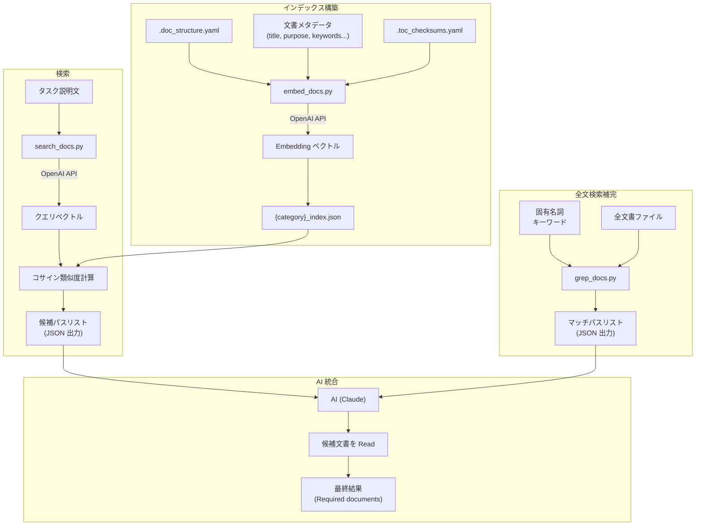
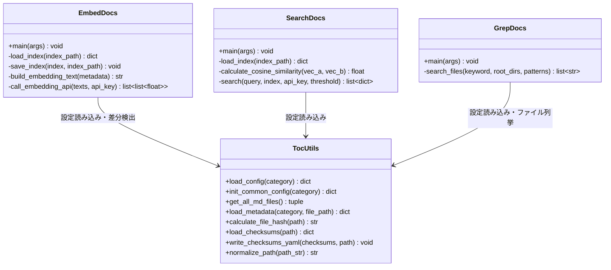
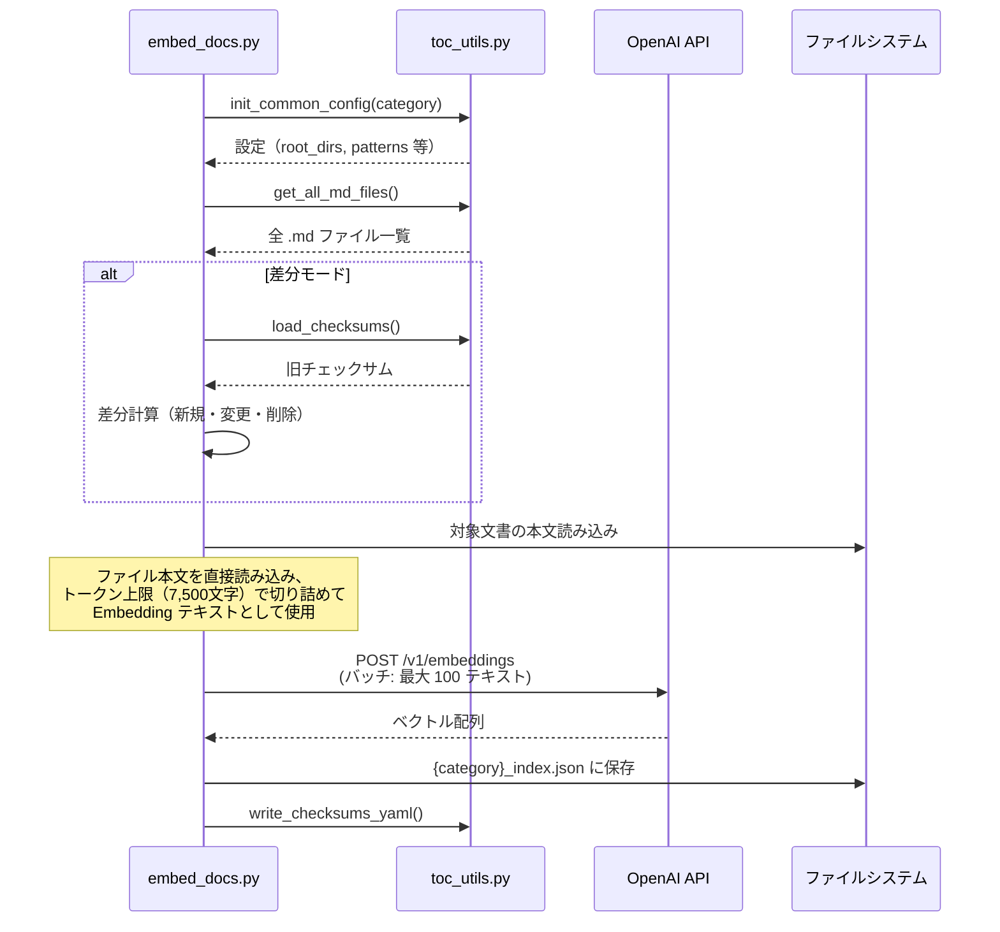
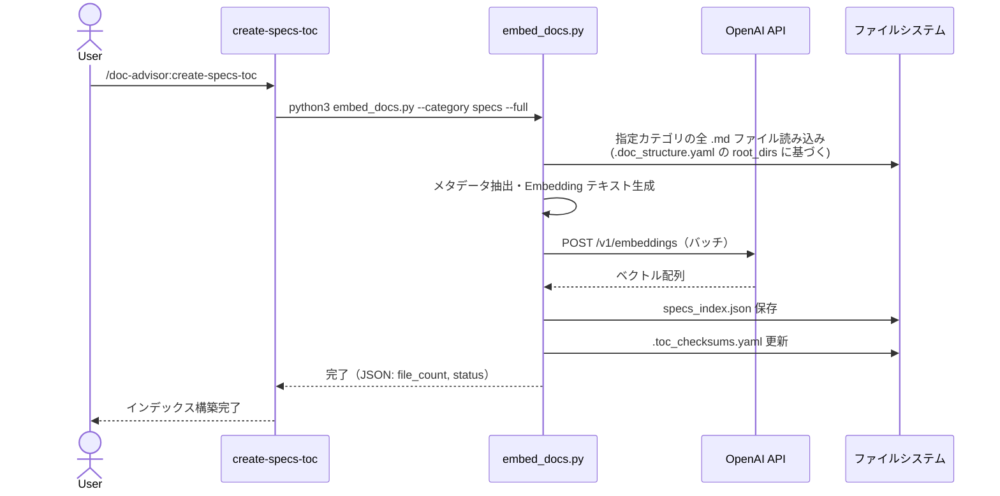
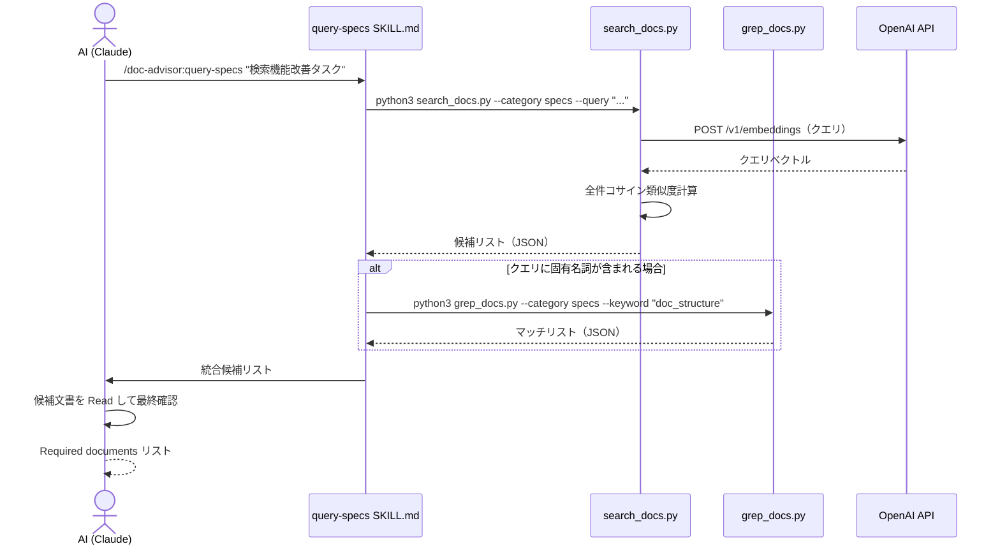

# DES-006 セマンティック検索 設計書

## メタデータ

| 項目     | 値                                       |
| -------- | ---------------------------------------- |
| 設計ID   | DES-006                                  |
| 関連要件 | FNC-001, FNC-002, FNC-003, NFR-001, NFR-002, NFR-003 |
| 作成日   | 2026-03-30                               |

## 1. 概要

doc-advisor の文書検索（query-specs / query-rules）を、AI が ToC YAML を全量読み込む方式から、**Embedding ベースのセマンティック検索 + 全文検索スクリプト** に置き換える。

採用アプローチ:
- **OpenAI Embedding API** で文書メタデータをベクトル化し、JSON ファイルに保存
- 検索時はコサイン類似度で候補を絞り込み、AI には候補パスリストのみ渡す
- 固有名詞・識別子の検索は全文検索スクリプトで補完（AI が判断して呼び出す）
- 外部依存は **OpenAI API キーのみ**（pip install 不要）

## 2. アーキテクチャ概要

### 2.1 コンポーネント図



### 2.2 責務の分担

| レイヤー | 責務 | 担当 |
| -------- | ---- | ---- |
| インデックス構築 | 文書本文の Embedding 化と永続化 | `embed_docs.py` |
| セマンティック検索 | クエリとインデックスのコサイン類似度計算 | `search_docs.py` |
| 全文検索 | 固有名詞・識別子のテキストマッチング | `grep_docs.py` |
| 検索統合 | 候補の統合、本文確認、最終判断 | AI（query-specs / query-rules SKILL.md） |
| 設定・差分検出 | .doc_structure.yaml の読み込み、チェックサム管理、ファイル列挙 | `toc_utils.py`（既存・再利用） |

## 3. モジュール設計

### 3.1 モジュール一覧

| モジュール | ファイルパス | 責務 | 依存 |
| ---------- | ------------ | ---- | ---- |
| `embed_docs.py` | `plugins/doc-advisor/scripts/embed_docs.py` | Embedding インデックス構築（全体・差分） | `toc_utils.py`, `urllib`（標準） |
| `search_docs.py` | `plugins/doc-advisor/scripts/search_docs.py` | セマンティック検索実行 | `toc_utils.py`, `urllib`（標準） |
| `grep_docs.py` | `plugins/doc-advisor/scripts/grep_docs.py` | 全文検索（テキストマッチング） | `toc_utils.py` |
| `toc_utils.py` | `plugins/doc-advisor/scripts/toc_utils.py`（既存） | 共通ユーティリティ | 標準ライブラリのみ |

### 3.2 クラス図



### 3.3 embed_docs.py 詳細設計

#### CLI インターフェース

```
python3 embed_docs.py --category {specs|rules} [--full] [--check]
```

| 引数 | 説明 |
| ---- | ---- |
| `--category` | 対象カテゴリ（必須） |
| `--full` | 全文書を再構築（省略時は差分更新） |
| `--check` | インデックスの新鮮さを確認し、古い場合は再構築を案内する（staleness check）。インデックスが存在しない場合や、文書のチェックサムが不一致の場合に `{"status": "stale", ...}` を返す |

#### 処理フロー



#### Embedding テキストの構成

各文書のファイル本文を直接読み込み、Embedding API に送信する:

1. `read_file_content()` でファイル本文を取得
2. `extract_title()` でタイトルを抽出（YAML frontmatter → `#` 見出し → ファイル名の優先順）
3. `truncate_to_token_limit()` で `text-embedding-3-small` のトークン上限（8,191 tokens）に合わせて切り詰め（日本語は 1文字≒1トークンで見積もり、上限 7,500 文字）

**空ファイル時のフォールバック**: 本文が空（空白のみ含む）の場合、`{title}\n{source_file}` をフォールバックテキストとして使用する。

技術選択の理由: ファイル本文を直接 Embedding することで、メタデータ抽出の中間層を排除し、文書内容の意味的類似性を最大限に活用できる。ToC YAML メタデータへの依存も解消される。

#### インデックス JSON スキーマ

```json
{
  "metadata": {
    "category": "specs",
    "model": "text-embedding-3-small",
    "dimensions": 1536,
    "generated_at": "2026-03-30T12:00:00Z",
    "file_count": 29
  },
  "entries": {
    "docs/specs/doc-advisor/design/DES-004_document_model.md": {
      "title": "Document Model Design Specification",
      "embedding": [0.012, -0.045, 0.078, ...],
      "checksum": "a1b2c3d4..."
    }
  }
}
```

| フィールド | 型 | 説明 |
| ---------- | -- | ---- |
| `metadata.category` | string | `specs` または `rules` |
| `metadata.model` | string | 使用した Embedding モデル名 |
| `metadata.dimensions` | int | ベクトルの次元数 |
| `metadata.generated_at` | string | ISO 8601 形式の生成日時 |
| `metadata.file_count` | int | エントリ数 |
| `entries.{path}.title` | string | 文書タイトル（検索結果表示用） |
| `entries.{path}.embedding` | array[float] | Embedding ベクトル |
| `entries.{path}.checksum` | string | ファイル内容の SHA-256 ハッシュ |

#### 差分更新ロジック

1. `load_checksums()` で旧チェックサムを読み込む
2. 現在のファイルのハッシュを計算し、旧チェックサムと比較
3. 新規・変更ファイルのみ Embedding API を呼び出す
4. 削除ファイルはインデックスから削除
5. チェックサム更新

`toc_utils.py` の `calculate_file_hash()` と `load_checksums()` を使用した差分検出を行う。

**NFR-002 中断再開への対応**: バッチ処理が部分失敗した場合、処理成功したファイルのチェックサムのみ更新し、失敗したファイルのチェックサムは更新しない。これにより、次回の差分更新で失敗分が自動的に再処理される。プロセスが強制終了した場合はチェックサムファイルが未更新のままとなるため、未処理の全ファイルが再処理される。

#### OpenAI API 呼び出し

```
POST https://api.openai.com/v1/embeddings
Content-Type: application/json
Authorization: Bearer {OPENAI_API_KEY}

{
  "model": "text-embedding-3-small",
  "input": ["text1", "text2", ...]
}
```

- API キーは環境変数 `OPENAI_API_KEY` から取得
- バッチサイズ: 最大 100 テキスト/リクエスト（API 制限内）
- エラー時: JSON エラー出力（`{"status": "error", "error": "..."}`)
- API キー未設定時: エラーメッセージで設定方法を案内

技術選択の理由: `text-embedding-3-small` を選択。コスト効率が最も高く（$0.02/1M tokens）、1536 次元で十分な精度。600 件の全体再構築でも $0.01 以下。`urllib.request` で HTTP リクエストを送信するため pip install 不要。

#### インデックスの保存先

```
.claude/doc-advisor/toc/{category}/{category}_index.json
```

既存の ToC YAML と同じディレクトリに配置する。

### 3.4 search_docs.py 詳細設計

#### CLI インターフェース

```
python3 search_docs.py --category {specs|rules} --query "タスクの説明文" [--threshold 0.3]
```

| 引数 | 説明 | デフォルト |
| ---- | ---- | ---------- |
| `--category` | 対象カテゴリ（必須） | — |
| `--query` | 検索クエリ（必須） | — |
| `--threshold` | 類似度スコアの下限閾値（この値以上の候補を全件返却） | 0.3 |

FNC-002「件数制限を設けない」要件に基づき、件数での制限（top-k）は設けず、閾値ベースで候補を返却する。

#### 処理フロー

1. `{category}_index.json` を読み込む
2. クエリを OpenAI Embedding API でベクトル化
3. インデックス内の全エントリとコサイン類似度を計算
4. スコア降順でソートし、閾値以上の全候補を JSON 出力

#### コサイン類似度の計算

```python
import math

def cosine_similarity(vec_a, vec_b):
    dot = sum(a * b for a, b in zip(vec_a, vec_b))
    norm_a = math.sqrt(sum(a * a for a in vec_a))
    norm_b = math.sqrt(sum(b * b for b in vec_b))
    if norm_a == 0 or norm_b == 0:
        return 0.0
    return dot / (norm_a * norm_b)
```

技術選択の理由: 600 件 × 1536 次元のコサイン類似度計算は、Pure Python でも数十ミリ秒で完了する。numpy や Vector DB は不要。

#### 出力形式

```json
{
  "status": "ok",
  "query": "検索機能を改善するタスク",
  "results": [
    {"path": "docs/specs/doc-advisor/design/DES-005_toc_generation_flow.md", "title": "ToC Generation Flow Design", "score": 0.89},
    {"path": "docs/specs/doc-advisor/design/DES-004_document_model.md", "title": "Document Model Design", "score": 0.82}
  ]
}
```

#### エラーケース

| 条件 | 出力 |
| ---- | ---- |
| インデックスが存在しない | `{"status": "error", "error": "Index not found. Run embed_docs.py first."}` |
| インデックスが古い（チェックサム不一致） | `{"status": "error", "error": "Index is stale. Run embed_docs.py to update."}` — 検索を実行せず再生成を案内する（FNC-002 対応） |
| Embedding モデル不一致 | `{"status": "error", "error": "Model mismatch: index uses {old_model}, current is {new_model}. Run embed_docs.py --full to rebuild."}` — インデックスの `metadata.model` と現在のモデル定数を比較し、不一致時は検索を実行せず `--full` 再構築を案内する |
| API キー未設定 | `{"status": "error", "error": "OPENAI_API_KEY not set."}` |
| API 呼び出し失敗 | `{"status": "error", "error": "API error: {詳細}"}` |

### 3.5 grep_docs.py 詳細設計

#### CLI インターフェース

```
python3 grep_docs.py --category {specs|rules} --keyword "doc_structure.yaml"
```

| 引数 | 説明 |
| ---- | ---- |
| `--category` | 対象カテゴリ（必須） |
| `--keyword` | 検索キーワード（必須） |

#### 処理フロー

1. `toc_utils.init_common_config(category)` で設定を読み込む
2. `toc_utils.get_all_md_files()` で対象ファイルを列挙
3. 各ファイルの内容を読み込み、キーワードの部分一致を検索（大文字小文字区別なし）
4. マッチしたファイルのパスを JSON 出力

#### 出力形式

```json
{
  "status": "ok",
  "keyword": "doc_structure.yaml",
  "results": [
    {"path": "docs/specs/doc-advisor/design/DES-004_document_model.md"},
    {"path": "docs/rules/implementation_guidelines.md"}
  ]
}
```

技術選択の理由: 600 件程度のファイルを順次読み込んでの文字列検索は、外部ツール（ripgrep 等）なしでも数百ミリ秒で完了する。AI が固有名詞を検出した場合にのみ呼び出されるため、頻度も低い。

### 3.6 スクリプト I/O 契約

全スクリプトは stdout に JSON のみを出力し、進捗ログは stderr に出力する。

| スクリプト | stdout | stderr | 終了コード | status 値 |
| ---------- | ------ | ------ | ---------- | --------- |
| `embed_docs.py` | JSON（結果） | 進捗ログ | 0: 成功, 1: 失敗/部分失敗 | `ok`, `partial`, `error` |
| `embed_docs.py --check` | JSON（鮮度） | なし | 0 | `fresh`, `stale`, `error` |
| `search_docs.py` | JSON（検索結果） | エラーログ | 0: 成功, 1: エラー | `ok`, `stale`, `error` |
| `grep_docs.py` | JSON（検索結果） | なし | 0: 成功, 1: エラー | `ok`, `error` |

## 4. ユースケース設計

### 4.1 ユースケース一覧

| ユースケース | 説明 |
| ------------ | ---- |
| UC-1 インデックス構築（全体） | 初回または再構築時に全文書の Embedding を生成 |
| UC-2 インデックス更新（差分） | 文書の追加・変更・削除を検出し、差分のみ更新 |
| UC-3 セマンティック検索 | タスク説明文から関連文書を検索 |
| UC-4 全文検索補完 | 固有名詞・識別子で文書を検索 |
| UC-5 精度検証 | ゴールデンセットで検索精度を測定 |

### 4.2 シーケンス図

#### UC-1: インデックス構築（create-specs-toc 経由）



#### UC-3: セマンティック検索（query-specs 経由）



## 5. 使用する既存コンポーネント

| コンポーネント | ファイルパス | 用途 |
| -------------- | ------------ | ---- |
| `load_config()` | `plugins/doc-advisor/scripts/toc_utils.py` | `.doc_structure.yaml` の読み込み |
| `init_common_config()` | 同上 | root_dirs, patterns, チェックサムパス等の初期化 |
| `get_all_md_files()` | 同上 | 対象ファイルの列挙（glob パターン対応） |
| `calculate_file_hash()` | 同上 | SHA-256 ハッシュによる変更検出 |
| `load_checksums()` | 同上 | 旧チェックサムの読み込み |
| `write_checksums_yaml()` | 同上 | チェックサムの書き出し |
| `normalize_path()` | 同上 | macOS NFC 正規化 |
| `ConfigNotReadyError` | 同上 | 設定未準備エラー |

## 6. SKILL.md の変更設計

### 6.1 query-specs / query-rules SKILL.md

現行のワークフローを以下に置き換える:

```
[現行]
1. staleness check
2. Read: {category}_toc.yaml（全量読み込み）
3. AI がメタデータを解析して候補を特定
4. 候補文書を Read

[新方式]
1. python3 search_docs.py --category {category} --query "{タスク説明}"
2. AI が結果を確認し、固有名詞があれば grep_docs.py で補完
3. 候補文書を Read して最終確認
```

staleness check は `embed_docs.py --check` モード（インデックスの新鮮さを確認）に置き換える。

### 6.2 create-specs-toc / create-rules-toc SKILL.md

現行の 3 フェーズパイプライン（pending YAML → toc-updater agent × N → merge）を以下に置き換える:

```
[現行]
Phase 1: create_pending_yaml.py → pending YAML テンプレート生成
Phase 2: toc-updater agent × N（並列 AI 解析）
Phase 3: merge_toc.py → validate_toc.py → checksums

[新方式]
python3 embed_docs.py --category {category} [--full]
```

単一スクリプトの実行で完了。AI による並列解析が不要になるため、大幅に高速化される。

ただし **メタデータの取得元が必要**。移行期間中は既存 ToC YAML のメタデータを使用する。ToC 廃止後のメタデータ取得方式は NFR-002 の移行設計で別途定義する。

## 7. データフロー設計

### 7.1 インデックス構築時

```
.doc_structure.yaml
    ↓ load_config()
root_dirs, patterns
    ↓ get_all_md_files()
対象 .md ファイル一覧
    ↓ load_checksums() + calculate_file_hash()
差分ファイル一覧（新規・変更のみ）
    ↓ 各ファイルのメタデータ読み込み（ToC YAML から）
Embedding テキスト生成
    ↓ OpenAI API（バッチ）
ベクトル配列
    ↓ save_index()
{category}_index.json
    ↓ write_checksums_yaml()
.toc_checksums.yaml 更新
```

### 7.2 検索時

```
タスク説明文（クエリ）
    ↓ OpenAI API
クエリベクトル
    ↓ load_index()
{category}_index.json の全エントリ
    ↓ cosine_similarity()（全件計算）
スコア付きリスト
    ↓ 閾値でフィルタ（threshold 以上の全件）
候補パスリスト（JSON 出力）
```

## 8. エラーハンドリング

| エラー | 検出方法 | 対応 |
| ------ | -------- | ---- |
| OPENAI_API_KEY 未設定 | `os.environ.get()` が None | JSON エラー出力 + 設定方法を案内 |
| API 呼び出し失敗（ネットワーク） | `urllib.error.URLError` | リトライ 1 回 → 失敗時 JSON エラー出力 |
| API 呼び出し失敗（認証エラー） | HTTP 401 | JSON エラー出力 + API キー確認を案内 |
| API 呼び出し失敗（レート制限） | HTTP 429 | 60 秒待機 → リトライ 1 回 |
| インデックス JSON が破損 | JSON パースエラー | 全体再構築を案内 |
| インデックスが存在しない | ファイル不在 | 構築を案内 |
| バッチ処理の部分失敗 | API 呼び出しエラー（バッチ途中） | 処理済み分のインデックスとチェックサムを保存し、未処理分は次回の差分更新で再処理する（冪等性を保証） |
| .doc_structure.yaml 未設定 | `ConfigNotReadyError` | JSON エラー出力（既存パターン踏襲） |

## 9. テスト設計

### 9.1 単体テスト

| テスト対象 | テストファイル | テスト内容 |
| ---------- | -------------- | ---------- |
| `embed_docs.py` | `tests/doc_advisor/scripts/test_embed_docs.py` | Embedding テキスト生成、インデックス JSON の読み書き、差分検出ロジック |
| `search_docs.py` | `tests/doc_advisor/scripts/test_search_docs.py` | コサイン類似度計算、閾値フィルタリング、出力 JSON 形式 |
| `grep_docs.py` | `tests/doc_advisor/scripts/test_grep_docs.py` | キーワードマッチング、大文字小文字無視、出力 JSON 形式 |

### 9.2 テスト方針

- **OpenAI API 呼び出しはモック化する**: テスト用の固定ベクトルを返すモックを使用
- **コサイン類似度の計算は実値でテスト**: 既知のベクトルペアで期待値を検証
- **差分検出は既存テスト（test_create_pending.py）のパターンを踏襲**

### 9.3 精度検証テスト（FNC-002 対応）

- ゴールデンセット（テストクエリ + 正解文書のペア）を `tests/doc_advisor/golden_set/` に配置
- テストスクリプトが search_docs.py を実行し、正解文書が全て候補に含まれるか検証
- 見落とし 0 件を自動テストで確認

## 10. 移行設計

### 10.1 移行フェーズ

| Phase | 内容 | ToC YAML | Embedding インデックス |
| ----- | ---- | -------- | --------------------- |
| **Phase 1** | Embedding インデックス構築。既存 ToC からメタデータ取得 | **維持** | 構築 |
| **Phase 2** | query-* SKILL.md を新方式に切り替え。精度検証 | **維持**（フォールバック用） | 運用 |
| **Phase 3** | 精度検証完了後、ToC YAML と生成パイプラインを廃止 | **廃止** | 運用 |

### 10.2 Phase 3 での廃止対象

NFR-002 に定義された以下を廃止:
- `{category}_toc.yaml`
- `create_pending_yaml.py`（差分検出ロジックは `toc_utils.py` に残す）
- `write_pending.py`
- `merge_toc.py`
- `validate_toc.py`
- `toc-updater.md`（エージェント定義）
- `.toc_work/` ディレクトリ機構
- 上記廃止対象に対応するテストファイル（`test_create_pending.py`, `test_write_pending.py`, `test_merge_toc.py`, `test_validate_toc.py` 等）

### 10.3 Phase 3 でのメタデータ取得

ToC YAML 廃止後、Embedding テキストの元となるメタデータは **文書本文から直接抽出** する。
抽出方法の選択肢:

1. **Front Matter から抽出**: 文書に YAML Front Matter（title, keywords 等）が記述されている場合
2. **AI による抽出**: toc-updater agent と同等のメタデータ抽出を embed_docs.py 内で実行（ただし AI 呼び出しコスト増）
3. **文書本文の先頭 N 文字を直接 Embedding**: メタデータ抽出をスキップし、本文をそのままベクトル化

選択肢 3 が最もシンプルだが、精度への影響を Phase 2 の検証で確認する。

## 改定履歴

| 日付 | バージョン | 内容 |
| ---- | ---------- | ---- |
| 2026-03-30 | 1.0 | 初版作成 |
