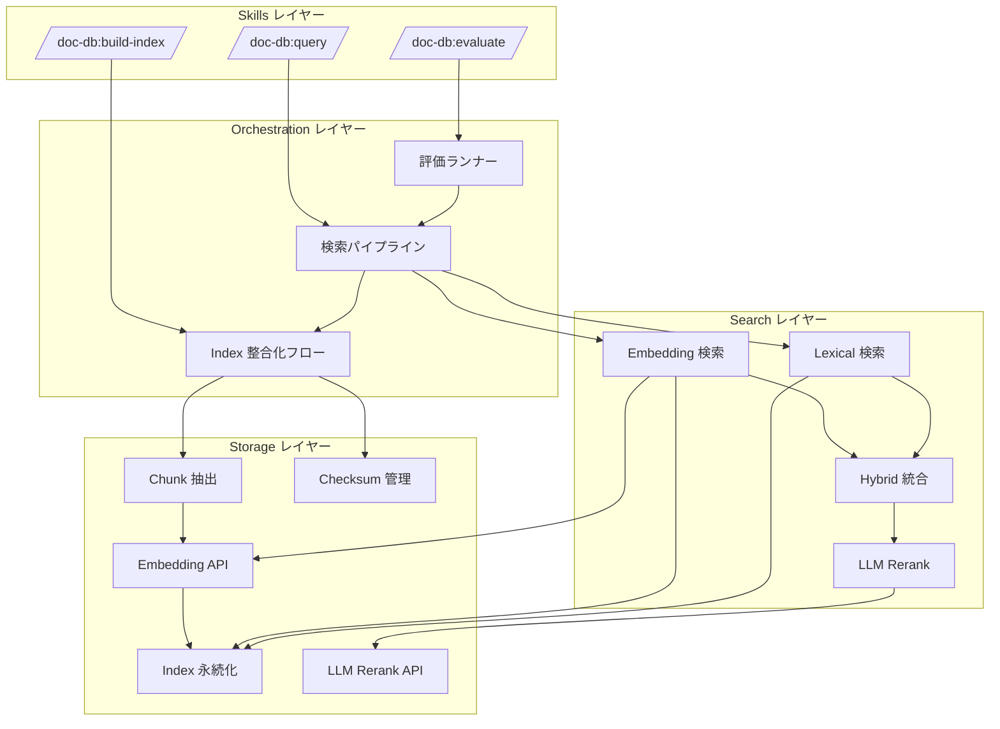
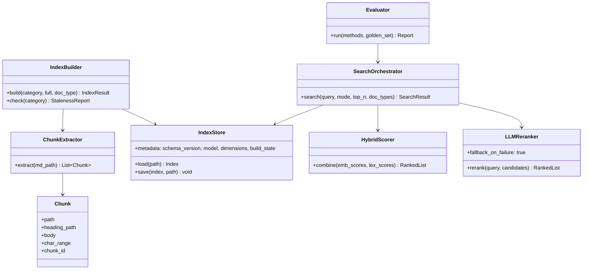
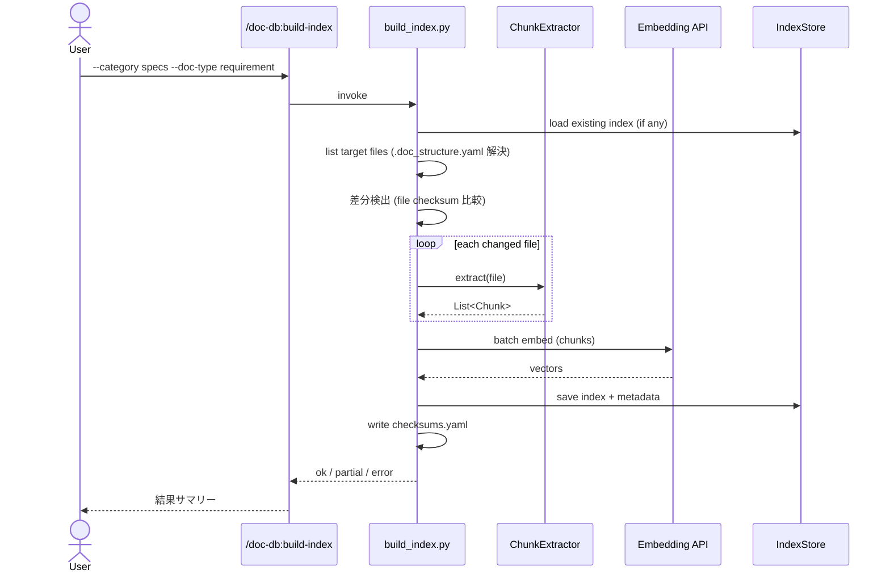
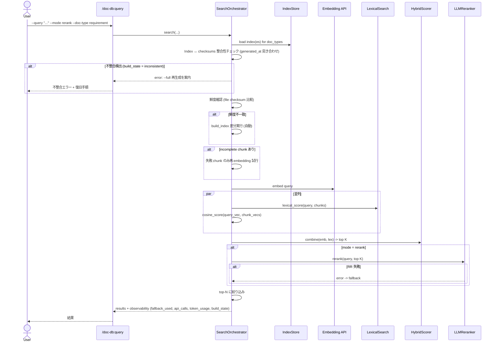
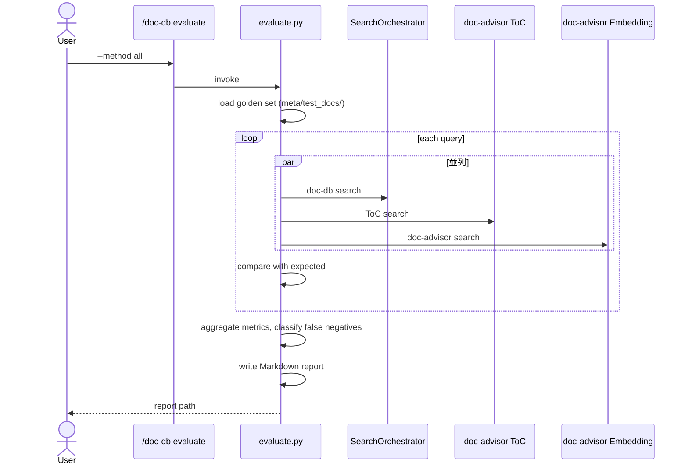

# DES-026 doc-db plugin 設計書

## メタデータ

| 項目     | 値                                              |
| -------- | ----------------------------------------------- |
| 設計ID   | DES-026                                         |
| 関連要件 | REQ-006 / FNC-005 / FNC-006 / FNC-007 / NFR-004 / NFR-005 |
| 作成日   | 2026-05-07                                      |
| 対象     | doc-db plugin（chunk 単位 Hybrid 検索 + LLM Rerank） |

## 1. 概要

doc-db は、doc-advisor v0.2.x の embedding 機構（`plugins/doc-advisor/scripts/`）を出発点として、**見出し単位 chunk + Hybrid 検索（Embedding + Lexical）+ LLM Rerank** を加えた独立 plugin である。doc-advisor 本体には変更を加えず、ベースとなる Python スクリプトを `plugins/doc-db/scripts/` 配下にコピーした上で、chunk 化対応・Lexical 検索・スコア統合・Rerank・doc_type 分離・ゴールデンセット評価を加える。

doc-advisor を品質比較ベースラインとして不変に保つことが本設計の最重要制約である（REQ-006 AC-01）。

## 2. アーキテクチャ概要

### 2.1 全体構成



### 2.2 doc-advisor との関係

doc-db は doc-advisor と**コード共有しない**（依存関係なし）。doc-advisor の主要スクリプトを以下の方針でコピー・拡張する:

| doc-advisor 側 | doc-db 側 | 方針 |
| -------------- | --------- | ---- |
| `embedding_api.py` | `plugins/doc-db/scripts/embedding_api.py` | コピー後、`EMBEDDING_MODEL` 定数を `text-embedding-3-large` に変更（OpenAI API 抽象化はそのまま） |
| `embed_docs.py` | `plugins/doc-db/scripts/build_index.py` | コピー → chunk 単位処理に拡張 |
| `search_docs.py` | `plugins/doc-db/scripts/search_index.py` | コピー → chunk + Hybrid + Rerank に拡張 |
| `create_checksums.py` / `toc_utils.py`（一部） | `plugins/doc-db/scripts/_utils.py` | 必要関数を抽出してコピー |
| `grep_docs.py` | `plugins/doc-db/scripts/lexical_search.py` | grep ベース実装を起点に拡張 |
| （新規） | `plugins/doc-db/scripts/chunk_extractor.py` | 見出し境界 chunk 抽出（doc-advisor に該当なし） |
| （新規） | `plugins/doc-db/scripts/hybrid_score.py` | Embedding + Lexical スコア統合 |
| （新規） | `plugins/doc-db/scripts/llm_rerank.py` | LLM Rerank API 呼び出し |
| （新規） | `plugins/doc-db/scripts/evaluate.py` | ゴールデンセット評価 |

**コード共有ではなくコピーを採用する理由**: doc-advisor を品質比較ベースラインとして不変に保つ制約上、doc-db 側の変更が doc-advisor の挙動に波及してはならない（AC-01）。共通ライブラリ化は将来的に doc-db が doc-advisor を置き換える判断が下されたタイミングで再検討する。

## 3. モジュール設計

### 3.1 モジュール一覧

| モジュール | 責務 | 依存 |
| ---------- | ---- | ---- |
| `chunk_extractor.py` | Markdown を見出し境界で chunk 化、各 chunk に文書パス・見出し階層・本文・char range を付与 | （標準ライブラリのみ） |
| `embedding_api.py` | OpenAI Embedding API 呼び出し、バッチ化、リトライ | `urllib.request`（標準） |
| `build_index.py` | Index 生成（全体 / 差分 / check）、chunk 抽出 → Embedding → 永続化、checksum 更新 | `chunk_extractor`, `embedding_api`, `doc_structure`, `_utils` |
| `search_index.py` | 検索 orchestrator（Index 整合化 → Embedding 検索 → Lexical 検索 → Hybrid 統合 → Rerank） | `embedding_api`, `lexical_search`, `hybrid_score`, `llm_rerank`, `doc_structure`, `_utils` |
| `doc_structure.py` | `.doc_structure.yaml` 読み込みと doc_types_map 解決（forge `resolve_doc_structure.py` 由来をコピー） | （標準ライブラリのみ） |
| `lexical_search.py` | BM25 スコアリング（TF-IDF ベース、文書長正規化）による語彙一致スコア算出、ID/固有名詞の完全一致を高スコア化 | `_utils` |
| `hybrid_score.py` | Embedding スコアと Lexical スコアを統合 | （標準ライブラリのみ） |
| `llm_rerank.py` | LLM Rerank API 呼び出し、失敗時 fallback | `urllib.request` |
| `evaluate.py` | ゴールデンセット評価ランナー、レポート生成 | `search_index`, `_utils` |
| `_utils.py` | checksum / hash / glob / NFC 正規化 / log の共通基盤 | （標準ライブラリのみ） |

### 3.2 SKILL レイヤー

| SKILL | 責務 | 引数 |
| ----- | ---- | ---- |
| `/doc-db:build-index` | `build_index.py` を起動して Index を生成・更新 | `--category {rules\|specs}` `[--full]` `[--check]` `[--doc-type ...]` |
| `/doc-db:query` | `search_index.py` を起動して検索を実行 | `--category {rules\|specs}` `--query "..."` `[--top-n N]` `[--mode {emb\|lex\|hybrid\|rerank}]` `[--doc-type ...]`（`--category specs` で `--doc-type` 未指定時は `.doc_structure.yaml` の全 doc_type を対象とする。特定種別の絞り込みは SKILL レイヤーが担う。`--category rules` は単一 Index のため `--doc-type` 無視）|
| `/doc-db:evaluate` | `evaluate.py` を起動してゴールデンセット評価を実行 | `[--method {toc\|advisor\|doc-db\|all}]` `[--output {path}]` |

SKILL.md にロジックは書かず、`${CLAUDE_PLUGIN_ROOT}/scripts/` のスクリプトを呼ぶ薄いラッパーに留める（doc-advisor の SKILL 構造を踏襲）。ただし `/doc-db:query` は grep 併用のワークフローを持つ（§3.4 参照）。

**入力バリデーション規則**（FNC-006 L52「設計書で確定する」を回収）:

| 引数 | 規則 | 違反時挙動 |
| ---- | ---- | ---------- |
| `--query` | `strip()` 後 1〜1024 文字 | stderr に JSON エラー、exit 2 |
| `--top-n` | 1〜100 の整数 | 同上 |
| `--mode` | `{emb, lex, hybrid, rerank}` allowlist | 同上 |
| `--doc-type` | `.doc_structure.yaml` の `doc_types_map` に存在する値の allowlist（複数指定はカンマ区切り） | 同上 |
| `--category` | `{rules, specs}` allowlist | 同上 |
| rerank 候補数（内部上限） | 1〜100 の範囲で §6.6 の token budget により動的決定 | budget 超過時は候補数を縮小（fallback 不要） |

違反時の出力形式: stderr に `{"error": "<理由>", "hint": "<修正案>"}` を JSON で返し、プロセスは exit code 2 で終了する。stdout には何も出力しない（JSON 結果と区別するため）。

### 3.4 SKILL レイヤーの grep 併用ワークフロー（FNC-006 GRP-01〜03）

`/doc-db:query` SKILL は、`search_index.py` による Hybrid 検索に加え、クエリに ID・固有名詞が含まれる場合にファイルシステム grep を実行して結果を統合する。これは doc-advisor の `query_index_workflow.md` Step 2 と同等の設計であり、Embedding が苦手とする「ID の完全一致検索」の false negative を防止する。

**ワークフロー:**

1. `search_index.py` による Hybrid 検索（emb/lex/hybrid/rerank）を実行
2. クエリからID パターン（`[A-Z]+-\d+`）・固有名詞を抽出
3. ID・固有名詞がある場合、`grep_docs.py` で対象ファイルを全文検索
4. grep 結果のうち Hybrid 検索結果に含まれないパスを補完候補として追加

**grep_docs.py の位置づけ:**

- `plugins/doc-db/scripts/grep_docs.py`（`lexical_search.py` とは別）
- `.doc_structure.yaml` の対象ファイルを走査し、keyword の行マッチを返す
- Hybrid 検索とは独立に動作するため、Index が incomplete でも grep は機能する

**SKILL.md への記述方針:**

SKILL.md にはワークフロー（条件分岐・grep 呼び出し・結果統合の手順）を記述する。これは「ロジック」ではなく「AI への実行指示」であり、DES-026 §3.2 の「ロジックを書かない」原則に違反しない（doc-advisor の SKILL が workflow.md を参照する構造と同等）。

### 3.3 クラス図



## 4. データ設計

### 4.1 Index フォーマット（JSON）

doc-advisor の Index 構造を chunk 単位に拡張する。永続化形式は JSON（doc-advisor 準拠）。

```jsonc
{
  "metadata": {
    "schema_version": "1.0",      // doc-db 専用、doc-advisor とは別系統
    "category": "specs",
    "doc_type": "requirement",     // specs のみ。rules では null
    "model": "text-embedding-3-large",
    "dimensions": 3072,
    "generated_at": "2026-05-07T...",
    "chunk_count": 1234,
    "file_count": 87,
    "build_state": "complete",     // complete | incomplete | inconsistent
    "failed_chunks": [             // incomplete 時のみ。再 embedding 判断と可観測性のため構造化
      {
        "chunk_id": "...",         // file path + heading_path から生成される一意 ID
        "path": "...",
        "error_type": "rate_limit", // rate_limit | timeout | 5xx | invalid_request | other
        "message": "...",          // API レスポンスの error message（簡略化可）
        "attempts": 3,
        "last_failed_at": "2026-05-07T..."
      }
    ]
  },
  "entries": {
    "{path}#{chunk_id}": {
      "path": "docs/specs/doc-db/requirements/REQ-006_doc_db.md",
      "chunk_id": "001",
      "heading_path": ["REQ-006: doc-db plugin 要件定義書", "概要"],
      "body": "doc-db は、...",
      "char_range": [0, 580],
      "embedding": [0.123, ...],
      "checksum": "sha256-..."     // 文書ファイル単位の hash
    }
  }
}
```

### 4.2 chunk_id の生成

`{file_path} + heading_path` から SHA-256 を取り、先頭 8 文字を chunk_id とする。同一 file 内で重複する見出し（例: `## 概要` が複数）は連番サフィックス `-2` `-3` ... を付与する。

### 4.3 doc_type 単位 Index 分離（FNC-005 ST-01）

specs 配下の Index は `doc_types_map` 単位でファイル分離する:

```
.claude/doc-db/index/
├── rules/
│   └── rules_index.json
└── specs/
    ├── requirement_index.json
    ├── design_index.json
    └── plan_index.json
```

検索時は指定された doc_type に対応する Index ファイルだけを load する。複数 doc_type 指定時は load → 結果マージ。

### 4.4 Checksum ファイル

doc-advisor 互換の YAML 形式（`.embedding_checksums.yaml`）を doc_type 単位で分離して持つ:

```
.claude/doc-db/index/specs/requirement_index.checksums.yaml
```

差分更新の単位は **file 単位**を初期実装とする（chunk 単位 hash は v0.2 以降で再検討）。理由: 実装複雑度を下げる。chunk 単位 hash にしても、見出し変更で chunk_id が変わるため再 embedding は避けられない。

## 5. ユースケース設計

### 5.1 ユースケース一覧

| UC | 名前 | 起点 |
| -- | ---- | ---- |
| UC-01 | Index 全体生成 / 差分更新 | `/doc-db:build-index` |
| UC-02 | 検索（Hybrid + Rerank） | `/doc-db:query` |
| UC-03 | ゴールデンセット評価 | `/doc-db:evaluate` |

### 5.2 UC-01: Index 生成・差分更新

**前提**: `.doc_structure.yaml` が存在し、OPENAI_API_DOCDB_KEY が設定されている。



**正常フロー**:

1. doc_types_map から対象 doc_type の root_dir を解決
2. 既存 Index を load（無ければ空、schema_version 不一致なら `--full` 案内）
3. 対象ファイル一覧を取得（`.doc_structure.yaml` の glob / exclude 尊重）
4. checksum 比較で差分検出（新規・変更・削除）
5. 変更/新規 file から chunk 抽出
6. chunk をバッチで Embedding（失敗 chunk は metadata の `failed_chunks` に記録、build_state = incomplete）
7. Index・checksums を二相書き込み（後述「Index ↔ checksums の二相整合性」参照）

**Index ↔ checksums の二相整合性**:

doc-advisor 現行実装は Index 単体の atomic 書き込み（tmp → `os.replace`）のみで、Index と checksums.yaml の二相整合性は保証しない。doc-db では以下の方針で改善する（FNC-005 ST-02 の整合性維持要件に対応）:

- 書き込み順序: ①`{index}.tmp` と `{checksums}.tmp` を両方生成して fsync → ②両方の生成成功を確認後、`os.replace` を **Index → checksums の順** で実行 → ③途中失敗時は tmp を削除して旧状態を保持
- 整合性確認: Index metadata と checksums.yaml の双方に同一の `generated_at` を埋め込み、起動時（build / search 双方）に両者を突き合わせる
- 起動時整合性チェック: `generated_at` 不一致 / 片方欠損 → `build_state = "inconsistent"` として検出し、`--full` 再生成を案内する（自動再生成は行わず、ユーザー判断に委ねる — 比較公平性を損なう自動操作を避ける）

**エラーフロー**:

- API key 未設定 → エラー終了、設定方法を案内
- model mismatch / dimensions mismatch → 既存 Index 保護、`--full` 案内
- API エラー（リトライ後も失敗）→ 該当 chunk スキップ、incomplete 状態で保存（次回検索時に FNC-005 ST-02 の incomplete 復旧フローで自動再 embedding）
- Index ↔ checksums 不整合（`generated_at` 不一致）→ 上記「起動時整合性チェック」で検出、`--full` 再生成案内

### 5.3 UC-02: 検索（Hybrid + Rerank）



**検索結果スキーマ**（NFR-004 QUL-03 説明可能性 / FNC-007 MET-03 API コスト集計に対応）:

```jsonc
{
  "results": [
    {
      "path": "...",
      "heading_path": "...",
      "body": "...",
      "score": 0.87,
      "breakdown": { "emb": 0.82, "lex": 0.45, "rerank": 0.91 }  // 採用方式に応じてキーが変動
    }
  ],
  "fallback_used": false,         // RR 失敗時 true
  "rerank_error": null,            // fallback 時のエラー種別: "context_window_exceeded" / "timeout" / "5xx" / null
  "api_calls": { "embedding": 1, "rerank": 1 },
  "token_usage": { "embedding": 32, "rerank": 12345 },
  "build_state": "complete",       // complete | incomplete | inconsistent
  "incomplete_count": 0            // incomplete 時の failed_chunks 件数
}
```

stderr には構造化ログ（JSON 1 行 / イベント）として `event_type`（`fallback_triggered` / `incomplete_detected` / `validation_error` 等）と詳細を出力する（CI / 評価 runner からのパースを容易にする）。

**正常フロー**:

1. 指定 doc_type の Index を load（rules は単一 Index）。`--category specs` で `--doc-type` 未指定時は `.doc_structure.yaml` の全 doc_type を対象とする。特定種別の絞り込みは SKILL レイヤーが担う
2. Index 鮮度確認（FNC-006 §2「doc-advisor から継承する機能」: 検索開始時の鮮度確認・差分自動再生成）→ 不一致なら差分再生成（FNC-005 §1「doc-advisor から継承する機能」: 差分更新）
3. incomplete Index（FNC-005 ST-02）なら失敗 chunk を再 embedding
4. クエリを Embedding 化、Lexical 検索を並列実行
5. Hybrid 統合で上位 K 件（K = TBD-007 で決定する rerank 候補数）
6. mode が rerank なら LLM Rerank、失敗時は統合スコア順に fallback
7. top-N に絞り、スコア内訳とヒット理由を含めて返却

### 5.4 UC-03: ゴールデンセット評価



**評価指標**:

- recall / precision / false negative 数
- 検索時間（クエリごとの elapsed time）
- Index 生成時間
- API 種別ごとのコール数・消費 token 数

**レポート出力**: Markdown 形式、方式別集計表 + false negative 一覧 + 傾向分類。

## 6. 設計判断（要件 TBD の解消）

要件側で「設計書で確定」とした項目を以下のように決定する。代替案も併記する。

### 6.1 chunk 境界（CHK-01）

**採用**: 全見出し階層（H1〜H6）で切る。各 chunk に親見出し階層を全て保持。

| 代替案 | 採否 | 理由 |
| ------ | ---- | ---- |
| H1〜H6 全階層で切る | ✅ 採用 | 細粒度で意味境界に沿う。ID 検索で見出し ID 単位ヒットが効きやすい |
| H1〜H2 のみで切る | 不採用 | chunk が長くなり embedding の意味希釈が起きやすい |
| 固定 token 数で切る | 不採用 | Markdown 構造を無視して意味境界を分断する |

### 6.2 chunk 上限サイズ（FNC-005 CHK-04 相当）

**採用**: 1 chunk = 8192 文字（chars）を上限とし、超過時は段落境界（空行）で再分割。

正確な token 数制御には tiktoken 等の外部ライブラリが必要であり NFR-005（標準ライブラリのみ）に抵触するため、文字数による近似を採用する。日本語文書では 8192 chars ≈ 4096-8192 tokens となり `text-embedding-3-large` の入力上限（8192 tokens）を実用上超えない。英語主体文書では 8192 chars ≈ 2048 tokens となり上限の 1/4 程度で収まるが、embedding 品質への悪影響はない（短い chunk は意味の希釈を起こさない）。

### 6.3 field 別ベクトル（EMB-01）

**初期実装**: 本文 1 ベクトルのみ（Multi-vector の対象は file 単位ではなく chunk 単位）。

**v0.2 以降の検討**: title / heading_path 別ベクトルの追加。検索時にスコア集約方式を持つ。

### 6.4 Lexical 検索のスコアリング（FNC-006 LEX-01）

**採用**: 空白＋記号分割 + ID パターン（`[A-Z]+-\d+`）優先処理 + **BM25 スコアリング**。

| 代替案 | 採否 | 理由 |
| ------ | ---- | ---- |
| 空白＋記号分割 + ID パターン | ✅ 採用 | 標準ライブラリのみで動作（NFR-005）。ID 検索の高スコア化要件（LEX-01）を満たす |
| 日本語形態素解析（MeCab 等） | 不採用 | 外部 pip パッケージが必要（NFR-005 違反） |
| 出現頻度のみ（TF） | 不採用（v0.2 で廃止） | "ai" のような一般的なトークンが過大評価される問題が判明。多数の無関係 chunk が RRF で上位に来る |
| BM25 (TF-IDF + 文書長正規化) | ✅ 採用（v0.2） | 標準ライブラリのみで実装可能（NFR-005）。IDF により一般的なトークンの重みが自動的に低下し、RRF 融合時の信号品質が向上する |

**スコア式**: BM25。各クエリトークンの TF（chunk 内出現頻度）× IDF（全 chunk 母集団での逆文書頻度）× 文書長正規化係数。

```
score(q, d) = Σ IDF(t) × (TF(t,d) × (k1+1)) / (TF(t,d) + k1 × (1-b + b × |d|/avgdl))
```

- `k1=1.5`（TF の飽和係数）、`b=0.75`（文書長正規化係数）— 標準パラメータ、ゴールデンセット評価で検証
- IDF はインデックス構築時に全 chunk を対象として算出し、インデックス内 `metadata.idf_stats` に保存する
- ID 完全一致ボーナス（`[A-Z]+-\d+`）は BM25 スコアに加算する

**同義語展開（Synonym Expansion）**: 非採用。クロスランゲージ同義語（例: "エージェント" ↔ "Agent"）のマッチングは Embedding 検索が担う。Lexical 検索は正規化済みトークンの完全一致のみ行い、手動辞書による同義語展開は保持しない。

### 6.5 スコア統合方式（SC-01）

**採用**: Reciprocal Rank Fusion（RRF）を初期実装、設定で α 加重統合（`α * emb + (1-α) * lex`）に切替可能。

| 代替案 | 採否 | 理由 |
| ------ | ---- | ---- |
| RRF | ✅ 採用 | スコア正規化が不要で安定。`k=60` の標準パラメータで動作 |
| 線形加重統合 | ✅ 切替可能 | 実験のため設定で選べる |
| Embedding スコアのみ | 不採用 | Hybrid の意味がない |

### 6.6 LLM Rerank 候補数（TBD-007）

**採用**: 初期上限を **top-30**（rerank 候補）とし、rerank → top-N（既定 N=10）。候補数は実行時に token budget で動的制御する。

**rerank prompt 構造**: 各候補は chunk 本文全体ではなく `heading_path` + 本文 preview（先頭 200 token 程度に切り詰め）として prompt に投入する。これにより chunk あたりの prompt 消費を抑え、候補数 30 件を 1 回の LLM 呼び出しに収めることを狙う。chunk あたりの上限 8192 tokens（6.2）は埋め込み入力の上限であり、rerank prompt にそのまま投入する前提ではない。

**token budget による動的制御**:

- 採用 LLM `gpt-4o-mini` の context（128K）から `prompt_overhead`（system + 指示文）と `output_budget`（モデルの返却 token）を差し引いた残りを candidate budget とする
- 安全マージンとして context の 70% を入力上限とする
- `floor((128K × 0.7 − prompt_overhead − output_budget) / 候補あたり token)` を上限とし、初期値 30、下限 5 で動的に調整する
- preview の切り詰め長・safety margin・初期値 30 の妥当性はゴールデンセット評価（FNC-007）で検証する

> 注: 本節は context window への収容を「狙う」構造を提示するに留まる。実行時の token 計算結果は呼び出しごとに変動するため、設計書はその達成値を保証しない（具体パラメータは評価結果に応じて運用側で調整）。

### 6.7 Embedding モデル / LLM Rerank モデル

**採用**:

- Embedding: `text-embedding-3-large`（3072 次元）— chunk 単位検索の表現力向上を目的に採用
- LLM Rerank: `gpt-4o-mini`（コスト・レイテンシ優先）

> 注: doc-advisor の現行実装は `text-embedding-3-small`（1536 次元）であり、本設計書時点で両者の embedding モデルは異なる。比較公平性は FNC-007 評価機能で扱う。具体的には次の手順で比較条件を揃える:
>
> - ゴールデンセット評価実行時に doc-advisor 側 Index を `text-embedding-3-large` で再生成した一時 Index を作成し、同一モデル条件で recall / precision / token 数を測定する（doc-advisor 本体の Index ファイルは不変に保つ — AC-01）
> - 一時 Index の生成手順（doc-advisor 本体・既存 Index を不変に保つための運用手順）:
>   1. 評価用の一時作業ディレクトリ（例: `meta/test_docs/_tmp_3large/`、以降 `$TMP` は絶対パスを表す）を用意し、doc-advisor の検索実装（`embed_docs.py` / `search_docs.py` / `embedding_api.py` / `toc_utils.py` 等の依存モジュール）を `$TMP/scripts/` にコピーする
>   2. コピー先の `embedding_api.py` でのみ `EMBEDDING_MODEL` を `text-embedding-3-large` に差し替える（`plugins/doc-advisor/` 配下は編集しない）
>   3. 評価対象文書の解決元を $TMP に閉じ込めるため、評価対象 `docs/` 配下を `$TMP/docs` として symlink する（読み取り専用利用なので元ファイルは不変）。`.doc_structure.yaml` の `root_dirs` / glob は project_root 相対で解決されるため、symlink により $TMP を project_root に切り替えても評価対象ファイルが解決可能になる
>   4. 評価専用の `.doc_structure.yaml` を `$TMP/.doc_structure.yaml` として用意し、`specs` / `rules` 双方の設定で **`index_file` に絶対パス**（例: `index_file: /abs/path/to/$TMP/index/specs/specs_index.json`）を明示する。これにより `embed_docs.py` / `search_docs.py` の `get_index_path()` は project_root 解決の影響を受けず、Index 本体と同階層の `.embedding_checksums.yaml` も含めて出力先が `$TMP` 配下に閉じる
>   5. 実行時は **`CLAUDE_PROJECT_DIR=$TMP` を明示** し（`toc_utils.get_project_root()` は cwd より `CLAUDE_PROJECT_DIR` を優先するため、cwd 変更だけでは不十分）、コピー版の `embed_docs.py --category {specs|rules} --full` を実行する。これにより `$TMP/.doc_structure.yaml` が確実に読み込まれ、出力先（`index_file`）と評価対象（`root_dirs` 経由の symlink）が共に `$TMP` に閉じる
>   6. 評価終了後は `$TMP` をディレクトリごと削除する。`plugins/doc-advisor/` および `.claude/doc-advisor/` 配下のファイルは全工程を通じて一切変更しない（AC-01 境界の運用手順）
> - レポートには「同一モデル条件（3-large）」と「現行モデル条件（doc-db: 3-large / doc-advisor: 3-small）」の双方を併記する
>
> Index metadata の `model` / `dimensions` は実際に build した embedding モデルを記録し、検索時に metadata と実装の `EMBEDDING_MODEL` 定数が不一致なら `--full` 再生成を案内する（6.8 schema_version migration と同様の経路）。

| 代替案 | 採否 | 理由 |
| ------ | ---- | ---- |
| Embedding を 3-small に変更（doc-advisor と同一モデル） | 不採用 | chunk 単位検索の表現力を優先。比較公平性は FNC-007 評価側で揃える方針 |
| LLM Rerank を gpt-4o（無印） | 不採用 | コストが高くゴールデンセット評価の試行回数を制約する |

### 6.8 schema_version migration 戦略（FNC-005 ST-04 相当）

**採用**: schema_version 不一致時は `--full` 再生成案内（doc-advisor の挙動に整合）。

段階的 migration（COMMON-REQ-001 風）は v0.2 以降で再検討。理由: 初期実装ではスキーマ変更頻度が高く、毎回 migration 関数を書くより `--full` で再生成する方が単純で安全。

### 6.9 Index 永続化形式

**採用**: JSON（doc-advisor 準拠）。

| 代替案 | 採否 | 理由 |
| ------ | ---- | ---- |
| JSON | ✅ 採用 | 標準ライブラリのみで読み書き可（NFR-005）。doc-advisor と互換 |
| sqlite | 不採用 | NFR-005（標準ライブラリのみ）には適合するが、検索基盤としての sqlite は本要件で必要なクエリ機能（ベクトル検索）を持たないため利点なし |
| MessagePack / Protobuf | 不採用 | 外部 pip パッケージが必要 |

## 7. 使用する既存コンポーネント

| コンポーネント | ファイルパス | 用途 |
| -------------- | ------------ | ---- |
| OpenAI API 呼び出し抽象 | `plugins/doc-advisor/scripts/embedding_api.py` | コピー → `EMBEDDING_MODEL` を `text-embedding-3-large` に変更し、OpenAI API 抽象は踏襲（§2.2 と整合） |
| checksum / NFC / log ヘルパー | `plugins/doc-advisor/scripts/toc_utils.py`（必要関数のみ） | 抽出してコピー |
| Index build スケルトン | `plugins/doc-advisor/scripts/embed_docs.py` | コピー → chunk 単位に拡張 |
| 検索 orchestrator スケルトン | `plugins/doc-advisor/scripts/search_docs.py` | コピー → Hybrid + Rerank 拡張 |
| Lexical 検索の起点 | `plugins/doc-advisor/scripts/grep_docs.py` | コピー → スコアリング追加 |

| `.doc_structure.yaml` 解決 | `plugins/forge/skills/doc-structure/scripts/resolve_doc_structure.py` | コピー → `plugins/doc-db/scripts/doc_structure.py` として自 plugin 内に閉じる（forge は設計時の参照元、runtime 依存は持たない） |

**新規作成（doc-advisor に該当なし）**:

- `chunk_extractor.py` — Markdown 見出し境界 chunk 抽出
- `hybrid_score.py` — RRF / 線形加重スコア統合
- `llm_rerank.py` — LLM Rerank API 呼び出し
- `evaluate.py` — ゴールデンセット評価ランナー

## 8. テスト設計

### 8.1 単体テスト

`tests/doc_db/` に配置（CLAUDE.md 規約準拠）。

| テスト対象 | 検証内容 |
| ---------- | -------- |
| `chunk_extractor.py` | 見出し境界分割、見出しなし文書、見出し階層保持、char_range の正確性 |
| `hybrid_score.py` | RRF の決定論性、線形加重の境界値（α=0 / α=1）、空入力 |
| `lexical_search.py` | ID パターン高スコア化、大文字小文字正規化、全角半角正規化 |
| `_utils.py` | checksum 計算の安定性、glob 解決 |
| `build_index.py` | 差分更新（新規/変更/削除）、incomplete 状態の記録、schema mismatch 時の保護 |
| `search_index.py` | 鮮度確認、自動再生成、自動再 embedding、各 mode の出力フォーマット |
| `llm_rerank.py` | API 失敗時の fallback（統合スコア順にそのまま返す） |
| `evaluate.py` | recall / precision の計算、false negative 分類 |

### 8.2 統合テスト

| シナリオ | 検証内容 |
| -------- | -------- |
| Index 構築 → 検索 → 評価のエンドツーエンド | meta/test_docs/ の小規模ゴールデンセットで通る |
| doc_type 単位 Index 分離 | 複数 doc_type 指定時のマージ結果が正しい |
| doc-advisor との並行運用 | doc-db の build / query が doc-advisor の Index を変更しない |

### 8.3 検索品質テスト

`meta/test_docs/` ゴールデンセットで recall / precision を測定。これはユニットテストではなく **評価機能（FNC-007）の責務** で扱う。

## 9. 実装ロードマップ概略

設計書の主目的ではないが、計画書（次フェーズ `/forge:start-plan`）への引き継ぎとして概略を記載する:

| Phase | 内容 |
| ----- | ---- |
| P1 | コピー（embedding_api.py / build_index.py / search_index.py 骨格）+ 標準ライブラリ JSON 永続化 |
| P2 | chunk_extractor.py 実装 + Index フォーマットの chunk 単位化 |
| P3 | lexical_search.py + hybrid_score.py + Hybrid 検索動作 |
| P4 | llm_rerank.py + Rerank ON/OFF |
| P5 | doc_type 単位 Index 分離 + SKILL レイヤー |
| P6 | evaluate.py + ゴールデンセット評価 + 比較レポート |

## 改定履歴

| 日付       | バージョン | 内容 |
| ---------- | ---------- | ---- |
| 2026-05-07 | 1.0        | 初版作成。要件定義 6 文書（doc-advisor ベース差分仕様）から設計書を導出。要件 TBD-007（rerank 候補数）と設計委譲だった主要パラメータ（chunk 境界・スコア統合・モデル選定・migration 戦略）を確定 |
| 2026-05-08 | 1.1        | §6.2 chunk 上限を tokens → chars 近似に改定（NFR-005 制約）。§3.4 SKILL レイヤーの grep 併用ワークフローを追加（FNC-006 GRP-01〜03 対応） |
| 2026-05-09 | 1.2        | §3.2・§5 の `--doc-type` デフォルトを `requirement,design` ハードコードから `.doc_structure.yaml` 全 doc_type 動的取得に改定。絞り込みポリシーは SKILL レイヤーに移動 |
| 2026-05-11 | 1.3        | §6.4 Lexical スコアリングを TF のみ → BM25（TF-IDF + 文書長正規化）に改定。同義語展開（PHRASE_SYNONYMS）を非採用として明記。§3.1 モジュール説明を BM25 ベースに更新 |
