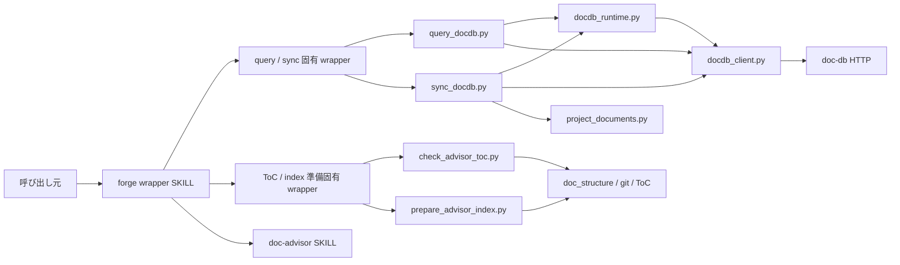
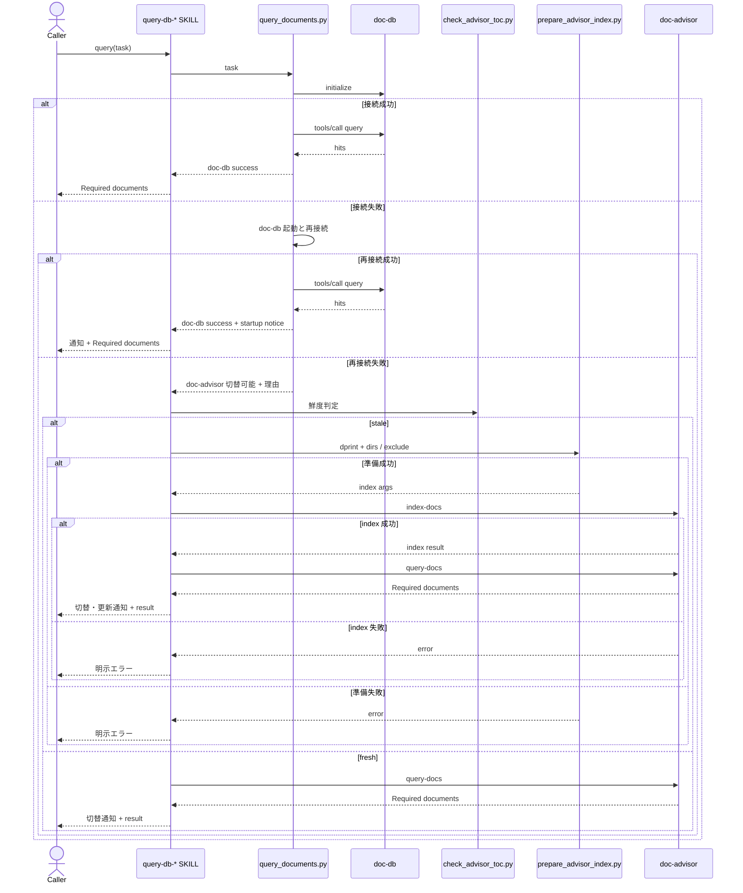
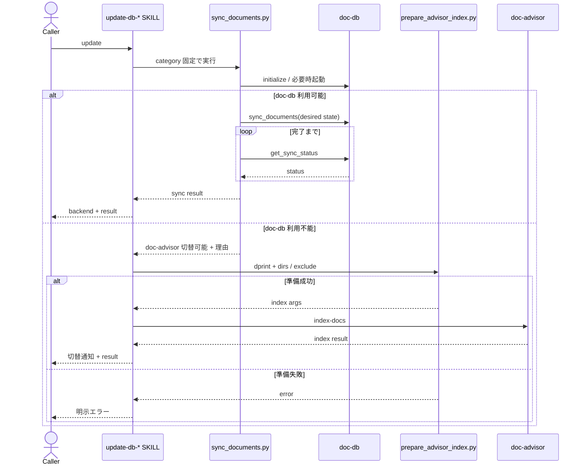

# DES-057 doc-db バックエンド選択 設計書

## メタデータ

| 項目     | 値         |
| -------- | ---------- |
| 設計 ID  | DES-057    |
| 関連要件 | REQ-014    |
| 作成日   | 2026-07-28 |

## 1. 概要

4 つの文書検索 wrapper に、doc-db を優先するバックエンド選択を追加する。
doc-db との通信は登録済み MCP ツールに依存せず、Python 標準ライブラリによる Streamable HTTP クライアントで行う。
doc-db が接続不能で起動にも失敗した場合だけ、既存の doc-advisor SKILL へ切り替える。

バックエンド固有処理は共有低レベル script に閉じ、各 SKILL は category 固定の薄い wrapper と外部 SKILL の起動だけを担当する。
これにより、選択規則を 4 つの SKILL.md に重複させず、既存の SKILL 名・引数・検索結果形式を維持する。

## 2. 設計方針

### 2.1 バックエンド選択境界

doc-db への接続確認、起動試行、再接続、および doc-db 操作は同一の低レベル script 内で実行する。
script は次のいずれかを確定して返す。

| 結果                  | 意味                                                         | 後続処理                              |
| --------------------- | ------------------------------------------------------------ | ------------------------------------- |
| doc-db 成功           | initialize と対象 operation が完了した                       | 結果を返して終了                      |
| doc-advisor 切替可能  | doc-db が未導入、起動不能、または起動後も接続不能            | SKILL が doc-advisor の利用可否を確認 |
| doc-db operation 失敗 | 接続確立後の query / sync が失敗または完了待ち上限に到達した | 明示エラー。別 backend へ切り替えない |

接続確立後の operation 失敗を doc-advisor へ切り替えない。
索引内容、入力、サーバ内部処理などの障害を「doc-db が利用不能」と誤分類して隠蔽しないためである。

### 2.2 HTTP 直結

doc-db クライアントは `http://localhost:{port}/mcp` に対し、次の順で JSON-RPC を送信する。

1. `initialize`
2. `notifications/initialized`
3. `tools/call`

`Mcp-Session-Id` を同一 operation 中に保持し、JSON 応答と SSE 応答の両方を解析する。
port は `~/.doc-db/doc-db.yaml` の `port` を読み、未設定または読み取り不能の場合は doc-db の既定 port を使用する。
認証情報を読む処理および出力する処理は持たない。

通信定数は参考実装の契約を引き継ぎ、通常 operation の HTTP timeout と sync 完了待ち上限を 600 秒、
sync status の poll 間隔を 2 秒、既定 port を 58080 とする。
接続 probe は localhost の起動確認専用として HTTP timeout を 1 秒、起動待ち期限を 10 秒、再試行間隔を 0.25 秒とする。
probe 値は利用者向け性能目標ではなく、未起動判定を長時間ブロックせず doc-advisor へ切り替えるための内部上限である。

### 2.3 on-demand 起動

初回接続に失敗した場合、`shutil.which("doc-db")` で実行ファイルを解決する。
解決できた場合は `subprocess.Popen` の新規セッションとして起動し、標準入力・標準出力・標準エラーを切り離す。
サーバログは doc-db 自身の設定先に委ね、forge はログファイルを生成しない。

起動後は localhost の MCP initialize を期限付きで再試行する。
別 wrapper が同時に doc-db を起動して一方のプロセスが終了した場合でも、MCP 接続に成功すれば利用可能と判定する。
接続できなければ、実行ファイル不在、プロセス起動失敗、早期終了、再接続不能のいずれかを理由コードとして返す。

この起動は現在の wrapper 実行を完了するための on-demand 起動である。
OS ログイン時の自動起動、サービス登録、停止、再起動監視は行わない。

### 2.4 doc-advisor 切替

doc-advisor の installed / available 判定は、SKILL 実行時の available-skills を正とする。
Python script は Claude Code の SKILL registry を推測しない。

doc-db script が切替可能を返した場合、SKILL は対応する `doc-advisor:query-docs` または
`doc-advisor:index-docs` が存在するときだけ切り替える。
存在しなければ両 backend の利用不能理由を返して失敗する。
grep 検索は実行しない。

## 3. アーキテクチャ

### 3.1 コンポーネント図



依存方向は `SKILL.md → SKILL 固有 wrapper → 共有低レベル script → 外部 backend / 設定` の一方向とする。
共有低レベル script から SKILL や SKILL 固有 wrapper を呼ばない。

### 3.2 モジュール一覧

| モジュール                                     | 責務                                                  | 依存                                   |
| ---------------------------------------------- | ----------------------------------------------------- | -------------------------------------- |
| 各 `query-db-*/SKILL.md`                       | doc-db 結果返却、doc-advisor query 起動、通知         | SKILL 固有 wrapper、doc-advisor        |
| 各 `update-db-*/SKILL.md`                      | doc-db 結果返却、doc-advisor index 起動、通知         | SKILL 固有 wrapper、doc-advisor        |
| `skills/*/scripts/query_documents.py`          | category を固定して query 低レベル CLI を透過呼び出し | `query_docdb.py`                       |
| `skills/*/scripts/sync_documents.py`           | category を固定して sync 低レベル CLI を透過呼び出し  | `sync_docdb.py`                        |
| `skills/*/scripts/check_advisor_toc.py`        | category を固定して鮮度判定 CLI を透過呼び出し        | `check_advisor_toc.py`                 |
| `skills/*/scripts/prepare_advisor_index.py`    | category を固定して索引入力準備 CLI を透過呼び出し    | `prepare_advisor_index.py`             |
| `scripts/doc_backend/docdb_client.py`          | MCP session、JSON-RPC、JSON / SSE 応答解析            | Python 標準ライブラリ                  |
| `scripts/doc_backend/docdb_runtime.py`         | 接続 probe、doc-db 起動、再接続、理由コード生成       | `docdb_client.py`、`doc-db` executable |
| `scripts/doc_backend/project_documents.py`     | category 対象文書、project key、git series の解決     | 既存 doc-structure resolver、git       |
| `scripts/doc_backend/query_docdb.py`           | doc-db query と既存出力形式の構築                     | runtime、client、project identity      |
| `scripts/doc_backend/sync_docdb.py`            | desired-state sync の投入と完了待ち                   | runtime、client、project documents     |
| `scripts/doc_backend/check_advisor_toc.py`     | ToC 探索、`generated_at` 読み取り、24 時間判定        | filesystem、clock                      |
| `scripts/doc_backend/prepare_advisor_index.py` | dprint 適用と doc-advisor 用 dirs / exclude 解決      | 既存 dprint runner、doc-structure      |

共有モジュールは `plugins/forge/scripts/doc_backend/` に置く。
4 SKILL が同じ処理を利用するため、いずれか 1 SKILL の配下には置かない。

## 4. doc-db 処理設計

### 4.1 project key と series

doc-db の key は `{project_name}-{category}`、series は現在の git branch とする。

| 値             | 解決方法                                                                      |
| -------------- | ----------------------------------------------------------------------------- |
| `project_name` | `git rev-parse --git-common-dir` の親ディレクトリ名。失敗時は project root 名 |
| `category`     | wrapper が固定する `rules` または `specs`                                     |
| `series`       | `git rev-parse --abbrev-ref HEAD`。取得不能または detached HEAD は `main`     |

worktree ごとに key が分裂しないよう、project root の basename より git common dir を優先する。
query は series を指定せず、同一 key 内の利用可能な series を検索対象とする。
update は現在の branch を series として同期する。

### 4.2 query

query は doc-db の `query` tool を `mode=all`、`top_n=20` で呼び出す。
`top_n=20` は参考実装の recall 優先契約を維持する値であり、forge 側で別の検索品質目標を追加するものではない。
返却された `results[]` の `path` を順位どおりに抽出し、既存契約の文字列を script が決定論的に構築する。
`Required documents:` 配下の各項目には path だけを出力する。
`origin_signals` は出力せず、`warnings` が存在する場合は path リストの後に別の診断情報として通知する。

```text
Required documents:

- docs/rules/example.md
```

検索結果が 0 件の場合も doc-db operation 自体は成功とし、空の `Required documents:` を返す。
KEY 未生成、tool error、レスポンス不正は operation 失敗として返し、doc-advisor へは切り替えない。

### 4.3 update

update は既存 `.doc_structure.yaml` の category 設定から対象 Markdown 一覧を解決し、
各 entry を `{path, local_path}` として doc-db の `sync_documents` に渡す。
`get_sync_status` を `done` または `failed` までポーリングする。

`sync_documents` は一覧全体を desired state として扱うため、追加・変更・削除・リネームを同じ経路で収束させる。
hash 一致文書の再計算要否は doc-db に委ねる。

対象が 0 件の場合は設定誤りによる全 series 切り離しを避けるため同期せず、明示エラーを返す。
空集合への意図的な同期は wrapper の責務に含めない。
job が失敗した場合、一部文書が失敗した場合、または完了待ち上限に達した場合は update 失敗とする。

### 4.4 doc-db 実行結果

低レベル CLI は機械判定可能な JSON と exit code を返す。
JSON は少なくとも `status`、`backend`、`operation`、`startup`、`reason_code` を持つ。
query 成功時は構築済みの `Required documents:` 文字列、sync 成功時は job の集計結果を含む。

| exit code | `status`           | SKILL の動作                               |
| --------- | ------------------ | ------------------------------------------ |
| 0         | `success`          | doc-db 結果を返して終了                    |
| 10        | `advisor_fallback` | doc-advisor の利用可否確認へ進む           |
| 20        | `operation_error`  | エラーを返して終了。backend を切り替えない |

SKILL は exit code だけで上記の経路を選択し、JSON field の組合せから状態を再構成しない。
JSON は結果表示と診断情報の取得にだけ使用する。
`startup` は未試行、起動成功、起動失敗を区別する。
エラー本文は URL、port、reason code、doc-db が返した非機密メッセージに限定し、環境変数値や設定本文を含めない。

## 5. doc-advisor 処理設計

### 5.1 ToC 鮮度判定

query wrapper が doc-advisor へ切り替える場合、先に category 対応 ToC の鮮度を確認する。
判定 script は project root 配下の `.claude/.doc-advisor/toc/{key}-*/toc.yaml` を探索し、
`metadata.key` が category と一致する ToC を候補とする。

候補が複数ある場合は `metadata.generated_at` が最も新しい有効な ToC を採用する。
query 実行時刻との差が 24 時間以内なら fresh、それ以外は stale とする。
ToC 不在、`generated_at` の欠落・解析不能、未来時刻は stale とする。
ファイルシステムの mtime はコピーや checkout で変化するため鮮度の根拠にしない。

鮮度判定 CLI は exit code `0` と `status=fresh`、または exit code `10` と `status=stale` を返す。
filesystem の読み取り不能など判定自体を完了できない場合だけ exit code `20` と `status=operation_error` を返す。
SKILL は exit code だけで fresh / stale / error の経路を選択する。

### 5.2 stale 時の更新

ToC が stale の場合、query SKILL は次の順で処理する。

1. `prepare_advisor_index.py` で既存 dprint runner を実行する。
2. 同 script が `.doc_structure.yaml` から `root_dirs` / `patterns.exclude` を解決する。
3. `doc-advisor:index-docs` を 1 回呼ぶ。
4. index が成功した場合だけ `doc-advisor:query-docs` を 1 回呼ぶ。

index 失敗時は stale ToC で query を続行しない。
fresh の場合は index を呼ばず query のみ実行する。
ファイル一覧への展開は doc-advisor 側に委ね、doc-db sync 用の `project_documents.py` は使用しない。

stale 更新では対応する `update-db-*` SKILL へ再入しない。
再入すると doc-db の選択を最初からやり直し、既に確定した doc-advisor 切替経路が変化しうるためである。
`prepare_advisor_index.py` と `doc-advisor:index-docs` を使い、update wrapper の doc-advisor 経路と同じ処理を直接完了させる。

索引入力準備 CLI は成功時に exit code `0` と `status=success`、dprint、設定解決、入力検証のいずれかが失敗した場合に
exit code `20` と `status=operation_error` を返す。
SKILL は exit code だけで index 実行可否を選択し、準備失敗時は `doc-advisor:index-docs` を呼ばない。

### 5.3 update

update SKILL が doc-advisor へ切り替える場合も、`prepare_advisor_index.py` で dprint と dirs / exclude 解決を行い、
`doc-advisor:index-docs` を 1 回呼ぶ。
doc-advisor の完了レポートは構造変換せず親へ返す。

## 6. ユースケース設計

### 6.1 ユースケース一覧

| ユースケース               | 説明                                                   |
| -------------------------- | ------------------------------------------------------ |
| doc-db で query            | 接続済み doc-db を使い検索結果を返す                   |
| doc-db 起動後に query      | 未起動 doc-db を on-demand 起動して検索する            |
| doc-advisor で fresh query | doc-db を利用できず、fresh ToC で doc-advisor 検索する |
| doc-advisor 更新後に query | doc-db を利用できず、stale ToC を更新してから検索する  |
| doc-db で update           | 現在 branch の文書集合を desired-state 同期する        |
| doc-advisor で update      | doc-db を利用できず、従来の ToC を再構築する           |
| backend 不在               | 両 backend の利用不能理由を返して失敗する              |
| backend operation 失敗     | 選択済み backend の処理失敗を隠さず返す                |

### 6.2 query シーケンス



### 6.3 update シーケンス



## 7. エラーハンドリングと通知

| 条件                           | 動作                                                 |
| ------------------------------ | ---------------------------------------------------- |
| doc-db executable 不在         | 理由を通知し doc-advisor の利用可否確認へ進む        |
| doc-db 起動失敗 / 再接続不能   | 理由を通知し doc-advisor の利用可否確認へ進む        |
| doc-db query / sync error      | doc-db operation 失敗として終了する                  |
| doc-db sync 完了待ち上限       | job 情報を返して失敗する。doc-advisor へ切り替えない |
| doc-advisor SKILL 不在         | 両 backend の利用不能理由を返して失敗する            |
| ToC stale かつ index 失敗      | query を呼ばず失敗する                               |
| doc-advisor query / index 失敗 | doc-advisor の失敗をそのまま返す                     |
| doc-db query 0 件              | 成功。空の `Required documents:` を返す              |

利用者向け通知は、backend、起動試行結果、切替理由、ToC 更新の有無を含める。
正常な初回接続時は冗長な警告を出さず、使用 backend の識別だけを結果に含める。

## 8. 使用する既存コンポーネント

| コンポーネント            | ファイルパス                                                    | 用途                                                 |
| ------------------------- | --------------------------------------------------------------- | ---------------------------------------------------- |
| 4 wrapper SKILL           | `plugins/forge/skills/{query,update}-db-{rules,specs}/SKILL.md` | 公開名・引数・doc-advisor 呼び出し契約を維持         |
| doc-structure resolver    | `plugins/forge/scripts/doc_structure/resolve_doc_structure.py`  | rules / specs の対象解決を再利用                     |
| dprint runner             | `plugins/forge/scripts/doc_structure/run_dprint_fmt.sh`         | doc-advisor 索引作成前のフォーマットを再利用         |
| HTTP クライアント参考実装 | `docs/references/doc-db-mcp-server/.claude/skills/`             | JSON-RPC、SSE、sync、project identity を移植元にする |

参考実装は配布物の外にあるため runtime import しない。
必要な処理を `plugins/forge/scripts/doc_backend/` へ移植し、forge 側の公開契約とテストに合わせて縮小する。
既存 wrapper SKILL と doc-structure 資産は置換せず拡張する。
query SKILL から既存の grep フォールバック手順と `Grep` の許可を削除し、doc-db と doc-advisor の両方が利用不能なら失敗する契約へ変更する。
feature 統合時は既存の doc-advisor 単一前提を doc-db 優先選択へ置き換える。

## 9. テスト設計

### 9.1 単体テスト

| 対象                       | 検証項目                                                                 |
| -------------------------- | ------------------------------------------------------------------------ |
| `docdb_client.py`          | initialize、session header、JSON / SSE、HTTP / tool error                |
| `docdb_runtime.py`         | 接続済み、実行ファイル不在、起動成功、早期終了、再接続不能、秘密値非出力 |
| `project_documents.py`     | worktree 共通 key、branch series、detached fallback、対象文書、exclude   |
| `query_docdb.py`           | path 抽出、順位維持、0 件、`Required documents:` 形式                    |
| `sync_docdb.py`            | desired state、削除追従入力、0 件防御、done / failed / timeout           |
| `check_advisor_toc.py`     | fresh 境界、stale、不在、壊れた日時、未来時刻、複数候補                  |
| `prepare_advisor_index.py` | dprint 失敗伝播、dirs / exclude 出力、設定エラー                         |

時計、HTTP、process、filesystem は差し替え可能な境界を設け、実サーバや利用者の home 設定に依存しない。

### 9.2 wrapper テスト

各 SKILL 固有 wrapper について、category の固定値、位置引数の透過、stdout / stderr / exit code の透過を検証する。
query wrapper が task を 1 つの位置引数として渡し、update wrapper が利用者入力を要求しないことを確認する。

### 9.3 統合テスト

fake HTTP server を使い、次の経路を通す。

- 初回接続成功から query 完了
- 初回接続失敗、起動後接続成功から query 完了
- doc-db 利用不能を示す切替結果
- sync job の accepted → running → done
- MCP JSON 応答と SSE 応答

doc-advisor は外部 SKILL のため、forge 側では呼び出し条件と引数を静的テストし、検索品質そのものは重複評価しない。

## 10. 完全性確認

- REQ-014 FNC-001: 接続、起動、再接続、doc-advisor 切替、両 backend 不在エラーを §2、§6、§7 に反映した。
- REQ-014 FNC-002: query、ToC 鮮度、stale 更新、grep 禁止、出力互換を §4.2、§5、§6.2 に反映した。
- REQ-014 FNC-003: desired-state update と削除・リネーム追従を §4.3、§6.3 に反映した。
- REQ-014 FNC-004: 起動、切替、ToC 更新、失敗の通知を §4.4、§7 に反映した。
- REQ-014 NFR-001〜005: 可観測性、公開契約維持、不要処理回避、失敗非隠蔽、情報保護を各境界とテストへ反映した。
