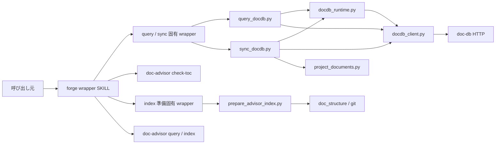
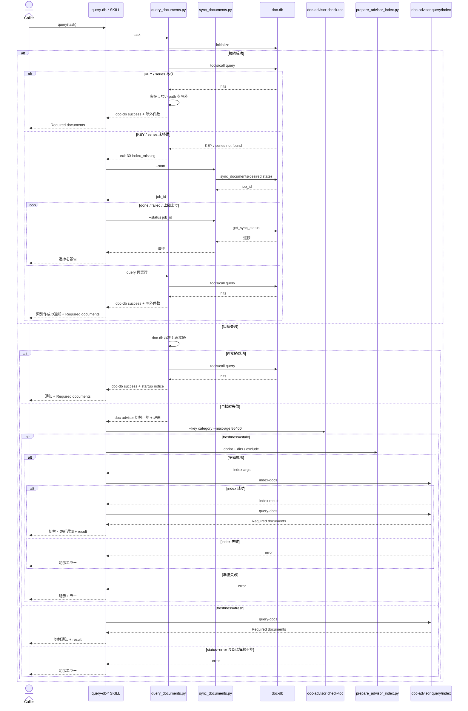
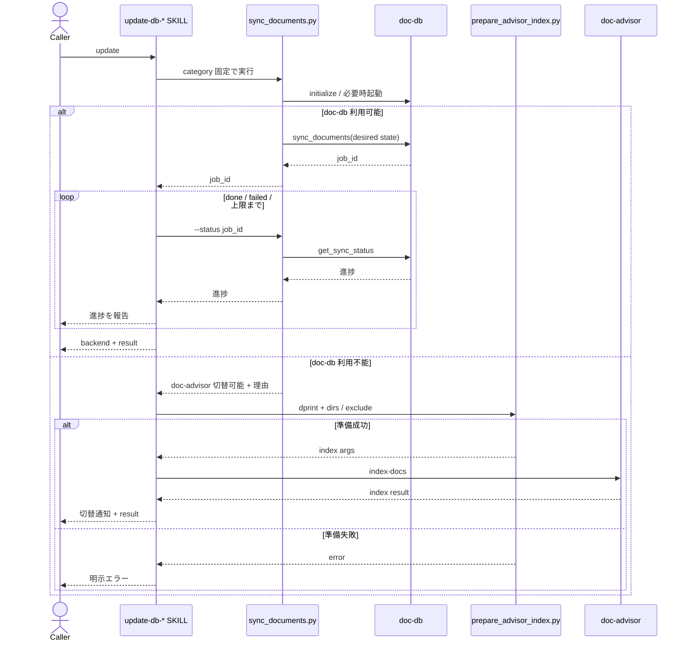

# DES-057 doc-db バックエンド選択 設計書

## メタデータ

| 項目     | 値         |
| -------- | ---------- |
| 設計 ID  | DES-057    |
| 関連要件 | REQ-014    |
| 作成日   | 2026-07-28 |

## 1. 概要

4 つの文書検索 wrapper に、doc-db を優先するバックエンド選択を追加する。
doc-db との通信は登録済み MCP ツールに依存せず、Python 標準ライブラリによる Streamable HTTP クライアントで行う。
doc-db が接続不能で起動にも失敗した場合だけ、既存の doc-advisor SKILL へ切り替える。

バックエンド固有処理は共有低レベル script に閉じ、各 SKILL は category 固定の薄い wrapper と外部 SKILL の起動だけを担当する。
これにより、選択規則を 4 つの SKILL.md に重複させず、既存の SKILL 名・引数・検索結果形式を維持する。

## 2. 設計方針

### 2.1 バックエンド選択境界

doc-db への接続確認、起動試行、再接続、および 1 つの doc-db 操作は、同一の低レベル script 実行内で行う。
複数の操作にまたがる進行（未整備時の索引作成 → 再検索、sync の完了待ち）は SKILL が駆動する（§4.2・§4.3）。
script は次のいずれかを確定して返す。

| 結果                  | 意味                                                         | 後続処理                              |
| --------------------- | ------------------------------------------------------------ | ------------------------------------- |
| doc-db 成功           | initialize と対象 operation が完了した                       | 結果を返して終了                      |
| doc-advisor 切替可能  | doc-db が未導入、起動不能、または起動後も接続不能            | SKILL が doc-advisor の利用可否を確認 |
| doc-db operation 失敗 | 接続確立後の query / sync が失敗または完了待ち上限に到達した | 明示エラー。別 backend へ切り替えない |

接続確立後の operation 失敗を doc-advisor へ切り替えない。
索引内容、入力、サーバ内部処理などの障害を「doc-db が利用不能」と誤分類して隠蔽しないためである。

当該 KEY が未生成、または当該 series が未同期の状態は、上記 3 分類のいずれにも該当しない。障害ではなく **未整備** であり、
doc-advisor 切替でも失敗でもなく、**索引を作成してから query を継続する**（REQ-014 BL-004）。
doc-advisor 経路が ToC 未生成時に索引更新を完了させてから検索する規定（§5.2）と対称にするためである。
script は未整備を専用の exit code で返し、索引作成と再検索の駆動は SKILL が行う（§4.2・§4.4）。
索引の作成自体が失敗した場合は operation 失敗に分類する。

### 2.2 HTTP 直結

doc-db クライアントは `http://localhost:{port}/mcp` に対し、次の順で JSON-RPC を送信する。

1. `initialize`
2. `notifications/initialized`
3. `tools/call`

`Mcp-Session-Id` を同一 operation 中に保持し、JSON 応答と SSE 応答の両方を解析する。
port は `~/.doc-db/doc-db.yaml` の `port` を読み、未設定または読み取り不能の場合は doc-db の既定 port を使用する。
認証情報を読む処理および出力する処理は持たない。

通信定数は参考実装の契約を引き継ぎ、通常 operation の HTTP timeout と sync 完了待ち上限（SKILL 側のポーリングに適用する上限）を 600 秒、
sync status の poll 間隔を 2 秒、既定 port を 58080 とする。
接続 probe は localhost の起動確認専用として HTTP timeout を 1 秒、起動待ち期限を 10 秒、再試行間隔を 0.25 秒とする。
probe 値は利用者向け性能目標ではなく、未起動判定を長時間ブロックせず doc-advisor へ切り替えるための内部上限である。

### 2.3 on-demand 起動

初回接続に失敗した場合、`shutil.which("doc-db")` で実行ファイルを解決する。
解決できた場合は `subprocess.Popen` の新規セッションとして起動し、標準入力・標準出力・標準エラーを切り離す。
サーバログは doc-db 自身の設定先に委ね、forge はログファイルを生成しない。

起動後は localhost の MCP initialize を期限付きで再試行する。
別 wrapper が同時に doc-db を起動して一方のプロセスが終了した場合でも、MCP 接続に成功すれば利用可能と判定する。
接続できなければ、実行ファイル不在、プロセス起動失敗、早期終了、再接続不能のいずれかを理由コードとして返す。

この起動は現在の wrapper 実行を完了するための on-demand 起動である。
OS ログイン時の自動起動、サービス登録、停止、再起動監視は行わない。

### 2.4 doc-advisor 切替

doc-advisor の installed / available 判定は、SKILL 実行時の available-skills を正とする。
Python script は Claude Code の SKILL registry を推測しない。

doc-db script が切替可能を返した場合、SKILL は次の SKILL が揃っているときだけ切り替える。

| 経路   | 必要な doc-advisor SKILL                                 |
| ------ | -------------------------------------------------------- |
| query  | `check-toc`、`query-docs`。stale 時はさらに `index-docs` |
| update | `index-docs`                                             |

いずれかが欠けていれば、その経路では doc-advisor を利用不能とし、両 backend の利用不能理由を返して失敗する。
grep 検索は実行しない。
forge は doc-advisor の ToC ファイル配置や `generated_at` を直接読まない。

#### 最小対応 DocAdvisor バージョン

`check-toc` は本 feature で DocAdvisor 側に追加する SKILL であり（§5.1）、それより前の版には存在しない。
REQ-014 前提条件は、鮮度確認機能を備えた最小対応バージョン以降だけを「利用可能な doc-advisor」と定義し、
それ未満の版を後方互換（NFR-002）の対象から除外する。本設計はその前提に従う。

`query-docs` / `index-docs` だけを持つ旧版が導入されている環境では、上記判定により query 経路が失敗する。
これを「doc-advisor が利用不能」と一括で報告すると、利用者が更新すれば復帰できる状態と区別がつかない。
そのため実行時には次を区別する。

| 条件                                                    | reason code        | 利用者向け通知                                                |
| ------------------------------------------------------- | ------------------ | ------------------------------------------------------------- |
| `query-docs` も `index-docs` も無い                     | `advisor_absent`   | doc-advisor 未導入。両 backend の利用不能理由を返して失敗する |
| `query-docs` / `index-docs` はあるが `check-toc` が無い | `advisor_outdated` | DocAdvisor が最小対応バージョン未満。更新手順を示して失敗する |

上記 2 状態の判定は available-skills 上の `check-toc` の有無だけで行い、バージョン番号の比較を実装しない。
最小対応バージョンは **DocAdvisor 0.4.6**（`check-toc` を含む最初の版）である。用途は 2 つある。
利用者が満たすべき版を知るための導入案内（README / SKILL）への記載と、forge の実装・テストが対象とする
確定仕様の固定点（§5.1.5）である。いずれも実行時の判定には使用しない。

reason code の判定は経路別に行う。§2.4 冒頭の経路表のとおり update 経路は `check-toc` を要求しないため、
`check-toc` の不在を理由に update 経路を `advisor_outdated` としない。
`query-docs` と `index-docs` の一方だけが存在する状態は、DocAdvisor が両者を同一プラグインとして配布するため
実環境では発生しない。判定式としては `advisor_absent` に含める（doc-advisor を利用可能と見なさない）。

旧版向けに `check-toc` 無しの鮮度判定経路を forge 内へ持つことはしない。
forge が ToC 内部配置を解釈する経路の復活になり、REQ-014 BL-002 に反するためである。

## 3. アーキテクチャ

### 3.1 コンポーネント図



依存方向は `SKILL.md → SKILL 固有 wrapper → 共有低レベル script → 外部 backend / 設定` の一方向とする。
共有低レベル script から SKILL や SKILL 固有 wrapper を呼ばない。
共有低レベル script どうしの依存も持たない。KEY / series 未整備時に query と sync を順に実行する制御は
SKILL が担う（§4.2）。script 間で呼び合わないため、進捗報告の位置が SKILL 側に固定される。
ToC 鮮度判定は forge script ではなく外部 `doc-advisor:check-toc` に委譲する。

### 3.2 モジュール一覧

| モジュール                                     | 責務                                                                          | 依存                                   |
| ---------------------------------------------- | ----------------------------------------------------------------------------- | -------------------------------------- |
| 各 `query-db-*/SKILL.md`                       | doc-db 結果返却、check-toc / query / index 起動、通知                         | SKILL 固有 wrapper、doc-advisor        |
| 各 `update-db-*/SKILL.md`                      | doc-db 結果返却、doc-advisor index 起動、通知                                 | SKILL 固有 wrapper、doc-advisor        |
| `skills/*/scripts/query_documents.py`          | category を固定して query 低レベル CLI を透過呼び出し                         | `query_docdb.py`                       |
| `skills/*/scripts/sync_documents.py`           | category を固定して sync 低レベル CLI（`--start` / `--status`）を透過呼び出し | `sync_docdb.py`                        |
| `skills/*/scripts/prepare_advisor_index.py`    | category を固定して索引入力準備 CLI を透過呼び出し                            | `prepare_advisor_index.py`             |
| `scripts/doc_backend/docdb_client.py`          | MCP session、JSON-RPC、JSON / SSE 応答解析                                    | Python 標準ライブラリ                  |
| `scripts/doc_backend/docdb_runtime.py`         | 接続 probe、doc-db 起動、再接続、理由コード生成                               | `docdb_client.py`、`doc-db` executable |
| `scripts/doc_backend/project_documents.py`     | category 対象文書、project key、git series の解決                             | 既存 doc-structure resolver、git       |
| `scripts/doc_backend/query_docdb.py`           | doc-db query（series 指定）、KEY / series 未整備の検出、既存出力形式の構築    | runtime、client                        |
| `scripts/doc_backend/sync_docdb.py`            | desired-state sync の投入（`--start`）と単発の状態取得（`--status`）          | runtime、client、project documents     |
| `scripts/doc_backend/prepare_advisor_index.py` | dprint 適用と doc-advisor 用 dirs / exclude 解決                              | 既存 dprint runner、doc-structure      |

共有モジュールは `plugins/forge/scripts/doc_backend/` に置く。
4 SKILL が同じ処理を利用するため、いずれか 1 SKILL の配下には置かない。
forge 内に ToC 探索や `generated_at` 比較の script は置かない。

## 4. doc-db 処理設計

### 4.1 project key と series

doc-db の key は `{project_name}-{category}`、series は現在の git branch とする。

| 値             | 解決方法                                                                      |
| -------------- | ----------------------------------------------------------------------------- |
| `project_name` | `git rev-parse --git-common-dir` の親ディレクトリ名。失敗時は project root 名 |
| `category`     | wrapper が固定する `rules` または `specs`                                     |
| `series`       | `git rev-parse --abbrev-ref HEAD`。取得不能または detached HEAD は `main`     |

worktree ごとに key が分裂しないよう、project root の basename より git common dir を優先する。
**query と update はいずれも現在の branch を series として指定する**（REQ-014 BL-005）。読み書きで対象を変えない。

#### series 指定と実在確認

doc-db は `query` の `series` を任意引数とし、**省略時は KEY 内の全 series を横断検索する**。
これは doc-db 側の設計思想（recall 優先の二層アーキテクチャ。候補プールを広く返し、呼び出し元の
AI agent が本文を読んで判定する）に基づく既定であり、doc-db の参考実装 SKILL もこの既定を採る。

forge は現在の branch を series として明示指定する（REQ-014 BL-005）。
索引は対象文書の現在の状態を映すもの（REQ-014 FNC-003）であり、他 branch で削除済み・改訂前の文書を
検索結果へ復活させないためである。forge の wrapper は検索結果のパスをそのまま呼び出し元へ返す契約であり、
候補を広く集める利得より、現在の branch に存在しない文書を返さないことを優先する。

series を限定しない検索には、他 branch にのみ存在する文書に加えて、より重い混入がある。
desired-state 同期で当該 series から切り離された文書の record は、doc-db 側の物理削除が済むまで残るため、
**削除済みの文書が全 series 横断検索に現れ得る**（REQ-014 BL-005）。series を指定すればこの経路は閉じる。
doc-db の参考実装 SKILL も同じ理由で、現行版では series 指定を既定にしている。

series を指定した検索が 0 件だった場合、series を外した再検索は行わない。当該 series はその branch の
完全な現在状態であり、0 件は正しい結果である（REQ-014 BL-005・§4.2）。

当該 series が未同期で結果が得られない場合は、検索対象を広げるのではなく索引を同期して解決する
（REQ-014 BL-004・§4.2）。doc-db は同一 KEY 内で同一内容の文書の embedding を series 横断で共有するため、
別 series が既に同期済みであれば、新しい series の初回同期でも embedding の再計算は発生しない。
series を限定する判断が同期コストを増やさない根拠である。

series を限定しても、索引は最後の同期時点の状態である。同期後に削除された文書は索引に残るため、
出力前にパスの実在を確認して除外する（REQ-014 BL-005）。除外は §4.2 で行う。

#### backend 間の残差

series を現在の branch に限定した結果、両 backend の検索対象は「現在の branch の文書」に揃う。
ただし doc-advisor は series の概念を持たず、ToC を project root 単位で保持するため、次の差が残る。

| 軸               | doc-db                                   | doc-advisor                                  |
| ---------------- | ---------------------------------------- | -------------------------------------------- |
| key の範囲       | worktree 間で共通                        | project root 単位（worktree ごとに独立）     |
| series（branch） | 保持し、query / update とも現在の branch | 概念を持たない                               |
| 対象文書の解決   | forge の doc-structure resolver          | forge が渡した dirs / exclude を展開（§5.2） |

残差から次が生じる。

| 現象                                                                   | 影響                                                        |
| ---------------------------------------------------------------------- | ----------------------------------------------------------- |
| 対象文書の解決規則が異なる                                             | 同一 query でも索引母集団が完全には一致しない（§5.2）       |
| worktree を新設するたび当該 worktree の ToC が存在しない状態から始まる | doc-advisor 経路に落ちた初回 query が索引生成を伴う（§5.2） |

本設計はこの残差を解消しない。doc-advisor の series 不在は forge の設計選択では取り除けず、
doc-db の key を worktree ごとに分割すれば同一プロジェクトの索引が分裂するためである。
残差の存在を利用者向け通知（§7.1）で隠さないことを条件に許容する。

### 4.2 query

query は doc-db の `query` tool を `mode=all`、`top_n=20`、`series=現在の branch` で呼び出す（§4.1）。
`top_n=20` は参考実装の recall 優先契約を維持する値であり、forge 側で別の検索品質目標を追加するものではない。
返却された `results[]` の `path` を順位どおりに抽出し、既存契約の文字列を script が決定論的に構築する。
`Required documents:` 配下の各項目には path だけを出力する。
`origin_signals` は出力せず、`warnings` が存在する場合は path リストの後に別の診断情報として通知する。

```text
Required documents:

- docs/rules/example.md
```

#### パスの実在確認

`results[]` から抽出した path は、出力前に project root 起点で実在を確認し、**実在しないものを除外する**
（REQ-014 BL-005）。除外件数は path リストの後に診断情報として通知する（REQ-014 FNC-004）。
順位は除外後も元の順序を保つ。全件除外された場合も operation は成功とし、空の `Required documents:` を返す。

実在確認はパスの存在判定のみで行い、内容の読み取り・checksum 比較は行わない。

#### KEY / series 未整備時の索引作成

**判定は次の順に行う（REQ-014 BL-004）。**

1. 対象文書数を先に判定する。0 件なら索引に触れず「対象文書なし」として終了する。
2. 1 件以上ある場合に限り、当該 KEY / series の索引の有無を確認する。

索引側の状態からは「一度も同期していない series」と「同期済みだが desired-state が 0 件だった series」を
区別できない。後者に対して同期を促しても状況は変わらないため、対象文書数の判定を先に置いて切り分ける。

当該 KEY が未生成、または当該 series が未同期の場合、`query_docdb.py` は索引を作成せず、
**未整備であることを示す exit code `30`（`index_missing`）で返す**（§4.4）。索引作成は SKILL が駆動する。
未整備を検出した場合に series を外して横断検索へ切り替えることはしない。

SKILL は次の順に処理する（REQ-014 BL-004）。

1. `sync_documents.py --start` を呼び、`job_id` を即時受け取る。
2. `sync_documents.py --status <job_id>` を間隔を空けて繰り返し呼び、**そのたびに進捗をテキストで報告する**。
3. `done` になったら query を再実行し、通常の成功経路として結果を返す。

ポーリングを script 内で完結させず SKILL に置くのは、doc-db 側の統合指針に従うためである。
1 プロセス内で完了まで待つ実装では進捗が当該プロセスの標準エラー出力にしか現れず、SKILL 経由の実行では
利用者に届かない。索引作成は数分に及びうるため、進捗が見えないまま待たせることになる（REQ-014 NFR-001）。

索引作成を伴った事実は結果に含めて通知する（REQ-014 FNC-004）。利用者に `update-db-*` の実行を求めない。

同期は 1 回だけ試行する。同期後の `query` がなお 0 件を返す場合は「該当なし」として成功で返し、
再同期や検索対象の拡大は行わない。

対応する `update-db-*` SKILL へは再入しない。再入すると backend 選択が最初からやり直しになり、
既に確定した doc-db 経路が変化しうるためである（§5.2 の同型の規定と揃える）。
呼ぶのは低レベル CLI（`sync_documents.py`）であり、SKILL ではない。
対象文書が 0 件の場合は §4.3 の 0 件防御が適用され、索引を作成せず明示エラーとする。

#### 成功と障害の区別

検索結果が 0 件の場合も doc-db operation 自体は成功とし、空の `Required documents:` を返す。

tool error、レスポンス不正、および索引作成の失敗は **障害** であり、operation 失敗（exit code 20）として返し、
doc-advisor へは切り替えない（§2.1）。KEY / series の未整備それ自体は障害ではないため、この分類に含めない。

### 4.3 update

update は既存 `.doc_structure.yaml` の category 設定から対象 Markdown 一覧を解決し、
各 entry を `{path, local_path}` として doc-db の `sync_documents` に渡す。

**投入と完了待ちは分離する。** 低レベル CLI は 2 つの操作を提供する。

| 操作                | 動作                                                            | 返す内容         |
| ------------------- | --------------------------------------------------------------- | ---------------- |
| `--start`           | 一覧を解決し `sync_documents` を投入して即時に返る              | `job_id`         |
| `--status <job_id>` | `get_sync_status` を 1 回呼び、その時点の進捗を返して即時に返る | job の状態と件数 |

SKILL は `--start` で `job_id` を得たあと、`--status` を間隔を空けて繰り返し呼び、**そのたびに進捗を
テキストで報告する**。ポーリングのループを script 内に持たない（理由は §4.2 と同じ）。
poll 間隔は §2.2 の値を用い、`done` / `failed` または完了待ち上限で終える。

`sync_documents` は一覧全体を desired state として扱うため、追加・変更・削除・リネームを同じ経路で収束させる。
hash 一致文書の再計算要否は doc-db に委ねる。

対象が 0 件の場合は設定誤りによる全 series 切り離しを避けるため同期せず、明示エラーを返す。
空集合への意図的な同期は wrapper の責務に含めない。
job が失敗した場合、一部文書が失敗した場合、または完了待ち上限に達した場合は update 失敗とする。
ポーリングを打ち切っても doc-db 側の job は継続し、再実行で冪等に収束する。

### 4.4 doc-db 実行結果

低レベル CLI は機械判定可能な JSON と exit code を返す。
JSON は少なくとも `status`、`backend`、`operation`、`startup`、`reason_code` を持つ。
query 成功時は構築済みの `Required documents:` 文字列、`--start` 成功時は `job_id`、
`--status` 成功時はその時点の job 進捗を含む。

| exit code | `status`           | SKILL の動作                                              |
| --------- | ------------------ | --------------------------------------------------------- |
| 0         | `success`          | doc-db 結果を返して終了                                   |
| 10        | `advisor_fallback` | doc-advisor の利用可否確認へ進む                          |
| 20        | `operation_error`  | エラーを返して終了。backend を切り替えない                |
| 30        | `index_missing`    | 索引を作成（`--start` → `--status` ポーリング）して再試行 |

exit code `30` は query 経路でのみ返る。`--status` は job が未完了でも `0` を返し、状態は JSON の
job 進捗で示す（未完了を異常として扱わない）。

SKILL は exit code だけで上記の経路を選択し、JSON field の組合せから状態を再構成しない。
JSON は結果表示と診断情報の取得にだけ使用する。
`startup` は未試行、起動成功、起動失敗を区別する。
エラー本文は URL、port、reason code、doc-db が返した非機密メッセージに限定し、環境変数値や設定本文を含めない。

### 4.5 doc-db MCP tool 契約（依拠スナップショット）

doc-db の MCP tool I/F の所有は doc-db 側にある。forge は接続する側であり、この I/F を規定しない。
`check-toc`（§5.1.1）と同じ扱いである。

**I/F の SoT は doc-db 側の公開文書**（AI 統合ガイド、APP-001 要件定義書、DES-001 設計書）と、
同リポジトリ同梱の SKILL 参考実装である。本設計はそれらを規範として参照する。

以下の表は forge が実装・テストの対象を確定させるための **依拠スナップショット** であり、I/F の規範ではない。
別リポジトリの文書を実装時に必ず参照できるとは限らないため、依拠する時点の契約を記録する。
契約が改訂された場合は、本項の更新とテストの追従を同じ変更で行う（§5.1.5 と同じ運用）。

応答は `tools/call` 結果の `content[]` のうち `type` が `text` の要素に載る JSON を解析して得る。

| tool              | request                                          | 使用する response field                                                                                         |
| ----------------- | ------------------------------------------------ | --------------------------------------------------------------------------------------------------------------- |
| `query`           | `{key, series, query, mode: "all", top_n: 20}`   | `results[].path`（順位順）、`warnings[]`                                                                        |
| `sync_documents`  | `{key, series, documents: [{path, local_path}]}` | `job_id`                                                                                                        |
| `get_sync_status` | `{job_id}`                                       | `status`（`running` / `done` / `failed`）、`processed`、`skipped`、`failed`、`deleted_paths_marked`、`errors[]` |

- `query` の `series` は任意引数である。forge は現在の branch を必ず指定する（§4.1）。
- 参考実装の CLI は series 未登録を検索前に検証し、未登録なら検索せず専用の exit code で返す。
  全 series 横断へのフォールバックは行わない。forge の未整備検出（§4.2 exit code `30`）はこれに対応する。
- 参考実装の CLI は sync の投入と状態取得を `sync-start` / `sync-status` として分離している。
  forge の `--start` / `--status`（§4.3）はこれに対応する。
- `top_n` の doc-db 既定値は 10 だが、doc-db 側の指針が重要な検索に 20〜30 を推奨しているため 20 を渡す。
- `sync_documents` は `job_id` を即時返す非同期 job であり、完了待ちは呼び出し側が `get_sync_status` を反復して行う（§4.3）。
- 応答に `job_id` が無い場合は operation 失敗として扱う。
- `results[]` の本文 field は使用しない。forge の出力契約は path のみである（§4.2）。
- 上記以外の tool（`upsert_documents`、`schedule_delete_series` 等）は本 feature では使用しない。

#### KEY 状態に関する doc-db の挙動

doc-db は次の 2 つを **致命的エラー**（MCP error response）として返す。空結果ではない。

| 条件             | doc-db の挙動                                            | forge の扱い                                    |
| ---------------- | -------------------------------------------------------- | ----------------------------------------------- |
| KEY が存在しない | `query` がエラーを返す                                   | 未整備。索引を作成して query を継続する（§4.2） |
| KEY がゴミ箱状態 | `query` も書き込み系 tool もエラーを返し、復活操作を促す | 未整備ではない。復活操作の案内を伴う明示エラー  |

KEY 不在とゴミ箱状態はいずれも tool error として届くため、forge は **error の内容から両者と
その他の障害を判別する**。判別できない error は障害として扱い、索引作成を試みない（§4.2）。
ゴミ箱状態の KEY へ同期を試みても doc-db 側で拒否されるため、未整備として扱ってはならない。
ゴミ箱からの復活そのものは KEY の運用管理であり、本 feature の対象外（REQ-014 スコープ）である。

## 5. doc-advisor 処理設計

### 5.1 ToC 鮮度判定（外部 SKILL 委譲）

query wrapper が doc-advisor へ切り替える場合、先に `doc-advisor:check-toc` を 1 回呼ぶ。
24 時間という鮮度閾値は forge の方針（REQ-014 BL-002）であり、呼び出し時に `--max-age 86400`（秒）として渡す。

#### 5.1.1 I/F の所有と本設計の役割

`doc-advisor:check-toc` の公開 I/F 仕様の単一の真実源（SoT）は **DocAdvisor 側の仕様書** である。
I/F は DocAdvisor が中心となって管理し、forge は接続する側として依拠する。適用の目標は forge との接続であり、
そのための協議は行うが、最終的な I/F 仕様の決定権は DocAdvisor にある。

したがって本設計は I/F そのものを規定しない。本設計が持つのは次の 3 種類だけである。

| 種類                         | 内容                                                              | 本設計での位置 |
| ---------------------------- | ----------------------------------------------------------------- | -------------- |
| 依拠する確定仕様の範囲       | DocAdvisor が定めた I/F のうち forge が依存する部分と、その畳み方 | §5.1.2・§5.1.3 |
| 契約が満たされない場合の防御 | 応答が確定仕様どおりでなかったときの forge 側の挙動               | §5.1.4         |
| 依拠する I/F バージョン      | どの版の確定仕様に対して実装・テストするかの固定点                | §5.1.5         |

内部実装（判定を script に置き SKILL を薄いラッパにする等）は doc-advisor の裁量とする。
ただし §2.4 の可用性判定が available-skills を根拠にするため、SKILL としての公開は必須である。

本 feature の前提として、DocAdvisor 側に `check-toc` SKILL を追加する。役割は「指定 key の ToC が存在するかを
確認し、`--max-age` に対する鮮度を返す」read-only な操作であり、副作用を持たない。

#### 5.1.2 依拠する確定仕様

forge が `check-toc` に問うのは 1 つである。**「その ToC はそのまま検索に使えるか、作り直しが必要か」**。
I/F の確定仕様は DocAdvisor の `check-toc` 要件定義書（REQ-005）が SoT であり、forge が依拠するのは次だけである。

| # | 項目 | 依拠内容                                                                                    |
| - | ---- | ------------------------------------------------------------------------------------------- |
| 1 | 入力 | `--key <key> --max-age <秒>` を渡す。`--max-age` は必須で正の整数（秒）。key は不透明文字列 |
| 2 | 判定 | `status` が判定の完了可否（`ok` / `error`）、`freshness` が判定結果（`fresh` / `stale`）    |
| 3 | 出力 | 最終出力は JSON のみで、前後に説明文・要約を含まない                                        |

`--max-age` は既定値を持たない必須引数である。閾値の所有者を呼び出し側に固定するための仕様であり、
forge は毎回 86400 を渡す（REQ-014 BL-002 が定める 24 時間。秒への換算定数は forge が持つ）。

ToC 不在は `freshness=stale` に含まれる。したがって forge に不在専用の分岐は存在しない。

鮮度の閾値そのものの扱いは doc-advisor の判定規則であり、forge は依拠するだけで要求も再実装もしない。
確定内容は次のとおりである（境界値は `fresh`、許容 skew は 60 秒、`generated_at` の解析規則、
ToC の探索方法、mtime を根拠にしないこと）。forge はこれらの値に依存した実装・テストを持たない（§9.3）。
引数不正・ToC 読み取り不能には専用の `error_code`（`INVALID_MAX_AGE` / `TOC_READ_ERROR`）が定義されており、
いずれも `status=error` として届く。forge は `status=error` を一括で明示エラーとするため、
`error_code` の値で分岐しない。

#### 5.1.3 forge の後続分岐

| `status` | `freshness` | forge の後続処理                             |
| -------- | ----------- | -------------------------------------------- |
| `ok`     | `fresh`     | `query-docs` のみ実行                        |
| `ok`     | `stale`     | prepare → `index-docs` → 成功時 `query-docs` |
| `error`  | （`null`）  | query を実行せず明示エラー                   |

forge はこの 3 分岐だけを持つ。**経路の選択は `status` と `freshness` だけで行い、exit code では行わない。**
`stale` は正常な判定結果であり、doc-advisor 側は `status=ok` として exit code `0` を返す。
exit code で分岐すると `stale` を失敗と誤認する。

`freshness` 以外の field（`reason` / `toc_path` / `generated_at` / `age_seconds` / `max_age_seconds`）に
**依存しない**。`reason`（不在か鮮度超過か等の原因）は人間の切り分けと doc-advisor 側の診断のための補助情報で
あり、値域の追加が起こり得る。forge が依存すると、その追加が破壊的変更になってしまう。
診断としてそのまま転記することはあってよいが、経路選択にも成否判定にも使用しない。

ToC パスや内部ディレクトリ規約を forge に埋め込まない。

#### 5.1.4 答えが解釈できない場合の防御

応答が SKILL の最終出力を経由するため、forge は JSON として解析できない出力や既知値以外の
`status` / `freshness` を受け取り得る。その場合は **`fresh` とみなす縮退も作り直し経路への縮退も行わず、
query を実行せず明示エラーとし**、利用不能だった backend と理由を利用者へ通知する。

これは新たな判断ではなく、REQ-014 BL-003（索引更新に失敗した doc-advisor で query を続行しない）、
NFR-004（利用不能を成功として報告しない）、FNC-004（失敗理由の通知）からの帰結である。

#### 5.1.5 依拠する I/F バージョンの固定

実行時の可用性判定は available-skills 上の `check-toc` の有無だけで行い、バージョン番号の比較は実装しない（§2.4）。
一方、実装とテストが対象とする確定仕様は、REQ-014 前提条件が定める最小対応 DocAdvisor バージョン（REQ-014 TBD-001）で
固定する。I/F の所有が DocAdvisor にあるため、契約の改訂は forge の実装とテストを後追いで無効化しうる。
固定点を持たないと、どの版の契約に対して実装が正しいのかを判定できない。

判定規則の内部値（未来時刻の許容 skew 等）は DocAdvisor 側で確定済みであり、
`status` / `freshness` の値域を変えない限り、その改訂は forge の実装とテストに影響しない。

### 5.2 stale 時の更新

`check-toc` が `freshness=stale` を返した場合、query SKILL は次の順で処理する。

1. `prepare_advisor_index.py` で既存 dprint runner を実行する。
2. 同 script が `.doc_structure.yaml` から `root_dirs` / `patterns.exclude` を解決する。
3. `doc-advisor:index-docs` を 1 回呼ぶ。
4. index が成功した場合だけ `doc-advisor:query-docs` を 1 回呼ぶ。

index 失敗時は stale ToC で query を続行しない。
`freshness=fresh` の場合は index を呼ばず query のみ実行する。
ファイル一覧への展開は doc-advisor 側に委ね、doc-db sync 用の `project_documents.py` は使用しない。

この委譲により、索引母集団の決定経路は backend ごとに異なる。doc-db 経路は forge の doc-structure resolver が
対象文書一覧を確定させ、doc-advisor 経路は forge が渡した dirs / exclude を doc-advisor 側が展開し、
doc-advisor 固有の除外規則が併せて適用される。したがって**両 backend の索引母集団が一致する保証はない**。

不一致の要因は展開規則の差であり、doc-advisor 側へ統一を要求すれば解消しうるが、本 feature の範囲には
含めない。検索対象の範囲そのものは、doc-db 側で series を現在の branch に限定したことで揃っている（§4.1）。

stale 更新では対応する `update-db-*` SKILL へ再入しない。
再入すると doc-db の選択を最初からやり直し、既に確定した doc-advisor 切替経路が変化しうるためである。
`prepare_advisor_index.py` と `doc-advisor:index-docs` を使い、update wrapper の doc-advisor 経路と同じ処理を直接完了させる。

索引入力準備 CLI は成功時に exit code `0` と `status=success`、dprint、設定解決、入力検証のいずれかが失敗した場合に
exit code `20` と `status=operation_error` を返す。
SKILL は exit code だけで index 実行可否を選択し、準備失敗時は `doc-advisor:index-docs` を呼ばない。

### 5.3 update

update SKILL が doc-advisor へ切り替える場合も、`prepare_advisor_index.py` で dprint と dirs / exclude 解決を行い、
`doc-advisor:index-docs` を 1 回呼ぶ。
update 経路では `check-toc` を呼ばない。索引を再構築することが目的だからである。
doc-advisor の完了レポートは構造変換せず親へ返す。

## 6. ユースケース設計

### 6.1 ユースケース一覧

| ユースケース               | 説明                                                        |
| -------------------------- | ----------------------------------------------------------- |
| doc-db で query            | 接続済み doc-db を使い検索結果を返す                        |
| doc-db 索引作成後に query  | KEY / series 未整備を検出し、同期の進捗を報告しつつ検索する |
| doc-db 起動後に query      | 未起動 doc-db を on-demand 起動して検索する                 |
| doc-advisor で fresh query | doc-db を利用できず、fresh ToC で doc-advisor 検索する      |
| doc-advisor 更新後に query | doc-db を利用できず、stale ToC を更新してから検索する       |
| doc-db で update           | 現在 branch の文書集合を desired-state 同期する             |
| doc-advisor で update      | doc-db を利用できず、従来の ToC を再構築する                |
| backend 不在               | 両 backend の利用不能理由を返して失敗する                   |
| backend operation 失敗     | 選択済み backend の処理失敗を隠さず返す                     |

### 6.2 query シーケンス



### 6.3 update シーケンス



## 7. エラーハンドリングと通知

| 条件                                   | 動作                                                   |
| -------------------------------------- | ------------------------------------------------------ |
| doc-db executable 不在                 | 理由を通知し doc-advisor の利用可否確認へ進む          |
| doc-db 起動失敗 / 再接続不能           | 理由を通知し doc-advisor の利用可否確認へ進む          |
| doc-db query / sync error              | doc-db operation 失敗として終了する                    |
| doc-db sync 完了待ち上限               | job 情報を返して失敗する。doc-advisor へ切り替えない   |
| doc-advisor 未導入                     | 両 backend の利用不能理由を返して失敗する              |
| DocAdvisor が最小対応バージョン未満    | `advisor_outdated` として更新手順を示して失敗する      |
| `check-toc` が `status=error` を返す   | query を呼ばず失敗する                                 |
| `check-toc` 応答が解析不能・既知値以外 | query を呼ばず失敗する（§5.1.4）                       |
| ToC stale かつ index 失敗              | query を呼ばず失敗する                                 |
| doc-advisor query / index 失敗         | doc-advisor の失敗をそのまま返す                       |
| doc-db query 0 件                      | 成功。空の `Required documents:` を返す                |
| doc-db の当該 KEY / series が未整備    | 索引を作成し、完了後に query を継続する（§4.2）        |
| doc-db の索引作成が失敗した            | operation 失敗として終了する。切り替えない（§4.2）     |
| 検索結果に実在しないパスが含まれた     | 該当パスを除外し件数を通知する。成功として扱う（§4.2） |

利用者向け通知は、backend、起動試行結果、切替理由、索引の作成・更新の有無を含める。
正常な初回接続時は冗長な警告を出さず、使用 backend の識別だけを結果に含める。

完了までに時間を要する索引作成・更新（doc-db の sync）では、SKILL が `--status` を呼ぶたびに
その時点の進捗をテキストで報告する（§4.2・§4.3）。進捗を script の標準エラー出力に委ねない。
SKILL 経由の実行では script の標準エラー出力が利用者に届かないためである（REQ-014 NFR-001）。

### 7.1 検索母集団が変わったことの通知

doc-advisor 経路へ切り替えた query では、上記に加えて**検索母集団が doc-db 経路と異なる**ことを通知する。
§4.1 と §5.2 は backend 間の残差を解消せず許容するが、その条件は利用者に隠さないことである。
通知しなければ、利用者は同一の query が backend によって異なる結果を返した理由を知る手段を持たない
（REQ-014 NFR-001）。

series を現在の branch に限定したことで検索対象の範囲は両 backend で揃う（§4.1）。
残るのは対象文書の解決規則の差であり、通知に含める内容はこの 1 点に限る。

| 内容                                     | 根拠                             |
| ---------------------------------------- | -------------------------------- |
| 対象文書の解決規則が doc-db 経路と異なる | 索引母集団の決定経路の差（§5.2） |

この通知は doc-advisor 経路へ切り替えた事実だけで組み立てられる。`check-toc` の `reason` 等の補助 field や
両 backend の母集団の差分計算を必要としない。doc-db 経路で完了した query では出さない。

## 8. 使用する既存コンポーネント

| コンポーネント            | ファイルパス / 所在                                             | 用途                                           |
| ------------------------- | --------------------------------------------------------------- | ---------------------------------------------- |
| 4 wrapper SKILL           | `plugins/forge/skills/{query,update}-db-{rules,specs}/SKILL.md` | 公開名・引数・doc-advisor 呼び出し契約を維持   |
| doc-structure resolver    | `plugins/forge/scripts/doc_structure/resolve_doc_structure.py`  | rules / specs の対象解決を再利用               |
| dprint runner             | `plugins/forge/scripts/doc_structure/run_dprint_fmt.sh`         | doc-advisor 索引作成前のフォーマットを再利用   |
| HTTP クライアント参考実装 | doc-db-mcp-server の同梱 SKILL（別リポジトリ・配布物外）        | JSON-RPC、SSE、sync、project identity の移植元 |
| doc-db 公開文書           | doc-db-mcp-server の AI 統合ガイド / APP-001 / DES-001          | MCP tool 契約・KEY / series 意味論の規範       |
| check-toc（新規・外部）   | DocAdvisor の `doc-advisor:check-toc`                           | ToC 鮮度判定。forge は公開契約のみ依存する     |

参考実装と doc-db の公開文書は別リポジトリにあり、本リポジトリの配布物には含まれない。
そのため runtime import せず、配布物からの参照リンクも張らない（参照は開発時に別リポジトリを直接読む）。
実装に必要な tool 契約は §4.5 に依拠スナップショットとして取り込む。I/F の所有と規範は doc-db 側にある。
必要な処理を `plugins/forge/scripts/doc_backend/` へ移植し、forge 側の公開契約とテストに合わせて縮小する。
既存 wrapper SKILL と doc-structure 資産は置換せず拡張する。
query SKILL から既存の grep フォールバック手順と `Grep` の許可を削除し、doc-db と doc-advisor の両方が利用不能なら失敗する契約へ変更する。
feature 統合時は既存の doc-advisor 単一前提を doc-db 優先選択へ置き換える。
`check-toc` は DocAdvisor リポジトリで追加実装する。forge 実装より先、または同時に契約を満たす版を用意する。

## 9. テスト設計

### 9.1 単体テスト

| 対象                       | 検証項目                                                                                                                                                              |
| -------------------------- | --------------------------------------------------------------------------------------------------------------------------------------------------------------------- |
| `docdb_client.py`          | initialize、session header、JSON / SSE、HTTP / tool error                                                                                                             |
| `docdb_runtime.py`         | 接続済み、実行ファイル不在、起動成功、早期終了、再接続不能、秘密値非出力                                                                                              |
| `project_documents.py`     | worktree 共通 key、branch series、detached fallback、対象文書、exclude                                                                                                |
| `query_docdb.py`           | path 抽出、順位維持、0 件、`Required documents:` 形式、series 指定、実在しない path の除外と件数通知、KEY / series 未整備の exit code 30 分類、ゴミ箱状態と障害の判別 |
| `sync_docdb.py`            | desired state、削除追従入力、0 件防御、`--start` の job_id 返却、`--status` の単発取得（未完了で exit 0）                                                             |
| `prepare_advisor_index.py` | dprint 失敗伝播、dirs / exclude 出力、設定エラー                                                                                                                      |

時計、HTTP、process、filesystem は差し替え可能な境界を設け、実サーバや利用者の home 設定に依存しない。
ToC 鮮度判定そのものの単体テストは DocAdvisor の `check-toc` 実装側で行う。

### 9.2 wrapper テスト

各 SKILL 固有 wrapper について、category の固定値、位置引数の透過、stdout / stderr / exit code の透過を検証する。
query wrapper が task を 1 つの位置引数として渡し、update wrapper が利用者入力を要求しないことを確認する。
sync wrapper については `--start` / `--status <job_id>` の両操作が透過することを確認する。

### 9.3 統合テスト

fake HTTP server を使い、次の経路を通す。fake server の応答は §4.5 の契約に従う。

- 初回接続成功から query 完了
- 初回接続失敗、起動後接続成功から query 完了
- 対象文書 0 件のとき索引に触れず終了すること（索引側の状態確認より前に判定すること）
- KEY / series 未整備の応答から exit code 30 → `--start` → `--status` の反復 → query 再実行の一連（各 script 実行が単発で完結すること）
- 未整備・0 件のいずれでも series を外した横断検索へ切り替えないこと
- 同期後の query が 0 件でも再同期せず「該当なし」として成功で返すこと
- 索引作成が失敗した場合に operation 失敗（exit code 20）となり doc-advisor へ切り替えないこと
- 実在しない path を含む応答での除外と件数通知
- doc-db 利用不能を示す切替結果
- sync job の accepted → running → done（`--start` が job_id を返し、`--status` が単発で進捗を返すこと）
- `--status` が job 未完了でも exit code 0 を返し、SKILL 側のループで完了判定できること
- MCP JSON 応答と SSE 応答

doc-advisor は外部 SKILL のため、forge 側では次を静的または契約テストする。
契約テストは §5.1.5 で固定した版の I/F に対して書く。I/F の所有は DocAdvisor にあるため、
契約が改訂された場合は固定点の更新とテストの追従を同じ変更で行う。

- `check-toc` へ `--key` と `--max-age 86400`（秒）を渡すこと
- `freshness=fresh` / `freshness=stale` / `status=error` の 3 応答に対する後続分岐
- `stale` 時だけ prepare → `index-docs` → `query-docs` の順になること
- exit code ではなく `status` / `freshness` で分岐すること（`stale` × exit code `0` を失敗と誤認しない）
- `reason` 等の補助 field に依存しないこと。補助 field の値が未知でも経路が変わらないこと
- §5.1.4 の防御: 応答を解析できない、または `status` / `freshness` が既知値以外の場合に query を呼ばず失敗すること
- §7.1 の通知: doc-advisor 経路の query で検索母集団の相違を通知し、doc-db 経路では通知しないこと（SKILL.md の静的確認）

forge のテストは doc-advisor の判定規則に依存させない。`fresh` / `stale` は応答値として与え、
判定そのものを再現しない。**境界値（差がちょうど `--max-age` のとき）・未来時刻の許容 skew・
`generated_at` の解析可否に結果が依存するテストを書かない。** これらは doc-advisor の内部判断であり、
依存すると doc-advisor 側の内部変更で forge のテストが壊れる。

検索品質そのもの、ToC ファイル探索の詳細、鮮度判定規則は DocAdvisor 側で評価し、forge では重複評価しない。

## 10. 完全性確認

- REQ-014 FNC-001: 接続、起動、再接続、doc-advisor 切替、両 backend 不在エラーを §2、§6、§7 に反映した。
- REQ-014 FNC-002: query、`check-toc` による鮮度確認、stale 更新、grep 禁止、出力互換を §4.2、§5、§6.2 に反映した。
- REQ-014 FNC-003: desired-state update と削除・リネーム追従を §4.3、§6.3 に反映した。
- REQ-014 FNC-004: 起動、切替、索引作成・更新、失敗の通知を §4.4、§7 に反映した。
- REQ-014 NFR-001: 長時間の索引作成・更新の進捗報告を SKILL 側のポーリングに置き、script 内で完了待ちしない設計を §4.2・§4.3・§7 に定めた。doc-db 側の統合指針（1 プロセス内で待つと進捗が届かない）に従う。
- REQ-014 NFR-001〜005: 可観測性、公開契約維持、不要処理回避、失敗非隠蔽、情報保護を各境界とテストへ反映した。
- REQ-014 前提条件: 最小対応バージョン以降のみを後方互換の対象とする前提に従い、旧版検出時の区別を §2.4 に定めた。
- 外部依存: `check-toc` の I/F 所有を DocAdvisor 側とし、確定仕様（DocAdvisor REQ-005）への依拠範囲（§5.1.2）・3 値の畳み方（§5.1.3）・契約が満たされない場合の防御（§5.1.4）・依拠する版の固定（§5.1.5）を分離した。最小対応バージョンの明記と旧版検出時の扱いは §2.4 に定めた。
- 決着済み: ToC 不在の扱いは DocAdvisor 側で `freshness=stale` に含める（`error` としない）と確定した。forge に不在専用の分岐は存在しない（§5.1.2・§5.1.3）。
- 決着済み: 応答形式は既存 script と同じ JSON 契約（`status` / `error_code` 必須、答えは `freshness`）で確定した。原因は補助 field `reason` で返るが forge は依存しない。exit code は `status` に対応するため、経路選択には使用しない（§5.1.3）。
- 決着済み: doc-db の KEY 未生成および当該 series の未同期は未整備として、query 実行前に索引を作成してから検索を継続する（REQ-014 BL-004）。doc-advisor 切替でも失敗でもない。§2.1・§4.2・§6.2・§7 に反映した。doc-advisor 経路の ToC 未生成時の扱い（§5.2）と対称である。
- 決着済み: query は現在の branch を series として指定する（REQ-014 BL-005）。読み書きで対象を変えず、他 series の削除済み・改訂前の文書を復活させない。未同期時は BL-004 に従って同期してから検索する。実在確認は同期後に削除された文書を除くための規定として §4.1・§4.2 に残した。
- 外部依存: doc-db の MCP tool I/F の所有と規範は doc-db 側の公開文書にあり、§4.5 は forge が依拠する時点のスナップショットである。契約改訂時は §4.5 とテストを同じ変更で追従させる。
- 外部依存: doc-db の既定（series 非指定の全 series 横断検索）を forge は採らず series を明示する。判断の根拠と同期コストへの影響を §4.1 に記録した。
- 外部依存: KEY 不在とゴミ箱状態がいずれも致命的エラーとして届くため、両者とその他の障害の判別を §4.5・§4.2 に定めた。ゴミ箱状態は未整備として同期を試みない。
- 非解消として明示: backend 間の残差（§4.1）——対象文書の解決規則の差と ToC の worktree ローカル性——は解消せず存在を記述し、通知で隠さないことを条件に許容する。許容条件である通知は §7.1 に定めた。検索対象の範囲は series 指定で揃えたため残差に含まない。
- 外部依存: `check-toc` は DocAdvisor 0.4.6 で実装済み。最小対応バージョンを 0.4.6 として §2.4・§5.1.5 に記載し、判定規則の内部値（skew 60 秒・境界値 fresh）と `error_code` 2 件の確定を §5.1.2 に反映した。
- 外部依存: doc-db 0.3.2 で参考実装 SKILL の検索既定が series 指定へ変更された。切り離された削除済み文書の混入という理由を §4.1 に、series 未登録検証と `sync-start` / `sync-status` の対応を §4.5 に反映した。
- REQ-014 BL-004 / BL-005: 未整備（索引作成して継続）と障害（切り替えず失敗）の区別、および検索結果のパス実在確認を §2.1・§4.1・§4.2・§6.2・§7・§9 に反映した。
