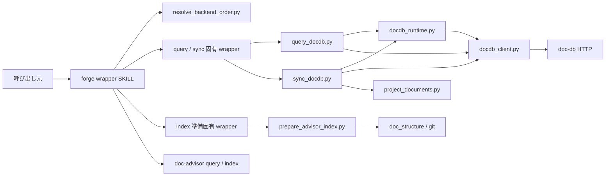
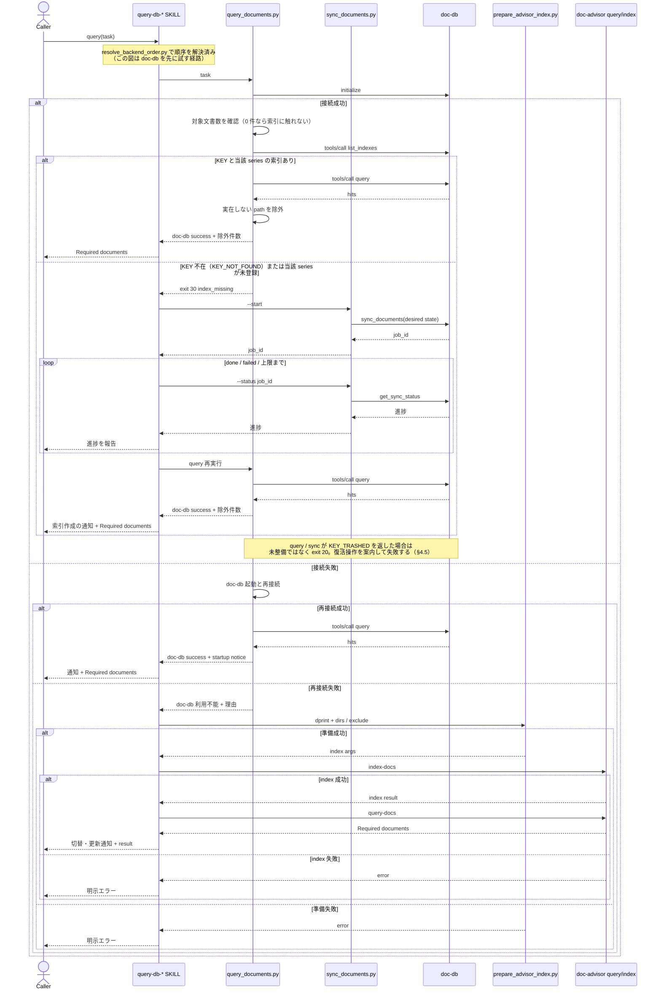
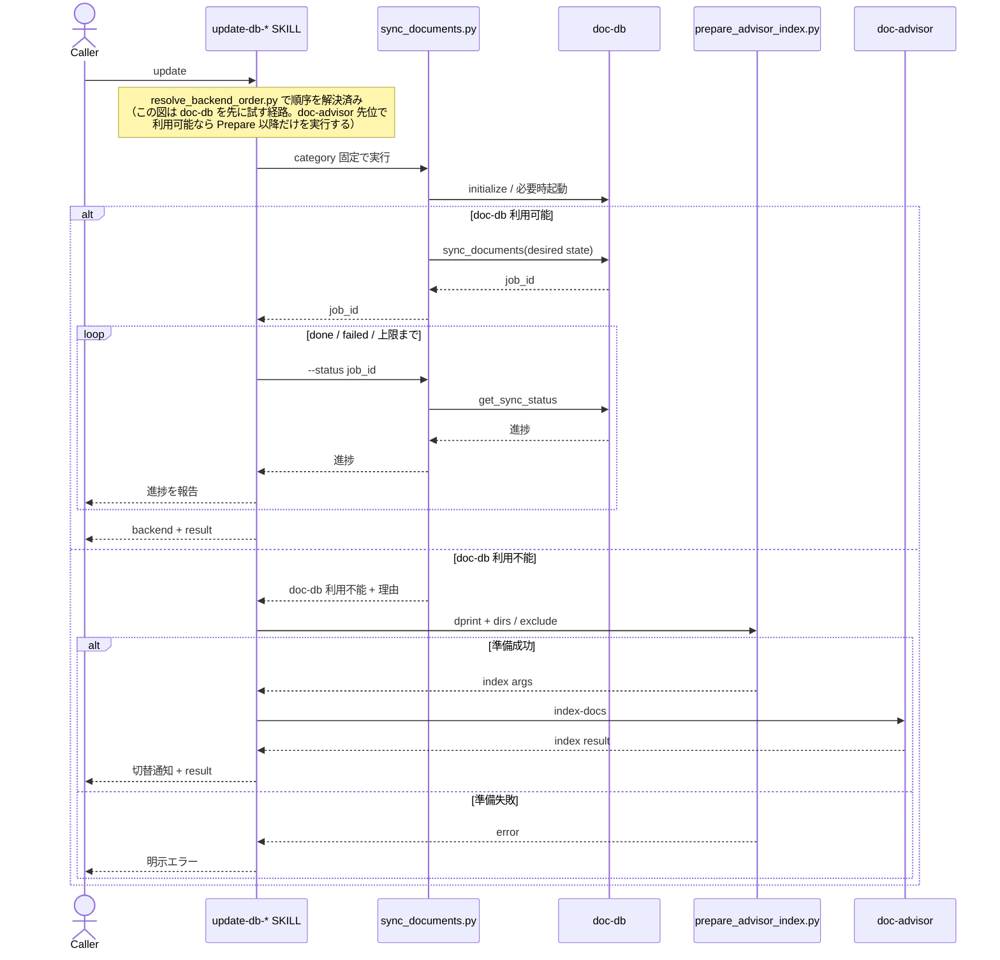

# DES-057 doc-db バックエンド選択 設計書

## メタデータ

| 項目     | 値         |
| -------- | ---------- |
| 設計 ID  | DES-057    |
| 関連要件 | REQ-014    |
| 作成日   | 2026-07-28 |

## 1. 概要

4 つの文書検索 wrapper に、順序リストに基づくバックエンド選択を追加する。
順序は設定（`.claude/.forge.yaml` の `doc_backend.prefer`）から決まり、既定値は doc-advisor 先位である（§2.5）。
選択者は順序リストの先位から各 backend が所有する可用性判定を呼び、最初に利用可能な backend を利用する。
doc-db との通信は登録済み MCP ツールに依存せず、Python 標準ライブラリによる Streamable HTTP クライアントで行う。

バックエンド固有処理は共有低レベル script に閉じ、各 SKILL は category 固定の薄い wrapper と外部 SKILL の起動だけを担当する。
これにより、選択規則を 4 つの SKILL.md に重複させず、既存の SKILL 名・引数・検索結果形式を維持する。

## 2. 設計方針

### 2.1 バックエンド選択境界

doc-db への接続確認、起動試行、再接続、および 1 つの doc-db 操作は、同一の低レベル script 実行内で行う。
複数の操作にまたがる進行（未整備時の索引作成 → 再検索、sync の完了待ち）は SKILL が駆動する（§4.2・§4.3）。
script は次のいずれかを確定して返す。

| 結果                  | 意味                                                         | 後続処理                                                   |
| --------------------- | ------------------------------------------------------------ | ---------------------------------------------------------- |
| doc-db 成功           | initialize と対象 operation が完了した                       | 結果を返して終了                                           |
| doc-db 利用不能       | doc-db が未導入、起動不能、または起動後も接続不能            | 選択者（SKILL）が順序リストに従い残る backend の可否を確認 |
| doc-db operation 失敗 | 接続確立後の query / sync が失敗または完了待ち上限に到達した | 明示エラー。別 backend へ切り替えない                      |

script は doc-db の可用性と操作の結果だけを返し、他方の backend・選択順序を知らない（§2.5 の責務分離）。
「利用不能」の結果をどう使うかは選択者が順序リストから決める。
接続確立後の operation 失敗を他方の backend へ切り替えない。
索引内容、入力、サーバ内部処理などの障害を「doc-db が利用不能」と誤分類して隠蔽しないためである。

当該 KEY が未生成、または当該 series が未同期の状態は、上記 3 分類のいずれにも該当しない。障害ではなく **未整備** であり、
他方の backend への切替でも失敗でもなく、**索引を作成してから query を継続する**（REQ-014 BL-004）。
doc-advisor 経路が ToC 未生成時に索引更新を完了させてから検索する規定（§5.1）と対称にするためである。
script は未整備を専用の exit code で返し、索引作成と再検索の駆動は SKILL が行う（§4.2・§4.4）。
索引の作成自体が失敗した場合は operation 失敗に分類する。

### 2.2 HTTP 直結

doc-db クライアントは `http://localhost:{port}/mcp` に対し、次の順で JSON-RPC を送信する。

1. `initialize`
2. `notifications/initialized`
3. `tools/call`

`Mcp-Session-Id` を同一 operation 中に保持し、JSON 応答と SSE 応答の両方を解析する。
port は `~/.doc-db/doc-db.yaml` の `port` を読み、未設定または読み取り不能の場合は doc-db の既定 port を使用する。
認証情報を読む処理および出力する処理は持たない。

通信定数は参考実装の契約を引き継ぎ、通常 operation の HTTP timeout と sync 完了待ち上限（SKILL 側のポーリングに適用する上限）を 600 秒、
sync status の poll 間隔を 2 秒、既定 port を 58080 とする。
接続 probe は localhost の起動確認専用として HTTP timeout を 1 秒、起動待ち期限を 10 秒、再試行間隔を 0.25 秒とする。
probe 値は利用者向け性能目標ではなく、未起動判定を長時間ブロックせず選択者へ結果を返すための内部上限である。

### 2.3 on-demand 起動

初回接続に失敗した場合、`shutil.which("doc-db")` で実行ファイルを解決する。
解決できた場合は `subprocess.Popen` の新規セッションとして起動し、標準入力・標準出力・標準エラーを切り離す。
サーバログは doc-db 自身の設定先に委ね、forge はログファイルを生成しない。

起動後は localhost の MCP initialize を期限付きで再試行する。
別 wrapper が同時に doc-db を起動して一方のプロセスが終了した場合でも、MCP 接続に成功すれば利用可能と判定する。
接続できなければ、実行ファイル不在、プロセス起動失敗、早期終了、再接続不能のいずれかを理由コードとして返す。

この起動は現在の wrapper 実行を完了するための on-demand 起動である。
OS ログイン時の自動起動、サービス登録、停止、再起動監視は行わない。

### 2.4 doc-advisor の可用性判定

doc-advisor が所有する可用性判定である。installed / available 判定は、SKILL 実行時の
available-skills を正とする（doc-advisor は外部プラグインであり、導入有無は SKILL 層でしか
観測できない）。Python script は Claude Code の SKILL registry を推測しない。

選択者は、順序リストで doc-advisor の番になったとき（先位として最初に、または doc-db 利用不能後の
後位として）、次の SKILL が揃っているかで可用性を判定する。

| 経路   | 必要な doc-advisor SKILL   |
| ------ | -------------------------- |
| query  | `index-docs`、`query-docs` |
| update | `index-docs`               |

いずれかが欠けていれば、その経路では doc-advisor を利用不能とし、順序リストの残る backend の
可否確認へ進む。残る backend も利用不能な場合に、両 backend の利用不能理由を返して失敗する。
grep 検索は実行しない。
forge は doc-advisor の ToC ファイル配置や `generated_at` を直接読まない。

#### バージョンを判定に使わない [MANDATORY]

可用性は `index-docs` と `query-docs` が利用できるかどうかだけで判定する。**DocAdvisor のバージョンを
条件にしない。バージョンを推測する代用品も持たない。**

| 条件                                       | reason code      | 利用者向け通知                                                                      |
| ------------------------------------------ | ---------------- | ----------------------------------------------------------------------------------- |
| `index-docs` / `query-docs` が揃っていない | `advisor_absent` | doc-advisor 未導入として残る backend の可否確認へ進む。両方不能なら理由を返して失敗 |

**特定の SKILL の有無からバージョンを推測しない**（REQ-014 前提条件）。理由は次の 3 点である。

- 「どの版で何が入ったか」は DocAdvisor 側のリリース履歴であり、forge の設計が抱える情報ではない
- 成果物の有無はバージョンではない。fork・部分インストール・提供側の改名で推測が誤り、誤りを検知できない
- 得られるのは「未導入」と「古い版」の通知文の書き分けだけで、対価として跨リポジトリの結合を負う

`query-docs` と `index-docs` の一方だけが存在する状態は、DocAdvisor が両者を同一プラグインとして配布するため
実環境では発生しない。判定式としては `advisor_absent` に含める（doc-advisor を利用可能と見なさない）。

**forge が ToC の内部配置・生成日時を解釈する経路を持たない**（REQ-014 BL-002）。索引が現在の内容を
映しているかの判断は doc-advisor の索引更新機能に委ね、forge は更新を依頼して結果を受け取るだけである。

### 2.5 優先 backend の指定（REQ-014 BL-001）

利用者は `.claude/.forge.yaml`（汎用設定ファイル。入れ物の規約は DES-061）で
優先 backend を指定できる。**`doc_backend` セクションのスキーマと既定値は本設計が所有する。**

```yaml
doc_backend:
  prefer: doc-db # doc-db | doc-advisor。省略時は既定値
```

**責務分離 [MANDATORY]**: 可用性判定は各 backend が所有し、選択順序は選択者だけが持つデータである。

- **選択者（SKILL のオーケストレーション）**: 順序リストを解決し、先頭から各 backend の
  可用性判定を呼び、最初に利用可能な backend を選ぶ。判定の中身を知らない
- **doc-db**: 可用性判定（probe・起動試行・再接続 = `docdb_runtime.py`）と操作（query / sync）を所有する。
  **他方の backend・優先指定・選択順序を知らない**（`query_docdb.py` / `sync_docdb.py` は設定を読まない）
- **doc-advisor**: 可用性判定（検索・索引更新の機能が利用できるか）と操作を所有する。判定は
  SKILL 実行時の available-skills でのみ観測できるため、この判定は SKILL 層で行う（§2.4）

**順序リストの解決**: 専用 CLI `resolve_backend_order.py` が担う。`forge_settings.py` で
`doc_backend` セクションを読み、順序リストを JSON で返す。SKILL は YAML を解釈しない。

| 設定の状態                 | `resolve_backend_order.py` の出力                                                                               |
| -------------------------- | --------------------------------------------------------------------------------------------------------------- |
| 未指定・ファイル不在       | 既定値の順序 `["doc-advisor", "doc-db"]`（既定値の定義はこの CLI の定数 1 箇所）                                |
| `prefer: doc-advisor`      | `["doc-advisor", "doc-db"]`（既定値の明示に過ぎない）                                                           |
| `prefer: doc-db`           | `["doc-db", "doc-advisor"]`                                                                                     |
| 不正（許容する形に反する） | exit `20`（`operation_error`）を reason code `settings_invalid` で返す。**推測で既定値に落ちない**（§2.5 末尾） |

**許容する形**: `doc_backend` セクションは mapping であり、キーは `prefer` のみ、値は
`doc-db` / `doc-advisor` の 2 値とする。次のいずれも設定の不正として扱う。

- セクションが mapping でない（例: `doc_backend: doc-advisor`、リスト）
- 未知のキーを含む（例: `preffer:` のような綴り誤り。黙って無視すると指定が効いていないことに気づけない）
- `prefer` の値が上記 2 値以外

指定が変えるのは選択順序だけである（REQ-014 BL-001）。可用性判定・索引整備・通知・失敗の扱いは
指定の有無で変わらない。SKILL は順序リストの先位から試し、先位が利用不能なら理由を通知して
後位を試す（REQ-014 FNC-004）。いずれも不能なら明示エラーとする。

不正値・解析不能の設定を黙って無視して既定値で動くことはしない。利用者が意図した backend と
異なる側で静かに動き続けることになるためである（DES-061 §2.4 と同じ方針。構文エラーは
`forge_settings.py` が、値域エラーは `resolve_backend_order.py` が検出する）。

## 3. アーキテクチャ

### 3.1 コンポーネント図



依存方向は `SKILL.md → SKILL 固有 wrapper → 共有低レベル script → 外部 backend / 設定` の一方向とする。
共有低レベル script から SKILL や SKILL 固有 wrapper を呼ばない。
**CLI エントリ script（`query_docdb.py` / `sync_docdb.py` / `prepare_advisor_index.py`）は互いを呼び出さない。**
helper モジュール（`docdb_client.py` / `docdb_runtime.py` / `project_documents.py`）の import は同一層内でも許容する。
KEY / series 未整備時に query と sync を順に実行する制御は SKILL が担う（§4.2）。
CLI 相互の呼び出しを禁じることで、複数 operation の進行と進捗報告の位置が SKILL 側に固定される。
索引が現在の内容を映しているかの判断は forge script に持たず、`doc-advisor:index-docs` の desired-state 処理に委ねる（§5.1）。

### 3.2 モジュール一覧

| モジュール                                     | 責務                                                                             | 依存                                   |
| ---------------------------------------------- | -------------------------------------------------------------------------------- | -------------------------------------- |
| 各 `query-db-*/SKILL.md`                       | doc-db 結果返却、index / query 起動、通知                                        | SKILL 固有 wrapper、doc-advisor        |
| 各 `update-db-*/SKILL.md`                      | doc-db 結果返却、doc-advisor index 起動、通知                                    | SKILL 固有 wrapper、doc-advisor        |
| `skills/*/scripts/query_documents.py`          | category を固定し、検索タスク 1 件だけを query 低レベル CLI へ渡す               | `query_docdb.py`                       |
| `skills/*/scripts/sync_documents.py`           | category を固定し、同期の `--start` / `--status <job_id>` だけを公開する         | `sync_docdb.py`                        |
| `skills/*/scripts/prepare_advisor_index.py`    | category を固定し、引数なしで索引入力準備 CLI を呼ぶ                             | `prepare_advisor_index.py`             |
| `scripts/doc_backend/docdb_client.py`          | MCP session、JSON-RPC、JSON / SSE 応答解析                                       | Python 標準ライブラリ                  |
| `scripts/doc_backend/docdb_runtime.py`         | 接続 probe、doc-db 起動、再接続、理由コード生成                                  | `docdb_client.py`、`doc-db` executable |
| `scripts/doc_backend/project_documents.py`     | category 対象文書、project key、git series の解決                                | 既存 doc-structure resolver、git       |
| `scripts/doc_backend/resolve_backend_order.py` | 設定から backend 順序リストを解決（既定値の定義点。値域検証と settings_invalid） | forge settings                         |
| `scripts/doc_backend/query_docdb.py`           | doc-db query（series 指定）、KEY / series 未整備の検出、既存出力形式の構築       | runtime、client、project documents     |
| `scripts/doc_backend/sync_docdb.py`            | desired-state sync の投入（`--start`）と単発の状態取得（`--status`）             | runtime、client、project documents     |
| `scripts/doc_backend/prepare_advisor_index.py` | dprint 適用と doc-advisor 用 dirs / exclude 解決                                 | 既存 dprint runner、doc-structure      |
| `scripts/forge_settings.py`                    | `.forge.yaml` の読み取り（入れ物の規約は DES-061。forge 全体の共有）             | Python 標準ライブラリ                  |

共有モジュールは `plugins/forge/scripts/doc_backend/` に置く。
4 SKILL が同じ処理を利用するため、いずれか 1 SKILL の配下には置かない。
forge 内に ToC 探索や `generated_at` 比較の script は置かない。

## 4. doc-db 処理設計

### 4.1 project key と series

doc-db の key は `{project_name}-{category}`、series は現在の git branch とする。

| 値             | 解決方法                                                                      |
| -------------- | ----------------------------------------------------------------------------- |
| `project_name` | `git rev-parse --git-common-dir` の親ディレクトリ名。失敗時は project root 名 |
| `category`     | wrapper が固定する `rules` または `specs`                                     |
| `series`       | `git rev-parse --abbrev-ref HEAD`。取得不能または detached HEAD は `main`     |

worktree ごとに key が分裂しないよう、project root の basename より git common dir を優先する。
**query と update はいずれも現在の branch を series として指定する**（REQ-014 BL-005）。読み書きで対象を変えない。

#### series 指定と実在確認

doc-db は `query` の `series` を任意引数とし、**省略時は KEY 内の全 series を横断検索する**。
これは doc-db 側の設計思想（recall 優先の二層アーキテクチャ。候補プールを広く返し、呼び出し元の
AI agent が本文を読んで判定する）に基づく既定であり、doc-db の参考実装 SKILL もこの既定を採る。

forge は現在の branch を series として明示指定する（REQ-014 BL-005）。
索引は対象文書の現在の状態を映すもの（REQ-014 FNC-003）であり、他 branch で削除済み・改訂前の文書を
検索結果へ復活させないためである。forge の wrapper は検索結果のパスをそのまま呼び出し元へ返す契約であり、
候補を広く集める利得より、現在の branch に存在しない文書を返さないことを優先する。

series を限定しない検索には、他 branch にのみ存在する文書に加えて、より重い混入がある。
desired-state 同期で当該 series から切り離された文書の record は、doc-db 側の物理削除が済むまで残るため、
**削除済みの文書が全 series 横断検索に現れ得る**（REQ-014 BL-005）。series を指定すればこの経路は閉じる。
doc-db の参考実装 SKILL も同じ理由で、現行版では series 指定を既定にしている。

series を指定した検索が 0 件だった場合、series を外した再検索は行わない。当該 series はその branch の
完全な現在状態であり、0 件は正しい結果である（REQ-014 BL-005・§4.2）。

当該 series が未同期で結果が得られない場合は、検索対象を広げるのではなく索引を同期して解決する
（REQ-014 BL-004・§4.2）。doc-db は同一 KEY 内で同一内容の文書の embedding を series 横断で共有するため、
別 series が既に同期済みであれば、新しい series の初回同期でも embedding の再計算は発生しない。
series を限定する判断が同期コストを増やさない根拠である。

series を限定しても、索引は最後の同期時点の状態である。同期後に削除された文書は索引に残るため、
出力前にパスの実在を確認して除外する（REQ-014 BL-005）。除外は §4.2 で行う。

#### backend 間の残差

series を現在の branch に限定した結果、両 backend の検索対象は「現在の branch の文書」に揃う。
ただし doc-advisor は series の概念を持たず、ToC を project root 単位で保持するため、次の差が残る。

| 軸               | doc-db                                   | doc-advisor                                  |
| ---------------- | ---------------------------------------- | -------------------------------------------- |
| key の範囲       | worktree 間で共通                        | project root 単位（worktree ごとに独立）     |
| series（branch） | 保持し、query / update とも現在の branch | 概念を持たない                               |
| 対象文書の解決   | forge の doc-structure resolver          | forge が渡した dirs / exclude を展開（§5.1） |

残差から次が生じる。

| 現象                                                                   | 影響                                                        |
| ---------------------------------------------------------------------- | ----------------------------------------------------------- |
| 対象文書の解決規則が異なる                                             | 同一 query でも索引母集団が完全には一致しない（§5.1）       |
| worktree を新設するたび当該 worktree の ToC が存在しない状態から始まる | doc-advisor 経路に落ちた初回 query が索引生成を伴う（§5.1） |

本設計はこの残差を解消しない。doc-advisor の series 不在は forge の設計選択では取り除けず、
doc-db の key を worktree ごとに分割すれば同一プロジェクトの索引が分裂するためである。
残差の存在を利用者向け通知（§7.1）で隠さないことを条件に許容する。

### 4.2 query

query は doc-db の `query` tool を `mode=all`、`top_n=20`、`series=現在の branch` で呼び出す（§4.1）。
`top_n=20` は参考実装の recall 優先契約を維持する値であり、forge 側で別の検索品質目標を追加するものではない。
返却された `results[]` の `path` を順位どおりに抽出し、既存契約の文字列を script が決定論的に構築する。
`Required documents:` 配下の各項目には path だけを出力する。
`origin_signals` は出力せず、`warnings` が存在する場合は path リストの後に別の診断情報として通知する。

```text
Required documents:

- docs/rules/example.md
```

#### パスの実在確認

`results[]` から抽出した path は、出力前に project root 起点で実在を確認し、**実在しないものを除外する**
（REQ-014 BL-005）。除外件数は path リストの後に診断情報として通知する（REQ-014 FNC-004）。
順位は除外後も元の順序を保つ。全件除外された場合も operation は成功とし、空の `Required documents:` を返す。

実在確認はパスの存在判定のみで行い、内容の読み取り・checksum 比較は行わない。

#### KEY / series 未整備時の索引作成

**判定は次の順に行う（REQ-014 BL-004）。**

1. 対象文書数を先に判定する。0 件なら索引に触れず「対象文書なし」として終了する。
2. 1 件以上ある場合に限り、当該 KEY / series の索引の有無を確認する。

索引側の状態からは「一度も同期していない series」と「同期済みだが desired-state が 0 件だった series」を
区別できない。後者に対して同期を促しても状況は変わらないため、対象文書数の判定を先に置いて切り分ける。

当該 KEY が未生成、または当該 series が未同期の場合、`query_docdb.py` は索引を作成せず、
**未整備であることを示す exit code `30`（`index_missing`）で返す**（§4.4）。索引作成は SKILL が駆動する。
未整備を検出した場合に series を外して横断検索へ切り替えることはしない。

SKILL は次の順に処理する（REQ-014 BL-004）。

1. `sync_documents.py --start` を呼び、`job_id` を即時受け取る。
2. `sync_documents.py --status <job_id>` を間隔を空けて繰り返し呼び、**そのたびに進捗をテキストで報告する**。
3. `done` になったら query を再実行し、通常の成功経路として結果を返す。

ポーリングを script 内で完結させず SKILL に置くのは、doc-db 側の統合指針に従うためである。
1 プロセス内で完了まで待つ実装では進捗が当該プロセスの標準エラー出力にしか現れず、SKILL 経由の実行では
利用者に届かない。索引作成は数分に及びうるため、進捗が見えないまま待たせることになる（REQ-014 NFR-001）。

索引作成を伴った事実は結果に含めて通知する（REQ-014 FNC-004）。利用者に `update-db-*` の実行を求めない。

同期は 1 回だけ試行する。同期後の `query` がなお 0 件を返す場合は「該当なし」として成功で返し、
再同期や検索対象の拡大は行わない。

対応する `update-db-*` SKILL へは再入しない。再入すると backend 選択が最初からやり直しになり、
既に確定した doc-db 経路が変化しうるためである（§5.1 の同型の規定と揃える）。
呼ぶのは低レベル CLI（`sync_documents.py`）であり、SKILL ではない。
対象文書が 0 件の場合は §4.3 の 0 件防御が適用され、索引を作成せず明示エラーとする。

#### 成功と障害の区別

検索結果が 0 件の場合も doc-db operation 自体は成功とし、空の `Required documents:` を返す。

tool error、レスポンス不正、および索引作成の失敗は **障害** であり、operation 失敗（exit code 20）として返し、
doc-advisor へは切り替えない（§2.1）。KEY / series の未整備それ自体は障害ではないため、この分類に含めない。

### 4.3 update

update は既存 `.doc_structure.yaml` の category 設定から対象 Markdown 一覧を解決し、
各 entry を `{path, local_path}` として doc-db の `sync_documents` に渡す。

**投入と完了待ちは分離する。** 低レベル CLI は 2 つの操作を提供する。

| 操作                | 動作                                                            | 返す内容         |
| ------------------- | --------------------------------------------------------------- | ---------------- |
| `--start`           | 一覧を解決し `sync_documents` を投入して即時に返る              | `job_id`         |
| `--status <job_id>` | `get_sync_status` を 1 回呼び、その時点の進捗を返して即時に返る | job の状態と件数 |

この 2 操作は同一場面で競合する方針ではなく、同一同期ジョブの「投入→観測」という順序付き位相である。
SKILL の各場面では呼び出し全体が一意に決まるため、1 つのローカル操作入口の明示モードとして維持する
（ADR-070、DES-024 §2.2）。別 script へ分けても選択対象が mode からファイル名へ移るだけであり、AI の
判断領域は減らない。

SKILL は `--start` で `job_id` を得たあと、`--status` を間隔を空けて繰り返し呼び、**そのたびに進捗を
テキストで報告する**。ポーリングのループを script 内に持たない（理由は §4.2 と同じ）。
poll 間隔は §2.2 の値を用い、`done` / `failed` または完了待ち上限で終える。

`sync_documents` は一覧全体を desired state として扱うため、追加・変更・削除・リネームを同じ経路で収束させる。
hash 一致文書の再計算要否は doc-db に委ねる。

対象が 0 件の場合は設定誤りによる全 series 切り離しを避けるため同期せず、明示エラーを返す。
空集合への意図的な同期は wrapper の責務に含めない。
job が失敗した場合、一部文書が失敗した場合、または完了待ち上限に達した場合は update 失敗とする。
ポーリングを打ち切っても doc-db 側の job は継続し、再実行で冪等に収束する。

### 4.4 doc-db 実行結果

低レベル CLI は機械判定可能な JSON と exit code を返す。
JSON は少なくとも `status`、`backend`、`operation`、`startup`、`reason_code` を持つ。
query 成功時は構築済みの `Required documents:` 文字列、`--start` 成功時は `job_id`、
`--status` 成功時はその時点の job 進捗を含む。

| exit code | `status`          | SKILL の動作                                                                |
| --------- | ----------------- | --------------------------------------------------------------------------- |
| 0         | `success`         | doc-db 結果を返して終了                                                     |
| 10        | `unavailable`     | doc-db は利用不能。SKILL が順序リスト（§2.5）と走査位置から次の処理を決める |
| 20        | `operation_error` | エラーを返して終了。backend を切り替えない                                  |
| 30        | `index_missing`   | 索引を作成（`--start` → `--status` ポーリング）して再試行                   |

exit `10` は doc-db が所有する可用性判定（§2.3）の失敗のみを意味する。doc-db の CLI は
優先指定・選択順序を知らないため（§2.5 の責務分離）、この結果をどう使うかは選択者（SKILL）が
順序リストから決める。exit code `30` は query 経路でのみ返る。`--status` は job が未完了でも
`0` を返し、状態は JSON の job 進捗で示す（未完了を異常として扱わない）。

SKILL は exit code だけで上記の経路を選択し、JSON field の組合せから状態を再構成しない。
JSON は結果表示と診断情報の取得にだけ使用する。
`startup` は未試行、起動成功、起動失敗を区別する。
エラー本文は URL、port、reason code、doc-db が返した非機密メッセージに限定し、環境変数値や設定本文を含めない。

### 4.5 doc-db MCP tool 契約（依拠スナップショット）

doc-db の MCP tool I/F の所有は doc-db 側にある。forge は接続する側であり、この I/F を規定しない。
外部の公開契約に依拠する点は同じ扱いである。

**I/F の SoT は doc-db 側の公開文書**（AI 統合ガイド、APP-001 要件定義書、DES-001 設計書）と、
同リポジトリ同梱の SKILL 参考実装である。本設計はそれらを規範として参照する。

以下の表は forge が実装・テストの対象を確定させるための **依拠スナップショット** であり、I/F の規範ではない。
別リポジトリの文書を実装時に必ず参照できるとは限らないため、依拠する時点の契約を記録する。
契約が改訂された場合は、本項の更新とテストの追従を同じ変更で行う（契約の改訂と実装・テストの追従を同じ変更で行う運用）。

応答は `tools/call` 結果の `content[]` のうち `type` が `text` の要素に載る JSON を解析して得る。
doc-db は同一内容を `structuredContent` にも載せるため、どちらから読んでも同じ dict になる（実測。下記「実測結果」）。

| tool              | request                                          | 使用する response field                                                                                                                                |
| ----------------- | ------------------------------------------------ | ------------------------------------------------------------------------------------------------------------------------------------------------------ |
| `query`           | `{key, series, query, mode: "all", top_n: 20}`   | `results[].path`（順位順。**chunk 単位のため同一 path が複数回現れうる**）、`warnings[]`（**正常時は field 自体が存在しない**）                        |
| `sync_documents`  | `{key, series, documents: [{path, local_path}]}` | `job_id`                                                                                                                                               |
| `get_sync_status` | `{job_id}`                                       | `status`（`running` / `done` / `failed`）、`processed`、`skipped`、`failed`、`deleted_paths_marked`、`errors[]`（**正常時は field 自体が存在しない**） |
| `list_indexes`    | `{}`                                             | `indexes[]` の各要素の `key` と `series`（当該 series の登録有無の確認に使う。**`series` は `null` になりうる**）                                      |

- `query` の `series` は任意引数である。forge は現在の branch を必ず指定する（§4.1）。
- 参考実装の CLI は series 未登録を検索前に検証し、未登録なら検索せず専用の exit code で返す。
  全 series 横断へのフォールバックは行わない。forge の未整備検出（§4.2 exit code `30`）はこれに対応する。
- 参考実装の CLI は sync の投入と状態取得を `sync-start` / `sync-status` として分離している。
  forge の `--start` / `--status`（§4.3）はこれに対応する。
- `top_n` の doc-db 既定値は 10 だが、doc-db 側の指針が重要な検索に 20〜30 を推奨しているため 20 を渡す。
- `sync_documents` は `job_id` を即時返す非同期 job であり、完了待ちは呼び出し側が `get_sync_status` を反復して行う（§4.3）。
- 応答に `job_id` が無い場合は operation 失敗として扱う。
- `get_sync_status` の `errors` は、エラーが 0 件の応答では **field 自体が省略される**（doc-db 0.3.3 実測。
  `query` の `warnings` と同じ省略形）。forge は不在・`null` を空リストとして扱い、契約違反にしない。
- `query` の `results[]` は chunk 単位で返るため、同一文書の `path` が複数の要素として現れうる
  （doc-db 0.3.3 実測。§4.2 の path 抽出は順位どおりにそのまま返す現行契約であり、重複除去は規定していない）。
- `results[]` の本文 field は使用しない。forge の出力契約は path のみである（§4.2）。
- `list_indexes` は当該 series が登録済みかを検索前に確認するために使う（§4.2）。参考実装も同じ手段を採る。
  `series[]` は「一度も同期していない」と「同期済みだが対象が 0 件だった」を区別できないため、
  対象文書数 0 の判定を先に行う（§4.2）。
- 上記以外の tool（`upsert_documents`、`schedule_delete_series`、`trash_index` 等）は本 feature では使用しない。

#### 実測結果（doc-db 0.3.2 / 2026-07-31）

実 doc-db に対する読み取り専用の実測で確認した事実。上記表の根拠であり、テストの注入応答はこの形に合わせる。

**error の形は 0.3.3 で変わっている。** 0.3.2 では KEY 不在が `isError: true` + 日本語文言
（`code` / `data` なし）だったが、0.3.3 で JSON-RPC error + 識別子へ変更された（本節末尾の
「KEY 状態に関する doc-db の挙動」が現行契約であり、そちらが正）。以下の表のうち error 以外の
観測点（Content-Type・session・result の担体・field 構成）は 0.3.3 でも変わっていない。

| 観測点               | 実測値                                                                                                 |
| -------------------- | ------------------------------------------------------------------------------------------------------ |
| 応答の Content-Type  | `initialize` / `tools/call` とも **`text/event-stream`（SSE）のみ**。`application/json` は観測されない |
| `Mcp-Session-Id`     | `initialize` の応答ヘッダで返る。以降の `tools/call` の応答ヘッダには含まれない                        |
| notification 応答    | `notifications/initialized` は空 body（Content-Type なし）                                             |
| result の担体        | `content[].text` の JSON と `structuredContent` の両方に同一内容が載る                                 |
| `query` 正常応答     | top-level は `results` / `stage_stats` のみ。`warnings` は **field 自体が存在しない**                  |
| `results[]` の field | `path` / `text` / `heading_path` / `score` / `score_breakdown` / `origin_signals` / `series_keys`      |
| `list_indexes` 応答  | `{"indexes": [{key, series, doc_count, chunk_count, last_updated_at, last_accessed_at}]}`              |
| `series` の型        | 文字列配列、または **`null`**（doc 0 件の KEY で観測）。空配列ではない                                 |

SSE のみが観測されたが、client は JSON 応答も解析できる実装を維持する（§2.2）。
Streamable HTTP はどちらの形式も許容し、応答形式は doc-db 側の実装詳細であるため、
片方だけを前提にすると doc-db の内部変更で壊れる。

`series` が `null` を取り得るため、`series[]` の走査は `null` を空集合として扱う。これは
doc-db 側の契約でもある（`null` は「当該 KEY に現在紐づく series が 0 件」を表し、空配列 `[]`
と同義。意味の異なる状態ではない）。

#### KEY 状態に関する doc-db の挙動

| 条件                        | doc-db の挙動                                            | forge の扱い                                    |
| --------------------------- | -------------------------------------------------------- | ----------------------------------------------- |
| KEY が存在しない            | JSON-RPC error（識別子 `KEY_NOT_FOUND`）                 | 未整備。索引を作成して query を継続する（§4.2） |
| KEY がゴミ箱状態            | JSON-RPC error（識別子 `KEY_TRASHED`）。復活操作を促す   | 未整備ではない。復活操作の案内を伴う明示エラー  |
| 既存 KEY の series が未登録 | **error にならず 0 件で成功する**（doc-db 側の安定契約） | 未整備。`list_indexes` で事前に検出する（§4.2） |

**判別は識別子に依拠する（ADR-058）。** doc-db 0.3.3 以降、KEY 不在とゴミ箱状態は
`isError` を伴う tool result ではなく **JSON-RPC error** として届き、識別子が
`error.data.code`（判別の正本）と `message` 先頭の両方に載る。forge は `data.code` の値
（`KEY_NOT_FOUND` / `KEY_TRASHED`）だけで分岐し、**メッセージ文言でも数値 code でも分岐しない**。
文言と数値 code は doc-db 側の公開契約ではなく、変更されても forge に通知されないためである。

`docdb_client.py` は JSON-RPC error を `ToolError(message, code, data)` へ変換し `data` を保持する。
呼び出し側は `ToolError.data["code"]` を読む。識別子を読み取れない error（`data` を持たない、
未知の識別子、0.3.3 未満の doc-db が返す tool error）は、いずれも障害として扱い索引作成を
試みない（§4.2）。この既定により、識別子が得られない環境でも安全側に倒れる。

ゴミ箱状態の KEY へ同期を試みても doc-db 側で拒否されるため、未整備として扱ってはならない。
ゴミ箱からの復活そのものは KEY の運用管理であり、本 feature の対象外（REQ-014 スコープ）である。

series 未登録は query では検出できない。**未登録 series への query が 0 件成功で返ることは
doc-db 側の安定契約であり、将来もエラー化しない**（series は登録状態を検証しない opaque な
絞り込み軸であるため）。したがって未整備（exit code `30`）の判定は `list_indexes` の `series`
による事前確認に依拠し、query の結果からは行わない（§4.2）。

## 5. doc-advisor 処理設計

### 5.1 query 前の索引更新

query wrapper が doc-advisor を選択した場合、**検索前に必ず索引更新を行う**（REQ-014 BL-002）。処理は次の順である。

1. `prepare_advisor_index.py` で既存 dprint runner を実行する。
2. 同 script が `.doc_structure.yaml` から `root_dirs` / `patterns.exclude` を解決する。
3. `doc-advisor:index-docs` を 1 回呼ぶ。
4. index が成功した場合だけ `doc-advisor:query-docs` を 1 回呼ぶ。

index 失敗時は query を続行しない（REQ-014 BL-003）。

#### 更新の要否を forge が判定しない [MANDATORY]

**forge は「更新が必要か」を事前に判定しない。** 常に `index-docs` を呼び、必要な差分の判断は
doc-advisor の desired-state 処理に委ねる。対象文書に変更がなければ ToC は書き換わらないため、
常に呼ぶことが不要な書き換えを生むことはない。

次の 3 つを本設計は持たない。いずれも同じ帰結（索引の正しさを別の指標で代用する）に至るためである。

- **経過時間による判定**: ToC が正しいかどうかは対象文書が変わったかどうかで決まり、前回生成からの
  経過時間では決まらない（REQ-014 BL-002）。経過時間を指標にすると、文書が変わっていないのに更新を促し、
  文書が変わっているのに更新を省く二方向の誤りが生じる
- **更新要否の判定を外部 SKILL へ委譲する経路**: 委譲すると、判定の基準を forge が持ち判定の実行を
  提供側が持つ形になり、1 つの決定が境界をまたいで分割される。本設計が外部リポジトリの成果物の I/F を
  規定することにもなる
- **索引更新を省くための最適化**: 差分の判断は `index-docs` の desired-state 処理が既に行っている。
  呼び出しを省く最適化を forge 側に置くと、その存在を設計・SKILL・テストのすべてが知る必要が生じる

ToC パスや内部ディレクトリ規約を forge に埋め込まない（REQ-014 BL-002）。

#### 索引母集団の差

ファイル一覧への展開は doc-advisor 側に委ね、doc-db sync 用の `project_documents.py` は使用しない。

この委譲により、索引母集団の決定経路は backend ごとに異なる。doc-db 経路は forge の doc-structure resolver が
対象文書一覧を確定させ、doc-advisor 経路は forge が渡した dirs / exclude を doc-advisor 側が展開し、
doc-advisor 固有の除外規則が併せて適用される。したがって**両 backend の索引母集団が一致する保証はない**。

不一致の要因は展開規則の差であり、doc-advisor 側へ統一を要求すれば解消しうるが、本 feature の範囲には
含めない。検索対象の範囲そのものは、doc-db 側で series を現在の branch に限定したことで揃っている（§4.1）。

query 前の索引更新では対応する `update-db-*` SKILL へ再入しない。
再入すると doc-db の選択を最初からやり直し、既に確定した doc-advisor 切替経路が変化しうるためである。
`prepare_advisor_index.py` と `doc-advisor:index-docs` を使い、update wrapper の doc-advisor 経路と同じ処理を直接完了させる。

索引入力準備 CLI は成功時に exit code `0` と `status=success`、dprint、設定解決、入力検証のいずれかが失敗した場合に
exit code `20` と `status=operation_error` を返す。
SKILL は exit code だけで index 実行可否を選択し、準備失敗時は `doc-advisor:index-docs` を呼ばない。

### 5.2 update

update SKILL が doc-advisor へ切り替える場合も、`prepare_advisor_index.py` で dprint と dirs / exclude 解決を行い、
`doc-advisor:index-docs` を 1 回呼ぶ。
doc-advisor の完了レポートは構造変換せず親へ返す。

query 経路（§5.1）と update 経路は、いずれも「prepare → `index-docs`」で索引を現在の内容に合わせる同一の手順になった。
差は index の後に検索を行うかどうかだけである。

## 6. ユースケース設計

### 6.1 ユースケース一覧

| ユースケース               | 説明                                                        |
| -------------------------- | ----------------------------------------------------------- |
| doc-db で query            | 接続済み doc-db を使い検索結果を返す                        |
| doc-db 索引作成後に query  | KEY / series 未整備を検出し、同期の進捗を報告しつつ検索する |
| doc-db 起動後に query      | 未起動 doc-db を on-demand 起動して検索する                 |
| doc-advisor で fresh query | doc-advisor を選択し、fresh ToC で検索する                  |
| doc-advisor 更新後に query | doc-advisor を選択し、stale ToC を更新してから検索する      |
| doc-db で update           | 現在 branch の文書集合を desired-state 同期する             |
| doc-advisor で update      | doc-advisor を選択し、従来の ToC を再構築する               |
| backend 不在               | 両 backend の利用不能理由を返して失敗する                   |
| backend operation 失敗     | 選択済み backend の処理失敗を隠さず返す                     |

### 6.2 query シーケンス

SKILL は最初に `resolve_backend_order.py` で順序リストを解決し（§2.5。不正は settings_invalid の
明示エラー）、先位から可用性判定を行う。以下の図は **doc-db を先に試す順序**（`prefer: doc-db`、
または doc-advisor が先位で利用不能だった後）の経路である。既定値（doc-advisor 先位）で
doc-advisor が利用可能な場合は、図中の doc-advisor 経路（prepare 以降）だけを実行し、
doc-db には触れない。



### 6.3 update シーケンス



## 7. エラーハンドリングと通知

| 条件                                | 動作                                                            |
| ----------------------------------- | --------------------------------------------------------------- |
| 設定が不正で順序を解決できない      | `settings_invalid` の明示エラー。既定値へ落ちない               |
| doc-db executable 不在              | 理由を通知し、順序リストの残る backend の可否確認へ進む         |
| doc-db 起動失敗 / 再接続不能        | 理由を通知し、順序リストの残る backend の可否確認へ進む         |
| doc-db query / sync error           | doc-db operation 失敗として終了する                             |
| doc-db sync 完了待ち上限            | job 情報を返して失敗する。他方の backend へ切り替えない         |
| doc-advisor 未導入                  | 残る backend の可否確認へ進む。両方不能なら理由を返して失敗する |
| ToC stale かつ index 失敗           | query を呼ばず失敗する                                          |
| doc-advisor query / index 失敗      | doc-advisor の失敗をそのまま返す                                |
| doc-db query 0 件                   | 成功。空の `Required documents:` を返す                         |
| doc-db の当該 KEY / series が未整備 | 索引を作成し、完了後に query を継続する（§4.2）                 |
| doc-db の索引作成が失敗した         | operation 失敗として終了する。切り替えない（§4.2）              |
| 検索結果に実在しないパスが含まれた  | 該当パスを除外し件数を通知する。成功として扱う（§4.2）          |

利用者向け通知は、backend、起動試行結果、切替理由、索引の作成・更新の有無を含める。
正常な初回接続時は冗長な警告を出さず、使用 backend の識別だけを結果に含める。

完了までに時間を要する索引作成・更新（doc-db の sync）では、SKILL が `--status` を呼ぶたびに
その時点の進捗をテキストで報告する（§4.2・§4.3）。進捗を script の標準エラー出力に委ねない。
SKILL 経由の実行では script の標準エラー出力が利用者に届かないためである（REQ-014 NFR-001）。

### 7.1 検索母集団が変わったことの通知

doc-advisor 経路へ切り替えた query では、上記に加えて**検索母集団が doc-db 経路と異なる**ことを通知する。
§4.1 と §5.1 は backend 間の残差を解消せず許容するが、その条件は利用者に隠さないことである。
通知しなければ、利用者は同一の query が backend によって異なる結果を返した理由を知る手段を持たない
（REQ-014 NFR-001）。

series を現在の branch に限定したことで検索対象の範囲は両 backend で揃う（§4.1）。
残るのは対象文書の解決規則の差であり、通知に含める内容はこの 1 点に限る。

| 内容                                     | 根拠                             |
| ---------------------------------------- | -------------------------------- |
| 対象文書の解決規則が doc-db 経路と異なる | 索引母集団の決定経路の差（§5.1） |

この通知は doc-advisor 経路へ切り替えた事実だけで組み立てられる。索引更新の応答の補助 field や
両 backend の母集団の差分計算を必要としない。doc-db 経路で完了した query では出さない。

## 8. 使用する既存コンポーネント

| コンポーネント            | ファイルパス / 所在                                             | 用途                                           |
| ------------------------- | --------------------------------------------------------------- | ---------------------------------------------- |
| 4 wrapper SKILL           | `plugins/forge/skills/{query,update}-db-{rules,specs}/SKILL.md` | 公開名・引数・doc-advisor 呼び出し契約を維持   |
| doc-structure resolver    | `plugins/forge/scripts/doc_structure/resolve_doc_structure.py`  | rules / specs の対象解決を再利用               |
| dprint runner             | `plugins/forge/scripts/doc_structure/run_dprint_fmt.sh`         | doc-advisor 索引作成前のフォーマットを再利用   |
| HTTP クライアント参考実装 | doc-db-mcp-server の同梱 SKILL（別リポジトリ・配布物外）        | JSON-RPC、SSE、sync、project identity の移植元 |
| doc-db 公開文書           | doc-db-mcp-server の AI 統合ガイド / APP-001 / DES-001          | MCP tool 契約・KEY / series 意味論の規範       |

参考実装と doc-db の公開文書は別リポジトリにあり、本リポジトリの配布物には含まれない。
そのため runtime import せず、配布物からの参照リンクも張らない（参照は開発時に別リポジトリを直接読む）。
実装に必要な tool 契約は §4.5 に依拠スナップショットとして取り込む。I/F の所有と規範は doc-db 側にある。
必要な処理を `plugins/forge/scripts/doc_backend/` へ移植し、forge 側の公開契約とテストに合わせて縮小する。
既存 wrapper SKILL と doc-structure 資産は置換せず拡張する。
query SKILL から既存の grep フォールバック手順と `Grep` の許可を削除し、doc-db と doc-advisor の両方が利用不能なら失敗する契約へ変更する。
feature 統合時は既存の doc-advisor 単一前提を、順序リストに基づく backend 選択（§2.5）へ置き換える。

## 9. テスト設計

### 9.1 単体テスト

| 対象                       | 検証項目                                                                                                                                                                                                   |
| -------------------------- | ---------------------------------------------------------------------------------------------------------------------------------------------------------------------------------------------------------- |
| `docdb_client.py`          | initialize、session header、JSON / SSE、HTTP / tool error                                                                                                                                                  |
| `docdb_runtime.py`         | 接続済み、実行ファイル不在、起動成功、早期終了、再接続不能、秘密値非出力                                                                                                                                   |
| `project_documents.py`     | worktree 共通 key、branch series、detached fallback、対象文書、exclude                                                                                                                                     |
| `resolve_backend_order.py` | 未指定・ファイル不在で既定値の順序、`prefer: doc-db` / `doc-advisor` の反映、不正（非 mapping / 未知キー / 値域外 / 解析不能）の exit 20 `settings_invalid`（既定値へ落ちない）                            |
| `query_docdb.py`           | path 抽出、順位維持、0 件、`Required documents:` 形式、series 指定、実在しない path の除外と件数通知、KEY / series 未整備の exit code 30 分類、ゴミ箱状態と障害の判別。設定を読まないこと（責務分離 §2.5） |
| `sync_docdb.py`            | desired state、削除追従入力、0 件防御、`--start` の job_id 返却、`--status` の単発取得（未完了で exit 0）。設定を読まないこと（責務分離 §2.5）                                                             |
| `prepare_advisor_index.py` | dprint 失敗伝播、dirs / exclude 出力、設定エラー                                                                                                                                                           |

時計、HTTP、process、filesystem は差し替え可能な境界を設け、実サーバや利用者の home 設定に依存しない。

### 9.2 wrapper テスト

各 SKILL 固有 wrapper について、category の固定値、許可された operation、stdout / stderr / exit code の契約を検証する。
query wrapper が task を 1 つだけ受理し、prepare wrapper が利用者入力を受理しないことを確認する。
sync wrapper は `--start` / `--status <job_id>` の両操作を受理し、欠落値・余分な引数・未知 operation を
低レベルへ渡さず拒否することを確認する。

### 9.3 統合テスト

HTTP 送信境界に応答を注入して次の経路を通す。注入する応答は §4.5 の契約に従う。
socket を開く fake server は用いない。送信は 1 つの関数境界に閉じており（§9.1 の差し替え可能な境界）、
JSON 応答・SSE 応答・tool error・HTTP error はいずれも注入で決定論的に再現できる。
実際に HTTP を話せることの確認は、実 doc-db に対する実行で 1 度行う（テストに含めない）。

- 初回接続成功から query 完了
- 初回接続失敗、起動後接続成功から query 完了
- 対象文書 0 件のとき索引に触れず終了すること（索引側の状態確認より前に判定すること）
- KEY / series 未整備の応答から exit code 30 → `--start` → `--status` の反復 → query 再実行の一連（各 script 実行が単発で完結すること）
- 未整備・0 件のいずれでも series を外した横断検索へ切り替えないこと
- 同期後の query が 0 件でも再同期せず「該当なし」として成功で返すこと
- 索引作成が失敗した場合に operation 失敗（exit code 20）となり doc-advisor へ切り替えないこと
- 実在しない path を含む応答での除外と件数通知
- doc-db 利用不能を示す切替結果
- sync job の accepted → running → done（`--start` が job_id を返し、`--status` が単発で進捗を返すこと）
- `--status` が job 未完了でも exit code 0 を返し、SKILL 側のループで完了判定できること
- MCP JSON 応答と SSE 応答

doc-advisor は外部 SKILL のため、forge 側では次を静的または契約テストする。
契約テストは依拠する外部 I/F に対して書く。I/F の所有は提供側にあるため、
契約が改訂された場合は固定点の更新とテストの追従を同じ変更で行う。

- `stale` 時だけ prepare → `index-docs` → `query-docs` の順になること
- `reason` 等の補助 field に依存しないこと。補助 field の値が未知でも経路が変わらないこと
- §7.1 の通知: doc-advisor 経路の query で検索母集団の相違を通知し、doc-db 経路では通知しないこと（SKILL.md の静的確認）

forge のテストは doc-advisor の判定規則に依存させない。`fresh` / `stale` は応答値として与え、
判定そのものを再現しない。**索引の差分検出規則・
`generated_at` の解析可否に結果が依存するテストを書かない。** これらは doc-advisor の内部判断であり、
依存すると doc-advisor 側の内部変更で forge のテストが壊れる。

検索品質そのもの、ToC ファイル探索の詳細は DocAdvisor 側で評価し、forge では重複評価しない。

## 10. 完全性確認

- REQ-014 FNC-001: 接続、起動、再接続、doc-advisor 切替、両 backend 不在エラーを §2、§6、§7 に反映した。
- REQ-014 FNC-002: query、検索前の索引更新（要否を判定しない）、grep 禁止、出力互換を §4.2、§5、§6.2 に反映した。
- REQ-014 FNC-003: desired-state update と削除・リネーム追従を §4.3、§6.3 に反映した。
- REQ-014 FNC-004: 起動、切替、索引作成・更新、失敗の通知を §4.4、§7 に反映した。
- REQ-014 NFR-001: 長時間の索引作成・更新の進捗報告を SKILL 側のポーリングに置き、script 内で完了待ちしない設計を §4.2・§4.3・§7 に定めた。doc-db 側の統合指針（1 プロセス内で待つと進捗が届かない）に従う。
- REQ-014 NFR-001〜005: 可観測性、公開契約維持、不要処理回避、失敗非隠蔽、情報保護を各境界とテストへ反映した。
- REQ-014 前提条件: 可用性を「検索と索引更新の機能が使えるか」だけで判定し、バージョンを条件にしない前提に従い、§2.4 に定めた。
- 決着済み: ToC 不在に専用の分岐を持たない。query 前に常に索引更新を行うため、不在と内容変更を区別する必要がない（§5.1）。
- 決着済み: doc-db の KEY 未生成および当該 series の未同期は未整備として、query 実行前に索引を作成してから検索を継続する（REQ-014 BL-004）。doc-advisor 切替でも失敗でもない。§2.1・§4.2・§6.2・§7 に反映した。doc-advisor 経路の ToC 未生成時の扱い（§5.1）と対称である。
- 決着済み: query は現在の branch を series として指定する（REQ-014 BL-005）。読み書きで対象を変えず、他 series の削除済み・改訂前の文書を復活させない。未同期時は BL-004 に従って同期してから検索する。実在確認は同期後に削除された文書を除くための規定として §4.1・§4.2 に残した。
- 外部依存: doc-db の MCP tool I/F の所有と規範は doc-db 側の公開文書にあり、§4.5 は forge が依拠する時点のスナップショットである。契約改訂時は §4.5 とテストを同じ変更で追従させる。
- 外部依存: doc-db の既定（series 非指定の全 series 横断検索）を forge は採らず series を明示する。判断の根拠と同期コストへの影響を §4.1 に記録した。
- 外部依存: KEY 不在とゴミ箱状態がいずれも致命的エラーとして届くため、両者とその他の障害の判別を §4.5・§4.2 に定めた。ゴミ箱状態は未整備として同期を試みない。
- 非解消として明示: backend 間の残差（§4.1）——対象文書の解決規則の差と ToC の worktree ローカル性——は解消せず存在を記述し、通知で隠さないことを条件に許容する。許容条件である通知は §7.1 に定めた。検索対象の範囲は series 指定で揃えたため残差に含まない。
- 外部依存: doc-db 0.3.2 で参考実装 SKILL の検索既定が series 指定へ変更された。切り離された削除済み文書の混入という理由を §4.1 に、series 未登録検証と `sync-start` / `sync-status` の対応を §4.5 に反映した。
- REQ-014 BL-004 / BL-005: 未整備（索引作成して継続）と障害（切り替えず失敗）の区別、および検索結果のパス実在確認を §2.1・§4.1・§4.2・§6.2・§7・§9 に反映した。
