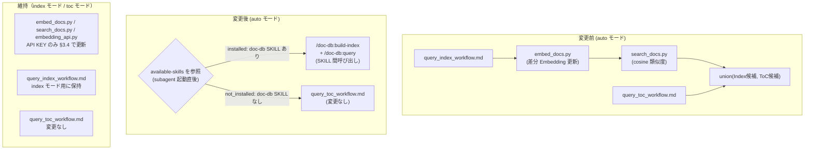
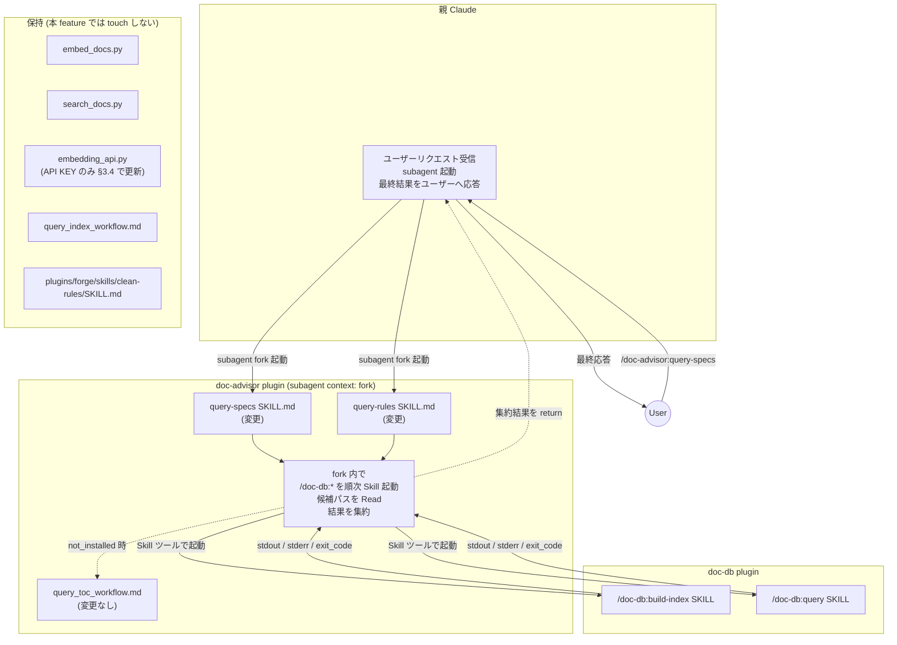
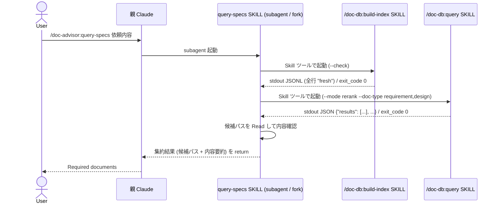
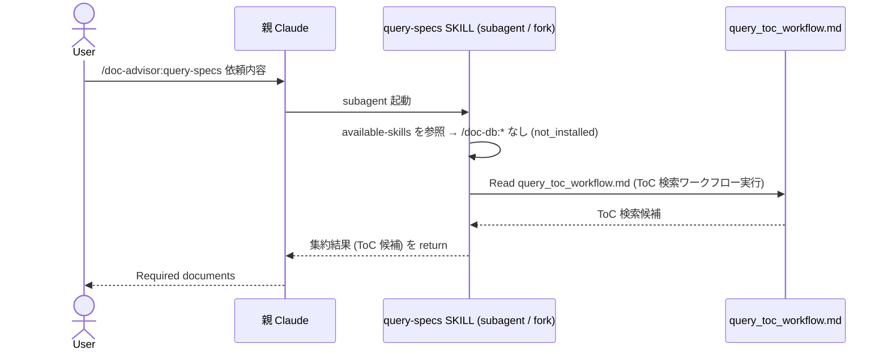
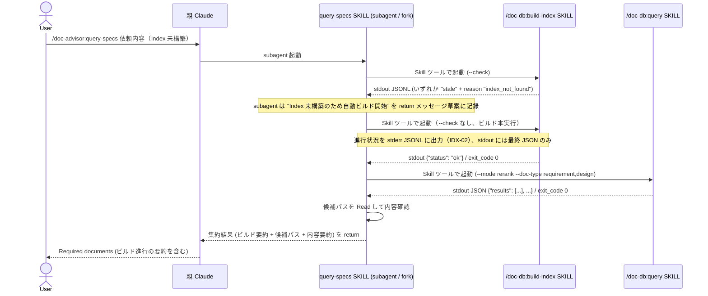

# DES-028 doc-db-first 検索エンジン昇格 設計書

## メタデータ

| 項目     | 値                                              |
| -------- | ----------------------------------------------- |
| 設計ID   | DES-028                                         |
| 関連要件 | FNC-008                                         |
| 依存設計 | DES-026（doc-db plugin 設計書）                 |
| 作成日   | 2026-05-12                                      |
| 対象     | doc-advisor plugin の query-specs / query-rules |

## 1. 概要

`/doc-advisor:query-specs` および `/doc-advisor:query-rules` のデフォルト検索（mode=auto）を、現行の
Embedding（`search_docs.py`）+ ToC union 方式から **doc-db Hybrid 検索**（Embedding + Lexical + LLM Rerank）に切り替える。
doc-db plugin が未インストールの場合は ToC 検索のみにフォールバックし、ユーザーへの影響を最小化する。

`--toc` モード・`--index` モードは **現行動作のまま維持**し、本 feature では touch しない（FNC-008 v1.4 改訂方針）。doc-advisor の Embedding 関連スクリプト（`embed_docs.py` / `search_docs.py` / `embedding_api.py`）も **保持**する。

doc-db plugin への連携は、**doc-advisor の subagent（`query-specs` / `query-rules`, `context: fork`）が自身の fork コンテキスト内で `Skill` ツール経由で doc-db plugin の SKILL（`/doc-db:build-index` / `/doc-db:query`）を起動する形**で行う。プラグイン間でファイルシステムにまたいでスクリプトを直接実行する設計は採用しない（プラグインの独立性・Claude Code のプラグイン解決機構との整合のため）。詳細な実行モデルは §1.2 を参照。

### 1.1 前提・制約

本設計の実装・動作に必要な前提条件と制約を以下に明記する。

| 項目                  | 内容                                                                                                                                                                                                                                                                                     |
| --------------------- | ---------------------------------------------------------------------------------------------------------------------------------------------------------------------------------------------------------------------------------------------------------------------------------------- |
| OpenAI API key        | `OPENAI_API_DOCDB_KEY` を優先参照し、未設定時のみ `OPENAI_API_KEY` をフォールバックとして使用する。**doc-db の `/doc-db:build-index` / `/doc-db:query` SKILL および doc-advisor の Embedding スクリプト（`embedding_api.py` 等）双方で同一仕様**（FNC-008 KEY-01）。詳細設計は §3.4 参照 |
| `.doc_structure.yaml` | プロジェクトルートに存在すること。doc-db のカテゴリ定義・対象パス解決に使用する                                                                                                                                                                                                          |
| doc-db plugin         | Claude Code のプラグイン機構によりインストール済みであること。未インストールの場合は ToC 検索フォールバックが動作する（OP-01）                                                                                                                                                           |
| doc-advisor Embedding | `embed_docs.py` / `search_docs.py` / `embedding_api.py` は保持する。`--index` モードからの呼び出し経路で従来通り動作させる                                                                                                                                                               |

設計で解消する要件 TBD:

| TBD     | 内容                                 | 設計決定                                                              |
| ------- | ------------------------------------ | --------------------------------------------------------------------- |
| TBD-001 | build-index の同期 / 非同期          | **同期**（§5.1 参照）                                                 |
| TBD-002 | 進行状況の通知形式・タイミング・内容 | **`/doc-db:build-index` SKILL の出力を親 Claude が表示**（§5.2 参照） |

### 1.2 SKILL 実行モデル（subagent 内完結フロー） [MANDATORY]

`query-specs` / `query-rules` SKILL は `context: fork` の subagent として親 Claude とは独立したコンテキストで隔離実行される。fork の本来の目的は「ToC など大量の文書を読み込むコンテキストを親と分離すること」であり、subagent は fork 内で必要な処理を完結させてから最終結果のみを親に返す。

`docs/rules/skill_authoring_notes.md`「別スキルの呼び出し → 許容される呼び出しパターン」表および「自己再帰の禁止 [MANDATORY]」セクションにより、**別プラグインの SKILL（`/doc-db:build-index` / `/doc-db:query`）を subagent 内から `Skill` ツール経由で呼び出すことは許容されている**。禁止対象は **自己再帰**（`query-rules` / `query-specs` / `query-forge-rules` 自身を `Skill` ツールで呼び出すこと）のみで、本設計の SKILL 連携はこれに該当しない。

また Claude Code のエージェントは、起動時に available-skills（システムリマインダで提供される利用可能スキル一覧）として **インストール済みの全 SKILL 名を事前に把握している**。`docs/rules/skill_authoring_notes.md`「依存 SKILL の存在確認」の推奨パターン（available-skills 事前参照）に従い、doc-db plugin の未インストール検出は「`Skill` ツールで `/doc-db:*` を起動して失敗するか確認する」という事後検知ではなく、**subagent が起動直後に available-skills リストに `/doc-db:build-index` および `/doc-db:query` が含まれているかを参照するだけで完結する**（OP-01 を事前判定）。

これらの前提に基づき subagent は自身の fork コンテキスト内で以下を一気通貫で実行できる:

1. **ターン T0**: ユーザー → 親 Claude が `/doc-advisor:query-specs <task>` を起動
2. **ターン T1（fork 内で完結）**: 親 Claude が subagent として query-specs / query-rules SKILL を fork 実行。subagent は **自身の fork コンテキスト内で** §3.3 のロジックに従い、
   - **available-skills を参照**して `/doc-db:build-index` および `/doc-db:query` の存在を確認
   - **未インストール（available-skills に含まれない）**なら ToC 検索ワークフロー（query_toc_workflow.md）に直接切り替え（OP-01）
   - **インストール済みの場合**は `Skill` ツールで `/doc-db:build-index --check --category {category}` を起動
   - `stale` + `index_not_found` なら `Skill` ツールで `/doc-db:build-index --category {category}` を起動
   - `Skill` ツールで `/doc-db:query --category {category} --query "{依頼内容}" --mode rerank [--doc-type requirement,design (specs のみ)]` を起動（§3.3 Step 3 の `--doc-type` 絞り込みポリシー参照）
   - 取得した候補パスを Read して内容確認\
     を全て fork 内で実行し、**最終的に集約した候補ドキュメントの一覧を親 Claude に return する**
3. **最終応答**: 親 Claude は subagent が return した結果を受け取り、ユーザーへ応答する

すなわち本設計のフローは **subagent 内完結**（`subagent が doc-db SKILL を内部で順次呼び出し → 親 Claude には最終結果のみ return → ユーザー応答`）であり、subagent ↔ 親の往復・instruction の中継・session state・再入力スキーマは一切不要である。

> **fork の目的との整合**: subagent を介在させる目的は、ToC 等の大量文書 Read を親コンテキストから隔離することにある。subagent 自身が `/doc-db:*` SKILL を fork 内で完結させて呼び出すことで、親 Claude のコンテキストには検索の最終成果物（候補パス + 内容要約）のみが残り、ToC データ・中間 JSON・stderr ログは subagent 側で消費される。逆に subagent が text instruction だけを返し親 Claude が SKILL を順次起動する設計は、subagent の存在意義（コンテキスト分離）と矛盾するため採用しない。

> **`/doc-db:query` 等の進行ログ**: doc-db 側 SKILL は subagent の fork 内で実行されるため、stderr JSONL の進行イベントは subagent コンテキストで観測される。IDX-02 の進行通知は subagent が要約してユーザー向け文言（"doc-db の検索 Index が未構築のため、自動的に構築します..." 等）として親 Claude に return する形で実現する（§5.2 参照）。

## 2. アーキテクチャ概要

### 2.1 変更前後の比較



> v1.4 改訂: `--index` モード関連のスクリプト・ワークフロー文書は廃止せず保持する（FNC-008 v1.4）。本 feature の変更は (1) mode=auto を doc-db 化、(2) doc-advisor 側 Embedding 関連スクリプトの API KEY 参照を doc-db と同一規約に統一（§3.4）、(3) `query-specs` / `query-rules` SKILL.md の description / argument-hint / mode=auto 動作の更新、に限定される。

### 2.2 コンポーネント構成



注:

- `query-specs` / `query-rules` SKILL は `context: fork` の subagent として隔離実行される。subagent は doc-db plugin のファイル・スクリプトに直接アクセスせず、`Skill` ツールで `/doc-db:build-index` / `/doc-db:query` を呼び出す。
- SKILL 間連携は **subagent の fork 内で完結する**（§1.2 参照）。`/doc-db:*` SKILL の stdout / stderr / exit_code は subagent コンテキストで観測され、subagent は最終的に集約した候補パスとその内容を親 Claude に return する。親 Claude は subagent が return した結果のみを受け取り、ユーザーへ応答する。
- 自己再帰（query-rules / query-specs / query-forge-rules を `Skill` ツールで呼び出すこと）は `docs/rules/skill_authoring_notes.md`「自己再帰の禁止 [MANDATORY]」で禁止されているが、別プラグインの SKILL（`/doc-db:*`）の呼び出しは同文書「許容される呼び出しパターン」表で許容される。

## 3. モジュール設計

### 3.1 変更・追加モジュール一覧

| モジュール                                                                                                                                                                                                                                    | 区分 | 責務                                                                                                                           | 依存                                                                                                                                                         |
| --------------------------------------------------------------------------------------------------------------------------------------------------------------------------------------------------------------------------------------------- | ---- | ------------------------------------------------------------------------------------------------------------------------------ | ------------------------------------------------------------------------------------------------------------------------------------------------------------ |
| `query-specs/SKILL.md`                                                                                                                                                                                                                        | 変更 | argument-hint 更新（`[--toc                                                                                                    | --index]`維持）+ description 再設計 + mode=auto を doc-db 優先に変更（doc-db SKILL 呼び出し、未解決時 ToC フォールバック）。`--index` モードの記述は現行維持 |
| `query-rules/SKILL.md`                                                                                                                                                                                                                        | 変更 | 同上（category = rules として適用）                                                                                            | 同上                                                                                                                                                         |
| `plugins/doc-advisor/scripts/embedding_api.py`                                                                                                                                                                                                | 変更 | API KEY 参照を `OPENAI_API_DOCDB_KEY` → `OPENAI_API_KEY` フォールバックに統一（§3.4）。エラーメッセージも対応する KEY 名へ更新 | -                                                                                                                                                            |
| `plugins/doc-advisor/scripts/search_docs.py`                                                                                                                                                                                                  | 変更 | `OPENAI_API_KEY` 直接参照を廃し、`embedding_api.py` の `get_api_key()` 経由に統一。エラーメッセージも更新                      | `embedding_api.py`                                                                                                                                           |
| `plugins/doc-advisor/scripts/embed_docs.py`                                                                                                                                                                                                   | 変更 | 同上                                                                                                                           | `embedding_api.py`                                                                                                                                           |
| `plugins/doc-advisor/skills/query-specs/SKILL.md`<br/>`plugins/doc-advisor/skills/query-rules/SKILL.md`<br/>`plugins/doc-advisor/skills/create-specs-toc/SKILL.md`<br/>`plugins/doc-advisor/skills/create-rules-toc/SKILL.md`（該当箇所のみ） | 変更 | KEY-02 に従いエラーメッセージ・案内文言を `OPENAI_API_DOCDB_KEY`（フォールバック `OPENAI_API_KEY`）に更新                      | -                                                                                                                                                            |
| `tests/doc_advisor/scripts/test_embedding_api.py`                                                                                                                                                                                             | 変更 | KEY-01 に追従。`OPENAI_API_DOCDB_KEY` 単独 / `OPENAI_API_KEY` 単独 / 両方 / 両方未設定 の 4 ケースを検証（TST-01）             | -                                                                                                                                                            |
| `tests/doc_advisor/scripts/test_embed_docs.py`<br/>`tests/doc_advisor/scripts/test_search_docs.py`                                                                                                                                            | 変更 | 環境変数モックを `OPENAI_API_DOCDB_KEY` 主体に差し替え（TST-02）。スクリプト本体の振る舞いは変えない                           | -                                                                                                                                                            |

注: 新規スクリプト（`detect_doc_db.py`）および新規ワークフロー文書（`query_db_workflow.md`）は作成しない。doc-db plugin の検出は「subagent 起動時の available-skills リスト参照（§3.3 Step 1a）」で判定し、mode=auto の検索手順は SKILL.md にインライン記述する。`--index` モードのワークフロー文書（`query_index_workflow.md`）は引き続き保持し、SKILL.md からも参照される（§5.5.1）。

### 3.2 削除モジュール一覧

**v1.4 改訂で本表は空となった**。FNC-008 v1.4 に従い doc-advisor 側 Embedding 関連スクリプト・関連テスト・`query_index_workflow.md`・`forge:clean-rules` SKILL の **削除は行わない**。

| ファイルパス | 削除理由 |
| ------------ | -------- |
| （なし）     | -        |

> **Note**: 旧 v1.0〜v1.9 で削除対象とされていた以下は本 feature では **保持** する:
>
> - `plugins/doc-advisor/scripts/embed_docs.py`（`--index` モードから利用）
> - `plugins/doc-advisor/scripts/search_docs.py`（`--index` モードから利用）
> - `plugins/doc-advisor/scripts/embedding_api.py`（同上。API KEY 仕様のみ §3.4 で更新）
> - `plugins/doc-advisor/docs/query_index_workflow.md`（`--index` モードのワークフロー文書）
> - `tests/doc_advisor/scripts/test_embed_docs.py` / `test_search_docs.py` / `test_embedding_api.py`（対応テスト。TST-01 / TST-02 で更新）
>
> **Note (`create_checksums.py`)**: `/doc-advisor:create-specs-toc` / `/doc-advisor:create-rules-toc` SKILL（`toc_orchestrator.md` workflow）の incremental mode 用 checksum 生成・promote・cleanup を担う **ToC 系スクリプト**。本 feature とは独立に従来通り動作する。
>
> **Note (forge:clean-rules)**: `plugins/forge/skills/clean-rules/SKILL.md` の **無効化（`SKILL.md.disabled` へのリネーム）は本 feature では行わない**。`embedding_api.py` を保持するため cross-plugin import 経路は引き続き repo 環境では動作する。install 環境（`~/.claude/plugins/cache/...`）の `parents[4]` 解決不能問題は本 feature 着手前から存在する既存バグであり、本 feature とは独立した issue として扱う。

### 3.3 SKILL.md 変更設計（query-specs / query-rules 共通）

**変更点のみ記載する。**

#### 引数パース（変更なし）

v1.4 改訂で `--index` モードを維持するため、引数パースは **現行のまま変更なし** とする:

```
--toc   → mode = toc（変更なし）
--index → mode = index（変更なし。doc-advisor Embedding 検索）
その他  → mode = auto（auto の内容のみ下記に変更: doc-db Hybrid 検索へ切替）
```

> 旧 v1.0〜v1.9 で計画した「`--index` フラグのエラー化」は OP-03 改訂により撤回。`--index` モードは Embedding 関連スクリプトの保持と合わせて現行動作を維持する（FNC-008 OP-03 / DES-028 §2.1 KEEP サブグラフ）。

#### `argument-hint` フィールド（変更なし）

```
"[--toc|--index] task description"  ← 変更なし
```

#### `description` フィールド変更

**設計方針** [MANDATORY]: `.claude/skills/review-skill-description/SKILL.md` の 7 基準（250 文字制限・What+When・意味アンカー・差別化・invocable 整合性・パイプライン記載・トリガー品質）を満たす形に再設計する。旧 description（`Supports ToC (keyword), Index (semantic), and hybrid (auto) modes.`）は modes 列挙のみで、利用者の benefit・差別化（query-specs vs query-rules vs forge:query-forge-rules）・トリガー語が欠落しており、AI による自動呼び出しの判定材料として弱い。

##### スコープの正しい定義 [MANDATORY]

CLAUDE.md「Information Sources」表（L57-70）にあるとおり、`/doc-advisor:query-specs` の対象は **「プロジェクト仕様（要件 / 設計 / 計画）」全般**であり、特定のフェーズ（実装着手前など）に限定されない。`/doc-advisor:query-rules` の対象も **「プロジェクトルール全般」**（CLAUDE.md L19 [MANDATORY] では「全ての作業開始時に実行」と定められている）。description はこのスコープに合わせて記述する（「実装着手前に」など特定フェーズに偏らない）。

##### 「タスク」という語を使わない理由 [MANDATORY]

forge プロジェクトでは `plan_format.md` / `spec_format.md` が「タスク」を **`TASK-XXX` 連番で識別される計画書内の実装単位** として強く定義している（`/forge:start-plan` が `tasks:` 配列を生成、`/forge:start-implement` が「タスクを順次実行」）。description は AI が読む文書であり、forge の意味アンカーを読み込んだ AI は **「タスクに関連する〜計画書を特定する」を「TASK-XXX を実装する際に依存する仕様文書を特定する」と解釈する**ため、実装フェーズに暗黙的に限定される（「実装着手前に」と同型の罠）。さらに要件作成・設計・計画書作成の 3 フェーズでは `tasks:` がまだ存在しないため、「タスクに関連する」自体が論理的に成立しない。よって description 本文では `タスク` 語を使わず、CLAUDE.md L19 が中立的に使う **「作業」**（および「ユーザーの依頼」）に統一する。

##### query-specs

```yaml
変更前: |
  Search document indexes to identify specification documents needed for a task.
  Supports ToC (keyword), Index (semantic), and hybrid (auto) modes.
  Trigger:
  - "What specs apply to this task?"
  - Before starting implementation work

変更後: |
  ユーザーの依頼や現在の作業に関連する要件定義書・設計書・計画書を docs/specs/ から見落としなく特定する。
  要件作成・設計・計画・実装・レビュー・仕様変更・既存仕様の確認など、プロジェクト仕様を参照するあらゆる場面で使用（特定フェーズに限定されない）。
  デフォルト (auto) は doc-db Hybrid 検索（Embedding + Lexical + LLM Rerank）で高精度に抽出。
  doc-db 未インストール時は ToC keyword 検索へ自動フォールバック。`--toc` で keyword 検索のみ、`--index` で doc-advisor Embedding 検索に固定可能。
  対象範囲: docs/specs/（ルールは /doc-advisor:query-rules、forge 内部仕様は /forge:query-forge-rules）。
  トリガー: "関連仕様を確認", "specs 検索", "要件/設計/計画を探す", "What specs apply"
```

##### query-rules

```yaml
変更前: |
  Search document indexes to identify rule documents needed for a task.
  Supports ToC (keyword), Index (semantic), and hybrid (auto) modes.
  Trigger:
  - "What rules apply to this task?"
  - Before starting implementation work

変更後: |
  現在の作業に適用すべきプロジェクトルール（コーディング規約・命名規則・設計原則・アーキテクチャ規約等）を docs/rules/ から見落としなく特定する。
  CLAUDE.md の規約により**全ての作業開始時に実行する**ことが推奨されている。実装・設計・レビュー・リファクタリング等のあらゆる場面で使用。
  デフォルト (auto) は doc-db Hybrid 検索（Embedding + Lexical + LLM Rerank）で高精度に抽出。
  doc-db 未インストール時は ToC keyword 検索へ自動フォールバック。`--toc` で keyword 検索のみ、`--index` で doc-advisor Embedding 検索に固定可能。
  対象範囲: docs/rules/（仕様書は /doc-advisor:query-specs、forge 内部仕様は /forge:query-forge-rules）。
  トリガー: "ルール確認", "規約を確認", "rules 検索", "What rules apply", "作業開始"
```

> 公式 250 文字制限は **listing 表示時の切り詰めライン**であるため、各 description は先頭 250 文字以内で「What（対象範囲）+ When（使用場面）+ 主要 benefit」を完結させる構造にしている（query-specs / query-rules ともに 1〜3 行目の合計が 250 文字以内）。詳細（フォールバック挙動・差別化・トリガー語）はそれ以降に並べる。v1.4 改訂により `--index` モードは現行維持されるため、description には `--toc` と `--index` の両モードを案内文として残す。「Hybrid 検索（auto）」「自動フォールバック」を主要 benefit として明示し、類似スキル（query-rules / forge:query-forge-rules）との差別化を本文中に明記している（review-skill-description 基準 #4）。

> **トリガー語の選定**: review-skill-description 基準 #7 に従い日英を両方含める。`/query-rules` は CLAUDE.md L19 [MANDATORY] の「全ての作業開始時」規約に対応するトリガー語として `"作業開始"` を含める。スコープを誤らせる「実装着手前」のような特定フェーズ語は使わない。**「タスク」も同様に使わない**: forge 文脈で `TASK-XXX`（計画書内の実装単位）を強く想起させ、実装フェーズに暗黙的に限定されるため。

#### mode = auto（新フロー）

```markdown
## mode = auto（変更後）

### 動作概要

subagent（`context: fork`）自身が doc-db plugin の SKILL を `Skill` ツールで順次呼び出し、Hybrid 検索を fork 内で完結させる **subagent 内完結フロー**（§1.2 参照）。doc-db plugin が未インストールの場合、subagent は起動直後の available-skills 参照（§1.2 / Step 1a）でその不在を即時検知し、Skill ツールを起動することなく ToC 検索ワークフロー（query_toc_workflow.md）に切り替える。

subagent は判定・実行・結果集約をすべて fork 内で行い、**最終的に集約した候補パス + 内容要約のみを親 Claude に return する**。親 Claude は subagent が return した結果を受け取り、ユーザーへ応答する。

shell 安全性: `{task}` はユーザー入力のため、subagent が `Skill` ツールで `/doc-db:query` を呼び出す際の `--query` 引数には引用符・シェルメタ文字を含むユーザー入力をそのまま渡せる形（`Skill` ツールが argv を構造化引数として扱うため、shell 展開は発生しない）で記述する。subagent 内で shell 経由のコマンド組み立てを行わないこと。

### Step 1a: doc-db plugin 未インストール検出 (OP-01)

subagent は起動直後にシステムリマインダで提供される **available-skills リスト** を参照し、以下の SKILL 名が含まれているかを確認する:

- `/doc-db:build-index`
- `/doc-db:query`

判定:

| 分類            | 判定根拠                                                                                    | 次の動作                                                      |
| --------------- | ------------------------------------------------------------------------------------------- | ------------------------------------------------------------- |
| `not_installed` | available-skills に `/doc-db:build-index` または `/doc-db:query` のいずれかが含まれていない | subagent 自身が ToC 検索ワークフローに切り替えて終了（OP-01） |
| `installed`     | available-skills に両 SKILL 名が含まれている                                                | Step 1b（Index 鮮度確認）へ進む                               |

> **未インストール検出はここで一元化する**。Skill ツールの起動失敗（`unresolved`）を待つ事後的な検知ではなく、available-skills の **事前参照** で完結する。Skill ツールを起動してから失敗を確認する方式は無駄な呼び出しコストが発生するうえ、`Skill` ツールの `unresolved` レスポンス仕様への依存が増えるため採用しない（§5.3 参照）。

### Step 1b: Index 鮮度確認 (IDX-01)

Step 1a で `installed` を確認できた場合、subagent は `Skill` ツールで以下を起動する:

/doc-db:build-index --category {category} --check

`Skill` ツール起動の結果を以下の **戻り契約** で 2 分類する:

| 分類              | 判定根拠                                                 | 次の動作                                                                                                                  |
| ----------------- | -------------------------------------------------------- | ------------------------------------------------------------------------------------------------------------------------- |
| `execution_error` | `exit_code != 0` または stdout/stderr の JSON parse 失敗 | subagent が error + hint を集約して親 Claude に return → 親がユーザーに通知して停止（SRC-02、ToC へフォールバックしない） |
| `success`         | `exit_code == 0` かつ stdout JSONL の parse 成功         | 次の判定（stale 判定）へ進む                                                                                              |

> Step 1a で `installed` が確定しているため、`/doc-db:build-index` の Skill ツール解決失敗（`unresolved`）は本 Step 1b では発生し得ない。仮に Skill ツールの内部エラーで起動できなかった場合は `execution_error` として停止する。`/doc-db:query` の SKILL 解決失敗も Step 1a を通過した時点で発生しないため、Step 3 における失敗は常に `execution_error`（API エラー等）に分類される。

`success` 分類後の stale 判定（現行 `build_index.py` の `--check` 出力契約に整合させる）:

- stdout JSONL の各行は `{"status": "fresh"|"stale", "reason": "..."}`。**行順序は `resolve_specs_doc_types()` の返却順** に一致する（specs カテゴリの場合）。rules カテゴリは 1 行のみ。
- **全行が `"fresh"` → Step 3 へ**
- **いずれかが `"stale"` かつ `reason = "index_not_found"` → Step 2 へ**
- **いずれかが `"stale"` かつ `reason ≠ "index_not_found"`（`"checksum_mismatch"` 等）→ Step 3 へ**（`/doc-db:query` 側で差分自動再生成されるため明示ビルド不要）

> 現行の `--check` JSONL 各行は doc_type フィールドを含まないため、stale 発生時の doc_type 特定は行順序に依存する。混在ケース（一部 fresh / 一部 stale）の詳細追跡は本フェーズではスコープ外とし、将来拡張（§5.4 参照）で `doc_type` フィールドを各行に含める拡張を検討する。

### Step 2: Index 自動ビルド (IDX-01 / IDX-02)

subagent はユーザー向け通知文 "doc-db の検索 Index が未構築のため、自動的に構築します..." を return メッセージに含める準備をしつつ、`Skill` ツールで以下を起動する:

/doc-db:build-index --category {category}

`Skill` ツール起動の結果を以下で判定する（現行 `build_index.py` の `run_build` 集約 stdout に整合させる）:

- **SKILL 実行成功、stdout JSON の `status == "ok"` → Step 3 へ**
- **SKILL 実行エラー（`exit_code != 0`）、または stdout JSON の `status == "error"` → subagent は error + hint を集約して親 Claude に return → 親がユーザーに通知して停止**（表示形式: "{error}。{hint}"）

> 現行の `run_build` は specs カテゴリ全体ビルド時に `{"status": "ok"}` のみを集約 stdout として返す（`build_state` / `failed_count` を含まない）。本フェーズでは `status` フィールドのみで完了判定を行い、`build_state` / `failed_count` による partial failure 観測は将来拡張（§5.4 参照）に委ねる。
>
> 進行イベントは `/doc-db:build-index` SKILL が stderr に JSONL 形式で出力する。subagent は stderr の JSONL イベントを fork 内で受信し、要約（進行段階・失敗 chunk 数など）を return メッセージに含めて親 Claude へ伝える。最終判定は stdout の JSON `status` フィールドのみを使用する。

### Step 3: Hybrid 検索 (SRC-01)

subagent は `Skill` ツールで以下を起動する（カテゴリ別の `--doc-type` ポリシーは後述）:

- **query-specs SKILL（category = specs）**: `/doc-db:query --category specs --query "{依頼内容}" --mode rerank --doc-type requirement,design`
- **query-rules SKILL（category = rules）**: `/doc-db:query --category rules --query "{依頼内容}" --mode rerank`（rules カテゴリは単一 Index のため `--doc-type` は無視される）

##### `--doc-type` 絞り込みポリシー [MANDATORY]

DES-026 改定履歴 v1.2（2026-05-09）で「`--doc-type` デフォルトを `requirement,design` ハードコードから `.doc_structure.yaml` 全 doc_type 動的取得に改定。**絞り込みポリシーは SKILL レイヤーに移動**」とされた。本設計では doc-advisor の query-specs SKILL（subagent）が SKILL レイヤーの責務として `--doc-type` を明示する。

| SKILL               | category | `--doc-type` 指定                                                                                         |
| ------------------- | -------- | --------------------------------------------------------------------------------------------------------- |
| query-specs（変更） | specs    | **`--doc-type requirement,design` を明示**（互換性維持のため当面の運用。将来仕様変更予定 — 下記注記参照） |
| query-rules（変更） | rules    | 指定しない（rules カテゴリは単一 Index のため `--doc-type` は無視される。DES-026 §3.2）                   |

> **互換性維持の根拠**: doc-advisor v0.2.x までの query-specs は要件定義書・設計書を主対象とした検索挙動を持つ（embedding ベース）。doc-db Hybrid 検索へ切り替える本フェーズで急に全 doc_type（requirement / design / plan / api / reference / spec / カスタム）へ拡張すると、`/doc-advisor:query-specs` の応答内容が plan / api 等を含むようになり、利用側 SKILL（forge:start-design, forge:start-plan 等）の挙動が暗黙的に変化する。本フェーズではこの挙動変化を意図的に避け、検索対象を `requirement,design` に固定する。

> **将来仕様**: 全 doc_type への拡張、あるいは「依頼内容に応じて subagent が動的に doc_type を選択する」運用は別フェーズで検討する（後継要件 / 別 ADR）。本設計のスコープ外。

`Skill` ツール起動の結果を判定する（現行 `search_index.py` の出力契約は stdout 最終行に `results` キーを含む JSON 1 行を返す。`status` キーは存在しない）:

- **成功**: `exit_code == 0` かつ stdout が JSON として parse 可能かつ `results` 配列が存在する → 結果の path リストを候補として保持し最終判定へ
  - `results` が空配列の場合は「検索結果 0 件」として扱う（後述）
- **失敗**: `exit_code != 0`、または stdout の JSON parse に失敗、または parse 成功しても `results` 配列が存在しない → subagent は stderr の `error` / `hint` フィールド（存在する場合）を集約して親 Claude に return → 親がユーザーに error + hint を通知して停止（SRC-02、ToC にはフォールバックしない）
- **検索結果 0 件**: `results` 配列が空 → subagent は「該当する文書が見つかりませんでした」を return メッセージとして親 Claude に return → 親がユーザーに通知して停止（ToC にはフォールバックしない。fresh Index に対する 0 件は障害ではなく仕様）

注: `/doc-db:query` SKILL は内部で grep 補完を含むため、subagent 側で grep の追加呼び出しは不要（DES-026 / `/doc-db:query` の責務）。

### Step: 最終判定（変更なし）

subagent が Step 3 の候補パスを Read して内容を確認し、**集約結果（候補パス + 内容要約）を親 Claude に return する**。親 Claude は subagent が return した最終結果をそのままユーザーへ応答する（§1.2 参照）。

（注: 本フローは mode=auto のみを対象とする。mode=toc / mode=index は現行動作のまま変更なし。Step: 最終判定 のロジックは変更なし。）
```

### 3.4 API KEY 統一の設計（FNC-008 KEY-01 / KEY-02）

doc-advisor の Embedding 関連スクリプト群に対して、doc-db と **完全に同一の API KEY 参照仕様** を導入する。doc-db 側 (`plugins/doc-db/scripts/embedding_api.py`) と同型のロジックを doc-advisor 内で **独立実装** する（cross-plugin import は行わない、§5.3 採用案理由参照）。

#### 3.4.1 対象モジュール

| ファイル                                                                                                                                                    | 変更内容                                                                                                                                             |
| ----------------------------------------------------------------------------------------------------------------------------------------------------------- | ---------------------------------------------------------------------------------------------------------------------------------------------------- |
| `plugins/doc-advisor/scripts/embedding_api.py`                                                                                                              | 上部に `OPENAI_API_KEY_ENV = "OPENAI_API_DOCDB_KEY"` と `_FALLBACK_ENV = "OPENAI_API_KEY"` を定義。`get_api_key()` を新設してフォールバック解決      |
| `plugins/doc-advisor/scripts/search_docs.py`                                                                                                                | `os.environ.get("OPENAI_API_KEY", "")` 直接参照（L285 付近）を `embedding_api.get_api_key()` 呼び出しに置換。エラーメッセージも KEY 名を新仕様へ更新 |
| `plugins/doc-advisor/scripts/embed_docs.py`                                                                                                                 | `os.environ.get("OPENAI_API_KEY")` 直接参照（L507 付近）を `embedding_api.get_api_key()` 呼び出しに置換。エラーメッセージも同上                      |
| `plugins/doc-advisor/skills/query-specs/SKILL.md` 内エラー文言                                                                                              | `OPENAI_API_KEY` の文字列を `OPENAI_API_DOCDB_KEY`（フォールバック: `OPENAI_API_KEY`）の案内に書き換え                                               |
| `plugins/doc-advisor/skills/query-rules/SKILL.md` 内エラー文言                                                                                              | 同上                                                                                                                                                 |
| `plugins/doc-advisor/skills/create-specs-toc/SKILL.md` 内エラー文言<br/>`plugins/doc-advisor/skills/create-rules-toc/SKILL.md` 内エラー文言（該当箇所のみ） | API KEY 関連の記述・案内が存在する場合、同様に新仕様へ更新                                                                                           |

#### 3.4.2 `get_api_key()` の実装契約

doc-db 側 `embedding_api.py:25-31` と同一契約とする:

```python
# plugins/doc-advisor/scripts/embedding_api.py
import os

OPENAI_API_KEY_ENV = "OPENAI_API_DOCDB_KEY"
_FALLBACK_ENV = "OPENAI_API_KEY"


def get_api_key() -> str:
    """起動時に API キーを解決する。
    OPENAI_API_DOCDB_KEY 優先、未設定なら OPENAI_API_KEY にフォールバック。
    両方未設定なら空文字列を返す（既存契約と互換）。"""
    return os.environ.get(OPENAI_API_KEY_ENV) or os.environ.get(_FALLBACK_ENV, "")
```

#### 3.4.3 エラーメッセージの統一文言

doc-advisor 側エラーメッセージ・案内のテンプレート（既存表現を踏襲しつつ KEY 名のみ更新）:

```
API 認証エラー (401)。OPENAI_API_DOCDB_KEY（または OPENAI_API_KEY）が正しいか確認してください。
```

```
OPENAI_API_DOCDB_KEY（または OPENAI_API_KEY）が設定されていません。
export OPENAI_API_DOCDB_KEY='your-api-key' を実行してください。
```

#### 3.4.4 cross-plugin import を選択しない理由

| 案                                                  | 採否    | 理由                                                                                                                                          |
| --------------------------------------------------- | ------- | --------------------------------------------------------------------------------------------------------------------------------------------- |
| doc-advisor 内で独立実装（採用案）                  | ✅ 採用 | プラグイン独立性を保つ。`forge:clean-rules` で問題化している cross-plugin `sys.path` 操作のパターンを doc-advisor 自身に持ち込まない          |
| `plugins/doc-db/scripts/embedding_api.py` を import | 不採用  | install 環境（`~/.claude/plugins/cache/...`）でパス解決が壊れることが既知（forge:clean-rules で実証済みの既存バグ）。同じパターンを増やさない |

#### 3.4.5 互換性

- 既存ユーザーが `OPENAI_API_KEY` のみを設定している場合、フォールバック経路で従来通り動作する（破壊的変更ではない）
- 既存ユーザーが `OPENAI_API_DOCDB_KEY` を新規に設定すると、doc-advisor の Embedding 検索と doc-db Hybrid 検索が同一の KEY を共有できる（運用簡素化）

## 4. ユースケース設計

### 4.1 ユースケース一覧

| UC    | 名前                                                      | FNC-008 要件                          |
| ----- | --------------------------------------------------------- | ------------------------------------- |
| UC-01 | auto モード / doc-db インストール済み                     | OP-01, IDX-01, IDX-02, SRC-01, SRC-02 |
| UC-02 | auto モード / doc-db 未インストール                       | OP-01                                 |
| UC-03 | --toc モード                                              | OP-02                                 |
| UC-04 | --index モード（現行維持: doc-advisor Embedding 検索）    | OP-03                                 |
| UC-05 | doc-db 検索失敗（API エラー等）                           | SRC-02                                |
| UC-06 | Index 未構築からの自動ビルド                              | IDX-01, IDX-02                        |
| UC-07 | API KEY 解決（`OPENAI_API_DOCDB_KEY` / `OPENAI_API_KEY`） | KEY-01, KEY-02                        |

### 4.2 UC-01: auto モード / doc-db インストール済み + Index 構築済み

> Note: actor の `query-specs SKILL (subagent)` は `context: fork` で実行される subagent。SKILL 群の起動・結果観測・集約はすべて subagent 自身の fork 内で完結する（§1.2 subagent 内完結フロー参照）。親 Claude は subagent の起動と最終結果の受信のみを担う。



### 4.3 UC-02: auto モード / doc-db 未インストール

> Note: subagent は起動直後に available-skills リストを参照し、`/doc-db:build-index` および `/doc-db:query` の SKILL 名が含まれていないことを確認した時点で **subagent 自身が ToC 検索ワークフロー（query_toc_workflow.md）を fork 内で実行し、ToC 候補を集約して親 Claude に return する**（§1.2 / §3.3 Step 1a 参照）。Skill ツールは起動しない。



### 4.4 UC-06: Index 未構築からの自動ビルド

> Note: subagent は fork 内で `--check` → ビルド → `--mode rerank` の 3 段を `Skill` ツールで順次呼び出し、最終結果のみを親 Claude に return する（§1.2 参照）。ビルド開始通知は subagent が return メッセージに含めて親へ伝えるか、あるいは fork コンテキスト内で `/doc-db:build-index` SKILL の stderr 進行イベントから抽出して親への return メッセージにまとめる。



### 4.5 UC-04: --index モード（現行維持）

`--index` フラグ指定時は **現行動作（doc-advisor Embedding 検索）を維持** する。本 feature では mode=index のロジックに手を加えない。`search_docs.py` 経由で従来通り動作する。

```
User: /doc-advisor:query-specs --index 依頼内容
SKILL: subagent が現行 query_index_workflow.md に従い search_docs.py を起動
search_docs.py: embedding_api.get_api_key() で OPENAI_API_DOCDB_KEY → OPENAI_API_KEY の順に解決し API 呼び出し
→ cosine 類似度上位の候補を return
```

> v1.4 改訂前は本 UC を「`--index` フラグはエラー化する」と定義していたが、FNC-008 OP-03 改訂により撤回。Embedding 関連スクリプトと `query_index_workflow.md` の保持に合わせて UC を書き換えた。

### 4.6 UC-05: doc-db 検索失敗・異常ケース

```
subagent が Skill ツールで /doc-db:query を起動
QYS: stderr {"error": "API error: ...", "hint": "..."} / exit_code != 0
subagent が error + hint を集約して親 Claude に return
親 Claude → User: "API error: ...。..." を通知
→ 処理停止（ToC にフォールバックしない）
```

主要エラーケースと挙動:

| ケース                                                                                                                            | 挙動                                                                                                                          |
| --------------------------------------------------------------------------------------------------------------------------------- | ----------------------------------------------------------------------------------------------------------------------------- |
| API エラー（Embedding）                                                                                                           | 停止・error+hint 通知（SRC-02）                                                                                               |
| model_mismatch                                                                                                                    | 停止・「--full で再ビルド」案内（hint に記載）                                                                                |
| auto_rebuild_failed                                                                                                               | 停止・「手動 build-index」案内（hint に記載）                                                                                 |
| index_corrupted                                                                                                                   | 停止・「--full で再ビルド」案内（hint に記載）                                                                                |
| Index ビルド失敗（`/doc-db:build-index` exit_code != 0 または stdout JSON の `status == "error"`）                                | 停止・error+hint 通知                                                                                                         |
| `--check` 結果の stdout/stderr JSON parse 失敗                                                                                    | `execution_error` として停止・error+hint 通知（SRC-02、ToC にはフォールバックしない）                                         |
| `/doc-db:query` 実行失敗（`exit_code != 0` または stdout が JSON parse 不可、または parse 成功しても `results` 配列が存在しない） | 停止・error+hint 通知（SRC-02、ToC にはフォールバックしない）                                                                 |
| `/doc-db:query` 検索結果 0 件（`results` 配列が空）                                                                               | ユーザーに「該当する文書が見つかりませんでした」と通知して停止（fresh Index に対する 0 件は仕様、ToC へフォールバックしない） |

> **doc-db plugin 未インストールのケースは本表に含めない**。未インストール検出は §3.3 Step 1a の available-skills 事前参照で一元化されており、UC-02 として別系統で扱う（subagent 起動直後に available-skills に `/doc-db:*` が含まれていないことを確認した時点で検出）。`/doc-db:build-index` および `/doc-db:query` の SKILL 解決失敗は本フェーズの実装契約上発生しない（Step 1a を通過した時点で plugin の存在は確定済み）。
>
> **`/doc-db:query` の成功判定は `status` フィールドではなく `results` 配列の有無で行う**: 現行 `plugins/doc-db/scripts/search_index.py` の正常出力 stdout は `{"results": [...], "fallback_used": ..., "build_state": ..., ...}` の形式で、`status` キーを含まない。よって設計内の成功判定は「stdout が JSON として parse 可能かつ `results` 配列が存在する」、失敗判定は「exit_code != 0 または JSON parse 不可 または `results` 配列なし」で統一する（§3.3 Step 3 参照）。`/doc-db:build-index` の出力契約とは別物のため、混同しないこと。

### 4.7 UC-07: API KEY 解決

doc-advisor の Embedding スクリプト（`embedding_api.py` / `search_docs.py` / `embed_docs.py`）が `get_api_key()` を経由して API KEY を解決する際の挙動。doc-db 側 (`plugins/doc-db/scripts/embedding_api.py`) の挙動と完全に一致させる:

| ケース                                        | 解決される KEY              | 後段の挙動                                                                                                       |
| --------------------------------------------- | --------------------------- | ---------------------------------------------------------------------------------------------------------------- |
| `OPENAI_API_DOCDB_KEY` のみ設定               | `OPENAI_API_DOCDB_KEY` の値 | 正常に API 呼び出し                                                                                              |
| `OPENAI_API_KEY` のみ設定（既存ユーザー互換） | `OPENAI_API_KEY` の値       | 正常に API 呼び出し（互換維持）                                                                                  |
| 両方設定                                      | `OPENAI_API_DOCDB_KEY` の値 | doc-db と統一動作。`OPENAI_API_KEY` はフォールバックとして使われない                                             |
| 両方未設定                                    | 空文字列                    | 既存契約通り、後段で API 認証エラーとして扱われる。エラーメッセージは §3.4.3 のテンプレートに従って KEY 名を案内 |

## 5. 設計判断

### 5.1 TBD-001 解消: build-index の実行方式

**採用: 同期実行（完了まで待機）**

| 代替案                         | 採否    | 理由                                                                                                                                        |
| ------------------------------ | ------- | ------------------------------------------------------------------------------------------------------------------------------------------- |
| 同期実行（待機）               | ✅ 採用 | SKILL エージェントは同期的なコマンド実行モデルを持つ。非同期は実装複雑度が高く、ポーリング・シグナル機構が必要になる                        |
| 非同期実行（バックグラウンド） | 不採用  | Claude エージェントのコンテキストでバックグラウンドプロセスを監視しながら別作業を続ける構造は実現困難。ビルド完了前に検索が走るリスクがある |

### 5.2 TBD-002 解消: 進行状況の通知形式

**採用: `/doc-db:build-index` SKILL が stderr に出力する進行ログ（JSONL 形式）を subagent が fork 内で読み取り、要約を最終 return メッセージに含めて親 Claude へ伝える + ビルド開始通知を subagent が return メッセージで親へ送る**

| フェーズ   | 通知内容                                                                                                                                                                                   | タイミング                                                                                    |
| ---------- | ------------------------------------------------------------------------------------------------------------------------------------------------------------------------------------------ | --------------------------------------------------------------------------------------------- |
| ビルド開始 | "doc-db の検索 Index が未構築のため、自動的に構築します..."                                                                                                                                | subagent が `/doc-db:build-index` を `Skill` ツールで起動する前に return メッセージ草案に記録 |
| ビルド進行 | subagent が `/doc-db:build-index` SKILL の stderr JSONL イベント（event_type / error / failed_chunks 等）を fork 内で受信し、要約（進行段階・失敗 chunk 数）を return メッセージにまとめる | subagent fork 内、SKILL 実行中                                                                |
| ビルド完了 | stdout の最終 JSON（少なくとも `status` フィールド。`build_state` / `failed_count` が含まれる場合は併せて要約に反映）                                                                      | subagent が SKILL 終了後、最終 return メッセージに反映                                        |

`/doc-db:build-index` SKILL が内部で呼び出す build スクリプト（DES-026 §5.2 の `IndexBuilder`）の現行出力契約:

- **stderr**: 進行イベントを JSONL 形式（`_event()` 経由）でリアルタイム出力
- **stdout**: 最終 JSON 1行のみ
  - `_run_build_one`（単一 doc_type）: `{"status": "ok"|"error", "build_state": "complete"|"incomplete", "failed_count": N, ...}`
  - `run_build` の specs カテゴリ集約: `{"status": "ok"}` のみ（`build_state` / `failed_count` は含まれない。§5.4.1 の将来拡張対象）

subagent は stdout の最終 JSON の **`status` フィールドのみを機械判定に使用** し、`build_state` / `failed_count` などのオプションフィールドが存在する場合は return メッセージの要約に活用する。stderr の JSONL は subagent が fork 内で要約用に消費する。

| 代替案                                                    | 採否    | 理由                                                                                                                                                  |
| --------------------------------------------------------- | ------- | ----------------------------------------------------------------------------------------------------------------------------------------------------- |
| stderr 進行ログ + stdout 最終 JSON（採用案）              | ✅ 採用 | ADR-001 の I/O 分離設計に準拠。stdout は最終 JSON のみのため、subagent が fork 内で明確にパースできる                                                 |
| build スクリプトの stdout をそのまま表示（進行ログ混在）  | 不採用  | `build_index.py` 実装では進行イベントは stderr に出力される。stdout には最終 JSON のみのため、IDX-02 進行状況通知を stdout 依存で達成することは不可能 |
| JSON progress event（structured streaming / stdout 混在） | 不採用  | build_index.py への実装変更が必要になり、DES-026 の設計変更を伴う                                                                                     |

### 5.3 doc-db 連携方式

**採用: subagent fork 内から `Skill` ツールで `/doc-db:*` SKILL を直接起動する（subagent 内完結フロー、§1.2）**

| 代替案                                                                      | 採否    | 理由                                                                                                                                                                                                                                                                                                                                                                                                                                                                                                                                                                                         |
| --------------------------------------------------------------------------- | ------- | -------------------------------------------------------------------------------------------------------------------------------------------------------------------------------------------------------------------------------------------------------------------------------------------------------------------------------------------------------------------------------------------------------------------------------------------------------------------------------------------------------------------------------------------------------------------------------------------- |
| subagent fork 内から `Skill` ツールで `/doc-db:*` を起動（採用案）          | ✅ 採用 | プラグインの独立性を保ちつつ fork の本来の目的（コンテキスト分離）と整合する。`docs/rules/skill_authoring_notes.md`「許容される呼び出しパターン」表で別プラグイン SKILL の `Skill` ツール起動および context: fork 内からの起動は許容されており、同文書「自己再帰の禁止 [MANDATORY]」が禁じる自己再帰（query-rules / query-specs / query-forge-rules）には該当しない。doc-db plugin の未インストール検出は同文書「依存 SKILL の存在確認」の推奨パターン（available-skills 事前参照、§3.3 Step 1a）で完結し、Skill ツールの解決失敗待ちに依存しない。subagent ↔ 親の往復・session state は不要 |
| `/doc-db:*` SKILL を親 Claude のターンで順次起動（多ターン構成）            | 不採用  | subagent が text instruction を return するだけの中継役になり、fork の目的（コンテキスト分離）と矛盾する。ToC データを fork で隔離して読む意味が薄れ、親コンテキストに中間ログ・JSON が蓄積する                                                                                                                                                                                                                                                                                                                                                                                              |
| `detect_doc_db.py` で doc-db のスクリプトパスを取得し、`python3` で直接実行 | 不採用  | プラグイン間のファイルシステム直接アクセスは独立性を破壊する。プラグインキャッシュ構造（`{registry}/{plugin}/{version}/`）はバージョン管理に依存し、doc-advisor 側で版選択の責務を負うべきではない                                                                                                                                                                                                                                                                                                                                                                                           |
| プラグインマニフェスト（`plugin.json`）の読み込み                           | 不採用  | マニフェストのパスが環境依存で一意に定まらない                                                                                                                                                                                                                                                                                                                                                                                                                                                                                                                                               |
| 環境変数（`CLAUDE_DOC_DB_ROOT` 等）の設定                                   | 不採用  | ユーザーへの設定コストが高い                                                                                                                                                                                                                                                                                                                                                                                                                                                                                                                                                                 |

#### 5.3.1 doc-advisor 側 orchestration と doc-db 内部 orchestration の責務分担

ADR-001（`docs/specs/doc-db/design/ADR-001_build_search_io_separation.md`）は「SKILL 層に orchestration を移す」案（A 案）を不採用とし、Index ロード・鮮度確認・差分 build を `search_index.py` の `_load_index_or_rebuild` / `_is_stale` 内に閉じる方針を採用している。

本設計の `--check` → 必要なら `build-index` → `query` の 3 段呼び出しは、一見 ADR-001 の不採用案 A を doc-advisor 側で復活させているように見えるが、責務は以下のように分担される（重複ではなく階層化）:

| 階層               | 責務                                                                 | 担当                         |
| ------------------ | -------------------------------------------------------------------- | ---------------------------- |
| 上位 orchestration | 「Index 未構築の場合にユーザーへ通知 → 自動ビルド → 再検索」のフロー | doc-advisor SKILL（本設計）  |
| 下位 orchestration | 「Index ロード時の stale 判定 → 差分自動再生成」のサブフロー         | `search_index.py`（ADR-001） |

すなわち:

- 上位 orchestration（doc-advisor 側）は「**plugin 未インストール検出**」「**Index 未構築の初回ビルド通知**」「**ToC フォールバック**」を担当（OP-01 / IDX-01 / IDX-02）
- 下位 orchestration（doc-db 側）は「**Index 存在後の鮮度判定 と 差分再生成**」を担当（FNC-006 / ADR-001）

`--check` で `index_not_found` を検出した場合に doc-advisor 側でビルドを起動するのは、未構築時のユーザー通知（IDX-02 進行表示）と plugin 未インストール検出（OP-01）を上位で扱う必要があるため。Index 存在時の鮮度判定は `/doc-db:query` 起動時に doc-db 側へ委譲する（doc-advisor 側で stale を再検査しない）。この分担で ADR-001 と整合する。

### 5.4 Index 存在確認方式

**採用: `/doc-db:build-index --check --category {category}` SKILL 呼び出しへの委譲**

IDX-01 の対象は「Index が未構築」のケースのみ。Index が存在する場合の鮮度確認・差分再生成は `/doc-db:query` SKILL が内部で行う（FNC-006 継承、SRC-02 スコープ外）。

doc-advisor 側で `.claude/doc-db/index/{category}/` 等の保存先を直接確認しない。理由: doc-db の Index 保存先は `.doc_structure.yaml` の `output_dir` 設定に依存して変動するため、doc-advisor 側でパスをハードコードすると `output_dir` 設定環境で常に「Index なし」と誤判定する。Index 存在確認は doc-db 側の責務として委譲する。

#### 5.4.1 現行 build-index 契約への追従と将来拡張

本フェーズの判定ロジックは **現行 `build_index.py` の I/F に追従する**。すなわち:

- `--check` の stdout JSONL 各行は `{"status": "fresh"|"stale", "reason": "..."}` のみ。**doc_type フィールドは含まない**（specs カテゴリでは行順序が `resolve_specs_doc_types()` の返却順に一致することを契約とする）
- `run_build` の specs カテゴリ集約 stdout は `{"status": "ok"}` のみ。**`build_state` / `failed_count` / `per_doc_type` は含まない**

doc-db 側の出力契約拡張（`build_state` / `doc_type` フィールド付加・partial failure 観測の精緻化）は本設計のスコープ外とし、**別 ADR で切り出して扱う**。理由:

- 現行契約のままでも本 feature の主要要件（IDX-01 自動ビルド・SRC-01 検索成功判定・OP-01 未インストール検出）は実現可能
- `build_index.py` の I/F 変更は DES-026 §5.2 と ADR-001（build / search I/O 分離）に波及するため、doc-db plugin 設計責任者の判断を要する
- 本フェーズで実装を進めつつ、partial failure 観測・doc_type 別ハンドリングの必要性が確認された時点で別 ADR を起こすほうが意思決定が分離できる

将来拡張で取り込む候補:

| 拡張項目                      | 現行                            | 拡張後（別 ADR で扱う）                                                                                      |
| ----------------------------- | ------------------------------- | ------------------------------------------------------------------------------------------------------------ |
| `--check` JSONL 行            | `{"status", "reason"}`          | `{"doc_type", "status", "reason"}` を追加し、混在 stale ケースで doc_type 別再ビルド を可能にする            |
| `run_build` specs 集約 stdout | `{"status": "ok"}`              | `{"status", "build_state", "failed_count", "per_doc_type": [...]}` を追加し partial failure を観測可能にする |
| query-specs 側 Step 1b 判定   | 行順序依存で stale 判定         | `doc_type` フィールドで明示的に分岐                                                                          |
| query-specs 側 Step 2 判定    | `status == "ok"` のみで完了判定 | `build_state`（complete / incomplete）と `failed_count` を IDX-02 進行通知に反映                             |

### 5.5 query_db_workflow.md を作成しない判断

mode=auto のフローは 3 つの SKILL 呼び出し（`/doc-db:build-index --check` → `/doc-db:build-index` → `/doc-db:query`）に集約されるため、独立した workflow.md を作成せず SKILL.md にインライン記述する。理由:

- フローが短い（3 ステップ + フォールバック分岐のみ）
- 別文書化すると SKILL.md → workflow.md の参照ジャンプが必要になり可読性が下がる
- doc-db 側の SKILL 仕様（`/doc-db:build-index` / `/doc-db:query` の引数・出力）を二重管理するリスクがある

#### 5.5.1 FNC-008 §廃止対象表との整合（v2.0 改訂）

本設計は §5.5 の判断により `query_db_workflow.md` を新規作成せず、mode=auto フローを `query-specs/SKILL.md` および `query-rules/SKILL.md` にインライン記述する。

**FNC-008 v1.4 改訂で「削除対象表」は「廃止対象（旧方式）」表として書き換えられ、全行が「保持」前提に変更された**。本設計と FNC-008 の整合点は以下:

- `query_index_workflow.md` は **保持** される（`--index` モード用ワークフロー文書として）。mode=auto の動作のみ `query-specs/SKILL.md` および `query-rules/SKILL.md` にインライン記述する。本設計 §8 完了判定条件には「`query_index_workflow.md` がリポジトリに存在すること、かつ `query-specs/SKILL.md` および `query-rules/SKILL.md` に mode=auto ワークフローがインライン記述されていること」を明示する。
- Embedding 関連スクリプト・テストも **保持** され、API KEY 参照のみ §3.4 で更新される。
- `--index` モードも **現行動作で維持** され、本設計 §8 / FNC-008 §廃止対象表（v1.4）の完了判定では「`--index` 指定時に従来通り Embedding 検索が実行されること」が確認対象となる。
- `forge:clean-rules` SKILL も **保持**（無効化撤回）。本設計 §3.2 末尾 Note および §8 完了判定の「`forge:clean-rules` 維持」行に整合。

## 6. 使用する既存コンポーネント

| コンポーネント            | ファイルパス / SKILL 名                          | 用途                                                      |
| ------------------------- | ------------------------------------------------ | --------------------------------------------------------- |
| doc-db Hybrid 検索 SKILL  | `/doc-db:query`                                  | SRC-01: Embedding + Lexical + Rerank 検索 + grep 補完     |
| doc-db Index ビルド SKILL | `/doc-db:build-index`                            | IDX-01: Index 自動構築 / 鮮度確認（`--check`）            |
| ToC 検索ワークフロー      | `plugins/doc-advisor/docs/query_toc_workflow.md` | OP-01 (未インストール時) / OP-02 (--toc モード): 変更なし |

## 7. テスト設計

### 7.1 単体テスト

mode=auto フローは SKILL.md にインライン記述されるため、doc-advisor 側で追加する単体テストはないが、§3.4 API KEY 統一の変更に追従して以下のテストを **修正 / 追加** する:

| テストファイル                                    | 区分 | 検証内容（TST-01 / TST-02）                                                                                                                                                                                                                                                                        |
| ------------------------------------------------- | ---- | -------------------------------------------------------------------------------------------------------------------------------------------------------------------------------------------------------------------------------------------------------------------------------------------------- |
| `tests/doc_advisor/scripts/test_embedding_api.py` | 変更 | `get_api_key()` の 4 ケースを検証（TST-01）: (a) `OPENAI_API_DOCDB_KEY` のみ設定 → `OPENAI_API_DOCDB_KEY` の値が返る, (b) `OPENAI_API_KEY` のみ設定 → `OPENAI_API_KEY` の値が返る, (c) 両方設定 → `OPENAI_API_DOCDB_KEY` の値が返る（フォールバックは使われない）, (d) 両方未設定 → 空文字列が返る |
| `tests/doc_advisor/scripts/test_embed_docs.py`    | 変更 | 環境変数モックを `OPENAI_API_DOCDB_KEY` 主体に差し替え（TST-02）。スクリプトの振る舞い検証は現行通り                                                                                                                                                                                               |
| `tests/doc_advisor/scripts/test_search_docs.py`   | 変更 | 同上                                                                                                                                                                                                                                                                                               |

### 7.2 削除テスト

**v1.4 改訂で本表は空となった**。FNC-008 v1.4 に従い、Embedding 関連テストは保持する（§7.1 で更新）。

| 削除対象テスト | 削除理由 |
| -------------- | -------- |
| （なし）       | -        |

> **Note**: `test_create_checksums.py` は引き続き保持（対応する `create_checksums.py` は ToC 系スクリプトのため）。

### 7.3 統合テスト

| シナリオ                                             | 検証内容                                                                                                                                                                                                                                                           |
| ---------------------------------------------------- | ------------------------------------------------------------------------------------------------------------------------------------------------------------------------------------------------------------------------------------------------------------------ |
| doc-db インストール済み環境での auto モード（UC-01） | subagent fork 内で `Skill` ツール経由の `/doc-db:build-index --check` および `/doc-db:query` 起動が成功し、subagent が集約した Hybrid 検索結果（候補パス + 内容要約）を親 Claude に return すること                                                                |
| doc-db 未インストール環境での auto モード（UC-02）   | subagent が起動直後に available-skills リストを参照し、`/doc-db:build-index` および `/doc-db:query` のいずれかが含まれないことを検出した時点で `Skill` ツールを起動せずに ToC 検索ワークフロー（query_toc_workflow.md）へ切り替えて ToC 候補を集約 return すること |
| `--index` モード（UC-04）                            | `--index` 指定時に従来通り doc-advisor の Embedding 検索（`search_docs.py`）が実行され、`embedding_api.get_api_key()` 経由で API KEY が解決されて結果が返ること（OP-03 維持・KEY-01 適用）                                                                         |
| Index 未構築からの自動ビルド（UC-06）                | subagent fork 内で `/doc-db:build-index --check` が `stale` + `index_not_found` を返し、`/doc-db:build-index` で構築後に `/doc-db:query` が実行され、ビルド要約 + 検索結果を subagent が集約 return すること                                                       |
| UC-05a: doc-db 未インストール時のフォールバック      | §3.3 Step 1a で subagent が available-skills リスト参照により `not_installed` を検出した時に ToC 検索へフォールバックし、SRC-02 のエラー停止フローには入らないこと（UC-02 と同等動作）                                                                             |
| UC-05b: `/doc-db:build-index` 実行失敗時             | subagent が `exit_code != 0` または stdout JSON の `status == "error"` を観測した場合、error + hint を return → 親がユーザーに通知し、ToC 検索へフォールバックせず停止すること                                                                                     |
| UC-05c: `/doc-db:query` 実行失敗時（API エラー等）   | subagent が `exit_code != 0` または stdout が JSON parse 不可、または parse 成功しても `results` 配列が存在しない状態を観測した場合、error + hint を return → 親がユーザーに通知し、ToC 検索へフォールバックせず停止すること（§3.3 Step 3 / §4.6 参照）            |
| UC-05d: `--check` 結果の JSON parse エラー時         | subagent が stdout/stderr の JSON parse に失敗した場合、`execution_error` として error + hint を return → 親がユーザーに通知し、ToC 検索へフォールバックせず停止すること                                                                                           |
| UC-05e: `/doc-db:query` 検索結果 0 件時              | subagent が「該当する文書が見つかりませんでした」を return → 親がユーザーに通知し停止すること。ToC へフォールバックしないこと（fresh Index に対する 0 件は仕様）                                                                                                   |
| UC-07: API KEY フォールバック挙動                    | doc-advisor 側 `embedding_api.get_api_key()` が UC-07 表 (a)〜(d) の 4 ケースで仕様通りに動作すること。doc-db 側 `embedding_api.get_api_key()` と同一結果を返すこと（cross-plugin import せず独立実装）                                                            |

## 8. 完了判定条件

FNC-008 削除対象セクションの受け入れ基準を補完する:

| 要件                                    | 完了判定条件                                                                                                                                                                                                                                                                                                                                                                                                                      |
| --------------------------------------- | --------------------------------------------------------------------------------------------------------------------------------------------------------------------------------------------------------------------------------------------------------------------------------------------------------------------------------------------------------------------------------------------------------------------------------- |
| Embedding スクリプト保持                | `plugins/doc-advisor/scripts/{embed_docs,search_docs,embedding_api}.py` がリポジトリに存在し、API KEY 仕様（§3.4）に従って動作すること                                                                                                                                                                                                                                                                                            |
| `query_index_workflow.md` 保持          | `plugins/doc-advisor/docs/query_index_workflow.md` がリポジトリに存在し、かつ mode=auto フローが `query-specs/SKILL.md` および `query-rules/SKILL.md` にインライン記述されていること（§5.5.1）                                                                                                                                                                                                                                    |
| `--index` モード維持                    | `--index` 指定時に従来通り doc-advisor Embedding 検索が実行され、`embedding_api.get_api_key()` 経由で API KEY が解決されること（UC-04 / OP-03）                                                                                                                                                                                                                                                                                   |
| `forge:clean-rules` 維持                | `plugins/forge/skills/clean-rules/SKILL.md` がそのまま存続し、`SKILL.md.disabled` が作られていないこと                                                                                                                                                                                                                                                                                                                            |
| テスト保持・更新                        | `tests/doc_advisor/scripts/test_{embed_docs,search_docs,embedding_api}.py` がリポジトリに存在し、TST-01 / TST-02 の検証内容を満たすこと                                                                                                                                                                                                                                                                                           |
| doc-db Hybrid 検索の動作                | auto モードで doc-db インストール済みの環境において、`/doc-db:query` SKILL 経由で Hybrid 検索が実行されること。成功判定は「stdout が JSON として parse 可能かつ `results` 配列が存在する」（§3.3 Step 3 / §4.6）で行うこと（`status` フィールド依存にしないこと）                                                                                                                                                                 |
| doc-db 未インストール時のフォールバック | doc-db 未インストール環境で subagent 起動直後の available-skills リストに `/doc-db:build-index` または `/doc-db:query` のいずれかが含まれない場合に、Skill ツールを起動せず ToC 検索へ切り替わること（§3.3 Step 1a で一元化）                                                                                                                                                                                                     |
| 異常系（UC-05a〜e）の停止挙動           | §7.3 統合テスト表 UC-05a〜e の検証内容を全て満たすこと（SRC-02 の非フォールバック・error+hint 通知・0 件時の停止）                                                                                                                                                                                                                                                                                                                |
| KEY-01 / KEY-02 API KEY 統一            | (a) `plugins/doc-advisor/scripts/embedding_api.py` に `OPENAI_API_KEY_ENV = "OPENAI_API_DOCDB_KEY"` と `_FALLBACK_ENV = "OPENAI_API_KEY"` および `get_api_key()` が実装されていること、(b) `search_docs.py` / `embed_docs.py` が `os.environ.get("OPENAI_API_KEY", ...)` の直接参照を廃し `embedding_api.get_api_key()` 経由で KEY を取得すること、(c) 関連 SKILL.md のエラーメッセージが §3.4.3 のテンプレートに準拠していること |
| TST-01 / TST-02 テスト                  | `test_embedding_api.py` で UC-07 の 4 ケース（DOCDB のみ / 標準のみ / 両方 / 両方未設定）が pass すること。`test_embed_docs.py` / `test_search_docs.py` が新 API KEY 仕様に追従して pass すること                                                                                                                                                                                                                                 |
| NFR-01（FNC-002「見落としゼロ」要件）   | `meta/test_docs/` のゴールデンセットで doc-db-first が現行 auto/ToC 方式と同等以上の recall（false negative 0）を満たすこと。基準を満たせない場合は実装前に設計判断（フォールバック継続・閾値緩和等）を本設計書に明記すること                                                                                                                                                                                                     |
| NFR-02（NFR-004 recall 同等基準）       | 同上ゴールデンセットで REQ-006 NFR-004 の recall 基準を本変更後も満たすこと                                                                                                                                                                                                                                                                                                                                                       |

## 改定履歴

| 日付       | バージョン | 内容                                                                                                                                                                                                                                                                                                                                                                                                                                                                                                                                                                                                                                                                                                                                                                                                                                                                                                                                                                                                                                                                                                                                                                                                                                                                                                                                                                                                                                                                                                                                                                                                                                                                                                                                                                                                                                                                                                                                                                                                                                                                                                                                                                                                                                                                                                                                                                                                                                                                                                                                                                                                                                                                                                                                                                                                                                                                                                                                                                                                                                                                                                                         |
| ---------- | ---------- | ---------------------------------------------------------------------------------------------------------------------------------------------------------------------------------------------------------------------------------------------------------------------------------------------------------------------------------------------------------------------------------------------------------------------------------------------------------------------------------------------------------------------------------------------------------------------------------------------------------------------------------------------------------------------------------------------------------------------------------------------------------------------------------------------------------------------------------------------------------------------------------------------------------------------------------------------------------------------------------------------------------------------------------------------------------------------------------------------------------------------------------------------------------------------------------------------------------------------------------------------------------------------------------------------------------------------------------------------------------------------------------------------------------------------------------------------------------------------------------------------------------------------------------------------------------------------------------------------------------------------------------------------------------------------------------------------------------------------------------------------------------------------------------------------------------------------------------------------------------------------------------------------------------------------------------------------------------------------------------------------------------------------------------------------------------------------------------------------------------------------------------------------------------------------------------------------------------------------------------------------------------------------------------------------------------------------------------------------------------------------------------------------------------------------------------------------------------------------------------------------------------------------------------------------------------------------------------------------------------------------------------------------------------------------------------------------------------------------------------------------------------------------------------------------------------------------------------------------------------------------------------------------------------------------------------------------------------------------------------------------------------------------------------------------------------------------------------------------------------------------------- |
| 2026-05-12 | 1.0        | 初版作成。FNC-008 要件から設計書を導出。TBD-001（同期実行）・TBD-002（stdout 表示）を解消                                                                                                                                                                                                                                                                                                                                                                                                                                                                                                                                                                                                                                                                                                                                                                                                                                                                                                                                                                                                                                                                                                                                                                                                                                                                                                                                                                                                                                                                                                                                                                                                                                                                                                                                                                                                                                                                                                                                                                                                                                                                                                                                                                                                                                                                                                                                                                                                                                                                                                                                                                                                                                                                                                                                                                                                                                                                                                                                                                                                                                    |
| 2026-05-12 | 1.1        | プラグイン間のファイルシステム直接アクセス（`detect_doc_db.py` / `build_index.py --check` 直接呼び出し等）を全面的に廃止。doc-db 連携を `/doc-db:build-index` / `/doc-db:query` SKILL の親 Claude 経由呼び出しに統一。`query_db_workflow.md` 新規作成を取りやめ SKILL.md インライン記述へ変更                                                                                                                                                                                                                                                                                                                                                                                                                                                                                                                                                                                                                                                                                                                                                                                                                                                                                                                                                                                                                                                                                                                                                                                                                                                                                                                                                                                                                                                                                                                                                                                                                                                                                                                                                                                                                                                                                                                                                                                                                                                                                                                                                                                                                                                                                                                                                                                                                                                                                                                                                                                                                                                                                                                                                                                                                                |
| 2026-05-12 | 1.2        | レビュー指摘に基づき以下を更新: (1) §1.2 を追加し SKILL 実行モデルを多ターン構成として明示（subagent が text instruction を return → 親 Claude のターンで起動）。§2.2 / §4.2 / §4.3 / §4.4 のシーケンス図も actor を「親 Claude」「query-specs SKILL (subagent)」と明示化。(2) §3.3 の build-index 判定を現行 `build_index.py` の I/F に整合させ、`build_state` / `doc_type` フィールド依存を撤廃し `{"status":"ok"}` のみで完了判定。doc-db 側 I/F 拡張は §5.4.1 に将来拡張として切り出し。(3) §3.3 Step 1 で `unresolved` / `execution_error` / `success` の戻り契約を明文化し、doc-db 未インストール検出を Step 1 に一元化。§4.6 主要エラーケース表から `/doc-db:query` SKILL 解決失敗を削除（重複解消）。(4) §5.3.1 で ADR-001 との責務分担を整理。(5) §5.5.1 で FNC-008 削除対象表との整合方針を明示。(6) §7.3 に UC-05a〜e の異常系テストを追加。§8 完了判定にも反映。                                                                                                                                                                                                                                                                                                                                                                                                                                                                                                                                                                                                                                                                                                                                                                                                                                                                                                                                                                                                                                                                                                                                                                                                                                                                                                                                                                                                                                                                                                                                                                                                                                                                                                                                                                                                                                                                                                                                                                                                                                                                                                                                                                                                                                                 |
| 2026-05-12 | 1.3        | --diff-fix レビュー指摘に基づき以下を更新: (1) §1.2 を「多ターン・片方向フロー」に明確化（`subagent → instruction → 親が SKILL 実行 → ユーザー応答`。subagent ↔ 親の往復・session state・再入力スキーマは不要であることを明示）。§2.2 のコンポーネント図、§3.3 mode=auto 動作概要、§4.2 / §4.3 / §4.4 のシーケンス図も片方向フローに統一（subagent の起動は最初の 1 回のみ。ToC フォールバック・ビルド後の再検索も親 Claude が直接実行）。(2) §3.3 Step 3 / §4.6 主要エラーケース表 / §7.3 UC-05c / §8 完了判定の `/doc-db:query` 成功判定を、現行 `plugins/doc-db/scripts/search_index.py` の stdout 出力契約に整合させて「stdout が JSON として parse 可能かつ `results` 配列が存在する」に変更（旧表現の `status == "ok"` は search_index.py が `status` キーを返さないため不正）。失敗判定も「exit_code != 0 または JSON parse 不可 または `results` 配列なし」に簡素化。(3) §5.5.1 / §8 の FNC-008 §削除対象表整合方針を「FNC-008 を同時改訂済み」前提に書き直し、本設計と要件側の完了判定を一致させた（FNC-008 v1.1 改訂と対応）。                                                                                                                                                                                                                                                                                                                                                                                                                                                                                                                                                                                                                                                                                                                                                                                                                                                                                                                                                                                                                                                                                                                                                                                                                                                                                                                                                                                                                                                                                                                                                                                                                                                                                                                                                                                                                                                                                                                                                                                                                                                                                     |
| 2026-05-12 | 1.4        | SKILL 実行モデルを「多ターン・片方向フロー」から「subagent 内完結フロー」へ全面改訂。subagent (fork) が自身のコンテキスト内で `Skill` ツール経由で `/doc-db:build-index` / `/doc-db:query` を順次起動し、最終結果（候補パス + 内容要約）のみを親 Claude に return する形に統一。理由: subagent を介在させる目的は ToC 等の大量文書 Read を親コンテキストから隔離することにあり、subagent が instruction を return するだけの中継役になる多ターン構成は fork の目的と矛盾するため。`docs/rules/skill_authoring_notes.md`「自己再帰の禁止 [MANDATORY]」が禁じる自己再帰（query-rules / query-specs / query-forge-rules）には該当せず、同文書「許容される呼び出しパターン」表で別プラグインの SKILL（`/doc-db:*`）呼び出しは許容される点を §1.2 / §5.3 に明文化。§1.2 / §2.2 / §3.3 動作概要 / §3.3 Step 1〜3 / §4.2 / §4.3 / §4.4 / §4.6 / §5.2 / §5.3 / §7.3 UC-01〜05e の主語と矢印を「subagent fork 内完結 → 親 Claude へ return」に書き換え。session state / 再入力スキーマが不要である点は維持。                                                                                                                                                                                                                                                                                                                                                                                                                                                                                                                                                                                                                                                                                                                                                                                                                                                                                                                                                                                                                                                                                                                                                                                                                                                                                                                                                                                                                                                                                                                                                                                                                                                                                                                                                                                                                                                                                                                                                                                                                                                                                                                          |
| 2026-05-13 | 1.6        | §3.3 Step 3 の `--doc-type` 絞り込みポリシーを明文化。DES-026 改定履歴 v1.2（2026-05-09）で「絞り込みは SKILL レイヤーが担う」と決定済みの責務を本設計で具体化し、**query-specs SKILL（category = specs）は当面の互換性維持のため `--doc-type requirement,design` を明示的に指定する**運用に統一。背景: doc-advisor v0.2.x までの query-specs は requirement / design を主対象とした embedding 検索挙動であり、doc-db Hybrid 検索への切り替えで急に全 doc_type（plan / api / reference / spec / カスタム含む）に拡張すると `/doc-advisor:query-specs` の応答内容が変化し、利用側 SKILL（forge:start-design / forge:start-plan 等）の挙動が暗黙的に変わる。本フェーズではこの挙動変化を意図的に避け、将来仕様変更は別フェーズ（後継要件 / 別 ADR）へ切り出す。§1.2 ターン T1 のステップ列挙、§3.3 Step 3、§4.2 UC-01・§4.4 UC-06 シーケンス図のラベルを `--doc-type requirement,design`（specs のみ）に統一。rules カテゴリは単一 Index のため指定不要（DES-026 §3.2）。                                                                                                                                                                                                                                                                                                                                                                                                                                                                                                                                                                                                                                                                                                                                                                                                                                                                                                                                                                                                                                                                                                                                                                                                                                                                                                                                                                                                                                                                                                                                                                                                                                                                                                                                                                                                                                                                                                                                                                                                                                                                                                                                                      |
| 2026-05-12 | 1.5        | doc-db plugin 未インストール検出方式を **Skill ツール起動失敗（事後的 `unresolved` 検知）から available-skills リスト参照（事前検知）へ全面変更**。Claude Code エージェントは起動時にシステムリマインダで提供される available-skills リストにより、インストール済み SKILL 名を**事前に**把握できる。よって OP-01 の検出は Skill ツールを起動するまで待たず、subagent 起動直後の available-skills 参照で完結する。これに伴い: (1) §1.2 に available-skills 事前参照の節を追加し、subagent 起動直後の判定手順番号リストにも反映。(2) §3.3 Step 1 を Step 1a（available-skills 事前参照 / OP-01）と Step 1b（Skill ツールで `--check` 起動 / IDX-01）に分割。Step 1a の戻り契約を `not_installed` / `installed` の 2 分類とし、Step 1b は `execution_error` / `success` の 2 分類に簡素化（Step 1a 通過後は `unresolved` が発生しない前提）。(3) §2.1 / §2.2 / §4.3 UC-02 シーケンス図のラベル・矢印を available-skills 参照に書き換え（"SKILL 解決成功 / 未解決" → "installed / not_installed"、"unresolved 時" → "not_installed 時"）。(4) §4.6 / §5.3 採用案理由 / §7.3 UC-02 / UC-05a / §8 完了判定の説明文を「Skill ツール解決失敗で検知」から「available-skills 事前参照で検知」へ修正。(5) §3 前置き（line 159）と §5.4.1 future-enhancement 表の Step 番号を更新。(6) §3.3 `description` フィールド変更を `.claude/skills/review-skill-description/SKILL.md` の 7 基準に沿って再設計。旧文（`Supports ToC (keyword), ... and hybrid (auto) modes.`）は modes 列挙のみで利用者の benefit・差別化・トリガー語が欠落していたため、CLAUDE.md「Information Sources」表（L57-70 / L19）が定める **正しいスコープ**（query-specs = プロジェクト仕様全般 / query-rules = 全作業開始時に実行 [MANDATORY]）に合わせて再設計。先頭 250 文字に「対象範囲 + 使用場面 + 主要 benefit（Hybrid 検索）」を front-load し、それ以降に自動フォールバック挙動・差別化（query-specs vs query-rules vs forge:query-forge-rules）・日英トリガー語を配置。「実装着手前」など特定フェーズ語は使わず、CLAUDE.md L19 の [MANDATORY] 規約と合わせて query-rules には `"作業開始"` トリガーを含める。**「タスク」という語も description 本文から完全に削除**: forge では `plan_format.md` / `spec_format.md` が「タスク」を `TASK-XXX` 連番（計画書内の実装単位）として強く定義しており、description を読む AI が「タスクに関連する〜計画書を特定する」を「TASK-XXX を実装する際に依存する仕様文書を特定する」と解釈して実装フェーズに暗黙的に限定される（「実装着手前」と同型の罠）。加えて要件作成・設計・計画書作成の 3 フェーズでは `tasks:` がまだ存在しないため、「タスクに関連する」自体が論理的に成立しない。よって description 本文は CLAUDE.md L19 が中立的に使う「作業」（および「ユーザーの依頼」）に統一し、§3.3 に「『タスク』という語を使わない理由」サブセクションを追加。(7) §3.3 動作概要（SKILL.md にインライン化される動作指示文脈）から「subagent ↔ 親の往復・instruction の中継・session state は不要。」を削除。これは subagent の **構造的性質**であり subagent が選択できる動作ではないため、SKILL.md として subagent が Read する動作指示の文脈には不要（設計判断の説明は §1.2 / §5.3 に既に集約済みのため重複でもある）。 |
| 2026-05-13 | 1.7        | §3.2 削除モジュール一覧および §7.2 削除テスト表から `plugins/doc-advisor/scripts/create_checksums.py` と `tests/doc_advisor/scripts/test_create_checksums.py` を除外（旧 v1.0 の誤分類修正）。`create_checksums.py` は **ToC 系**（`/doc-advisor:create-specs-toc` / `create-rules-toc` SKILL の `toc_orchestrator.md` workflow から呼ばれる incremental mode 用 checksum 生成・promote-pending・clean-work-dir スクリプト）であり、廃止対象の **Embedding Index 系**（`embed_docs.py` / `search_docs.py` / `embedding_api.py`）とは依存関係を持たない。誤って削除すると `/doc-advisor:create-specs-toc` / `create-rules-toc` の incremental モードおよび Phase 3 の checksum promotion / cleanup が破綻するため保持する。§3.2 表末尾および §7.2 表末尾に保持理由の Note を追加し、§2.1 Mermaid `Deleted` サブグラフからも `D4["create_checksums.py"]` を除去。                                                                                                                                                                                                                                                                                                                                                                                                                                                                                                                                                                                                                                                                                                                                                                                                                                                                                                                                                                                                                                                                                                                                                                                                                                                                                                                                                                                                                                                                                                                                                                                                                                                                                                                                                                                                                                                                                                                                                                                                                                                                                                                                                                                                                                                              |
| 2026-05-13 | 1.8        | `plugins/forge/skills/clean-rules/` の取り扱いを追加。clean-rules は本 feature 着手前から `detect_forge_overlap.py` が `plugins/doc-advisor/scripts/embedding_api.py` を cross-plugin `sys.path` 操作で import しており、install 環境（`~/.claude/plugins/cache/bw-cc-plugins/`）では `parents[4]` 解決が外れて既に動作不能（既存バグ）。本 feature で `embedding_api.py` を削除すると repo 環境でも完全に動かなくなるため、`plugins/forge/skills/clean-rules/SKILL.md` を `SKILL.md.disabled` にリネームして plugin の SKILL 登録から外す（コード・テストは温存）。再設計（`/forge:query-forge-rules` ベースに移行し Embedding 直叩きを排除する案）は GitHub issue で追跡。README / `guide_setup_ja.md` / `guide_setup.md` / `tests/forge/clean-rules/` の更新・再有効化も同 issue に含める。§3.2 末尾に保持・無効化の Note を追加。                                                                                                                                                                                                                                                                                                                                                                                                                                                                                                                                                                                                                                                                                                                                                                                                                                                                                                                                                                                                                                                                                                                                                                                                                                                                                                                                                                                                                                                                                                                                                                                                                                                                                                                                                                                                                                                                                                                                                                                                                                                                                                                                                                                                                                                                                        |
| 2026-05-13 | 1.9        | DES-028 内の `docs/rules/skill_authoring_notes.md` 引用先を新セクション構成に整合化。旧版の引用は同文書「別スキルの呼び出し」が **自己再帰のみを禁止している** と書いていたが、実際には同文書には自己再帰禁止の文言が存在せず、各 query-* SKILL.md 冒頭に分散記述されていた（DES-028 内の典拠誤り）。`skill_authoring_notes.md` 側に新規セクション (1) 「別スキルの呼び出し → 許容される呼び出しパターン」表、(2) 「自己再帰の禁止 [MANDATORY]」セクション、(3) 「subagent (context: fork) 内からの SKILL 起動」サブセクション、(4) 「依存 SKILL の存在確認」セクションを追加し、DES-028 の §1.2 / §2.2 注記 / §5.3 採用案理由 / 本 CHANGELOG v1.4 の引用先を上記新セクションへ書き換え。「許容される呼び出しパターン」表（別プラグイン SKILL の `Skill` ツール起動 / context: fork 内からの起動）と「自己再帰の禁止 [MANDATORY]」の対比で **本設計の SKILL 連携が許容パターンに該当し禁止対象に該当しない** ことを明示。available-skills 事前参照は同文書「依存 SKILL の存在確認」の推奨パターンとして引用し、Claude Code 現行仕様への依存を承知のうえで採用していることを文書化。                                                                                                                                                                                                                                                                                                                                                                                                                                                                                                                                                                                                                                                                                                                                                                                                                                                                                                                                                                                                                                                                                                                                                                                                                                                                                                                                                                                                                                                                                                                                                                                                                                                                                                                                                                                                                                                                                                                                                                                                                                          |
| 2026-05-13 | 2.0        | **方針大改訂（FNC-008 v1.4 と整合）**。旧 v1.0〜v1.9 で計画していた「doc-advisor の Embedding 関連スクリプト（`embed_docs.py` / `search_docs.py` / `embedding_api.py`）および `--index` モード・関連テスト・`query_index_workflow.md`・`forge:clean-rules` SKILL の全面廃止」は **影響範囲が大きい** と判断し撤回。本 feature のスコープを以下に縮小: (1) mode=auto を doc-db Hybrid 検索へ切替（既存方針継続）、(2) `--toc` / `--index` モードは現行動作維持、(3) `forge:clean-rules` SKILL は本 feature で touch しない（SKILL.md → SKILL.md.disabled リネーム撤回）、(4) **§3.4 を新規追加**: doc-advisor の Embedding スクリプト群（`embedding_api.py` / `search_docs.py` / `embed_docs.py`）および関連 SKILL.md の API KEY 参照を doc-db と完全同一仕様（`OPENAI_API_DOCDB_KEY` 優先、`OPENAI_API_KEY` フォールバック）に統一。cross-plugin import は行わず doc-advisor 内で独立実装する（`forge:clean-rules` で問題化している pattern を増やさないため）。具体的な変更箇所: §1 概要・§1.1 前提・制約・§2.1 変更前後比較（KEEP サブグラフ追加）・§2.2 コンポーネント図（Deleted → Kept サブグラフ書換）・§3.1 変更・追加モジュール一覧（embedding スクリプト群と関連 SKILL.md / テストを追加）・§3.2 削除モジュール一覧（空テーブル化と保持理由 Note）・§3.3 引数パース（変更なしへ書換）・§3.3 argument-hint（変更なしへ書換）・§3.3 description（`--index` 案内を残す形に再調整）・§3.4 新規追加（API KEY 統一の設計）・§4.1 ユースケース一覧（UC-04 を「現行維持」UC へ書換 + UC-07 API KEY 解決を追加）・§4.5 UC-04 本文書換・§4.7 UC-07 新規追加・§7.1 単体テスト（TST-01 / TST-02 を反映）・§7.2 削除テスト（空テーブル化と Note）・§7.3 統合テスト（UC-04 行書換 + UC-07 行追加）・§8 完了判定条件（「保持」前提に書換 + KEY-01 / KEY-02 / TST-01 / TST-02 / clean-rules 維持を追加）。                                                                                                                                                                                                                                                                                                                                                                                                                                                                                                                                                                                                                                                                                                                                                                                                                                                                                                                                                                                                                                                                                                                                                                                                                                                                                                                          |
