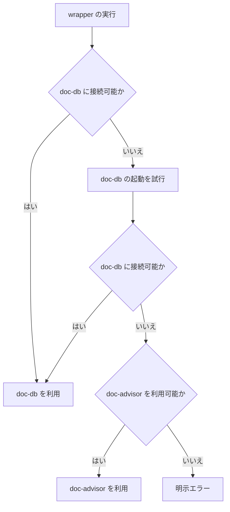

# REQ-014 doc-db バックエンド選択 要件定義書

## 概要

forge の `query-db-rules`、`query-db-specs`、`update-db-rules`、`update-db-specs` は、利用可能な文書検索バックエンドを自動選択する。
利用者は backend のセットアップ状態を意識せずに、利用可能な最良の検索・索引更新機能を利用できる。

## スコープ

### 対象

- 4 つの `query-db-*` / `update-db-*` wrapper
- doc-db の利用可否確認と未起動時の起動試行
- doc-db を利用できない場合の doc-advisor への切替
- doc-advisor ToC の鮮度確認と必要時の更新
- 実行経路と失敗理由の利用者への通知

### 対象外

- doc-db のインストール
- doc-db の常駐化
- doc-db KEY / series の管理機能
- grep による検索結果の代替

## 用語

| 用語        | 定義                                                          |
| ----------- | ------------------------------------------------------------- |
| wrapper     | forge が提供する `query-db-*` または `update-db-*` のいずれか |
| doc-db      | ローカルで稼働する文書検索バックエンド                        |
| doc-advisor | forge が従来から利用する文書検索バックエンド                  |
| ToC         | doc-advisor が検索対象文書を管理する索引                      |
| 鮮度        | ToC の更新日時から 24 時間以内である状態                      |

## 利用フロー

## 機能要件

### FNC-001 backend の自動選択

- wrapper は、doc-db に接続可能な場合、doc-db を優先して利用する。
- doc-db に接続できない場合、wrapper は doc-db の起動を試行し、起動後に再接続する。
- 起動後の再接続に成功した場合、wrapper は doc-db を利用する。
- doc-db を利用できない場合、wrapper は doc-advisor が利用可能かを確認する。
- doc-advisor を利用可能な場合、wrapper は doc-advisor を利用する。
- doc-db と doc-advisor のいずれも利用できない場合、wrapper は処理を成功として扱わず、明示エラーを返す。

### FNC-002 query の実行

- `query-db-rules` と `query-db-specs` は、選択した backend で検索を実行する。
- doc-advisor を選択した query wrapper は、検索前に対象 ToC の鮮度を確認する。
- ToC が未生成、または鮮度を満たさない場合、query wrapper は ToC 更新の完了後に検索を実行する。
- ToC が鮮度を満たす場合、query wrapper は ToC 更新を行わずに検索を実行する。
- query wrapper は grep を backend の代替として使用しない。
- query wrapper は、既存の `Required documents:` を先頭とする検索結果形式を維持する。

### FNC-003 update の実行

- `update-db-rules` と `update-db-specs` は、選択した backend で対象文書の索引を更新する。
- doc-db を選択した update wrapper は、対象文書の追加、更新、削除またはリネームを索引へ反映する。
- doc-advisor を選択した update wrapper は、対象文書の現在状態を ToC へ反映する。
- update wrapper は grep を backend の代替として使用しない。

### FNC-004 実行経路の通知

- wrapper は、doc-db の起動を試行した場合、その結果を利用者へ通知する。
- wrapper は、doc-advisor へ切り替えた場合、その理由と利用した backend を利用者へ通知する。
- wrapper は、索引更新を伴う query を実行した場合、その事実を利用者へ通知する。
- wrapper は、処理を完了できない場合、利用不能だった backend と失敗理由を利用者へ通知する。

## 業務ルール

### BL-001 backend 選択順序

- backend の選択順序は、doc-db、doc-advisor とする。
- doc-db のインストール有無だけでは利用可能と判定しない。接続または起動後の再接続に成功した場合に利用可能と判定する。
- doc-advisor は doc-db を利用できない場合にのみ選択する。

### BL-002 doc-advisor ToC の鮮度

- doc-advisor ToC の更新日時が query 実行時点から 24 時間以内の場合、その ToC は鮮度を満たす。
- ToC が存在しない場合、鮮度を満たさないものとして扱う。
- ToC が鮮度を満たさない場合、query 実行前に対応する update wrapper を完了させる。

### BL-003 成功と失敗

- backend の切替は正常な処理経路であり、利用者への通知を伴っても処理失敗ではない。
- doc-db と doc-advisor のいずれも利用できない場合、query と update は失敗とする。
- 索引更新に失敗した doc-advisor を使用して query を続行してはならない。

## 非機能要件

### NFR-001 可観測性

- backend 選択、doc-db の起動試行、doc-advisor への切替、ToC 更新の有無、および失敗は利用者が識別できる出力として提供する。
- backend の切替または索引更新の結果を隠蔽してはならない。

### NFR-002 後方互換性

- wrapper の名称と引数契約は維持する。
- doc-db を導入していない利用者は、doc-advisor が利用可能であれば従来と同じ wrapper から文書検索および索引更新を利用できる。

### NFR-003 応答性

- doc-db を利用可能な場合、wrapper は doc-advisor の更新または検索を追加で実行しない。
- doc-advisor を利用可能であり、ToC が鮮度を満たす場合、query wrapper は ToC 更新を実行しない。

### NFR-004 可用性

- backend を利用できない状態を検索または索引更新の成功として報告してはならない。
- backend の切替または再試行で処理を継続できる場合、wrapper はその経路で完了する。

### NFR-005 情報保護

- wrapper の利用者向け出力に、backend の認証情報または認証情報を含む設定値を表示してはならない。

## エラーケース

| 条件                                       | 動作                             |
| ------------------------------------------ | -------------------------------- |
| doc-db が未起動で起動後に接続できない      | doc-advisor の利用可否を確認する |
| doc-advisor が利用できない                 | 明示エラーを返す                 |
| doc-advisor ToC の更新に失敗した           | query を実行せず明示エラーを返す |
| doc-db と doc-advisor の両方を利用できない | 明示エラーを返す                 |
