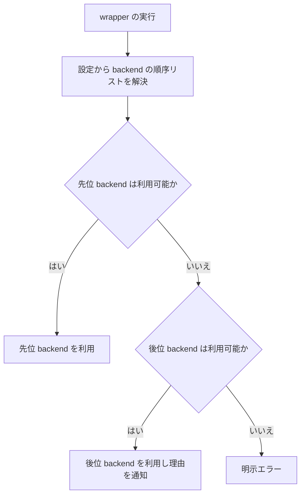

# REQ-014 doc-db バックエンド選択 要件定義書

## 概要

forge の `query-db-rules`、`query-db-specs`、`update-db-rules`、`update-db-specs` は、利用可能な文書検索バックエンドを自動選択する。
利用者は、どの backend が使えるかを意識せずに検索・索引更新を利用できる。

索引の維持は `update-db-*` の責務である。`query-db-*` は索引を書き換えない。ただし索引が未整備で検索そのものが成立しない場合に限り、利用者の承認を得て整備する。

## スコープ

### 対象

- 4 つの `query-db-*` / `update-db-*` wrapper
- 順序リストに基づく backend の選択と切替（可用性判定は各 backend が所有する）
- doc-db の利用可否確認と未起動時の起動試行（doc-db が所有する可用性判定）
- プロジェクトごとの設定による優先 backend の指定（BL-001）
- 索引が未整備で検索が成立しない場合の整備（利用者の承認を伴う）
- 当該セッションでの文書変更を契機とする索引更新の確認
- 実行経路と失敗理由の利用者への通知

### 対象外

- doc-db のインストール
- doc-db の常駐化
- doc-db KEY / series の運用管理機能（一覧・削除・移行・保持期間の制御）
- grep による検索結果の代替

未整備時の索引整備（BL-004）は FNC-003 の update と同一の同期経路を用いる。
新たな KEY / series 管理機能を設けるものではないため、上記の対象外と両立する。

## 前提条件

- 本要件が「利用可能な doc-advisor」と呼ぶのは、**検索と索引更新の機能をいずれも利用できる**状態である。
  可用性はこの 2 機能が使えるかどうかだけで決まり、バージョンでは決まらない。
- 本要件が「利用可能な doc-db」と呼ぶのは、**索引の未整備状態とゴミ箱状態を機械的に判別できる識別子を
  返す**状態である。識別子を返さない場合は後方互換の対象に含めない。

## 用語

| 用語        | 定義                                                          |
| ----------- | ------------------------------------------------------------- |
| wrapper     | forge が提供する `query-db-*` または `update-db-*` のいずれか |
| doc-db      | ローカルで稼働する文書検索バックエンド                        |
| doc-advisor | forge が従来から利用する文書検索バックエンド                  |
| ToC         | doc-advisor が検索対象文書を管理する索引                      |
| KEY         | doc-db が category ごとに管理する索引の単位                   |
| series      | doc-db が KEY 内で branch ごとに区別する索引の系列            |

## 利用フロー

順序リストは設定（優先 backend の指定）から決まり、指定がない場合は既定値（BL-001）を用いる。
**可用性判定の内容は各 backend が所有する**: doc-db は接続確認・起動試行・再接続（FNC-001）、
doc-advisor は導入有無と、検索・索引更新の機能が利用できるか（前提条件・NFR-002）で判定する。
未整備時の索引整備（BL-004）は選択の順序には影響しない。

## 機能要件

### FNC-001 backend の自動選択

- wrapper は、backend の順序リスト（BL-001）の先頭から順に可用性判定を行い、最初に利用可能と
  判定された backend を利用する。
- **可用性判定は各 backend が所有する**。選択の仕組みは判定の中身を知らず、判定の結果だけを使う。
  - doc-db の可用性判定: 接続確認を行い、接続できない場合は起動を試行して再接続する。
    接続または再接続に成功した場合に利用可能と判定する。
  - doc-advisor の可用性判定: 導入されており、かつ検索と索引更新の機能をいずれも利用できる場合に
    利用可能と判定する。
- 先位の backend を利用できない場合、wrapper は処理を失敗させず、後位の backend の可用性を確認して利用する。
  優先指定は順序の変更であり、他方の backend の利用を禁止するものではない。
- 順序リストのいずれの backend も利用できない場合、wrapper は処理を成功として扱わず、明示エラーを返す。
- 利用者は、プロジェクトごとの設定で優先する backend を指定できる。指定がある場合の選択順序は BL-001 に従う。
- ここでの「利用できない」は、**選択前の可用性判定**の失敗に限る。
  backend を選択した後の検索・同期・索引更新の失敗は障害であり（BL-003 / BL-004）、残る backend へ切り替えない。

### FNC-002 query の実行

- `query-db-rules` と `query-db-specs` は、選択した backend で検索を実行する。
- **query wrapper は索引を書き換えない。** 索引の維持は `update-db-*`（FNC-003）の責務である。
- 当該セッションで検索対象 category の文書を変更した場合、query wrapper は検索の前に索引更新の要否を
  利用者へ確認する（BL-002）。利用者が更新を選んだ場合は該当する `update-db-*` を用いる。
- 索引が未整備で検索そのものが成立しない場合、query wrapper は利用者の承認を得て索引を整備し、
  完了後に検索を実行する（BL-004）。**整備は自ら行わず、選択済みの backend を指定して
  該当する update wrapper（FNC-003）に行わせる。** 索引を整備する経路を 2 つ持たない。
- query wrapper は、検索結果に現在の作業ツリーに存在しない文書のパスを含めない。
- query wrapper は grep を backend の代替として使用しない。backend の索引に基づかない結果を返すと、
  利用者は検索の網羅性を誤認する。
- query wrapper は、既存の `Required documents:` を先頭とする検索結果形式を維持する。

### FNC-003 update の実行

- `update-db-rules` と `update-db-specs` は、選択した backend で対象文書の索引を更新する。
- doc-db を選択した update wrapper は、対象文書の追加、更新、削除またはリネームを索引へ反映する。
- doc-advisor を選択した update wrapper は、対象文書の現在状態を ToC へ反映する。
- update wrapper は grep を backend の代替として使用しない。
- **update wrapper は backend の指定を受け付ける。** 指定がある場合は選択（FNC-001）を行わず、
  指定された backend で更新する。指定された backend を利用できない場合は**他方へ切り替えず明示エラーとする**
  （BL-006）。指定がない場合は従来どおり FNC-001 の選択に従う。

### FNC-004 実行経路の通知

- wrapper は、doc-db の起動を試行した場合、その結果を利用者へ通知する。
- wrapper は、先位の backend を利用できず後位の backend を利用した場合、その理由と利用した backend を利用者へ通知する。
- wrapper は、設定で指定された優先 backend を利用できず後位の backend を利用した場合、指定が満たされなかったことと
  その理由を利用者へ通知する。
- query wrapper は、索引の整備を伴う検索を実行した場合、その事実と対象 backend を利用者へ通知する。
- query wrapper は、当該セッションでの文書変更を理由に索引更新の確認を行った場合、その結果（更新した / しなかった）を利用者へ伝える。
- query wrapper は、実在しないパスを検索結果から除外した場合、その件数を利用者へ通知する。
- wrapper は、処理を完了できない場合、利用不能だった backend と失敗理由を利用者へ通知する。

## 業務ルール

### BL-001 backend 選択順序

- 選択順序は順序リストとして扱う。順序リストは設定の優先 backend 指定から決まり、
  指定は「指定された backend を先頭とする順序」を意味する。
- **既定値（指定がない場合の順序）は、doc-advisor、doc-db とする。** 既定値の規定は本項の
  この 1 箇所のみとし、他の要件・図・表は「先位 / 後位」の抽象で記述する
  （既定値の変更が本項 1 箇所の変更で済む状態を保つ）。
- 優先 backend の指定が変更するのは選択順序だけである。各 backend が所有する可用性判定の規則と、
  選択後の処理（索引整備、通知、失敗の扱い）は指定の有無で変わらない。
- 先位の backend を利用できない場合に後位の backend へ切り替えることは、BL-003 のとおり正常な処理経路である。
  切替の事由になるのは選択前の可用性判定の失敗だけであり、選択後の操作失敗は指定の有無にかかわらず
  障害として扱う（切替の理由にならない）。
- doc-db のインストール有無だけでは利用可能と判定しない。接続または起動後の再接続に成功した場合に利用可能と判定する。
- 後位の backend は、先位の backend を利用できない場合にのみ選択する。
- 設定が不正で順序リストを解決できない場合は、既定値へ黙って落ちず明示エラーとする。
  読めない設定を無視して動き続けると、利用者が意図した順序と異なる挙動で静かに動くためである。

### BL-002 索引の鮮度

- 索引が古いと、検索はエラーにならず該当文書を**取りこぼす**。この欠落は利用者から見えない。
- 検索は索引を書き換えて鮮度を回復させない。書き換えは古かった事実を消し、
  利用者が索引の更新漏れに気づく機会を奪うためである。
- **鮮度を推測で判定しない。** 索引の正しさは対象文書が変わったかどうかで決まり、前回生成からの
  経過時間では決まらない。経過時間を指標にすると、文書が変わっていないのに更新を促し、変わっているのに
  更新を省く二方向の誤りが生じる。wrapper は索引の内部配置・生成日時を直接解釈しない。
- **当該セッションで対象文書を変更した事実がある場合に限り、検索の前に索引更新の要否を利用者へ確認する。**
  これは推測ではなく、変更を行った当人が持つ確定した事実である。利用者が更新を選んだ場合は、
  索引更新の単一の入口（FNC-003）を用いる。
- この確認が拾えるのは当該セッション内の変更に限られる。他セッションでの変更、利用者による直接編集、
  ブランチ切替や pull による変更は検出できない。**確認が行われなかったことは索引が最新であることを意味しない。**

### BL-003 成功と失敗

- backend の切替は正常な処理経路であり、利用者への通知を伴っても処理失敗ではない。
- doc-db と doc-advisor のいずれも利用できない場合、query と update は失敗とする。
- 未整備の索引の整備に失敗した backend を使用して query を続行してはならない。

### BL-004 未整備と障害の区別

- doc-db に当該 KEY または当該 series の索引が存在しない状態は、doc-db の障害ではなく **未整備** として扱う。
- 未整備は解消してから使う。ただし**整備の着手前に利用者の承認を得る**。索引の整備は対象文書数に比例して
  時間がかかり、規模によっては利用者の作業を長時間停止させるためである。**承認以外に wrapper へ課す義務は
  無い**（規模・所要時間・件数の提示を求めない）。
- 承認が得られない場合は検索を行わず、未整備である事実を報告して終了する。これは利用者の意思による
  中断であり、処理の失敗として扱わない。
- 未整備を理由に他方の backend へ切り替えてはならない。未整備は選択順序（BL-001）を動かす事由ではなく、
  索引を整備すれば当該 backend を利用できる状態になるためである。
- 未整備を理由に、**wrapper の判断で**処理を失敗させてはならない。未整備は解消可能な状態であり、
  障害ではないためである。
- 対象文書が 0 件の場合は未整備として扱わない。索引を整備せず「対象文書なし」として報告する。
  **query では検索の成功として終了し、update では明示エラーとする。** update は利用者が索引の整備そのものを
  要求した操作であり、整備すべき対象が無いことは要求を満たせなかったことを意味する。query は検索の要求であり、
  対象が無いという結果は正しい応答である。
- **0 件の判定を行えるのは、対象文書一覧を forge が所有する backend に限る**（BL-007）。所有しない backend では
  forge が 0 件を判定できないため、この扱いを適用しない。判定できないことを推定で埋めてはならない。
- 未整備と、索引が復活操作を要する状態（ゴミ箱状態）の区別は、doc-db が返す機械可読な識別子で行う。
  失敗の文言で区別してはならない。文言は doc-db 側の公開契約ではなく、変更が forge へ通知されないため、
  誤判別が検出できない形で起きる。
- 復活操作を要する状態は未整備として扱わない。索引を作成せず、復活が必要である旨を利用者へ通知する。
- 接続確立後の検索・同期の失敗、および応答の不正は **障害** として扱い、他方の backend へ切り替えず明示エラーとする。
  索引の作成に失敗した場合、および識別子から状態を判別できない場合も障害として扱う。
- 障害を未整備として扱ってはならない。backend 側の問題を切替で隠蔽することになるためである。

### BL-005 検索対象の series と結果のパス

- doc-db の検索は現在の branch を series として指定する。他の series を検索対象に含めない。
  索引は対象文書の現在の状態を映すもの（FNC-003）であり、他 branch で削除済み・改訂前の文書を
  検索結果へ復活させてはならない。
- series を限定しない検索には、他 branch にのみ存在する文書に加え、**同期で当該 series から切り離された
  削除済み文書が、索引側の物理削除が済むまで混入し得る**。series の指定はこれを避けるためでもある。
- series を指定した検索が 0 件だった場合、series を外した再検索を行ってはならない。
  当該 series はその branch の完全な現在状態であり、0 件は正しい結果である。
- 検索する series と同期する series は同一である。読み書きで対象を変えない。
- 当該 series の索引が未生成の場合は BL-004 に従う（承認を得て整備し、完了後に検索する）。
  series を限定した結果が空になることを、検索対象を広げる理由にしてはならない。
- 検索結果に含めるのは、現在の作業ツリーに実在する文書のパスに限る。索引は最後の同期時点の状態であり、
  同期後に削除された文書が索引に残るため、実在しないパスは結果から除外する。
- 除外はパスの実在確認だけで行い、検索の失敗として扱わない。

### BL-006 backend の指定（選択との違い）

- **優先指定（BL-001）は順序を変えるだけで、利用不能なら後位へ切り替える。backend の指定はこれと別物であり、
  切替を伴わない。** 指定された backend が利用できない場合、他方へ切り替えず明示エラーとする。
- 指定を使うのは、**呼び出し元が既に backend を確定させており、その同一の backend に対して操作させたい場合**に限る。
  切り替えが起きると、確定済みの backend とは別の索引を整備することになり、呼び出し元の後続処理が
  意図した索引を見ないためである。
- 指定は利用者向けの機能ではなく、wrapper 間の受け渡しのための入力である。

### BL-007 索引母集団の所有

- **索引される文書の集合を誰が決めるかは backend ごとに異なる。** forge が決める backend と、
  forge が範囲だけを渡して backend 側が決める backend の両方がある。
- **母集団を所有しない backend について、forge はその件数を自前に数えて利用者へ提示したり、
  処理の分岐条件に使ったりしてはならない。** forge の数えた値は backend が索引する件数と一致する保証を持たず、
  一致しない向き（過大・過小のどちら）も backend 側の規則次第で変わる。上限として扱えるという想定も、
  backend の除外規則が減算のみであることを前提とするため成立しない。
- 母集団を所有しない backend の件数が必要な場合は、**backend 自身が返す値を使う**。返す手段が無い場合は、
  件数に依存しない設計にする。推定値で代替してはならない。
- この規則は件数だけでなく、母集団の内容（どの文書が索引されるか）についても同じに適用する。

## 非機能要件

### NFR-001 可観測性

- backend 選択、doc-db の起動試行、後位 backend への切替、索引の整備の有無、セッション内変更を契機とする
  索引更新の確認結果、および失敗は利用者が識別できる出力として提供する。
- backend の切替または索引の整備の結果を隠蔽してはならない。
- 完了までに時間を要する索引の整備では、その進行状況を利用者が識別できる出力として提供する。
  進行状況を利用者に届かない経路（wrapper 内部プロセスの標準エラー出力等）だけに出力してはならない。

### NFR-002 後方互換性

- wrapper の名称と引数契約は維持する。
- doc-db を導入していない利用者は、doc-advisor が利用可能であれば従来と同じ wrapper から文書検索および索引更新を利用できる。
- ここでの「利用可能な doc-advisor」は前提条件のとおり、検索と索引更新の機能をいずれも利用できる状態を指す。
  いずれかを利用できない場合は後方互換の対象とせず、導入状態の確認が必要であることを利用者へ通知する。

### NFR-003 応答性

- wrapper は、選択しなかった backend の更新または検索を追加で実行しない。

### NFR-004 可用性

- backend を利用できない状態を検索または索引更新の成功として報告してはならない。
- backend の切替または再試行で処理を継続できる場合、wrapper はその経路で完了する。

### NFR-005 情報保護

- wrapper の利用者向け出力に、backend の認証情報または認証情報を含む設定値を表示してはならない。

## エラーケース

| 条件                                                                             | 動作                                                                                                           |
| -------------------------------------------------------------------------------- | -------------------------------------------------------------------------------------------------------------- |
| 先位の backend が可用性判定で利用できない                                        | 後位の backend の利用可否を確認し、切替の理由を通知して継続する                                                |
| 設定で指定された優先 backend が可用性判定で利用できない                          | 後位の backend の利用可否を確認し、指定が満たされなかったことと理由を通知して継続する                          |
| 設定が不正で順序リストを解決できない                                             | 既定値へ落ちず明示エラーを返す                                                                                 |
| 対象文書が 0 件（query）                                                         | 索引を作成せず「対象文書なし」として報告し、検索を成功として終了する                                           |
| 対象文書が 0 件（update）                                                        | 索引を作成せず明示エラーを返す（整備すべき対象が無いことを失敗として返す）                                     |
| 索引が未整備（doc-db の KEY 未生成 / series 未同期 / doc-advisor の ToC 未生成） | 長時間を要しうる旨を伝えて承認を求め、承認された場合に整備して検索を実行する                                   |
| 索引の整備を利用者が見送った                                                     | 検索を行わず、未整備である事実を報告して終了する。失敗として扱わない                                           |
| 指定された backend を利用できない（BL-006）                                      | 他方へ切り替えず明示エラーを返す                                                                               |
| 当該セッションで対象 category の文書を変更した                                   | 検索の前に索引更新の要否を確認する。更新を選んだ場合は `update-db-*` を用いる                                  |
| 索引が古い可能性があるが、当該セッションでの変更ではない                         | 検出手段を持たないため確認しない。索引を書き換えず検索を実行する                                               |
| doc-db の当該 KEY が復活待ち状態                                                 | 未整備として扱わず、復活操作の案内を伴う明示エラーを返す                                                       |
| doc-db の索引作成に失敗した                                                      | 障害として明示エラーを返す。他方の backend へ切り替えない                                                      |
| doc-db 接続後の検索または同期が失敗した                                          | 障害として明示エラーを返す。他方の backend へ切り替えない                                                      |
| 検索結果に実在しないパスが含まれた                                               | 該当パスを除外し件数を通知する。検索は成功として扱う                                                           |
| doc-advisor が可用性判定で利用できない                                           | 先頭行の共通ケースに従い、残る backend の利用可否を確認する。残る backend も利用できない場合は明示エラーを返す |
| doc-advisor の検索または索引更新の機能が利用できない                             | 導入状態の確認が必要である旨を通知したうえで利用不能として扱い、残る backend の利用可否を確認する              |
| 未整備の索引の整備に失敗した（選択後の失敗）                                     | 障害として query を実行せず明示エラーを返す。他方の backend へ切り替えない                                     |
| doc-db と doc-advisor の両方を利用できない                                       | 明示エラーを返す                                                                                               |

## 未確定事項

現時点で未確定事項はない。
