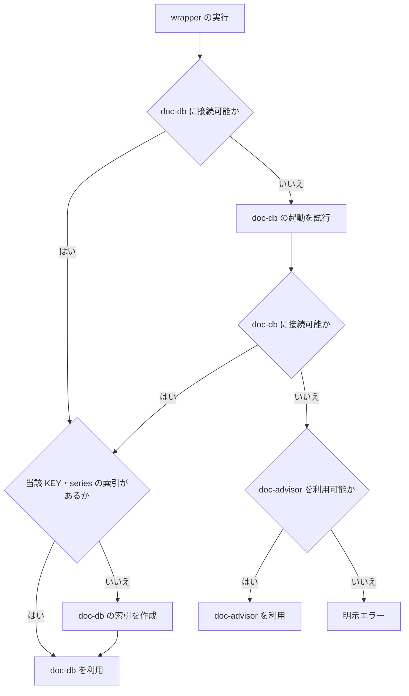

# REQ-014 doc-db バックエンド選択 要件定義書

## 概要

forge の `query-db-rules`、`query-db-specs`、`update-db-rules`、`update-db-specs` は、利用可能な文書検索バックエンドを自動選択する。
利用者は backend のセットアップ状態を意識せずに、利用可能な最良の検索・索引更新機能を利用できる。

## スコープ

### 対象

- 4 つの `query-db-*` / `update-db-*` wrapper
- doc-db の利用可否確認と未起動時の起動試行
- doc-db を利用できない場合の doc-advisor への切替
- query 実行前の索引整備（doc-db の KEY 未生成時の作成、doc-advisor ToC の鮮度確認と必要時の更新）
- 実行経路と失敗理由の利用者への通知

### 対象外

- doc-db のインストール
- doc-db の常駐化
- doc-db KEY / series の運用管理機能（一覧・削除・移行・保持期間の制御）
- grep による検索結果の代替

query 実行前の索引作成（BL-004）は FNC-003 の update と同一の同期経路を用いる。
新たな KEY / series 管理機能を設けるものではないため、上記の対象外と両立する。

## 前提条件

- 本要件が「利用可能な doc-advisor」と呼ぶのは、ToC の鮮度確認機能を備えた DocAdvisor の最小対応バージョン以降である。
  鮮度確認機能を持たない版は後方互換の対象に含めない。
- 最小対応バージョンの値は **DocAdvisor 0.4.6**（鮮度確認機能を含む最初の版）とし、forge の導入案内に記載する。
- wrapper の実行時の可用性判定はバージョン番号ではなく、鮮度確認機能が利用可能かどうかで行う。
  バージョンの値は導入案内、および実装・テストが対象とする確定仕様の基準としてのみ用いる。
- 本要件が「利用可能な doc-db」と呼ぶのは、索引の未整備状態とゴミ箱状態を機械的に判別できる
  識別子を返す最小対応バージョン以降である。識別子を返さない版は後方互換の対象に含めない。
- 最小対応バージョンの値は **doc-db 0.3.3**（当該識別子を含む最初の版）とし、forge の導入案内に記載する。
- doc-db 側についても、実行時の可用性判定はバージョン番号の比較では行わない。識別子を読み取れない
  場合は判別不能な失敗として扱い、索引の作成を試みない（BL-004）。

## 用語

| 用語        | 定義                                                          |
| ----------- | ------------------------------------------------------------- |
| wrapper     | forge が提供する `query-db-*` または `update-db-*` のいずれか |
| doc-db      | ローカルで稼働する文書検索バックエンド                        |
| doc-advisor | forge が従来から利用する文書検索バックエンド                  |
| ToC         | doc-advisor が検索対象文書を管理する索引                      |
| 鮮度        | ToC の更新日時から 24 時間以内である状態                      |
| KEY         | doc-db が category ごとに管理する索引の単位                   |
| series      | doc-db が KEY 内で branch ごとに区別する索引の系列            |

## 利用フロー

## 機能要件

### FNC-001 backend の自動選択

- wrapper は、doc-db に接続可能な場合、doc-db を優先して利用する。
- doc-db に接続できない場合、wrapper は doc-db の起動を試行し、起動後に再接続する。
- 起動後の再接続に成功した場合、wrapper は doc-db を利用する。
- doc-db を利用できない場合、wrapper は doc-advisor が利用可能かを確認する。
- doc-advisor を利用可能な場合、wrapper は doc-advisor を利用する。
- doc-db と doc-advisor のいずれも利用できない場合、wrapper は処理を成功として扱わず、明示エラーを返す。

### FNC-002 query の実行

- `query-db-rules` と `query-db-specs` は、選択した backend で検索を実行する。
- doc-advisor を選択した query wrapper は、検索前に doc-advisor の鮮度確認機能で対象 ToC の鮮度を確認する。
- ToC が未生成、または鮮度を満たさない場合、query wrapper は対象 ToC の索引更新完了後に検索を実行する。
- ToC が鮮度を満たす場合、query wrapper は ToC 更新を行わずに検索を実行する。
- doc-db を選択した query wrapper は、現在の branch を series として指定して検索する（BL-005）。
- doc-db に当該 KEY または当該 series の索引が未生成の場合、query wrapper は索引を作成し、完了後に検索を実行する（BL-004）。
- query wrapper は、検索結果に現在の作業ツリーに存在しない文書のパスを含めない。
- query wrapper は grep を backend の代替として使用しない。
- query wrapper は、既存の `Required documents:` を先頭とする検索結果形式を維持する。

### FNC-003 update の実行

- `update-db-rules` と `update-db-specs` は、選択した backend で対象文書の索引を更新する。
- doc-db を選択した update wrapper は、対象文書の追加、更新、削除またはリネームを索引へ反映する。
- doc-advisor を選択した update wrapper は、対象文書の現在状態を ToC へ反映する。
- update wrapper は grep を backend の代替として使用しない。

### FNC-004 実行経路の通知

- wrapper は、doc-db の起動を試行した場合、その結果を利用者へ通知する。
- wrapper は、doc-advisor へ切り替えた場合、その理由と利用した backend を利用者へ通知する。
- wrapper は、索引の作成または更新を伴う query を実行した場合、その事実と対象 backend を利用者へ通知する。
- query wrapper は、実在しないパスを検索結果から除外した場合、その件数を利用者へ通知する。
- wrapper は、処理を完了できない場合、利用不能だった backend と失敗理由を利用者へ通知する。

## 業務ルール

### BL-001 backend 選択順序

- backend の選択順序は、doc-db、doc-advisor とする。
- doc-db のインストール有無だけでは利用可能と判定しない。接続または起動後の再接続に成功した場合に利用可能と判定する。
- doc-advisor は doc-db を利用できない場合にのみ選択する。

### BL-002 doc-advisor ToC の鮮度

- doc-advisor ToC の更新日時が query 実行時点から 24 時間以内の場合、その ToC は鮮度を満たす。
- ToC が存在しない場合、鮮度を満たさないものとして扱う。
- 鮮度の判定結果は doc-advisor の鮮度確認機能から取得する。wrapper が ToC の内部配置を直接解釈してはならない。
- ToC が鮮度を満たさない場合、query 実行前に対象 ToC の索引更新を完了させる。

### BL-003 成功と失敗

- backend の切替は正常な処理経路であり、利用者への通知を伴っても処理失敗ではない。
- doc-db と doc-advisor のいずれも利用できない場合、query と update は失敗とする。
- 索引更新に失敗した doc-advisor を使用して query を続行してはならない。

### BL-004 未整備と障害の区別

- doc-db に当該 KEY または当該 series の索引が存在しない状態は、doc-db の障害ではなく **未整備** として扱う。
- 未整備は解消してから使う。query 実行前に当該 KEY / series の索引を作成し、完了後に検索を実行する。
  これは doc-advisor 経路で ToC が未生成のときに索引更新を完了させてから検索する規定（FNC-002）と同一の方針である。
- 未整備を理由に doc-advisor へ切り替えてはならない。backend の選択順序（BL-001）は doc-db が優先であり、
  索引を作成すれば doc-db を利用できる状態になるためである。
- 未整備を理由に処理を失敗させてはならない。利用者に backend のセットアップ状態を意識させないためである。
- 対象文書が 0 件の場合は未整備として扱わない。索引を作成せず「対象文書なし」として報告する。
  索引側の状態からは「一度も同期していない」と「同期済みだが対象が 0 件だった」を区別できないため、
  対象文書数の判定を索引側の状態確認より先に行う。
- 未整備と、索引が復活操作を要する状態（ゴミ箱状態）の区別は、doc-db が返す機械可読な識別子で行う。
  失敗の文言で区別してはならない。文言は doc-db 側の公開契約ではなく、変更が forge へ通知されないため、
  誤判別が検出できない形で起きる。
- 復活操作を要する状態は未整備として扱わない。索引を作成せず、復活が必要である旨を利用者へ通知する。
- 接続確立後の検索・同期の失敗、および応答の不正は **障害** として扱い、doc-advisor へ切り替えず明示エラーとする。
  索引の作成に失敗した場合、および識別子から状態を判別できない場合も障害として扱う。
- 障害を未整備として扱ってはならない。backend 側の問題を切替で隠蔽することになるためである。

### BL-005 検索対象の series と結果のパス

- doc-db の検索は現在の branch を series として指定する。他の series を検索対象に含めない。
  索引は対象文書の現在の状態を映すもの（FNC-003）であり、他 branch で削除済み・改訂前の文書を
  検索結果へ復活させてはならない。
- series を限定しない検索には、他 branch にのみ存在する文書に加え、**同期で当該 series から切り離された
  削除済み文書が、索引側の物理削除が済むまで混入し得る**。series の指定はこれを避けるためでもある。
- series を指定した検索が 0 件だった場合、series を外した再検索を行ってはならない。
  当該 series はその branch の完全な現在状態であり、0 件は正しい結果である。
- 検索する series と同期する series は同一である。読み書きで対象を変えない。
- 当該 series の索引が未生成の場合は BL-004 に従って索引を作成し、完了後に検索する。
  series を限定した結果が空になることを、検索対象を広げる理由にしてはならない。
- 検索結果に含めるのは、現在の作業ツリーに実在する文書のパスに限る。索引は最後の同期時点の状態であり、
  同期後に削除された文書が索引に残るため、実在しないパスは結果から除外する。
- 除外はパスの実在確認だけで行い、検索の失敗として扱わない。

## 非機能要件

### NFR-001 可観測性

- backend 選択、doc-db の起動試行、doc-advisor への切替、索引の作成・更新の有無、および失敗は利用者が識別できる出力として提供する。
- backend の切替または索引更新の結果を隠蔽してはならない。
- 完了までに時間を要する索引の作成・更新では、その進行状況を利用者が識別できる出力として提供する。
  進行状況を利用者に届かない経路（wrapper 内部プロセスの標準エラー出力等）だけに出力してはならない。

### NFR-002 後方互換性

- wrapper の名称と引数契約は維持する。
- doc-db を導入していない利用者は、doc-advisor が利用可能であれば従来と同じ wrapper から文書検索および索引更新を利用できる。
- ここでの「利用可能な doc-advisor」は前提条件に定める最小対応バージョン以降を指す。
  それ未満の doc-advisor が導入されている場合は後方互換の対象とせず、更新が必要であることを利用者へ通知する。

### NFR-003 応答性

- doc-db を利用可能な場合、wrapper は doc-advisor の更新または検索を追加で実行しない。
- doc-advisor を利用可能であり、ToC が鮮度を満たす場合、query wrapper は ToC 更新を実行しない。

### NFR-004 可用性

- backend を利用できない状態を検索または索引更新の成功として報告してはならない。
- backend の切替または再試行で処理を継続できる場合、wrapper はその経路で完了する。

### NFR-005 情報保護

- wrapper の利用者向け出力に、backend の認証情報または認証情報を含む設定値を表示してはならない。

## エラーケース

| 条件                                       | 動作                                                     |
| ------------------------------------------ | -------------------------------------------------------- |
| doc-db が未起動で起動後に接続できない      | doc-advisor の利用可否を確認する                         |
| 対象文書が 0 件                            | 索引を作成せず「対象文書なし」として報告する             |
| doc-db に当該 KEY の索引が未生成           | 索引を作成し、完了後に検索を実行する                     |
| doc-db の当該 series が未同期              | 当該 series を同期し、完了後に検索を実行する             |
| doc-db の当該 KEY が復活待ち状態           | 未整備として扱わず、復活操作の案内を伴う明示エラーを返す |
| doc-db の索引作成に失敗した                | 障害として明示エラーを返す。doc-advisor へ切り替えない   |
| doc-db 接続後の検索または同期が失敗した    | 障害として明示エラーを返す。doc-advisor へ切り替えない   |
| 検索結果に実在しないパスが含まれた         | 該当パスを除外し件数を通知する。検索は成功として扱う     |
| doc-advisor が利用できない                 | 明示エラーを返す                                         |
| doc-advisor が最小対応バージョン未満       | 更新が必要である旨を通知し明示エラーを返す               |
| doc-advisor ToC の更新に失敗した           | query を実行せず明示エラーを返す                         |
| doc-db と doc-advisor の両方を利用できない | 明示エラーを返す                                         |

## 未確定事項

現時点で未確定事項はない。最小対応 DocAdvisor バージョン（旧 TBD-001）は前提条件に 0.4.6 として確定した。
