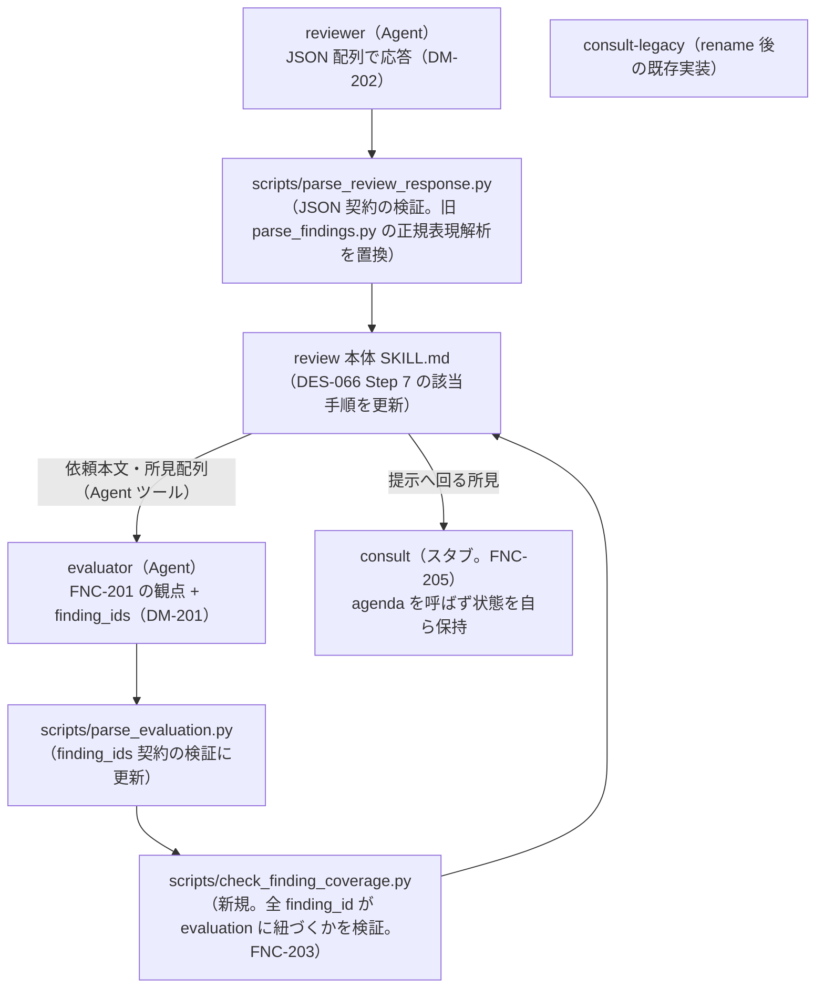
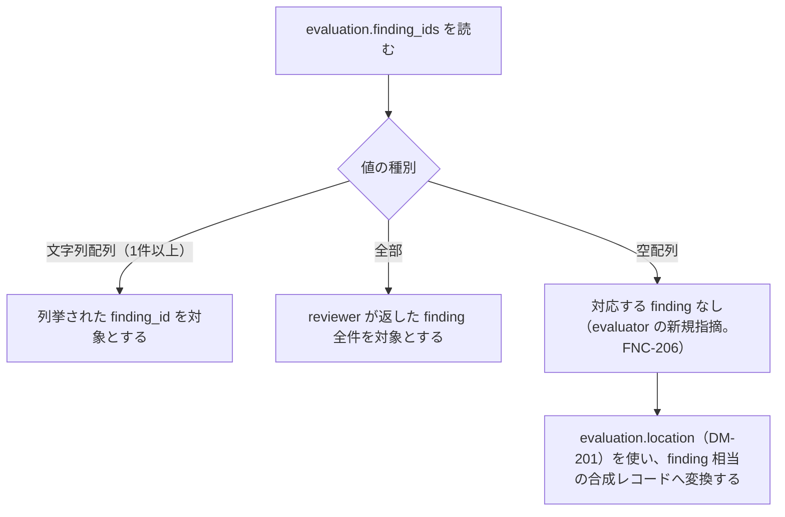
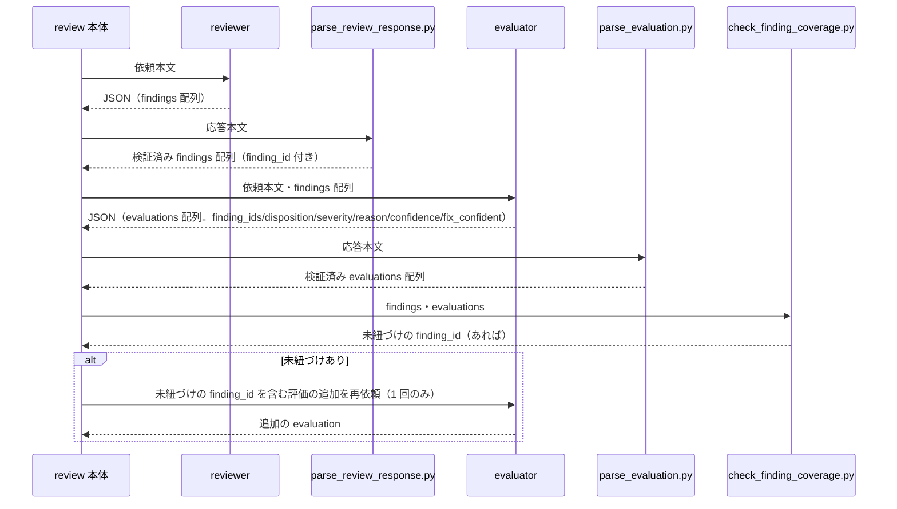

# DES-083 evaluator の独立評価と観点 設計書

## 1. 概要

[REQ-026](../requirements/REQ-026_evaluator_perspective.md) が定める要件を実現する。要点は 2 つ。

1. reviewer の応答契約を自由記述 markdown から JSON へ移行し（FNC-202/DM-202）、evaluator の判定を finding と 1 対 1 対応から解放する（FNC-203/DM-201）
2. evaluator に、指摘の奥にある本質・対象情報を疑う態度（FNC-201）と、reviewer の見落としを新規に指摘する経路（FNC-206）を持たせる

対象は [DES-066](../../forge/design/DES-066_review_body_design.md) が定める review 本体の一部（reviewer との書式契約・evaluator との入出力・結合ロジック）。DES-066 自体は書き換えず、本設計書が置き換える箇所を「6. 既存設計の置き換え」に列挙する。

consult の一時的な振る舞い（[REQ-026](../requirements/REQ-026_evaluator_perspective.md) FNC-205）も対象に含む。[DES-078](../../consult/design/DES-078_consult_dialogue_flow_design.md) が定める agenda 連携部分は本 feature の実装期間中スコープ外であり、本設計書はその期間の consult の代替動作のみを定める。

## 2. アーキテクチャ概要

reviewer→evaluator→本体という主経路は [DES-066](../../forge/design/DES-066_review_body_design.md) §2 のアーキテクチャを維持する。変わるのは各矢印が運ぶデータの契約と、それを検証するスクリプトである。

## 3. モジュール設計

### 3.1 モジュール一覧

| モジュール                                                    | 責務                                                                                                                                                                                                                                                                                                                                                                                         | 依存                                                     |
| ------------------------------------------------------------- | -------------------------------------------------------------------------------------------------------------------------------------------------------------------------------------------------------------------------------------------------------------------------------------------------------------------------------------------------------------------------------------------- | -------------------------------------------------------- |
| `plugins/forge/agents/reviewer.md`                            | 所見を JSON 配列で返す（DM-202）。禁止事項・read-only 制約は現行のまま変更しない                                                                                                                                                                                                                                                                                                             | なし                                                     |
| `scripts/review/parse_review_response.py`                     | reviewer の JSON 応答を検証し、`findings` 配列を返す（新規。旧 `parse_findings.py` の正規表現解析を置換）                                                                                                                                                                                                                                                                                    | なし                                                     |
| `plugins/forge/agents/evaluator.md`                           | FNC-201 の観点を判定手順に追加。`disposition` に `flawed_premise` を追加。`evaluation` を `finding_ids`（DM-201）で返す                                                                                                                                                                                                                                                                      | `parse_review_response.py` の出力形式                    |
| `scripts/review/parse_evaluation.py`                          | evaluator の JSON 応答を検証（`finding_ids` の型・`disposition`/`severity`/`confidence`/`fix_confident` の値域）。件数一致検証を撤去                                                                                                                                                                                                                                                         | なし                                                     |
| `scripts/review/check_finding_coverage.py`                    | 全 `finding_id` がいずれかの `evaluation.finding_ids` に含まれる（または「全部」で覆われる）ことを検証する（新規。FNC-203）。あわせて `finding_ids: []` の evaluation（FNC-206 の新規指摘）を、DM-201 の `location` を使って finding 相当の合成レコード（DM-202 と同じ形。`finding_id` は合成であることが分かる採番とする）へ変換し、以降の finding ベースのパイプラインへ載せられる形にする | `parse_review_response.py`・`parse_evaluation.py` の出力 |
| `plugins/forge/skills/review/SKILL.md`                        | Step 7 の該当手順（evaluator への依頼組み立て・結合ロジックの呼び出し先）を更新                                                                                                                                                                                                                                                                                                              | 上記スクリプト群                                         |
| `plugins/forge/skills/consult/`（rename 後 `consult-legacy`） | 既存の agenda 連携実装。本 feature 期間中は呼び出されない                                                                                                                                                                                                                                                                                                                                    | agenda（呼ばない）                                       |
| `plugins/forge/skills/consult/`（新規スタブ）                 | 所見の一覧・残件・採否を自ら保持し、1 件ずつ提示する。agenda を呼ばない（FNC-205）                                                                                                                                                                                                                                                                                                           | なし（永続化しない）                                     |

`combine_findings_and_evaluations.py`（[DES-066](../../forge/design/DES-066_review_body_design.md) §3.10a）は `index` の 1 対 1 対応を前提にしており、`finding_ids`（一部/全部/空）を扱えない。本設計はこれを `check_finding_coverage.py` へ置き換える（「6. 既存設計の置き換え」参照）。

### 3.2 finding_ids の解釈フロー

`check_finding_coverage.py` は、全 reviewer finding の `finding_id` が、いずれかの evaluation で（C または D の形で）参照されているかを検証する。参照されていない `finding_id` があれば、evaluator へ 1 回だけ再依頼する（FNC-203）。再依頼の宛先が evaluator である理由: 未紐づけは evaluator 側の評価漏れの兆候であり、reviewer は `disposition` を判定する立場にない。evaluator は review 本体が直接 Agent ツールで起動する独立した実行系であるため、reviewer バックエンドの `retains_context`（[DES-066](../../forge/design/DES-066_review_body_design.md) §3.9）とは無関係に、常に再依頼できる。

**E（空配列＝新規指摘）の扱い**: この evaluation は対応する finding 実体を持たないため、そのままでは `split_by_location.py` 以降の finding ベースのパイプライン（位置による振り分け §3.7・consult への `items[]` 引き渡し）に載らない。`check_finding_coverage.py` は、この evaluation を DM-201 の `location`（FNC-206 により必須）を使って finding 相当の合成レコード（DM-202 と同じ形）へ変換してから後段へ渡す。合成であることは `finding_id` の採番規則（reviewer 由来の番号と衝突しない接頭辞等）で判別できるようにする（具体的な採番方式は実装の責務）。

## 4. ユースケース設計

### 4.1 ユースケース一覧

| ユースケース                             | 説明                                                                                                                      |
| ---------------------------------------- | ------------------------------------------------------------------------------------------------------------------------- |
| reviewer が JSON で所見を返す            | DM-202 の形で `findings` 配列（空配列可）を返す                                                                           |
| evaluator が観点を働かせて判定する       | FNC-201 の手がかりを考慮しつつ `disposition`／`finding_ids` を返す                                                        |
| evaluator が見落としを新規に指摘する     | `finding_ids: []` の evaluation を追加する（FNC-206）                                                                     |
| 全 finding_id の紐づけを検証する         | `check_finding_coverage.py` が未紐づけを検出し、evaluator へ 1 回だけ再依頼する。再依頼後もなお紐づかなければそのまま残す |
| flawed_premise を自動修正しない          | `--auto` でも常に提示して採否を得る（FNC-204）                                                                            |
| consult が agenda を呼ばず状態を保持する | 本 feature 期間中、consult スタブが所見の一覧・残件・採否を自ら保持する（FNC-205）                                        |

### 4.2 シーケンス図（reviewer 応答から evaluation 結合まで）

**前提条件**: reviewer が JSON 契約に従って応答していること。
**正常フロー**: 上記シーケンスのとおり。
**エラーフロー**: JSON 契約違反（`parse_review_response.py`/`parse_evaluation.py` の検証失敗）は既存の `failure`/`halted_with_open_findings` 終端経路（[DES-066](../../forge/design/DES-066_review_body_design.md) §3.2・§3.3）へ合流する。本設計はこの終端処理自体を変更しない。

## 5. 使用する既存コンポーネント

| コンポーネント                                                                    | ファイルパス                                               | 用途                                                                                                                                                                                                           |
| --------------------------------------------------------------------------------- | ---------------------------------------------------------- | -------------------------------------------------------------------------------------------------------------------------------------------------------------------------------------------------------------- |
| review 本体の終端処理・介入軸・段階的提示                                         | `plugins/forge/skills/review/SKILL.md`                     | 変更しない。本設計は Step 7 の evaluator 委譲・結合手順のみ更新する                                                                                                                                            |
| `split_by_location.py`                                                            | `plugins/forge/skills/review/scripts/split_by_location.py` | 変更しない。FNC-206 の新規指摘は `check_finding_coverage.py` が finding 相当の合成レコードへ変換してから渡すため、`split_by_location.py` 自身は finding の location 有無だけを見る既存の入出力契約のまま扱える |
| `verify_fix_safety.py`・`capture_syntax_baseline.py`・`collect_modified_files.py` | 同上ディレクトリ                                           | 変更しない                                                                                                                                                                                                     |
| バックエンド SKILL（`agent-review`/`msg-review`）                                 | `plugins/forge/skills/{agent-review,msg-review}/`          | 変更しない。所見の書式契約（自由記述→JSON）は依頼テンプレートの返信形式契約セクションが変わるだけで、バックエンドの往復プロトコル自体には影響しない                                                            |

再利用しない判断: `parse_findings.py`（`plugins/forge/scripts/review/`）の正規表現ベースの抽出ロジックは、JSON 化後は不要になるため再利用しない（[REQ-026](../requirements/REQ-026_evaluator_perspective.md) FNC-202 の採用理由: 自由記述からの抽出が実際に誤動作した実績があるため）。ただし、この旧スクリプトは本 feature の実装期間中は削除せず、`--add` の旧仕様非破棄原則（[additive_development_spec.md](../../../../plugins/forge/docs/additive_development_spec.md) §3）に従い実装完了後の merge で整理する。

## 6. 既存設計の置き換え

本設計書が置き換える既存設計を明示する。ここに挙げていない既存設計は有効である。

| 既存設計                                                                                                                                                                       | 置き換えの内容                                                                                                                                                                                                                     |
| ------------------------------------------------------------------------------------------------------------------------------------------------------------------------------ | ---------------------------------------------------------------------------------------------------------------------------------------------------------------------------------------------------------------------------------- |
| [DES-066](../../forge/design/DES-066_review_body_design.md) §2「所見の書式契約は全バックエンド共通」（自由記述 markdown 前提のモジュール一覧・`parse_findings.py` の位置づけ） | JSON 契約へ置き換える（3.1 節）。`parse_findings.py` は `parse_review_response.py` に置き換わる                                                                                                                                    |
| [DES-066](../../forge/design/DES-066_review_body_design.md) §3.10a「reviewer所見とevaluator判定の結合」（`index` による 1 対 1 結合・`combine_findings_and_evaluations.py`）   | `finding_ids`（一部/全部/空）による紐づけ検証（3.2 節）へ置き換える。検証観点は「件数一致」から「全 finding_id がいずれかの evaluation に紐づくこと」（FNC-203）へ変わる。`check_finding_coverage.py` が新設の担当スクリプトになる |
| [DES-078](../../consult/design/DES-078_consult_dialogue_flow_design.md) の agenda 連携前提（`items[]` を agenda へ渡す一連の記述）                                             | 本 feature の実装期間中は動作しない（FNC-205）。consult は自ら状態を保持し、agenda を呼ばない。DES-078 自体は書き換えず、agenda 全面刷新の feature が再設計する                                                                    |

## 7. テスト設計

- **単体テスト対象**:
  - `parse_review_response.py`: JSON 契約違反（`finding_id` 欠落・`severity` 値域外・`location` 欠落）を検出して `failure` を返すこと
  - `parse_evaluation.py`: `finding_ids` が文字列配列・特別値「全部」・空配列のいずれであっても受理すること。旧来の件数一致検証を行わないこと
  - `check_finding_coverage.py`: 全 finding_id が紐づいている場合に空の未紐づけ集合を返すこと。「全部」を指定した evaluation が存在する場合、全 finding_id を紐づけ済みとして扱うこと。未紐づけがある場合にその一覧を返すこと。`finding_ids: []` の evaluation を、`location` を用いて finding 相当の合成レコードへ正しく変換すること。合成レコードの `finding_id` が reviewer 由来の `finding_id` と衝突しないこと
- **統合テスト対象**: reviewer（JSON 応答）→ evaluator（`finding_ids` による判定）→ `check_finding_coverage.py` の一連の流れが、位置未確定所見・複数所見の束ね・新規指摘（FNC-206）のいずれのケースでも既存の終端経路（`approved`/`findings`/`halted_with_open_findings`）に正しく合流すること
