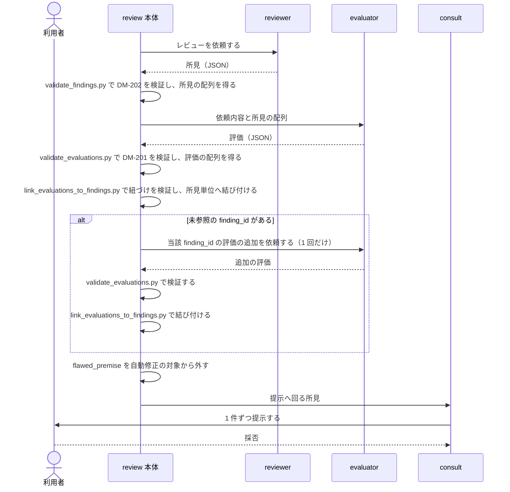

# DES-083 evaluator の独立評価と観点 設計書

## 1. 概要

[REQ-026](../requirements/REQ-026_evaluator_perspective.md) が解く問題は 1 つである。reviewer と evaluator が同じ観点文書を同じ向きで読むため、独立評価が独立になっていない。

本設計は、evaluator に reviewer とは異なる層を見せる（FNC-201・FNC-206）ための、シーケンスと責務を定める。所見・評価の構造（FNC-202・DM-202・DM-201）と紐づけの検証（FNC-203）は、その観点が働いた結果を運ぶための器である。

**器が観点を制約する**——評価が所見と 1 対 1 に固定されている限り、複数の指摘が 1 つの原因から出ていると気づいても、それを表現する場所が無い。

## 2. シーケンス



**前提条件**: reviewer が所見を返し、evaluator が独立に評価する枠組みが有効であること（[REQ-026](../requirements/REQ-026_evaluator_perspective.md) 前提条件）。

**エラーフロー**: `validate_findings.py` / `validate_evaluations.py` の検証に失敗した応答は、所見・評価として扱わない。追加依頼の後もなお未参照の finding_id は、未回答のまま残す（FNC-203）。

## 3. 責務

アクター（reviewer・evaluator・consult・review 本体）と、review 本体が行う処理（script）を分けて示す。

| 担い手                            | 責務                                                                                                       | 要件            |
| --------------------------------- | ---------------------------------------------------------------------------------------------------------- | --------------- |
| reviewer                          | 所見を JSON で返す。自らの所見に 1 始まりの連番を採番する                                                  | FNC-202・DM-202 |
| `validate_findings.py`            | 応答が DM-202 を満たすかを検証し、所見の配列を返す                                                         | FNC-202・DM-202 |
| evaluator                         | 観点を働かせて評価する。1 件の評価が複数の所見を引いてよい                                                 | FNC-201・DM-201 |
| evaluator                         | 見落としを新規に指摘する。自ら採番し、位置を明示する                                                       | FNC-206         |
| `validate_evaluations.py`         | 応答が DM-201 を満たすかを検証し、評価の配列を返す                                                         | DM-201          |
| `link_evaluations_to_findings.py` | 全 finding_id がいずれかの評価に紐づくかを検証し、評価を所見単位へ結び付ける。未参照があればその一覧を返す | FNC-203         |
| review 本体                       | 未参照があれば evaluator へ追加を依頼する（1 回だけ）                                                      | FNC-203         |
| review 本体                       | `flawed_premise` を自動修正の対象から外し、常に提示へ回す                                                  | FNC-204         |
| review 本体                       | 評価が食い違ったときに調停する                                                                             | DM-201          |
| consult                           | 所見を 1 件ずつ提示して採否を得る。一覧・残件・採否を自ら保持する                                          | FNC-205         |

シーケンスと責務が決まれば、正しく動くかはこの 2 つで決まる。以降の節は、ここで挙げた主体それぞれの内側を定める。

## 4. モジュール設計

### 4.1 script の分割

決定論的に決まる仕事だけを script が担う。観点を働かせること・追加依頼の判断・調停・提示はいずれも決定論に落とせず、AI が担う。

| script                            | 責務                                                           | 置き場            |
| --------------------------------- | -------------------------------------------------------------- | ----------------- |
| `validate_findings.py`            | reviewer の応答が DM-202 を満たすかを検証し、所見の配列を返す  | 共有領域          |
| `validate_evaluations.py`         | evaluator の応答が DM-201 を満たすかを検証し、評価の配列を返す | review スキル配下 |
| `link_evaluations_to_findings.py` | 紐づけを検証し、評価を所見単位へ結び付ける                     | review スキル配下 |

置き場は [DES-024](../../forge/design/DES-024_skill_script_layout_design.md) に従う。`validate_findings.py` を共有領域に置くのは、reviewer の応答を受け取る経路が交換可能な実行主体ごとに存在するためである（FNC-202）。他の 2 つは review 本体だけが呼ぶ。

### 4.2 3 つに分ける理由

| 境界                                                         | 理由                                                                                                                                                                                                                                  |
| ------------------------------------------------------------ | ------------------------------------------------------------------------------------------------------------------------------------------------------------------------------------------------------------------------------------- |
| `validate_findings.py` と `validate_evaluations.py` を分ける | 検証する契約が別である（DM-202 と DM-201）。2 箇所の同型処理を 1 つに畳むと契約をパラメータとして渡す汎用化になり、[design_principles_spec.md](../../../../plugins/forge/docs/design_principles_spec.md) が退ける早期の抽象化にあたる |
| `link_evaluations_to_findings.py` を分ける                   | 検証の対象が単一の応答ではなく **2 つの配列の関係**であり、上流のどちらの責務にも属さない                                                                                                                                             |
| 紐づけの検証と結び付けを分けない                             | 結び付けた結果を作るには紐づけの検証が要る。検証だけを行った中間物に使い道が無い                                                                                                                                                      |

### 4.3 検査を置く場所

AI の応答を構造化データとして受け取る境界には検査を置く。応答の中身を決めているのは AI であり、代わりに組み立てる実行系が存在しないためである（[deterministic_generation_spec.md](../../../../plugins/forge/docs/deterministic_generation_spec.md) §6.1）。

検査はその境界 1 つに限る。検証を通った配列を下流で再び検査しない（同 §7）。`link_evaluations_to_findings.py` が検証するのは配列の中身ではなく、2 つの配列の**関係**である。

## 5. 受け渡す構造

### 5.1 reviewer の応答（DM-202）

```json
{
  "findings": [
    {
      "finding_id": 1,
      "severity": "major",
      "location": "docs/rules/foo.md:42",
      "body": "所見本文"
    }
  ]
}
```

所見が無い場合は `"findings": []` とする（FNC-202）。

### 5.2 evaluator の応答（DM-201）

```json
{
  "evaluations": [
    {
      "finding_ids": [1, 3, 5],
      "disposition": "valid",
      "severity": "major",
      "reason": "3 件は同じ原因から出ている。…",
      "confidence": "confirmed",
      "fix_confident": true
    },
    {
      "finding_ids": [10],
      "disposition": "valid",
      "severity": "major",
      "reason": "reviewer が見落とした問題。…",
      "confidence": "confirmed",
      "fix_confident": false,
      "location": "plugins/forge/agents/evaluator.md:22"
    }
  ]
}
```

`finding_ids` は整数の配列であり、省略記法を持たない。全件を対象とする評価も ID を列挙する。予約値を置けば「その値は単独でしか現れない」「他の ID と混ぜられない」という規則が契約に増え、省ける手間に見合わない。

空配列は不正とする。何も参照しない評価は意味を持たないため、空配列に別の意味を与えず検証エラーとして扱う。これによりキーの書き落としも空配列も等しく弾かれ、既定が安全側に倒れる。

reviewer の採番範囲を超える `finding_id` は、evaluator が新規に指摘したものである（FNC-206）。出自を示す別のフィールドは持たない——採番規則が既にそれを表しており、印を足せば同じ事実を 2 箇所で持つことになる。

### 5.3 所見単位に結び付いた配列

```json
{
  "items": [
    {
      "finding_id": 1,
      "severity": "major",
      "location": "docs/rules/foo.md:42",
      "body": "…",
      "evaluations": [
        {
          "evaluation_id": 1,
          "disposition": "valid",
          "severity": "major",
          "reason": "…",
          "confidence": "confirmed",
          "fix_confident": true
        }
      ]
    }
  ]
}
```

| 決めたこと                                                      | 理由                                                                                                                                                                                                             |
| --------------------------------------------------------------- | ---------------------------------------------------------------------------------------------------------------------------------------------------------------------------------------------------------------- |
| `evaluations` を常に配列とする                                  | 同じ finding_id を複数の評価が引くこと（DM-201）を、要素の複製ではなく 1 要素の中の複数評価として表す。複製すると同じ所見が二重に扱われる                                                                        |
| `evaluation_id` は `link_evaluations_to_findings.py` が採番する | 識別子の採番は決定論的な実行系の責務（[deterministic_generation_spec.md](../../../../plugins/forge/docs/deterministic_generation_spec.md) §5）。evaluator に採番させると DM-201 が持たない値を書かせることになる |
| 新規指摘も同じ形の要素にする                                    | 採番範囲を超える finding_id を持ち、位置と本文は評価が持つ `location` と `reason` から採る                                                                                                                       |

## 6. 観点を働かせる設計（FNC-201）

### 6.1 観点が働いたことは、どこに現れるか

FNC-201 は 5 つの手がかりを態度として課し、出力構造を求めない。したがって本設計は、観点を働かせたことを申告させず、**働いた結果が評価そのものに現れる**形を取る。

| 観点が働いた結果                              | 評価に現れる形                                                            |
| --------------------------------------------- | ------------------------------------------------------------------------- |
| 複数の指摘が 1 つの原因から出ていると気づいた | 1 件の評価が複数の `finding_id` を引き、`reason` が共通原因を述べる       |
| 指摘の前提となった情報が誤っていた            | `disposition: misunderstanding` と、誤りの所在を述べた `reason`           |
| 規範文書側に欠陥があった                      | `disposition: flawed_premise` と、どの文書のどこが誤りかを述べた `reason` |
| 見落としを見つけた                            | 自ら採番した `finding_id` を引く評価（FNC-206）                           |
| 俯瞰したが共通原因は無かった                  | 複数を引かない評価と、無いと判断した根拠を述べた `reason`                 |

最下段が要る理由は、FNC-201 が「本質・原因が無いこともある。作り出さないこと」と定めるためである。無いという判断は、束ねられていない評価として現れ、根拠は `reason` に残る。**無いことを明示する専用の欄は持たない**——欄があれば埋める圧力が生まれ、成立しない共通原因を書かせることになる。

### 6.2 5 つの観点が評価へ写る形

観点のうち 3 つは §6.1 に現れる。残る 2 つの写り方を定める——定めなければ、観点に反する所見を前にした evaluator が、どの分類へ落とすかを推測で決めることになる。

| 観点                             | 評価への写り方                                                                                                                                                                                                                                                               |
| -------------------------------- | ---------------------------------------------------------------------------------------------------------------------------------------------------------------------------------------------------------------------------------------------------------------------------- |
| 本質を疑う                       | 複数の `finding_id` を引く評価                                                                                                                                                                                                                                               |
| 対象の情報を疑う                 | `misunderstanding` / `flawed_premise`                                                                                                                                                                                                                                        |
| 既存の決定を外から当否判定しない | evaluator 自身への拘束であり、同時に**所見がこれを犯している場合の分類**を定める。決定そのものの当否を論じる所見は `invalid` とし、`reason` に根拠とした決定を記す。形式・論理的整合性・書き換え禁止といった手続きの違反を指摘する所見は、この分類に入れず通常どおり判定する |
| まず最も強い解釈を試す           | 独立した分類を持たない。`flawed_premise` へ至る前に尽くすべき手順として、`flawed_premise` の判定条件に組み込む                                                                                                                                                               |
| 逆から検証する                   | 独立した分類を持たない。`confidence` の決定に働く——判定が誤っている形を先に想定して確かめられたものだけが `confirmed` になる                                                                                                                                                 |

下 2 つが独立した分類を持たないのは、**判定の分岐ではなく判定の質に働く観点だから**である。分類を新設すれば、観点の数だけ `disposition` が増え、値の意味が重なる。

### 6.3 観点は工程にしない

5 つの手がかりは `disposition` 判定と並列の別工程ではなく、その判定を行う際の目の付け所である。工程として立てると、判定の前に観点を消化する手順が生まれ、見たかどうかを自己申告させる形と同じ形骸化に至る。

### 6.4 観点は規範文書の本数に依存しない

観点文書の本数はレビューの種別ごとに異なる。したがって 5 つの手がかりは、**特定の規範文書を名指しせず、所見と対象の関係だけで立てられる問い**である必要がある。

「指摘された問題は本当にそれが原因か」「元になった情報自体が誤っていないか」「まず最も合理的な読み方を試したか」「この判定が間違っているとしたらどこか」は、規範文書が何本であっても同じ形で問える。既存の決定を外から当否判定しない観点だけが特定の文書種別に触れるが、これは適用除外の指定であり本数に依存しない。

観点に**規範文書を読めという指示を伴わせない**。対象と観点文書は依頼本文で既に渡っており、読む対象を二重に指定すると依頼本文と食い違う。

### 6.5 具体例の置き場

5 つの観点それぞれが実際の判定をどう変えるかの例は、evaluator の定義が持つ。例は観点の意味を伝える手段であって、要件でも設計でもない。加えて、例は実運用で観点が空振りした事例から補充されるべきもので、更新の頻度が要件・設計と異なる。

## 7. 未参照の finding_id への追加依頼（FNC-203）

`link_evaluations_to_findings.py` が未参照の `finding_id` を返したとき、review 本体は evaluator へ 1 回だけ追加の評価を依頼する。

**これは追加の依頼であり、評価のやり直しではない。** 渡すのは未参照の `finding_id` とその所見に限り、既に返された評価を再送しない——同じ所見に 2 通りの評価が返れば、どちらを採るかの規則が新たに要る。

依頼先が evaluator であるのは、未参照が評価の漏れであり、reviewer は `disposition` を判定する立場にないためである。

追加依頼の後もなお未参照の `finding_id` は、未回答のまま残す。追加の対応は課さない。

## 8. 評価の食い違いの調停（DM-201）

同じ `finding_id` を複数の評価が引き、判定が食い違うことがある。調停は review 本体が行う。

DM-201 は調停を実行主体の判断に委ね、要件としては規則化していない。したがって script に畳ませない——script に畳ませれば、それは規則化したことになる。`link_evaluations_to_findings.py` は複数の評価を 1 つの要素に並べるところまでを担う（§5.3）。

## 9. flawed_premise の扱い（FNC-204）

`disposition: flawed_premise` は、`confidence` / `fix_confident` の値に関わらず自動修正の対象にせず、常に提示へ回す。

`disposition` による除外は、`confidence` と `fix_confident` による振り分けの**前段**に置く。後段に置くと、一括修正の申し出に載せた後で除外することになり、利用者へ提示済みの申し出を撤回する経路が生まれる。

## 10. consult の状態（FNC-205）

consult は、提示に必要な状態——所見の一覧・残件・採否——を自ら保持する。

提示状態は永続化しない。本 feature の期間中、会話が終われば失われる（FNC-205）。したがって保持のために固有のファイル・作業ディレクトリ・DB を設けない。

## 11. テスト設計

**単体テスト対象**:

- `validate_findings.py`: DM-202 の必須フィールド欠落・`severity` の値域外・`finding_id` が整数でない応答を拒否すること。空の配列を受理すること
- `validate_evaluations.py`: `finding_ids` が整数の配列であることを要求し、空配列・キーの不在・整数以外を拒否すること。`disposition` の 5 値を受理し値域外を拒否すること。`fix_confident` が真なら `confidence` が `confirmed` であることを要求すること。採番範囲を超える `finding_id` を引く評価に `location` を要求すること
- `link_evaluations_to_findings.py`: 全 `finding_id` が参照済みなら空の未参照集合を返すこと。未参照があればその一覧を返すこと。1 件の評価が複数の所見を引くとき、各所見に同じ評価が付くこと。1 つの所見を複数の評価が引くとき、要素が複製されず 1 要素が複数の評価を持つこと。採番範囲を超える `finding_id` を引く評価が 1 要素になること。`evaluation_id` を自ら採番すること

**統合テスト対象**:

- reviewer の応答から所見単位の配列までが、束ねた評価・新規指摘・未参照の追加依頼のいずれのケースでも成立すること

## 12. 未確定事項

| ID      | 内容                                                                                                                                                                                                    | 期限   |
| ------- | ------------------------------------------------------------------------------------------------------------------------------------------------------------------------------------------------------- | ------ |
| TBD-001 | FNC-201 の 5 つの観点を evaluator が実際に働かせられるかは未検証（[REQ-026](../requirements/REQ-026_evaluator_perspective.md) TBD-001 を継承）。§6.1 の「評価に現れる形」が実際に観測できるかで検証する | 実装後 |
