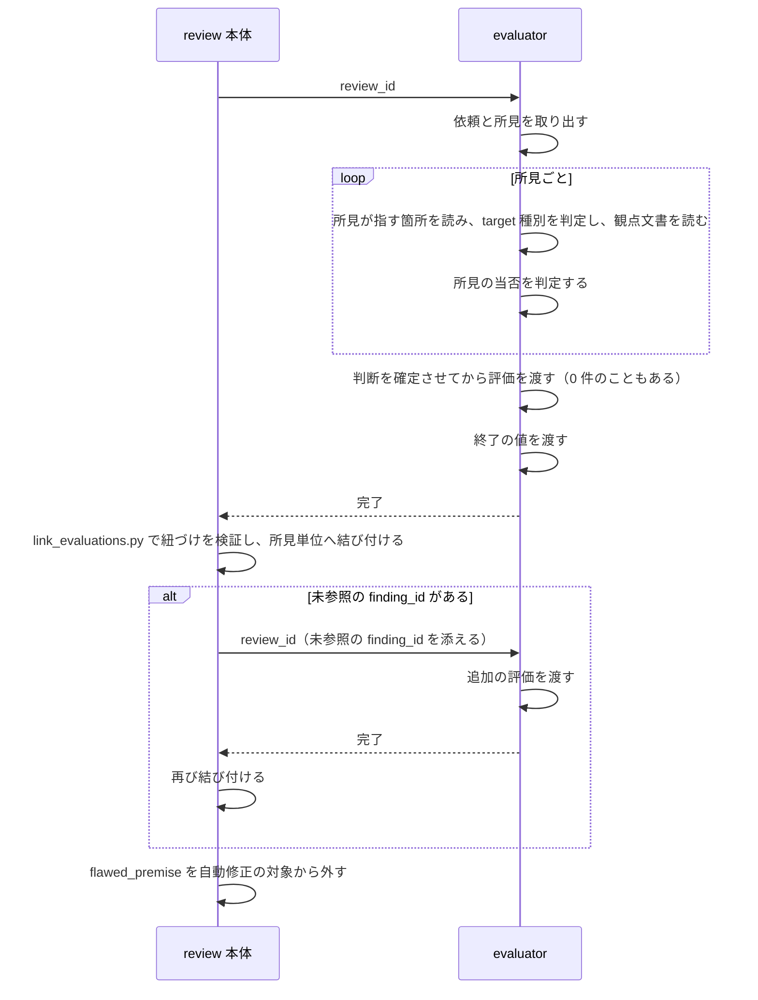

# DES-083 evaluator の独立評価とメタ観点 設計書

## 1. 概要

[REQ-026](../requirements/REQ-026_evaluator_perspective.md) を実現する設計を定める。

**evaluator は reviewer と同じ仕組みで動く。** 受け渡し・入力の取り出し・target 種別の判定・target 種別ごとに読む文書・確定後に 1 件ずつ渡すこと・終了の値は、[DES-084](../../reviewer/design/DES-084_reviewer_design.md) が reviewer について定めるものと同一である（§4）。

本書が定めるのは、**reviewer と異なる 3 点**と、本体が評価をどう扱うかである。

| 段   | reviewer                           | evaluator                                              | 本書 |
| ---- | ---------------------------------- | ------------------------------------------------------ | ---- |
| 入力 | 依頼                               | 依頼 **＋ reviewer が返した所見**                      | §5   |
| 作業 | **対象を起点に**問題が無いかを探す | **所見を起点に**当否を判定し、見落としを新規に指摘する | §6   |
| 出力 | 所見（finding）                    | **評価（evaluation）**。1 件が複数の所見を引く         | §7   |

作業の差が本設計の中心である。**読む起点が逆である**——reviewer は対象を網羅して読み所見を作るが、evaluator は所見を読んでから、それが指す箇所へ入る（§6.1）。**器がメタ観点を制約する**——評価が所見と 1 対 1 に固定されている限り、複数の指摘が 1 つの原因から出ていると気づいても、それを表現する場所が無い。

## 2. シーケンス



除外から先（振り分け・提示・修正）は本書の範囲ではない。evaluator を起動するところまでの流れは [DES-084](../../reviewer/design/DES-084_reviewer_design.md) §2 が持つ。

**エラーフロー**: 終了の値が `"0"` でなければ、その評価はエラーである。結果そのものが無い場合も同じ（[DES-084](../../reviewer/design/DES-084_reviewer_design.md) §4.4）。追加依頼の後もなお未参照の `finding_id` は、未回答のまま残す（FNC-203）。

## 3. 責務

| 担い手                           | 責務                                                                           | 要件                                                                        |
| -------------------------------- | ------------------------------------------------------------------------------ | --------------------------------------------------------------------------- |
| evaluator                        | 依頼と所見を取り出し、所見が指す箇所と観点文書を読み、当否を判定し、評価を渡す | FNC-201・206・209                                                           |
| `evaluator.md`                   | script の呼び方、入力の各項目の扱い、メタ観点、評価として何を述べるか          | FNC-208                                                                     |
| `scripts/evaluator/` の各 script | 評価・終了の値を書く／読む                                                     | FNC-207（[DES-084](../../reviewer/design/DES-084_reviewer_design.md) §4.2） |
| `link_evaluations.py`            | 紐づけを検証し、評価を所見単位へ結び付ける                                     | FNC-203                                                                     |
| review 本体                      | 未参照があれば追加を依頼する                                                   | FNC-203                                                                     |
| review 本体                      | `flawed_premise` を自動修正の対象から外す                                      | FNC-204                                                                     |
| review 本体                      | 評価が食い違ったときに調停する                                                 | DM-201                                                                      |
| consult                          | 所見を 1 件ずつ提示し、採否を得る。状態を自ら保持する                          | §9（暫定措置）                                                              |

## 4. reviewer と同じ部分

次は [DES-084](../../reviewer/design/DES-084_reviewer_design.md) が定めるものをそのまま適用する。本書は繰り返さない。

| 事柄                         | 定めている箇所                                                   |
| ---------------------------- | ---------------------------------------------------------------- |
| `review_id` による受け渡し   | [DES-084](../../reviewer/design/DES-084_reviewer_design.md) §4.1 |
| 値の受け渡し（標準入力）     | 同 §4.5                                                          |
| 形式の検証を置かない         | 同 §4.6                                                          |
| 1 件ずつ渡す                 | 同 §4.2                                                          |
| 確定後に書き出す             | 同 §4.2（FNC-310）                                               |
| 終了の値                     | 同 §4.4                                                          |
| 結果の構造                   | 同 §5.3                                                          |
| 定義が持つもの・持たないもの | 同 §6.1                                                          |
| target 種別を判定する        | 同 §6.3                                                          |
| target 種別ごとに読む文書    | 同 §6.4                                                          |

**対象の読み方は同じではない**（§6.1）。reviewer は対象を網羅して読むが、evaluator は所見を起点に読む。

**2 つの主体を別の仕組みで動かさない。** 分ければ、同じ問題への答えが 2 つになり、片方だけが直される（FNC-207 が受け渡しについて述べる理由は、読み方と判定にも同じく当たる）。

`evaluator.md` は `reviewer.md` と同じ 5 項目（script の呼び方・入力の各項目の扱い・対象の読み方・target 種別ごとに読む文書・出力として何を述べるか）を持ち、**JSON の構造は持たない**（FNC-208）。中身が異なるのは「対象の読み方」「出力として何を述べるか」の 2 項目と、メタ観点（§6）である。

## 5. 入力

依頼に加えて、reviewer が返した所見が渡る（FNC-207）。

| 取り出すもの | script                             | 定めている箇所                                                   |
| ------------ | ---------------------------------- | ---------------------------------------------------------------- |
| 依頼         | `scripts/reviewer/read_request.py` | [DES-084](../../reviewer/design/DES-084_reviewer_design.md) §5.1 |
| 所見         | `scripts/reviewer/read_result.py`  | 同 §5.2                                                          |

evaluator は reviewer 側の script の**取り出し操作だけ**を呼ぶ。書き込みは自分の側にしか持たない（同 §4.2）。これにより、同じ `review_id` を渡すだけで evaluator は依頼も所見も見つけられる。

追加依頼の場合は、未参照の `finding_id` が添えて渡る（§8.4）。渡る形は初回と変わらない（FNC-305）。

## 6. 作業

reviewer と同じ種類の材料（対象・target 種別・観点文書）を読むが、**読む順も、読む範囲も、使い道も異なる**。

| 主体      | 読む起点 | 読んだ材料を何に使うか                                                               |
| --------- | -------- | ------------------------------------------------------------------------------------ |
| reviewer  | 対象     | 対象が規範に反していないかを探し、反していれば所見にする                             |
| evaluator | 所見     | 所見が規範と対象の実態に照らして成立するかを判定し、成立しない理由を `reason` に書く |

evaluator が観点文書を読むのは、**所見の当否を自ら確かめるため**である。読まずに判定すれば、reviewer の主張を追認するか退けるかを根拠なく決めることになり、独立評価にならない。

### 6.1 所見を起点に読む

**読む順が reviewer と逆である。** reviewer は対象を読んでから所見を作る。evaluator は所見を読んでから、その所見が何を指しているかを追って対象へ入る。

| 手順 | 内容                                                                                                                 |
| ---- | -------------------------------------------------------------------------------------------------------------------- |
| 1    | 所見 1 件を読み、`location` が指す箇所と、判断に要るだけの周辺を読む                                                 |
| 2    | その箇所が属するファイルの target 種別を判定する（[DES-084](../../reviewer/design/DES-084_reviewer_design.md) §6.3） |
| 3    | target 種別に対応する観点文書を読む（同 §6.4）。所見が規範を名指ししていれば、その規範も読む                         |
| 4    | 所見の主張が、読んだ規範と読んだ実態に照らして成立するかを判定する                                                   |

**対象の全文読破を課さない。** 所見が指していない箇所まで網羅して読めというのは reviewer の規定（同 §6.2）であり、evaluator には当たらない。判定に要る範囲を、所見ごとに evaluator が決める。

ただし FNC-206 の新規指摘は、所見が指していない箇所からも生じる。依頼の `targets` が対象範囲を運んでいるため、evaluator はそこを自ら見に行ける。**見に行くことを課さず、禁じもしない**——網羅を課せば reviewer をもう一度やることになり、禁じれば FNC-206 が成立しない。

### 6.2 メタ観点を働かせる（FNC-201）

FNC-201 は 5 つのメタ観点を**態度として**課し、出力構造を求めない。検討の過程で「5 項目を見たかどうかを自己申告させる」形が検討され、**確かめる手段が無く機械的にチェック欄を埋めるだけになる**として不採用になっている。

したがって本設計は、メタ観点を働かせたことを申告させず、**働いた結果が評価そのものに現れる**形を取る。

| メタ観点が働いた結果                          | 評価に現れる形                                                            |
| --------------------------------------------- | ------------------------------------------------------------------------- |
| 複数の指摘が 1 つの原因から出ていると気づいた | 1 件の評価が複数の `finding_id` を引き、`reason` が共通原因を述べる       |
| 指摘の前提となった情報が誤っていた            | `disposition: misunderstanding` と、誤りの所在を述べた `reason`           |
| 規範文書側に欠陥があった                      | `disposition: flawed_premise` と、どの文書のどこが誤りかを述べた `reason` |
| 見落としを見つけた                            | 自ら採番した `finding_id` を引く評価（§6.4）                              |
| 所見が既存の決定の当否を判定していた          | `disposition: invalid` と、根拠にした決定を述べた `reason`                |
| 俯瞰したが共通原因は無かった                  | 複数を引かない評価と、無いと判断した根拠を述べた `reason`                 |

最下段が要る理由は、FNC-201 が「本質・原因が無いこともある。作り出さないこと」と定めるためである。無いという判断は、束ねられていない評価として現れ、根拠は `reason` に残る。**無いことを明示する専用の欄は持たない**——欄があれば埋める圧力が生まれ、成立しない共通原因を書かせることになる。

### 6.3 5 つのメタ観点が評価へ写る形

メタ観点のうち 3 つは §6.2 の表に現れる。残る 2 つの写り方を定める——定めなければ、メタ観点に反する所見を前にした evaluator が、どの分類へ落とすかを推測で決めることになる。

| メタ観点                         | 評価への写り方                                                                                                                                                                                                                                                               |
| -------------------------------- | ---------------------------------------------------------------------------------------------------------------------------------------------------------------------------------------------------------------------------------------------------------------------------- |
| 本質を疑う                       | 複数の `finding_id` を引く評価                                                                                                                                                                                                                                               |
| 対象の情報を疑う                 | `misunderstanding` / `flawed_premise`                                                                                                                                                                                                                                        |
| 既存の決定を外から当否判定しない | evaluator 自身への拘束であり、同時に**所見がこれを犯している場合の分類**を定める。決定そのものの当否を論じる所見は `invalid` とし、`reason` に根拠とした決定を記す。形式・論理的整合性・書き換え禁止といった手続きの違反を指摘する所見は、この分類に入れず通常どおり判定する |
| まず最も強い解釈を試す           | 独立した分類を持たない。`flawed_premise` へ至る前に尽くすべき手順として、`flawed_premise` の判定条件に組み込む                                                                                                                                                               |
| 逆から検証する                   | 独立した分類を持たない。`confidence` の決定に働く——判定が誤っている形を先に想定して確かめられたものだけが `confirmed` になる                                                                                                                                                 |

下 2 つが独立した分類を持たないのは、**判定の分岐ではなく判定の質に働くメタ観点だから**である。分類を新設すれば、メタ観点の数だけ `disposition` が増え、値の意味が重なる。

**メタ観点は工程にしない。** 5 つのメタ観点は `disposition` 判定と並列の別工程ではなく、その判定を行う際の目の付け所である。工程として立てると、判定の前にメタ観点を消化する手順が生まれ、見たかどうかを自己申告させる形と同じ形骸化に至る。

5 つのメタ観点それぞれが実際の判定をどう変えるかの例は、`evaluator.md` が持つ。例はメタ観点の意味を伝える手段であって、要件でも設計でもない。加えて、例は実運用でメタ観点が空振りした事例から補充されるべきもので、更新の頻度が要件・設計と異なる。

### 6.4 新規に指摘する

reviewer が返した所見のどれとも対応しない問題を見つけたとき、evaluator は reviewer の連番の続きから `finding_id` を採番し、それを引く評価として渡す（FNC-206）。

- 採番範囲を超える `finding_id` であること自体が出自を表す。別の印を足さない
- この評価は `location` を持つ。参照先の所見が存在しないため、位置を自ら示す

## 7. 出力

### 7.1 保持する構造

```json
{
  "finding_ids": [3, 7],
  "disposition": "valid",
  "severity": "major",
  "reason": "…",
  "confidence": "confirmed",
  "fix_confident": true,
  "location": "docs/rules/foo.md:42"
}
```

reviewer の所見（[DES-084](../../reviewer/design/DES-084_reviewer_design.md) §5.2）との違いは 2 つである。

| 違い                        | 内容                                                                                                                    |
| --------------------------- | ----------------------------------------------------------------------------------------------------------------------- |
| `finding_ids` が可変長      | 評価は判定の単位であり、1 個以上の所見を引く。1 対 1 の対応を課さない（DM-201）。これが §6.2 の表を成立させる構造である |
| `location` は条件付きで持つ | 採番範囲を超える `finding_id` を引くときだけ持つ。reviewer 由来だけを引くなら、位置は所見の側にある（DM-201）           |

`location` は所見と同じく文字列である（同 §5.2）。

### 7.2 評価を渡す

**すべての判断を確定させてから書き出す**（FNC-310）。evaluator ではこれが構造的に要る——複数の所見を 1 件の評価で束ねる（§6.2）には全所見を見てから評価を確定する必要があり、1 件ずつ判断しながら書き出すと束ねる評価が書けない。

確定した評価を 1 件ずつ script へ渡し、書き出し終えたら終えたことを示す（§7.3）。所見が 0 件なら評価も 0 件とし、終了の値だけを渡す（FNC-209）。

### 7.3 `scripts/evaluator/`

分け方の原則は [DES-084](../../reviewer/design/DES-084_reviewer_design.md) §4.2 に従う——**1 操作 1 script**、第 1 引数は常に `review_id`、終了コードは `3` 以上を使わない。

| script                          | 責務                                                                            | 入力                                                                                  | 出力（`0`）                                                                       | エラー                                  |
| ------------------------------- | ------------------------------------------------------------------------------- | ------------------------------------------------------------------------------------- | --------------------------------------------------------------------------------- | --------------------------------------- |
| `evaluate_valid.py`             | **`valid` の評価を 1 件積む。** `confidence` と `fix_confident` を必須で受ける  | `<review_id> --findings --severity --confidence --fix-confident` / 標準入力: 判定根拠 | なし                                                                              | 既に終了の値がある                      |
| `evaluate_invalid.py` ほか 3 本 | **その `disposition` の評価を 1 件積む。** 分類は script が持つ                 | `<review_id> --findings --severity` / 標準入力: 判定根拠                              | なし                                                                              | 同上                                    |
| `add_new_finding.py`            | **見落としを新規に指摘する。** reviewer の採番範囲の続きから採番する（FNC-206） | `<review_id> --severity --location` / 標準入力: 判定根拠                              | 採番した `finding_id`                                                             | 同上                                    |
| `finish.py`                     | **正常に書き終えたことを示す。** 終了の値 `"0"` を書く                          | `<review_id>`                                                                         | なし                                                                              | 既に終了の値がある                      |
| `abort.py`                      | **自覚したエラーで終えたことを示す。** 定義されたエラー値を書く                 | `<review_id> <エラー値>`                                                              | なし                                                                              | 定義に無い値（`2`）／既に終了の値がある |
| `read_result.py`                | **評価の結果を返す。** 正常に終えている場合だけ、評価の配列を返す               | `<review_id>`                                                                         | 結果（[DES-084](../../reviewer/design/DES-084_reviewer_design.md) DM-303 と同型） | 終了の値が `"0"` でない／結果が無い     |

**判定ごとに script を分ける。** `disposition` の値を綴らせず、判定ごとに違う必須項目（`valid` のときだけ `confidence` と `fix_confident`）を AI に覚えさせないためである。判定の分類が script 名に現れるため、`disposition` を増やせば script が増える。

**評価 script は、引く `finding_id` が実在するかを検証しない。** 所見と評価の関係の検証は `link_evaluations.py` の責務であり（FNC-203）、書き込み時に持ち込むと同じ判定が 2 箇所に分かれる。

evaluator が呼ぶ読む側の script は reviewer 領域にある（§5）。**評価を書く口は evaluator 領域にしかなく、所見を書く口を持たない。**

## 8. review 本体による評価の扱い

### 8.1 紐づけの検証と結び付け

| 項目        | 内容                                                                                                                                                                                     |
| ----------- | ---------------------------------------------------------------------------------------------------------------------------------------------------------------------------------------- |
| 責務        | **所見と評価を突き合わせる。** 全 `finding_id` が参照されているかを検証し、評価を所見 1 件単位へ展開する                                                                                 |
| 呼ぶ主体    | review 本体だけ                                                                                                                                                                          |
| 入力        | `<review_id>`                                                                                                                                                                            |
| 出力（`0`） | 所見単位へ展開した要素の配列と、**未参照の `finding_id` の一覧**                                                                                                                         |
| エラー      | 所見・評価のいずれかが読めない（取り出しが失敗する。[DES-084](../../reviewer/design/DES-084_reviewer_design.md) §4.2）／採番範囲を超える `finding_id` を引く評価が `location` を持たない |

行う検証は 2 つである。

| 検証         | 内容                                                                                       |
| ------------ | ------------------------------------------------------------------------------------------ |
| 紐づけの検証 | reviewer が返した全 `finding_id` が、いずれかの評価から参照されているか（FNC-203）         |
| 出自の検証   | 採番範囲を超える `finding_id` を引く評価が `location` を持つか。持たなければ契約違反とする |

**未参照があってもエラーにしない。** 未参照は追加依頼で解消しうる正常な経過であり（§8.4）、一覧を返して本体が次の行動を決める。エラーにすると、追加依頼という回復手段へ進めなくなる。

**これは形式の検証ではない。** 形式は script が組み立てるため検査しない（[DES-084](../../reviewer/design/DES-084_reviewer_design.md) §4.6）。ここで検証するのは**所見と評価という 2 つの集合の関係**であり、script が組み立てても自動的には満たされない。

置き場は review スキル配下とする。review 本体だけが呼ぶ（[DES-024](../../forge/design/DES-024_skill_script_layout_design.md)）。終了コードは `3` 以上を使わない（同 §4.2）。

### 8.2 判定の単位と、後段の単位は異なる

評価は判定の単位であり、複数の所見を引く。一方、修正と提示は**所見 1 件を単位とする**——修正は「どこを直すか」が 1 箇所に確定して初めて成立する。

`link_evaluations.py` は、評価を各所見へ展開する。

| 引かれた `finding_id` | 出力に現れる形                                                          |
| --------------------- | ----------------------------------------------------------------------- |
| reviewer の採番範囲内 | その所見に、評価が付く                                                  |
| 採番範囲を超える      | 評価が持つ `location` と `reason` を実体として、1 要素になる（FNC-206） |

出力要素はいずれも「位置」と「判定」を持つ。新規指摘に対して reviewer 由来の所見を模したレコードを作らない——採番範囲を超える `finding_id` であること自体が出自を表しており、別の印を足せば同じ事実を 2 箇所で持つことになる。

### 8.3 同じ所見を複数の評価が引く場合

DM-201 は、同じ `finding_id` を複数の評価が引くことを許す。このとき**要素を複製せず、1 要素が複数の評価を持つ形**にする。複製すると同じ所見が二重に扱われ、同じ箇所へ修正を 2 回適用する経路ができる。

食い違いの調停は review 本体が行う。DM-201 が調停を実行主体の判断に委ね、要件としては規則化していないため、script に畳ませない——畳ませれば、それは規則化したことになる。

### 8.4 未参照への追加依頼

未参照の `finding_id` があれば、review 本体は evaluator へ 1 回だけ追加の評価を依頼する。

**これは追加の依頼であり、評価のやり直しではない。** 渡すのは未参照の `finding_id` に限り、既に渡された評価を捨てない。同じ所見に 2 通りの評価が返れば、どちらを採るかの規則が新たに要る。

依頼先が evaluator であるのは、未参照が評価の漏れであり、reviewer は `disposition` を判定する立場にないためである。

追加依頼の後もなお未参照の `finding_id` は、未回答のまま残す。追加の対応は課さない（FNC-203）。

### 8.5 flawed_premise の扱い

`disposition: flawed_premise` は、`confidence` / `fix_confident` の値に関わらず自動修正の対象にせず、常に提示へ回す。

`disposition` による除外は、`confidence` と `fix_confident` による振り分けの**前段**に置く。後段に置くと、一括修正の申し出に載せた後で除外することになり、利用者へ提示済みの申し出を撤回する経路が生まれる。

## 9. consult の振る舞い（暫定措置）

### 9.1 agenda を使わない

**本 feature の実装期間中、consult は agenda への記録を行わない。** 提示に必要な状態（所見の一覧・残件・採否）を agenda を介さず自ら保持する。所見の提示（1 件ずつの採否確認）は継続する。

**理由**: agenda（`structural_judgment` の必須記録・提示フローの駆動源等）は本設計が定める評価の構造と対応が取れておらず、本 feature の後に別の差分 feature（agenda 全面刷新）で再設計される。この期間中の agenda は書き換えの途上にあり、依存したままでは提示自体が成立しない。

**影響範囲**: consult は agenda の唯一の呼び出し元であり、agenda に依存する他の主体は無い。ただし review 本体の一部の手順（段階的提示の中断報告・前回記録の破棄確認）は、consult が保持する状態を前提にしている。これらは新しい保持方式に合わせて読み替える——記録が存在しない・永続化されない前提で、報告内容・破棄判定を行う。

agenda への永続化（ファイルに残す・後で見返す・表示の改訂）は、agenda 全面刷新の feature が扱う。

### 9.2 状態はコンテキストに持つ

consult は agenda を呼ばない。提示に必要な状態——所見の一覧・残件・採否——は会話コンテキストに保持する。

consult は継承型 SKILL であり、review 本体を実行しているのと同じ会話が振る舞いを切り替えるだけである。評価内容も対話進行の結果もコンテキストに残る。review 起点では提示する所見が上流から渡るため、consult 自身が論点を立てる工程も要らない。

固有の状態ファイル・作業ディレクトリ・DB は持たない。提示状態は永続化されず、会話が終われば失われる。

### 9.3 未対応所見の出所

review 本体の要約報告は、未対応所見の一覧と理由を**会話コンテキストから得る**。提示を中断した場合は、未判断の件数を示す。**未判断を「対応不要」へ畳み込まない。**

記録から生成された表示物への参照を報告に含めない。永続化された表示物を持たないためである。

## 10. テスト設計

**単体テスト対象**:

- `link_evaluations.py`: 全 `finding_id` が参照済みなら空の未参照集合を返すこと。未参照があればその一覧を返すこと。1 件の評価が複数の所見を引くとき、各所見に同じ評価が付くこと。1 つの所見を複数の評価が引くとき、要素が複製されず 1 要素が複数の評価を持つこと。採番範囲を超える `finding_id` を引く評価が 1 要素になること。採番範囲を超える `finding_id` を引きながら `location` を持たない評価を契約違反として返すこと

**契約テスト対象**:

- `evaluator.md` が持つ script の呼び方が、[DES-084](../../reviewer/design/DES-084_reviewer_design.md) §4.2 の script 群の実際の引数と一致すること
- `evaluator.md` が `reviewer.md` と同じ 5 項目（§4）を持つこと
- `evaluator.md` が FNC-201 の 5 つのメタ観点すべてと、`disposition` の 5 値を持つこと

**統合テスト対象**:

- 所見から結び付けまでが、束ねた評価・新規指摘・未参照の追加依頼・同じ所見への複数評価のいずれのケースでも成立すること

## 11. 未確定事項

| ID      | 内容                                                                                                                                                                                                        | 期限   |
| ------- | ----------------------------------------------------------------------------------------------------------------------------------------------------------------------------------------------------------- | ------ |
| TBD-001 | FNC-201 の 5 つのメタ観点を evaluator が実際に働かせられるかは未検証（[REQ-026](../requirements/REQ-026_evaluator_perspective.md) TBD-001 を継承）。§6.2 の「評価に現れる形」が実際に観測できるかで検証する | 実装後 |
