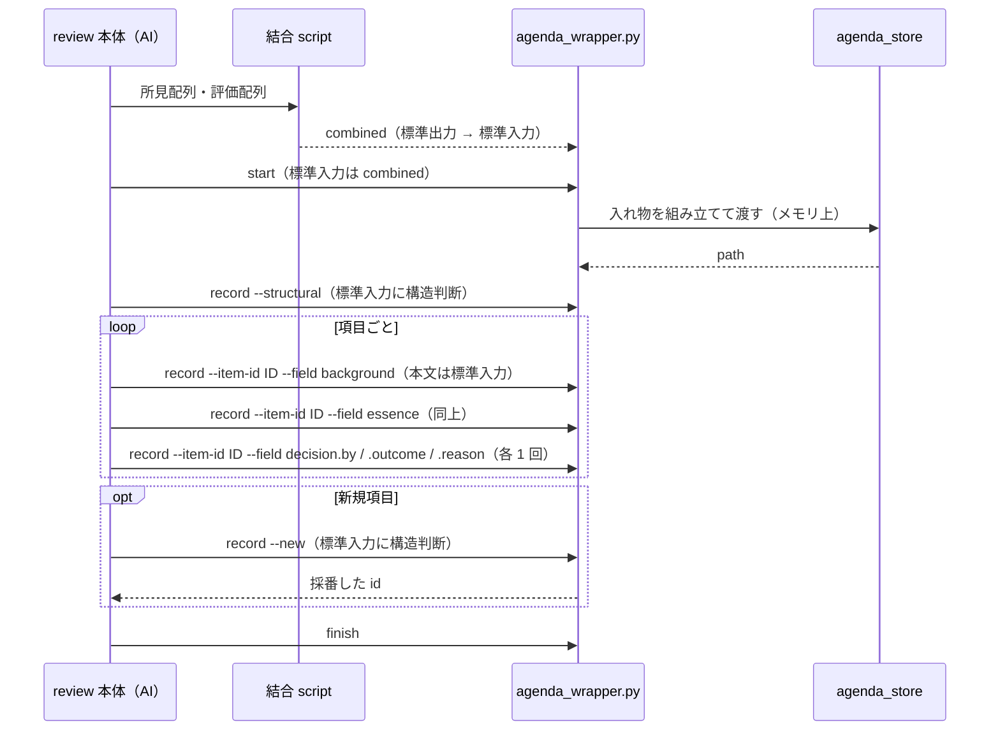

# DES-080 agenda 設計書

## 1. 概要

[REQ-022][req022] を満たすために、既存設計（[DES-075][des075] / [DES-077][des077] / [consult:DES-078][des078]）から変える点だけを定める。

### 1.1 本設計が拠って立つ考え

**AI が組み立てるものを無くし、script が作る。** 原則そのものは [決定論的な生成物は AI が作らない](../../../../plugins/forge/docs/deterministic_generation_spec.md) が定める。本設計はそれを agenda に当てたものであり、個々の変更はその帰結である。

現行は AI が JSON の構造を組み立て、ファイル名と置き場を組み立て、ファイルを書いている。AI が作るから誤りうる。誤りうるから受け取る側に検査が要る。検査が要るから許可キー集合が要る。許可キー集合があるから、そこに無いデータが落ちる——これが本 feature の直す対象である。script が作れば、この連鎖は根から消える。

### 1.2 変更の一覧

| 変更                                                 | 対応する要件              |
| ---------------------------------------------------- | ------------------------- |
| 利用者からの直接起動を停止する                       | FNC-007                   |
| 呼び出し側は値だけを渡し、構造は agenda が組み立てる | FNC-001・FNC-004・FNC-006 |
| 入力を絞り込む段階を取り除く                         | FNC-001・FNC-002          |
| 項目の識別子を agenda が採番する                     | FNC-001                   |
| 保存された値へ表示層が到達できるようにする           | FNC-003                   |
| 置き場を絶対パスで解決する                           | FNC-005                   |

### 1.3 停止する経路

現行、agenda へ入力する経路は 2 つある。レビュー本体からの委譲（review 起点）と、利用者が議論スキルを直接起動する経路（consult 起点）である。

**後者を停止する**（FNC-007）。停止であって廃止ではなく、既存の要件・設計文書はそのまま残す。

停止する箇所は 3 つある。

| 箇所                             | 止め方                                                                                     |
| -------------------------------- | ------------------------------------------------------------------------------------------ |
| `agenda_wrapper.py` の起点引数   | 受け付ける起点を review だけにする。直接起動の起点を渡すとエラーで停止する                 |
| 議論スキルの frontmatter         | 利用者から起動できる宣言とトリガー語を外し、直接起動の入口を閉じる                         |
| 利用者へ議論スキルを案内する導線 | 利用者が選べるスキルとして提示している箇所から外す。入口を閉じても、案内が残れば手順は残る |

停止した経路の手順は SKILL.md から取り除く（FNC-007）。起動されない手順が残っていると、review 起点の実行時に読み違える。**案内の導線も同じ理由で取り除く**——入口を閉じただけでは、利用者は選べる手順として提示され続け、選んだ先で停止する。

停止によって、以下は本設計の検討対象から外れる。

- 直接起動の経路で AI が組み立てた JSON をどう受け取るか
- 起点ごとに検査の要否を分けるかどうか（§2.3）
- 起点ごとの置き場と `config` の解決（[DES-075][des075] §7 のうち直接起動側）

## 2. 入力の受け取り方

### 2.1 `start` は script の出力をそのまま受け取る

現行、呼び出し側は候補 JSON をファイルへ書き、`--input-file` でそのパスを渡す。ファイルを書くのも、`structural_judgment` / `config` / `items` という入れ物を組み立てるのも呼び出し側の作業である。

**`start` は、所見と評価を結合する script の出力をそのまま標準入力から読む。入れ物（`structural_judgment` / `config` / `items`）を組み立てるのは `agenda_wrapper.py` であり、AI は組み立てない**（FNC-001・FNC-004）。

`start` が受け取るのは結合 script の出力（`combined` 配列）だけであり、そのまま `items` にする（FNC-002）。構造判断の記述は `start` では受け取らず、続く `record` の 1 回で受ける（§2.6）。**AI が書く文章はすべて標準入力で渡し、引数には載せない**（自由記述をシェル文字列へ埋め込むと引用符・記号で構文が壊れる。1 行でも同じ）。`start` の標準入力は結合 script の出力で埋まっているため、構造判断を同じ呼び出しで受けようとすると区切りが要る。区切りを持たないために呼び出しを分ける。

**結合 script は変更しない**。reviewer の戻り値と evaluator の戻り値を合成する以外を担わないことは [forge:DES-066][des066] §3.10a で決まっており、出力形式もそのまま保つ（既存の消費者である所見の分類・review 本体が影響を受けない）。

結合 script の標準出力を `agenda_wrapper.py start` の標準入力へ直接つなぐ。wrapper は入れ物を組み立てて `agenda_store` へメモリ上で渡す。中間ファイルは生まれないため、削除の対象からも外れる（FNC-004・FNC-006）。現行の wrapper が `config` 注入のために自ら書いている一時ファイル（`agenda_wrapper.py:82-88`）も無くなる。

`--input-file` は廃止する。ファイルへの書き込みは agenda 側だけが行う（FNC-004）。

`start` 直後の記録は構造判断が未記録の状態である。**構造判断が記録されるまで、項目へ値を加える呼び出しはすべて拒否する**（[agenda:REQ-019][req019] FNC-012「判定が記録されるまで、個別項目の状態遷移を拒否すること」）。現行の状態遷移は決着のときだけ `structural_judgment.recorded` を検査しているが、これは `start` が構造判断を必須にしていたため実害が無かった縮退であり、`start` から構造判断を外す本設計ではこの縮退を解く（§2.6・§6 の `agenda_schema.py`）。

### 2.2 撤廃する絞り込み

現行実装は入力を 3 段階で絞り込む。1 段目は許可集合に無いキーを拒否し、2 段目は許可されたキーだけで項目を組み立て直し、3 段目は列挙されたキーだけを差分パッチへ写す。**3 段目は拒否ではなく黙って落とすため、1 段目を緩めるだけでは解消しない。**

| 対象                                        | 位置                         | 撤廃の理由                                                                                                   |
| ------------------------------------------- | ---------------------------- | ------------------------------------------------------------------------------------------------------------ |
| `_START_ITEM_ALLOWED_KEYS` による項目の拒否 | `agenda_store.py:134` `:195` | 「あらかじめ決められた範囲」そのもの（FNC-002）                                                              |
| 新規項目の固定キーでの組み立て直し          | 同 `:216-226`                | 許可集合を緩めても、ここで渡された値が構造ごと落ちる                                                         |
| `_RECORD_ALLOWED_KEYS` による拒否           | 同 `:287-296` `:307`         | 同上（`record` 経路）                                                                                        |
| 項目パッチの列挙写し                        | 同 `:298-299` `:331-346`     | 列挙外のキーがエラーにならずに落ちる                                                                         |
| `record` 新規項目追加時の `title` 必須      | 同 `:414-421`                | [DES-075][des075] §5.1a が課すのは `structural_judgment.note` のみで、`title` は実装が独自に足した要求である |

### 2.3 入力の検査を持たない

**agenda は受け取ったデータの形式を検査しない**（§1.1）。現行の形式検査（許可キー集合・型検証）はすべて撤廃する。状態遷移の必要条件（[agenda:REQ-019][req019] FNC-008・FNC-012。§2.6 の受理条件・存在しない `--item-id` の拒否）は形式検査ではなく残る。根拠は 2 つある。

第 1 に、**入力を組み立てるのが script だからである**（§1.1）。形が壊れれば script のバグであり、テストが捕える。実行時に検査しても、直す先は同じ script である。

第 2 に、**内容の検査が上流で完結しているからである**。所見は reviewer 応答の形式検査（`parse_findings.py`）・evaluator による妥当性判定・evaluator 応答の契約検査（`parse_evaluation.py`）・所見と評価の対応検査（`combine_findings_and_evaluations.py`）を通ったものだけが渡る。agenda が同じデータを再び検査すると判定点が 2 つになり、上流を通ったものが下流で落ちる経路ができる。

この 2 つはいずれも review 起点についてのものである。**入力経路が review 起点だけになるため、根拠の及ばない経路は無い**（§1.3）。

`record` が受け取る値は AI が書く内容であり、上記のいずれにも当たらない。ここで検査を持たないのは、検査すべき構造を AI に組み立てさせないためである（§2.6）。

`config` も呼び出し側から受け取らない。値は `agenda_wrapper.py` が解決する（現行どおり。[DES-075][des075] §7 のうち review 起点のもの）。ただし `config.item_fields` は空にする——重大度が `fields` ではなく項目の直下に置かれるようになり（§4.1）、`items[].fields` に入れる属性が無くなるため。`config.severity_field` は表示層が重大度を引くキー名として保つ。

### 2.4 agenda が読むキー

agenda は `id` / `decision` / `title` / `problem` / `background` / `essence` / `recommendation` / `fields` / `last_changed_fields`、および `config.severity_field` が指すキー（§4.1）を読む。それ以外は読まない（保存はする）。

呼び出し側がこれらの名前を別の意味で使うことになった場合、agenda 側も同じ変更の中で直す。

### 2.5 `start` の項目正規化

渡された項目をそのまま保持し、agenda が読むキーのうち欠けているものだけを既定値で補う。既に値があるキーは上書きしない。

| キー                                                    | 既定値      |
| ------------------------------------------------------- | ----------- |
| `background` / `essence` / `recommendation` / `problem` | 空文字列    |
| `fields`                                                | 空の object |
| `decision`                                              | 値なし      |
| `last_changed_fields`                                   | 空の配列    |

`title` は必須にしない（FNC-001）。表示層は `title` が空のとき項目を識別できる表示を出す（§4.2）。

### 2.6 `record` は 1 回に 1 つの値を渡す

`record` が加える値（構造判断・名前・問題・背景・本質・推奨・決着の主体と結果と理由）は AI が書く内容であり、script が導けない。§2.1 のように上流の出力をつなぐことができない。

**1 回の呼び出しで 1 つの値だけを渡す。** どの値かを引数で指定し、本文を標準入力から読む。**AI が書く文章を引数に載せる経路は持たない**（§2.1）。

複数の値を 1 回で渡さないため、**値の区切りを定める必要が無い**。区切りを持てば、その規則を AI が守る工程が生まれ、守り損ねが入力の破損として現れる。JSON を組み立てさせるのも同じ理由で採らない（§1.1）。

| 呼び出し         | 引数                                     | 標準入力                               | 応答              |
| ---------------- | ---------------------------------------- | -------------------------------------- | ----------------- |
| 構造判断を記す   | 構造判断であることの指定                 | 判断の記述（改行を含んでよい）         | —                 |
| 項目に値を加える | `--item-id` と値の名前                   | 本文（改行・引用符・記号を含んでよい） | —                 |
| 新規項目を足す   | 新規であることの指定（`--item-id` 無し） | 構造判断の記述（追加後の再判断）       | **採番した `id`** |

値の名前は任意である（FNC-002。`record` でも受け付ける名前をあらかじめ決められた範囲に限らない）。agenda が読むのは §2.4 のキー（`title` / `problem` / `background` / `essence` / `recommendation` / `decision.by` / `decision.outcome` / `decision.reason` 等）であり、それ以外の名前で渡された値は読まずに保存する。`title` もここで加える（§2.5 で必須にしないだけで、渡せなくするわけではない）。

1 回の更新で加える複数の欄を欄ごとの受け渡しに分けることは [REQ-022][req022] FNC-001 が認める（[agenda:REQ-019][req019] FNC-005 の「1 回で完結」をこの粒度で差し替えている）。

**状態遷移の判定はこの形に合わせて改める**（`agenda_schema.py` を改修対象に含める。§6）。

| 呼び出し                           | 受理の条件                                                                         |
| ---------------------------------- | ---------------------------------------------------------------------------------- |
| 項目へ値を加える（どの値でも）     | 構造判断が記録済みであること（FNC-012）                                            |
| `decision.*` のいずれかを加える    | 上に加えて、その項目の `background` と `essence` が空でないこと（FNC-008）         |
| 決着として扱う（残件の計算・終了） | `decision.by` / `decision.outcome` / `decision.reason` の 3 つがすべて空でないこと |

`decision` の 3 値は 1 つずつ加えるため、揃うまでの間は項目に部分的な `decision` が保存される。この状態は未決着として扱われる（残件に数え、`finish` は削除しない）。

**値の名前の規則**は次の 2 つだけである。

- ドットで区切られた名前は一律に入れ子として解釈し、入れ子のキー単位でマージする（`decision.by` は `decision` の中の `by`。他の 2 値を消さない。現行のトップレベル全置換では 1 値ずつ積めない）
- agenda が自ら書くキー（`id` / `last_changed_fields`）と、agenda が構造を持つオブジェクトとして読むキーそのもの（`fields` / `decision`）は名前として受け付けない。受け付けると `--field id` で識別子が書き換わり §3 と両立しない

**新規項目を足す呼び出しは、標準入力に構造判断の記述を受ける。** 新規項目の追加に構造判断を伴わせるのは [DES-075][des075] §5.1a の要求であり、この 1 値がそれに当たる。項目はこの呼び出しで生成・採番され、**応答が `id` を返す**。以後この項目へ値を加える呼び出しは、返された `id` を `--item-id` に渡す。`id` を返さなければ、呼び出し側は次の値をどの項目へ加えるかを指定できず、新規の指定を繰り返せばそのたびに別の項目が採番されてしまう。

**`--item-id` に存在しない `id` を渡した呼び出しは拒否する。** 現行の upsert（`agenda_store.py:360-384`）は無ければ新規項目を組み立てるが、この経路を残すと構造判断を伴わずに項目が生まれ、§5.1a を素通りする。新規項目が生まれるのは上表の「新規項目を足す」呼び出しだけとする。

背景と本質のように複数を加えるときは、複数回呼ぶ。1 回の呼び出しは 1 つの値を項目パッチとする。

- 構造判断はレコード直下へ記録する（[DES-075][des075] §6.1 の 2 経路の振り分けは変えない）
- `last_changed_fields` には、その呼び出しで加えたキーを記録する。構造判断は項目パッチではないため含まれない

### 2.7 呼び出しの順序

## 3. 項目の識別子

`id` は呼び出し側が渡していなければ **agenda が採番する**。渡されていればその値を使う。呼び出し側は識別子を持たない（FNC-001）。

**`record` の `--item-id` も必須にしない。** 現行は必須であり（`agenda_store.py:388`）、新規項目を追加する経路では呼び出し側が識別子を作らされる。新規項目を足す呼び出し（§2.6）では agenda が採番し、**採番した `id` を応答で返す**（呼び出し側が以後の値をこの項目へ加えるために要る）。

`id` の用途は記録 1 件の中に閉じている——項目の特定・未決着の列挙・表示とアンカー。呼び出し側が持つ値である必要がない。

採番はその記録の中で既存の項目と衝突しない連番とし、ゼロ埋め 2 桁で表す（[DES-075][des075] §4 のスキーマ例・[DES-077][des077] §3 のテンプレート例と同じ形）。既存項目の `id` がこの形でない場合も、衝突しない値を選ぶ。

## 4. 表示層

### 4.1 重大度の探索

現行の `_severity_value()`（`agenda_render.py:41-56`）は `item["fields"]` の中だけを見る。呼び出し側が作り替えずに渡すと重大度は項目の直下に来るため、この経路では到達できない。

**`fields` の中を先に、無ければ項目の直下を探索する。** `fields` を先に見るのは、現行の記録が読めなくなる経路を作らないためである。値が無いと判定する条件（空文字・`0`・`false` を「無い」とみなす現行の扱い）は変えず、`fields` 側が「無い」なら直下を見る。

キー名を決め打ちしない点は変えない（`config.severity_field` が指すキーを引く。[DES-077][des077] §3.1a）。

### 4.2 `title` が空の場合

一覧表・項目見出しは `title` が空であれば `id` を表示に用いる。項目を識別できない空欄を出さない。

### 4.3 所見の本文が提示から消えないようにする

表示層は「問題」欄を `problem` から出す（[DES-077][des077] §3）。一方、レビュー起点で渡される所見の本文は `text` という名前を持つ。作り替えをやめると名前が食い違い、「問題」欄が空になる（FNC-003 に反する）。

**`agenda_wrapper.py` が `items` を組み立てる際に、`text` の値を `problem` にも置く。** wrapper は review 起点の事情（置き場・`config`）を閉じ込める場所として既にあり（§2.1）、所見の本文が `text` という名前で来ることも review 起点の事情である。置くのは script であり、AI の作り替え（FNC-001）には当たらない。

`text` を付けている `parse_findings.py` 側を改名する案は採らない。同 script は全レビューバックエンド共通の部品であり、agenda の表示欄の名前に合わせるために共用部品を書き換えることになる。

agenda 機構本体（`agenda_store` / `agenda_render`）に読み替え表を持たせる案も採らない。呼び出し側が増えるたびに本体へ表が積み上がる。起点の事情は wrapper に閉じる。

### 4.4 決着の判定を記録側と揃える

現行の表示層は `decision.outcome` が空でなければ状態欄に結果を出す（`agenda_render.py:85-88` `:124-129`）。§2.6 で決着を 1 値ずつ積むようにすると、`outcome` を加えた後 `reason` を加える前の記録は、記録側では未決着（残件に数える）なのに提示では決着として出る。

**表示層の決着判定も「3 値がすべて空でない」に揃える。** 揃うまでは未決着として表示する（[agenda:REQ-021][req021] FNC-003「提示の内容と記録の内容が食い違わないこと」）。

### 4.5 増えた値の表示

**本設計では扱わない。** 保存された未知のキーを提示にどう反映するかは別途扱う。表示層は現行が示している内容を示し続ける。

## 5. 置き場の解決

現行は `agenda_wrapper.py:42` がプロジェクトルートからの相対パス文字列を返し、それがそのまま `Path()` に渡る。基準が呼び出し元の作業ディレクトリになるため、**どこから呼んだかで記録の場所が変わる**。しかも別の場所に作られても成功が返るため、誤りが表に出ない。

**プロジェクトルートを `git rev-parse --show-toplevel` で特定し、絶対パスとして置き場を解決する。** 呼び出し元がどこにいても記録は 1 箇所に定まる（FNC-005）。

`__file__` から辿る方式は採らない。plugin は利用者環境のキャッシュへ配置されるため、辿り着くのは plugin のディレクトリであってプロジェクトではない。

git 管理下でない場所から呼ばれた場合は解決できないため、エラーを返して停止する（既定の場所へ落とさない）。

置き場をどこにするかは変えない（[DES-075][des075] §7 のまま）。変えるのは、そこへ確実に到達することである。

## 6. 使用する既存コンポーネント

| コンポーネント           | ファイルパス                                                                                             | 本設計での扱い                                                                                                                                                                                                                                                                                                   |
| ------------------------ | -------------------------------------------------------------------------------------------------------- | ---------------------------------------------------------------------------------------------------------------------------------------------------------------------------------------------------------------------------------------------------------------------------------------------------------------- |
| `agenda_store.py`        | `plugins/forge/scripts/agenda/agenda_store.py`                                                           | 改修（§2・§3。`start` / `record` の CLI を廃止し、この 2 つは関数呼び出し専用にする。`pending` / `next` / `finish` の CLI は AI の文章を受け取らないため残す）                                                                                                                                                   |
| `agenda_render.py`       | `plugins/forge/scripts/agenda/agenda_render.py`                                                          | 改修（§4.1・§4.2・§4.4）                                                                                                                                                                                                                                                                                         |
| `agenda_wrapper.py`      | `plugins/forge/scripts/agenda/agenda_wrapper.py`（移動。現行は `plugins/forge/skills/consult/scripts/`） | 改修（§1.3・§2.1・§2.6・§4.3・§5。入れ物の組み立て・標準入力の受け取り・`--input-file` と `--item-id` 必須の撤廃・一時ファイルの廃止・`text` → `problem` の詰め替え）。[REQ-022][req022] §3 が呼び出し側ではなく agenda に属すると定めたため、agenda 本体と同じ場所へ移す。テストも `tests/forge/agenda/` へ移す |
| reviewer 応答の解釈      | `plugins/forge/scripts/review/parse_findings.py`                                                         | 変更しない（§4.3。全バックエンド共通の部品）                                                                                                                                                                                                                                                                     |
| 所見と評価の結合         | `plugins/forge/skills/review/scripts/combine_findings_and_evaluations.py`                                | 変更しない（§2.1。出力をそのまま `start` へつなぐ）                                                                                                                                                                                                                                                              |
| 議論スキル               | `plugins/forge/skills/consult/SKILL.md`                                                                  | 改修（§1.3 の停止・§2.1 と §2.6 により候補 JSON を書く手順が消える・wrapper の移動先へ呼び出しパスを追随）                                                                                                                                                                                                       |
| 討議ファイルテンプレート | `plugins/forge/skills/consult/assets/discussion_file_template.md`                                        | 削除（表示テンプレートへ転用済みで参照されていない。§1.3 で入口も閉じる）                                                                                                                                                                                                                                        |
| `agenda_schema.py`       | `plugins/forge/scripts/agenda/agenda_schema.py`                                                          | 改修（§2.6 の受理条件。構造判断未記録時の全項目パッチ拒否・`decision.*` の個別受理・3 値そろいの判定）                                                                                                                                                                                                           |
| 議論スキルへの案内導線   | `plugins/forge/skills/help/SKILL.md` ほか、利用者へ議論スキルを選択肢として提示している箇所              | 改修（§1.3。利用者が選べるスキルの一覧・引数の案内・起動手順から外す）                                                                                                                                                                                                                                           |

新規モジュールは作らない（wrapper の移動は既存モジュールの置き場の変更である）。入力を受理する経路は `agenda_wrapper.py` の 1 つに保つ。

## 7. テスト設計

- **`agenda_store.py`**: agenda が知らないキーを含む項目が `start` で保存されること / 同じく `record` で保存されること（**列挙外のキーが黙って落ちないこと**）/ `title` が無い項目が `start` でも `record` でも受理されること / `id` が無い項目に採番されること / 新規項目を足す `record` が受理され、**採番した `id` が応答に含まれること** / **存在しない `--item-id` を渡した `record` が拒否されること** / 渡された `id` が保たれること / `record` が 1 回の呼び出しで 1 つの値を受け取ること / `record` を複数回呼んだとき先に加えた値が残ること / `record` で `title` を加えられること / **構造判断が未記録のまま項目へ値を加えようとすると拒否されること**（決着に限らない）/ `background` か `essence` が空のまま `decision.*` を加えようとすると拒否されること / `decision.*` を 1 つずつ加えても先に加えた値が消えないこと / 3 値が揃うまで残件に数えられ `finish` が削除しないこと / 3 値が揃った時点で決着として扱われること
- **`agenda_schema.py`**: 上記の受理条件（§2.6 の表）が不足フィールド名の列挙として返ること
- **`agenda_wrapper.py`（§4.3）**: `combined` の各要素の `text` が `problem` にも置かれること
- **`agenda_render.py`**: 重大度が `fields` の中にある場合と項目の直下にある場合の双方でバッジが出ること / `fields` 側が空値のとき直下が使われること / agenda が知らないキーが保存されていても生成が失敗しないこと / `title` が空のとき `id` が表示に使われること / `decision` の 3 値が揃うまで未決着として表示され、揃った時点で決着として表示されること（§4.4）
- **`agenda_wrapper.py`**: 呼び出し元の作業ディレクトリを変えても同じ絶対パスが返ること / git 管理下でない場所からの呼び出しがエラーになること / **停止した起点を渡すとエラーで停止し、記録が作られないこと**（§1.3）/ `start` が標準入力の結合出力（`combined`）から入れ物を組み立てること / 一時ファイルを書かないこと / `record` の本文（構造判断を含む）を標準入力から受け取ること / AI が書く文章を受け取る引数を持たないこと
- **`finish`**: 記録に属するものがすべて消えること
- **統合**: 結合 script の標準出力（無変更）を `agenda_wrapper.py start` の標準入力へつなぎ、保存された記録から現行と同じ提示が生成されること

撤廃した拒否を固定している既存テストは、撤廃に合わせて改める。

## 8. 変更前の記録の扱い

本変更は受け付けるキーを増やす方向であり、変更前に保存された記録（キーがより少ない）は改修後の実装でそのまま読める。読み出しのための移行処理・スキーマバージョン判定は設けない。

[req022]: ../requirements/REQ-022_agenda_spec.md
[req019]: ../../consult/agenda/requirements/REQ-019_agenda_record.md
[req021]: ../../consult/agenda/requirements/REQ-021_agenda_display.md
[des075]: ../../consult/agenda/design/DES-075_agenda_mechanism_design.md
[des077]: ../../consult/agenda/design/DES-077_agenda_display_design.md
[des078]: ../../consult/design/DES-078_consult_dialogue_flow_design.md
[des066]: ../../forge/design/DES-066_review_body_design.md
